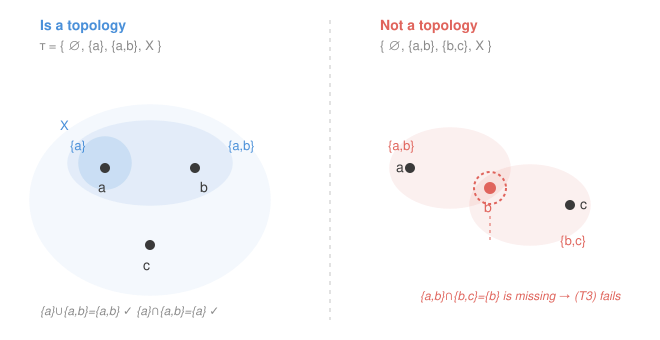

# Topology · Lesson 1.3: Topological spaces — the axioms

> ⏱ ~15 min · Module 1: Spaces · Builds on: [1.2 Open sets and the metric topology](01-02-open-sets-metric-topology.md) · Unlocks: [1.4 Bases, subbases, and comparing topologies](01-04-bases-and-subbases.md)

## Why this matters

In [1.2](01-02-open-sets-metric-topology.md) you proved that the open sets of a metric space obey three rules — closure under arbitrary unions, finite intersections, and containing $\varnothing$ and the whole space — and that continuity and limits could be phrased using *only* those open sets, never the distance itself. This lesson takes the daring next step: throw the metric away and **keep only the three rules as the definition**. What survives is topology. The astonishing payoff, cashed out over the rest of this course, is that continuity, limits, connectedness, and compactness all run on those three rules alone — so the same theorems will cover the real line, spaces of functions, and the surface of a doughnut at once. And some of the most useful spaces (like the cofinite topology below) come from no metric at all.

## The idea

Forget distance. A **topology** on a set $X$ is nothing but a *decision about which subsets get to be called "open."* You, the mathematician, hand-pick a collection of subsets and declare them open — subject to three sanity conditions that make the word "open" behave the way it did in the metric world.

Here is the whole game in one breath: the empty set and everything are open; gluing together open sets (any number, even infinitely many) keeps you open; and overlapping *finitely many* open sets keeps you open. That's it. Any collection of subsets passing those three checks *is* a topology, and $X$ paired with it *is* a space you can do geometry on.

The freedom here is the point. On the same three-element set $\{a,b,c\}$ you can make many different topologies — declaring different subsets open — and each is a genuinely different "shape," even though there's no distance anywhere in sight. "Open" stopped being a property a set *has* and became a role you *assign* it.

## The formal version

**Definition (topology).** A **topology** on a set $X$ is a collection $\tau$ of subsets of $X$ — its members are called the **open sets** — such that:

- **(T1)** $\varnothing \in \tau$ and $X \in \tau$.
- **(T2)** If $\{U_i\}_{i\in I} \subseteq \tau$ is *any* family of open sets (the index set $I$ may be infinite, even uncountable), then $\bigcup_{i\in I} U_i \in \tau$.
- **(T3)** If $U_1,\dots,U_n \in \tau$ is a *finite* list of open sets, then $\bigcap_{k=1}^{n} U_k \in \tau$.

The pair $(X,\tau)$ is a **topological space**.

> **In words (T1):** the empty set and the whole space are always open. **(T2):** any union of open sets — however many — is open. **(T3):** the overlap of finitely many open sets is open (finitely many only; infinitely many can fail).

Two remarks before the zoo. First, $\tau$ is a set *whose elements are themselves sets* — a set of subsets of $X$. Second, (T3) follows from its two-set case by induction: if the intersection of any two open sets is open, then so is any finite intersection. So in practice you only ever check "$U\cap V$ open."

## Picture

The loops are the chosen open sets. On the left, every union and every intersection of loops is again a loop — a topology. On the right, two loops overlap in $\{b\}$, but $\{b\}$ was never declared open, so (T3) fails: *not* a topology. This is the visual "is it a topology?" test — chase unions and finite intersections and check they never escape your collection.

## Worked examples

**Example 1 (the zoo — five topologies, no metric required).** Fix a set $X$.

- **Discrete topology:** $\tau = \mathcal{P}(X)$, *every* subset is open. All three axioms are trivial (any union or intersection of subsets is a subset). This is the *finest* possible topology — the most open sets there can be.
- **Indiscrete (trivial) topology:** $\tau = \{\varnothing, X\}$, only those two are open. (T1) holds by fiat; every union or intersection of $\varnothing$'s and $X$'s is again $\varnothing$ or $X$. This is the *coarsest* possible — the fewest open sets allowed.
- **Standard topology on $\mathbb{R}$:** $U$ is open iff around each of its points sits an open interval inside $U$ — exactly the metric topology from [1.2](01-02-open-sets-metric-topology.md). It sits strictly between discrete and indiscrete.
- **Sierpiński space:** $X=\{0,1\}$ with $\tau=\{\varnothing,\{1\},\{0,1\}\}$. Check: $\varnothing,X\in\tau$ ✓; the only nontrivial union $\{1\}\cup\varnothing=\{1\}\in\tau$ ✓; the only nontrivial intersection $\{1\}\cap\{0,1\}=\{1\}\in\tau$ ✓. A two-point space where one point is "open" and the other isn't — the smallest space that isn't just discrete or indiscrete.
- **A topology on three points, drawn out:** $X=\{a,b,c\}$, $\tau=\{\varnothing,\ \{a\},\ \{a,b\},\ X\}$ (the left panel above). Unions: $\{a\}\cup\{a,b\}=\{a,b\}\in\tau$. Intersections: $\{a\}\cap\{a,b\}=\{a\}\in\tau$. All axioms hold — a valid topology carrying no distance at all.

**Example 2 (why you'd care — the cofinite topology, and a first non-metric space).** Let $X$ be any set. Declare
$$\tau_{\text{cof}} = \{\,\varnothing\,\} \cup \{\,U \subseteq X : X\setminus U \text{ is finite}\,\}.$$
In words: a set is open iff it is empty, or it leaves out only finitely many points. Let's *prove* this is a topology.

- **(T1)** $\varnothing\in\tau_{\text{cof}}$ by fiat; and $X\setminus X=\varnothing$ is finite, so $X\in\tau_{\text{cof}}$. ✓
- **(T2)** Take open sets $\{U_i\}$, at least one of them (say $U_{i_0}$) nonempty, so $X\setminus U_{i_0}$ is finite. By De Morgan,
$$X\setminus\bigcup_i U_i = \bigcap_i (X\setminus U_i) \subseteq X\setminus U_{i_0},$$
a subset of a finite set, hence finite. So the union is open. (If every $U_i=\varnothing$, the union is $\varnothing$, open.) ✓
- **(T3)** For finitely many nonempty open $U_1,\dots,U_n$, again by De Morgan
$$X\setminus\bigcap_{k=1}^n U_k = \bigcup_{k=1}^n (X\setminus U_k),$$
a *finite* union of finite sets, hence finite. So the intersection is open. ✓ *(Notice where finiteness is essential: an infinite union of finite sets can be all of $X$, which is exactly why (T3) is capped at finitely many.)*

So $\tau_{\text{cof}}$ is a topology. When $X$ is **infinite** — say $X=\mathbb{Z}$ — it is a strange one: any two nonempty open sets *must* intersect (each omits only finitely many points, so together they still leave $X$ almost entirely covered). No metric can produce this: in a metric space you can always fence two distinct points into disjoint open balls (take radius half their distance), but the cofinite topology on an infinite set refuses to separate anything. So **cofinite on $\mathbb{Z}$ is not metrizable** — a topology that comes from no distance whatsoever. That gap is the whole reason topology is strictly bigger than metric geometry, and Module 5 will name the property it's missing (Hausdorffness).

## Comparing topologies

Two topologies on the *same* set can be ranked by how many sets they call open. If $\tau_1 \subseteq \tau_2$ — every $\tau_1$-open set is also $\tau_2$-open — we say $\tau_1$ is **coarser** than $\tau_2$, and $\tau_2$ is **finer** than $\tau_1$.

> In words: finer = more open sets (finer resolution, more distinctions you can draw); coarser = fewer.

On any $X$ the **indiscrete** topology is the coarsest possible (nothing beats $\{\varnothing,X\}$ for fewness) and the **discrete** is the finest (nothing beats "every subset"). Every other topology on $X$ sits somewhere between them: $\{\varnothing,X\}\subseteq \tau \subseteq \mathcal{P}(X)$. Not every pair is comparable, though — two topologies can each contain a set the other lacks, so "finer/coarser" is a *partial* order, not a ranking of all of them. Lesson [1.4](01-04-bases-and-subbases.md) turns this comparison into a working tool.

## Watch out

- You might think "open" is an intrinsic property of a set, but it is now a **choice**. The very same subset $\{1\}$ of $\{0,1\}$ is open in Sierpiński space, open in the discrete topology, and *not* open in the indiscrete one. Always ask "open in *which* topology?" — a set alone has no openness.
- You might think intersections of open sets are open, full stop — but (T3) is **finite** intersections only. On $\mathbb{R}$, each $\left(-\tfrac1n,\tfrac1n\right)$ is open, yet $\bigcap_{n=1}^{\infty}\left(-\tfrac1n,\tfrac1n\right)=\{0\}$ is not. (Same failure you met in the metric case in [1.2](01-02-open-sets-metric-topology.md); the axioms bake the restriction in on purpose.)
- You might think a topology is a collection of *points* or a single set — but $\tau$ is a **set of sets**: its elements are the open subsets of $X$. "$U\in\tau$" means "$U$ is an open set," while "$x\in U$" means "$x$ is a point of that set." Keep the two membership levels straight.
- You might think indiscrete and cofinite are silly degenerate cases to ignore — but they are *bona fide* topologies, and they're where your metric intuition breaks. They're the stress tests that show which theorems really need distance and which don't.

## One-liner

> A topology is just a decision about which sets are open — closed under all unions and finite intersections, containing $\varnothing$ and $X$ — and that single decision is enough to rebuild all of continuity, limits, connectedness, and compactness.

## Problems

**P1 (🟢)** Let $X=\{a,b,c\}$. For each collection, decide whether it is a topology on $X$; if not, name the axiom that fails and the specific sets that break it.
(i) $\tau=\{\varnothing,\ \{a\},\ \{b\},\ X\}$.
(ii) $\tau=\{\varnothing,\ \{a\},\ \{a,b\},\ \{a,c\},\ X\}$.
(iii) $\tau=\{\varnothing,\ \{a,b\},\ \{b,c\},\ X\}$.

**P2 (🟡)** Let $X$ be an infinite set and let $\tau_{\text{cof}}$ be its cofinite topology. Show that no two nonempty open sets are disjoint. Then explain in one sentence why this means the topology is *not* the discrete topology (assuming $X$ has at least two points).

**P3 (🔴, optional)** On an infinite set $X$, define the **cocountable topology**: $U$ is open iff $U=\varnothing$ or $X\setminus U$ is countable. Prove this is a topology, pinpointing the exact step where "countable" (rather than "finite") is what makes the axioms work — and the exact step where it would fail if you tried "uncountable complement" instead.

Solutions

**P1** (i) **Not a topology.** (T2) fails: the union $\{a\}\cup\{b\}=\{a,b\}$ is not in $\tau$. (The intersection $\{a\}\cap\{b\}=\varnothing$ is fine — so it's specifically the union axiom that breaks.)
(ii) **Is a topology.** Check every pair. Unions: $\{a\}\cup\{a,b\}=\{a,b\}$ ✓, $\{a\}\cup\{a,c\}=\{a,c\}$ ✓, $\{a,b\}\cup\{a,c\}=X$ ✓. Intersections: $\{a,b\}\cap\{a,c\}=\{a\}$ ✓, and every other pair meets in $\varnothing$, $\{a\}$, or itself. With $\varnothing,X\in\tau$, all three axioms hold.
(iii) **Not a topology.** (T3) fails: $\{a,b\}\cap\{b,c\}=\{b\}$, which is not in $\tau$ (this is exactly the right-hand panel of the Picture). Unions are fine here — $\{a,b\}\cup\{b,c\}=X\in\tau$ — so it's the finite-intersection axiom that breaks.

**P2** Let $U,V$ be nonempty and open, so $X\setminus U$ and $X\setminus V$ are both finite. If they were disjoint, $U\cap V=\varnothing$, i.e. $X=X\setminus(U\cap V)=(X\setminus U)\cup(X\setminus V)$, a union of two finite sets — hence $X$ would be finite. That contradicts $X$ infinite. So $U\cap V\neq\varnothing$: no two nonempty open sets are disjoint. Consequently it is *not* the discrete topology: for two distinct points $x\neq y$, the discrete topology has $\{x\}$ and $\{y\}$ open and disjoint, which the cofinite topology forbids — so $\{x\}$ isn't even open here (its complement is infinite).

**P3** Write $\tau_{\text{coc}}=\{\varnothing\}\cup\{U:X\setminus U\text{ countable}\}$.
- **(T1)** $\varnothing\in\tau_{\text{coc}}$ by fiat; $X\setminus X=\varnothing$ is countable, so $X\in\tau_{\text{coc}}$.
- **(T2)** For open $\{U_i\}$ with some $U_{i_0}\neq\varnothing$: $X\setminus\bigcup_i U_i=\bigcap_i(X\setminus U_i)\subseteq X\setminus U_{i_0}$, a subset of a countable set, hence countable. Open.
- **(T3)** For finitely many nonempty open $U_1,\dots,U_n$: $X\setminus\bigcap_{k}U_k=\bigcup_{k}(X\setminus U_k)$, a **finite** union of countable sets, which is countable (a finite — indeed countable — union of countable sets is countable, from `real-analysis`). Open.
The word "countable" carries (T3): a *finite* union of countable complements stays countable. It would break for "uncountable complement," because there the intersection step needs the union of two uncountable sets to be uncountable — true — but the *union* axiom (T2) collapses: $\bigcup_i U_i$ could have complement $\bigcap_i(X\setminus U_i)$ that is a shrinking intersection dropping *below* uncountable (e.g. down to a single point or $\varnothing$), so the union might fail to be open. The countable version dodges this because "subset of countable is countable" keeps (T2) safe. *(Even sharper: the reason finite/countable both work is that they're closed under the operations the axioms demand — $\varnothing$/finite-union for (T3), and "subset-of" for (T2) — whereas "uncountable" is not closed under passing to subsets.)*

## Flashback

**From Lesson 1.2 (Open sets and the metric topology):** In $\mathbb{R}^2$ with the Euclidean metric $d(x,y)=\sqrt{(x_1-y_1)^2+(x_2-y_2)^2}$, prove that the open half-plane $H=\{(x_1,x_2):x_1>0\}$ is an open set — directly, by producing for each of its points an open ball contained in $H$.

Solution

Take any point $p=(p_1,p_2)\in H$, so $p_1>0$. Set the radius $r=p_1>0$ and consider the open ball $B(p,r)=\{q:d(p,q)<r\}$. For any $q=(q_1,q_2)\in B(p,r)$,
$$|q_1-p_1|\le\sqrt{(q_1-p_1)^2+(q_2-p_2)^2}=d(p,q)<r=p_1,$$
so $q_1-p_1>-p_1$, i.e. $q_1>0$, meaning $q\in H$. Thus $B(p,r)\subseteq H$. Since every point of $H$ has an open ball around it staying inside $H$, $H$ is open. (This is the [1.2](01-02-open-sets-metric-topology.md) definition of open in a metric space — the very fact whose three consequences we just promoted to *axioms* this lesson.)

## Connections

- **Backward:** the three axioms are exactly the three properties you *proved* for metric-space open sets in [1.2](01-02-open-sets-metric-topology.md). Every metric space $(X,d)$ becomes a topological space by taking $\tau$ = its metric-open sets; topology keeps the conclusions and discards the hypothesis (the distance).
- **Forward:** checking these axioms by hand gets tiresome, so [1.4](01-04-bases-and-subbases.md) shows how to *generate* a whole topology from a small family (a basis) — and turns "finer vs. coarser" into a usable comparison. [1.5](01-05-closure-interior-boundary.md) then computes the interior, closure, and boundary of sets living in an arbitrary topology, and [2.1](02-01-continuity-and-homeomorphisms.md) finally defines continuity as "preimage of open is open," using nothing but $\tau$.
- **Sideways:** the cofinite topology's failure to separate points is your first encounter with the **separation hierarchy** of Module 5 — the metrizability gap flagged here is exactly what the Urysohn metrization theorem (Lesson 5.4) later resolves. The "set of sets" viewpoint also echoes `real-analysis`'s σ-algebras, where a similarly axiomatized collection of subsets (closed under complements and *countable* unions) founds measure theory — same move, different closure rules.
