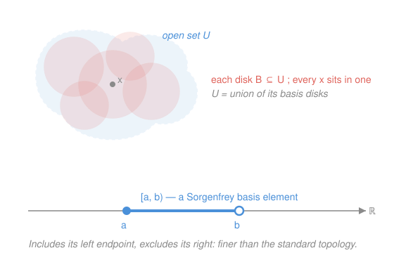

# Topology · Lesson 1.4: Bases, subbases, and comparing topologies

> ⏱ ~15 min · Module 1: Spaces · Builds on: [1.3 Topological spaces: the axioms](01-03-topological-spaces-axioms.md) · Unlocks: [1.5 Interior, closure, boundary, and limit points](01-05-closure-interior-boundary.md)

## Why this matters

A topology on $\mathbb{R}$ has uncountably many open sets — you can never list them all, so you can never *define* the topology by listing. Yet everyone happily says "the open sets of $\mathbb{R}$ are unions of open intervals." That sentence is a **basis**: a small, describable menu of building-block sets from which every open set is assembled. Bases are how topologies actually get specified in practice (the product topology, the metric topology, the Sorgenfrey line all arrive this way), and the **basis criterion** turns the vague question "is this topology bigger than that one?" into a finite, checkable condition at each point.

## The idea

In [1.3](01-03-topological-spaces-axioms.md) a topology was a family of open sets closed under arbitrary unions and finite intersections. Producing that whole family by hand is hopeless. So instead you hand over a starter kit of open sets and agree on one rule: **an open set is anything you can build as a union of starter pieces.**

For $\mathbb{R}$ the starter kit is the open intervals $(a,b)$. Every open set — however weird — is a union of them: sit at any point of your set, and a tiny interval around it fits inside. That "a building block fits around every point" is the entire content of being open. The starter kit is the **basis**; its members are **basis elements**.

Two constraints keep the machine honest. First, the basis must *cover* $X$ — every point needs at least one block sitting on it, or that point could never be in any open set. Second, where two blocks overlap, the overlap must itself be paveable by blocks — otherwise a union of two basis elements might fail to be a union of basis elements, and "open" would not survive intersection. Those two constraints are exactly the basis axioms.

A **subbasis** is even lazier: hand over *any* family at all, throw in all their finite intersections, and *that* becomes a basis. It is the cheapest possible way to generate a topology — you specify a few sets and let intersections-then-unions do the rest.

## The formal version

Let $X$ be a set. A collection $\mathcal{B}$ of subsets of $X$ is a **basis** if:

- **(B1)** every $x\in X$ lies in some $B\in\mathcal{B}$; and
- **(B2)** if $x\in B_1\cap B_2$ with $B_1,B_2\in\mathcal{B}$, then there is some $B_3\in\mathcal{B}$ with $x\in B_3\subseteq B_1\cap B_2$.

> In words: (B1) the blocks cover everything; (B2) inside any overlap of two blocks, every point has a *whole block* around it that stays in the overlap.

The **topology generated by $\mathcal{B}$** is
$$\tau=\{\,U\subseteq X : \text{for every } x\in U \text{ there is } B\in\mathcal{B} \text{ with } x\in B\subseteq U\,\}.$$

> In words: $U$ is open iff every one of its points has a basis block sitting around it inside $U$.

**Equivalent description.** $U\in\tau$ iff $U$ is a union of basis elements. (Given the "block around every point" version, take the union of one such block per point of $U$; conversely a union of blocks obviously has a block around each point.)

**Claim: $\tau$ really is a topology.** $\varnothing$ is vacuously in $\tau$; $X\in\tau$ by (B1). Unions: if each $U_\alpha\in\tau$ and $x\in\bigcup_\alpha U_\alpha$, then $x\in U_\alpha$ for some $\alpha$, giving a block $x\in B\subseteq U_\alpha\subseteq\bigcup_\alpha U_\alpha$. Finite intersections (it suffices to do two): let $U_1,U_2\in\tau$ and $x\in U_1\cap U_2$. Pick blocks $x\in B_1\subseteq U_1$ and $x\in B_2\subseteq U_2$. Then $x\in B_1\cap B_2$, so by **(B2)** there is $B_3$ with $x\in B_3\subseteq B_1\cap B_2\subseteq U_1\cap U_2$. So $U_1\cap U_2\in\tau$. This is exactly where (B2) earns its place. $\blacksquare$

**Subbasis.** A **subbasis** $\mathcal{S}$ is *any* collection of subsets of $X$ whose union is $X$. The collection of all **finite intersections** $S_1\cap\cdots\cap S_n$ (with $S_i\in\mathcal{S}$) forms a basis $\mathcal{B}$, and the topology it generates is the **smallest topology containing $\mathcal{S}$**.

> In words: to make a topology out of a handful of sets, first close under finite intersection (that's your basis), then under union. You get the coarsest topology in which all your chosen sets are open.

## Picture

## Worked examples

**Example 1 (mechanical — intervals generate the standard topology).** Let $\mathcal{B}=\{(a,b):a<b\}$ on $X=\mathbb{R}$. Check the axioms. **(B1):** any $x$ lies in $(x-1,x+1)$. ✓ **(B2):** the intersection of two open intervals is again an open interval (or empty), $(a_1,b_1)\cap(a_2,b_2)=(\max\{a_1,a_2\},\min\{b_1,b_2\})$; if $x$ is in it, that very interval serves as $B_3$. ✓ The generated topology is the **standard topology**: $U$ is open iff around each of its points sits a small open interval inside $U$ — the ε-picture from `real-analysis`, now read off a basis.

**Example 2 (why you'd care — the Sorgenfrey line is strictly finer).** Let $\mathcal{B}_\ell=\{[a,b):a<b\}$, the **half-open** intervals. (B1) and (B2) check just as above ($[a_1,b_1)\cap[a_2,b_2)$ is again a set of the form $[a,b)$ or empty). The generated topology $\tau_\ell$ is the **lower-limit** or **Sorgenfrey topology**. It is genuinely different: in $\tau_\ell$ the set $[0,1)$ is open (it *is* a basis element), but in the standard topology $[0,1)$ is **not** open — no open interval around $0$ stays inside $[0,1)$, since any $(0-\varepsilon,0+\varepsilon)$ spills to the left of $0$. So $\tau_\ell$ contains an open set the standard topology lacks: it is **strictly finer**. We prove the inclusion cleanly below with the basis criterion. (Open balls play the same generating role in *any* metric space — the metric topology of [1.2](01-02-open-sets-metric-topology.md) is exactly the topology with basis $\{B(x,r)\}$; the reason (B2) holds there is that inside any ball you can fit a smaller ball around each interior point.)

## The basis criterion (comparing topologies)

Recall from [1.3](01-03-topological-spaces-axioms.md): $\tau'$ is **finer** than $\tau$ (equivalently $\tau$ is **coarser**) if $\tau\subseteq\tau'$ — $\tau'$ has *more* open sets. Comparing two topologies through their bases needs only a local check.

**Basis criterion.** Let $\mathcal{B}$ generate $\tau$ and $\mathcal{B}'$ generate $\tau'$ on the same set $X$. Then
$$\tau\subseteq\tau' \iff \text{for every } B\in\mathcal{B} \text{ and every } x\in B,\ \text{there is } B'\in\mathcal{B}' \text{ with } x\in B'\subseteq B.$$

> In words: $\tau'$ is finer exactly when its blocks are *fine enough* to nestle inside every block of $\tau$ around every point — more (smaller) blocks near each point means more open sets.

**Proof.** ($\Rightarrow$) Each $B\in\mathcal{B}$ is $\tau$-open, hence $\tau'$-open by $\tau\subseteq\tau'$; so for $x\in B$ some $B'\in\mathcal{B}'$ has $x\in B'\subseteq B$ by the definition of $\tau'$. ($\Leftarrow$) Take any $U\in\tau$ and any $x\in U$. There is $B\in\mathcal{B}$ with $x\in B\subseteq U$; by hypothesis there is $B'\in\mathcal{B}'$ with $x\in B'\subseteq B\subseteq U$. So every point of $U$ has a $\mathcal{B}'$-block inside $U$, i.e. $U\in\tau'$. Thus $\tau\subseteq\tau'$. $\blacksquare$

**Sorgenfrey $\supsetneq$ standard, cleanly.** Let $\tau$ = standard (basis $\{(a,b)\}$), $\tau_\ell$ = Sorgenfrey (basis $\{[a,b)\}$). Given a standard block $(a,b)$ and $x\in(a,b)$, the half-open block $[x,b)$ satisfies $x\in[x,b)\subseteq(a,b)$. By the criterion, $\tau\subseteq\tau_\ell$. The inclusion is **strict** because $[0,1)\in\tau_\ell\setminus\tau$ (Example 2). So $\tau_\ell\supsetneq\tau$: the Sorgenfrey line is strictly finer than the standard line. (Try the reverse direction and it fails: the standard block around $0$ inside $[0,1)$ does not exist — that failure *is* the strictness.) We meet this space again in Module 5 as the canonical example of a "nice-looking" topology that misbehaves.

## Watch out

- You might think a basis *is* the topology, but it is strictly smaller: $[0,1)\cup[2,3)$ is Sorgenfrey-open yet is not itself a basis element. The basis is the raw material; you still take unions to get all open sets.
- You might think (B2) says "the intersection of two basis elements is a basis element." It does **not** — it says each *point* of the intersection has *some* block around it inside the intersection. (For intervals the intersection happens to be a block, but for open balls in the plane it is a lens shape, no ball — yet (B2) still holds point by point.)
- You might think finer means fewer open sets because the blocks are smaller. Backwards: smaller blocks near each point let you resolve *more* sets as open, so **finer = more open sets**. And the same topology has many bases — $\{(a,b)\}$ and $\{(a,b):a,b\in\mathbb{Q}\}$ both generate the standard topology.

## One-liner

> A basis is a starter kit of open sets whose unions give all the rest; the basis criterion — can you nestle a block of one inside every block of the other? — decides finer versus coarser point by point.

## Problems

**P1 (🟢)** Let $\mathcal{B}=\big\{(a,b)\subseteq\mathbb{R} : a<b,\ a,b\in\mathbb{Q}\big\}$ — open intervals with *rational* endpoints. Verify $\mathcal{B}$ is a basis, and use the basis criterion to show it generates the **standard** topology (neither finer nor coarser).

**P2 (🟡)** Consider the subbasis $\mathcal{S}=\big\{(-\infty,b):b\in\mathbb{R}\big\}\cup\big\{(a,\infty):a\in\mathbb{R}\big\}$ on $\mathbb{R}$ (the open rays). Describe the basis of finite intersections, and show the generated topology is the standard one. (This is the shape of the product-topology subbasis you meet in [2.3](02-03-product-topology.md).)

**P3 (🔴, optional)** On $\mathbb{R}$, is the lower-limit topology $\tau_\ell$ comparable to the topology $\tau_u$ generated by the *upper*-half-open intervals $\{(a,b]\}$? That is, is one finer than the other, or are they incomparable? Prove your answer using the basis criterion in both directions.

Solutions

**P1** *Basis axioms.* (B1): any $x\in\mathbb{R}$ lies in $(a,b)$ with rational $a<x<b$ (density of $\mathbb{Q}$, from `real-analysis` [1.3]). (B2): the intersection of two rational-endpoint intervals is a rational-endpoint interval (its endpoints are a max and a min of rationals) or empty; if $x$ lies in it, that interval is the required $B_3$. So $\mathcal{B}$ is a basis; call its topology $\tau_{\mathbb{Q}}$.

*Same as standard $\tau$, both directions.* Let $\mathcal{B}_{\mathbb R}=\{(a,b):a,b\in\mathbb{R}\}$ generate $\tau$.
- $\tau\subseteq\tau_{\mathbb{Q}}$: given a real interval $(a,b)$ and $x\in(a,b)$, choose rationals $p,q$ with $a<p<x<q<b$ (density); then $x\in(p,q)\subseteq(a,b)$ with $(p,q)\in\mathcal{B}$. ✓
- $\tau_{\mathbb{Q}}\subseteq\tau$: every rational-endpoint interval is already a real interval, so trivially given $(p,q)\in\mathcal{B}$ and $x\in(p,q)$ take $B'=(p,q)\in\mathcal{B}_{\mathbb R}$. ✓

Both inclusions hold, so $\tau_{\mathbb{Q}}=\tau$. (Bonus: $\mathcal{B}$ is *countable* — the standard topology is generated by a countable basis, the "second countable" property of Module 5.)

**P2** A nonempty finite intersection of rays is either a ray again or a bounded interval: $(a,\infty)\cap(-\infty,b)=(a,b)$ (empty if $a\ge b$), while $(-\infty,b_1)\cap(-\infty,b_2)=(-\infty,\min b_i)$ and similarly for two right-rays. So the basis of finite intersections is $\{(a,b)\}\cup\{(-\infty,b)\}\cup\{(a,\infty)\}\cup\{\mathbb{R}\}$ — all open intervals and rays. Every one of these is standard-open, so $\tau_{\mathcal S}\subseteq\tau$. Conversely every bounded open interval $(a,b)$ is already in the basis, so it generates at least the standard topology: $\tau\subseteq\tau_{\mathcal S}$. Hence $\tau_{\mathcal S}=\tau$. The two rays $(-\infty,b)$ and $(a,\infty)$, one from each coordinate direction, are enough to rebuild everything — the subbasis idea in miniature.

**P3** They are **incomparable** — neither is finer. Write $\mathcal{B}_\ell=\{[a,b)\}$ for $\tau_\ell$ and $\mathcal{B}_u=\{(a,b]\}$ for $\tau_u$.

- $\tau_\ell\not\subseteq\tau_u$: take the block $[0,1)\in\mathcal{B}_\ell$ and the point $x=0\in[0,1)$. A $\mathcal{B}_u$-block containing $0$ has the form $(a,b]$ with $a<0\le b$ — but then it contains points $<0$ (e.g. anything in $(a,0)$), so it cannot satisfy $(a,b]\subseteq[0,1)$. No nested $\mathcal{B}_u$-block exists, so the criterion fails: $\tau_\ell\not\subseteq\tau_u$.
- $\tau_u\not\subseteq\tau_\ell$: symmetrically, take $(0,1]\in\mathcal{B}_u$ and the point $x=1$. A $\mathcal{B}_\ell$-block containing $1$ is $[a,b)$ with $a\le1<b$; it contains points $>1$, so it cannot lie inside $(0,1]$. Criterion fails the other way: $\tau_u\not\subseteq\tau_\ell$.

Neither inclusion holds, so the topologies are incomparable — mirror images across the reflection $x\mapsto -x$, which is precisely a homeomorphism $\tau_\ell\to\tau_u$.

## Flashback

**From Lesson 1.3 (Topological spaces: the axioms):** Let $X=\{a,b,c\}$. Decide whether each collection is a topology on $X$; for any that fails, name the axiom broken, and for any pair where both are topologies say which is finer.
$$\tau_1=\big\{\varnothing,\{a\},\{a,b\},X\big\},\qquad \tau_2=\big\{\varnothing,\{a\},\{b\},X\big\}.$$

Solution

$\tau_1$ **is** a topology: it contains $\varnothing$ and $X$; the only nontrivial union is $\{a\}\cup\{a,b\}=\{a,b\}\in\tau_1$, and the only nontrivial intersection is $\{a\}\cap\{a,b\}=\{a\}\in\tau_1$. All axioms hold. ✓

$\tau_2$ **is not** a topology: it fails closure under **union**, since $\{a\}\cup\{b\}=\{a,b\}\notin\tau_2$. (It also fails intersection-free of trouble in the same spirit, but the union violation alone is decisive.)

Comparison: only $\tau_1$ is a topology, so there is no finer/coarser verdict *between these two*. But note $\tau_1$ is coarser than the discrete topology $\mathcal P(X)$ and finer than the indiscrete $\{\varnothing,X\}$ — every topology on $X$ sits between those two extremes. $\blacksquare$

## Connections

- **Backward:** this repackages the [1.3](01-03-topological-spaces-axioms.md) axioms — a basis is a compact way to *specify* a topology whose existence [1.3] only asserted, and the metric topology of [1.2](01-02-open-sets-metric-topology.md) is precisely "the topology with basis = open balls."
- **Forward:** [1.5](01-05-closure-interior-boundary.md) computes interior/closure/boundary, and having a basis makes "is $x$ interior?" a one-block check. The **subbasis** returns as the definition of the [2.3](02-03-product-topology.md) product topology (subbasis = "one coordinate open, the rest free"), and open covers by basis elements streamline compactness proofs in [4.1](04-01-compactness-open-covers.md).
- **Sideways:** the Sorgenfrey line (Example 2) is the recurring stress-test — see the syllabus [Boss problem 1](../syllabus.md) (is $[0,1)$ open/closed here?) and Module 5's separability-without-second-countability, where finer-than-standard is exactly what breaks metrizability.
