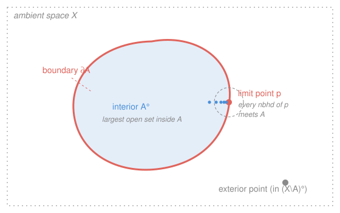

# Topology · Lesson 1.5: Interior, closure, boundary, and limit points

> ⏱ ~15 min · Module 1: Spaces · Builds on: [1.3 Topological spaces: the axioms](01-03-topological-spaces-axioms.md), [1.4 Bases and subbases](01-04-bases-and-subbases.md) · Unlocks: Module 2 — [2.1 Continuity and homeomorphisms](02-01-continuity-and-homeomorphisms.md)

## Why this matters

You now have a topology — a bare list of open sets. Hand it any subset $A$, and four canonical sets tell you exactly how $A$ sits inside the space: the biggest open set you can cram *inside* it (interior), the smallest closed set that *wraps* it (closure), the *skin* between the two (boundary), and the points $A$ *sneaks up on* (limit points). These are the everyday tools of the trade — the moment you ask "is this set open? closed? where does a sequence in it accumulate?" you are reaching for one of them. In `real-analysis` you built all four on the real line with $\varepsilon$-balls; here we rebuild them with *no metric at all*, and watch the answers shift when the topology does.

## The idea

Picture a shapeless blob $A$ drawn in the plane. Ask three questions.

*Which points are safely deep inside $A$?* A point is **interior** if you can draw a little open set around it that never pokes out of $A$ — it has breathing room. Collect all of them: that's the **interior** $A^\circ$, the largest open set fitting inside $A$.

*Which points can $A$ never escape?* Fatten $A$ up to the smallest *closed* set that still contains it. That's the **closure** $\overline{A}$. It adds exactly the points that $A$ presses against from within — the edge it can't peel away from.

*Where is the skin?* The **boundary** $\partial A$ is what closure adds beyond interior: points where *every* neighborhood, however small, straddles the fence — touching both $A$ and its complement.

The fourth tool sharpens "presses against": $x$ is a **limit point** of $A$ if $A$ crowds arbitrarily close to $x$ — every open set around $x$ catches a point of $A$ *other than $x$ itself*. Limit points are how closure gets built: $\overline A$ is just $A$ together with everything it accumulates on. And here's the twist a metric hides — *all four answers depend on which sets you declared open.* Change $\tau$, and the same $A$ grows a different skin.

## The formal version

Fix a topological space $(X,\tau)$; "open" means "in $\tau$," and an **open neighborhood** of $x$ is any open set containing $x$. Recall a set is **closed** iff its complement is open.

**Interior.**
$$A^\circ \;=\; \operatorname{int}(A) \;=\; \bigcup\,\{\,U\in\tau : U\subseteq A\,\}.$$
> In words: union of every open set that fits inside $A$ — hence itself open, and the *largest* open subset of $A$.

**Closure.**
$$\overline{A} \;=\; \bigcap\,\{\,C : C \text{ closed},\ A\subseteq C\,\}.$$
> In words: intersection of every closed set that contains $A$ — hence itself closed, and the *smallest* closed superset of $A$. (An intersection of closed sets is closed, by the axioms from [1.3](01-03-topological-spaces-axioms.md).)

**Boundary.**
$$\partial A \;=\; \overline{A}\setminus A^\circ.$$
> In words: the points in the closure but not in the interior — the skin between $A$ and its outside.

**Limit (accumulation) point.** $x\in X$ is a **limit point** of $A$ if
$$\text{every open neighborhood } U \text{ of } x \text{ satisfies } U\cap(A\setminus\{x\})\neq\varnothing.$$
Write $A'$ for the set of all limit points (the **derived set**).
> In words: $A$ huddles arbitrarily close to $x$ — you cannot isolate $x$ from $A$ with any open set, even after deleting $x$ itself.

These are tied together by two workhorse theorems.

**Theorem 1 (closure via neighborhoods).** $x\in\overline{A}$ **iff** every open neighborhood of $x$ meets $A$.

*Proof.* We prove the contrapositive both ways. ($\Leftarrow$) Suppose some open neighborhood $U$ of $x$ misses $A$, i.e. $U\cap A=\varnothing$. Then $X\setminus U$ is closed and contains $A$, so it is one of the sets in the intersection defining $\overline A$; hence $\overline A\subseteq X\setminus U$. Since $x\in U$, $x\notin\overline A$. ($\Rightarrow$) Suppose $x\notin\overline A$. Then $x$ escapes some closed $C\supseteq A$. Set $U=X\setminus C$: it is open, contains $x$, and $U\cap A\subseteq U\cap C=\varnothing$, so $U$ misses $A$. $\blacksquare$

**Theorem 2 (closure = set + limit points).** $\ \overline{A}=A\cup A'$. Consequently, $A$ is closed **iff** it contains all its limit points ($A'\subseteq A$).

*Proof.* ($\supseteq$) Certainly $A\subseteq\overline A$. If $x\in A'$, every open neighborhood of $x$ meets $A\setminus\{x\}\subseteq A$, so meets $A$; by Theorem 1, $x\in\overline A$. Thus $A\cup A'\subseteq\overline A$. ($\subseteq$) Take $x\in\overline A$. If $x\in A$, done. If $x\notin A$, then by Theorem 1 every open neighborhood $U$ of $x$ meets $A$; and since $x\notin A$, $U\cap A=U\cap(A\setminus\{x\})\neq\varnothing$, so $x\in A'$. Thus $\overline A\subseteq A\cup A'$.

For the corollary: a set equals its own closure iff it is closed (if $A$ is closed it is a closed superset of itself, so $\overline A\subseteq A\subseteq\overline A$; conversely $\overline A$ is always closed). So $A$ closed $\iff A=\overline A=A\cup A' \iff A'\subseteq A$. $\blacksquare$

**Dense sets.** $A$ is **dense** in $X$ if $\overline A=X$: by Theorem 1, every nonempty open set contains a point of $A$. The headline example is $\mathbb{Q}$ dense in $\mathbb{R}$ — the density of the rationals you proved in `real-analysis` (every interval holds a rational) says exactly $\overline{\mathbb{Q}}=\mathbb{R}$.

**$G_\delta$ set (teaser).** A set is **$G_\delta$** if it is a *countable* intersection of open sets. Open sets are $G_\delta$ trivially; the surprise is that in $\mathbb{R}$ the irrationals are $G_\delta$ but $\mathbb{Q}$ is *not* — a fact that quietly powers the Baire category theorem you'll meet downstream.

## Picture

Every neighborhood of $p$ (dashed circle) straddles the fence — it catches points of $A$ (blue dots closing in) and points outside — so $p\in\partial A$ and $p\in A'$, whether or not $p$ itself belongs to $A$.

## Worked examples

**Example 1 (mechanical — the same set, standard $\mathbb{R}$).** Let $A=(0,1)$ with the standard topology on $\mathbb{R}$ (open sets = unions of open intervals).
- **Interior:** $A$ is already open, so $A^\circ=(0,1)$.
- **Closure:** $0$ and $1$ are limit points — every interval around $0$ dips into $(0,1)$ — so $\overline A=[0,1]$.
- **Boundary:** $\partial A=[0,1]\setminus(0,1)=\{0,1\}$.

The familiar picture: skin $=$ the two endpoints. Note $0\notin A$ yet $0$ is a limit point — *a limit point need not lie in the set.*

**Example 2 (why you'd care — change the topology, change everything).** Keep the *same* $A=(0,1)$, now on $\mathbb{R}$ with the **cofinite topology**: the open sets are $\varnothing$ and the complements of finite sets. Then the closed sets are exactly the *finite* sets and $\mathbb{R}$ itself.
- **Closure:** the only closed set containing the infinite set $(0,1)$ is $\mathbb{R}$ (no finite set can). So $\overline{(0,1)}=\mathbb{R}$ — the closure of *any* infinite set is the whole line! Every point of $\mathbb{R}$ is a limit point of $(0,1)$, because every nonempty open set is $\mathbb{R}$ minus finitely many points and so must hit the infinite set $(0,1)$.
- **Interior:** a nonempty open set is cofinite, hence infinite and unbounded — it can never fit inside the bounded set $(0,1)$. So the only open subset of $(0,1)$ is $\varnothing$: $\ (0,1)^\circ=\varnothing$.
- **Boundary:** $\partial(0,1)=\mathbb{R}\setminus\varnothing=\mathbb{R}$.

Same subset, wildly different anatomy — this is the lesson's whole point: interior, closure, and boundary are properties of $A$ *inside a topology*, never of $A$ alone.

One more standard specimen, back in standard $\mathbb{R}$: $A=\mathbb{Q}$. No interval fits inside $\mathbb{Q}$ (every interval holds an irrational), so $\mathbb{Q}^\circ=\varnothing$. And $\mathbb{Q}$ is dense, so $\overline{\mathbb{Q}}=\mathbb{R}$. Hence $\partial\mathbb{Q}=\mathbb{R}\setminus\varnothing=\mathbb{R}$ — a set whose boundary is *the entire space*.

## Watch out

- **You might think interior/closure/boundary belong to the set, but they belong to the *pair* $(A,\tau)$.** Example 2 gave $\overline{(0,1)}=[0,1]$ or $=\mathbb{R}$ depending only on which topology you named. Always ask "closure in *which* topology?"
- **You might think a limit point of $A$ lies in $A$, or that a boundary point doesn't — neither is forced.** $0$ is a limit point of $(0,1)$ but sits outside it; a closed disk contains its boundary circle. Membership in $A$ and being on the skin are independent questions.
- **You might think "$x\in\overline A$" means *some* neighborhood of $x$ meets $A$ — it's *every*.** One neighborhood touching $A$ is trivially true for any $x\in A$ and says nothing; the closure condition (Theorem 1) is the universal one, "no neighborhood can pull $x$ clear of $A$." Swap the quantifier and you get nonsense.

## One-liner

> Interior is the open core, closure is $A$ plus everything it accumulates on, boundary is the skin between — and all three are readings of the *topology*, not the set.

## Problems

**P1 (🟢)** In standard $\mathbb{R}$, let $A=[0,1)\cup\{2\}$. Compute $A^\circ$, $\overline{A}$, $\partial A$, and the derived set $A'$.

**P2 (🟡)** Let $X$ carry the **discrete topology** (every subset is open). Prove that for *every* $A\subseteq X$: $A^\circ=A$, $\overline A=A$, $\partial A=\varnothing$, and $A'=\varnothing$ (no set has a limit point). What does this say about which sequences can "accumulate" in a discrete space?

**P3 (🔴, optional)** Prove the symmetric formula for the boundary:
$$\partial A=\overline{A}\cap\overline{X\setminus A}.$$
(Hint: first show $X\setminus A^\circ=\overline{X\setminus A}$ using Theorem 1, then substitute into $\partial A=\overline A\setminus A^\circ$.)

Solutions

**P1** Interior: the largest open set inside $A$. The isolated point $2$ has no interval around it staying in $A$, and $0$ is a left endpoint with points just below it outside $A$; the open part is $(0,1)$. So $A^\circ=(0,1)$. Closure: add limit points. Points of $[0,1)$ accumulate up to and including $1$, and $0\in A$ already; $2$ is *isolated* (the interval $(1.5,2.5)$ meets $A\setminus\{2\}=\ [0,1)$... check: $(1.5,2.5)\cap[0,1)=\varnothing$), so $2$ is **not** a limit point — but it's in $A$, so it stays in the closure. Thus $\overline A=[0,1]\cup\{2\}$. Boundary: $\overline A\setminus A^\circ=\big([0,1]\cup\{2\}\big)\setminus(0,1)=\{0,1,2\}$. Derived set: the limit points are $[0,1]$ (every point of that interval is approached by $[0,1)$; $1$ included, $2$ excluded because it's isolated). So $A'=[0,1]$. Note $2\in A$ but $2\notin A'$, and $1\in A'$ but $1\notin A$ — the two sets genuinely differ.

**P2** In the discrete topology every subset is open, so every subset is also closed (its complement is a subset, hence open). Interior: $A$ itself is an open set contained in $A$, and nothing can be larger, so $A^\circ=A$. Closure: $A$ itself is a closed set containing $A$, and nothing smaller, so $\overline A=A$. Boundary: $\partial A=\overline A\setminus A^\circ=A\setminus A=\varnothing$. Limit points: for any $x$, the singleton $\{x\}$ is open, and $\{x\}\cap(A\setminus\{x\})=\varnothing$ — a neighborhood that isolates $x$ from $A\setminus\{x\}$ — so no $x$ is a limit point of any $A$: $A'=\varnothing$. Meaning: in a discrete space nothing crowds together, so the only way a sequence can converge is to be *eventually constant* — accumulation requires points to have no breathing room, and here everyone does.

**P3** First claim: $X\setminus A^\circ=\overline{X\setminus A}$. Chase the definitions:
$$x\in X\setminus A^\circ \iff x\notin A^\circ \iff \text{no open neighborhood of }x\text{ lies inside }A$$
$$\iff \text{every open neighborhood of }x\text{ meets }X\setminus A \iff x\in\overline{X\setminus A},$$
the last step by Theorem 1 applied to the set $X\setminus A$. (The middle equivalence: "$U\subseteq A$ fails" is exactly "$U$ meets $X\setminus A$.") Now substitute:
$$\partial A=\overline A\setminus A^\circ=\overline A\cap(X\setminus A^\circ)=\overline A\cap\overline{X\setminus A}.$$
This form makes the symmetry obvious: $\partial A=\partial(X\setminus A)$ — a set and its complement share the very same skin. $\blacksquare$

## Flashback

**From Lesson 1.3 (Topological spaces: the axioms):** Let $X=\{1,2,3\}$. Decide whether
$$\tau_1=\{\varnothing,\ \{1\},\ \{2\},\ \{1,2\},\ X\}$$
is a topology on $X$. Then decide whether $\tau_2=\{\varnothing,\ \{1\},\ \{2\},\ X\}$ is. (Fresh variant: verify the three axioms — contains $\varnothing$ and $X$, closed under arbitrary unions and finite intersections.)

Solution

**$\tau_1$ is a topology.** It contains $\varnothing$ and $X$. Unions: the only new one to check is $\{1\}\cup\{2\}=\{1,2\}\in\tau_1$; every other union of members is again a member (e.g. $\{2\}\cup\{1,2\}=\{1,2\}$, $\{1\}\cup X=X$). Intersections: $\{1\}\cap\{2\}=\varnothing\in\tau_1$, $\{1\}\cap\{1,2\}=\{1\}$, $\{2\}\cap\{1,2\}=\{2\}$ — all present. All three axioms hold.

**$\tau_2$ is *not* a topology.** It fails closure under unions: $\{1\}\cup\{2\}=\{1,2\}$, which is **not** in $\tau_2$. (Intersections happen to be fine, but one failed axiom is enough.) Adding $\{1,2\}$ back is precisely what turns it into $\tau_1$. Moral: a family closed under intersections can still miss a union — you must check both.

## Connections

- **Backward:** this *generalizes* the open/closed/limit-point machinery you built on $\mathbb{R}$ in `real-analysis` (its Lesson 4.1) — every definition there used $\varepsilon$-balls; here "open neighborhood" replaces them verbatim, and the theorems come out identical because they only ever used *openness*. The closure/derived-set relationship $\overline A=A\cup A'$ is the metric-free heart of it.
- **Forward:** closure is the language of continuity. In [2.1](02-01-continuity-and-homeomorphisms.md) you'll characterize continuous maps by "$f(\overline A)\subseteq\overline{f(A)}$," and closed sets (complements of the open sets you've been unioning) become the natural home for limits. Dense sets return in Module 5 (separability), and $G_\delta$ sets resurface in metrization.
- **Sideways:** "$\mathbb{Q}$ dense but empty-interior" is the topological echo of `real-analysis`'s "$\mathbb{Q}$ dense yet countable" — density (a closure statement) and size (cardinality/measure) are independent, exactly as that lesson warned. Boundaries also foreshadow `topology`'s later manifold-with-boundary vocabulary.
