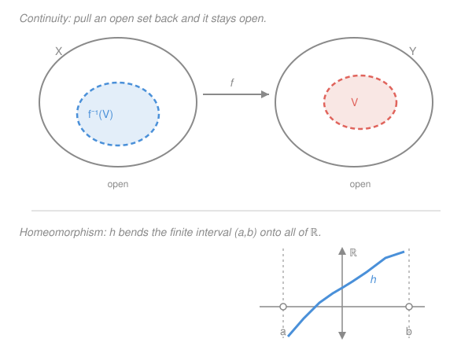

# Topology · Lesson 2.1: Continuous functions and homeomorphisms

> ⏱ ~15 min · Module 2: Continuity and new spaces from old · Builds on: [1.5 Interior, closure, boundary, limit points](01-05-closure-interior-boundary.md), Module 1 · Unlocks: [2.2 The subspace topology](02-02-subspace-topology.md)

## Why this matters

A category is only as interesting as its morphisms. Module 1 gave us the objects — topological spaces — but a bare space does nothing until you can *map* between spaces and ask when two of them are "the same." Continuity is that notion of a structure-respecting map, and it is the hinge the whole subject turns on: connectedness, compactness, and the fundamental group are all defined so that continuous maps preserve them. The payoff is a single definition that simultaneously covers the calculus you already know, maps of function spaces, and the joke that a coffee mug is a doughnut — and, unlike ε–δ, it never mentions distance.

## The idea

Continuity should mean **nearby points go to nearby points**: wiggle the input a little, the output moves only a little, nothing tears. In `real-analysis` you enforced that with ε–δ — but that machinery is built entirely out of *distances*, and a topological space has none. So we need to say "nearby" using only the one thing a topology gives us: open sets. An open set around a point is exactly the topological word for "a margin of nearby room."

Here is the clean move. Instead of chasing outputs from inputs, run the film backwards. Pick any open target region $V$ downstream. Ask: which inputs land inside it? If $f$ doesn't tear anything, that set of inputs — the **preimage** $f^{-1}(V)$ — should itself be open: every input landing safely inside $V$ has a margin of nearby inputs that also land inside $V$. A tear is exactly a point sitting on the *edge* of its preimage with no room to spare. So:

> **continuous = the preimage of every open set is open.**

No distances, no limits, no $\varepsilon$. Just: pulling an open set back through $f$ never breaks it open.

## The formal version

Let $X$ and $Y$ be topological spaces and $f:X\to Y$ a function. Recall the **preimage** $f^{-1}(V)=\{x\in X : f(x)\in V\}$ (this needs no inverse function — it is just "the inputs that land in $V$").

**Definition (continuity).** $f$ is **continuous** if for every open set $V\subseteq Y$, the preimage $f^{-1}(V)$ is open in $X$.

> In words: pull any open set back and it stays open.

Notice continuity is a property of $f$ *together with the topologies on both ends* — change either topology and the same function can flip between continuous and not.

**Equivalent formulations.** Each of these says exactly the same thing; pick whichever is easiest for the job.

1. $f^{-1}(C)$ is closed in $X$ for every closed $C\subseteq Y$.
2. $f(\overline{A})\subseteq \overline{f(A)}$ for every $A\subseteq X$, where $\overline{\,\cdot\,}$ is closure.
3. ($f$ is continuous *at $x$*) for every open $V\ni f(x)$ there is an open $U\ni x$ with $f(U)\subseteq V$; and $f$ is continuous iff it is continuous at every point.

> In words: (1) closed sets pull back to closed sets; (2) if $x$ is arbitrarily close to $A$, then $f(x)$ is arbitrarily close to $f(A)$ — $f$ can't fling a limit point away; (3) the pointwise, neighborhood-by-neighborhood version, the closest cousin of ε–δ.

**Proof that (1) ⟺ definition.** Preimage commutes with complements: $f^{-1}(Y\setminus C)=X\setminus f^{-1}(C)$, since $f(x)\notin C \iff x\notin f^{-1}(C)$. Now $C$ closed means $Y\setminus C$ open. If $f$ is continuous, $f^{-1}(Y\setminus C)=X\setminus f^{-1}(C)$ is open, so $f^{-1}(C)$ is closed. The converse runs identically with the roles of open and closed swapped. $\blacksquare$

### Recovering ε–δ

For metric spaces this definition is not an analogy for the `real-analysis` one — it is *literally* it. Let $(X,d_X)$ and $(Y,d_Y)$ be metric spaces, each carrying its metric topology (open = union of open balls $B(p,r)=\{q: d(p,q)<r\}$).

**Claim.** $f:X\to Y$ satisfies "$f^{-1}(V)$ open for all open $V$" $\iff$ the ε–δ condition: for every $x\in X$ and every $\varepsilon>0$ there is $\delta>0$ with $d_X(x,x')<\delta \implies d_Y(f(x),f(x'))<\varepsilon$.

**Proof.** ($\Leftarrow$) Assume ε–δ. Let $V\subseteq Y$ be open and $x\in f^{-1}(V)$. Then $f(x)\in V$, and $V$ open gives an $\varepsilon>0$ with $B(f(x),\varepsilon)\subseteq V$. ε–δ hands us a $\delta>0$ with $f\big(B(x,\delta)\big)\subseteq B(f(x),\varepsilon)\subseteq V$, so $B(x,\delta)\subseteq f^{-1}(V)$. Every point of $f^{-1}(V)$ has a ball inside it, so $f^{-1}(V)$ is open.

($\Rightarrow$) Assume preimages of opens are open. Fix $x$ and $\varepsilon>0$. The ball $B(f(x),\varepsilon)$ is open in $Y$, so $f^{-1}\big(B(f(x),\varepsilon)\big)$ is open in $X$ and contains $x$; hence it contains some ball $B(x,\delta)$. That $\delta$ is exactly the one ε–δ demands: $d_X(x,x')<\delta \implies f(x')\in B(f(x),\varepsilon) \implies d_Y(f(x),f(x'))<\varepsilon$. $\blacksquare$

The dictionary is tight: **an open $V$ around $f(x)$** plays the role of **the ε-ball**, and **"$f^{-1}(V)$ open"** is precisely **"a $\delta$ exists."** The topological definition just quantifies over *all* open $V$ at once instead of shrinking balls.

### Building continuous maps

Two facts make continuous maps cheap to assemble — and the proofs are one line each, where ε–δ would grind.

- **Constant maps and the identity are continuous.** For constant $f\equiv y_0$, $f^{-1}(V)$ is either $X$ (if $y_0\in V$) or $\varnothing$ (if not) — both open. For $\mathrm{id}:X\to X$, $\mathrm{id}^{-1}(V)=V$.
- **Compositions of continuous maps are continuous.** If $f:X\to Y$ and $g:Y\to Z$ are continuous and $W\subseteq Z$ is open, then
$$(g\circ f)^{-1}(W) = f^{-1}\big(g^{-1}(W)\big),$$
which is open: $g^{-1}(W)$ is open because $g$ is continuous, and its preimage under $f$ is open because $f$ is. $\blacksquare$

Compare that three-line proof to the ε–δ chase (given $\varepsilon$, find $\eta$ for $g$, then $\delta$ for $f$, then compose). Backwards preimages turn a nested quantifier hunt into set algebra.

## Homeomorphism: sameness in topology

Continuity gives maps; to say two spaces *are the same* we want a continuous map with a continuous inverse.

**Definition.** A **homeomorphism** is a bijection $f:X\to Y$ such that both $f$ and $f^{-1}$ are continuous. If one exists, $X$ and $Y$ are **homeomorphic**, written $X\cong Y$.

> In words: a perfect two-way dictionary between the points *and* the open sets — $f$ matches open sets in $Y$ to open sets in $X$, and $f^{-1}$ matches them back. To topology, $X$ and $Y$ are indistinguishable.

Why demand $f^{-1}$ continuous separately? Because a bijection can be continuous one way and torn the other — see Watch out. When both hold, $V\subseteq Y$ is open $\iff$ $f^{-1}(V)\subseteq X$ is open: the open-set lattices are identical, so every topological property agrees.

**Examples.**
- **$(a,b)\cong\mathbb{R}$.** No amount of stretching turns a bounded interval into the line *metrically*, but topologically it's routine: shrink-and-bend with a $\tan$. The map $h(x)=\tan\!\big(\pi\frac{x-a}{b-a}-\frac{\pi}{2}\big)$ is a continuous bijection $(a,b)\to\mathbb{R}$ with continuous inverse (an arctangent), so $(a,b)\cong\mathbb{R}$. Boundedness is a *metric* fact, invisible to topology.
- **The open disk $\cong\mathbb{R}^2$.** The map $x\mapsto x/(1-\lVert x\rVert)$ inflates the open unit disk onto the whole plane, inverse $y\mapsto y/(1+\lVert y\rVert)$ — same phenomenon, one dimension up.
- **A coffee mug $\cong$ a doughnut.** The old joke, now precise: each is a solid surface with exactly one hole, and you can deform one into the other bijectively and continuously both ways (the handle becomes the ring). A topologist genuinely cannot tell them apart.

## Picture

The top panel is the whole definition in one image: $V$ open (dashed) downstream, $f^{-1}(V)$ open (dashed) upstream. The bottom panel is $(a,b)\cong\mathbb{R}$ — the finite interval on the horizontal axis, the full line $\mathbb{R}$ on the vertical, and the $\tan$-shaped $h$ carrying one bijectively onto the other, racing off to $\pm\infty$ as the input nears the open endpoints $a,b$.

## Worked examples

**Example 1 (mechanical — continuity depends on the topology).** Take the identity function $\mathrm{id}:\mathbb{R}\to\mathbb{R}$, but put the **discrete** topology (every set open) on the domain and the **standard** topology on the codomain. Continuous? For any standard-open $V$, $\mathrm{id}^{-1}(V)=V$, which is open in the discrete topology (everything is). So yes — continuous. Now swap the ends: standard on the domain, discrete on the codomain. The singleton $\{0\}$ is open in the discrete codomain, but $\mathrm{id}^{-1}(\{0\})=\{0\}$ is *not* open in standard $\mathbb{R}$. Not continuous. Same set-map, opposite verdicts — continuity is a statement about the two topologies, never the formula alone.

**Example 2 (why you'd care — continuity via closure, no formula in sight).** Suppose $f:X\to Y$ is continuous and $A\subseteq X$ is *dense* (i.e. $\overline{A}=X$). Then $f$ is completely determined by its values on $A$ once $Y$ is Hausdorff — the reason two continuous functions agreeing on the rationals must agree everywhere on $\mathbb{R}$. The engine is formulation (2): $f(\overline A)\subseteq \overline{f(A)}$, so $f(X)=f(\overline A)\subseteq\overline{f(A)}$ — the image of a dense set is dense in the image. Density is a purely open-set notion from [1.5](01-05-closure-interior-boundary.md), and continuity transports it downstream with no $\varepsilon$ anywhere. This is the topological backbone of "a continuous function is pinned down by its values on a dense set," which you will lean on constantly in analysis and again when computing $\pi_1$ in [6.1](06-01-homotopy-of-paths.md).

## Watch out

- **It's the *preimage* that must stay open, not the image.** You might think continuity means "$f$ sends open sets to open sets," but that's a *different and independent* property (an **open map**). Continuity pulls open sets *back*; openness pushes them *forward*. Example: $f(x)=x^2$ on $\mathbb{R}$ is continuous, yet $f\big((-1,1)\big)=[0,1)$ is not open — a continuous map need not be open.
- **A continuous bijection need not be a homeomorphism.** You might think "bijective + continuous ⟹ inverse is continuous," but no. Wrap the half-open interval onto the circle: $f:[0,2\pi)\to S^1$, $f(t)=(\cos t,\sin t)$. It's a continuous bijection, but $f^{-1}$ is *not* continuous — points on the circle straddling the seam $(1,0)$ come from inputs near both $0$ and $2\pi$, so $f^{-1}$ has to rip the circle open at that seam. The inverse tears; $f$ is no homeomorphism. (Module 4's compactness closes exactly this gap: a continuous bijection *from a compact space to a Hausdorff space* is automatically a homeomorphism — see [2.5](02-05-topological-properties-invariants.md) and Boss problem 4.)
- **"Homeomorphism" is not "homomorphism."** One letter, unrelated ideas: a homeomorphism is a topological isomorphism (of spaces); a homomorphism is an algebraic structure-map (of groups, rings). They collide in Module 6, where a *continuous map* induces a *group homomorphism* on $\pi_1$ — keep the words straight.
- **Continuity lives on both ends.** As Example 1 shows, the *same* underlying function is continuous or not depending on the topologies chosen for domain and codomain. "Is $f$ continuous?" is meaningless until both topologies are named.

## One-liner

> Continuous means the preimage of every open set is open — distance-free, composition-proof, and it upgrades to homeomorphism (topological sameness) exactly when the inverse is continuous too.

## Problems

**P1 (🟢)** Let $X$ carry the discrete topology (every subset is open) and let $Y$ be *any* topological space. Prove that **every** function $f:X\to Y$ is continuous. Then state the dual fact when the *codomain* carries the indiscrete topology $\{\varnothing,Y\}$.

**P2 (🟡)** Prove that $(-1,1)\cong\mathbb{R}$ by exhibiting an explicit homeomorphism and verifying both it and its inverse are continuous. (Use a $\tan$; you may take continuity of $\tan$ and $\arctan$ as known from `real-analysis`.)

**P3 (🔴, optional)** For the wrap map $f:[0,2\pi)\to S^1$, $f(t)=(\cos t,\sin t)$, prove concretely that $f^{-1}$ is *not* continuous by exhibiting one open set $U\subseteq[0,2\pi)$ whose image $f(U)$ is **not** open in $S^1$. Explain in one sentence why this is the same as "$f^{-1}$ is discontinuous."

Solutions

**P1** Let $V\subseteq Y$ be open (in fact $V$ can be *any* subset). Its preimage $f^{-1}(V)\subseteq X$ is some subset of $X$, and in the discrete topology **every** subset of $X$ is open. So $f^{-1}(V)$ is open, and $f$ is continuous — regardless of what $f$ or $Y$ are. The discrete topology is the finest possible; it makes every map *out* of $X$ continuous.

Dual fact: if $Y$ carries the **indiscrete** topology $\{\varnothing,Y\}$, then every function $f:X\to Y$ from any space $X$ is continuous, because the only open sets to pull back are $\varnothing$ (preimage $\varnothing$, open) and $Y$ (preimage $X$, open). The indiscrete topology is the coarsest; it makes every map *into* $Y$ continuous. (Fewer open sets downstream = fewer conditions to satisfy.)

**P2** Define $h:(-1,1)\to\mathbb{R}$ by $h(x)=\tan\!\big(\tfrac{\pi}{2}x\big)$.

- *Bijection.* As $x$ runs over $(-1,1)$, the argument $\tfrac{\pi}{2}x$ runs over $\big(-\tfrac{\pi}{2},\tfrac{\pi}{2}\big)$, on which $\tan$ is strictly increasing from $-\infty$ to $+\infty$. Strictly increasing and onto $\mathbb{R}$ $\Rightarrow$ $h$ is a bijection.
- *Continuity of $h$.* $h$ is the composition $x\mapsto \tfrac{\pi}{2}x \mapsto \tan(\cdot)$ of a linear map (continuous) with $\tan$ (continuous on $\big(-\tfrac\pi2,\tfrac\pi2\big)$). Compositions of continuous maps are continuous.
- *Inverse and its continuity.* Solving $y=\tan\!\big(\tfrac\pi2 x\big)$ gives $h^{-1}(y)=\tfrac{2}{\pi}\arctan(y)$, a composition of $\arctan$ (continuous on $\mathbb{R}$) with a linear scaling (continuous) — so $h^{-1}$ is continuous.

Both directions continuous and $h$ bijective $\Rightarrow$ $h$ is a homeomorphism, so $(-1,1)\cong\mathbb{R}$. (Composing with the linear homeomorphism $(a,b)\to(-1,1)$, $x\mapsto \tfrac{2x-(a+b)}{b-a}$, upgrades this to $(a,b)\cong\mathbb{R}$ for every $a<b$.)

**P3** Take $U=[0,\pi)$, which is open in $[0,2\pi)$: it equals $(-1,\pi)\cap[0,2\pi)$, an intersection of a standard-open set with the whole space, i.e. open in the subspace topology $[0,2\pi)$ inherits from $\mathbb{R}$ (this is exactly the [2.2](02-02-subspace-topology.md) machinery). Its image $f(U)$ is the open upper half of the circle **together with the single point $(1,0)$** (the image of $t=0$) — an arc with one endpoint attached. That set is not open in $S^1$: every neighborhood of $(1,0)$ in $S^1$ contains points just *below* the $x$-axis (angles near $2\pi$), which are not in $f(U)$. So $f(U)$ is not open.

Why this settles it: $f^{-1}$ is continuous iff the preimage under $f^{-1}$ of every open set is open — and the preimage under $f^{-1}$ of $U$ is exactly $f(U)$ (since $f^{-1}$ maps $S^1\to[0,2\pi)$, $\left(f^{-1}\right)^{-1}(U)=f(U)$). We exhibited an open $U$ whose image $f(U)$ is not open, so $f^{-1}$ fails the definition of continuity: it tears the circle open at the seam $(1,0)$.

## Flashback

**From Lesson 1.5 (Interior, closure, boundary):** Give $\mathbb{R}$ the **cofinite topology** — a set is open iff it is empty or its complement is finite. Let $A=\mathbb{Z}\subseteq\mathbb{R}$. Compute the interior $A^\circ$, the closure $\overline{A}$, and the boundary $\partial A$.

Solution

First pin down the closed sets: $C$ is closed iff $\mathbb{R}\setminus C$ is open, i.e. iff $\mathbb{R}\setminus C$ is empty or has finite complement — meaning the **closed sets are exactly the finite sets together with all of $\mathbb{R}$**.

- **Closure $\overline{A}$** = smallest closed set containing $\mathbb{Z}$. The closed sets are "finite, or everything." Since $\mathbb{Z}$ is infinite, no finite closed set contains it, so the only closed superset is $\mathbb{R}$ itself. Hence $\overline{\mathbb{Z}}=\mathbb{R}$: in the cofinite topology, $\mathbb{Z}$ is *dense*.
- **Interior $A^\circ$** = largest open set contained in $\mathbb{Z}$. A nonempty open set has finite complement, so it omits only finitely many reals — it can never fit inside $\mathbb{Z}$, which omits everything non-integer (uncountably much). So the only open subset of $\mathbb{Z}$ is $\varnothing$, giving $\mathbb{Z}^\circ=\varnothing$.
- **Boundary $\partial A$** = $\overline{A}\setminus A^\circ = \mathbb{R}\setminus\varnothing=\mathbb{R}$.

So in the cofinite topology $\mathbb{Z}$ has empty interior, closure all of $\mathbb{R}$, and boundary all of $\mathbb{R}$ — wildly different from its standard-topology anatomy ($\mathbb{Z}^\circ=\varnothing$, $\overline{\mathbb{Z}}=\mathbb{Z}$, $\partial\mathbb{Z}=\mathbb{Z}$), a reminder that every one of these quantities is a function of the topology, never of the set alone.

## Connections

- **Backward:** continuity is built entirely on the open-set vocabulary of Module 1, and formulations (1)–(2) run on the closure/interior/boundary machinery of [1.5](01-05-closure-interior-boundary.md). The ε–δ recovery shows this is the same continuity you proved theorems about in `real-analysis`, now stripped of its metric scaffolding.
- **Forward:** [2.2](02-02-subspace-topology.md) needs continuity to define *embeddings* (homeomorphisms onto their image), and the product and quotient topologies later in this module are *defined* as the topologies making the relevant projection/gluing maps continuous. Connectedness (Module 3) and compactness (Module 4) are chosen precisely because continuous images preserve them.
- **Sideways:** the induced map on the fundamental group in [6.1](06-01-homotopy-of-paths.md) turns a continuous map of spaces into a *homomorphism* of groups — the bridge from topology to algebra, and the payoff of keeping "homeomorphism" and "homomorphism" straight. The $[0,2\pi)\to S^1$ non-example is closed off by compactness in Boss problem 4, exactly where topology repays the debt this lesson opens.
