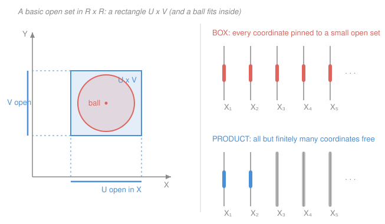

# Topology · Lesson 2.3: The product topology

> ⏱ ~15 min · Module 2: Continuity and new spaces from old · Builds on: [2.2 The subspace topology](02-02-subspace-topology.md), [1.4 Bases, subbases, and comparing topologies](01-04-bases-and-subbases.md) · Unlocks: [2.4 The quotient topology and gluing](02-04-quotient-topology.md)

## Why this matters

The plane is two copies of the line; a cylinder is a circle times an interval; a torus is two circles; the phase space of a mechanical system is positions times momenta; and a space of infinite sequences — the natural home of "pointwise convergence" — is infinitely many copies of $\mathbb{R}$ at once. In every case you already know the *factors* and want a topology on the *product*. There is one right answer, pinned down by a single demand: the coordinate projections must stay continuous. For finite products this is the obvious "open rectangles" recipe. For **infinite** products the obvious recipe is subtly *wrong* — and getting it right is exactly what makes Tychonoff's theorem ([4.4](04-04-tychonoff-theorem.md)) true.

## The idea

Take $X\times Y$. What should "open" mean? A first guess: a set is open if it's a rectangle $U\times V$ with $U$ open in $X$ and $V$ open in $Y$. That's almost right — rectangles won't be *all* the open sets (an open disk isn't a rectangle), but they'll be a **basis**: every open set is a union of open rectangles, just as every open set on the line is a union of open intervals ([1.4](01-04-bases-and-subbases.md)).

Why rectangles and not something wilder? Because we want the two **projections** $\pi_X(x,y)=x$ and $\pi_Y(x,y)=y$ to be continuous — projecting a point to its shadow on an axis should not tear anything. The preimage $\pi_X^{-1}(U)$ is the vertical strip $U\times Y$; forcing all such strips (and $Y$-strips) to be open, and taking finite intersections, gives you exactly the rectangles. So the recipe isn't arbitrary: it's the *cheapest* topology that keeps the projections continuous.

Now the twist. For an infinite product $\prod_\alpha X_\alpha$ — say $\mathbb{R}^\omega$, all infinite sequences of reals — you might copy the recipe and allow *every* product $\prod_\alpha U_\alpha$ of opens. That's the **box topology**, and it's too fine: it has so many open sets that even the diagonal map $t\mapsto(t,t,t,\dots)$ stops being continuous. The fix is a restriction that looks fussy but is the whole game: only allow products $\prod_\alpha U_\alpha$ where $U_\alpha$ is the *whole* space $X_\alpha$ for all but **finitely many** $\alpha$. "Restrict finitely many coordinates at a time." That coarser choice is the **product topology**, and it is the right one.

## The formal version

Throughout, $A$ is an index set and each $X_\alpha$ ($\alpha\in A$) is a topological space. The **projection** $\pi_\beta:\prod_{\alpha\in A}X_\alpha\to X_\beta$ sends a point $(x_\alpha)_{\alpha\in A}$ to its $\beta$-coordinate $x_\beta$.

**Finite products — the basis.** On $X\times Y$, let
$$\mathcal{B}=\{\,U\times V:\ U\text{ open in }X,\ V\text{ open in }Y\,\}.$$
*Claim: $\mathcal{B}$ is a basis.* Two things to check (the basis criterion from [1.4](01-04-bases-and-subbases.md)). First, $\mathcal{B}$ covers $X\times Y$, since $X\times Y\in\mathcal{B}$. Second, the intersection of two members is a member — not merely a union of members:
$$(U_1\times V_1)\cap(U_2\times V_2)=(U_1\cap U_2)\times(V_1\cap V_2),$$
and $U_1\cap U_2$, $V_1\cap V_2$ are open, so the right side is again an open rectangle. $\checkmark$ The **product topology** on $X\times Y$ is the topology generated by $\mathcal{B}$.

> In words: open rectangles are the building blocks; a set is open exactly when it is a union of open rectangles.

**Projections are continuous.** $\pi_X^{-1}(U)=U\times Y$, which is open (it's a rectangle). So $\pi_X$, and likewise $\pi_Y$, is continuous.

**Recovering $\mathbb{R}^2$.** On $\mathbb{R}\times\mathbb{R}$ the product topology *is* the standard metric topology on $\mathbb{R}^2$. Reason: inside any open rectangle around a point you can fit a small open ball, and inside any open ball you can fit a small open rectangle (Figure). Each family refines the other, so they generate the same topology — open rectangles and open balls are interchangeable bases.

**Universal property (the payoff).** For any space $Z$ and map $f:Z\to X\times Y$,
$$f\text{ is continuous}\iff \pi_X\circ f\ \text{and}\ \pi_Y\circ f\ \text{are both continuous.}$$

> In words: a map *into* a product is nothing more than a pair of maps into the factors, and it's continuous exactly when both of those are. "To land continuously in $X\times Y$, land continuously in each coordinate."

*Proof.* ($\Rightarrow$) Each $\pi$ is continuous, and a composite of continuous maps is continuous. ($\Leftarrow$) Suppose $g:=\pi_X\circ f$ and $h:=\pi_Y\circ f$ are continuous. To show $f$ is continuous it suffices to check preimages of **basic** open sets $U\times V$. Since $U\times V=\pi_X^{-1}(U)\cap\pi_Y^{-1}(V)$,
$$f^{-1}(U\times V)=f^{-1}\big(\pi_X^{-1}(U)\big)\cap f^{-1}\big(\pi_Y^{-1}(V)\big)=g^{-1}(U)\cap h^{-1}(V),$$
an intersection of two open sets, hence open. So $f$ is continuous. $\blacksquare$

**Infinite products — box vs. product.** For $\prod_{\alpha\in A}X_\alpha$, consider sets of the form $\prod_{\alpha\in A}U_\alpha$ with each $U_\alpha$ open in $X_\alpha$.

- The **box topology** takes *all* of these as a basis.
- The **product topology** takes only those with $U_\alpha=X_\alpha$ for all but finitely many $\alpha$.

> In words: a basic product-open set constrains only finitely many coordinates and leaves the rest completely free; the box topology lets you constrain them all at once.

Equivalently — and more usefully — the product topology is generated by the **subbasis**
$$\mathcal{S}=\{\,\pi_\beta^{-1}(U):\ \beta\in A,\ U\text{ open in }X_\beta\,\}.$$
Finite intersections of subbasic sets $\pi_{\beta_1}^{-1}(U_1)\cap\dots\cap\pi_{\beta_k}^{-1}(U_k)$ are exactly the basic open sets constraining the finitely many coordinates $\beta_1,\dots,\beta_k$ — recovering the definition above.

> In words: the product topology is the coarsest one in which every projection $\pi_\beta$ is continuous — you throw in just enough open sets to keep each projection continuous, and nothing more.

For a **finite** index set the two agree (only finitely many coordinates exist, so "all but finitely many free" is no restriction). They diverge only when $A$ is infinite, and the box is then strictly *finer*.

**Why the product topology wins.** The universal property above holds verbatim for arbitrary products **in the product topology**: $f:Z\to\prod_\alpha X_\alpha$ is continuous $\iff$ every $\pi_\alpha\circ f$ is continuous (same proof — check preimages of subbasic sets $\pi_\alpha^{-1}(U)$, which are $(\pi_\alpha\circ f)^{-1}(U)$). In the **box** topology the "$\Leftarrow$" direction *fails*. Concretely, take $\Delta:\mathbb{R}\to\mathbb{R}^\omega$, $\Delta(t)=(t,t,t,\dots)$. Every component $\pi_n\circ\Delta$ is the identity $t\mapsto t$, continuous. Yet $\Delta$ is **not** continuous into the box topology: the box-open set
$$U=\prod_{n=1}^\infty\left(-\tfrac1n,\tfrac1n\right)$$
has preimage $\Delta^{-1}(U)=\{t:|t|<\tfrac1n\text{ for all }n\}=\{0\}$, which is not open in $\mathbb{R}$. So even a map with all-continuous coordinates can fail to be continuous into the box — exactly the pathology the product topology avoids, and exactly why Tychonoff's theorem is stated for the product topology.

## Picture

## Worked examples

**Example 1 (mechanical — a basic open set beats a ball).** In $\mathbb{R}^2$ with the product topology, show the open unit disk $D=\{(x,y):x^2+y^2<1\}$ is open by finding a basic open rectangle inside $D$ around the point $p=(0.6,\,0)$. Here $\|p\|=0.6$, so $p$ sits at distance $0.4$ from the boundary circle. The rectangle
$$R=(0.4,\,0.8)\times(-0.2,\,0.2)$$
contains $p$, and every $(x,y)\in R$ has $x^2+y^2<0.8^2+0.2^2=0.68<1$, so $R\subseteq D$. A rectangle around each point $\Rightarrow$ $D$ is a union of rectangles $\Rightarrow$ $D$ is open. (This is the "ball $\to$ rectangle" half of the $\mathbb{R}^2$ equivalence in action.)

**Example 2 (why you'd care — building a continuous map into a product).** Define $f:\mathbb{R}\to\mathbb{R}^2$ by $f(t)=(\cos t,\sin t)$ — the map wrapping the line around the unit circle. Is it continuous? By the universal property you never touch the definition of continuity for the plane: the components $\pi_1\circ f=\cos$ and $\pi_2\circ f=\sin$ are continuous, therefore $f$ is continuous, done. This is how continuity of *every* parametrized curve, vector field, or trajectory gets checked in practice — coordinate by coordinate. The same principle promotes it to infinite products: the sequence-valued map $t\mapsto(\cos t,\cos 2t,\cos 3t,\dots)\in\mathbb{R}^\omega$ is continuous in the product topology because each coordinate is, with no need to reason about the infinite product directly.

## Watch out

- You might think box and product topology are the same recipe, but they **only agree for finite products**. The instant the index set is infinite they differ, and unless you say otherwise "$\prod X_\alpha$" always means the **product** topology — the box is a cautionary example, not the default.
- You might think a basic open set in a product can restrict every coordinate a little, but in the product topology a basic open set restricts only **finitely many** coordinates; all the rest must be the *entire* factor $X_\alpha$. Pinning infinitely many coordinates (as the box allows) is what breaks continuity and compactness.
- You might think open rectangles *are* the open sets of $X\times Y$, but they are only a **basis** — the open sets are their arbitrary unions. The open disk is open yet is no single rectangle; it's a union of them (Example 1).

## One-liner

> The product topology is the coarsest topology making every projection continuous — open rectangles for finite products, and "constrain only finitely many coordinates" for infinite ones, which is precisely the choice that keeps maps-into-a-product = tuples-of-maps.

## Problems

**P1 (🟢)** In $\mathbb{R}^2$ with the product topology, exhibit a basic open rectangle contained in the open disk $D=\{(x,y):x^2+y^2<1\}$ around the point $p=(0,\,-0.5)$. (Same idea as Example 1, different point.)

**P2 (🟡)** Prove that if $X$ and $Y$ are both Hausdorff, then $X\times Y$ (product topology) is Hausdorff. (Recall: *Hausdorff* means any two distinct points have disjoint open neighborhoods.)

**P3 (🔴, optional)** Define $f:\mathbb{R}\to\mathbb{R}^\omega$ by $f(t)=(t,\,2t,\,3t,\dots)=(nt)_{n\ge1}$.
(a) Show $f$ is continuous when $\mathbb{R}^\omega$ carries the **product** topology.
(b) Show $f$ is **not** continuous when $\mathbb{R}^\omega$ carries the **box** topology. (Hint: mimic the diagonal example — cook up a box-open set whose preimage is $\{0\}$.)

Solutions

**P1** The point $p=(0,-0.5)$ has $\|p\|=0.5$, so it lies at distance $0.5$ from the boundary circle. Take
$$R=(-0.2,\,0.2)\times(-0.7,\,-0.3).$$
It contains $p$, and every $(x,y)\in R$ satisfies $x^2+y^2<0.2^2+0.7^2=0.04+0.49=0.53<1$, so $R\subseteq D$. (Any rectangle small enough to sit within distance $0.5$ of $p$ works; this is one explicit choice.)

**P2** Let $(x_1,y_1)\neq(x_2,y_2)$ in $X\times Y$. Distinct points differ in at least one coordinate; say $x_1\neq x_2$ (the case $y_1\neq y_2$ is symmetric). Since $X$ is Hausdorff, choose disjoint open sets $U_1,U_2\subseteq X$ with $x_1\in U_1$, $x_2\in U_2$, $U_1\cap U_2=\varnothing$. Then the rectangles
$$W_1=U_1\times Y,\qquad W_2=U_2\times Y$$
are open in $X\times Y$, contain $(x_1,y_1)$ and $(x_2,y_2)$ respectively, and are disjoint: $W_1\cap W_2=(U_1\cap U_2)\times Y=\varnothing\times Y=\varnothing$. So the two points are separated by disjoint opens; $X\times Y$ is Hausdorff. $\blacksquare$ (Equivalently: $\pi_X^{-1}(U_1)$ and $\pi_X^{-1}(U_2)$ do the job — pulling the separation in $X$ back through a projection.)

**P3** (a) Each component is $\pi_n\circ f:t\mapsto nt$, a linear map $\mathbb{R}\to\mathbb{R}$, hence continuous. By the universal property of the product topology, $f$ is continuous. $\checkmark$

(b) Consider the box-open set
$$U=\prod_{n=1}^\infty\left(-\tfrac{1}{n^2},\,\tfrac{1}{n^2}\right).$$
A point $t$ maps into $U$ iff its $n$-th coordinate $nt$ lies in $\left(-\tfrac1{n^2},\tfrac1{n^2}\right)$ for every $n$, i.e. $|nt|<\tfrac1{n^2}$, i.e. $|t|<\tfrac1{n^3}$, for all $n$. The only real satisfying $|t|<\tfrac1{n^3}$ for every $n$ is $t=0$. Hence $f^{-1}(U)=\{0\}$, which is not open in $\mathbb{R}$. Since $U$ is box-open but its preimage is not open, $f$ is not continuous into the box topology. $\blacksquare$ (Both coordinates-are-continuous and yet $f$ isn't — the box topology has too many open sets for the universal property to survive.)

## Flashback

**From Lesson 2.2 (The subspace topology):** Let $Y=[0,1]\cup(2,3)$ be a subspace of $\mathbb{R}$ (standard topology). For each of the following, decide whether it is **open in $Y$**, and if so give an open set $V\subseteq\mathbb{R}$ with $V\cap Y$ equal to it: (i) $[0,1]$, (ii) $(2,3)$, (iii) $[0,\tfrac12)$.

Solution

Recall the definition: $S$ is open in the subspace $Y$ iff $S=V\cap Y$ for some $V$ open in $\mathbb{R}$.

- **(i) $[0,1]$ — open in $Y$.** Take $V=(-1,\,1.5)$. Then $V\cap Y=[0,1]\cup\big((2,3)\cap(-1,1.5)\big)=[0,1]\cup\varnothing=[0,1]$. So $[0,1]$ is open *in $Y$* — even though it is closed in $\mathbb{R}$. (It's actually clopen in $Y$: $Y$ falls into the two separated chunks $[0,1]$ and $(2,3)$.)
- **(ii) $(2,3)$ — open in $Y$.** Take $V=(2,3)$, already open in $\mathbb{R}$; then $V\cap Y=(2,3)$.
- **(iii) $[0,\tfrac12)$ — open in $Y$.** Take $V=(-1,\tfrac12)$; then $V\cap Y=[0,\tfrac12)$. This is open in $Y$ but **not** in $\mathbb{R}$ (the point $0$ has no left-neighborhood inside it) — the signature trap of the subspace topology: relative openness gains endpoints the ambient space would never call interior.

## Connections

- **Backward:** the subbasis $\{\pi_\alpha^{-1}(U)\}$ is precisely the subbasis machinery of [1.4](01-04-bases-and-subbases.md) put to work, and the "open in the product need not look open coordinatewise everywhere" caution rhymes with the relative-openness trap of [2.2](02-02-subspace-topology.md). Both subspace and product topologies are instances of the same idea — *the coarsest topology making certain maps continuous* (inclusions there, projections here).
- **Forward:** [2.4](02-04-quotient-topology.md) is the dual construction — the *finest* topology making a map *out* of a space continuous — completing the trio subspace/product/quotient that builds nearly every space you'll meet (the torus in Boss Problem 2 is a product of circles *and* a quotient of a square). The finitely-many-coordinates restriction is load-bearing again in [4.4](04-04-tychonoff-theorem.md): Tychonoff's theorem "an arbitrary product of compact spaces is compact" is true for the product topology and **false** for the box.
- **Sideways:** on $\mathbb{R}^\omega$ the product topology is exactly the topology of **pointwise convergence** — a sequence of sequences converges iff it converges in each coordinate — which is why in `real-analysis` and functional analysis "pointwise" is the weak, coordinatewise notion and the box topology's stronger convergence is too rigid to be useful. In physics, phase space is the product of configuration space and momentum space, and continuity of a trajectory there is checked component-by-component via the universal property.
