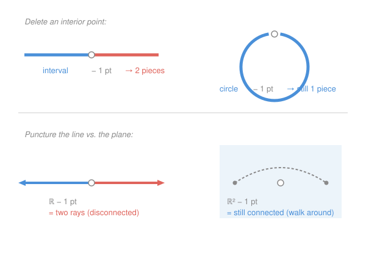

# Topology · Lesson 2.5: Topological properties and telling spaces apart

> ⏱ ~15 min · Module 2: Continuity and new spaces from old · Builds on: [2.1 Continuous functions and homeomorphisms](02-01-continuity-and-homeomorphisms.md), the Module 2 constructions (subspace, product, quotient) · Unlocks: Module 3 — [3.1 Connectedness](03-01-connectedness.md)

## Why this matters

You now know what it means for two spaces to be *the same* — homeomorphic — and you've built a zoo of spaces with the subspace, product, and quotient machines. The natural next question runs the whole rest of this course: **given two spaces, are they homeomorphic or not?** Proving *yes* means exhibiting a single map. Proving *no* is harder — you can't check every possible map and watch them all fail. This lesson gives you the only honest weapon for the "no" side, the **topological invariant**, and it explains why connectedness, compactness, and the fundamental group — the headline acts of Modules 3, 4, and 6 — are all invariants. They are, every one of them, tools built to answer this single question.

## The idea

Think of "homeomorphic" as a game with two very different sides.

To prove $X$ and $Y$ **are** homeomorphic, you build one continuous bijection with a continuous inverse and you're done. One witness settles it.

To prove they are **not**, hunting for maps is hopeless — there are too many. Instead you find a **property that survives homeomorphism** and that one space has and the other lacks. A property that survives is called a *topological invariant*: if $X\cong Y$ then $X$ and $Y$ agree on it. Contrapositive — the whole trick — **if they disagree on even one invariant, they can't be homeomorphic.** You don't compare the spaces directly; you compare two *fingerprints* and note they differ.

The catch is that the property must be genuinely topological — expressible using only open sets, not distance. "Bounded" and "complete" feel like they describe a space, but they're facts about a *metric*, and a homeomorphism is free to stretch distance to infinity. The open interval $(0,1)$ and the whole line $\mathbb R$ are homeomorphic, yet one is bounded and complete-free and the other is unbounded and complete. Distance-facts are not fingerprints. Open-set-facts are.

## The formal version

**Topological property (invariant).** A property $P$ of spaces is a **topological property** if, whenever $X$ has $P$ and $X\cong Y$ (there is a homeomorphism $f:X\to Y$), then $Y$ has $P$ too.

> In words: an invariant is any yes/no feature that a homeomorphism can never change. Homeomorphic spaces share *all* of them.

**The contrapositive (the actual tool).** If $X$ has an invariant $P$ and $Y$ does not, then $X\not\cong Y$.

> In words: one differing invariant is a complete proof that two spaces are different.

Because $\cong$ is an equivalence relation (reflexive, symmetric, transitive — check: identity, inverse map, composition), invariants are exactly the **class functions** of that relation: they're constant on each homeomorphism class. Sorting spaces by their invariants is sorting them into those classes.

**A starter kit.** Each of these is a topological invariant (proofs come in the module noted):

| Invariant | What it measures | Proved in |
|---|---|---|
| cardinality $|X|$ | how many points | now (a bijection preserves it) |
| discrete / indiscrete | is *every* set open / only $\varnothing,X$ | now (openness transports along $f$) |
| number of connected components | how many "pieces" | [3.1](03-01-connectedness.md) |
| compactness | "finiteness for infinite spaces" | [4.1](04-01-compactness-open-covers.md) |
| Hausdorff ($T_2$) | can points be separated by opens | Module 5 |
| fundamental group $\pi_1(X)$ | loops that can't be undone | [6.4](06-04-induced-homomorphisms-invariance.md) |

**Not invariants** (metric facts, not topological): **boundedness**, **completeness**, **diameter**, the specific distances themselves. Witness: $f:(0,1)\to\mathbb R$, $f(x)=\tan\!\big(\pi(x-\tfrac12)\big)$, is a homeomorphism. Yet $(0,1)$ is bounded and $\mathbb R$ is not; $\mathbb R$ is complete (Cauchy sequences converge) and $(0,1)$ is not (the sequence $\tfrac1n$ is Cauchy but escapes). Same topological space, opposite metric verdicts — so those verdicts can't be topological.

**The cut-point lemma.** Deleting a point is a topological operation, and this is why it works:

> **Lemma.** If $f:X\to Y$ is a homeomorphism and $x\in X$, then the restriction $f\big|_{X\setminus\{x\}}$ is a homeomorphism $X\setminus\{x\}\;\cong\;Y\setminus\{f(x)\}$.

*Proof.* Since $f$ is a bijection and $f(x)$ has the single preimage $x$, restricting $f$ to $X\setminus\{x\}$ gives a bijection onto $Y\setminus\{f(x)\}$. A restriction of a continuous map to a subspace is continuous (the subspace topology of Module 2 is built exactly so that preimages of opens stay open), and the same argument applied to $f^{-1}$ shows the inverse is continuous. So the restriction is a homeomorphism. $\blacksquare$

> In words: punch the same-numbered hole in two homeomorphic spaces and what's left is still homeomorphic. So **anything you can say about "the space with a point removed" is itself an invariant** — number of pieces, in particular. Call $x$ a **cut point** of $X$ if $X\setminus\{x\}$ has more components than $X$; the lemma says $x$ is a cut point of $X$ iff $f(x)$ is a cut point of $Y$. The count of cut points (and of non-cut points) is thus an invariant.

## Picture

## Worked examples

**Example 1 (mechanical — $[0,1]\not\cong(0,1)$, count the non-cut points).** In the open interval $(0,1)$, delete *any* point $c$: you get $(0,c)\cup(c,1)$, two pieces. So **every** point of $(0,1)$ is a cut point; it has **zero** non-cut points. In the closed interval $[0,1]$, deleting an interior point again gives two pieces — but deleting an endpoint, say $0$, leaves $(0,1]$, which is still one piece. So $[0,1]$ has exactly **two** non-cut points (its endpoints). The number of non-cut points is an invariant (cut-point lemma), and $0\neq 2$, so $[0,1]\not\cong(0,1)$. The endpoints are precisely what a homeomorphism would have to conjure out of nothing — and it can't.

**Example 2 (why you'd care — $[0,1]\not\cong S^1$, the boss-problem argument).** Take the circle $S^1$ and delete any single point: what remains is an arc, which is connected — **one** piece. So $S^1$ has *no* cut points at all. But the interval $[0,1]$ does have one — any interior point, e.g. $\tfrac12$, disconnects it. "Possessing a cut point" is an invariant, present for $[0,1]$ and absent for $S^1$, so $[0,1]\not\cong S^1$. This is half of Boss Problem 2, and the intuition is exactly the picture: you can't cut a loop with one snip, but one snip severs a string. (The letters **Y** and **I** split the same way: **Y** has a triple point whose removal leaves *three* pieces, while no single point of the segment **I** leaves more than two — so $\mathbf Y\not\cong\mathbf I$.)

**Example 3 (the punchline — $\mathbb R\not\cong\mathbb R^2$).** Suppose a homeomorphism $f:\mathbb R\to\mathbb R^2$ existed. By the lemma, $\mathbb R\setminus\{0\}\cong\mathbb R^2\setminus\{f(0)\}$. But $\mathbb R\setminus\{0\}=(-\infty,0)\cup(0,\infty)$ is **disconnected** — two rays — while the punctured plane $\mathbb R^2\setminus\{p\}$ is **connected**: any two points can be joined by a path that simply detours around the missing point $p$ (bend the straight segment if it would hit $p$). Number of components is an invariant, $2\neq 1$, contradiction. So $\mathbb R\not\cong\mathbb R^2$. Removing a point is what breaks the tie: the line is one-dimensional and a point severs it; the plane has room to walk around. (Warning for later: this exact trick does **not** separate $\mathbb R^2$ from $\mathbb R^3$ — deleting a point leaves *both* connected — and settling $\mathbb R^m\not\cong\mathbb R^n$ in general needs the algebraic topology of Module 6.)

## Watch out

- You might think that **failing to find a distinguishing invariant proves the spaces are homeomorphic** — but it only means *your current kit* can't tell them apart. $\mathbb R^2$ and $\mathbb R^3$ agree on connectedness, cut points, compactness, and cardinality; only $\pi_1$ (Module 6) finally separates them. A negative result is "not yet," never "the same."
- You might think **boundedness or completeness counts as a fingerprint** — but those are properties of a *metric*, and homeomorphisms don't preserve metrics. $(0,1)\cong\mathbb R$ kills both. Only open-set-expressible properties are invariants.
- You might think a cut-point argument can compare **different numbers of removed points** — but the lemma pairs $X\setminus\{x\}$ with $Y\setminus\{f(x)\}$: *one* removed on each side, or $n$ on each side. Deleting one point from $X$ and two from $Y$ compares nothing. Match the counts.

## One-liner

> To prove two spaces are the same, build one map; to prove they're different, exhibit one topological invariant they disagree on — and "delete a point, count the pieces" is the first such weapon.

## Problems

**P1 (🟢)** Prove that the half-open interval $[0,1)$ and the open interval $(0,1)$ are **not** homeomorphic, using non-cut points.

**P2 (🟡)** Regard the capital letters **X** and **Y** as subsets of the plane (four segments meeting at a center; three segments meeting at a branch point). Prove $\mathbf X\not\cong\mathbf Y$. (Hint: the *largest number of pieces* obtainable by deleting a single point is an invariant.)

**P3 (🔴, optional)** Prove that the circle $S^1$ and the sphere $S^2$ are not homeomorphic. (Hint: one point isn't enough — think about deleting a well-chosen *pair* of points, and use that the cut-point lemma works for any fixed number of removed points.)

Solutions

**P1** Classify each point by whether removing it disconnects the space.
- In $(0,1)$: deleting any $c\in(0,1)$ leaves $(0,c)\cup(c,1)$, two pieces. Every point is a cut point, so $(0,1)$ has **0 non-cut points**.
- In $[0,1)$: deleting the endpoint $0$ leaves $(0,1)$, still connected — so $0$ is a non-cut point. Deleting any interior $c\in(0,1)$ leaves $[0,c)\cup(c,1)$, disconnected. So $[0,1)$ has exactly **1 non-cut point**.

By the cut-point lemma, a homeomorphism $f:[0,1)\to(0,1)$ would send non-cut points to non-cut points bijectively, forcing the two counts to match. But $1\neq 0$. Hence $[0,1)\not\cong(0,1)$. $\blacksquare$

**P2** Define $N(Z)=\max_{z\in Z}\big(\text{number of components of } Z\setminus\{z\}\big)$ — the most pieces one deletion can make. By the cut-point lemma this maximum is a topological invariant: a homeomorphism $f$ matches $Z\setminus\{z\}\cong W\setminus\{f(z)\}$ component-for-component, so the achievable component counts are identical, and so are their maxima.

- For **X**: deleting the center point leaves four disjoint half-open segments — **4** pieces. No point does better (deleting a non-center point leaves at most 2 pieces). So $N(\mathbf X)=4$.
- For **Y**: deleting the triple (branch) point leaves three half-open segments — **3** pieces, and that's the best available. So $N(\mathbf Y)=3$.

Since $N(\mathbf X)=4\neq 3=N(\mathbf Y)$, we conclude $\mathbf X\not\cong\mathbf Y$. $\blacksquare$

**P3** Deleting a single point fails: $S^1$ minus a point is an arc (connected) and $S^2$ minus a point is connected too, so one deletion can't separate them. Delete a *pair* instead. The cut-point lemma extends verbatim to any finite set: a homeomorphism $f:S^1\to S^2$ restricts to $S^1\setminus\{a,b\}\cong S^2\setminus\{f(a),f(b)\}$ for any two points $a,b$.

- Choose any $a\neq b$ in $S^1$. Then $S^1\setminus\{a,b\}$ is two disjoint open arcs — **disconnected**.
- But $S^2$ minus *any* two points $p,q$ is **connected**: given two points on the punctured sphere, join them by a path, and if it would hit $p$ or $q$, nudge it around — a sphere minus two points has plenty of room (it's homeomorphic to an open cylinder / annulus).

Number of components is an invariant, and $2\neq 1$, a contradiction. So no homeomorphism exists: $S^1\not\cong S^2$. (Deleting one point can't see the difference; deleting two can — the right *number* of removals is part of choosing the invariant.) $\blacksquare$

## Flashback

**From Lesson 2.1 (Continuous functions and homeomorphisms):** Consider $f:[0,2\pi)\to S^1$ given by $f(t)=(\cos t,\sin t)$, wrapping the half-open interval once around the unit circle. Show that $f$ is a **continuous bijection** but **not** a homeomorphism — pinpoint where its inverse fails to be continuous.

Solution

*Bijection:* every point of $S^1$ is $(\cos t,\sin t)$ for exactly one $t\in[0,2\pi)$ (angle, measured once around), so $f$ is one-to-one and onto. *Continuous:* $\cos$ and $\sin$ are continuous, so $f$ is (continuity into the plane is coordinatewise; $S^1$ carries the subspace topology from $\mathbb R^2$).

*But $f^{-1}$ is not continuous at the point $(1,0)=f(0)$.* Take points on the circle approaching $(1,0)$ from just below the positive $x$-axis — say $z_n=(\cos(2\pi-\tfrac1n),\sin(2\pi-\tfrac1n))$. These converge to $(1,0)$ in $S^1$. Their preimages are $f^{-1}(z_n)=2\pi-\tfrac1n\to 2\pi$, **not** $0=f^{-1}(1,0)$. A continuous inverse would force $f^{-1}(z_n)\to f^{-1}(1,0)=0$; instead they run to the far end $2\pi$. So $f^{-1}$ jumps, and $f$ is not a homeomorphism.

The moral, and the reason this belongs to today's lesson: a continuous bijection is *not* enough — you must check the inverse too. And the failure is no accident. $[0,2\pi)$ has cut points (delete any interior point and it splits) while $S^1$ has none, so by this lesson's Example 2 they genuinely *aren't* homeomorphic — no continuous bijection could have had a continuous inverse. (Boss Problem 4 will show that *compactness* of the domain is exactly the extra hypothesis that upgrades a continuous bijection into a homeomorphism.) $\blacksquare$

## Connections

- **Backward:** the cut-point lemma is powered by [2.1](02-01-continuity-and-homeomorphisms.md)'s homeomorphism definition and the subspace topology from Module 2 — a restriction of a homeomorphism is a homeomorphism only because subspaces inherit continuity cleanly.
- **Forward:** this lesson is the *reason* the next three modules exist. [3.1](03-01-connectedness.md) makes "number of pieces" rigorous (turning every cut-point argument above into a theorem), [4.1](04-01-compactness-open-covers.md) adds compactness, and [6.4](06-04-induced-homomorphisms-invariance.md) proves $\pi_1$ is an invariant — the one that finally distinguishes $\mathbb R^2$ from $\mathbb R^3$. Boss Problem 2 is Examples 2 and 3 written up together.
- **Sideways:** the "same size means a bijection" test that decided countability in `real-analysis` (1.4) is cardinality — the crudest invariant on today's list. Topology keeps the bijection but demands it respect open sets too; a homeomorphism is a bijection that also preserves *shape*, not just *count*.
