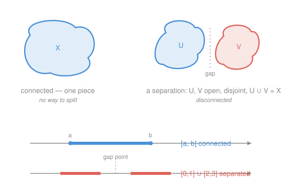

# Topology · Lesson 3.1: Connectedness

> ⏱ ~15 min · Module 3: Connectedness · Builds on: [2.1 Continuous functions and homeomorphisms](02-01-continuity-and-homeomorphisms.md), Module 1 · Unlocks: [3.2 Path-connectedness and components](03-02-path-connectedness-components.md)

## Why this matters

"Is this one piece or several?" sounds like a question you answer by looking. Topology has to answer it without a picture — for function spaces, for the surface of a doughnut, for a set of matrices — so it needs a definition that uses *only* open sets. That definition is connectedness, and it is the engine behind the Intermediate Value Theorem: the reason a continuous path from below sea level to above it must cross sea level is that the interval it walks along is *connected* and can't be torn. Get connectedness right here and the generalized IVT (Lesson 3.3) is a two-line corollary.

## The idea

Take a space and try to break it into two chunks that are genuinely *apart* — each chunk open, so neither one touches the boundary of the other, no shared edge, nothing straddling. If you can pull the space cleanly into two such non-empty halves, it was two pieces all along. If every attempt fails — one half always comes up empty — the space is **connected**.

The thing you actually *check* is the failed break, called a **separation**. Connectedness is the *absence* of one. That negative framing is not a quirk; it's the whole method. To prove a space connected you assume a separation exists and derive a contradiction; to prove it disconnected you exhibit one separation and stop.

Two warnings the pictures won't give you. First, the halves must be **open** — cut along an ordinary boundary and the boundary point has to land in one side, spoiling the split, which is exactly why a solid interval resists tearing. Second, "no visible gap" does *not* mean connected: the rationals $\mathbb{Q}$ have holes at every irrational, and those invisible holes are enough to shatter them completely.

## The formal version

Throughout, $X$ is a topological space.

**Separation.** A **separation** of $X$ is a pair of open sets $U, V \subseteq X$ that are

$$U \neq \varnothing,\quad V \neq \varnothing,\quad U \cap V = \varnothing,\quad U \cup V = X.$$

> In words: two non-empty open halves, disjoint, that together cover everything. All four conditions matter — drop any one and it proves nothing.

**Connected.** $X$ is **connected** if no separation of it exists. A subset $A \subseteq X$ is connected when it is connected *as a space in its own right*, using the subspace topology from [2.2 The subspace topology](02-02-subspace-topology.md) — so "open" means open-in-$A$.

> In words: connected = unbreakable into two clean open pieces.

**Three faces of the same idea.** A set is **clopen** if it is both open and closed. The following are equivalent:

1. $X$ is connected (no separation).
2. The only clopen subsets of $X$ are $\varnothing$ and $X$.
3. Every continuous map $f : X \to \{0,1\}$, where $\{0,1\}$ carries the discrete topology, is constant.

> In words: connected means there's no non-trivial set that is simultaneously open and closed, equivalently no continuous way to stamp part of the space "0" and the rest "1."

**Proof (1 ⟺ 2).** A separation $U,V$ gives a clopen set: $U$ is open, and $U = X \setminus V$ is closed because $V$ is open — so $U$ is clopen, non-empty, and $\neq X$ (since $V \neq \varnothing$). Conversely, if $A$ is clopen with $A \neq \varnothing, X$, then $A$ and $X \setminus A$ are both open (the second because $A$ is closed), non-empty, disjoint, and cover $X$ — a separation. So separations and non-trivial clopen sets come in pairs; one exists iff the other does. $\blacksquare$

**Proof (2 ⟺ 3).** In the discrete topology on $\{0,1\}$ every subset is open. Given continuous $f: X \to \{0,1\}$, the set $f^{-1}(\{0\})$ is open (preimage of an open set) and equals $X \setminus f^{-1}(\{1\})$, which is also open — so $f^{-1}(\{0\})$ is clopen. If the only clopen sets are $\varnothing$ and $X$, then $f^{-1}(\{0\})$ is one of them, i.e. $f$ is constant. Conversely, a non-trivial clopen $A$ builds a non-constant continuous map: set $f = 0$ on $A$ and $f = 1$ on $X \setminus A$; the preimage of each of the four open sets $\varnothing, \{0\}, \{1\}, \{0,1\}$ is $\varnothing, A, X\setminus A, X$ — all open — so $f$ is continuous. $\blacksquare$

**Theorem (intervals are the connected subsets of $\mathbb{R}$).** A subset $C \subseteq \mathbb{R}$ is connected **iff** it is an interval — meaning $a, b \in C$ and $a < c < b$ force $c \in C$.

> In words: on the line, "one piece" and "no gaps" finally coincide — but *only* on the line, and only because $\mathbb{R}$ is complete.

**Proof (not an interval ⟹ disconnected).** If $C$ is not an interval, pick $a, b \in C$ and a gap point $c$ with $a < c < b$ but $c \notin C$. Then $U = (-\infty, c) \cap C$ and $V = (c, \infty) \cap C$ are open in $C$, disjoint, non-empty ($a \in U$, $b \in V$), and cover $C$ because no point of $C$ equals $c$. Separation. $\blacksquare$

**Proof (interval ⟹ connected).** Let $I$ be an interval and suppose $I = U \cup V$ is a separation. Pick $a \in U$, $b \in V$; relabel so $a < b$. Since $I$ is an interval, $[a,b] \subseteq I$. Let

$$c = \sup\big(U \cap [a,b]\big),$$

which exists because the set is non-empty ($a$ is in it) and bounded above by $b$ — this is the **least-upper-bound property**, i.e. completeness of $\mathbb{R}$, imported from `real-analysis`. Now $c \in [a,b] \subseteq I$, so $c \in U$ or $c \in V$.

- If $c \in U$: then $c \neq b$ (as $b \in V$), so $c < b$. $U$ is open in $I$, so some $(c-\delta, c+\delta) \cap I \subseteq U$; points just right of $c$ up to $b$ lie in $I$, hence in $U \cap [a,b]$, and exceed $c$ — contradicting $c$ being an upper bound.
- If $c \in V$: then $c \neq a$, so $c > a$. $V$ is open in $I$, so $(c-\delta, c+\delta) \cap I \subseteq V$; every point of $(c-\delta, c] $ in $[a,b]$ lies in $V$, hence *not* in $U$. But $c$ is the *least* upper bound, so some $u \in U \cap [a,b]$ satisfies $u > c - \delta$ — putting $u$ in that interval, hence in $V$, contradicting $U \cap V = \varnothing$.

Both cases are impossible, so no separation exists. $\blacksquare$

**Theorem (continuous image of connected is connected).** If $f: X \to Y$ is continuous and $X$ is connected, then $f(X)$ is connected.

> In words: continuity can bend and stretch a space, but it cannot tear one piece into two.

**Proof.** Give $Z = f(X)$ the subspace topology and suppose $Z = U \cup V$ is a separation. The preimages $f^{-1}(U)$ and $f^{-1}(V)$ are open in $X$ (continuity), disjoint (as $U, V$ are), cover $X$ (as $U, V$ cover all of $f(X)$), and are non-empty (every point of $Z$ is actually attained). So they separate $X$ — contradicting that $X$ is connected. Hence $Z$ has no separation. $\blacksquare$

This is the machine that will drive the generalized IVT in Lesson 3.3: connectedness is preserved forward through every continuous map.

**Gluing lemma (common-point union).** Let $\{A_i\}_{i\in I}$ be connected subspaces of $X$ sharing a common point $p \in \bigcap_i A_i$. Then $A = \bigcup_i A_i$ is connected.

> In words: overlapping connected pieces fuse — if they all pin to one shared point, the union is one piece.

**Proof.** Suppose $A = U \cup V$ is a separation. The point $p$ lies in $U$ or $V$; say $p \in U$. For each $i$, the sets $A_i \cap U$ and $A_i \cap V$ are open in $A_i$, disjoint, and cover $A_i$ — a separation of $A_i$ *unless one is empty*. Since $A_i$ is connected, one is empty; and $p \in A_i \cap U$ keeps that side non-empty, forcing $A_i \cap V = \varnothing$, i.e. $A_i \subseteq U$. True for every $i$, so $A \subseteq U$ and $V = \varnothing$ — contradiction. $\blacksquare$

Two connected sets $C, D$ with $C \cap D \neq \varnothing$ are the special case (take any $p \in C \cap D$), and induction extends it to a *chain* $A_1, A_2, \dots$ with each $A_n \cap A_{n+1} \neq \varnothing$: the partial unions stay connected because $A_1 \cup \cdots \cup A_n$ overlaps $A_{n+1}$.

**Theorem (closure of a connected set is connected).** If $A$ is connected and $A \subseteq B \subseteq \overline{A}$ (its closure), then $B$ is connected — in particular $\overline{A}$ is.

> In words: connectedness survives adding limit points; you can thicken a connected set right up to its closure without breaking it.

**Proof.** Suppose $B = U \cup V$ is a separation. As above, $A$ is connected and $A \cap U, A \cap V$ separate it unless one is empty — so $A$ lies entirely in one side, say $A \subseteq U$. Now $V$ is non-empty; pick $x \in V \subseteq B \subseteq \overline{A}$. Since $V$ is open in $B$, write $V = B \cap W$ with $W$ open in $X$ and $x \in W$. Because $x \in \overline{A}$, the neighborhood $W$ meets $A$; but $A \subseteq B$, so $W \cap A = (B \cap W) \cap A = V \cap A$, giving $V \cap A \neq \varnothing$ — contradicting $A \subseteq U$. $\blacksquare$

## Picture

## Worked examples

**Example 1 (mechanical — reading a separation).** Is $X = [0,1] \cup [2,3]$ (subspace of $\mathbb{R}$) connected? Take $U = [0,1]$ and $V = [2,3]$. Each is open *in $X$*: $U = (-0.5, 1.5) \cap X$ is $X$ intersected with an open set of $\mathbb{R}$, and likewise $V = (1.5, 3.5) \cap X$. They are non-empty, disjoint, and cover $X$. That is a separation, so $X$ is disconnected. Notice $[0,1]$ is *not* open in $\mathbb{R}$ — but openness is judged in the subspace $X$, where it is. This is the trap from [2.2 The subspace topology](02-02-subspace-topology.md) working *for* you.

**Example 2 (why you'd care — $\mathbb{Q}$ is totally disconnected).** The rationals have no visible gaps: between any two sits another. Yet $\mathbb{Q}$ is disconnected. Choose any irrational $\alpha$ — say $\alpha = \sqrt{2}$ — and set

$$U = (-\infty, \sqrt2) \cap \mathbb{Q}, \qquad V = (\sqrt2, \infty) \cap \mathbb{Q}.$$

Both are open in $\mathbb{Q}$, non-empty ($0 \in U$, $2 \in V$), disjoint, and cover $\mathbb{Q}$ because no rational equals $\sqrt2$. Separation — so $\mathbb{Q}$ is disconnected. Worse: the *same* trick works between any two distinct rationals (slide an irrational between them), so the only connected subsets of $\mathbb{Q}$ are single points. $\mathbb{Q}$ is **totally disconnected**. The lesson: connectedness is a fact about the *topology*, not about whether your eye sees a hole.

## Watch out

- You might think a separation just needs two disjoint non-empty pieces, but they must also be **open** *and cover $X$*. Split $[0,2]$ into $[0,1]$ and $(1,2]$: disjoint, non-empty, covering — yet $[0,1]$ is not open in $[0,2]$ (the point $1$ has no room to its right), so this is *not* a separation, and indeed $[0,2]$ is connected.
- You might think "clopen" means "not open," but it means **open and closed at once**. In any space $\varnothing$ and $X$ are always clopen; connectedness says those are the *only* ones. Finding a third clopen set is finding a separation.
- You might think "no gaps you can see" implies connected. $\mathbb{Q}$ is the standing counterexample — dense in $\mathbb{R}$, gapless to the eye, and totally disconnected. Conversely $[0,1] \cup [2,3]$ has an obvious visible gap and is disconnected for the honest reason. Trust the open sets, not the picture.

## One-liner

> Connected means no separation — no splitting into two non-empty disjoint *open* halves — equivalently no non-trivial clopen set; on $\mathbb{R}$ that pins the connected sets to exactly the intervals, and continuity can never tear one piece into two.

## Problems

**P1 (🟢)** Exhibit a separation proving that $X = \{(x,y) \in \mathbb{R}^2 : x \neq 0\}$ (the plane with the $y$-axis deleted, subspace of $\mathbb{R}^2$) is disconnected. State each of the four separation conditions explicitly for your pieces.

**P2 (🟡)** Let $X$ be connected and $f: X \to \mathbb{R}$ continuous, taking at least one negative value and at least one positive value. Prove $f(x) = 0$ for some $x \in X$. (This is the seed of the IVT you'll generalize in [3.3 Connectedness at work](03-03-connectedness-applications.md).)

**P3 (🔴, optional)** Prove that $\mathbb{R}^2$ is connected, using the gluing lemma. (Hint: cover $\mathbb{R}^2$ by lines through the origin; show each is connected and that they share a point.)

Solutions

**P1** Let $U = \{(x,y) : x > 0\}$ and $V = \{(x,y) : x < 0\}$. Checking the four conditions:
- **Open:** $U = X \cap \{x > 0\}$ and $V = X \cap \{x < 0\}$, each $X$ intersected with an open half-plane of $\mathbb{R}^2$, so each is open in $X$. (In fact both are already open in $\mathbb{R}^2$.)
- **Non-empty:** $(1,0) \in U$, $(-1,0) \in V$.
- **Disjoint:** no point has $x > 0$ and $x < 0$ at once.
- **Cover:** every point of $X$ has $x \neq 0$, so $x > 0$ or $x < 0$.

All four hold, so $\{U, V\}$ is a separation and $X$ is disconnected. (Deleting the whole $y$-axis is what does it — deleting a single point leaves the punctured plane *connected*, a Lesson 3.2 fact.)

**P2** By the continuous-image theorem, $f(X)$ is a connected subset of $\mathbb{R}$, hence an **interval** (the interval theorem). It contains a negative value $p < 0$ and a positive value $q > 0$. The interval property applied to $p < 0 < q$ forces $0 \in f(X)$. But $0 \in f(X)$ means $0 = f(x)$ for some $x \in X$. 

(Separation-flavored view, same content: if $f$ were never $0$, then $f(X) \subseteq (-\infty,0) \cup (0,\infty)$, and $f(X)\cap(-\infty,0)$, $f(X)\cap(0,\infty)$ would be a separation of the connected set $f(X)$ — impossible.) $\blacksquare$

**P3** For each unit vector $v \in \mathbb{R}^2$, the line $L_v = \{\, t v : t \in \mathbb{R}\,\}$ is the image of $\mathbb{R}$ under the continuous map $t \mapsto tv$. Since $\mathbb{R}$ is an interval, it is connected, so each $L_v$ is connected (continuous-image theorem). Every point $x \in \mathbb{R}^2$ lies on such a line — the one through $0$ and $x$ — so

$$\mathbb{R}^2 = \bigcup_{v} L_v.$$

Every $L_v$ passes through the origin, so $0 \in \bigcap_v L_v$ is a common point. By the gluing lemma, the union $\mathbb{R}^2$ is connected. $\blacksquare$

## Flashback

**From Lesson 2.1 (Continuous functions and homeomorphisms):** Let $f: X \to Y$ and $g: Y \to Z$ be continuous. Prove directly from the open-set (preimage) definition that the composite $g \circ f : X \to Z$ is continuous. (You used exactly this to know that "$f$ as a map into its image" behaves well above.)

Solution

Let $W \subseteq Z$ be open. The key set identity is

$$(g \circ f)^{-1}(W) = f^{-1}\big(g^{-1}(W)\big),$$

since $x \in (g\circ f)^{-1}(W) \iff g(f(x)) \in W \iff f(x) \in g^{-1}(W) \iff x \in f^{-1}(g^{-1}(W))$. Now peel outward: $g$ is continuous, so $g^{-1}(W)$ is open in $Y$; then $f$ is continuous, so $f^{-1}$ of that open set is open in $X$. Hence $(g\circ f)^{-1}(W)$ is open for every open $W$, which is exactly continuity of $g \circ f$. $\blacksquare$

## Connections

- **Backward:** the whole definition rides on "open in the subspace" from [2.2 The subspace topology](02-02-subspace-topology.md) and on continuity-as-preimages from [2.1 Continuous functions and homeomorphisms](02-01-continuity-and-homeomorphisms.md); the interval theorem cashes in the least-upper-bound property proved in `real-analysis`.
- **Forward:** [3.2 Path-connectedness and components](03-02-path-connectedness-components.md) refines "one piece" into paths and splits any space into maximal connected components; [3.3 Connectedness at work](03-03-connectedness-applications.md) turns the continuous-image theorem into the generalized Intermediate Value Theorem.
- **Sideways:** connectedness is a **topological invariant** — homeomorphic spaces are connected together or disconnected together — which is why cut-point arguments in [2.5 Topological properties and telling spaces apart](02-05-topological-properties-invariants.md) can prove $[0,1]$ and $S^1$ genuinely different spaces. The same invariant is what lets a physicist argue a continuously varying quantity on a connected configuration space cannot jump between separated values.
