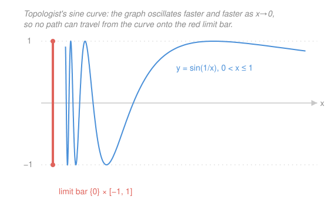

# Topology · Lesson 3.2: Path-connectedness and components

> ⏱ ~15 min · Module 3: Connectedness · Builds on: [3.1 Connectedness](03-01-connectedness.md) · Unlocks: [3.3 Connectedness at work](03-03-connectedness-applications.md)

## Why this matters

Lesson [3.1](03-01-connectedness.md) defined "one piece" negatively — a space is connected if you *can't* chop it into two open halves. That's the right definition, but it's hard to picture. Here's the picture you actually carry in your head: can you *walk* from any point to any other without leaving the space? That's **path-connectedness**, and it's the notion that turns into loops, the fundamental group, and every "you can't undo this deformation" argument in Module 6. The two ideas agree almost always — but one famous space pries them apart, and understanding exactly *how* it fails is how you really learn what continuity buys you.

## The idea

Take a country. "Connected" (3.1's version) says you can't split it into two open regions with nothing between them. "Path-connected" says something more hands-on: from any city you can *drive* to any other along a continuous road that never leaves the country. Draw the road, don't lift your pen.

Intuitively these should be the same, and for every space you'd draw on a napkin they *are*: a disk, a line, a filled square, all of $\mathbb{R}^n$. Path-connected always forces connected — if you can drive between the two halves of a proposed split, the split was a lie.

The shock is that the converse fails. There is a space that is genuinely one piece in 3.1's sense — you cannot separate it by open sets — yet has two points with *no continuous road between them*. The road would have to survive an infinitely fast wiggle, and no continuous function can. That space is the **topologist's sine curve**, and it's the reason these two words are not synonyms.

## The formal version

**Path.** A **path** in a space $X$ from $a$ to $b$ is a continuous map $\gamma:[0,1]\to X$ with $\gamma(0)=a$ and $\gamma(1)=b$. Here $[0,1]$ carries its standard topology; $\gamma(t)$ is "where you are at time $t$."

> In words: a path is a continuous trip that starts at $a$ (time 0) and ends at $b$ (time 1). It is the *map*, not the curve it traces.

**Path-connected.** $X$ is **path-connected** if for *every* pair $a,b\in X$ there is a path from $a$ to $b$.

> In words: you can drive between any two points.

(These same paths, deformed into each other, are the raw material of the fundamental group in [6.1](06-01-homotopy-of-paths.md) — we're building the vocabulary now.)

**Theorem (path-connected ⟹ connected).** If $X$ is path-connected, it is connected.

*Proof.* Suppose not: then $X=U\cup V$ with $U,V$ nonempty, open, disjoint — a **separation** (3.1). Pick $a\in U$ and $b\in V$, and take a path $\gamma:[0,1]\to X$ from $a$ to $b$. Now $\gamma^{-1}(U)$ and $\gamma^{-1}(V)$ are open in $[0,1]$ (preimages of open sets under the continuous $\gamma$ — [2.1](02-01-continuity-and-homeomorphisms.md)), they are disjoint, they cover $[0,1]$, and each is nonempty ($0\in\gamma^{-1}(U)$, $1\in\gamma^{-1}(V)$). That's a separation of $[0,1]$ — but $[0,1]$ is connected (an interval, by 3.1). Contradiction. So no separation of $X$ exists; $X$ is connected. $\blacksquare$

> In words: a road from $U$ to $V$ would pull back the split onto the unsplittable interval — impossible.

**Corollary.** Any **convex** subset $C\subseteq\mathbb{R}^n$ (one where the straight segment between any two of its points stays inside) is path-connected, since $\gamma(t)=(1-t)a+tb$ is a path. Hence $C$ is connected. In particular $\mathbb{R}^n$ itself, balls, and boxes are connected.

## Picture

**The counterexample — the topologist's sine curve.** Let

$$S=\underbrace{\{(x,\sin(1/x)):0<x\le 1\}}_{\text{the curve } C}\ \cup\ \underbrace{\{0\}\times[-1,1]}_{\text{the limit bar } L}.$$

As $x\to 0^+$, $1/x\to\infty$, so $\sin(1/x)$ swings between $-1$ and $+1$ faster and faster — infinitely many full oscillations crammed into any sliver near $x=0$. The **limit bar** $L$ is the vertical segment those oscillations pile up against.

*$S$ is connected.* The curve $C$ is the continuous image of the connected interval $(0,1]$ (via $x\mapsto(x,\sin(1/x))$), hence connected (3.1: continuous image of connected is connected). And $S$ is exactly the **closure** $\overline{C}$: every point of the bar $L$ is a limit of points on $C$ (near $x=0$ the curve hits every height in $[-1,1]$ over and over). By 3.1's fact that *the closure of a connected set is connected*, $S=\overline{C}$ is connected. So there is **no** way to separate $S$ by open sets.

*$S$ is not path-connected.* Claim: no path joins a point of the bar $L$ to a point of the curve $C$. Suppose $\gamma:[0,1]\to S$ is continuous with $\gamma(0)=p\in L$. Let $t^*=\sup\{t:\gamma(t)\in L\}$; by continuity $\gamma(t^*)\in L$ too, and for $t$ just past $t^*$ the point $\gamma(t)$ is on the curve $C$ with first coordinate $x(t)>0$ shrinking to $0$ as $t\to t^{*+}$. But on any interval $(t^*,t^*+\delta]$ the $x$-coordinate sweeps down through a whole range near $0$, so $\sin(1/x)$ — the *second* coordinate of $\gamma(t)$ — takes both the value $+1$ and the value $-1$ arbitrarily close to $t^*$. Then $\gamma$ cannot be continuous at $t^*$: its second coordinate oscillates by a full $2$ in every neighborhood of $t^*$, so it can't approach the single value the second coordinate of $\gamma(t^*)$ has. Contradiction. No path crosses from $L$ to $C$ — $S$ is **not** path-connected. The oscillation is the whole mechanism: continuity demands the output settle down, and $\sin(1/x)$ refuses to.

## Worked examples

**Example 1 (mechanical — the punctured plane).** Is $\mathbb{R}^2\setminus\{(0,0)\}$ (the plane with the origin removed) path-connected? Yes. Given $a,b\neq 0$: if the straight segment from $a$ to $b$ misses the origin, use it. If it passes through the origin (i.e. $a,b$, and $0$ are collinear with $0$ between them), route through a third point $c$ off that line — go $a\to c$ then $c\to b$, splicing two segments into one path (travel the first on $[0,\tfrac12]$, the second on $[\tfrac12,1]$). Every pair is joinable, so the punctured plane is path-connected, hence connected. (Contrast $\mathbb{R}\setminus\{0\}$, which *is* disconnected — removing a point cuts a line but not a plane. This gap is exactly Boss problem 2's tool for telling $\mathbb{R}$ from $\mathbb{R}^2$.)

**Example 2 (why you'd care — components of a messy set).** Take $A=(0,1)\cup(2,3)\cup\{5\}$ inside $\mathbb{R}$. Your eye sees three pieces, and the machinery agrees: each of $(0,1)$, $(2,3)$, and $\{5\}$ is a maximal connected subset — a **component**. No connected subset of $A$ straddles the gap from $(0,1)$ to $(2,3)$, because such a subset would inherit a separation. So $A$ has exactly three components. This is the everyday use of the concept: *count the pieces*, rigorously, in any space — the theme [3.3](03-03-connectedness-applications.md) turns into an invariant for telling spaces apart.

## Components: cutting a space into maximal pieces

Even a disconnected space is a disjoint union of connected chunks. Make that precise.

**Connected components.** Define $x\sim y$ if some connected subset of $X$ contains both $x$ and $y$. This is an **equivalence relation** (reflexive: $\{x\}$ is connected; symmetric: obvious; transitive: two connected sets sharing the point $y$ have connected union, by 3.1). Its equivalence classes are the **connected components** of $X$: the *maximal* connected subsets.

> In words: glue $x$ and $y$ together whenever one connected set holds both; the resulting clumps are the components.

Components **partition** $X$ (every point in exactly one) and are each **closed** (the closure of a connected set is connected, so a maximal one already contains its closure).

**Path components** are defined identically with "path" in place of "connected": $x\approx y$ if a path joins them (transitivity = splice two paths, as in Example 1). Its classes are the **path components** — the maximal path-connected subsets.

**How the two compare.** Since path-connected ⟹ connected, each path component sits inside a single connected component: **components ⊇ path components** (a component may break into several path components). For the topologist's sine curve, $S$ is one connected component but *two* path components — the curve $C$ and the bar $L$ — the whole point of the example.

They **coincide** when the space is **locally path-connected**: every point has arbitrarily small path-connected neighborhoods (true for $\mathbb{R}^n$, manifolds, open subsets of $\mathbb{R}^n$, anything you'd draw). The sine curve fails this exactly at the bar — near a bar point, every small neighborhood catches infinitely many *disconnected* slivers of curve.

## Watch out

- **Connected does *not* imply path-connected.** The topologist's sine curve is the standing counterexample: one connected piece, but no path from the bar to the curve. Path-connected is *strictly stronger*. (The implication runs one way only.)
- **Components are always closed, but not always open.** In $\mathbb{Q}$ (rationals, subspace topology) every component is a *single point* — between any two rationals sits an irrational gap that separates them — yet no single point is open in $\mathbb{Q}$. A space where components fail to be open is called *totally disconnected*; $\mathbb{Q}$ is the poster child.
- **A path is a *map*, not its image.** Two different paths can trace the same curve (one fast, one slow, one doubling back). "Path from $a$ to $b$" is a package deal: continuity on *all* of $[0,1]$, plus the endpoint conditions $\gamma(0)=a$ and $\gamma(1)=b$. Drop continuity at even one point — as the sine curve forces at $t^*$ — and it's not a path.

## One-liner

> Path-connected (you can drive between any two points) always forces connected, but the topologist's sine curve — connected yet un-drivable across its limit bar — proves the converse is false, because continuity can't survive an infinitely fast wiggle.

## Problems

**P1 (🟢)** Prove that the continuous image of a path-connected space is path-connected. (If $f:X\to Y$ is continuous, $X$ path-connected, show $f(X)$ is.)

**P2 (🟡)** Show that the "letter" subsets of the plane below have the stated path components, and in each case say whether the set is connected:
(a) the union of the two coordinate axes, $\{(x,0)\}\cup\{(0,y)\}$;
(b) the graph of $y=1/x$ for $x\neq 0$, i.e. $\{(x,1/x):x\neq 0\}$.

**P3 (🔴, optional)** Let $S$ be the topologist's sine curve. Prove that $S$ is **not** locally connected: exhibit a point $p$ and a neighborhood $N$ of $p$ such that no connected neighborhood of $p$ fits inside $N$. (This is the deeper defect behind the failure of path-connectedness.)

Solutions

**P1** Let $u,v\in f(X)$, so $u=f(a)$, $v=f(b)$ for some $a,b\in X$. Since $X$ is path-connected, take a path $\gamma:[0,1]\to X$ with $\gamma(0)=a$, $\gamma(1)=b$. Then $f\circ\gamma:[0,1]\to f(X)$ is continuous (composite of continuous maps, [2.1](02-01-continuity-and-homeomorphisms.md)), with $(f\circ\gamma)(0)=f(a)=u$ and $(f\circ\gamma)(1)=f(b)=v$. So $f\circ\gamma$ is a path from $u$ to $v$ in $f(X)$. As $u,v$ were arbitrary, $f(X)$ is path-connected. $\blacksquare$ (This is the path-version of "continuous image of connected is connected," and just as useful.)

**P2** (a) The two axes are each a line (path-connected) and they **share the origin** $(0,0)$. Given any two points, drive along the first point's axis to the origin, then along the second's axis out to the target — splice two segments through the shared origin. So the union is **one path component**, hence path-connected, hence **connected**. (There is no gap: the origin welds them.)

(b) The two branches $x>0$ and $x<0$ never meet: the branch $x>0$ lives in the open right half-plane, the branch $x<0$ in the open left half-plane, and these are separated by the open set $\{x<0\}$ vs. $\{x>0\}$ (each branch is open in the subspace and they're disjoint and cover it). Each branch alone is the continuous image of $(0,\infty)$ resp. $(-\infty,0)$, so path-connected. Thus **two path components**, and the set is **disconnected** (the separation into the two branches is a genuine separation). Unlike the sine curve, here the two pieces really are topologically separate — components and path components coincide.

**P3** Take $p=(0,0)$ on the limit bar $L$, and let $N=B\big(p,\tfrac12\big)\cap S$, the part of $S$ inside the open ball of radius $\tfrac12$ about $p$. Suppose some connected neighborhood $W$ of $p$ satisfies $p\in W\subseteq N$. Being a neighborhood, $W$ contains a small ball's worth of $S$ around $p$, so it meets the curve $C$ at points with arbitrarily small $x>0$. But look at the curve inside the strip $0<x<\tfrac12$: it is broken by the vertical lines where $\sin(1/x)$ crosses, say, height $\tfrac34$ into infinitely many separate arcs, and $W$ can be split by a vertical line $x=c$ (choose $c$ small, avoiding the discrete set where the relevant arc touches) into two nonempty relatively-open pieces — the part of $W$ with $x<c$ (which still contains bar points and curve slivers) and the part with $x>c$. That's a separation of $W$, contradicting connectedness. Hence no connected neighborhood of $p$ fits inside $N$: $S$ is not locally connected at $p$. (Local connectedness would have forced components to be *open*; the sine curve's single component is closed but not open near the bar — the same pathology, viewed locally.) $\blacksquare$

## Flashback

**From Lesson 3.1 (Connectedness):** Prove that the "double arrow" set $D=(-1,0)\cup(0,1)\subseteq\mathbb{R}$ is **disconnected**, and then prove that any continuous map $f:D\to\mathbb{Z}$ (integers, discrete topology) must be *constant on each half but need not be constant overall* — contrast this with the same claim for the connected interval $(-1,1)$.

Solution

*Disconnected.* Write $D=U\cup V$ with $U=(-1,0)$ and $V=(0,1)$. Both are open in $\mathbb{R}$ (so open in the subspace $D$), disjoint, nonempty, and their union is all of $D$. That is a separation, so $D$ is disconnected. $\blacksquare$

*Maps to $\mathbb{Z}$.* Each half $(-1,0)$ and $(0,1)$ is an interval, hence connected (3.1). A continuous map from a connected space to the discrete space $\mathbb{Z}$ is constant: preimages of the singletons $\{n\}$ are open (discrete), disjoint, and cover the connected domain, so exactly one is nonempty — otherwise you'd have a separation. So $f$ is constant on $(-1,0)$ (say value $m$) and constant on $(0,1)$ (say value $k$). But nothing forces $m=k$: e.g. $f\equiv 3$ on the left half and $f\equiv 7$ on the right is continuous on $D$. On the *connected* interval $(-1,1)$, by contrast, the same argument runs on the whole domain at once and forces a *single* constant — a continuous $\mathbb{Z}$-valued function on a connected space has no room to jump. This "continuous integer-valued ⟹ locally constant, globally constant iff connected" is precisely the lens [3.3](03-03-connectedness-applications.md) uses to count components. $\blacksquare$

## Connections

- **Backward:** every proof here leans on [3.1](03-01-connectedness.md) — separations, "continuous image of connected is connected," "closure of connected is connected," and "$[0,1]$ is connected." Path-connectedness is 3.1's idea made constructive: instead of *ruling out* a split, you *build* a road.
- **Forward:** [3.3](03-03-connectedness-applications.md) deploys components as a topological invariant (counting pieces to distinguish spaces) and proves the generalized IVT. Further out, paths become the objects of [6.1](06-01-homotopy-of-paths.md) and the fundamental group — where you'll deform one path into another, and "path component" upgrades to "$\pi_0$," the set of pieces.
- **Sideways:** the splice-two-paths trick (Example 1, P2a) is the same "concatenation" that gives loops a group operation in Lesson 6.2 (the fundamental group); and the local-path-connectedness fine print is why every manifold in `relativity`'s differential-geometry material has components that are honest open-and-closed pieces — no sine-curve pathology on a smooth space.
