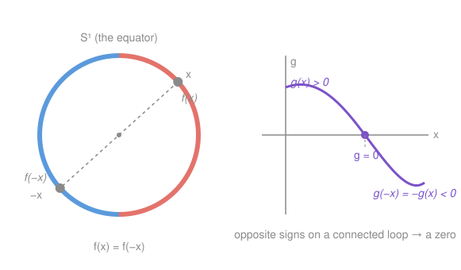

# Topology · Lesson 3.3: Connectedness at work

> ⏱ ~15 min · Module 3: Connectedness · Builds on: [3.1 Connectedness](03-01-connectedness.md), [3.2 Path-connectedness and components](03-02-path-connectedness-components.md) · Unlocks: Module 4 — [4.1 Compactness: open covers](04-01-compactness-open-covers.md)

## Why this matters

Connectedness has sounded abstract for two lessons — "no separation," "one piece." Now it pays. The single fact that **a continuous curve can't jump across a gap** is exactly what forces an equation to have a root, forces two antipodal points on the equator to share a temperature, and forces $\mathbb{R}$ and $\mathbb{R}^2$ to be genuinely different spaces. Every one of these is the same theorem — the Intermediate Value Theorem — freed from the real line and stated where it actually lives: on connected spaces. This is the lesson where a topological property turns into working theorems.

## The idea

Picture a continuous function on a single unbroken piece of space. If it's positive somewhere and negative somewhere else, it can't teleport from $+$ to $-$ without passing through $0$ — there's no gap in the domain to hide the crossing in. That's the whole engine. "Attains two values $\Rightarrow$ attains everything between them," and the *only* hypothesis it needs is that the domain is **connected**.

Notice what that buys immediately. To show an equation $f(x)=0$ has a solution, you don't solve it — you just catch $f$ being positive once and negative once on a connected domain. Existence for free, no formula. And it runs backwards too: if a property is preserved by homeomorphisms and one space has it while another doesn't, the two spaces can't be homeomorphic. Connectedness is such a property, so it becomes a tool for telling spaces apart — the rigorous version of the cut-point hand-waving from [2.5](02-05-topological-properties-invariants.md).

## The formal version

We lean on two facts from [3.1](03-01-connectedness.md), which we now cash in.

**Lemma (connected subsets of $\mathbb{R}$ are intervals).** A set $C\subseteq\mathbb{R}$ is connected **iff** it is an interval — meaning whenever $a,b\in C$ and $a<c<b$, then $c\in C$.

> In words: on the line, "one piece" and "no gaps" are literally the same thing.

**Continuous image of connected is connected** (proved in [3.1](03-01-connectedness.md)): if $X$ is connected and $f:X\to Y$ is continuous, then $f(X)$ is connected.

Put them together.

**Theorem (Generalized Intermediate Value Theorem).** Let $X$ be a connected topological space and $f:X\to\mathbb{R}$ continuous. Then $f(X)$ is an interval: if $y_1,y_2\in f(X)$ and $y_1<y<y_2$, there is a point $p\in X$ with $f(p)=y$.

> In words: a continuous real-valued function on a connected space attains **every** value between any two it attains.

*Proof.* $X$ is connected and $f$ continuous, so $f(X)\subseteq\mathbb{R}$ is connected. By the Lemma, a connected subset of $\mathbb{R}$ is an interval. So if $y_1,y_2\in f(X)$ and $y_1<y<y_2$, the interval property gives $y\in f(X)$ — i.e. some $p\in X$ has $f(p)=y$. $\blacksquare$

Three lines. All the work was done in 3.1; connectedness is the reusable core, and IVT is a one-step corollary.

**Corollary (classical IVT).** If $f:[a,b]\to\mathbb{R}$ is continuous and $y$ lies between $f(a)$ and $f(b)$, then $f(c)=y$ for some $c\in[a,b]$.

*Proof.* $[a,b]$ is an interval, hence connected by the Lemma; apply the theorem with $X=[a,b]$. $\blacksquare$

The version you met in `real-analysis` was the special case $X=[a,b]$ all along. The topological statement is *stronger and simpler*: it doesn't care that the domain is an interval, only that it's connected — so it applies verbatim to a circle, a disk, or a space of functions.

**Connectedness as an invariant — telling spaces apart.** If $h:X\to Y$ is a homeomorphism and $p\in X$, then $h$ restricts to a homeomorphism $X\setminus\{p\}\to Y\setminus\{h(p)\}$ (a bijection stays a bijection, and continuity of $h,h^{-1}$ survives restriction). So *"the space stays connected after deleting one point"* is a topological property. This kills a homeomorphism whenever the two spaces disagree on it.

**Claim: $\mathbb{R}\not\cong\mathbb{R}^2$.** Suppose $h:\mathbb{R}\to\mathbb{R}^2$ were a homeomorphism. Delete $0$ and its image: $h$ would restrict to a homeomorphism $\mathbb{R}\setminus\{0\}\to\mathbb{R}^2\setminus\{h(0)\}$. But $\mathbb{R}\setminus\{0\}=(-\infty,0)\cup(0,\infty)$ is **disconnected**, while $\mathbb{R}^2\setminus\{q\}$ is **path-connected** — any two points are joined by a straight segment, or by a two-segment detour if that segment happens to hit $q$ — hence connected. Homeomorphisms preserve connectedness, so this is impossible. $\blacksquare$ Removing a point disconnects the line but never the plane: that lone dimension is the difference.

## Picture

## Worked examples

**Example 1 (mechanical — a fixed point out of thin air).** *Every continuous $f:[0,1]\to[0,1]$ has a fixed point:* a $c$ with $f(c)=c$.

Define the "gap" function $g:[0,1]\to\mathbb{R}$, $g(x)=f(x)-x$; it's continuous. Check the endpoints against the *codomain constraint* $0\le f\le 1$:

$$g(0)=f(0)-0=f(0)\ge 0,\qquad g(1)=f(1)-1\le 0.$$

So $g$ is $\ge 0$ at one end and $\le 0$ at the other. If either is exactly $0$ we already have a fixed point; otherwise $g(0)>0>g(1)$, and $[0,1]$ is connected, so the IVT hands us a $c$ with $g(c)=0$, i.e. $f(c)=c$. $\blacksquare$ You never see *where* the fixed point is — existence, not location. This is the 1-D shadow of the **Brouwer fixed-point theorem**, which promises the same for continuous maps of a disk (and needs the fundamental group to prove — [6.5](06-05-fixed-points-applications.md)).

**Example 2 (why you'd care — antipodal temperatures, the 1-D Borsuk–Ulam theorem).** *Claim:* any continuous $f:S^1\to\mathbb{R}$ has a pair of antipodal points $x,-x$ with $f(x)=f(-x)$. Read $f$ as temperature around the equator: **somewhere, two diametrically opposite points are equally warm.**

Here $S^1=\{x\in\mathbb{R}^2:\|x\|=1\}$ is the unit circle and $-x$ is the point diametrically opposite $x$. Define the *difference across the diameter*

$$g:S^1\to\mathbb{R},\qquad g(x)=f(x)-f(-x).$$

$g$ is continuous (compositions and difference of continuous maps: $x\mapsto -x$ is continuous, and so is $f$). The key symmetry is

$$g(-x)=f(-x)-f(x)=-g(x).$$

Fix any $x_0\in S^1$. If $g(x_0)=0$, then $f(x_0)=f(-x_0)$ and we're done. Otherwise $g(x_0)$ and $g(-x_0)=-g(x_0)$ have **opposite signs**. Now recall $S^1$ is connected — it's the continuous image of the interval $[0,2\pi]$ under $t\mapsto(\cos t,\sin t)$, and continuous images of connected sets are connected. So by the Generalized IVT, $g(S^1)$ is an interval containing both a positive and a negative value, hence containing $0$: some $x^\ast$ has $g(x^\ast)=0$, i.e. $f(x^\ast)=f(-x^\ast)$. $\blacksquare$

The picture on the right shows exactly this: $g$ starts positive at $x_0$ and is forced to the mirror-image negative value at $-x_0$, so on the unbroken loop it must cross zero. (Warning label for later: this clean 1-D form is special to $S^1\to\mathbb{R}$. The famous higher Borsuk–Ulam — antipodal points on the *sphere* $S^2$ agreeing in *two* measurements at once, "there are two antipodal places with the same temperature and pressure" — needs the machinery of Module 6 and beyond.)

## Watch out

- **The IVT needs the *domain* connected, not the codomain.** It's $X$ that must be one piece; $\mathbb{R}$ on the target side is just where the values live. Feed it a disconnected domain — say $f(x)=1/x$ on $(-\infty,0)\cup(0,\infty)$, which is $-1$ somewhere and $+1$ somewhere but never $0$ — and the conclusion fails, because the domain has a gap to hide the crossing in.
- **"Attains every intermediate value" is pure existence.** It gives you *a* solution, not *the* solution, not *how many*, and not a formula. $g$ in Example 2 might vanish at many antipodal pairs; the theorem only insists on at least one.
- **Connectedness proves *non*-homeomorphism, never homeomorphism.** Two spaces agreeing on connectedness (and every other invariant you can name) still might not be homeomorphic — invariants can only *distinguish*. Matching a property is evidence, not proof; a *mismatch* is a proof of difference. (This asymmetry is the whole reason Module 6 builds a richer invariant, the fundamental group.)

## One-liner

> A continuous function on a connected space can't skip a value — and that one refusal to jump proves roots exist, antipodes agree, and the line is not the plane.

## Problems

**P1 (🟢)** Show that the equation $x^5 - x - 1 = 0$ has a real solution, and pin it to an interval of length $1$. (No solving — just catch a sign change and name the theorem.)

**P2 (🟡)** Prove $[0,1]\not\cong S^1$: the closed interval and the circle are not homeomorphic. (Hint: delete a well-chosen point from each and compare connectedness — a rigorous version of [2.5](02-05-topological-properties-invariants.md)'s cut-point idea. What does $S^1$ minus one point look like?)

**P3 (🔴, optional)** Prove there is **no continuous injection** $f:\mathbb{R}^2\to\mathbb{R}$. (Hint: the image $f(\mathbb{R}^2)$ is an interval $J$. Choose $p$ with $f(p)$ an interior point of $J$, delete it, and ask what $f\big(\mathbb{R}^2\setminus\{p\}\big)$ must be.)

Solutions

**P1** Let $f(x)=x^5-x-1$, a polynomial, hence continuous on $\mathbb{R}$. Evaluate at two convenient points:

$$f(1)=1-1-1=-1<0,\qquad f(2)=32-2-1=29>0.$$

$[1,2]$ is an interval, hence connected, and $0$ lies between $f(1)=-1$ and $f(2)=29$. By the Intermediate Value Theorem there is a $c\in(1,2)$ with $f(c)=0$. So the equation has a real root, trapped in the length-1 interval $(1,2)$. (We never found $c$ — IVT only promises it exists.)

**P2** Suppose, for contradiction, that $h:[0,1]\to S^1$ is a homeomorphism. Pick an **interior** point $c\in(0,1)$. Deleting $c$ and its image, $h$ restricts to a homeomorphism

$$[0,1]\setminus\{c\}\ \longrightarrow\ S^1\setminus\{h(c)\}.$$

Now compare the two sides. On the left, $[0,1]\setminus\{c\}=[0,c)\cup(c,1]$ is a union of two nonempty sets that are open in the subspace and disjoint — it is **disconnected**. On the right, $S^1$ minus a single point is an open arc, homeomorphic to an open interval (unroll the circle at the missing point), which is **connected**. A homeomorphism preserves connectedness, so a connected space cannot be homeomorphic to a disconnected one. Contradiction. Hence $[0,1]\not\cong S^1$. $\blacksquare$

(The interior choice is essential: deleting the *endpoint* $0$ leaves $(0,1]$, still connected — one point disconnects the interval only from the inside. That every point of $S^1$ is "interior" in this sense, while $[0,1]$ has two exceptional endpoints, is the real difference between them.)

**P3** Suppose $f:\mathbb{R}^2\to\mathbb{R}$ is continuous and injective. Since $\mathbb{R}^2$ is connected, $J:=f(\mathbb{R}^2)$ is connected in $\mathbb{R}$, hence an interval; injectivity on the infinite set $\mathbb{R}^2$ forces $J$ to contain more than one point, so $J$ is a nondegenerate interval and has interior points. Choose $p\in\mathbb{R}^2$ with $f(p)$ an **interior** point of $J$.

Now delete $p$. The punctured plane $\mathbb{R}^2\setminus\{p\}$ is path-connected (join any two points by a segment, detouring around $p$ if needed), hence connected, so

$$K:=f\big(\mathbb{R}^2\setminus\{p\}\big)$$

is also an interval. But by injectivity $f(p)\notin K$, and every other value of $f$ is in $K$, so $K=J\setminus\{f(p)\}$. Removing an **interior** point from an interval splits it into two pieces, $\{y\in J: y<f(p)\}$ and $\{y\in J: y>f(p)\}$, both nonempty — so $K$ is **disconnected**. That contradicts $K$ being an interval. No such $f$ exists. $\blacksquare$

(Same moral as $\mathbb{R}\not\cong\mathbb{R}^2$: the plane has "too many directions" to be squeezed injectively and continuously onto a line — deleting one point can't disconnect it, but it can disconnect any line-shaped image.)

## Flashback

**From Lesson 3.2 (Path-connectedness and components — the topologist's sine curve):** Let

$$S=\big\{(x,\sin(1/x)) : 0<x\le 1\big\}\ \cup\ \{(0,0)\}\subseteq\mathbb{R}^2.$$

Is $S$ connected? Is it path-connected? Justify each.

Solution

**Connected — yes.** The graph $G=\{(x,\sin(1/x)):0<x\le1\}$ is the continuous image of the connected interval $(0,1]$ under $x\mapsto(x,\sin(1/x))$, so $G$ is connected. As $x\to0^+$, $\sin(1/x)$ oscillates through all of $[-1,1]$, so every point of $\{0\}\times[-1,1]$ — in particular $(0,0)$ — is a limit point of $G$. Thus $G\subseteq S\subseteq \overline{G}$, and any set sandwiched between a connected set and its closure is connected (from [3.2](03-02-path-connectedness-components.md)/[3.1](03-01-connectedness.md)). So $S$ is connected.

**Path-connected — no.** Suppose a path $\gamma:[0,1]\to S$ ran from $\gamma(0)=(0,0)$ into the graph. Let $t^\ast$ be the last parameter with first coordinate $0$; just past $t^\ast$ the path is on $G$ with first coordinate $x(t)\to0^+$. As $x(t)\to0^+$ the second coordinate $\sin(1/x(t))$ must oscillate between $-1$ and $+1$ infinitely often in every neighborhood of $t^\ast$, so it cannot converge to $0$ — contradicting continuity of $\gamma$ at $t^\ast$. No such path exists, so $(0,0)$ sits in its own path component and $S$ is not path-connected. $\blacksquare$

This is the canonical gap between the two notions: **connected does not imply path-connected**, and the sine curve is where they part.

## Connections

- **Backward:** this lesson is pure payoff for [3.1](03-01-connectedness.md) (connected image + intervals-are-connected) and [3.2](03-02-path-connectedness-components.md) (path-connected $\Rightarrow$ connected, used for the punctured plane). The non-homeomorphism arguments make [2.5](02-05-topological-properties-invariants.md)'s cut-point intuition into theorems.
- **Forward:** connectedness was the first genuine topological invariant; **compactness** ([4.1](04-01-compactness-open-covers.md)) is the next and more powerful one, and the two together drive the big theorems of Module 4 (the Extreme Value Theorem is to compactness what the IVT is to connectedness). The fixed-point taste in Example 1 becomes the full **Brouwer theorem** via the fundamental group in [6.5](06-05-fixed-points-applications.md).
- **Sideways (`real-analysis`):** the classical IVT you proved there from completeness is recovered here as the case $X=[a,b]$ — completeness enters exactly through the Lemma that connected subsets of $\mathbb{R}$ are intervals. And the topological proof that every non-constant complex polynomial has a root (`complex-analysis`; foreshadowed in [6.5](06-05-fixed-points-applications.md)) is this same "continuity can't skip a value" idea run around a loop.
