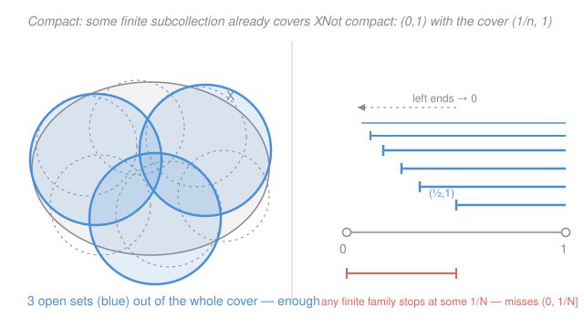

# Topology · Lesson 4.1: Compactness — open covers

> ⏱ ~15 min · Module 4: Compactness · Builds on: [1.4 Bases, subbases, and comparing topologies](01-04-bases-and-subbases.md), Modules 1–2 · Unlocks: [4.2 Compactness in metric spaces](04-02-compactness-metric-spaces.md)

## Why this matters

Compactness is the single most important property in point-set topology, and it is the one that transfers the most theorems. Its whole job is to **upgrade local promises into global ones**: a bound that holds "near each point" becomes a bound that holds *uniformly*; a function that is continuous "at each point" becomes *uniformly* continuous; a function bounded in a neighborhood of every point is bounded *everywhere at once*. In `real-analysis` you met this only for closed intervals $[a,b]$, where it powered the Extreme Value Theorem and uniform continuity. Now we distill the property that was really doing the work — no metric, no order, no $\mathbb{R}$ — down to one sentence about open sets, and it will apply to the real line, a space of functions, and the surface of a doughnut all at once.

## The idea

Think of "finite" as a superpower. If a set is finite, you can check every element, take a maximum, run a proof one case at a time and stop. Infinite sets lose all of that. **Compactness is the property that lets an infinite space keep the superpower anyway** — it is "finiteness for the purpose of covering."

Here is the picture. Suppose you sprinkle open sets over a space until every point is inside at least one of them; call that a *cover*. You might have used infinitely many patches. Compactness says: no matter how you did it, **you never actually needed more than finitely many** — you can throw away all but a finite handful and the space is still completely covered. Any argument that works patch-by-patch (a bound on each patch, a choice on each patch) can then be finished by taking a max or an intersection over your finite handful, and the local becomes global.

The failures are just as instructive. The open interval $(0,1)$ is *not* compact: cover it by $(1/2,1),(1/3,1),(1/4,1),\dots$, each patch reaching a little closer to $0$. Together they cover everything (any point $x>0$ is caught once $1/n<x$), but any *finite* subcollection has a leftmost starting point $1/N$ and so misses the sliver $(0,1/N]$. The cover "uses up" its infinitely many patches — none is redundant near $0$. That leak toward the missing endpoint is exactly what compactness forbids.

## The formal version

Fix a topological space $X$ (a set with a chosen family of "open" sets, as in Module 1).

**Open cover.** A family $\mathcal{U}=\{U_\alpha\}_{\alpha\in A}$ of open subsets of $X$ is an **open cover** of $X$ if $\bigcup_{\alpha\in A}U_\alpha = X$.

> In words: a pile of open sets whose union leaves no point uncovered. ($A$ is just an index set — it may be infinite.)

**Subcover.** A **subcover** is a subfamily $\{U_\alpha\}_{\alpha\in A'}$ (with $A'\subseteq A$) that still covers $X$. It is a **finite subcover** if $A'$ is finite.

> In words: a smaller selection from the *same* cover that already does the whole job.

**Compact.** $X$ is **compact** if *every* open cover of $X$ has a finite subcover.

> In words: however you cover $X$ with open sets, finitely many of them already suffice.

The quantifier is the entire point: **every** cover, not some cover. Exhibiting one clever finite cover proves nothing.

**Compact subsets.** A subset $K\subseteq X$ is **compact** if it is compact as a space in its own right — using the subspace topology from [2.2](02-02-subspace-topology.md). Because a subspace-open set of $K$ is exactly $U\cap K$ for some open $U\subseteq X$, this unwinds to a statement about the ambient space:

> **$K\subseteq X$ is compact $\iff$ every cover of $K$ by open sets *of $X$* has a finite subcover.**

We use this ambient form constantly — it lets us cover $K$ with open sets of the big space $X$ and extract finitely many, never leaving $X$.

**First examples.**

- **Any finite space is compact.** More usefully, any *finite* set $K=\{x_1,\dots,x_k\}$ in any space is compact: given a cover, pick one member containing each $x_i$; that's $\le k$ sets.
- **$[0,1]$ is compact.** True but not obvious — the proof needs the least-upper-bound property of $\mathbb{R}$, and we give it in full in [4.3](04-03-heine-borel-continuous-maps.md). State it now; it is the seed of Heine–Borel.
- **Non-examples** (memorize the covers): $(0,1)$ via $\{(1/n,1)\}_{n\ge 2}$, and $\mathbb{R}$ via $\{(-n,n)\}_{n\ge 1}$ — a finite subfamily of either is bounded away from where it needs to reach.

## Picture

## Worked examples

**Example 1 (mechanical — proving non-compactness).** Show $(0,1)$ is not compact.

We must exhibit *one* open cover with no finite subcover. Take $\mathcal{U}=\{U_n\}_{n\ge 2}$ with $U_n=(1/n,\,1)$, each open. It covers: any $x\in(0,1)$ has some $n$ with $1/n<x$ (Archimedean property), so $x\in U_n$. Now suppose some finite subfamily $U_{n_1},\dots,U_{n_k}$ covered $(0,1)$. Let $N=\max\{n_1,\dots,n_k\}$; since the $U_n$ are nested increasing, their union is just the biggest one, $U_N=(1/N,1)$. But the point $\tfrac{1}{2N}\in(0,1)$ is *not* in $(1/N,1)$. So no finite subfamily covers — $(0,1)$ is not compact. $\blacksquare$

The identical script kills $\mathbb{R}$ with $\{(-n,n)\}$: a finite subfamily has a largest $N$, union $(-N,N)$, and misses $N$. The lesson: **non-compactness is proved by producing a single leaky cover.**

**Example 2 (why you'd care — a convergent sequence with its limit).** Let $A=\{0\}\cup\{1/n : n\ge 1\}\subseteq\mathbb{R}$. This *is* compact, and the argument shows the mechanism. Take any open cover $\mathcal{U}$ of $A$. Some member $U_0\in\mathcal{U}$ contains the limit point $0$; being open, $U_0$ contains an interval $(-\varepsilon,\varepsilon)$, which swallows the entire tail $\{1/n : n>1/\varepsilon\}$ in one shot. That leaves only finitely many points $1/1,\dots,1/M$ (those with $1/n\ge\varepsilon$) uncovered by $U_0$; cover each with one more member of $\mathcal{U}$. Total used: $U_0$ plus $\le M$ sets — finite. So $A$ is compact.

Contrast $A\setminus\{0\}=\{1/n\}$, which is *not* compact: drop the limit point and the cover $\{(1/(n+1),\,2)\}$ isolates each $1/n$ with no finite escape. **The limit point is exactly what makes the difference** — a preview of "compact = closed and bounded" in $\mathbb{R}$ ([4.3](04-03-heine-borel-continuous-maps.md)) and of sequential compactness in [4.2](04-02-compactness-metric-spaces.md).

## Three theorems, three techniques

Compactness earns its status through how it *combines* with the rest of topology. Each proof is short, and each teaches a reusable move.

**Theorem A (a closed subset of a compact space is compact).** Let $X$ be compact and $C\subseteq X$ closed. Then $C$ is compact.

> In words: compactness is inherited downward by closed pieces.

*Proof.* Let $\mathcal{U}=\{U_\alpha\}$ be a cover of $C$ by open sets of $X$. Since $C$ is closed, $X\setminus C$ is open; throw it in to get $\mathcal{U}\cup\{X\setminus C\}$, an open cover of all of $X$ (every point is either in $C$, hence some $U_\alpha$, or outside $C$). By compactness of $X$ it has a finite subcover, say $U_{\alpha_1},\dots,U_{\alpha_n}$ possibly together with $X\setminus C$. Discard $X\setminus C$ (it contributes no point of $C$): the remaining $U_{\alpha_1},\dots,U_{\alpha_n}$ still cover $C$. A finite subcover of the original. $\blacksquare$

*Technique: enlarge the cover by the complement, then throw it back out.*

**Theorem B (a compact subset of a Hausdorff space is closed).** Let $X$ be **Hausdorff** — any two distinct points have disjoint open neighborhoods (the separation axiom of [5.1](05-01-separation-axioms-hausdorff.md), foreshadowed here) — and let $K\subseteq X$ be compact. Then $K$ is closed.

> In words: in a space where points can be told apart by open sets, compact sets can't have "missing edges" — they contain their boundary.

*Proof.* We show $X\setminus K$ is open by finding, around each $x\notin K$, an open neighborhood missing $K$. Fix $x\notin K$. For every $y\in K$, Hausdorff gives disjoint open sets $U_y\ni x$ and $V_y\ni y$. The family $\{V_y\}_{y\in K}$ is an open cover of $K$, so by compactness finitely many suffice: $V_{y_1},\dots,V_{y_n}$ cover $K$. Set
$$U=\bigcap_{i=1}^{n}U_{y_i},$$
an open set (finite intersection) containing $x$. Each $U_{y_i}$ misses $V_{y_i}$, so $U$ misses every $V_{y_i}$, hence misses $V_{y_1}\cup\dots\cup V_{y_n}\supseteq K$. Thus $x\in U\subseteq X\setminus K$. Every point of $X\setminus K$ has such a neighborhood, so $X\setminus K$ is open and $K$ is closed. $\blacksquare$

*Technique: separate a point from a compact set by taking a **finite intersection** of the point's neighborhoods — the finite subcover is what makes the intersection open.* This is where Hausdorff is indispensable; without it the theorem is false (see Watch out).

**Theorem C (the continuous image of a compact space is compact).** Let $f:X\to Y$ be continuous with $X$ compact. Then $f(X)$ is compact.

> In words: compactness survives being pushed through a continuous map.

*Proof.* Let $\{V_\alpha\}$ be a cover of $f(X)$ by open sets of $Y$. By continuity each preimage $f^{-1}(V_\alpha)$ is open in $X$, and these cover $X$ (any $x\in X$ has $f(x)\in V_\alpha$ for some $\alpha$, so $x\in f^{-1}(V_\alpha)$). Compactness of $X$ gives a finite subcover $f^{-1}(V_{\alpha_1}),\dots,f^{-1}(V_{\alpha_n})$. Then $V_{\alpha_1},\dots,V_{\alpha_n}$ cover $f(X)$: for any $f(x)$, the point $x$ lies in some $f^{-1}(V_{\alpha_i})$, so $f(x)\in V_{\alpha_i}$. A finite subcover. $\blacksquare$

*Technique: **pull the cover back** through $f^{-1}$, extract finitely many upstairs, push those indices back downstairs.*

Theorem C is a workhorse. Applied to $f:X\to\mathbb{R}$ with $X$ compact, it says $f(X)$ is a compact subset of $\mathbb{R}$ — which (Theorem B, plus boundedness) forces $f(X)$ to be closed and bounded, hence to contain its sup and inf. That is the **Extreme Value Theorem**, delivered almost for free in [4.3](04-03-heine-borel-continuous-maps.md).

**One more, stated: finite products.** If $X$ and $Y$ are compact, so is $X\times Y$ (product topology, [2.3](02-03-product-topology.md)). The proof rests on the *tube lemma* — cover a "vertical slice" $\{x\}\times Y$ finitely, then fatten it to a whole tube $W\times Y$ around it. Induction extends this to any finite product, and the astonishing generalization to *arbitrary* products is **Tychonoff's theorem** ([4.4](04-04-tychonoff-theorem.md)).

## Watch out

- You might think "here's a finite cover of $X$, so $X$ is compact." Backwards. Compactness asks that **every** cover have a finite *subcover* — a subfamily of the *given* cover. Your favorite finite cover says nothing; you must handle an arbitrary, possibly infinite, adversarial cover and extract finitely many *from it*.
- You might think "compact $\Rightarrow$ closed" is automatic. It needs **Hausdorff**. In the indiscrete topology on $\{a,b\}$ (only opens are $\varnothing$ and the whole set), the subset $\{a\}$ is compact (it's finite) but *not* closed — its complement $\{b\}$ isn't open. Theorem B fails precisely because points can't be separated.
- You might think "closed" or "bounded" alone means compact. Neither does: $\mathbb{R}$ is closed in itself but not compact; $(0,1)$ is bounded but not compact. The clean equivalence **compact $\iff$ closed and bounded** is special to $\mathbb{R}^n$ (Heine–Borel, [4.3](04-03-heine-borel-continuous-maps.md)) — it is a *theorem*, not the definition, and it breaks in infinite dimensions.
- You might think compactness is about sequences. In a general space it is a *covering* statement; the equivalence with "every sequence has a convergent subsequence" holds in metric spaces but not always beyond them — that reconciliation is the whole of [4.2](04-02-compactness-metric-spaces.md).

## One-liner

> Compact means every open cover has a finite subcover — the property that lets an infinite space behave like a finite one, upgrading every point-by-point promise into a single global one.

## Problems

**P1 (🟢)** Prove that the half-open interval $(0,1]$ is not compact by exhibiting an explicit open cover of it with no finite subcover. (Give the cover, show it covers, and show why no finite subfamily does.)

**P2 (🟡)** Let $K_1$ and $K_2$ be compact subsets of a space $X$. Prove directly from the open-cover definition that $K_1\cup K_2$ is compact. (Then note: does the same argument work for an *infinite* union? Say in one line why or why not.)

**P3 (🔴, optional)** Let $X$ be Hausdorff and let $K,L\subseteq X$ be disjoint compact sets. Prove there exist disjoint open sets $U,V$ with $K\subseteq U$ and $L\subseteq V$. (Hint: first do point-vs-compact — reuse the Theorem B construction — then cover $K$ and take a finite intersection a second time.)

Solutions

**P1** Use $\mathcal{U}=\{U_n\}_{n\ge 1}$ with $U_n=(1/n,\,2)$, each open in $\mathbb{R}$ (hence its trace covers $(0,1]$). *It covers:* any $x\in(0,1]$ satisfies $x\le 1<2$ and, by the Archimedean property, $1/n<x$ for some $n$, so $x\in(1/n,2)=U_n$. *No finite subcover:* a finite subfamily $U_{n_1},\dots,U_{n_k}$ has largest index $N=\max n_i$; since the $U_n$ are nested increasing, their union is $U_N=(1/N,2)$, which misses $\tfrac{1}{2N}\in(0,1]$. So $(0,1]$ is not compact. (Same leak toward $0$ as $(0,1)$ — closing the *right* endpoint doesn't help; the trouble is the open left end.)

**P2** Let $\mathcal{U}=\{U_\alpha\}_{\alpha\in A}$ be an open cover of $K_1\cup K_2$ by open sets of $X$. Then $\mathcal{U}$ in particular covers $K_1$ (every point of $K_1$ lies in some $U_\alpha$), so by compactness of $K_1$ there is a finite subfamily $\mathcal{F}_1\subseteq\mathcal{U}$ covering $K_1$. Likewise a finite $\mathcal{F}_2\subseteq\mathcal{U}$ covers $K_2$. Then $\mathcal{F}_1\cup\mathcal{F}_2$ is a finite subfamily of $\mathcal{U}$, and it covers $K_1\cup K_2$. Hence $K_1\cup K_2$ is compact. $\blacksquare$

By induction the same works for any *finite* union. It does **not** extend to infinite unions: each $\{1/n\}$ (a single point) is compact, but $\bigcup_{n\ge1}\{1/n\}=\{1/n : n\ge1\}$ is not compact (Example 2). Gluing infinitely many finite subcovers can require infinitely many sets total.

**P3** *Step 1 — point vs. compact (the Theorem B lemma).* Claim: for a fixed $x\notin L$, there are disjoint open sets $U_x\ni x$ and $W_x\supseteq L$. Proof: for each $z\in L$, Hausdorff gives disjoint opens $A_z\ni x$, $B_z\ni z$; the $\{B_z\}$ cover $L$, so finitely many $B_{z_1},\dots,B_{z_m}$ cover $L$. Put $U_x=\bigcap_{j}A_{z_j}$ (open, contains $x$) and $W_x=\bigcup_j B_{z_j}\supseteq L$ (open). Each $A_{z_j}$ misses $B_{z_j}$, so $U_x$ misses $W_x$. ✓

*Step 2 — compact vs. compact.* Do Step 1 for every $x\in K$, producing for each an open $U_x\ni x$ disjoint from an open $W_x\supseteq L$. The $\{U_x\}_{x\in K}$ cover $K$; by compactness of $K$, finitely many $U_{x_1},\dots,U_{x_p}$ cover $K$. Set
$$U=\bigcup_{i=1}^{p}U_{x_i}, \qquad V=\bigcap_{i=1}^{p}W_{x_i}.$$
Then $U$ is open and contains $K$; $V$ is open (finite intersection) and contains $L$ (each $W_{x_i}\supseteq L$). They are disjoint: if a point lay in $U\cap V$ it would sit in some $U_{x_i}$ *and* in $V\subseteq W_{x_i}$, but $U_{x_i}\cap W_{x_i}=\varnothing$. So $K\subseteq U$, $L\subseteq V$, $U\cap V=\varnothing$. $\blacksquare$

(This says: in a Hausdorff space, disjoint compact sets are "separated by open sets" — the first rung toward *normality*, which every compact Hausdorff space enjoys, proved in Module 5.)

## Flashback

**From Lesson 2.2 (The subspace topology):** Give $Y=[0,1)\cup\{2\}\subseteq\mathbb{R}$ the subspace topology from the standard topology on $\mathbb{R}$. For each of $\{2\}$ and $[0,\tfrac12)$, decide whether it is open **in $Y$**, and whether it is open **in $\mathbb{R}$** — exhibiting, when it is open in $Y$, an ambient open set $U\subseteq\mathbb{R}$ with $U\cap Y$ equal to it.

Solution

Recall a set is open in $Y$ exactly when it has the form $U\cap Y$ for some open $U\subseteq\mathbb{R}$.

- $\{2\}$ **is open in $Y$:** take $U=(1.5,\,2.5)$, open in $\mathbb{R}$; then $U\cap Y=\{2\}$ because $U$ catches the isolated point $2$ and none of $[0,1)$. It is **not** open in $\mathbb{R}$ — no interval around $2$ lies inside the single point $\{2\}$. (The isolated point of $Y$ is the classic "open in the subspace, not in the ambient space" trap.)
- $[0,\tfrac12)$ **is open in $Y$:** take $U=(-1,\,\tfrac12)$; then $U\cap Y=[0,\tfrac12)$ since $Y\cap(-1,\tfrac12)$ is exactly $[0,\tfrac12)$ (the point $2$ is excluded, and $Y$ has nothing below $0$). It is **not** open in $\mathbb{R}$ — any interval around the endpoint $0$ spills to negatives outside $[0,\tfrac12)$.

Both sets are open in $Y$ but not in $\mathbb{R}$: relative openness is genuinely more permissive, because the ambient open set only has to match *after intersecting with $Y$*. $\blacksquare$

## Connections

- **Backward:** covers are assembled from open sets, and covering by **basis elements** (from [1.4](01-04-bases-and-subbases.md)) is enough — if every basic-open cover has a finite subcover, so does every open cover, which streamlines many compactness proofs. The subspace form of compactness rides directly on [2.2](02-02-subspace-topology.md)'s "open in $K$ = $U\cap K$."
- **Forward:** [4.2](04-02-compactness-metric-spaces.md) reconciles this covering definition with sequences (sequential compactness, total boundedness, the Lebesgue number lemma); [4.3](04-03-heine-borel-continuous-maps.md) proves $[0,1]$ compact from the lub property and cashes Theorem C into Heine–Borel, the Extreme Value Theorem, and uniform continuity; [4.4](04-04-tychonoff-theorem.md) pushes finite products to arbitrary ones. Theorem B's Hausdorff hypothesis is unpacked in [5.1](05-01-separation-axioms-hausdorff.md).
- **Sideways (`real-analysis`):** the compactness of $[a,b]$ that powered `real-analysis`'s Extreme Value Theorem and uniform-continuity results is the special case here; this lesson isolates *which* property was doing the work, so the same theorems now cover function spaces and manifolds, not just intervals of the line.
