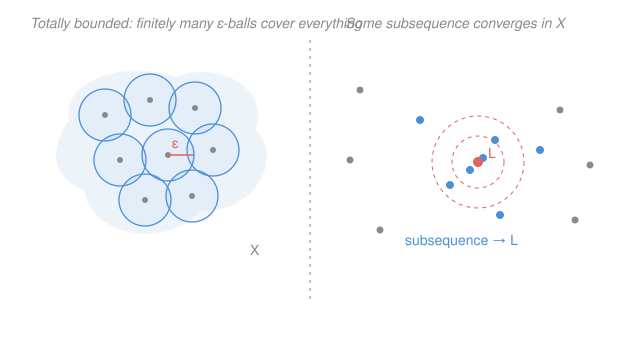

# Topology · Lesson 4.2: Compactness in metric spaces

> ⏱ ~15 min · Module 4: Compactness · Builds on: [4.1 Compactness: open covers](04-01-compactness-open-covers.md), [1.1 Metric spaces](01-01-metric-spaces.md) · Unlocks: [4.3 Heine–Borel and maps on compact spaces](04-03-heine-borel-continuous-maps.md)

## Why this matters

In [4.1](04-01-compactness-open-covers.md) compactness arrived as an alien slogan — "every open cover has a finite subcover" — with no obvious link to the compactness you already know from `real-analysis`, where "compact" meant *closed and bounded*, or *every sequence has a convergent subsequence* (Bolzano–Weierstrass). This lesson shows those pictures are the **same picture** the moment a metric is present. That reconciliation is what makes compactness usable: covers give you the clean general theorems, sequences give you a tool you can actually compute with, and together they explain the one surprise that breaks the naive intuition — in infinite dimensions, closed and bounded is *not* enough.

## The idea

Take the covering definition into a metric space and it collapses back to something familiar. Two everyday intuitions turn out to be exactly what "finite subcover" is buying:

- **You can't spread out forever.** Squeeze infinitely many points into a space that is genuinely "finite in size at every scale," and they must pile up somewhere — some subsequence converges. That pile-up is Bolzano–Weierstrass, and in a metric space it is *equivalent* to compactness.
- **Two dials control it.** A space is compact exactly when it is (i) **totally bounded** — coverable by finitely many tiny balls, no matter how tiny — and (ii) **complete** — no missing limit points, no holes. Total boundedness stops the points from escaping to infinity or thinning out; completeness makes sure the place they pile up is actually *in* the space.

Drop either dial and compactness dies. All of $\mathbb{R}$ is complete but not totally bounded (points march off to infinity). The open interval $(0,1)$ is totally bounded but not complete (a sequence heads for $0$, which isn't there). You need both.

## The formal version

Throughout, $(X,d)$ is a metric space and $B(x,\varepsilon)=\{y\in X: d(x,y)<\varepsilon\}$ is the open ball of radius $\varepsilon$ about $x$ (from [1.1](01-01-metric-spaces.md)).

**Sequential compactness.** $X$ is **sequentially compact** if every sequence $(x_n)$ in $X$ has a subsequence $(x_{n_k})$ converging to a point of $X$.

> In words: no matter how you throw down infinitely many points, some thinned-out sub-list homes in on a genuine point of the space.

**Total boundedness.** $X$ is **totally bounded** if for every $\varepsilon>0$ there are finitely many points $x_1,\dots,x_m\in X$ with $X=\bigcup_{i=1}^m B(x_i,\varepsilon)$. Such a finite set is an **$\varepsilon$-net**.

> In words: at every scale $\varepsilon$, a *finite* handful of $\varepsilon$-balls blankets the whole space.

**Completeness** (recall from `real-analysis`). $X$ is **complete** if every Cauchy sequence in $X$ converges to a point of $X$. (A sequence is Cauchy if $d(x_n,x_m)\to 0$ as $n,m\to\infty$.)

> In words: sequences that *ought* to converge — their terms bunch together — actually do, with the limit living inside the space. No holes.

Now the two reconciliation theorems.

**Theorem 1 (metric compactness = sequential compactness).** For a metric space $X$:
$$X \text{ is compact} \iff X \text{ is sequentially compact}.$$

> In words: in a metric space the covering definition and Bolzano–Weierstrass are literally the same property. (Warning: this equivalence is *special to metric spaces* — for general topological spaces the two notions genuinely differ, and neither implies the other. See **Watch out**.)

*Proof of ⟹ (compact implies sequentially compact).* Let $(x_n)$ be a sequence and suppose, for contradiction, it has **no** convergent subsequence. Then no point $x\in X$ is a subsequential limit, so for each $x$ there is a radius $r_x>0$ with $B(x,r_x)$ containing $x_n$ for only **finitely many** indices $n$ — otherwise infinitely many terms sit in every ball around $x$, and thinning them gives a subsequence converging to $x$. The balls $\{B(x,r_x): x\in X\}$ form an open cover; compactness yields a finite subcover $B(x^{(1)},r_1),\dots,B(x^{(m)},r_m)$. Each contains finitely many indices, so their union — all of $X$ — contains only finitely many indices $n$. But there are infinitely many. Contradiction. $\blacksquare$

*Proof of ⟸ (sketch of the harder direction).* Two facts do the work. **(a)** Sequential compactness $\Rightarrow$ totally bounded: if not, some $\varepsilon>0$ admits no finite $\varepsilon$-net, so we can greedily pick $x_1,x_2,\dots$ with $d(x_i,x_j)\ge\varepsilon$ for all $i\ne j$ — a sequence with no Cauchy, hence no convergent, subsequence. **(b)** Sequential compactness $\Rightarrow$ every open cover has a Lebesgue number $\delta$ (Theorem 3 below). Given a cover, take a finite $(\delta/2)$-net from (a); each ball $B(x_i,\delta/2)$ has diameter $<\delta$, so it lies inside a single cover element $U_i$. Those finitely many $U_i$ cover $X$. $\blacksquare$

**Theorem 2 (the two-dial criterion).** For a metric space $X$:
$$X \text{ is compact} \iff X \text{ is complete and totally bounded}.$$

> In words: compactness = no holes + no room to spread out.

*Proof of ⟹.* **Totally bounded:** given $\varepsilon>0$, the balls $\{B(x,\varepsilon):x\in X\}$ cover $X$; a finite subcover *is* a finite $\varepsilon$-net. **Complete:** let $(x_n)$ be Cauchy. By Theorem 1, $X$ is sequentially compact, so some $x_{n_k}\to x\in X$. A Cauchy sequence with a convergent subsequence converges to that same limit (the terms are already bunched, and one of them gets close to $x$), so $x_n\to x$. $\blacksquare$

*Proof of ⟸ (sketch).* Given a sequence, cover $X$ by finitely many radius-$1$ balls; one ball holds infinitely many terms — take that sub-sequence. Cover *that* ball's terms by finitely many radius-$\tfrac12$ balls; one holds infinitely many — refine again. Iterating and taking the diagonal subsequence produces a Cauchy subsequence (its tail sits in ever-smaller balls); completeness makes it converge in $X$. So $X$ is sequentially compact, hence compact by Theorem 1. $\blacksquare$

**Theorem 3 (Lebesgue number lemma).** Let $X$ be a compact metric space and $\mathcal{U}$ an open cover. Then there is a $\delta>0$ — a **Lebesgue number** for $\mathcal{U}$ — such that every subset $S\subseteq X$ with diameter $<\delta$ is contained in a single member of $\mathcal{U}$.

> In words: on a compact space, "small enough" is a *uniform* size — one $\delta$ works everywhere, so no set of diameter $<\delta$ can straddle the cover.

*Sketch.* Take a finite subcover $U_1,\dots,U_n$. The function $f(x)=\frac1n\sum_{i=1}^n \operatorname{dist}(x,\,X\setminus U_i)$ is continuous and strictly positive (each $x$ lies in some $U_i$, giving that term a positive distance to its complement). A continuous positive function on a compact space attains a positive minimum $\delta>0$ (that's the Extreme Value Theorem of [4.3](04-03-heine-borel-continuous-maps.md)). One checks any set of diameter $<\delta$ falls inside the $U_i$ realizing the largest term at one of its points. $\blacksquare$ This uniform-$\delta$ is precisely the engine behind **uniform continuity** in [4.3](04-03-heine-borel-continuous-maps.md).

## Picture

## Worked examples

**Example 1 (mechanical — why $(0,1)$ fails, and which dial is off).** The open interval $(0,1)$ with $d(x,y)=|x-y|$ is **totally bounded**: given $\varepsilon>0$, pick a grid $x_i = i\varepsilon$ for $i=1,\dots,m$ with $m\varepsilon<1$; every point of $(0,1)$ is within $\varepsilon$ of some grid point, a finite $\varepsilon$-net. But it is **not complete**: $x_n=\tfrac1n$ is Cauchy yet its only candidate limit, $0$, is not in the space. By Theorem 2, $(0,1)$ is **not compact** — and you can *see* the covering failure directly: the open cover $\{(\tfrac1n,1):n\ge 2\}$ has no finite subcover, because any finite subfamily misses points near $0$. Completeness is exactly the missing ingredient, and the runaway sequence points to the hole.

**Example 2 (why you'd care — the infinite-dimensional ball is not compact).** Let $\ell^2$ be the space of square-summable real sequences $x=(x_1,x_2,\dots)$ with $\sum x_k^2<\infty$, under $d(x,y)=\big(\sum_k (x_k-y_k)^2\big)^{1/2}$. Its **closed unit ball** $\overline{B}=\{x:\|x\|\le 1\}$ is closed and bounded — yet **not compact**. Consider the standard basis vectors $e_n=(0,\dots,0,1,0,\dots)$ (the $1$ in slot $n$), all lying in $\overline{B}$. For $n\ne m$,
$$d(e_n,e_m)=\sqrt{1^2+(-1)^2}=\sqrt2.$$
Every pair is distance $\sqrt2$ apart, so $(e_n)$ has no Cauchy — hence no convergent — subsequence: **not sequentially compact**. Equivalently, no ball of radius $\tfrac12$ can hold two of the $e_n$, so *no finite collection* of radius-$\tfrac12$ balls covers them: **not totally bounded**. Boundedness controls diameter, but total boundedness controls diameter *at every scale simultaneously* — and in infinitely many dimensions there is always room for a new orthogonal direction to escape into. This is exactly why "closed + bounded ⟹ compact" (Heine–Borel, [4.3](04-03-heine-borel-continuous-maps.md)) is a **finite-dimensional** miracle, not a general law.

## Watch out

- **You might think closed and bounded is enough for compactness** — it is in $\mathbb{R}^n$, but that's Heine–Borel, a finite-dimensional fact. Example 2's $\ell^2$ ball is closed and bounded and *not* compact. The correct general condition is *complete and totally bounded* (Theorem 2); total boundedness, not mere boundedness, is what finite dimension quietly hands you.
- **You might think total boundedness is just boundedness reworded.** Bounded = "fits in one ball of some fixed radius." Totally bounded = "fits in finitely many balls of *every* radius." An infinite set with the discrete metric ($d(x,y)=1$ for $x\ne y$) is bounded but *not* totally bounded — no ball of radius $\tfrac12$ holds two points, so you'd need infinitely many.
- **You might think sequential and covering compactness are always the same.** They coincide *for metric spaces* (Theorem 1) and that's a theorem, not a definition — in general topological spaces the two notions come apart, with spaces that are compact but not sequentially compact and vice versa. Don't export the equivalence past the metric setting.
- **You might think completeness alone gives compactness.** All of $\mathbb{R}$ is complete (that's what `real-analysis` builds) but wildly non-compact — the sequence $x_n=n$ has no convergent subsequence. You also need total boundedness to pen the points in.

## One-liner

> In a metric space, compact = sequentially compact = complete + totally bounded — and "closed and bounded" only joins the club in finite dimensions.

## Problems

**P1 (🟢)** Let $X$ be an infinite set with the discrete metric ($d(x,y)=1$ if $x\ne y$, else $0$). Give *two* separate reasons $X$ is not compact: one via a sequence with no convergent subsequence, one via an open cover with no finite subcover.

**P2 (🟡)** Prove that every totally bounded metric space is bounded (i.e. has finite diameter). Then show the converse fails by naming a bounded space that is not totally bounded, and say in one line which of the two dials in Theorem 2 this is about.

**P3 (🔴, optional)** Let $X$ be a sequentially compact metric space and $f:X\to\mathbb{R}$ continuous. Using sequential compactness directly, prove $f$ is bounded (there is $M$ with $|f(x)|\le M$ for all $x$). This is the first half of the Extreme Value Theorem you'll meet in [4.3](04-03-heine-borel-continuous-maps.md).

Solutions

**P1** *Sequence:* since $X$ is infinite, pick distinct points $x_1,x_2,x_3,\dots$. Then $d(x_n,x_m)=1$ for all $n\ne m$, so no subsequence is Cauchy, hence none converges — $X$ is not sequentially compact, so not compact (Theorem 1). *Cover:* in the discrete metric every singleton $\{x\}=B(x,\tfrac12)$ is open, so $\mathcal{U}=\{\{x\}:x\in X\}$ is an open cover. Any finite subfamily covers only finitely many points, missing the rest of the infinite $X$ — no finite subcover.

**P2** *Totally bounded ⟹ bounded:* apply total boundedness with $\varepsilon=1$ to get a finite $1$-net $x_1,\dots,x_m$, so $X=\bigcup_{i=1}^m B(x_i,1)$. Let $R=\max_{i,j} d(x_i,x_j)$ (a max over finitely many pairs, so finite). For any $x,y\in X$, say $x\in B(x_i,1)$ and $y\in B(x_j,1)$; the triangle inequality gives
$$d(x,y)\le d(x,x_i)+d(x_i,x_j)+d(x_j,y) < 1 + R + 1 = R+2.$$
So $\operatorname{diam}(X)\le R+2<\infty$: bounded. *Converse fails:* an infinite set with the discrete metric has diameter $1$ (bounded) but is not totally bounded (no radius-$\tfrac12$ ball holds two points, so no finite $\tfrac12$-net exists). This is the **total-boundedness** dial of Theorem 2 — boundedness is strictly weaker.

**P3** Suppose $f$ is unbounded. Then for each $n$ there is $x_n\in X$ with $|f(x_n)|>n$. By sequential compactness, some subsequence $x_{n_k}\to x\in X$. Continuity of $f$ gives $f(x_{n_k})\to f(x)$, a *finite* number, so the sequence $\big(f(x_{n_k})\big)$ is bounded. But $|f(x_{n_k})|>n_k\to\infty$ — the values blow up. Contradiction. Hence $f$ is bounded. $\blacksquare$ (Running the same argument with a supremum instead of $\infty$ shows $f$ actually *attains* its maximum — the full EVT of [4.3](04-03-heine-borel-continuous-maps.md).)

## Flashback

**From Lesson 4.1 (Compactness: open covers):** Let $X$ be a compact space and $C\subseteq X$ a **closed** subset. Prove $C$ is compact (in its subspace topology).

Solution

Let $\mathcal{U}$ be a cover of $C$ by sets open in $X$ (any subspace-open cover extends to one of this form). Since $C$ is closed, $X\setminus C$ is open, so
$$\mathcal{U}\cup\{X\setminus C\}$$
is an open cover of *all* of $X$: it covers $C$ via $\mathcal{U}$ and everything outside $C$ via $X\setminus C$. By compactness of $X$, extract a finite subcover. Discard $X\setminus C$ if it appears (it contains no point of $C$). The remaining finitely many members of $\mathcal{U}$ still cover $C$. So every open cover of $C$ has a finite subcover: $C$ is compact. $\blacksquare$

## Connections

- **Backward:** this is [4.1](04-01-compactness-open-covers.md)'s covering definition translated into the metric world of [1.1](01-01-metric-spaces.md); the closed-subset Flashback is a pure covering argument, while the sequential picture pulls Bolzano–Weierstrass and completeness straight out of `real-analysis`.
- **Forward:** [4.3](04-03-heine-borel-continuous-maps.md) cashes this in — Heine–Borel identifies the compact subsets of $\mathbb{R}^n$ as exactly the closed and bounded ones (finite dimension supplies total boundedness), and the Lebesgue number lemma upgrades continuity to *uniform* continuity on compact domains. P3 is the seed of the Extreme Value Theorem there.
- **Sideways (analysis):** total boundedness is the metric-space shadow of "no room to escape to infinity," and completeness is the same no-holes property that made `real-analysis` build $\mathbb{R}$ from $\mathbb{Q}$ in the first place — compactness is precisely their conjunction.
