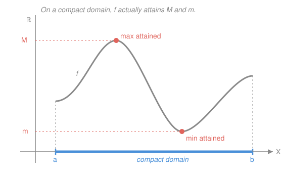

# Topology · Lesson 4.3: Heine–Borel and maps on compact spaces

> ⏱ ~15 min · Module 4: Compactness · Builds on: [4.1 Compactness: open covers](04-01-compactness-open-covers.md), [4.2 Compactness in metric spaces](04-02-compactness-metric-spaces.md) · Unlocks: [4.4 Tychonoff's theorem](04-04-tychonoff-theorem.md)

## Why this matters

Compactness isn't a trophy you prove and shelve — it's a hypothesis that *does work* for you. Four of the most-used theorems in analysis are all one word, "compact," cashed out: in $\mathbb{R}^n$ it collapses into the concrete test "closed and bounded"; it forces a continuous function to actually **hit** its highest and lowest values (so optimization problems have solutions, not just infima you approach); it upgrades plain continuity to *uniform* continuity (the engine behind integrability and the exchange of limits); and — the quiet gem — it makes a continuous bijection out of a compact space *automatically* a homeomorphism, which is what secretly justified every gluing picture in [2.4](02-04-quotient-topology.md). This lesson is where the abstraction earns its keep.

## The idea

Think of compactness as **"no room to escape to infinity, and no missing edge."** A sequence can't run off forever (bounded) and can't sneak up on a limit that isn't in the set (closed). In $\mathbb{R}^n$ those two intuitions are *exactly* compactness — that's Heine–Borel.

Once you believe that, the payoffs are almost forced:

- **Extreme values.** Push a compact set through a continuous map and the image is still compact — closed and bounded in $\mathbb{R}$ — so it contains its own top and bottom. A continuous function on a compact domain can't approach a supremum without reaching it; there's nowhere for the maximizer to hide.
- **Rigidity of bijections.** A continuous map sends compact sets to compact sets. Over a Hausdorff target, "compact" means "closed," so a continuous bijection from a compact space quietly sends closed sets to closed sets — which is *precisely* what makes its inverse continuous. You get a homeomorphism for free, without ever checking $f^{-1}$ by hand.
- **Uniform continuity.** On a compact metric space you can pick a *single* $\delta$ that works everywhere at once, because finitely many local $\delta$'s can be merged (the Lebesgue-number trick from [4.2](04-02-compactness-metric-spaces.md)).

Every one of these is "an infinite problem made finite" — the recurring soul of compactness.

## The formal version

Throughout, $X, Y$ are topological spaces; a **cover** is a family of open sets whose union contains the set; **compact** = every open cover has a finite subcover ([4.1](04-01-compactness-open-covers.md)); **Hausdorff** = distinct points have disjoint open neighborhoods.

**Theorem (Heine–Borel).** A subset $K \subseteq \mathbb{R}^n$ is compact **if and only if** it is closed and bounded.

> In words: in Euclidean space — and *only* there, as a general rule — the abstract cover condition is the same as the two concrete conditions you can eyeball.

**Theorem (continuous image of a compact set).** If $f:X\to Y$ is continuous and $X$ is compact, then $f(X)$ is compact.

> In words: continuity can't manufacture an escape to infinity or a missing edge that wasn't already in the domain.

**Theorem (Extreme Value Theorem).** If $X$ is compact and $f:X\to\mathbb{R}$ is continuous, then $f$ attains a maximum and a minimum: there exist $p,q\in X$ with $f(p)\le f(x)\le f(q)$ for all $x$.

> In words: on a compact domain, a continuous function's best and worst values are achieved, not merely approached.

**Theorem (compact-to-Hausdorff).** A continuous bijection $f:X\to Y$ with $X$ compact and $Y$ Hausdorff is a homeomorphism.

> In words: for this one setup you never have to check that the inverse is continuous — it's automatic.

**Theorem (Heine–Cantor).** A continuous map $f:X\to Y$ from a compact metric space $X$ to a metric space $Y$ is uniformly continuous: for every $\varepsilon>0$ there is a *single* $\delta>0$ with $d_X(x,x')<\delta \implies d_Y(f(x),f(x'))<\varepsilon$ for **all** $x,x'$.

> In words: the $\delta$ doesn't have to change as you move around the domain — one radius fits every point.

## Picture

## The proofs

**Heine–Borel.** ($\Rightarrow$) Let $K\subseteq\mathbb{R}^n$ be compact. Since $\mathbb{R}^n$ is Hausdorff, a compact subset is closed (proved in [4.1](04-01-compactness-open-covers.md)). For **bounded**: the open balls $\{B(0,m):m\in\mathbb{N}\}$ cover all of $\mathbb{R}^n$, hence cover $K$; a finite subcover has a largest radius $M$, so $K\subseteq B(0,M)$. Closed and bounded. ∎

($\Leftarrow$) Suppose $K$ is closed and bounded. Boundedness puts $K$ inside a box $[-M,M]^n$. A **closed subset of a compact set is compact** ([4.1](04-01-compactness-open-covers.md)), so it suffices to show the box is compact — and since a finite product of compact spaces is compact (the finite case of [4.4](04-04-tychonoff-theorem.md), or induction on the argument below), the whole job reduces to one fact:

**Lemma: $[a,b]\subseteq\mathbb{R}$ is compact.** Let $\mathcal{U}$ be an open cover of $[a,b]$. Define
$$C=\{x\in[a,b]:[a,x]\text{ has a finite subcover from }\mathcal{U}\}.$$
$C$ is nonempty ($a\in C$: the single set of $\mathcal{U}$ containing $a$ covers $[a,a]$) and bounded above by $b$. **Here completeness enters:** by the least-upper-bound property of $\mathbb{R}$ (from `real-analysis`), $s=\sup C$ exists. We show $s\in C$ and $s=b$.

Pick $U\in\mathcal{U}$ with $s\in U$. Since $U$ is open, some interval $(s-\eta,\,s+\eta)\subseteq U$. Because $s=\sup C$, there is a point $x\in C$ with $x>s-\eta$, so $[a,x]$ has a finite subcover $U_1,\dots,U_k$; adjoin $U$ and you cover $[a,\,s+\eta)\cap[a,b]$ with finitely many sets. Two consequences:
- $s\in C$ (we covered $[a,s]$), so the sup is *attained*;
- if $s<b$, then some point $s'$ with $s<s'<\min(s+\eta,b)$ also lies in $C$ — contradicting $s=\sup C$.

Hence $s=b$ and $b\in C$: $[a,b]$ has a finite subcover. ∎

The completeness step is the whole ballgame — over $\mathbb{Q}$, $\sup C$ can fail to exist and $[a,b]\cap\mathbb{Q}$ is genuinely *not* compact.

**Continuous image of a compact set.** Let $\mathcal{V}$ be an open cover of $f(X)$. Each preimage $f^{-1}(V)$ is open (continuity), and $\{f^{-1}(V):V\in\mathcal{V}\}$ covers $X$. Compactness of $X$ gives a finite subcover $f^{-1}(V_1),\dots,f^{-1}(V_m)$; then $V_1,\dots,V_m$ cover $f(X)$. So $f(X)$ is compact. ∎

**Extreme Value Theorem.** By the previous theorem $f(X)\subseteq\mathbb{R}$ is compact, hence (Heine–Borel) closed and bounded. Bounded $\Rightarrow$ $M=\sup f(X)$ and $m=\inf f(X)$ are finite real numbers. A sup is a limit of points of the set, so $M$ is in the *closure* of $f(X)$; but $f(X)$ is closed, so $M\in f(X)$ — i.e. $M=f(q)$ for some $q\in X$. Likewise $m=f(p)$. Those are the attained max and min. ∎

**Compact-to-Hausdorff.** A bijection $f$ is a homeomorphism iff $f^{-1}$ is continuous, and $f^{-1}$ is continuous iff $f$ is a **closed map** (image of every closed set is closed) — because the preimage under $f^{-1}$ of a closed set $A$ is just $f(A)$. So we must show $f$ sends closed sets to closed sets. Let $A\subseteq X$ be closed. Then $A$ is a closed subset of the compact $X$, hence compact; its continuous image $f(A)$ is compact; and a compact subset of the **Hausdorff** space $Y$ is closed ([4.1](04-01-compactness-open-covers.md)). So $f(A)$ is closed. Therefore $f^{-1}$ is continuous and $f$ is a homeomorphism. ∎

The chain is a little machine: **closed $\to$ compact $\to$ compact $\to$ closed**, where the first arrow needs $X$ compact and the last needs $Y$ Hausdorff.

**Heine–Cantor (uniform continuity).** Fix $\varepsilon>0$. For each $x\in X$ continuity gives a radius $r_x>0$ with $d_Y(f(x'),f(x))<\varepsilon/2$ whenever $x'\in B(x,r_x)$. The balls $\{B(x,\,r_x/2):x\in X\}$ form an open cover of the compact metric space $X$, so by the **Lebesgue number lemma** ([4.2](04-02-compactness-metric-spaces.md)) there is a $\delta>0$ such that any set of diameter $<\delta$ lies inside *one* of these balls. Now take any $x,x'$ with $d_X(x,x')<\delta$: the pair sits in some $B(x_0,r_{x_0}/2)\subseteq B(x_0,r_{x_0})$, so both $f(x)$ and $f(x')$ are within $\varepsilon/2$ of $f(x_0)$, and the triangle inequality gives $d_Y(f(x),f(x'))<\varepsilon$. That $\delta$ depended on $\varepsilon$ only — uniform. ∎

## Worked examples

**Example 1 (mechanical — reading off Heine–Borel).** Which of these are compact in the relevant $\mathbb{R}^n$?
- The closed unit ball $\{x\in\mathbb{R}^3:\|x\|\le 1\}$ — **compact**: closed (preimage of $(-\infty,1]$ under the continuous $\|\cdot\|$) and bounded.
- The open interval $(0,1)$ — **not compact**: bounded but not closed (its endpoints are limit points it omits; the cover $\{(1/n,1):n\ge2\}$ has no finite subcover).
- A line $\{(t,0):t\in\mathbb{R}\}\subseteq\mathbb{R}^2$ — **not compact**: closed but unbounded.
- $\{0\}\cup\{1/n:n\in\mathbb{N}\}$ — **compact**: bounded, and closed because it already contains its only limit point $0$.

Heine–Borel turns each verdict into a two-second check of two boxes.

**Example 2 (why you'd care — the circle really is the glued interval).** In [2.4](02-04-quotient-topology.md) we drew $S^1$ as $[0,1]$ with its endpoints fused, $[0,1]/(0\sim1)$, and *assumed* the picture was faithful. Now we can prove it. Define
$$g:[0,1]\to S^1\subseteq\mathbb{R}^2,\qquad g(t)=(\cos 2\pi t,\ \sin 2\pi t).$$
$g$ is continuous and $g(0)=g(1)=(1,0)$, so it descends to a continuous **bijection** $\bar g:[0,1]/(0\sim1)\to S^1$ (the quotient identifies exactly the two points $g$ collapses; the [2.4](02-04-quotient-topology.md) universal property makes $\bar g$ continuous). The domain is a **quotient of the compact $[0,1]$**, hence compact (continuous image of compact); the target $S^1\subseteq\mathbb{R}^2$ is **Hausdorff**. By the compact-to-Hausdorff theorem, $\bar g$ is a homeomorphism. The glued interval and the circle are genuinely the same space — the gluing pictures were legitimate all along.

## Watch out

- You might think "closed and bounded" *means* compact everywhere. It doesn't — that equivalence is special to $\mathbb{R}^n$. In an infinite-dimensional space the closed unit ball is closed and bounded but **not** compact: in $\ell^2$ the standard basis vectors $e_n$ are all distance $\sqrt2$ apart, so no subsequence converges — the sequential-compactness failure you met in [4.2](04-02-compactness-metric-spaces.md). Heine–Borel leans on finite dimension.
- You might think EVT needs only continuity, or only a bounded domain. It needs **both** a compact domain *and* continuity. Drop compactness: $f(x)=x$ on the open $(0,1)$ has no max. Drop continuity: the function on $[0,1]$ equal to $x$ but reset to $0$ at $x=1$ has a supremum of $1$ it never reaches. Either failure alone breaks it.
- You might think any continuous bijection is a homeomorphism. False without the hypotheses — the target must be **Hausdorff** (and the domain compact). The classic counterexample: $h:[0,1)\to S^1$, $h(t)=(\cos2\pi t,\sin2\pi t)$, is a continuous bijection onto a Hausdorff circle, but its domain isn't compact and $h^{-1}$ is discontinuous at $(1,0)$ — points just below $t=1$ map next to $t=0$. Compactness of the domain is exactly what Example 2 had and this doesn't.
- You might think continuity by itself gives one uniform $\delta$. Only on a **compact** domain. On $(0,1)$, $f(x)=1/x$ is continuous but not uniformly continuous — near $0$ the required $\delta$ shrinks to nothing.

## One-liner

> Compactness is the hypothesis that pays: in $\mathbb{R}^n$ it *is* closed-and-bounded, it makes continuous functions attain their extremes, and it turns a continuous bijection into a homeomorphism for free.

## Problems

**P1 (🟢)** For each set, state whether it is compact in $\mathbb{R}^2$ and give the one-line Heine–Borel reason:
(a) $\{(x,y):x^2+y^2=4\}$; (b) $\{(x,y):xy\ge 1,\ x>0\}$; (c) $\{(x,y):0\le x\le1,\ 0\le y\le1\}\setminus\{(1,1)\}$.

**P2 (🟡)** Let $f:X\to\mathbb{R}$ be continuous on a compact space $X$, and suppose $f(x)>0$ for every $x\in X$. Prove there is a constant $c>0$ with $f(x)\ge c$ for all $x$. (This is the standard "a positive continuous function on a compact set is bounded away from $0$" — the reason so many estimates go through.)

**P3 (🔴, optional)** Let $f:[0,\infty)\to\mathbb{R}$ be continuous with $\lim_{x\to\infty}f(x)=L$ (a finite limit). Prove $f$ is **uniformly** continuous on $[0,\infty)$ — even though the domain is not compact. (Hint: use compactness where you *can*, and the limit to tame the tail; then merge the two $\delta$'s.)

Solutions

**P1**
(a) **Compact.** The circle of radius $2$ is bounded (inside $B(0,3)$) and closed (preimage of $\{4\}$ under the continuous $x^2+y^2$).
(b) **Not compact.** Closed, but unbounded — e.g. $(t,1/t)$ for large $t$ runs to infinity while staying in the set.
(c) **Not compact.** Bounded, but not closed: $(1,1)$ is a limit point of the punctured square that the set omits.

**P2** By the Extreme Value Theorem, the continuous $f$ on the compact $X$ attains a minimum: there is $p\in X$ with $f(p)\le f(x)$ for all $x$. Set $c=f(p)$. Since $p\in X$ and $f>0$ everywhere, $c=f(p)>0$, and $f(x)\ge c$ for all $x$ by minimality. Done. (The point is that $\inf f$ is *attained*, so it is a value of $f$ and hence strictly positive — without compactness the infimum could be $0$ and unreached, e.g. $f(x)=x$ on $(0,1)$.)

**P3** Fix $\varepsilon>0$. Since $f(x)\to L$, choose $R$ so that $|f(x)-L|<\varepsilon/2$ for all $x\ge R$; then for any $x,x'\ge R$, $|f(x)-f(x')|\le|f(x)-L|+|L-f(x')|<\varepsilon$ — so **any** $\delta$ controls the far tail. On the compact interval $[0,R+1]$, $f$ is uniformly continuous by Heine–Cantor: get $\delta_0>0$ (which we may take $\le 1$) with $|x-x'|<\delta_0\Rightarrow|f(x)-f(x')|<\varepsilon$ for $x,x'\in[0,R+1]$. Now take $\delta=\delta_0$ and any $x,x'\in[0,\infty)$ with $|x-x'|<\delta$. If both are $\ge R$, the tail estimate gives $<\varepsilon$. Otherwise the smaller is $<R$, and since $|x-x'|<\delta_0\le1$ both lie in $[0,R+1]$, where the compact estimate gives $<\varepsilon$. Either way $|f(x)-f(x')|<\varepsilon$, so $f$ is uniformly continuous on all of $[0,\infty)$. ∎ (Moral: "compact core + convergent tail" is a poor man's compactification — the $\lim$ substitutes for the missing point at infinity.)

## Flashback

**From Lesson 4.2 (Compactness in metric spaces):** Recall that in a metric space, compact $\iff$ sequentially compact $\iff$ complete and totally bounded. Consider $A=\{1/n:n\in\mathbb{N}\}$ as a subset of $\mathbb{R}$ with the usual metric. Decide whether $A$ is compact, and prove it by exhibiting either a finite subcover failure or a sequence with no convergent subsequence *in $A$*. Then state the one change to $A$ that makes it compact.

Solution

$A$ is **not compact**. Sequential test: the sequence $x_n=1/n$ lies in $A$ and converges to $0$ in $\mathbb{R}$, so its only possible subsequential limit is $0$ — but $0\notin A$. Hence no subsequence converges *to a point of $A$*, and $A$ is not sequentially compact, hence not compact. (Cover test, equivalently: around each $1/n$ take a tiny open interval $U_n$ isolating just that point, plus one small interval $V$ around... nothing near $0$ is in $A$, so $\{U_n\}$ already covers $A$ but no finite subfamily does, since each $U_n$ catches only one point of the infinite $A$.)

Equivalently via [4.2](04-02-compactness-metric-spaces.md)'s criterion: $A$ is totally bounded but **not complete** — it's missing the limit point $0$.

The fix: adjoin that limit point. $A\cup\{0\}=\{0\}\cup\{1/n:n\in\mathbb{N}\}$ **is** compact — now closed and bounded (Heine–Borel), or: any open cover must include a set $U$ containing $0$, which swallows all but finitely many $1/n$, and the finitely many stragglers need only finitely many more sets.

## Connections

- **Backward:** every proof here is [4.1](04-01-compactness-open-covers.md) and [4.2](04-02-compactness-metric-spaces.md) put to work — "closed subset of compact is compact" and "compact subset of Hausdorff is closed" drive Heine–Borel and the homeomorphism theorem, and the Lebesgue number lemma drives uniform continuity. The completeness step in the $[a,b]$ lemma reaches all the way back to the least-upper-bound property of `real-analysis`.
- **Forward:** Heine–Borel needed the *finite*-product compactness of the box; [4.4](04-04-tychonoff-theorem.md) removes the word "finite," at the price of the axiom of choice, and lets compactness travel into infinite-dimensional and function spaces.
- **Sideways (analysis & optimization):** EVT is the existence theorem under every "there is an optimal solution" argument — from minimizing energy in physics to maximizing utility on a compact budget set in `micro-refresher`. Uniform continuity is the hypothesis that makes a continuous function Riemann-integrable and lets you swap limits and integrals in `real-analysis`. And the compact-to-Hausdorff rigidity is why, once you've built a space as a compact quotient, you can *identify* it with a familiar Hausdorff model just by writing down one continuous bijection.
