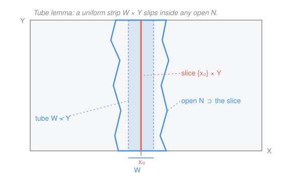

# Topology · Lesson 4.4: Tychonoff's theorem

> ⏱ ~15 min · Module 4: Compactness · Builds on: [2.3](02-03-product-topology.md), [4.1](04-01-compactness-open-covers.md) · Unlocks: [4.5](04-05-local-compactness-compactification.md)

## Why this matters

Compactness is "finiteness for infinite spaces" — it's what lets you pass from local information to global conclusions (a continuous function on a compact space attains its max, is uniformly continuous, and so on). Now ask: if you build a *huge* product out of compact pieces — say all sequences $(x_1, x_2, x_3, \dots)$ with each $x_n \in [0,1]$, an infinite-dimensional cube — does the whole thing stay compact? Tychonoff's theorem says **yes**, with no restriction whatsoever on how many factors you multiply, even uncountably many. This is the single deepest theorem of point-set topology: it is what makes infinite-dimensional "boxes" tractable, and it is the engine underneath compactness of function spaces, the Stone–Čech compactification, and the Banach–Alaoglu theorem in functional analysis.

## The idea

A product of compact spaces "should" be compact — a rectangle $[0,1]\times[0,1]$ is compact, a cube $[0,1]^3$ is compact, and you'd hope the pattern never breaks. The miracle is that it doesn't, no matter how many dimensions you stack, even infinitely many.

But there's a catch that reveals *why* the [product topology](02-03-product-topology.md) was defined the way it was. Recall from [2.3](02-03-product-topology.md) that on an infinite product there are two natural topologies: the **box topology** (basic open sets are products $\prod_\alpha U_\alpha$ of open sets in *every* factor) and the coarser **product topology** (basic open sets restrict only *finitely many* factors, leaving the rest as the whole space). Tychonoff's theorem is **true for the product topology and false for the box topology**. That single fact is the deepest justification for preferring the product topology — it is the one that keeps compactness alive.

We'll prove the finite case honestly (it rests on one clean geometric fact, the **tube lemma**), and then state the infinite case, which is genuinely harder — so hard that it turns out to be *equivalent to the axiom of choice*.

## The formal version

**Tychonoff's theorem.** Let $\{X_\alpha\}_{\alpha \in A}$ be any family of topological spaces, indexed by a set $A$ of *any* cardinality. If every $X_\alpha$ is compact, then the product $\prod_{\alpha \in A} X_\alpha$, equipped with the **product topology**, is compact.

> In words: multiply together any number of compact spaces — two, a thousand, or uncountably many — and the result is still compact, provided you use the product topology.

Two pieces of notation, both from [2.3](02-03-product-topology.md): a point of $\prod_\alpha X_\alpha$ is a choice $(x_\alpha)_{\alpha\in A}$ of one coordinate in each factor, and the **projection** $\pi_\beta : \prod_\alpha X_\alpha \to X_\beta$ reads off the $\beta$-th coordinate. The product topology is the coarsest topology making every $\pi_\beta$ continuous; a **subbasis** for it is the collection of preimages $\pi_\beta^{-1}(U)$ with $U\subseteq X_\beta$ open — each such set constrains exactly one coordinate.

**The tube lemma** (the finite case's workhorse). Let $Y$ be compact. If $N$ is an open set of $X \times Y$ containing the entire slice $\{x_0\} \times Y$, then $N$ contains a **tube** $W \times Y$ for some open $W \subseteq X$ with $x_0 \in W$.

> In words: if an open set swallows one whole vertical fiber, it must also swallow a uniform-width vertical strip around it — compactness of $Y$ forbids the open set from pinching to zero width as it runs up the fiber.

## Picture

The slice $\{x_0\}\times Y$ (red) is a single fiber. The open set $N$ (blue outline) is allowed to be lumpy — it can bulge and pinch as it climbs $Y$ — but because $Y$ is compact it can only pinch finitely often, so a strip $W\times Y$ of *uniform* width (blue) still fits inside. If $Y$ were not compact, $N$ could taper toward zero width forever and trap no tube at all.

## Worked examples

**Example 1 (the tube lemma, proved).** Take a point $(x_0, y)$ on the slice. Since $N$ is open and contains it, the [product topology](02-03-product-topology.md) gives a basic open box $U_y \times V_y \subseteq N$ with $x_0 \in U_y$ and $y \in V_y$. As $y$ ranges over $Y$, the sets $\{V_y\}_{y\in Y}$ form an open cover of $Y$. **Here is where compactness enters:** extract a finite subcover $V_{y_1}, \dots, V_{y_n}$ of $Y$. Now set

$$W = U_{y_1} \cap U_{y_2} \cap \cdots \cap U_{y_n},$$

a *finite* intersection of open neighborhoods of $x_0$, hence open and containing $x_0$. Claim: $W \times Y \subseteq N$. Indeed, take any $(x, y)\in W\times Y$. Then $y \in V_{y_k}$ for some $k$, and $x \in W \subseteq U_{y_k}$, so $(x,y) \in U_{y_k}\times V_{y_k}\subseteq N$. That's the tube. $\blacksquare$

The whole argument is: cover the compact slice by boxes, take finitely many, and **intersect their $X$-parts** — a finite intersection stays open, which is exactly why the strip has uniform width.

**Example 2 (finite Tychonoff — why you'd care).** Now prove: if $X$ and $Y$ are compact, so is $X \times Y$. Let $\mathcal{C}$ be any open cover of $X \times Y$; we extract a finite subcover.

Fix $x_0 \in X$. The slice $\{x_0\}\times Y$ is homeomorphic to $Y$, hence compact, so finitely many members of $\mathcal{C}$ — call their union $N_{x_0}$ — cover the slice. This $N_{x_0}$ is open and contains $\{x_0\}\times Y$, so the **tube lemma** hands us a tube $W_{x_0}\times Y \subseteq N_{x_0}$, covered by those same finitely many sets.

Do this for every $x_0\in X$. The tubes' bases $\{W_{x_0}\}_{x_0\in X}$ form an open cover of $X$; since $X$ is compact, finitely many suffice: $W_{x_1}, \dots, W_{x_m}$. The corresponding tubes $W_{x_1}\times Y, \dots, W_{x_m}\times Y$ then cover all of $X\times Y$, and *each* tube was covered by finitely many members of $\mathcal{C}$. Finitely many tubes, each needing finitely many sets — a finite subcover in total. So $X\times Y$ is compact. $\blacksquare$

By induction, any *finite* product $X_1\times\cdots\times X_n$ of compact spaces is compact (write it as $(X_1\times\cdots\times X_{n-1})\times X_n$ and apply the two-factor case). This is already the general Heine–Borel machine: $[0,1]^n\subseteq\mathbb{R}^n$ is compact because $[0,1]$ is, no other input needed.

**The infinite case (stated, and its honest price).** For an arbitrary index set $A$, the finite-intersection strategy breaks — you cannot take "infinitely many intersections" and stay open, which is precisely why the box topology fails. The standard proofs instead run through the **finite intersection property** (a space is compact iff every family of closed sets with all finite subintersections nonempty has nonempty total intersection) pushed to a limit by a maximal filter or **ultrafilter**, or equivalently through the **Alexander subbase theorem** (it suffices to find finite subcovers of covers drawn from a subbasis). Both are beyond our scope, but both are honest, complete proofs.

The remarkable fact — due to Kelley (1950) — is that **Tychonoff's theorem is *equivalent* to the axiom of choice**: assuming Tychonoff, you can prove AC, and vice versa. So the infinite case is not merely "harder to prove"; it *genuinely cannot be proved* without some form of choice. Choosing a coordinate in each of uncountably many factors, coherently, is exactly the kind of act AC exists to license. (The Hausdorff version — products of *compact Hausdorff* spaces — needs only the weaker Boolean-prime-ideal theorem, but full Tychonoff needs full AC.)

## Watch out

- **You might think** the theorem holds in the box topology too, since box is "just a finer product." **Actually** Tychonoff is *false* for the box topology: $[0,1]^\omega$ with the box topology is not compact (one can build an open cover with no finite subcover). Tychonoff is a theorem *about the product topology specifically* — this is the deep reason the product topology, not the box, is "the right one."
- **You might think** there's some size limit — maybe countable products are fine but uncountable ones fail. **Actually** there is no restriction on the index set at all: $\{0,1\}^{\mathbb{R}}$ (a product of continuum-many two-point spaces) is compact. "Compact factors $\Rightarrow$ compact product," full stop.
- **You might think** the tube lemma is a symmetric fact about any open set around a slice. **Actually** it needs one factor to be **compact**: over a *non*-compact $Y$ the open set can taper to zero width forever and trap no tube. Example: in $\mathbb{R}\times\mathbb{R}$, the region $N=\{(x,y): |x|<1/(1+y^2)\}$ is open and contains the whole slice $\{0\}\times\mathbb{R}$, yet contains no tube $W\times\mathbb{R}$ — the compactness of $Y$ in the lemma is doing real work.

## One-liner

> Any product of compact spaces is compact in the product topology — provably by the tube lemma when the product is finite, and only via the axiom of choice when it is infinite.

## Problems

**P1 (🟢)** State precisely why the finite intersection $W = U_{y_1}\cap\cdots\cap U_{y_n}$ in the tube lemma is open, and explain in one sentence why the *same* construction would break if the slice $\{x_0\}\times Y$ needed *infinitely* many boxes to cover it.

**P2 (🟡)** The **Hilbert cube** is $Q = [0,1]^\omega = \prod_{n=1}^\infty [0,1]$ with the product topology. (a) Cite the theorem that makes $Q$ compact. (b) Show directly that $Q$ is *not* compact in the **box** topology by exhibiting an open cover with no finite subcover. (Hint: consider box-open sets that pin down more and more coordinates.)

**P3 (🔴, optional)** Prove the tube-lemma failure claim from "Watch out": in $\mathbb{R}\times\mathbb{R}$, let $N=\{(x,y): |x|<\tfrac{1}{1+y^2}\}$. Show $N$ is open, contains the slice $\{0\}\times\mathbb{R}$, yet contains no tube $W\times\mathbb{R}$ around $x_0=0$. Identify exactly which hypothesis of the tube lemma fails.

Solutions

**P1** $W$ is open because it is a **finite** intersection of open sets, and one of the three topology axioms is that finite intersections of open sets are open (arbitrary intersections need not be). The construction breaks for an infinite slice-cover because we would be forced to intersect *infinitely many* neighborhoods $U_y$ of $x_0$; that intersection can fail to be open (indeed can shrink to the single point $\{x_0\}$), so no positive-width tube survives. Compactness of $Y$ is precisely what guarantees a *finite* subcover, keeping the intersection open — this is the whole reason the product topology (finite constraints) works where the box topology (infinite constraints) fails.

**P2** (a) **Tychonoff's theorem**: each factor $[0,1]$ is compact (Heine–Borel), so the product $[0,1]^\omega$ is compact in the product topology, with no appeal to countability needed.

(b) The clean route: exhibit an infinite subset that a box-open cover can separate point-by-point. For each $k\ge 1$ let $e^{(k)}$ be the point whose $k$-th coordinate is $1$ and all others $0$. Define box-open sets
$$B_k=\prod_{n=1}^\infty I^{(k)}_n\cap[0,1],\qquad I^{(k)}_n=\Big(e^{(k)}_n-\tfrac13,\ e^{(k)}_n+\tfrac13\Big),$$
a genuine box-open set because it constrains *every* coordinate. Each $B_k$ contains $e^{(k)}$ but no other $e^{(j)}$ (for $j\neq k$ they differ by $1$ in coordinates $j$ and $k$, well outside a radius-$\tfrac13$ window). Now cover $[0,1]^\omega$ by
$$\{B_k : k\ge 1\}\ \cup\ \big\{\,[0,1]^\omega\setminus\{e^{(k)}:k\ge1\}\,\big\}$$
— the last set is box-open because $\{e^{(k)}\}$ is closed (it has no limit points: every point has a box neighborhood meeting the set in at most one $e^{(k)}$). This is an open cover. No finite subcollection covers: dropping any $B_k$ leaves $e^{(k)}$ uncovered, since $B_k$ is the only member of the cover containing it. So $[0,1]^\omega$ is not box-compact — the *same* factors, a different topology, opposite verdict.

**P3** *Open:* the map $g(x,y)=\tfrac1{1+y^2}-|x|$ is continuous and $N=\{g>0\}$ is the preimage of the open ray $(0,\infty)$, hence open. *Contains the slice:* at $x=0$, $g(0,y)=\tfrac1{1+y^2}>0$ for all $y$, so $\{0\}\times\mathbb{R}\subseteq N$. *No tube:* a tube around $x_0=0$ would be $W\times\mathbb{R}$ with $W$ an open interval $(-\delta,\delta)$, $\delta>0$. But for the point $(x,y)=(\delta/2,\,y)$ to lie in $N$ we need $\delta/2<\tfrac1{1+y^2}$, which fails once $y$ is large enough (the right side $\to 0$). So no fixed-width strip stays inside $N$. The failed hypothesis: **the second factor $Y=\mathbb{R}$ is not compact** — the slice-cover has no finite subcover, and $N$ tapers to zero width as $y\to\infty$.

## Flashback

**From Lesson 2.3 (The product topology — box vs. product):** Let $\prod_{n=1}^\infty \mathbb{R}$ be the product of countably many copies of $\mathbb{R}$. Consider the set $D = \prod_{n=1}^\infty (-1, 1)$ (every coordinate in the open interval $(-1,1)$). Is $D$ open in the **box** topology? Is it open in the **product** topology? Justify each answer.

Solution

**Box topology: yes.** A basic box-open set is any product $\prod_n U_n$ of open sets $U_n\subseteq\mathbb{R}$. Taking $U_n=(-1,1)$ for every $n$ exhibits $D$ itself as a basic box-open set, so $D$ is box-open.

**Product topology: no.** A nonempty basic product-open set constrains only *finitely many* coordinates — it has the form $\prod_n U_n$ where $U_n=\mathbb{R}$ for all but finitely many $n$. Any such set therefore contains points with, say, a $10^{th}$ coordinate equal to $5$, which are not in $D$. So $D$ contains no nonempty product-basic open set around any of its points; it is **not** product-open (in fact it has empty product-interior). This is the exact gap Tychonoff exploits: the product topology's insistence on finitely many constraints is what keeps compactness alive, and sets like $D$ — open in the box, not in the product — are why the two theories diverge.

## Connections

- **Backward:** this is the payoff of the [product topology](02-03-product-topology.md) from [2.3](02-03-product-topology.md) — the "why finite constraints?" question raised there is answered here (compactness survives), and the whole argument runs on the finite-subcover definition of [compactness](04-01-compactness-open-covers.md) from [4.1](04-01-compactness-open-covers.md).
- **Forward:** [4.5](04-05-local-compactness-compactification.md) builds compactifications by *adding* points to non-compact spaces; Tychonoff is the tool that certifies the big compact spaces those constructions land inside (e.g. the Stone–Čech compactification embeds a space into a product of intervals $[0,1]^A$, compact by Tychonoff).
- **Sideways (functional analysis):** the **Banach–Alaoglu theorem** — the closed unit ball of a dual Banach space is weak-* compact — is *proved by Tychonoff*: the ball sits as a closed subset of a product of compact scalar disks $\prod_x \{|z|\le\|x\|\}$. Compactness of infinite-dimensional balls, impossible in the norm topology, is recovered in the weak-* topology exactly because Tychonoff makes the product compact. This is the bridge from point-set topology to the compactness arguments that run modern analysis and, downstream, quantum mechanics' operator theory.
