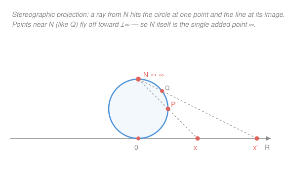

# Topology · Lesson 4.5: Local compactness and compactification

> ⏱ ~15 min · Module 4: Compactness · Builds on: [4.1 Compactness: open covers](04-01-compactness-open-covers.md), [4.3 Heine–Borel and maps on compact spaces](04-03-heine-borel-continuous-maps.md) · Unlocks: Module 5 — [5.1 The separation axioms: Hausdorff and friends](05-01-separation-axioms-hausdorff.md)

## Why this matters

Compactness is the property that makes analysis work — continuous functions attain their maxima, sequences have convergent subsequences, everything is "finite enough." But the spaces we actually live in, $\mathbb{R}$ and $\mathbb{R}^n$, are *not* compact: they run off to infinity. This lesson is the two-part rescue. First, $\mathbb{R}^n$ is compact *near every point* even though it isn't compact overall — that local version, **local compactness**, is exactly the hypothesis that Fourier analysis, manifold theory, and measure theory need. Second, you can often *buy* genuine compactness by gluing on a single "point at infinity," wrapping the line into a circle and the plane into a sphere. That sphere is the Riemann sphere of `complex-analysis`, where $\infty$ becomes an ordinary point you can do calculus at.

## The idea

Stand anywhere on the real line and look at a small window around you, say $[x-1, x+1]$. That window is a closed bounded interval — compact, by Heine–Borel from [4.3](04-03-heine-borel-continuous-maps.md). So *locally* the line is as good as compact; the only thing spoiling global compactness is that the line never ends. Local compactness names precisely this: **every point sits inside a compact chunk.**

Now the second, bolder idea. The line fails to be compact because a sequence can march off to $+\infty$ (or $-\infty$) with nowhere to converge. What if we add *one* new point, called $\infty$, and declare that marching-off to be convergence *to that point*? Wrap both ends of the line around and glue them to the single new point, and the line becomes a **circle**. Do the same to the plane — every escape-to-infinity, in every direction, now lands on one shared point — and the plane becomes a **sphere**. We've manufactured compactness out of a non-compact space by adding exactly one point. That's the one-point compactification, and the geometry that makes it precise is stereographic projection.

## The formal version

**Local compactness.** A space $X$ is **locally compact** if every point $x\in X$ has a **compact neighborhood** — a compact set $K$ that contains an open set $U$ with $x\in U\subseteq K$.

> In words: around every point there's a compact "cushion" — a compact set with room to spare (an open set) inside it, holding the point.

The "room to spare" matters: we don't just want $x$ to lie in *some* compact set (in $\mathbb{R}$ the single point $\{x\}$ is compact and contains $x$), we want a compact set thick enough to contain a whole open neighborhood. For **Hausdorff** spaces this has the clean equivalent form: $X$ is locally compact iff every point has a neighborhood basis of open sets with compact closure — i.e. arbitrarily small open sets $U$ with $\overline{U}$ compact.

**The one-point (Alexandroff) compactification.** Given any space $X$, adjoin one new point $\infty\notin X$ and set $X^+ = X\cup\{\infty\}$. Declare a subset of $X^+$ to be **open** if it is either

1. an open subset of $X$ (not containing $\infty$), or
2. a set of the form $\{\infty\}\cup(X\setminus K)$ where $K\subseteq X$ is **compact and closed**.

> In words: the old open sets stay open, and a neighborhood of $\infty$ is "everything outside some compact lump" — to be near $\infty$ is to have escaped every compact set.

**Theorem.** This collection is a topology on $X^+$; $X^+$ is compact; the inclusion $X\hookrightarrow X^+$ is an embedding (the subspace topology $X$ inherits from $X^+$ is its original topology); and if $X$ is not compact, $X$ is dense in $X^+$. Moreover **$X^+$ is Hausdorff iff $X$ is locally compact Hausdorff.**

*Proof that $X^+$ is a topology.* Both $\varnothing$ (type 1) and $X^+=\{\infty\}\cup(X\setminus\varnothing)$ (type 2, with $K=\varnothing$, which is compact and closed) are open.

*Unions.* Take a family of open sets. The type-1 members union to an open $U\subseteq X$. If no type-2 members appear, done. If some do, each is $\{\infty\}\cup(X\setminus K_i)$; their union with $U$ is $\{\infty\}\cup\big(U\cup\bigcup_i(X\setminus K_i)\big) = \{\infty\}\cup\big(X\setminus(\bigcap_i K_i\setminus U)\big)$. Set $K=\bigcap_i K_i$: it is closed (intersection of closed sets) and compact (a closed subset of the compact $K_1$, using the closed-subset-of-compact fact from [4.1](04-01-compactness-open-covers.md)). Then $K\setminus U = K\cap(X\setminus U)$ is closed, and it is a closed subset of the compact $K$, hence compact — so the union has type-2 form. ✓

*Finite intersections.* Type-1 ∩ type-1 is type-1. For type-2 ∩ type-2, $\big(\{\infty\}\cup(X\setminus K_1)\big)\cap\big(\{\infty\}\cup(X\setminus K_2)\big)=\{\infty\}\cup\big(X\setminus(K_1\cup K_2)\big)$, and $K_1\cup K_2$ is compact and closed. For type-1 ∩ type-2, $U\cap\big(\{\infty\}\cup(X\setminus K)\big) = U\cap(X\setminus K)=U\setminus K$, which is open in $X$ (since $K$ is closed) and omits $\infty$ — type 1. ✓

*Compactness of $X^+$.* Let $\{V_\alpha\}$ be an open cover of $X^+$. Some $V_{\alpha_0}$ contains $\infty$, so it has type 2: $V_{\alpha_0}=\{\infty\}\cup(X\setminus K)$ with $K$ compact. The remaining $V_\alpha$ cover $K$ (they cover everything except possibly points inside $K$), and their traces on $X$ are open, so finitely many cover the compact $K$. Those finitely many, together with $V_{\alpha_0}$, cover all of $X^+$. ✓

*Hausdorff ⟺ locally compact Hausdorff.* Two points of $X$ are separated by their $X$-neighborhoods (type 1), so the only issue is separating a point $x\in X$ from $\infty$. That requires an open $U\ni x$ and an open $\{\infty\}\cup(X\setminus K)\ni\infty$ that are disjoint, i.e. $U\subseteq K$ with $K$ compact — exactly a compact neighborhood of $x$. So $\infty$ can be separated from every $x$ iff $X$ is locally compact (and $X$ Hausdorff handles the rest). $\blacksquare$

## Picture

**Stereographic projection.** Rest the unit circle so it touches the number line, and mark its top point $N$ (the north pole). For any *other* point $P$ on the circle, draw the ray from $N$ through $P$; it hits the line at a unique point $x$, and this correspondence $P\leftrightarrow x$ is a homeomorphism between $S^1\setminus\{N\}$ and $\mathbb{R}$. As $P$ climbs toward $N$, its image $x$ races off to $\pm\infty$ — so filling the one missing point $N$ back in is exactly gluing on the single point $\infty$. The identical construction in one dimension up sends $S^2\setminus\{N\}$ to $\mathbb{R}^2$, and in general $S^n\setminus\{N\}\cong\mathbb{R}^n$.

## Worked examples

**Example 1 (mechanical — who is locally compact).**

- $\mathbb{R}^n$ **is** locally compact: any point $x$ lies in the open ball $B(x,1)$, which sits inside the closed ball $\overline{B}(x,1)$ — closed and bounded, hence compact by Heine–Borel ([4.3](04-03-heine-borel-continuous-maps.md)). A compact neighborhood, at every point. (But $\mathbb{R}^n$ is *not* compact — it's unbounded.)
- Any **discrete** space is locally compact: $\{x\}$ is open *and* compact (finite), so it's its own compact neighborhood.
- Every **compact** space is trivially locally compact: the whole space is a compact neighborhood of each point.
- $\mathbb{Q}$ (with the topology from $\mathbb{R}$) is **not** locally compact. Take the point $0$ and any neighborhood; it contains some interval $(-\varepsilon,\varepsilon)\cap\mathbb{Q}$. Any compact $K\subseteq\mathbb{Q}$ containing that interval would be closed and bounded in $\mathbb{Q}$, but pick an irrational $\alpha\in(-\varepsilon,\varepsilon)$ and a rational sequence $q_n\to\alpha$ inside $K$: the limit $\alpha$ is missing from $\mathbb{Q}$, so $K$ contains a sequence with no convergent-in-$K$ subsequence. Not compact. No point of $\mathbb{Q}$ has a compact neighborhood.

**Example 2 (why you'd care — $\mathbb{R}^+ = S^1$, and $\infty$ is one point, not two).** Compactify the line. Neighborhoods of $\infty$ are the sets $\{\infty\}\cup(\mathbb{R}\setminus K)$ with $K$ compact — and every compact $K\subseteq\mathbb{R}$ is bounded, so $\mathbb{R}\setminus K$ contains *both* a far-right ray $(M,\infty)$ and a far-left ray $(-\infty,-M)$. Thus a single basic neighborhood of $\infty$ scoops up both tails at once: a sequence $\to+\infty$ and a sequence $\to-\infty$ now converge to *the same* point $\infty$. The two ends of the line are pinned together at one point — precisely the gluing that turns a segment into a loop. So $\mathbb{R}^+\cong S^1$. This is the Alexandroff realization of "wrap the line into a circle."

The plane behaves the same way but more dramatically: *every* direction of escape lands on one shared $\infty$, and $\mathbb{R}^2\cup\{\infty\}\cong S^2$ — the **Riemann sphere** $\hat{\mathbb{C}}=\mathbb{C}\cup\{\infty\}$ from `complex-analysis`, on which $1/z$ extends continuously by sending $0\mapsto\infty$.

## Watch out

- You might think "locally compact" is a mild weakening that most spaces have, but it is genuinely restrictive. It is **compact *neighborhood*, not compact space**: every compact space is locally compact, never the reverse. And infinite-dimensional normed spaces (function spaces like $C[0,1]$) are **not** locally compact — closed balls there fail to be compact — which is exactly why analysis on them is so much harder than on $\mathbb{R}^n$. Together with $\mathbb{Q}$, these are the standard non-examples.
- You might think you can one-point-compactify anything and get a nice space, but $X^+$ is **Hausdorff only when $X$ is locally compact Hausdorff**. Compactify $\mathbb{Q}$ and the new $\infty$ cannot be separated from the rational points (no compact neighborhoods to wall it off) — you get a compact space that isn't Hausdorff, so limits aren't unique there. Compactification is only well-behaved on locally compact Hausdorff spaces.
- You might think adding one point is a cosmetic change, but it can rewrite the global topology entirely: $\mathbb{R}$ (contractible, two ends, not compact) becomes $S^1$ (a loop, compact, with a nontrivial fundamental group you'll compute in Module 6). One point can change *everything* about shape — that's the whole power of the move.
- The one-point compactification is the *smallest* compactification (one added point). It is not the only one: the **Stone–Čech compactification** $\beta X$ is the *largest*, a vast space engineered so that every bounded continuous function on $X$ extends to it. Different job, wildly different size — just know the name for now.

## One-liner

> Locally compact = compact near every point (like $\mathbb{R}^n$, unlike $\mathbb{Q}$); and adding one point at infinity can wrap a non-compact space into a compact one — the line into a circle, the plane into the Riemann sphere.

## Problems

**P1 (🟢)** Show directly from the definition that the open interval $(0,1)$, with its usual topology, is locally compact. Then identify its one-point compactification $(0,1)^+$ up to homeomorphism. (Hint: $(0,1)\cong\mathbb{R}$.)

**P2 (🟡)** Let $X$ be an **infinite set with the discrete topology**. Describe the open sets of $X^+$ concretely, and prove that $X^+$ is homeomorphic to the sequence-with-limit space $\{0\}\cup\{1/n : n\in\mathbb{N}\}\subseteq\mathbb{R}$ when $X=\mathbb{N}$. Which point plays the role of $\infty$?

**P3 (🔴, optional)** Prove that if $X$ is compact Hausdorff and $p\in X$, then $X\setminus\{p\}$ is locally compact Hausdorff, and its one-point compactification $(X\setminus\{p\})^+$ is homeomorphic to $X$. (This says the one-point compactification "undoes" deleting a point — e.g. $S^n$ minus a point is $\mathbb{R}^n$, whose compactification is $S^n$ again.)

Solutions

**P1** Fix $x\in(0,1)$. Choose $\varepsilon>0$ small enough that $[x-\varepsilon,\,x+\varepsilon]\subseteq(0,1)$ (possible since $(0,1)$ is open: take $\varepsilon<\min(x,1-x)$). The closed interval $[x-\varepsilon,x+\varepsilon]$ is compact (closed and bounded, Heine–Borel), and it contains the open set $(x-\varepsilon,x+\varepsilon)\ni x$. So $x$ has a compact neighborhood; $(0,1)$ is locally compact. For the compactification: $(0,1)\cong\mathbb{R}$ (e.g. via $t\mapsto\tan(\pi(t-\tfrac12))$, a homeomorphism), and homeomorphic spaces have homeomorphic one-point compactifications, so $(0,1)^+\cong\mathbb{R}^+\cong S^1$. Both missing endpoints get glued to the *same* single $\infty$, closing the open interval into a circle.

**P2** In $X$ discrete, *every* subset is open, and the compact subsets are exactly the **finite** subsets (an infinite subset $A$ is covered by its singletons $\{a\}$, all open, with no finite subcover). Finite sets are also closed (everything is closed in discrete $X$). So the open sets of $X^+$ are: every subset of $X$ (type 1), plus every set $\{\infty\}\cup(X\setminus F)$ with $F\subseteq X$ finite (type 2) — i.e. a neighborhood of $\infty$ is $\infty$ together with all but finitely many points of $X$.

For $X=\mathbb{N}$: define $h:\mathbb{N}^+\to \{0\}\cup\{1/n:n\in\mathbb{N}\}$ by $h(n)=1/n$ and $h(\infty)=0$. It is a bijection. Points $1/n$ are isolated in the target (each has a small neighborhood containing no other $1/m$), matching the discrete points $n\in\mathbb{N}$; and a neighborhood of $0$ contains all $1/n$ with $n$ large, i.e. all but finitely many — matching the type-2 neighborhoods of $\infty$. So $h$ carries open sets to open sets both ways: it is a homeomorphism. The added point $\infty$ plays the role of the limit $0$, the one point the sequence $1/n$ converges to. (This is the cleanest picture of "adding $\infty$ = adding the missing limit point.")

**P3** *Locally compact Hausdorff.* $X\setminus\{p\}$ is an open subspace of the Hausdorff space $X$, hence Hausdorff. For local compactness, take $x\in X\setminus\{p\}$. Since $X$ is compact Hausdorff it is Hausdorff, so $x$ and $p$ have disjoint open neighborhoods $U\ni x$, $W\ni p$ (in $X$). Actually we need a *compact* neighborhood inside $X\setminus\{p\}$: in a compact Hausdorff space, points can be separated by neighborhoods with disjoint closures — concretely, choose disjoint open $U\ni x$, $W\ni p$; then $\overline{U}$ is closed in the compact $X$, hence compact ([4.1](04-01-compactness-open-covers.md)), and $\overline{U}\cap W=\varnothing$ forces $p\notin\overline{U}$, so $\overline{U}\subseteq X\setminus\{p\}$. Thus $\overline{U}$ is a compact neighborhood of $x$ inside $X\setminus\{p\}$. Locally compact. ✓

*The compactification is $X$.* Let $Y=X\setminus\{p\}$, and define $\varphi:Y^+\to X$ by $\varphi|_Y=\mathrm{id}$ and $\varphi(\infty)=p$. It is a bijection. It is continuous: preimage of an open $V\subseteq X$ is open in $Y^+$ — if $p\notin V$ then $\varphi^{-1}(V)=V\subseteq Y$ is open (type 1); if $p\in V$ then $\varphi^{-1}(V)=\{\infty\}\cup(V\setminus\{p\})=\{\infty\}\cup(Y\setminus K)$ where $K=Y\setminus(V\setminus\{p\})=X\setminus V$, which is closed in $X$ hence compact, and closed — so $\varphi^{-1}(V)$ is open of type 2. Finally $\varphi$ is a continuous bijection from the compact space $Y^+$ to the Hausdorff space $X$, so it is a homeomorphism by the compact-to-Hausdorff theorem from [4.3](04-03-heine-borel-continuous-maps.md). Hence $(X\setminus\{p\})^+\cong X$. $\blacksquare$

## Flashback

**From Lesson 4.3 (Heine–Borel and maps on compact spaces):** Let $f:[a,b]\to\mathbb{R}$ be continuous with $f(a)<0<f(b)$. Using compactness rather than the Intermediate Value Theorem, prove that $f$ attains a **minimum** value on $[a,b]$, and state whether that minimum must be negative.

Solution

$[a,b]$ is closed and bounded, hence compact by Heine–Borel. $f$ is continuous, so the image $f([a,b])$ is compact — a continuous image of a compact set ([4.3](04-03-heine-borel-continuous-maps.md)) — hence closed and bounded in $\mathbb{R}$. A closed bounded nonempty subset of $\mathbb{R}$ contains its infimum (bounded below gives a finite $m=\inf f([a,b])$; closed means $m$ is actually attained, since $m$ is a limit point of the image). So there is $c\in[a,b]$ with $f(c)=m$ the minimum — this is the Extreme Value Theorem, gotten purely from compactness, no IVT needed.

Must the minimum be negative? **Yes.** We have $f(a)<0$, and $m=\min f\le f(a)<0$. (The IVT would separately hand us a *root* between $a$ and $b$; but that a *minimum exists and is negative* is the compactness statement alone.) $\blacksquare$

## Connections

- **Backward:** the whole construction rests on Module 4's machinery — "closed subset of a compact set is compact" and "continuous image of compact is compact" from [4.1](04-01-compactness-open-covers.md) and [4.3](04-03-heine-borel-continuous-maps.md) are used repeatedly, and Heine–Borel is what makes $\mathbb{R}^n$'s closed balls compact in the first place. Local compactness is the *local* echo of the compactness you defined in [4.1](04-01-compactness-open-covers.md).
- **Forward:** the Hausdorff clause is the hinge into Module 5. That $X^+$ is Hausdorff *only* for locally compact Hausdorff $X$ is your first taste of the [5.1](05-01-separation-axioms-hausdorff.md) separation hierarchy, where separating points by open sets becomes the organizing question. And $S^1$-as-a-compactification returns in Lesson 6.3 when you compute $\pi_1(S^1)=\mathbb{Z}$ — the circle you built here by gluing on one point is the space whose loops carry all the algebra.
- **Sideways (complex analysis):** $\mathbb{R}^2\cup\{\infty\}=S^2$ *is* the Riemann sphere $\hat{\mathbb{C}}$ of `complex-analysis`. Adding $\infty$ is what lets you treat poles as ordinary points, define "meromorphic functions as maps to $\hat{\mathbb{C}}$," and see Möbius transformations as rotations of a sphere — the compactness you built here is what makes that geometry compact and clean.
