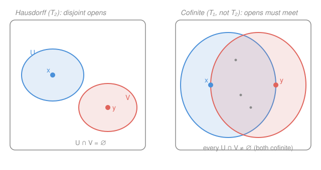

# Topology · Lesson 5.1: The separation axioms — Hausdorff and friends

> ⏱ ~15 min · Module 5: Separation, countability, and metrization · Builds on: [1.5 Interior, closure, boundary, and limit points](01-05-closure-interior-boundary.md), [4.1 Compactness: open covers](04-01-compactness-open-covers.md) · Unlocks: [5.2 Normal spaces, Urysohn's lemma, and Tietze](05-02-normal-spaces-urysohn.md)

## Why this matters

Every theorem you love about limits and continuity quietly assumes something the axioms of a topology do *not* give you for free: that the space can tell its points apart. A topology can be so coarse that two different points are topologically indistinguishable — no open set separates them — and then a sequence can converge to *both* at once, and "the limit" stops being a thing. The separation axioms are a ladder of increasingly generous guarantees that open sets can isolate points. One rung, **Hausdorff**, is where almost all of analysis, geometry, and physics actually lives: it is exactly the assumption that makes limits unique. This lesson climbs the ladder and pins down what each rung buys.

## The idea

Hand a topology two distinct points $x\neq y$ and ask how well its open sets can distinguish them. There's a natural sequence of demands, each strictly stronger than the last:

- **$T_0$:** *some* open set contains one of them but not the other. The weakest possible "they're different" — the topology at least notices they aren't the same point.
- **$T_1$:** *each* point has an open set catching it but missing the other. Symmetric now — neither point is trapped inside every neighborhood of the other. This turns out to be exactly the condition that every single point $\{x\}$ is a closed set.
- **$T_2$ (Hausdorff):** the two points sit in **disjoint** open neighborhoods — two open sets that don't just each miss the other point, but don't even touch each other. This is the room-to-breathe condition, and it's the one that forces limits to be unique.

The jump from $T_1$ to $T_2$ is the subtle one: $T_1$ lets each point fence the other out, but the two fences can still overlap everywhere. Hausdorff insists they can be pulled fully apart. The cofinite topology (below) lives precisely in that gap — $T_1$ but never $T_2$ — and it's worth carrying as your standing counterexample.

The pathology at the bottom of the ladder: the **indiscrete** topology on a set of $\ge 2$ points, whose only open sets are $\varnothing$ and $X$. No nonempty open set misses any point, so it fails even $T_0$ — and there every sequence converges to every point. Hausdorff is the axiom that outlaws exactly this.

## The formal version

Fix a topological space $(X,\tau)$; an **open neighborhood** of a point $p$ is any open set containing $p$. Let $x,y\in X$ be distinct.

**$T_0$ (Kolmogorov).** For any $x\neq y$, there is an open set containing exactly one of them.
> In words: no two distinct points are topologically identical — some open set sees a difference.

**$T_1$.** For any $x\neq y$, there is an open $U$ with $x\in U,\ y\notin U$ **and** an open $V$ with $y\in V,\ x\notin V$.
> In words: each point can shrug off the other — a neighborhood catching me but not you, and one catching you but not me.

**$T_2$ (Hausdorff).** For any $x\neq y$, there are **disjoint** open sets $U,V$ with $x\in U$, $y\in V$, and $U\cap V=\varnothing$.
> In words: distinct points get non-overlapping bubbles — you can wall them off from each other, not merely from each other's point.

Clearly $T_2\Rightarrow T_1\Rightarrow T_0$ (disjoint bubbles are in particular each-misses-the-other; each-misses-the-other in particular separates one). All three implications are strict, as the examples show.

**Theorem 1 ($T_1$ ⟺ singletons are closed).** A space is $T_1$ if and only if $\{x\}$ is closed for every $x\in X$.

*Proof.* ($\Rightarrow$) Assume $T_1$. Fix $x$; we show $X\setminus\{x\}$ is open. For each $y\neq x$, $T_1$ gives an open $V_y$ with $y\in V_y$ and $x\notin V_y$, so $V_y\subseteq X\setminus\{x\}$. Then $X\setminus\{x\}=\bigcup_{y\neq x}V_y$ is a union of open sets, hence open; so $\{x\}$ is closed. ($\Leftarrow$) Assume every singleton is closed. Given $x\neq y$, the set $U=X\setminus\{y\}$ is open, contains $x$, and excludes $y$; symmetrically $V=X\setminus\{x\}$ is open, contains $y$, excludes $x$. That's exactly $T_1$. $\blacksquare$

This is why "$T_1$" and "points are closed" are used interchangeably — recall from [1.5](01-05-closure-interior-boundary.md) that closed means complement-open, and here the complement of a point is a union of little neighborhoods.

**Theorem 2 (Hausdorff ⟹ limits are unique).** In a Hausdorff space, a sequence converges to at most one point. (The same proof works verbatim for nets.)

*Proof.* Recall $x_n\to x$ means: every open neighborhood of $x$ contains all but finitely many terms $x_n$. Suppose $x_n\to a$ and $x_n\to b$ with $a\neq b$. By Hausdorff, pick disjoint opens $U\ni a$, $V\ni b$. Since $x_n\to a$, all but finitely many terms lie in $U$; since $x_n\to b$, all but finitely many lie in $V$. Then all but finitely many terms lie in $U\cap V$ — but $U\cap V=\varnothing$, which can hold only finitely many terms (namely none). A sequence has infinitely many indices, contradiction. Hence $a=b$. $\blacksquare$

**Contrast (the failure).** In the indiscrete topology on $X$ with $|X|\ge 2$, the only neighborhood of any point is $X$ itself, and $X$ contains *every* term. So $x_n\to p$ for **every** $p\in X$ simultaneously — limits are maximally non-unique. That's the disease; Hausdorff is the cure, and Theorem 2 is the prescription.

## Compactness meets Hausdorff

Hausdorff separation pairs with compactness (from [4.1](04-01-compactness-open-covers.md)) to give two facts you'll use constantly. Recall a set is **compact** if every open cover has a finite subcover.

**Theorem 3 (point vs. compact set).** In a Hausdorff space $X$, if $K\subseteq X$ is compact and $x\notin K$, then $x$ and $K$ have disjoint open neighborhoods: there exist disjoint opens $U\ni x$ and $W\supseteq K$.

*Proof.* For each $k\in K$ we have $k\neq x$, so Hausdorff gives disjoint opens $U_k\ni x$ and $V_k\ni k$. The family $\{V_k : k\in K\}$ is an open cover of $K$; by compactness finitely many suffice, say $K\subseteq V_{k_1}\cup\dots\cup V_{k_n}=:W$. Put $U=U_{k_1}\cap\dots\cap U_{k_n}$ — a *finite* intersection of opens, hence open, and it contains $x$. Now $U\subseteq U_{k_i}$ is disjoint from $V_{k_i}$ for each $i$, so $U$ is disjoint from their union $W$. Thus $U\ni x$ and $W\supseteq K$ are disjoint. $\blacksquare$

**Corollary (compact ⟹ closed in Hausdorff).** In a Hausdorff space, every compact subset $K$ is closed.

*Proof.* By Theorem 3, every $x\notin K$ has an open neighborhood $U$ disjoint from a set $W\supseteq K$, so $U\cap K=\varnothing$, i.e. $U\subseteq X\setminus K$. Thus $X\setminus K$ is a union of open sets, hence open, so $K$ is closed. $\blacksquare$

The same finite-subcover trick, run on two compact sets at once, separates them:

**Theorem 4 (compact vs. compact).** In a Hausdorff space, disjoint compact sets $K,L$ have disjoint open neighborhoods.

*Proof.* By Theorem 3, each point $\ell\in L$ (which lies outside the compact $K$) has an open $W_\ell\ni\ell$ and an open $U_\ell\supseteq K$ with $W_\ell\cap U_\ell=\varnothing$. The $W_\ell$ cover $L$; take a finite subcover $W_{\ell_1},\dots,W_{\ell_m}$ and set $W=\bigcup W_{\ell_j}\supseteq L$ and $U=\bigcap U_{\ell_j}\supseteq K$ (open, finite intersection). Each $U\subseteq U_{\ell_j}$ misses $W_{\ell_j}$, so $U$ misses $W$. $\blacksquare$

The finite intersection is the whole game — it's why compactness is what lets you upgrade "separate a point from each point" into "separate a point (or set) from a whole set." This is the seed of the next lesson: in [5.2](05-02-normal-spaces-urysohn.md) we push it to separating two disjoint *closed* sets (normality) and then manufacture continuous functions between them.

## Picture

Left is the Hausdorff separation — disjoint bubbles $U\ni x$, $V\ni y$. Right is the $T_1$-but-not-$T_2$ cofinite cartoon: an open set is the whole space minus finitely many points, so any two of them cover all but a finite set and *must* overlap (the grey lens). You can fence each point out (that's $T_1$), but you can never pull the fences apart.

## Worked examples

**Example 1 (every metric space is Hausdorff).** Let $(X,d)$ be a metric space with $x\neq y$, so $r:=d(x,y)>0$. Take the open balls of radius $\varepsilon=\tfrac12 r$:
$$U=B(x,\tfrac{r}{2}),\qquad V=B(y,\tfrac{r}{2}).$$
These are open and contain $x,y$ respectively. If some $z\in U\cap V$, the triangle inequality gives
$$r=d(x,y)\le d(x,z)+d(z,y)<\tfrac{r}{2}+\tfrac{r}{2}=r,$$
i.e. $r<r$ — absurd. So $U\cap V=\varnothing$ and $X$ is Hausdorff. In words: half the gap is too small for the two balls to touch. **Every space that comes from a metric sits at $T_2$ or above** — which is why the pathologies below can only appear in genuinely non-metric topologies, and foreshadows metrization (a metrizable space *must* be Hausdorff, [5.4](05-04-metrization.md)).

**Example 2 (the cofinite topology — $T_1$ but not $T_2$).** Let $X$ be **infinite** with the cofinite topology: open sets are $\varnothing$ and the complements of finite sets (met already in [1.5](01-05-closure-interior-boundary.md)). Then:
- **It's $T_1$.** Each singleton $\{x\}$ is finite, hence closed (its complement is cofinite, hence open). By Theorem 1, $X$ is $T_1$. Concretely, $U=X\setminus\{y\}$ and $V=X\setminus\{x\}$ separate $x$ from $y$ each way.
- **It's not $T_2$.** Take any two *nonempty* open sets $U,V$. Each is $X$ minus a finite set, so $U\cap V=X\setminus(F_1\cup F_2)$ where $F_1,F_2$ are finite. Since $X$ is infinite, $X\setminus(F_1\cup F_2)$ is still infinite — in particular nonempty. So **any two nonempty opens meet**: no disjoint neighborhoods exist, and $X$ fails Hausdorff for every pair of points.

This is the canonical witness that $T_1\not\Rightarrow T_2$. And it's not a pointless curiosity: on an infinite set, the cofinite topology is the *coarsest* $T_1$ topology (any $T_1$ topology must contain all cofinite sets, since it must make every finite set closed).

**A quick census of the ladder.**

| Space | $T_0$? | $T_1$? | $T_2$? | Why |
|---|:---:|:---:|:---:|---|
| Metric space | ✓ | ✓ | ✓ | Example 1 |
| Cofinite (infinite $X$) | ✓ | ✓ | ✗ | Example 2 |
| Sierpiński $\{0,1\}$, $\tau=\{\varnothing,\{1\},X\}$ | ✓ | ✗ | ✗ | below |
| Indiscrete ($\lvert X\rvert\ge 2$) | ✗ | ✗ | ✗ | below |

**Sierpiński space** $X=\{0,1\}$ with $\tau=\{\varnothing,\{1\},\{0,1\}\}$: the open set $\{1\}$ contains $1$ but not $0$, so it's $T_0$ — but there is *no* open set containing $0$ and missing $1$ (the only neighborhood of $0$ is all of $X$), so it fails $T_1$. Equivalently, $\{1\}$ is not closed. It is the minimal example of "$T_0$ but not $T_1$." The **indiscrete** space fails even $T_0$: with only $\varnothing$ and $X$ open, no open set separates any two points at all.

## Watch out

- **You might think $T_1$ (points closed) already gives you unique limits — it doesn't.** The cofinite topology on $\mathbb{N}$ is $T_1$, yet the sequence $x_n=n$ converges to *every* point: any cofinite neighborhood of $p$ omits only finitely many naturals, so all but finitely many $x_n$ land in it. Uniqueness of limits is a **Hausdorff** ($T_2$) phenomenon; $T_1$ is strictly too weak.
- **You might read "Hausdorff" as "distinct points have distinct neighborhoods" — it's *disjoint*.** Distinct-but-overlapping neighborhoods are cheap (even $T_1$ gives them). The entire content of $T_2$ is the emptiness of the intersection $U\cap V=\varnothing$. Drop "disjoint" and you've said nothing.
- **You might expect these axioms to be fragile under constructions — they're not.** $T_0,T_1,T_2$ are all **hereditary** (a subspace of a $T_i$ space is $T_i$: just intersect the separating opens with the subspace) and **productive** (an arbitrary product of $T_i$ spaces is $T_i$: separate in the one coordinate where two points differ, then pull back through the projection). So Hausdorffness, once you have it, survives subspaces and products — one reason it's such a comfortable standing assumption.

## One-liner

> $T_0$ notices two points differ, $T_1$ closes every point, $T_2$ (Hausdorff) walls distinct points into disjoint bubbles — and that last wall is exactly what makes a limit unique.

## Problems

**P1 (🟢)** On $\mathbb{R}$, let $\tau$ be the cofinite topology. (a) Is $\{0\}$ closed? Is $\{0\}$ open? (b) Show the sequence $x_n=n$ converges to $0$ in $\tau$ (and, in fact, to every real). (c) Which separation axioms does $(\mathbb{R},\tau)$ satisfy?

**P2 (🟡)** Prove directly from the definition that the Hausdorff property is **hereditary**: if $X$ is Hausdorff and $A\subseteq X$ carries the subspace topology, then $A$ is Hausdorff. (Recall from [2.2](02-02-subspace-topology.md) that open sets of $A$ are exactly $U\cap A$ for $U$ open in $X$.)

**P3 (🔴, optional)** Let $X$ be Hausdorff and $f,g:Y\to X$ continuous. Prove that the *agreement set* $E=\{y\in Y: f(y)=g(y)\}$ is closed in $Y$. Deduce that two continuous maps into a Hausdorff space that agree on a dense subset agree everywhere. (Hint: show $Y\setminus E$ is open by using disjoint bubbles around $f(y)\neq g(y)$ and continuity to pull them back.)

Solutions

**P1** (a) $\{0\}$ is **closed**: it's finite, and in the cofinite topology the closed sets are exactly the finite sets and $\mathbb{R}$ itself. It is **not open**: a nonempty open set is $\mathbb{R}$ minus a finite set, hence infinite, so the finite set $\{0\}$ cannot be open. (b) A neighborhood of $0$ is any open $U\ni 0$, i.e. $U=\mathbb{R}\setminus F$ with $F$ finite and $0\notin F$. Only finitely many naturals $n$ lie in $F$, so all but finitely many terms $x_n=n$ lie in $U$ — that's exactly $x_n\to 0$. The argument used nothing special about $0$: for any real $p$, a neighborhood $\mathbb{R}\setminus F$ ($p\notin F$) omits only finitely many $x_n$, so $x_n\to p$ too. Limits are wildly non-unique. (c) $(\mathbb{R},\tau)$ is $T_1$ (singletons are finite, hence closed — Theorem 1) but **not** $T_2$ (any two nonempty opens meet, since $\mathbb{R}$ is infinite — Example 2), so also not anything above $T_2$. It is of course $T_0$ as well. The non-unique limits in (b) are the concrete face of the missing $T_2$.

**P2** Take distinct points $a,b\in A$. Then $a\neq b$ as points of $X$, so by Hausdorffness of $X$ there are disjoint opens $U,V$ in $X$ with $a\in U$, $b\in V$, $U\cap V=\varnothing$. Now $U\cap A$ and $V\cap A$ are open in the subspace topology on $A$ (that's the definition of the subspace topology), they contain $a$ and $b$ respectively, and
$$(U\cap A)\cap(V\cap A)=(U\cap V)\cap A=\varnothing\cap A=\varnothing.$$
So $a,b$ have disjoint open neighborhoods in $A$; hence $A$ is Hausdorff. (Notice the proof only *intersected* the separating sets with $A$ — the same one-line move proves $T_0$ and $T_1$ hereditary too.)

**P3** We show $Y\setminus E$ is open. Let $y\in Y\setminus E$, so $f(y)\neq g(y)$ in $X$. By Hausdorff, choose disjoint opens $U\ni f(y)$ and $V\ni g(y)$ in $X$. By continuity of $f$ and $g$, the preimages $f^{-1}(U)$ and $g^{-1}(V)$ are open in $Y$, and both contain $y$; hence
$$W:=f^{-1}(U)\cap g^{-1}(V)$$
is an open neighborhood of $y$. For any $w\in W$ we have $f(w)\in U$ and $g(w)\in V$, and since $U\cap V=\varnothing$ we get $f(w)\neq g(w)$, i.e. $w\notin E$. So $W\subseteq Y\setminus E$. As $y$ was arbitrary, $Y\setminus E$ is open, and $E$ is closed. 

Deduction: suppose $f=g$ on a dense set $D$ (so $D\subseteq E$ and $\overline D=Y$). Since $E$ is closed and contains $D$, it contains $\overline D=Y$; thus $E=Y$, i.e. $f=g$ everywhere. (This is the topological reason "continuous functions into a nice space are determined by their values on a dense set" — the identity theorem's habitat, and it *requires* the target Hausdorff.) $\blacksquare$

## Flashback

**From Lesson 1.5 (Interior, closure, boundary, and limit points):** Let $X=\mathbb{Z}$ (the integers) carry the **cofinite topology**, and let $A=\{2,4,6,8,\dots\}$ be the positive even integers. Compute the interior $A^\circ$, the closure $\overline A$, the boundary $\partial A$, and the derived set $A'$.

Solution

In the cofinite topology on the infinite set $\mathbb{Z}$, the open sets are $\varnothing$ and the complements of finite sets; the closed sets are exactly the finite sets and $\mathbb{Z}$ itself.

- **Interior $A^\circ$:** the largest open set inside $A$. A nonempty open set is cofinite, hence infinite *and* has infinite complement... but more simply, any nonempty open $U=\mathbb{Z}\setminus F$ contains all but finitely many integers, so it contains odd integers, which are not in $A$. Thus no nonempty open set fits inside $A$: $A^\circ=\varnothing$.
- **Closure $\overline A$:** the smallest closed set containing $A$. $A$ is infinite, so no finite set contains it; the only closed set left is $\mathbb{Z}$. Hence $\overline A=\mathbb{Z}$ — every integer is a limit point, because every nonempty open neighborhood of any point omits only finitely many integers and so must hit the infinite set $A$.
- **Boundary $\partial A=\overline A\setminus A^\circ=\mathbb{Z}\setminus\varnothing=\mathbb{Z}$.**
- **Derived set $A'$:** for any $x$, every open neighborhood $U=\mathbb{Z}\setminus F$ of $x$ satisfies $U\cap(A\setminus\{x\})=A\setminus(F\cup\{x\})$, which is $A$ minus finitely many points — still infinite, hence nonempty. So *every* integer is a limit point: $A'=\mathbb{Z}$.

Same moral as [1.5](01-05-closure-interior-boundary.md)'s Example 2: in the cofinite topology any infinite set is dense and has empty interior, so its boundary swallows the whole space. And now you can read this separation-theoretically — the closure being everything is another way of saying the topology is far too coarse to be Hausdorff. $\blacksquare$

## Connections

- **Backward:** this builds directly on closure and closed sets from [1.5](01-05-closure-interior-boundary.md) (Theorem 1 is a statement about $\{x\}$ being closed) and on the finite-subcover engine from [4.1](04-01-compactness-open-covers.md) (Theorems 3–4 are that engine married to Hausdorff separation). "Compact ⟹ closed in Hausdorff" is the payoff that makes compactness behave.
- **Forward:** [5.2](05-02-normal-spaces-urysohn.md) climbs one rung further — regular ($T_3$) and normal ($T_4$) spaces separate a point from a closed set, and two closed sets, by disjoint opens — then Urysohn's lemma upgrades that set-theoretic separation into an actual continuous function. Theorem 4 (separating disjoint compacts) is the compact-Hausdorff prototype of normality. Hausdorffness is a standing hypothesis for the rest of the course, and a prerequisite for metrization in [5.4](05-04-metrization.md).
- **Sideways:** uniqueness of limits (Theorem 2) is why every space in `real-analysis` and `complex-analysis` is silently Hausdorff — "the limit" and "the derivative" presuppose it. In physics, the requirement that a manifold be Hausdorff (spacetime in `relativity`, phase space in mechanics) is exactly the demand that a particle can't be "at two nearby points at once" in the limit — the line-with-two-origins, a non-Hausdorff manifold, is the cautionary tale.
