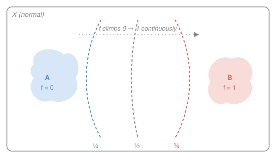

# Topology · Lesson 5.2: Normal spaces, Urysohn's lemma, and Tietze

> ⏱ ~15 min · Module 5: Separation, countability, and metrization · Builds on: [5.1 The separation axioms: Hausdorff and friends](05-01-separation-axioms-hausdorff.md), [4.3 Heine–Borel and maps on compact spaces](04-03-heine-borel-continuous-maps.md) · Unlocks: [5.3 Countability and separability](05-03-countability-separability.md)

## Why this matters

Lesson 5.1 taught a topology to tell two *points* apart with disjoint open sets. That is a modest skill. This lesson asks for something far stronger — pull two whole *closed sets* apart — and then collects the astonishing dividend: **Urysohn's lemma**, which says that a purely set-theoretic separation of closed sets secretly hands you an honest continuous real-valued function that is $0$ on one set and $1$ on the other. No metric, no formula — the separation axiom *manufactures* the function out of thin air. That function is the bridge from topology back to analysis: it is how you build partitions of unity, extend functions (Tietze), and prove that abstract spaces are secretly metric (metrization, [5.4](05-04-metrization.md)). Almost every space you actually meet — every metric space, every compact Hausdorff space — clears this bar, so the payoff is nearly universal.

## The idea

Climb one rung. In 5.1 you separated a point from a point. Now separate a point from a closed set that misses it (**regular**), and then separate two disjoint closed sets from each other (**normal**). Picture two ink blots on paper that don't touch: normality says you can inflate each into an open puddle around it without the puddles overlapping.

That sounds like bookkeeping. The shock is what it secretly contains. Suppose you *can* always do this. Then between blot $A$ and blot $B$ you can nest an infinite chain of open buffers — one at "altitude" $\tfrac12$, then $\tfrac14$ and $\tfrac34$, then eighths, and so on for every dyadic fraction — each buffer sitting strictly inside the next. Define a function by reading off, at each point, how high you had to climb before the buffers first swallowed it. That reading varies *continuously*, equals $0$ on $A$, and equals $1$ on $B$. A discrete, yes/no separation axiom, iterated densely, becomes a smooth-in-the-topological-sense real function. That is Urysohn's lemma, and it is one of the most surprising manufacturing processes in mathematics.

## The formal version

Throughout, $X$ is a topological space and all separation axioms below tacitly assume **$T_1$** (every singleton $\{x\}$ is closed — the standard convention, so that "point" and "closed set" arguments line up).

**Regular ($T_3$).** $X$ is regular if it is $T_1$ and: for every point $x$ and every closed set $C$ with $x\notin C$, there exist disjoint open sets $U,V$ with $x\in U$ and $C\subseteq V$.

> In words: a point and a closed set that misses it can be housed in non-overlapping open rooms.

**Normal ($T_4$).** $X$ is normal if it is $T_1$ and: for every pair of disjoint closed sets $A,B$ there exist disjoint open sets $U,V$ with $A\subseteq U$ and $B\subseteq V$.

> In words: any two disjoint closed sets can be housed in non-overlapping open rooms — the point of 5.1's Hausdorff axiom, promoted from points to whole closed sets.

The ladder is $T_2 \Leftarrow T_3 \Leftarrow T_4$ in strength of what gets separated (point/point, point/closed, closed/closed), each layer needing $T_1$ to make singletons closed so the lower cases are special cases.

**Two huge classes are normal.**

*Every metric space is normal.* Given disjoint closed $A,B$ in a metric space $(X,d)$, the distance-to-a-set function $d(x,A)=\inf_{a\in A} d(x,a)$ is continuous, and $d(x,A)=0$ exactly when $x\in\overline A = A$. So
$$U=\{x: d(x,A)<d(x,B)\}, \qquad V=\{x: d(x,B)<d(x,A)\}$$
are disjoint open sets containing $A$ and $B$ respectively.

> In words: put each point on the side of whichever closed set is nearer — the tie set is empty because no point is at distance $0$ from both.

*Every compact Hausdorff space is normal* — proved next.

**Urysohn's lemma.** $X$ (a $T_1$ space) is normal **if and only if**: for every pair of disjoint closed sets $A,B$ there is a continuous function $f:X\to[0,1]$ with $f\equiv 0$ on $A$ and $f\equiv 1$ on $B$.

> In words: normality is *exactly the same information* as being able to draw a continuous "altitude" function that reads $0$ on $A$, $1$ on $B$, and something in between everywhere else.

**Tietze extension theorem.** If $X$ is normal and $C\subseteq X$ is closed, then every continuous $g:C\to\mathbb{R}$ extends to a continuous $G:X\to\mathbb{R}$ with $G|_C=g$ (and one can keep the same bounds, e.g. into $[a,b]$).

> In words: on a normal space, a continuous function living on a closed piece can always be spread continuously over the whole space — the universal "you can always extend" tool. It follows from Urysohn's lemma.

## Picture

## Worked examples

**Example 1 (compact Hausdorff $\Rightarrow$ normal — the proof).** Let $X$ be compact Hausdorff and $A,B\subseteq X$ disjoint closed sets. We build disjoint open $U\supseteq A$, $V\supseteq B$ in two stages.

*Stage 1 — separate a point from a compact set.* Fix $b\in B$. For each $a\in A$, Hausdorffness (5.1) gives disjoint open $U_a\ni a$ and $W_a\ni b$. The family $\{U_a\}_{a\in A}$ covers $A$; since $A$ is a closed subset of a compact space it is **compact** (from [4.1](04-01-compactness-open-covers.md)), so finitely many suffice: $A\subseteq U_{a_1}\cup\dots\cup U_{a_n}=:U_b$. Set $W_b := W_{a_1}\cap\dots\cap W_{a_n}$, a *finite* intersection of open sets, hence open, containing $b$. By construction $U_b\cap W_b=\varnothing$: any point of $W_b$ lies in every $W_{a_i}$, so in no $U_{a_i}$. So $U_b\supseteq A$ and $W_b\ni b$ are disjoint open sets — a point $b$ cleanly separated from the whole compact set $A$.

*Stage 2 — separate the two compact sets.* Now run the identical finite-subcover trick one level up. As $b$ ranges over $B$ (also compact, being closed in compact $X$), the sets $\{W_b\}_{b\in B}$ cover $B$; take a finite subcover $B\subseteq W_{b_1}\cup\dots\cup W_{b_m}=:V$. Set $U:=U_{b_1}\cap\dots\cap U_{b_m}$, open and containing $A$. Then $U\cap V=\varnothing$: a point of $V$ lies in some $W_{b_j}$, which is disjoint from $U_{b_j}\supseteq U$. So $U\supseteq A$, $V\supseteq B$ are disjoint and open. $\blacksquare$

The engine is the same each time: cover the compact set by "good" open sets, keep finitely many, and intersect the matching neighborhoods so the finite intersection stays open. Compactness is precisely what makes an infinite pile of local separations collapse into one global one.

**Example 2 (why you'd care — Urysohn's construction idea).** Here is the *sketch* of the hard direction (normal $\Rightarrow$ a function exists); the converse is easy and done in P2.

Given disjoint closed $A,B$, index a dense chain of open buffers by the **dyadic rationals** $\mathbb{D}=\{k/2^n\}\cap(0,1)$. Start with $U_1 := X\setminus B$, an open set containing $A$. The key gadget is a normality restatement: *if $\overline{U}\subseteq W$ with $W$ open, then there is an open $Z$ with $\overline{U}\subseteq Z\subseteq \overline{Z}\subseteq W$* (apply normality to the disjoint closed sets $\overline U$ and $X\setminus W$). This lets you always slip a new buffer strictly between two old ones.

Use it to define, for each dyadic $q$, an open set $U_q$ so that
$$p<q \ \Longrightarrow\ \overline{U_p}\subseteq U_q,$$
with $A\subseteq U_q$ for all $q$ and $\overline{U_q}\subseteq X\setminus B$. (Build them in order of denominator: given $U_p$ and $U_r$ with $p<r$, insert $U_q$ for the midpoint $q=\tfrac{p+r}{2}$ using the gadget.) Then define
$$f(x) = \inf\{\, q\in\mathbb{D} : x\in U_q \,\}, \qquad f(x)=1 \text{ if } x\in\text{no } U_q.$$

> In words: $f(x)$ is the *lowest altitude at which the buffers first cover $x$*.

On $A$ every $U_q$ contains $x$, so the inf is $0$; on $B$ no $U_q$ contains $x$, so $f=1$. Continuity is the payoff of the *nesting* $\overline{U_p}\subseteq U_q$: because the buffers are packed densely with no jumps, the preimages $f^{-1}[0,a)=\bigcup_{q<a}U_q$ and $f^{-1}(a,1]=\bigcup_{q>a}(X\setminus\overline{U_q})$ are open, and sets of that form generate the topology of $[0,1]$ — so $f$ is continuous. That is the whole miracle: **densely iterated normality = one continuous function.**

## Watch out

- **Normal is about disjoint *closed sets*, not points.** Separating a point from a closed set is *regular*; separating point from point is Hausdorff. Don't say "normal separates points" — that undersells it, and $T_1$ is what silently upgrades the point cases into closed-set cases.
- **Normality is not inherited — unlike Hausdorff.** A subspace of a normal space need not be normal, and a *product* of two normal spaces need not be normal. The canonical villain is the **Sorgenfrey plane** (the square of the lower-limit line): each factor is perfectly normal, but the product fails normality on the anti-diagonal. You will meet this failure head-on in [5.3](05-03-countability-separability.md) and Boss problem 5. Contrast this with Hausdorff, compactness (closed subsets), and connectedness, which pass to subspaces or products cleanly — normality is the fragile one.
- **Urysohn gives values in $[0,1]$, exactly $0$ on $A$ and $1$ on $B$ — but not necessarily *only* there.** The function may also hit $0$ or $1$ off of $A$ and $B$; the lemma promises $f\equiv0$ on $A$ and $f\equiv1$ on $B$, not that $A=f^{-1}(0)$. (Guaranteeing equality is a strictly stronger property — "perfectly normal.")
- **"Normal" presupposes $T_1$ in most conventions.** Without it, the indiscrete two-point space is vacuously "normal" yet not even $T_0$. Insisting on $T_1$ (closed points) is what makes $T_4\Rightarrow T_3\Rightarrow T_2$ hold.

## One-liner

> Normality lets you pull disjoint closed sets apart with open sets — and Urysohn's lemma cashes that single axiom into a continuous $[0,1]$-valued function, the doorway from topology into analysis.

## Problems

**P1 (🟢)** Show directly that $\mathbb{R}$ with the standard topology is normal by exhibiting the separating function: given disjoint closed sets $A,B$, write down an explicit continuous $f:\mathbb{R}\to[0,1]$ with $f\equiv0$ on $A$, $f\equiv1$ on $B$, using distance functions. (This is Urysohn's lemma made concrete in the metric case.)

**P2 (🟡)** Prove the *easy* direction of Urysohn's lemma: if for every pair of disjoint closed sets $A,B$ there is a continuous $f:X\to[0,1]$ with $f\equiv0$ on $A$ and $f\equiv1$ on $B$, then $X$ is normal. (Hint: what do the preimages of $[0,\tfrac12)$ and $(\tfrac12,1]$ give you?)

**P3 (🔴, optional)** Use Urysohn's lemma to prove the simplest case of Tietze: let $X$ be normal, $C\subseteq X$ closed, and $g:C\to[-1,1]$ continuous. Produce a continuous $h:X\to[-\tfrac13,\tfrac13]$ with $|g(x)-h(x)|\le\tfrac23$ for all $x\in C$. (This one "correction step," iterated and summed, is the entire Tietze proof — you're building its first term.)

Solutions

**P1** For a nonempty set $S$, $d(x,S)=\inf_{s\in S}|x-s|$ is continuous and vanishes exactly on $\overline S=S$ (as $S$ is closed). Since $A,B$ are disjoint and closed, $d(x,A)+d(x,B)>0$ for every $x$ (both terms vanish only on $A$ and $B$ respectively, which are disjoint), so
$$f(x)=\frac{d(x,A)}{d(x,A)+d(x,B)}$$
is well-defined and continuous (quotient of continuous functions, denominator never $0$). It takes values in $[0,1]$; on $A$ the numerator is $0$ so $f=0$; on $B$ we have $d(x,B)=0$ so $f=\dfrac{d(x,A)}{d(x,A)}=1$. Done — and note this is exactly the metric-normality argument with the two open sets replaced by one function, which is Urysohn's lemma in miniature. (If $A$ or $B$ is empty, take $f\equiv1$ or $f\equiv0$.)

**P2** Suppose such an $f$ exists for disjoint closed $A,B$; produce disjoint open sets. Let
$$U=f^{-1}\!\left(\left[0,\tfrac12\right)\right), \qquad V=f^{-1}\!\left(\left(\tfrac12,1\right]\right).$$
Both are open as preimages of (relatively) open subsets of $[0,1]$ under the continuous $f$. They are disjoint because $[0,\tfrac12)\cap(\tfrac12,1]=\varnothing$. Since $f\equiv0$ on $A$, $A\subseteq U$; since $f\equiv1$ on $B$, $B\subseteq V$. So $A,B$ are separated by disjoint open sets, i.e. $X$ is normal. (This direction needs no dyadic chain — the function does all the work, which is why it's the trivial half.)

**P3** Split the (closed, disjoint) sets where $g$ is most negative and most positive:
$$A=g^{-1}\!\left(\left[-1,-\tfrac13\right]\right), \qquad B=g^{-1}\!\left(\left[\tfrac13,1\right]\right).$$
These are closed in $C$ (preimages of closed sets under continuous $g$), and $C$ is closed in $X$, so $A,B$ are closed in $X$; they are disjoint since $[-1,-\tfrac13]$ and $[\tfrac13,1]$ are. By Urysohn's lemma there is a continuous $\varphi:X\to[0,1]$ with $\varphi\equiv0$ on $A$, $\varphi\equiv1$ on $B$. Set
$$h=\tfrac23\varphi-\tfrac13 : X\to\left[-\tfrac13,\tfrac13\right],$$
so $h\equiv-\tfrac13$ on $A$ and $h\equiv\tfrac13$ on $B$. Check $|g-h|\le\tfrac23$ on $C$ by cases:
- On $A$: $g\in[-1,-\tfrac13]$ and $h=-\tfrac13$, so $g-h\in[-\tfrac23,0]$.
- On $B$: $g\in[\tfrac13,1]$ and $h=\tfrac13$, so $g-h\in[0,\tfrac23]$.
- On the middle $C\setminus(A\cup B)$: $g\in(-\tfrac13,\tfrac13)$ and $h\in[-\tfrac13,\tfrac13]$, so $|g-h|<\tfrac23$.

In every case $|g(x)-h(x)|\le\tfrac23$. Iterating this with $g\mapsto \tfrac32(g-h)$ rescaled and summing the resulting geometric series ($\sum \tfrac13(\tfrac23)^n$) produces the full extension $G$ on $X$ — that is Tietze. $\blacksquare$

## Flashback

**From Lesson 5.1 (Hausdorff and the separation ladder):** Consider $X=\{a,b,c\}$ with topology $\tau=\{\varnothing,\{a\},\{a,b\},\{a,c\},X\}$. (a) Where does $X$ sit on the $T_0/T_1/T_2$ ladder? (b) Exhibit a sequence (constant is fine) whose limit is *not* unique, and name the exact axiom whose failure allows it.

Solution

(a) **$T_0$ but not $T_1$.** *$T_0$:* any two points are told apart by some open set — $a$ vs $b$: $\{a\}$ contains $a$ not $b$; $a$ vs $c$: $\{a\}$ again; $b$ vs $c$: $\{a,b\}$ contains $b$ not $c$. Every pair is distinguished, so $T_0$ holds. *Not $T_1$:* $T_1$ requires every singleton to be closed. The closed sets (complements of the open ones) are $X,\{b,c\},\{c\},\{b\},\varnothing$; so $\{b\}$ and $\{c\}$ are closed, but $\{a\}$ is **not**, since $X\setminus\{a\}=\{b,c\}\notin\tau$. One non-closed singleton is enough to fail $T_1$, and failing $T_1$ forces failing $T_2$.

(b) Take the constant sequence $x_n=a$ for all $n$. It converges to $a$ (trivially). But it *also* converges to $b$: every open set containing $b$ is one of $\{a,b\}$ or $X$, and both contain $a=x_n$ for all $n$, so $x_n$ is eventually (indeed always) in every neighborhood of $b$. Likewise $x_n\to c$. The limit is not unique. The failed axiom is **Hausdorff ($T_2$)**: uniqueness of limits is exactly what $T_2$ buys (5.1), because in a Hausdorff space you could separate two candidate limits by disjoint open sets, and the tail cannot sit in both. $\blacksquare$

## Connections

- **Backward:** this is [5.1](05-01-separation-axioms-hausdorff.md)'s separation ladder, climbed two rungs — from point/point (Hausdorff) to point/closed (regular) to closed/closed (normal). The compact-Hausdorff proof reuses the finite-subcover engine from [4.1](04-01-compactness-open-covers.md) and the "closed-in-compact is compact" fact from [4.3](04-03-heine-borel-continuous-maps.md).
- **Forward:** Urysohn's lemma is the hinge of the **Urysohn metrization theorem** in [5.4](05-04-metrization.md) — the separating functions become coordinates that embed the space into a metric cube. Tietze underwrites partitions of unity, which you'll want the moment you glue local constructions (and again in differential-geometry flavored parts of `relativity`). The non-inheritance of normality is the trap that [5.3](05-03-countability-separability.md) and Boss 5 spring via the Sorgenfrey plane.
- **Sideways:** the distance-function proof that metric spaces are normal is the same $d(x,A)/(d(x,A)+d(x,B))$ partition-of-unity trick used in `real-analysis` to build bump functions, and its continuous-extension payoff (Tietze) is the topological ancestor of the Hahn–Banach extension theorem you'll meet in functional analysis — both say "a function defined on a sub-object extends to the whole, controlled."
