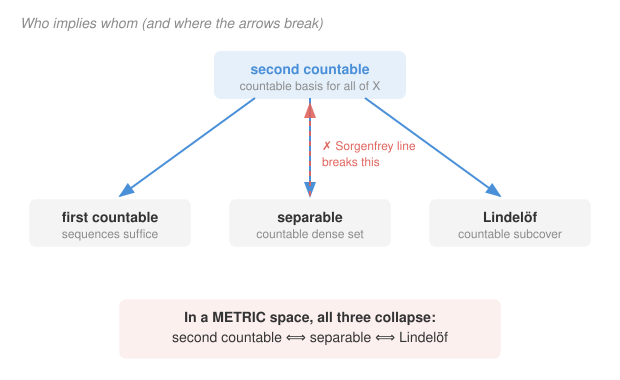

# Topology · Lesson 5.3: Countability and separability

> ⏱ ~15 min · Module 5: Separation, countability, and metrization · Builds on: [1.4](01-04-bases-and-subbases.md), [5.1](05-01-separation-axioms-hausdorff.md) · Unlocks: [5.4](05-04-metrization.md)

## Why this matters

In `real-analysis` you tested closure and continuity with *sequences* — $x_n\to x$, done. That habit works on $\mathbb{R}$ but can quietly fail in a general topological space, and the reason is a size question: how much of the space can a *countable* amount of data see? The four axioms in this lesson — first countable, second countable, separable, Lindelöf — are exactly the dials that control "is countable data enough?" They decide when sequences still suffice, when a countable dense set pins down the whole space, and (next lesson) when a topology secretly comes from a metric at all. They are also where the beautifully-behaved metric world and the wild general world visibly part.

## The idea

Think of a topology as a *vocabulary* for describing nearness. Some spaces need an enormous vocabulary; some get by with a tiny one. These axioms all ask a version of "can you get away with a countable vocabulary?"

- **First countable:** *at each point*, a countable stock of shrinking neighborhoods already captures every notion of "close to this point." This is the local budget — and it's precisely what makes sequences enough.
- **Second countable:** *globally*, a single countable list of open sets generates the entire topology. The whole vocabulary is countable.
- **Separable:** a countable set of points is sprinkled so thickly that every open set contains one — like $\mathbb{Q}$ inside $\mathbb{R}$. You can approximate every point with a countable "address book."
- **Lindelöf:** every open cover can be trimmed down to a countable subcover. A countable-scale weakening of compactness.

On $\mathbb{R}^n$ all four hold and reinforce each other, so you never feel the difference. The point of this lesson is to separate them, see which forces which, and meet the one space — the Sorgenfrey line — where they come apart.

## The formal version

Throughout, $X$ is a topological space. A **neighborhood basis at $x$** is a collection $\mathcal{B}_x$ of open sets each containing $x$, such that every open set $U\ni x$ contains some $B\in\mathcal{B}_x$.

**First countable.** $X$ is *first countable* if every point $x$ has a **countable** neighborhood basis.

> In words: at each point you can find a countable nested sequence of shrinking neighborhoods that already detects everything.

**Second countable.** $X$ is *second countable* if the whole topology has a **countable basis** $\mathcal{B}$ (basis in the sense of [1.4](01-04-bases-and-subbases.md): every open set is a union of members of $\mathcal{B}$).

> In words: one countable list of open building blocks generates every open set in the space.

**Separable.** $X$ is *separable* if it has a **countable dense** subset $D$ — a countable $D$ with $\overline{D}=X$, equivalently every nonempty open set meets $D$.

> In words: countably many points sit close enough to everything that no open set can avoid them all.

**Lindelöf.** $X$ is *Lindelöf* if every open cover of $X$ has a **countable** subcover.

> In words: no matter how you blanket the space with open sets, countably many of them already suffice.

**Theorem (second countable is the strongest).** If $X$ is second countable, then it is (a) first countable, (b) separable, and (c) Lindelöf.

*Proof.* Fix a countable basis $\mathcal{B}=\{B_1,B_2,\dots\}$.

*(a)* For a point $x$, the sub-collection $\mathcal{B}_x=\{B_n: x\in B_n\}$ is countable, and it is a neighborhood basis at $x$: any open $U\ni x$ is a union of basis elements, so one of them, some $B_n$, satisfies $x\in B_n\subseteq U$. Hence first countable. $\checkmark$

*(b)* From each nonempty $B_n$ pick one point $d_n\in B_n$ (choice over a countable index set). Let $D=\{d_1,d_2,\dots\}$, countable. Any nonempty open $U$ contains some $B_n\neq\varnothing$, hence contains $d_n\in D$. So $D$ meets every nonempty open set: $\overline{D}=X$. Separable. $\checkmark$

*(c)* Let $\mathcal{U}$ be an open cover. For each basis element $B_n$ that lies inside *some* member of $\mathcal{U}$, choose one such member $U_n\in\mathcal{U}$ with $B_n\subseteq U_n$. The chosen $U_n$ form a countable sub-collection of $\mathcal{U}$; they cover $X$ because every $x\in X$ lies in some $U\in\mathcal{U}$, and (basis) in some $B_n\subseteq U$, so $x\in B_n\subseteq U_n$. Countable subcover. $\blacksquare$

**Theorem (first countable ⟹ sequences suffice).** If $X$ is first countable and $A\subseteq X$, then $x\in\overline{A}$ **iff** there is a sequence $(a_n)$ in $A$ with $a_n\to x$.

*Proof.* ($\Leftarrow$) holds in *any* space: if $a_n\to x$ with $a_n\in A$, every open $U\ni x$ eventually contains some $a_n\in A$, so $U\cap A\neq\varnothing$ and $x\in\overline{A}$.

($\Rightarrow$) is where first countability earns its keep. Let $\{U_1,U_2,\dots\}$ be a countable neighborhood basis at $x$, and replace it by the *nested* sequence $V_n=U_1\cap\cdots\cap U_n$ (still open, still a neighborhood basis, and $V_1\supseteq V_2\supseteq\cdots$). Since $x\in\overline{A}$, each $V_n$ meets $A$; pick $a_n\in V_n\cap A$. Given any open $U\ni x$, some $V_N\subseteq U$, and by nesting $a_n\in V_n\subseteq V_N\subseteq U$ for all $n\ge N$. So $a_n\to x$. $\blacksquare$

> In words: with only countably many neighborhoods to satisfy, you can nest them and diagonalize out a single convergent sequence. Without first countability a point can be in $\overline{A}$ with *no* sequence from $A$ reaching it — you then need **nets** (sequences indexed by an arbitrary directed set instead of $\mathbb{N}$) to test closure. Nets restore the "iff" in full generality; first countability is exactly the condition that lets plain sequences do the job.

## Picture

## Worked examples

**Example 1 (mechanical — $\mathbb{R}^n$ is second countable).** Take the collection of open balls with **rational center and rational radius**: $\mathcal{B}=\{B(q,r): q\in\mathbb{Q}^n,\ r\in\mathbb{Q}_{>0}\}$. This is a countable set (a countable product/union of countable sets — the engine from `real-analysis`). It's a basis: given any open $U$ and $x\in U$, there's a ball $B(x,\varepsilon)\subseteq U$; choose a rational point $q$ with $\|q-x\|<\varepsilon/3$ and a rational radius $r$ with $\|q-x\|<r<2\varepsilon/3$, and then $x\in B(q,r)\subseteq B(x,\varepsilon)\subseteq U$. So $\mathbb{R}^n$ is second countable — and therefore, for free, first countable, separable, and Lindelöf. The separable witness the theorem hands us is $\mathbb{Q}^n$: **$\mathbb{Q}$ is dense in $\mathbb{R}$** (the density fact from `real-analysis`), so $\mathbb{Q}^n$ is a countable dense subset of $\mathbb{R}^n$.

**Example 2 (why you'd care — the metric collapse).** In a general space the four axioms are genuinely different (Example below), but in a **metric space** they line up:

$$\text{second countable}\iff\text{separable}\iff\text{Lindelöf}.$$

One direction is the Theorem above. For the reverse, suppose a metric space $X$ has a countable dense set $D=\{d_1,d_2,\dots\}$. Claim: the balls $\{B(d_i,1/k): i,k\in\mathbb{N}\}$ — countably many — form a basis. Given open $U$ and $x\in U$, pick $k$ with $B(x,2/k)\subseteq U$, then by density a $d_i$ with $d(x,d_i)<1/k$; then $x\in B(d_i,1/k)$, and any $y\in B(d_i,1/k)$ has $d(x,y)<2/k$, so $B(d_i,1/k)\subseteq U$. Countable basis ⟹ second countable, closing the loop (separable ⟹ second countable ⟹ Lindelöf ⟹ …). **This is the whole reason $\mathbb{R}^n$-style intuition feels seamless: a metric silently fuses the four axioms into one.** The moment you leave metric spaces, they can shatter — as the next example shows.

**The separating example — the Sorgenfrey line $\mathbb{R}_\ell$.** This is $\mathbb{R}$ with the **lower-limit topology** from [1.4](01-04-bases-and-subbases.md): basis of half-open intervals $[a,b)$. It is:

- **Separable.** $\mathbb{Q}$ is still dense: every basic open $[a,b)$ contains a rational. Countable dense set. $\checkmark$
- **First countable.** At $x$, the countable family $\{[x,x+\tfrac1n): n\in\mathbb{N}\}$ is a neighborhood basis. $\checkmark$
- **NOT second countable.** Suppose $\mathcal{B}$ is *any* basis. For each real $x$, the open set $[x,x+1)$ contains $x$, so some $B_x\in\mathcal{B}$ has $x\in B_x\subseteq[x,x+1)$. Then $\inf B_x = x$ — the left endpoint of $B_x$ is $x$ itself. So $x\mapsto B_x$ is injective: distinct reals force distinct basis elements. Hence $|\mathcal{B}|\ge|\mathbb{R}|$ is **uncountable**. No countable basis exists. $\blacksquare$
- **Lindelöf.** (True, and less obvious — a short least-upper-bound argument shows every cover by half-open intervals reduces to a countable subcover.)

So $\mathbb{R}_\ell$ is separable + first countable + Lindelöf but **not** second countable: definitive proof that **separable does not imply second countable** in general. (In a metric space this is impossible — which re-proves that $\mathbb{R}_\ell$ is *not metrizable*, a headline for [5.4](05-04-metrization.md).)

**The product blow-up — the Sorgenfrey plane $\mathbb{R}_\ell\times\mathbb{R}_\ell$.** Give the product the product topology. It is still **separable** ($\mathbb{Q}\times\mathbb{Q}$ is dense — separability survives products here). But it is **not Lindelöf** and **not normal**. The anti-diagonal $L=\{(x,-x):x\in\mathbb{R}\}$ is a *closed, discrete* subspace of size $|\mathbb{R}|$: each point $(x,-x)$ is isolated by the basic open box $[x,x+1)\times[-x,-x+1)$, which meets $L$ only at $(x,-x)$. An uncountable closed discrete set can't be covered countably (each point needs its own set) ⟹ **not Lindelöf**; and one then shows the two closed sets $\{x\in L: x\in\mathbb{Q}\}$ and $\{x\in L: x\notin\mathbb{Q}\}$ can't be housed in disjoint open sets ⟹ **not normal**. This is the canonical demonstration that **separability, normality, and Lindelöf-ness all fail to pass to products** — the payoff behind Boss problem 5.

## Watch out

- You might think separable ⟹ second countable because it's true on $\mathbb{R}$ — but that equivalence is a **metric-space privilege**. The Sorgenfrey line is separable and *not* second countable. Only inside a metric do the two coincide.
- You might think sequences always test closure and continuity — but that needs **first countability**. In a non-first-countable space, a point can be a limit point of $A$ with no sequence from $A$ converging to it; you must upgrade sequences to **nets**. First countable is precisely the license to keep using ordinary sequences.
- You might think good properties survive subspaces and products — but Lindelöf, normal, and separable can all break. The Sorgenfrey plane (product of a Lindelöf, normal, separable line) is not Lindelöf and not normal. (Bonus fact worth banking, proved in [5.2](05-02-normal-spaces-urysohn.md)'s orbit: **Lindelöf + regular ⟹ normal** — so on a regular space, Lindelöf-ness *buys* you normality.)

## One-liner

> These axioms all ask "is countable data enough?" — second countable is the strong one that forces the other three, first countable is what lets sequences replace nets, and in a metric space second-countable/separable/Lindelöf collapse into one, while the Sorgenfrey line is the specimen where they don't.

## Problems

**P1 (🟢)** Prove that second countability passes to subspaces: if $X$ is second countable and $Y\subseteq X$ has the subspace topology, then $Y$ is second countable. (Contrast: separability does *not* always pass to subspaces — that's the Sorgenfrey plane's trick.)

**P2 (🟡)** Show the discrete topology on an **uncountable** set $X$ (every subset open) is first countable but neither second countable nor separable. Which of the four axioms does it satisfy, and which fail?

**P3 (🔴, optional)** Prove that a **countable** topological space is automatically both separable and Lindelöf, regardless of the topology. Then give a one-line reason a countable space need *not* be second countable. (Hint for the last part: how many topologies could a 2-point... no — think about how large a basis a countable space might still require, e.g. a countable subspace where every singleton needs a distinct basis element.)

Solutions

**P1** Let $\mathcal{B}=\{B_1,B_2,\dots\}$ be a countable basis for $X$. The subspace topology on $Y$ has, by definition, the sets $B_n\cap Y$ among its opens, and these form a basis for $Y$: if $V$ is open in $Y$ then $V=U\cap Y$ for some $U$ open in $X$, and writing $U=\bigcup_{n\in S}B_n$ gives $V=\bigcup_{n\in S}(B_n\cap Y)$. So $\{B_n\cap Y: n\in\mathbb{N}\}$ is a **countable** basis for $Y$. Hence $Y$ is second countable. (The key asymmetry: second countability is *inherited* from a countable basis, which restricts cleanly; separability's countable dense set can miss a subspace entirely — a discrete subspace like the Sorgenfrey plane's anti-diagonal picks up none of $\mathbb{Q}\times\mathbb{Q}$.)

**P2** Let $\tau$ be discrete on uncountable $X$.

- **First countable:** yes. At each $x$, the singleton $\{x\}$ is open, so $\mathcal{B}_x=\{\{x\}\}$ (one set!) is a neighborhood basis — any open $U\ni x$ contains $\{x\}$. Countable (finite, even). $\checkmark$
- **Second countable:** no. Every singleton $\{x\}$ is open and cannot be written as a union of *other* basic sets unless $\{x\}$ itself is basic — so any basis must contain every singleton $\{x\}$. That's $|X|$ many, uncountable. $\times$
- **Separable:** no. A dense set must meet every nonempty open set; but $\{x\}$ is open, so a dense set must contain *every* $x$ — the only dense set is $X$ itself, which is uncountable. No countable dense set. $\times$
- **Lindelöf:** no (bonus). The cover $\{\{x\}: x\in X\}$ by singletons has no proper subcover at all, let alone a countable one. $\times$

So discrete-on-uncountable satisfies **only** first countability — a clean illustration that first countable is much weaker than the other three, and that second countable really is strictly stronger than first.

**P3** Let $X$ be countable with any topology $\tau$.

- **Separable:** $X$ itself is a countable dense subset ($\overline{X}=X$ trivially). So every countable space is separable. $\checkmark$
- **Lindelöf:** given any open cover $\mathcal{U}$, for each of the countably many points $x\in X$ pick one $U_x\in\mathcal{U}$ containing it. The collection $\{U_x: x\in X\}$ is a subcover indexed by a countable set, hence countable, and it covers $X$. So every open cover has a countable subcover. $\checkmark$

*Why not automatically second countable:* second countability is a statement about the **topology's size**, not the point-count, and it *implies* first countability (Theorem). So any countable space that fails to be first countable also fails to be second countable — and such spaces exist (the Arens–Fort space is a countable Hausdorff space in which one point has no countable neighborhood basis). Clean takeaway: **separable and Lindelöf follow from mere countability of points, but second countable can still fail.** (Contrast Example 2: a *metric* on a countable space would force all three to coincide — but a general countable space carries no metric to enforce that collapse.)

## Flashback

**From Lesson 5.1 (Separation axioms — the $T_0/T_1/T_2$ ladder):** Consider $X=\{a,b,c\}$ with topology $\tau=\{\varnothing,\ \{a\},\ \{a,b\},\ \{a,c\},\ X\}$. Place $X$ on the $T_0$–$T_1$–$T_2$ ladder: is it $T_0$? $T_1$? Hausdorff? Justify each verdict from the definitions.

Solution

**$T_0$ (points topologically distinguishable):** yes. For each pair we need an open set containing one but not the other. $a$ vs $b$: $\{a\}$ contains $a$, not $b$. $a$ vs $c$: $\{a\}$ contains $a$, not $c$. $b$ vs $c$: $\{a,b\}$ contains $b$, not $c$. Every pair is separated by *some* open set, so $T_0$. $\checkmark$

**$T_1$ (every singleton closed, equiv. each of two points has an open set missing the other):** no. Test $b$ and $a$: we'd need an open set containing $b$ but not $a$. The open sets containing $b$ are $\{a,b\}$ and $X$ — both contain $a$. So no open neighborhood of $b$ excludes $a$; equivalently $\{a\}$ is not closed (its complement $\{b,c\}$ is not open). Fails $T_1$. $\times$

**Hausdorff ($T_2$):** no — $T_2\Rightarrow T_1$, and $T_1$ already fails, so Hausdorff is out. (Concretely, $b$ and $c$ have no disjoint neighborhoods: every open set containing $b$ or $c$ also contains $a$, so any two such sets share $a$.)

Verdict: $T_0$ but not $T_1$, hence not $T_2$ — it sits on the bottom rung. This is why, in [5.1](05-01-separation-axioms-hausdorff.md), uniqueness of limits needed the full strength of Hausdorff: here a sequence could converge to several points at once. $\blacksquare$

## Connections

- **Backward:** the "basis" and "half-open interval" machinery is straight from [1.4](01-04-bases-and-subbases.md); the Sorgenfrey line is that lesson's lower-limit topology, now weaponized. The countable-union-of-countable-sets counting behind Example 1 is `real-analysis`'s, and the density of $\mathbb{Q}$ it invokes is the same one that made $\mathbb{Q}$ countable-yet-dense there.
- **Forward:** [5.4](05-04-metrization.md) (metrization) is the direct payoff — the Urysohn metrization theorem says a second-countable regular Hausdorff space *is* metrizable, so second countability is one of the exact ingredients that manufactures a metric. The metric collapse of Example 2 is the reason "second countable" appears in that hypothesis rather than "separable."
- **Sideways:** the sequences-vs-nets split here is the same one that will make **sequential compactness** and **compactness** agree on metric spaces but diverge in general (Module 4's `topology` material and `real-analysis`'s Bolzano–Weierstrass); first countability is the shared reason sequences are enough in both stories.
