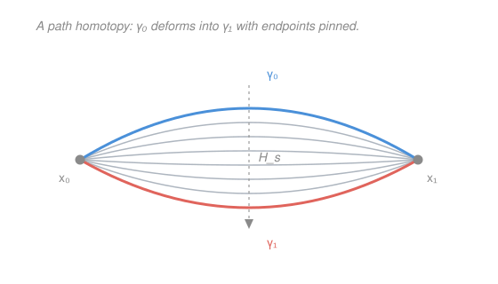

# Topology · Lesson 6.1: Homotopy and path homotopy

> ⏱ ~15 min · Module 6: A first taste of algebraic topology · Builds on: [2.1 Continuous functions and homeomorphisms](02-01-continuity-and-homeomorphisms.md), [3.2 Path-connectedness and components](03-02-path-connectedness-components.md) · Unlocks: [6.2 The fundamental group](06-02-the-fundamental-group.md)

## Why this matters

For five modules we told spaces apart by *point-set* invariants — connected or not, compact or not, Hausdorff or not. Those are blunt: they can't see the difference between a disk and an annulus (both connected, both compact). Module 6 attaches an **algebraic** fingerprint instead — a group — and algebra is sharp enough to prove a disk has no hole and an annulus has one, and from there to nail down fixed-point theorems and even the Fundamental Theorem of Algebra. Every bit of that machinery rests on one deceptively soft idea introduced here: two things are "the same" if one can be *continuously deformed* into the other. Coarse enough to compute with, fine enough to still detect a hole.

## The idea

Imagine two hiking trails between the same trailhead and the same summit. If you can slide one trail across the mountainside until it lies on top of the other — sweeping through a whole family of intermediate trails, never lifting off the ground, keeping both ends nailed down — then for our purposes the two trails are *the same*. If a lake sits between them, you can't: any sweep would have to cross water (leave the space), so the trails are genuinely different. That obstruction — the hole you can't sweep across — is exactly what the fundamental group will count.

Strip away the mountain and you get the whole subject. A **homotopy** is that continuous sweep: not a single deformed object but the entire movie of the deformation, one frame per instant $s\in[0,1]$. Two maps are **homotopic** if such a movie connects them. When the objects are *paths* and we insist the endpoints stay pinned for the entire movie, we get **path homotopy** — the exact relation the fundamental group is built from in [6.2](06-02-the-fundamental-group.md).

## The formal version

Throughout, $X,Y$ are topological spaces and $I=[0,1]$ with its usual topology.

**Homotopy of maps.** Continuous maps $f,g:X\to Y$ are **homotopic**, written $f\simeq g$, if there is a continuous map
$$H:X\times I\to Y \qquad\text{with}\qquad H(x,0)=f(x),\quad H(x,1)=g(x)\ \text{ for all } x\in X.$$
$H$ is a **homotopy** from $f$ to $g$. Writing $H_s(x)=H(x,s)$, each $H_s:X\to Y$ is a map, $H_0=f$, $H_1=g$.

> In words: $H$ is a movie whose frame at time $s$ is the map $H_s$; the film starts on $f$, ends on $g$, and — because $H$ is continuous in $(x,s)$ *jointly* — the frames morph smoothly with no jump cuts.

**Path homotopy.** Let $\gamma_0,\gamma_1:I\to X$ be paths with the **same endpoints**: $\gamma_0(0)=\gamma_1(0)=x_0$ and $\gamma_0(1)=\gamma_1(1)=x_1$. They are **path-homotopic**, written $\gamma_0\simeq_p\gamma_1$, if there is a continuous $H:I\times I\to X$ with
$$H(t,0)=\gamma_0(t),\quad H(t,1)=\gamma_1(t)\ \ (\text{ends of the movie}),$$
$$H(0,s)=x_0,\quad H(1,s)=x_1\ \ \text{for all } s\ \ (\textbf{endpoints pinned every frame}).$$

> In words: same movie as before, but now every single frame $H_s$ is itself a path from $x_0$ to $x_1$ — the two ends never move while the middle wiggles.

**Homotopy equivalence of spaces.** $X$ and $Y$ are **homotopy equivalent**, written $X\simeq Y$, if there exist continuous maps $f:X\to Y$ and $g:Y\to X$ with
$$g\circ f\simeq \mathrm{id}_X \qquad\text{and}\qquad f\circ g\simeq \mathrm{id}_Y.$$

> In words: $f$ and $g$ are *almost* inverse — not equal to the identities on the nose (that would be homeomorphism, [2.1](02-01-continuity-and-homeomorphisms.md)), but deformable into them. A space homotopy equivalent to a single point is **contractible**.

**Theorem (homotopy is an equivalence relation on maps $X\to Y$).**

*Reflexive.* $f\simeq f$ via the constant movie $H(x,s)=f(x)$ — continuous (it ignores $s$), $H_0=H_1=f$.

*Symmetric.* If $H$ is a homotopy $f\simeq g$, run the film backward: $\bar H(x,s)=H(x,1-s)$ is continuous (composition of $H$ with the continuous map $(x,s)\mapsto(x,1-s)$), and $\bar H_0=g$, $\bar H_1=f$. So $g\simeq f$.

*Transitive.* Let $H$ give $f\simeq g$ and $K$ give $g\simeq h$. Splice the two films, each run at double speed:
$$L(x,s)=\begin{cases} H(x,2s), & 0\le s\le \tfrac12,\\[2pt] K(x,2s-1), & \tfrac12\le s\le 1.\end{cases}$$
On the overlap $s=\tfrac12$ both pieces read $H(x,1)=g(x)=K(x,0)$, so they agree. The two closed sets $X\times[0,\tfrac12]$ and $X\times[\tfrac12,1]$ cover $X\times I$, and $L$ is continuous on each; by the **pasting lemma** (a map continuous on each of two closed sets that agree on their overlap is continuous on the union) $L$ is continuous. And $L_0=f$, $L_1=h$, so $f\simeq h$. $\blacksquare$

The identical three constructions — reversal, double-speed splice — prove $\simeq_p$ is an equivalence relation on paths with fixed endpoints; the pins $H(0,s)=x_0,\,H(1,s)=x_1$ survive every step because reversing and splicing never touch $t=0$ or $t=1$.

## Picture

## Worked examples

**Example 1 (mechanical — the straight-line homotopy in a convex set).** Let $C\subseteq\mathbb{R}^n$ be **convex**: for any $a,b\in C$ the segment $(1-s)a+sb$ lies in $C$ for all $s\in I$. Claim: *any* two paths $\gamma_0,\gamma_1:I\to C$ with the same endpoints $x_0,x_1$ are path-homotopic. Define the **straight-line homotopy**
$$H(t,s)=(1-s)\,\gamma_0(t)+s\,\gamma_1(t).$$
Check the four requirements.
- *Lands in $C$:* for each fixed $t$, $H(t,s)$ is the segment from $\gamma_0(t)$ to $\gamma_1(t)$, two points of $C$; convexity keeps it in $C$.
- *Continuous:* it's built from $\gamma_0,\gamma_1$ (continuous) by the continuous operations of scaling and adding — continuous jointly in $(t,s)$.
- *Right ends:* $H(t,0)=\gamma_0(t)$ and $H(t,1)=\gamma_1(t)$. ✓
- *Endpoints pinned:* $H(0,s)=(1-s)x_0+s x_0=x_0$ and $H(1,s)=(1-s)x_1+s x_1=x_1$ for all $s$, because $\gamma_0,\gamma_1$ share those endpoints — the two terms fuse. ✓

So $\gamma_0\simeq_p\gamma_1$. In a convex set every path is interchangeable with every other of the same endpoints: there are no holes to obstruct the sweep.

**Example 2 (why you'd care — the annulus is a circle, homotopically).** Homeomorphism can't relate the punctured plane $\mathbb{R}^2\setminus\{0\}$ to the circle $S^1$ — one is 2-dimensional and non-compact, the other 1-dimensional and compact, so no homeomorphism exists. Yet they're **homotopy equivalent**. Let $g:S^1\hookrightarrow \mathbb{R}^2\setminus\{0\}$ be the inclusion and $f:\mathbb{R}^2\setminus\{0\}\to S^1$, $f(x)=x/\lVert x\rVert$, the radial projection.
- $f\circ g=\mathrm{id}_{S^1}$ exactly (a unit vector normalizes to itself), so certainly $f\circ g\simeq\mathrm{id}_{S^1}$.
- $g\circ f$ sends $x\mapsto x/\lVert x\rVert$, viewed inside the punctured plane. Slide each point radially back to where it started:
$$H(x,s)=(1-s)\,\frac{x}{\lVert x\rVert}+s\,x.$$
This is continuous, $H_0=g\circ f$, $H_1=\mathrm{id}$, and it never hits $0$: for each $x\neq 0$ both $x/\lVert x\rVert$ and $x$ point the *same* direction, so every convex combination is a positive multiple of $x$, hence nonzero. Thus $g\circ f\simeq\mathrm{id}_{\mathbb{R}^2\setminus\{0\}}$.

So $\mathbb{R}^2\setminus\{0\}\simeq S^1$. The sweep above is a **deformation retract**: the whole punctured plane collapses onto its core circle without tearing. This is why $\pi_1$ will report the *same* group for both — the annulus (an $\mathbb{R}^2\setminus\{0\}$ in disguise) and the circle share the one hole that matters. Contrast the solid disk $D^2$, which is convex, hence contractible ($H(x,s)=(1-s)x$ retracts it to the origin): $D^2\simeq \text{point}$, so it has *no* hole — and that gap between "disk" and "annulus" is the whole payoff of the module.

## Watch out

- **You might think** homotopy of *maps* and *path* homotopy are the same relation. **Actually** path homotopy carries an extra clause: the endpoints are pinned in *every* frame ($H(0,s)=x_0,\,H(1,s)=x_1$ for all $s$). Drop the pins and any two paths into a path-connected space become homotopic-as-maps — useless. The pins are the whole point; they're what let a loop "feel" a hole.
- **You might think** homotopy equivalence is just homeomorphism by another name. **Actually** it's strictly *weaker*: the solid disk is homotopy equivalent to a single point but obviously not homeomorphic to one (a point has no room), and $\mathbb{R}^2\setminus\{0\}\simeq S^1$ despite differing in dimension. Homeomorphism $\Rightarrow$ homotopy equivalence, never the reverse. The looseness is a feature — it's what makes $\pi_1$ *computable*.
- **You might think** it's enough for each frame $H_s$ to be continuous and for the frames to "vary continuously." **Actually** the definition demands $H$ be continuous **jointly** in $(t,s)$ as a map on the product $I\times I$ — a strictly stronger condition than continuity in each variable separately. A movie whose every frame is sharp but which jump-cuts between frames is not a homotopy.

## One-liner

> A homotopy is the whole movie of a continuous deformation; pin the endpoints of a path through every frame and you get path homotopy — soft enough to compute with, yet still able to tell a disk from an annulus.

## Problems

**P1 (🟢)** Let $Y=\mathbb{R}^2$ (convex). Take the paths $\gamma_0(t)=(t,0)$ and $\gamma_1(t)=(t,\,t(1-t))$ from $x_0=(0,0)$ to $x_1=(1,0)$ — a straight chord and an arch over it. Write down an explicit path homotopy $\gamma_0\simeq_p\gamma_1$ and verify all four conditions (ends, pins, continuity, stays in $Y$).

**P2 (🟡)** Show that "$f\simeq g$" respects composition: if $f_0\simeq f_1$ as maps $X\to Y$ and $h:Y\to Z$ is continuous, then $h\circ f_0\simeq h\circ f_1$. (This is the seed of the *functoriality* of $\pi_1$ later in Module 6 — post-composing a homotopy still gives a homotopy.)

**P3 (🔴, optional)** Prove that **contractibility is a homotopy invariant of the ambient behavior of loops**, in this concrete form: if $X$ is contractible, then any two paths $\gamma_0,\gamma_1:I\to X$ with the same endpoints are path-homotopic. (Hint: contractible gives a homotopy $H$ from $\mathrm{id}_X$ to a constant map $c_{x_*}$; feed each $\gamma_i$ through $H$ to reel it to the point, but watch the endpoints — they move, so you must fix them up. Consider first the free homotopy $\gamma_i(t)\mapsto H(\gamma_i(t),s)$ and then reconnect the ends.)

Solutions

**P1** The straight-line homotopy from Example 1:
$$H(t,s)=(1-s)\gamma_0(t)+s\,\gamma_1(t)=\big(\,t,\ \ s\,t(1-t)\,\big).$$
- *Ends:* $H(t,0)=(t,0)=\gamma_0(t)$; $H(t,1)=(t,t(1-t))=\gamma_1(t)$. ✓
- *Pins:* $H(0,s)=(0,\,s\cdot0)=(0,0)=x_0$ and $H(1,s)=(1,\,s\cdot 0)=(1,0)=x_1$ for every $s$ — because both paths share those endpoints, the $y$-coordinate $s\,t(1-t)$ vanishes at $t=0$ and $t=1$ regardless of $s$. ✓
- *Continuity:* each coordinate ($t$ and $st(1-t)$) is a polynomial in $(t,s)$, continuous jointly. ✓
- *Stays in $Y$:* $Y=\mathbb{R}^2$ contains everything. ✓

So $H$ is a path homotopy; the arch lowers uniformly onto the chord, its two feet nailed at $x_0,x_1$.

**P2** Define $K:X\times I\to Z$ by $K=h\circ H$, where $H:X\times I\to Y$ is the given homotopy $f_0\simeq f_1$. Then $K$ is continuous as a composition of continuous maps, and
$$K(x,0)=h(H(x,0))=h(f_0(x))=(h\circ f_0)(x),\qquad K(x,1)=h(f_1(x))=(h\circ f_1)(x).$$
So $K$ is a homotopy $h\circ f_0\simeq h\circ f_1$. (Post-composition slides straight through the movie: run the film $H$, then apply the fixed lens $h$ to every frame.)

**P3** Since $X$ is contractible there is a point $x_*\in X$ and a homotopy $G:X\times I\to X$ with $G(x,0)=x$ and $G(x,1)=x_*$ for all $x$.

*Step 1 — every loop/path is freely nullhomotopic through $G$.* For a path $\gamma:I\to X$, the map $(t,s)\mapsto G(\gamma(t),s)$ is continuous (composition of $\gamma\times\mathrm{id}$ with $G$), starts at $\gamma$ ($s=0$) and ends at the constant path $c_{x_*}$ ($s=1$). But its endpoints *drift*: at $t=0$ the frame-$s$ value is $G(x_0,s)$, which moves from $x_0$ to $x_*$. So this alone is a homotopy of maps, not a path homotopy — we must pin the ends back.

*Step 2 — the pinning trick.* Let $\alpha(s)=G(x_0,s)$ and $\beta(s)=G(x_1,s)$ be the tracks the two endpoints trace as they reel in to $x_*$. The idea: to path-homotope $\gamma_0$ to $\gamma_1$, first drag $\gamma_0$ to the constant $c_{x_*}$ **while simultaneously running the endpoint-fix**, then run the same in reverse for $\gamma_1$. Concretely one shows
$$\gamma_0 \ \simeq_p\ \alpha\cdot c_{x_*}\cdot\bar\alpha \ \simeq_p\ c_{x_0}\quad\text{(and likewise for }\gamma_1),$$
using that concatenating a track with its reverse is path-homotopic to the constant (a fact proved cleanly once concatenation exists in [6.2](06-02-the-fundamental-group.md)). Chaining these equivalences and transitivity gives $\gamma_0\simeq_p\gamma_1$.

The honest one-line takeaway: in a contractible space there is *only one* path (up to $\simeq_p$) between any two points — such spaces are **simply connected**, they have no holes, and this is exactly why $\pi_1$ of a contractible space will turn out trivial later in Module 6. (Full rigor waits on the concatenation algebra of the next lesson — which is precisely why that lesson exists.)

## Flashback

**From Lesson 3.2 (Path-connectedness and components):** Recall a space $X$ is **path-connected** if any two points are joined by a path. Prove that a homeomorphism preserves path-connectedness: if $f:X\to Y$ is a homeomorphism and $X$ is path-connected, then $Y$ is path-connected. (You'll want a fresh continuous-image argument, not a homeomorphism-specific one.)

Solution

We only need that $f$ is a *continuous surjection* — homeomorphism is overkill, which is the point. Let $y_0,y_1\in Y$. Since $f$ is onto, pick $x_0,x_1\in X$ with $f(x_i)=y_i$. Since $X$ is path-connected there is a path $\gamma:I\to X$ with $\gamma(0)=x_0,\ \gamma(1)=x_1$. Then
$$f\circ\gamma:I\to Y$$
is continuous (composition of continuous maps, [2.1](02-01-continuity-and-homeomorphisms.md)), with $(f\circ\gamma)(0)=f(x_0)=y_0$ and $(f\circ\gamma)(1)=y_1$. So $f\circ\gamma$ is a path from $y_0$ to $y_1$; as they were arbitrary, $Y$ is path-connected. $\blacksquare$

(The moral echoes forward: continuous images inherit path-connectedness — and in this very lesson, a homotopy $H$ is exactly a continuous image of the connected block $X\times I$, which is why "deformation" can never tear a space into pieces.)

## Connections

- **Backward:** path homotopy is a refinement of paths from [3.2](03-02-path-connectedness-components.md) — path-connectedness asked *whether* a path exists; now we ask *when two paths count as the same*. And "the same space" moves from [2.1](02-01-continuity-and-homeomorphisms.md)'s homeomorphism to the looser homotopy equivalence, trading precision for computability.
- **Forward:** [6.2](06-02-the-fundamental-group.md) takes path homotopy classes of *loops* at a basepoint and makes them a group under concatenation — $\pi_1(X,x_0)$. Everything downstream (the computation $\pi_1(S^1)=\mathbb{Z}$, Brouwer, the FTA) is this equivalence relation wearing group clothes.
- **Sideways:** the straight-line homotopy is the same convex-combination move that underlies convexity arguments in `micro-refresher` (a convex preference set, a budget line) and least-action deformations of paths in classical mechanics — pinning endpoints while varying the middle is precisely the variational setup where the Euler–Lagrange equations are born.
