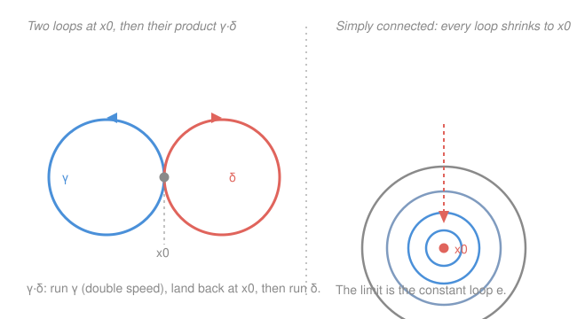

# Topology · Lesson 6.2: The fundamental group

> ⏱ ~15 min · Module 6: A first taste of algebraic topology · Builds on: [6.1](06-01-homotopy-of-paths.md) · Unlocks: [6.3](06-03-fundamental-group-of-circle.md)

## Why this matters

So far every tool for telling spaces apart has been a yes/no property: connected or not, compact or not, Hausdorff or not. These separate a disk from two disks, but they can't see the hole in an annulus — the disk and the annulus are both connected, compact, Hausdorff. The fundamental group is the first invariant that *counts* structure instead of just detecting it: it turns "how many essentially different ways can a loop wrap around a hole" into an honest algebraic group. That group is what will let us prove, later this module, that you can't comb a disk flat onto its edge, that every self-map of the disk has a fixed point, and that every complex polynomial has a root.

## The idea

Fix one point of the space and call it home — the **basepoint** $x_0$. Look only at **loops**: journeys that start at home, wander through the space, and return to home. Lesson [6.1](06-01-homotopy-of-paths.md) already taught us to blur loops together when one can be continuously slid onto the other without moving the endpoints — that's *path homotopy*. So don't think of a loop as a specific curve; think of its whole deformation class.

Now two things click into place. First, you can **multiply** loops: do one, then immediately do the other, and you get a new loop (still starting and ending at home). Second, this multiplication respects the blurring — deform the factors and the product deforms along with them. A set with a well-behaved multiplication, an identity, and inverses is exactly a **group**. The identity is "stand still at home" (the constant loop). The inverse of a loop is the same loop run backwards. Everything is *up to deformation*, which is precisely why it works.

The payoff: if the space has a hole, a loop that circles it once cannot be slid to the do-nothing loop — it's snagged. A loop that circles twice is genuinely different from one that circles once. The group records all of this. On a space with no holes, every loop slides home and the group collapses to a single element.

## The formal version

Throughout, $X$ is a topological space and $x_0\in X$ a chosen basepoint. Recall from [6.1](06-01-homotopy-of-paths.md) that a **path** is a continuous map $\gamma:[0,1]\to X$, and two paths $\gamma,\gamma'$ with the same endpoints are **path homotopic**, written $\gamma\simeq\gamma'$, if there is a continuous $H:[0,1]\times[0,1]\to X$ with $H(s,0)=\gamma(s)$, $H(s,1)=\gamma'(s)$, and both endpoints held fixed for all $t$. Write $[\gamma]$ for the path-homotopy class.

**Loop.** A **loop based at $x_0$** is a path $\gamma:[0,1]\to X$ with $\gamma(0)=\gamma(1)=x_0$.

> In words: a loop is a trip that leaves home and comes back home.

**Concatenation.** Given loops $\gamma,\delta$ at $x_0$, define $\gamma\cdot\delta:[0,1]\to X$ by
$$(\gamma\cdot\delta)(s)=\begin{cases}\gamma(2s), & 0\le s\le \tfrac12,\\[2pt] \delta(2s-1), & \tfrac12\le s\le 1.\end{cases}$$

> In words: run $\gamma$ at double speed on the first half of the time, then $\delta$ at double speed on the second half. It's continuous because both pieces equal $x_0$ at the seam $s=\tfrac12$.

This descends to classes: if $\gamma\simeq\gamma'$ and $\delta\simeq\delta'$ then $\gamma\cdot\delta\simeq\gamma'\cdot\delta'$ (run the two homotopies side by side, each on its own half). So $[\gamma][\delta]:=[\gamma\cdot\delta]$ is well defined.

**The fundamental group.** The **fundamental group** of $X$ at $x_0$ is
$$\pi_1(X,x_0)=\{\,[\gamma] : \gamma \text{ a loop based at } x_0\,\}, \qquad [\gamma][\delta]=[\gamma\cdot\delta].$$

> In words: $\pi_1$ is the set of loops-up-to-deformation, with "do one then the other" as the group product.

**Theorem.** $\pi_1(X,x_0)$ is a group.

*Sketch of the axioms — the content is in the reparametrization homotopies.* Let $e_{x_0}$ be the **constant loop** $e_{x_0}(s)=x_0$, and for a loop $\gamma$ let its **reverse** be $\bar\gamma(s)=\gamma(1-s)$.

- **Identity.** $[e_{x_0}][\gamma]=[\gamma]=[\gamma][e_{x_0}]$. The loop $e_{x_0}\cdot\gamma$ sits still for the first half-second, then races $\gamma$ at double speed. That's just $\gamma$ traced on a *different schedule*. Any two speed schedules of the same route are path homotopic: if $\varphi:[0,1]\to[0,1]$ is continuous with $\varphi(0)=0,\varphi(1)=1$, then $\gamma\circ\varphi\simeq\gamma$ via $H(s,t)=\gamma\big((1-t)\varphi(s)+t\,s\big)$, which linearly straightens the schedule $\varphi$ into the identity schedule while keeping endpoints pinned. So $e_{x_0}\cdot\gamma$ and $\gamma$ are homotopic.
- **Inverses.** $[\gamma][\bar\gamma]=[e_{x_0}]$. The loop $\gamma\cdot\bar\gamma$ goes out along $\gamma$ and immediately retraces its steps home. Contract it by "turning back earlier and earlier": $H(s,t)$ follows $\gamma$ only up to parameter value $t$-scaled, then returns, so at $t=1$ it never leaves $x_0$. Explicitly $H(s,t)=\gamma(\,2s(1-t)\,)$ for $s\le\tfrac12$ and $\gamma(\,2(1-s)(1-t)\,)$ for $s\ge\tfrac12$; at $t=1$ it is the constant loop.
- **Associativity.** $([\gamma][\delta])[\eta]=[\gamma]([\delta][\eta])$. Both products trace $\gamma$ then $\delta$ then $\eta$; they differ only in *where the cut points fall* ($\tfrac14,\tfrac12$ versus $\tfrac12,\tfrac34$). A single reparametrization homotopy — a continuous shift of the two cut points — carries one schedule to the other.

Each axiom is "same route, different clock," and [6.1](06-01-homotopy-of-paths.md)'s homotopies do the clock-changing.

**Basepoint dependence.** $\pi_1(X,x_0)$ depends on $x_0$, but only up to isomorphism when you can travel between basepoints.

**Theorem (change of basepoint).** If $\alpha:[0,1]\to X$ is a path from $x_0$ to $x_1$ (so $\alpha(0)=x_0$, $\alpha(1)=x_1$), then
$$\hat\alpha:\pi_1(X,x_1)\to\pi_1(X,x_0), \qquad \hat\alpha([\gamma])=[\alpha\cdot\gamma\cdot\bar\alpha]$$
is a group isomorphism.

> In words: to turn a loop at $x_1$ into a loop at $x_0$, walk over along $\alpha$, do the loop, walk back — "conjugation by the path." Different routes $\alpha$ give (possibly) different isomorphisms, but an isomorphism always exists.

*Why it's an isomorphism.* It's a homomorphism because the inner $\bar\alpha\cdot\alpha$ between two factors is homotopic to the constant loop and cancels: $\hat\alpha([\gamma])\hat\alpha([\delta])=[\alpha\gamma\bar\alpha\alpha\delta\bar\alpha]=[\alpha\gamma\delta\bar\alpha]=\hat\alpha([\gamma][\delta])$. And $\widehat{\bar\alpha}$ is a two-sided inverse. So **if $X$ is path-connected, $\pi_1(X,x_0)$ is the same group for every $x_0$**, and we write $\pi_1(X)$.

**Simply connected.** $X$ is **simply connected** if it is path-connected and $\pi_1(X)$ is trivial (has one element).

> In words: you can get anywhere, and every loop contracts to a point — no snags, no holes.

Examples with $\pi_1=0$ (trivial): any **convex** subset of $\mathbb{R}^n$ (in particular $\mathbb{R}^n$ itself), because the straight-line homotopy $H(s,t)=(1-t)\gamma(s)+t\,x_0$ contracts every loop to $x_0$; more generally any **contractible** space from [6.1](06-01-homotopy-of-paths.md); and the spheres $S^n$ for $n\ge 2$ (stated now, believed later — a loop on a 2-sphere has room to slip off any point it misses and reel in). The circle $S^1$ is the first space where this **fails**: $\pi_1(S^1)\cong\mathbb{Z}$, the integer being how many net times a loop winds around. That computation is the whole of Lesson [6.3](06-03-fundamental-group-of-circle.md).

## Picture

## Worked examples

**Example 1 (mechanical — $\pi_1$ of a convex set is trivial).** Let $X\subseteq\mathbb{R}^n$ be convex and $x_0\in X$. Take any loop $\gamma$ at $x_0$. Because $X$ is convex, the whole segment between $\gamma(s)$ and $x_0$ lies in $X$, so
$$H(s,t)=(1-t)\,\gamma(s)+t\,x_0$$
is a continuous map into $X$. Check the corners: $H(s,0)=\gamma(s)$; $H(s,1)=x_0=e_{x_0}(s)$; and at the endpoints $H(0,t)=(1-t)x_0+tx_0=x_0=H(1,t)$, so the basepoint stays pinned. Thus $\gamma\simeq e_{x_0}$, every class is the identity, and $\pi_1(X)=0$. A disk, a ball, a solid cube, all of $\mathbb{R}^n$ — none has a loop that snags.

**Example 2 (why you'd care — telling the annulus from the disk).** Let $D=\{x\in\mathbb{R}^2:\lVert x\rVert\le 1\}$ be the disk and $A=\{x:1\le\lVert x\rVert\le 2\}$ the annulus. Both are connected, compact, and Hausdorff, so none of Module 1–5's invariants separates them. But $\pi_1(D)=0$ by Example 1 (a disk is convex), while $\pi_1(A)\cong\mathbb{Z}$: a loop around the central hole cannot be contracted (there's no material to slide it across), and its winding number counts. Since $\pi_1$ is a **homeomorphism invariant** (homeomorphic spaces have isomorphic fundamental groups — this is Lesson [6.4](06-04-induced-homomorphisms-invariance.md)), $D\not\cong A$. This is the invariant doing what nothing before it could: *seeing the hole.*

## Watch out

- You might think the elements of $\pi_1$ are loops, but they are **homotopy classes** of loops. One class contains uncountably many actual loops — all the reparametrizations and wiggles of each other. Passing to classes is not bookkeeping; it is what makes the multiplication associative and invertible at all (raw concatenation is neither — the cut point lands in the wrong place, and $\gamma\cdot\bar\gamma$ is not literally the constant loop).
- You might think $\pi_1$ is always abelian, but it need not be. For the **figure-eight** (two circles joined at a point), the loops "around the left circle" ($a$) and "around the right circle" ($b$) satisfy $ab\ne ba$ — the order you thread the two holes is genuinely visible. $\pi_1$ of the figure-eight is the free group on two generators, as non-abelian as groups get.
- You might think a single $\pi_1$ describes the whole space, but the basepoint only washes out **within one path component**. A loop at $x_0$ can never reach a different component, so $\pi_1(X,x_0)$ is blind to everything outside $x_0$'s piece. For disconnected spaces, "$\pi_1(X)$" (no basepoint) is an abuse — always fix the component first.

## One-liner

> $\pi_1(X,x_0)$ is the group of loops-at-$x_0$-up-to-deformation, with "do one then the other" as multiplication — and it is trivial exactly when every loop contracts.

## Problems

**P1 (🟢)** In $\pi_1(X,x_0)$, prove directly from the definitions that the inverse of the class $[\gamma]$ is $[\bar\gamma]$, where $\bar\gamma(s)=\gamma(1-s)$ — i.e. that $[\bar\gamma]$ is the group-theoretic inverse of $[\gamma]$. (State clearly what must be shown; you may cite the contraction homotopy from the lesson.)

**P2 (🟡)** Let $X$ be path-connected. Show that $\pi_1(X,x_0)$ is **abelian** for one (hence every) basepoint **if and only if** for every pair of paths $\alpha,\beta$ from $x_0$ to $x_1$, the change-of-basepoint isomorphisms $\hat\alpha$ and $\hat\beta$ are *equal*. (Hint: $\hat\alpha\circ\hat\beta^{-1}$ is conjugation by the loop $\alpha\cdot\bar\beta$.)

**P3 (🔴, optional)** Let $X$ and $Y$ be path-connected and let $x_0\in X$, $y_0\in Y$. Prove that
$$\pi_1(X\times Y,\ (x_0,y_0))\ \cong\ \pi_1(X,x_0)\times\pi_1(Y,y_0),$$
where $X\times Y$ carries the product topology (Lesson 2.3). (Hint: a map into a product is continuous iff both components are — a loop in $X\times Y$ *is* a pair of loops, and a homotopy in $X\times Y$ *is* a pair of homotopies.)

Solutions

**P1** To show $[\bar\gamma]$ is the inverse of $[\gamma]$ we must verify both group equations
$$[\gamma][\bar\gamma]=[e_{x_0}] \quad\text{and}\quad [\bar\gamma][\gamma]=[e_{x_0}],$$
i.e. that $\gamma\cdot\bar\gamma\simeq e_{x_0}$ and $\bar\gamma\cdot\gamma\simeq e_{x_0}$ rel endpoints. For the first, use the contraction from the lesson:
$$H(s,t)=\begin{cases}\gamma\big(2s(1-t)\big), & 0\le s\le\tfrac12,\\[2pt]\gamma\big(2(1-s)(1-t)\big), & \tfrac12\le s\le 1.\end{cases}$$
Check it: $H$ is continuous (at $s=\tfrac12$ both pieces give $\gamma(1-t)$), and
- $t=0$: $H(s,0)=\gamma(2s)$ for $s\le\tfrac12$ and $\gamma(2-2s)=\gamma(1-(2s-1))=\bar\gamma(2s-1)$ for $s\ge\tfrac12$, which is exactly $\gamma\cdot\bar\gamma$;
- $t=1$: $H(s,1)=\gamma(0)=x_0$ for all $s$, the constant loop;
- endpoints: $H(0,t)=\gamma(0)=x_0$ and $H(1,t)=\gamma(0)=x_0$, pinned.

So $\gamma\cdot\bar\gamma\simeq e_{x_0}$. For the second equation, apply the same result to the loop $\bar\gamma$ in place of $\gamma$: its reverse is $\overline{\bar\gamma}=\gamma$, so $\bar\gamma\cdot\gamma\simeq e_{x_0}$ by the identical homotopy. Both equations hold, so $[\gamma]^{-1}=[\bar\gamma]$. $\blacksquare$

**P2** First unpack the hint. Fix paths $\alpha,\beta$ from $x_0$ to $x_1$. Then $\hat\alpha,\hat\beta:\pi_1(X,x_1)\to\pi_1(X,x_0)$, and
$$\hat\alpha\circ\hat\beta^{-1}=\hat\alpha\circ\widehat{\bar\beta}=\widehat{\alpha\cdot\bar\beta},$$
using $\hat\beta^{-1}=\widehat{\bar\beta}$ and that change-of-basepoint composes along concatenation. Now $c:=\alpha\cdot\bar\beta$ is a **loop at $x_0$**, and $\hat c([\eta])=[c][\eta][c]^{-1}$ is conjugation by the element $g:=[c]\in\pi_1(X,x_0)$.

$(\Rightarrow)$ Suppose $\pi_1(X,x_0)$ is abelian. Conjugation by any $g$ is then the identity map ($g\eta g^{-1}=\eta g g^{-1}=\eta$), so $\hat\alpha\circ\hat\beta^{-1}=\mathrm{id}$, giving $\hat\alpha=\hat\beta$ for every pair $\alpha,\beta$.

$(\Leftarrow)$ Suppose $\hat\alpha=\hat\beta$ always, so $\hat\alpha\circ\hat\beta^{-1}=\mathrm{id}$, i.e. conjugation by $[c]$ is the identity, for every loop $c$ arising as some $\alpha\cdot\bar\beta$. Every loop $c$ at $x_0$ *does* so arise: take $\beta=e_{x_0}$ (constant) and $\alpha=c$, giving $\alpha\cdot\bar\beta\simeq c$. Hence conjugation by *every* element $[c]$ is the identity, which is precisely the statement that $\pi_1(X,x_0)$ is abelian. Since $X$ is path-connected, abelian at one basepoint means abelian at every basepoint. $\blacksquare$

**P3** Let $p:X\times Y\to X$ and $q:X\times Y\to Y$ be the projections. A loop $\gamma$ at $(x_0,y_0)$ is a continuous map $\gamma:[0,1]\to X\times Y$ with $\gamma(0)=\gamma(1)=(x_0,y_0)$. By the defining property of the product topology, $\gamma$ is continuous **iff** both components $p\circ\gamma$ and $q\circ\gamma$ are, so $\gamma\leftrightarrow(p\gamma,\ q\gamma)$ pairs loops at $(x_0,y_0)$ bijectively with pairs (loop at $x_0$, loop at $y_0$). The same statement one dimension up says a homotopy $H:[0,1]^2\to X\times Y$ is continuous iff $(pH,qH)$ are, and it fixes the basepoint iff each component does; hence $\gamma\simeq\gamma'$ in $X\times Y$ **iff** $p\gamma\simeq p\gamma'$ in $X$ *and* $q\gamma\simeq q\gamma'$ in $Y$. Therefore
$$\Phi:\pi_1(X\times Y,(x_0,y_0))\to\pi_1(X,x_0)\times\pi_1(Y,y_0),\qquad \Phi([\gamma])=\big([p\gamma],[q\gamma]\big)$$
is a well-defined bijection. It is a homomorphism because concatenation is computed coordinatewise: $p(\gamma\cdot\delta)=(p\gamma)\cdot(p\delta)$ (each half of the schedule projects to the corresponding half), and likewise for $q$. So $\Phi$ is an isomorphism. $\blacksquare$

*Remark:* this is why $\pi_1$ of the **torus** $S^1\times S^1$ is $\mathbb{Z}\times\mathbb{Z}$ — two independent winding numbers, one per circle — once we know $\pi_1(S^1)=\mathbb{Z}$ from [6.3](06-03-fundamental-group-of-circle.md).

## Flashback

**From Lesson 6.1 (Homotopy and path homotopy):** Show that the punctured plane $\mathbb{R}^2\setminus\{0\}$ **deformation retracts** onto the unit circle $S^1$ by writing down an explicit deformation retraction, and verify its three defining conditions. (A deformation retraction of $X$ onto a subspace $A$ is a continuous $H:X\times[0,1]\to X$ with $H(x,0)=x$, $H(x,1)\in A$ for all $x$, and $H(a,t)=a$ for all $a\in A$, $t$.)

Solution

Radially normalize: push each nonzero point straight toward the circle along its own ray. Define $H:(\mathbb{R}^2\setminus\{0\})\times[0,1]\to \mathbb{R}^2\setminus\{0\}$ by
$$H(x,t)=(1-t)\,x+t\,\frac{x}{\lVert x\rVert}.$$
This is continuous because $\lVert x\rVert\ne 0$ on the punctured plane (no division by zero), and it never hits $0$: $H(x,t)=\big((1-t)+t/\lVert x\rVert\big)x$ is a *positive* scalar times $x\ne 0$ (the scalar is a positive-weighted average of $1$ and $1/\lVert x\rVert$, both positive). Now check the three conditions:
- $H(x,0)=x$ — starts at the identity;
- $H(x,1)=x/\lVert x\rVert$, which has norm $1$, so it lands in $S^1$;
- if $x\in S^1$ then $\lVert x\rVert=1$, so $H(x,t)=(1-t)x+tx=x$ for all $t$ — the circle is held fixed.

So $\mathbb{R}^2\setminus\{0\}$ deformation retracts onto $S^1$. By the homotopy-invariance of $\pi_1$ (Lesson [6.4](06-04-induced-homomorphisms-invariance.md)), this forces $\pi_1(\mathbb{R}^2\setminus\{0\})\cong\pi_1(S^1)\cong\mathbb{Z}$ — the punctured plane has exactly one hole, and it is the same hole the circle surrounds. $\blacksquare$

## Connections

- **Backward:** the entire group structure runs on [6.1](06-01-homotopy-of-paths.md)'s path homotopy — the identity, inverse, and associativity axioms are all "same route, different clock" homotopies rel endpoints. Contractible spaces from 6.1 reappear here as exactly the simply connected ones.
- **Forward:** [6.3](06-03-fundamental-group-of-circle.md) computes the first nontrivial value, $\pi_1(S^1)\cong\mathbb{Z}$, by lifting loops through the covering map $\mathbb{R}\to S^1$; [6.4](06-04-induced-homomorphisms-invariance.md) makes $\pi_1$ a *functor* (continuous maps induce homomorphisms) and proves it a homotopy invariant, upgrading Example 2's "$\pi_1$ separates spaces" to a theorem.
- **Sideways (algebra):** this is the cleanest bridge between topology and group theory — a space manufactures a group, and non-abelian groups (the figure-eight's free group) live inside geometry. The change-of-basepoint isomorphism *is* conjugation, tying "which basepoint" to "which inner automorphism," a dictionary that recurs throughout abstract algebra and covering-space theory.
