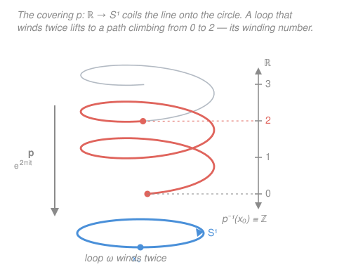

# Topology · Lesson 6.3: The fundamental group of the circle

> ⏱ ~15 min · Module 6: A first taste of algebraic topology · Builds on: [6.2 The fundamental group](06-02-the-fundamental-group.md) · Unlocks: [6.4 Induced homomorphisms and invariance](06-04-induced-homomorphisms-invariance.md)

## Why this matters

In [6.2](06-02-the-fundamental-group.md) we built a group $\pi_1(X,x_0)$ out of loops but never computed a single interesting one. Here we compute *the* example — $\pi_1(S^1)=\mathbb{Z}$ — and it is the engine that drives all of Module 6. Every application ahead (no-retraction, Brouwer's fixed-point theorem, a topological proof that every polynomial has a root) reduces to one fact: a loop on a circle remembers **how many times it wound around**, and nothing you do by continuous deformation can change that count. This is the moment topology stops being vocabulary and starts proving theorems geometry alone can't reach.

## The idea

Wrap a rubber band around a pole. You can slide it, stretch it, twist it — but to get it *off* the pole you'd have to cut it or lift it over the end. Wound around twice, it's even more stuck: no amount of wiggling turns a double loop into a single one. The one thing a loop on a cylinder (or a circle) truly carries is an integer: **how many net times it goes around**, counting counterclockwise as $+1$ and clockwise as $-1$.

That integer is called the **winding number** (or **degree**), and the whole theorem is the claim that it is a *complete* invariant: two loops on the circle can be deformed into each other **exactly when** their winding numbers agree. So the set of loop-classes is just $\{\dots,-2,-1,0,1,2,\dots\}$, and concatenating loops (do one, then the other) simply *adds* their winding numbers. A group whose elements are the integers and whose operation is addition — that is $\mathbb{Z}$.

How do we make "number of times around" rigorous? By **unrolling** the circle. Picture the real line $\mathbb{R}$ as an infinitely long thread and the circle as a spool: wrapping the thread onto the spool sends $t\in\mathbb{R}$ to the point at angle $2\pi t$. Going once around the circle corresponds to advancing by exactly $1$ on the thread. So if we can lift a loop on the circle back up to a path on the *unrolled* line, the amount the lifted path has climbed — an integer, since it must land back over the start — reads off the winding number directly. That lifting trick is the entire proof.

## The formal version

Throughout, model the circle as $S^1=\{z\in\mathbb{C}:|z|=1\}$ with basepoint $x_0=1$, and take the standard loop
$$\omega(t)=(\cos 2\pi t,\ \sin 2\pi t)=e^{2\pi i t},\qquad t\in[0,1],$$
which travels once around counterclockwise. (Writing points of the plane as complex numbers, $e^{2\pi i t}$ is the `complex-analysis` exponential; $|e^{2\pi i t}|=1$, so it lands on the circle.)

**The covering map.** Define
$$p:\mathbb{R}\to S^1,\qquad p(t)=(\cos 2\pi t,\ \sin 2\pi t)=e^{2\pi i t}.$$

> In words: $p$ wraps the whole line around the circle infinitely often, like coiling a wire onto a ring. It is continuous and **surjective**, and $p(t)=p(t')$ exactly when $t-t'\in\mathbb{Z}$. In particular the **fibre** over the basepoint is $p^{-1}(1)=\mathbb{Z}$: the integers are precisely the points of $\mathbb{R}$ sitting above the start.

The feature that makes $p$ a *covering map* is **local invertibility**: around any point of $S^1$ there is a small open arc $U$ whose preimage $p^{-1}(U)$ is a disjoint union of open intervals in $\mathbb{R}$ ("a stack of pancakes"), each mapped **homeomorphically** onto $U$ by $p$. Locally, wrapping is undoable; only globally does the wrapping accumulate.

**Path lifting.** For every path $\gamma:[0,1]\to S^1$ with $\gamma(0)=1$, and every choice of starting height $\tilde t_0\in p^{-1}(1)$, there is a **unique** path $\tilde\gamma:[0,1]\to\mathbb{R}$ with
$$p\circ\tilde\gamma=\gamma\qquad\text{and}\qquad\tilde\gamma(0)=\tilde t_0.$$

> In words: a path drawn on the circle can be traced on the unrolled line, and once you fix where the trace starts, the whole trace is forced. We always start lifts at $\tilde t_0=0$.

**Homotopy lifting.** For every path-homotopy $H:[0,1]\times[0,1]\to S^1$ (a continuous deformation of paths keeping endpoints fixed) with $H(0,0)=1$, there is a unique **lifted homotopy** $\widetilde H:[0,1]\times[0,1]\to\mathbb{R}$ with $p\circ\widetilde H=H$ and $\widetilde H(0,0)=0$. Moreover $\widetilde H$ is again a path-homotopy — it holds its endpoints fixed.

> In words: not just paths but whole *deformations* of paths lift, and the lift deforms endpoints the same way the original does — which is why the top endpoint of a lift can't drift when you deform the loop.

*Why the lifting properties hold (sketch).* Cover $S^1$ by finitely many arcs $U$ of the pancake type above. A path $\gamma$ starting at $1$ stays, for a first little while $[0,t_1]$, inside one such arc $U_0$; the starting height $\tilde t_0$ sits in exactly one pancake sheet, and on that sheet $p$ has a continuous inverse $q_0:U_0\to\mathbb{R}$, so we are **forced** to set $\tilde\gamma=q_0\circ\gamma$ there — no freedom, hence uniqueness. At $t_1$ we're inside a new arc $U_1$; the sheet is again pinned down by requiring $\tilde\gamma$ to stay continuous at $t_1$, and we continue. Compactness of $[0,1]$ (a Lebesgue-number argument from [4.2](04-02-compactness-metric-spaces.md)) guarantees finitely many such steps cover the whole interval, so the lift extends all the way to $t=1$. The homotopy version is the same argument run over the compact square $[0,1]^2$ instead of the interval. $\square$

**The degree map.** Let $[\gamma]\in\pi_1(S^1,1)$ be a loop class. Lift $\gamma$ to $\tilde\gamma$ starting at $\tilde\gamma(0)=0$. Since $\gamma$ is a loop, $\gamma(1)=1$, so $p(\tilde\gamma(1))=1$, which forces
$$\tilde\gamma(1)\in p^{-1}(1)=\mathbb{Z}.$$
Define
$$\deg:\pi_1(S^1,1)\to\mathbb{Z},\qquad \deg[\gamma]=\tilde\gamma(1).$$

> In words: run the loop, watch how far its unrolled trace has climbed by the end; that height is a whole number — the winding count.

**Theorem.** $\deg$ is a well-defined group isomorphism. Hence
$$\boxed{\ \pi_1(S^1)\cong\mathbb{Z}\ }$$
infinite cyclic, generated by $[\omega]$ (the once-around loop, $\deg[\omega]=1$).

### The four checks

**(1) Well-defined.** If $\gamma\simeq\gamma'$ (path-homotopic loops), lift the homotopy $H$ to $\widetilde H$ starting at $0$. The two ends $s\mapsto\widetilde H(s,1)$ trace a path *inside the fibre* $p^{-1}(1)=\mathbb{Z}$; but that path is continuous and $\mathbb{Z}$ is discrete, so it is **constant**. Hence $\tilde\gamma(1)=\tilde\gamma{}'(1)$ — homotopic loops have equal degree, so $\deg$ depends only on the class $[\gamma]$.

**(2) Homomorphism.** Take loops $\gamma,\delta$ of degrees $m,n$; let $\tilde\gamma,\tilde\delta$ be their lifts from $0$, ending at $m,n$. To lift the concatenation $\gamma\ast\delta$ (do $\gamma$, then $\delta$), first run $\tilde\gamma$ (ending at $m$), then run a copy of $\tilde\delta$ **shifted up by $m$**, namely $t\mapsto \tilde\delta(t)+m$: it starts at $0+m=m$ where $\tilde\gamma$ left off, and since $p(t+m)=p(t)$ it still lifts $\delta$. This concatenated path is the lift of $\gamma\ast\delta$ starting at $0$, and it ends at $n+m$. So $\deg[\gamma\ast\delta]=m+n=\deg[\gamma]+\deg[\delta]$.

**(3) Surjective.** The loop $\omega^n$ (once-around repeated $n$ times, or run backwards if $n<0$) lifts to the straight path $t\mapsto nt$ from $0$ to $n$. So $\deg[\omega^n]=n$: every integer is hit.

**(4) Injective.** Suppose $\deg[\gamma]=\deg[\gamma']=n$, so both lifts start at $0$ and end at the same integer $n$. In $\mathbb{R}$ any two paths with the same endpoints are path-homotopic — just slide one to the other along straight lines, $\widetilde H(s,t)=(1-s)\tilde\gamma(t)+s\tilde\gamma{}'(t)$, which is legal because $\mathbb{R}$ is convex (this is [6.1](06-01-homotopy-of-paths.md)'s straight-line homotopy, and it fixes the shared endpoints $0$ and $n$). Push that homotopy back down with $p$: $H=p\circ\widetilde H$ is a path-homotopy from $\gamma$ to $\gamma'$ in $S^1$. So $[\gamma]=[\gamma']$.

A homomorphism that is both injective and surjective is an isomorphism. $\blacksquare$

## Picture

## Worked examples

**Example 1 (mechanical — read a degree off a lift).** What is $\deg$ of the loop $\gamma(t)=e^{-2\pi i t}$ (once around **clockwise**)?

Lift it starting at $0$: we need $\tilde\gamma$ with $p(\tilde\gamma(t))=e^{2\pi i\,\tilde\gamma(t)}=e^{-2\pi i t}$ and $\tilde\gamma(0)=0$. The continuous choice is $\tilde\gamma(t)=-t$, which starts at $0$ and ends at $\tilde\gamma(1)=-1$. So $\deg[\gamma]=-1$: clockwise is the inverse of counterclockwise, and indeed $[\gamma]=[\omega]^{-1}$. Orientation is the sign of the winding number, exactly as $\mathbb{Z}$'s negatives predict.

**Example 2 (why you'd care — the circle is not simply connected, and neither is the plane minus a point).** A space is **simply connected** when $\pi_1$ is trivial (every loop contracts). Since $\pi_1(S^1)=\mathbb{Z}\neq\{0\}$, the circle is **not** simply connected: the once-around loop $\omega$ has degree $1$ and so can never be shrunk to the constant loop (degree $0$) — the invariant forbids it.

This immediately propagates. The punctured plane $\mathbb{R}^2\setminus\{0\}$ **deformation-retracts** onto $S^1$ (push each point radially out to the unit circle), and homotopy-equivalent spaces share $\pi_1$ (the general fact is [6.4](06-04-induced-homomorphisms-invariance.md)'s payoff, proved next), so
$$\pi_1(\mathbb{R}^2\setminus\{0\})\cong\pi_1(S^1)\cong\mathbb{Z}.$$
A loop in the punctured plane is classified by how many times it circles the missing point. This is precisely the **argument principle** of `complex-analysis`: the winding number $\frac{1}{2\pi i}\oint_\gamma \frac{dz}{z}$ counts the same integer. The two subjects are computing one number by two languages — a lift climbing in $\mathbb{R}$, and a contour integral counting enclosed zeros.

## Watch out

- **The endpoint is an integer for a reason — don't skip it.** A lift $\tilde\gamma$ ends at $\tilde\gamma(1)\in\mathbb{Z}$ *only because* $\gamma$ is a **loop**, forcing $p(\tilde\gamma(1))=x_0$, so $\tilde\gamma(1)$ lands in the fibre $p^{-1}(1)=\mathbb{Z}$. For a non-loop path the lifted endpoint can be any real number; degree is a notion for loops.
- **Lifts are unique only after you nail the start.** Path lifting gives *one* lift per choice of starting height, and the sheets sit a full integer apart. Forget to fix $\tilde\gamma(0)=0$ and you've only pinned the answer down modulo $\mathbb{Z}$ — the degree would be ambiguous. Uniqueness is what makes $\deg$ a function at all.
- **$\pi_1(S^1)$ is infinite, both directions.** You might expect a finite group ("the circle closes up, so surely windings wrap around too"). No: a loop can wind any integer number of times, clockwise or counter, and every value is genuinely distinct. The group is $\mathbb{Z}$, not $\mathbb{Z}/n$ — there is no largest winding and no "coming back to $0$."
- **Winding number here = the argument-principle count.** The integer $\deg[\gamma]$ is the same object `complex-analysis` calls the winding number of a closed contour about a point; if you've met $\frac{1}{2\pi i}\oint \frac{dz}{z}$, you've already met $\deg$ in analytic clothing. Same integer, two derivations.

## One-liner

> Unroll the circle onto the line: a loop lifts to a path whose integer climb is its winding number, and that integer is everything — so $\pi_1(S^1)=\mathbb{Z}$.

## Problems

**P1 (🟢)** Using the degree isomorphism, compute $\deg$ of the loop $\gamma(t)=e^{2\pi i (3t)}$ (which races around three times). Lift it explicitly from $0$ and state the winding number, then say which element of $\mathbb{Z}$ the class $[\gamma]$ is and how it's built from $[\omega]$.

**P2 (🟡)** Let $\alpha,\beta$ be loops at $1\in S^1$ with $\deg[\alpha]=4$ and $\deg[\beta]=-6$. Without lifting anything new, find $\deg[\alpha\ast\beta]$ and $\deg[\bar\alpha]$ (the reverse loop $\bar\alpha(t)=\alpha(1-t)$). Justify each using a property of $\deg$ from the theorem, and say what $[\alpha\ast\beta]$ and $[\bar\alpha]$ are as integers.

**P3 (🔴, optional)** Prove that there is **no continuous map** $r:D^2\to S^1$ that fixes the boundary circle, i.e. with $r(x)=x$ for all $x\in S^1$, where $D^2$ is the closed unit disk. (Hint: such an $r$ would let you contract the loop $\omega$ through the disk while keeping it equal to $\omega$ on $S^1$ — turn that into a contradiction about $\deg[\omega]$. This is the **no-retraction theorem**, the seed of Brouwer in [6.5](06-05-fixed-points-applications.md).)

Solutions

**P1** We need $\tilde\gamma$ continuous with $e^{2\pi i\,\tilde\gamma(t)}=e^{2\pi i(3t)}$ and $\tilde\gamma(0)=0$. The straight lift is $\tilde\gamma(t)=3t$, running from $0$ to $\tilde\gamma(1)=3$. So $\deg[\gamma]=3$: it winds three times counterclockwise. Under the isomorphism $[\gamma]$ is the integer $3$, i.e. $[\gamma]=[\omega]^3=[\omega\ast\omega\ast\omega]$ — three copies of the generator. (Reassuringly, $\deg$ being a homomorphism gives the same answer: $\deg[\omega^3]=3\deg[\omega]=3$.)

**P2** $\deg$ is a homomorphism into $\mathbb{Z}$ (check 2), so it carries concatenation to addition:
$$\deg[\alpha\ast\beta]=\deg[\alpha]+\deg[\beta]=4+(-6)=-2.$$
A homomorphism sends inverses to inverses, and $[\bar\alpha]=[\alpha]^{-1}$ in $\pi_1$ (reversing a loop is its group inverse, from [6.2](06-02-the-fundamental-group.md)), so
$$\deg[\bar\alpha]=-\deg[\alpha]=-4.$$
As integers: $[\alpha\ast\beta]$ **is** $-2$ (winds twice, clockwise net), and $[\bar\alpha]$ **is** $-4$. Reversing flips the sign of the winding number, exactly as running a lift backwards would.

**P3** Suppose such a retraction $r:D^2\to S^1$ with $r|_{S^1}=\mathrm{id}$ existed. Consider the once-around loop $\omega(t)=e^{2\pi i t}$, which lives on $S^1\subseteq D^2$. Because the disk is convex, $\omega$ is contractible **inside $D^2$**: the straight-line homotopy $F(s,t)=(1-s)\,\omega(t)+s\cdot 1$ shrinks $\omega$ (at $s=0$) to the constant loop at the basepoint $1$ (at $s=1$), staying in $D^2$ throughout and fixing the basepoint. Now push this deformation onto the circle with $r$:
$$H(s,t)=r\big(F(s,t)\big).$$
This $H$ is continuous (composition of continuous maps) and is a path-homotopy of **loops in $S^1$**. At $s=0$: $H(0,t)=r(\omega(t))=\omega(t)$ since $\omega(t)\in S^1$ and $r$ fixes $S^1$ — so $H$ starts at $\omega$. At $s=1$: $H(1,t)=r(1)=1$, the constant loop. So $H$ is a homotopy in $S^1$ from $\omega$ to the constant loop, giving $[\omega]=[\text{const}]$ in $\pi_1(S^1)$, hence
$$\deg[\omega]=\deg[\text{const}],\quad\text{i.e.}\quad 1=0,$$
a contradiction. Therefore no such $r$ exists. The whole argument is powered by the single fact $\deg[\omega]=1\neq 0$ — no-retraction is $\pi_1(S^1)=\mathbb{Z}$ wearing a disguise.

## Flashback

**From Lesson 6.2 (The fundamental group):** Let $X$ be a **convex** subset of $\mathbb{R}^n$ (for any two points, the segment between them lies in $X$) and fix a basepoint $x_0\in X$. Prove $\pi_1(X,x_0)$ is the trivial group — i.e. $X$ is simply connected.

Solution

Let $\gamma:[0,1]\to X$ be any loop at $x_0$ (so $\gamma(0)=\gamma(1)=x_0$). Define the straight-line homotopy to the constant loop $c_{x_0}(t)=x_0$:
$$H(s,t)=(1-s)\,\gamma(t)+s\,x_0,\qquad s,t\in[0,1].$$
This is continuous in $(s,t)$, and each value lies in $X$: it is a point on the segment from $\gamma(t)$ to $x_0$, and $X$ is convex, so the segment stays in $X$. Check it's a path-homotopy: at $s=0$, $H(0,t)=\gamma(t)$; at $s=1$, $H(1,t)=x_0=c_{x_0}(t)$; and the endpoints are fixed for all $s$, since $H(s,0)=(1-s)x_0+s x_0=x_0$ and likewise $H(s,1)=x_0$. So every loop is path-homotopic to the constant loop, giving $[\gamma]=[c_{x_0}]$ for all $\gamma$. Thus $\pi_1(X,x_0)=\{[c_{x_0}]\}$ is trivial. $\blacksquare$

(This is exactly the mechanism behind injectivity's check (4) above: $\mathbb{R}$ is convex, so lifts with matching endpoints are homotopic. Convexity $\Rightarrow$ simply connected is the reusable engine, and the contrast with $S^1$ — which is *not* convex, not even simply connected — is the whole point of this lesson.)

## Connections

- **Backward:** this is the first honest computation of the group defined in [6.2](06-02-the-fundamental-group.md); the injectivity and Flashback arguments both reuse the straight-line path-homotopy from [6.1](06-01-homotopy-of-paths.md), and the lifting proofs lean on the Lebesgue-number/compactness machinery from [4.2](04-02-compactness-metric-spaces.md).
- **Forward:** [6.4](06-04-induced-homomorphisms-invariance.md) makes $\pi_1$ a functor and proves homotopy invariance (the fact we borrowed in Example 2 to get $\pi_1(\mathbb{R}^2\setminus\{0\})=\mathbb{Z}$); [6.5](06-05-fixed-points-applications.md) cashes $\deg[\omega]=1$ into the no-retraction theorem (P3), the 2-D Brouwer fixed-point theorem, and a topological proof of the Fundamental Theorem of Algebra.
- **Sideways (`complex-analysis`):** the winding number $\deg[\gamma]$ is the argument principle's integer $\frac{1}{2\pi i}\oint_\gamma \frac{dz}{z}$ — counting how many times a closed contour circles a point. The covering $p(t)=e^{2\pi i t}$ is the complex exponential, and lifting a loop is choosing a continuous branch of $\log$ along it. Topology and complex analysis compute the identical integer by different means.
