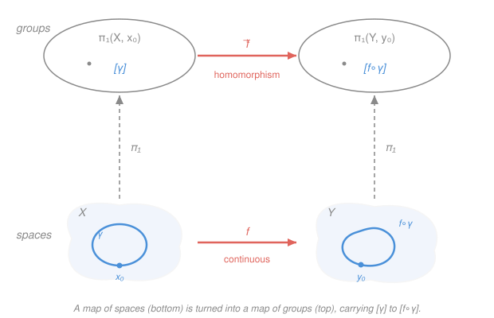

# Topology · Lesson 6.4: Induced homomorphisms and invariance

> ⏱ ~15 min · Module 6: A first taste of algebraic topology · Builds on: [6.1 Homotopy and path homotopy](06-01-homotopy-of-paths.md), [6.3 The fundamental group of the circle](06-03-fundamental-group-of-circle.md) · Unlocks: [6.5 Fixed points and applications](06-05-fixed-points-applications.md)

## Why this matters

Back in [2.5](02-05-topological-properties-invariants.md) we promised a weapon: an *invariant* strong enough to prove two spaces are genuinely different in shape, not just drawn differently. Cut-points and cardinality got us a little way. The fundamental group is the real thing — but a group attached to a space is inert until it can *travel* along maps. This lesson makes $\pi_1$ into a machine that eats a continuous map of spaces and spits out a homomorphism of groups, in a way that respects composition and can't tell homotopic maps apart. That single package is what converts "are these spaces the same?" (a question you can't answer by staring) into "are these groups the same?" (a question you can). It's the bridge the whole module was built to cross.

## The idea

You already know $\pi_1(X,x_0)$ — loops at a basepoint, up to homotopy, under concatenation. Now watch what a continuous map does to a loop. If $f:X\to Y$ is continuous and $\gamma$ is a loop in $X$ based at $x_0$, then $f\circ\gamma$ is a loop in $Y$ based at $f(x_0)$: you just run the loop and photograph its image. Deform $\gamma$ a little and its photograph deforms along with it — so the *homotopy class* of the loop maps to a well-defined homotopy class downstream. That assignment $[\gamma]\mapsto[f\circ\gamma]$ is the **induced homomorphism** $f_*$.

Three facts make this more than a definition. **(1)** It's a homomorphism: photographing a concatenation of loops is the same as concatenating the photographs. **(2)** It's *functorial*: doing nothing to the space does nothing to the group, and photographing through $Y$ then $Z$ equals photographing straight to $Z$. **(3)** It's *blind to homotopy*: wiggling $f$ continuously doesn't change $f_*$ at all.

Stack those up and you get the payoff for free. A homeomorphism has a continuous inverse, so its induced map has an inverse homomorphism — it's an *isomorphism*. Therefore homeomorphic spaces have isomorphic $\pi_1$. Flip it: **different $\pi_1 \Rightarrow$ not homeomorphic.** And because $f_*$ ignores homotopy, the conclusion upgrades — even *homotopy-equivalent* spaces share $\pi_1$, which is why a solid annulus and a bare circle, which are nothing alike as point sets, turn out to have the same fundamental group. This is what mathematicians mean when they call $\pi_1$ a **functor**: a rule that turns objects into objects *and maps into maps*, coherently.

## The formal version

Throughout, $f:X\to Y$ is continuous with $f(x_0)=y_0$, and $[\gamma]$ denotes the path-homotopy class (rel endpoints) of a loop $\gamma:[0,1]\to X$ with $\gamma(0)=\gamma(1)=x_0$.

**Definition (induced homomorphism).**
$$f_*:\pi_1(X,x_0)\to\pi_1(Y,y_0),\qquad f_*[\gamma]=[\,f\circ\gamma\,].$$

> In words: send a loop's class to the class of its image loop. The basepoint travels too: $x_0\mapsto y_0$.

**Well-defined.** Suppose $[\gamma]=[\delta]$, i.e. there is a path homotopy $H:[0,1]\times[0,1]\to X$ with $H(s,0)=\gamma(s)$, $H(s,1)=\delta(s)$, and $H(0,t)=H(1,t)=x_0$ for all $t$. Then $f\circ H$ is continuous (composition of continuous maps), and it is a path homotopy from $f\circ\gamma$ to $f\circ\delta$: its endpoints stay pinned at $f(x_0)=y_0$. Hence $[f\circ\gamma]=[f\circ\delta]$, so the rule doesn't depend on the representative. $\blacksquare$

**Homomorphism.** Recall concatenation $(\gamma\cdot\delta)(s)=\gamma(2s)$ for $s\le\tfrac12$ and $\delta(2s-1)$ for $s\ge\tfrac12$. Composing with $f$,
$$(f\circ(\gamma\cdot\delta))(s)=\begin{cases}f(\gamma(2s)),&s\le\tfrac12\\ f(\delta(2s-1)),&s\ge\tfrac12\end{cases}=\big((f\circ\gamma)\cdot(f\circ\delta)\big)(s).$$
The two functions are literally equal, so $f_*([\gamma][\delta])=f_*[\gamma\cdot\delta]=[(f\circ\gamma)\cdot(f\circ\delta)]=f_*[\gamma]\,f_*[\delta]$. $\blacksquare$

> In words: $f$ distributes over "do this loop, then that one," so it respects the group operation.

**Functoriality.** For continuous $f:X\to Y$ and $g:Y\to Z$ (with $f(x_0)=y_0$, $g(y_0)=z_0$):
$$(\mathrm{id}_X)_*=\mathrm{id}_{\pi_1(X,x_0)},\qquad (g\circ f)_*=g_*\circ f_*.$$

*Proof.* $(\mathrm{id}_X)_*[\gamma]=[\mathrm{id}_X\circ\gamma]=[\gamma]$. And $(g\circ f)_*[\gamma]=[(g\circ f)\circ\gamma]=[g\circ(f\circ\gamma)]=g_*[f\circ\gamma]=g_*(f_*[\gamma])$, using associativity of composition. $\blacksquare$

> In words: $\pi_1$ turns "identity map" into "identity homomorphism" and "do $f$ then $g$" into "apply $f_*$ then $g_*$" — same order, nothing reversed. That last point is what "**covariant** functor" means.

**Corollary (topological invariance).** If $f:X\to Y$ is a homeomorphism, then $f_*$ is an isomorphism.

*Proof.* Let $g=f^{-1}$, continuous with $g\circ f=\mathrm{id}_X$ and $f\circ g=\mathrm{id}_Y$. Functoriality gives $g_*\circ f_*=(\mathrm{id}_X)_*=\mathrm{id}$ and $f_*\circ g_*=(\mathrm{id}_Y)_*=\mathrm{id}$. So $f_*$ is a bijective homomorphism, i.e. an isomorphism, with inverse $g_*$. $\blacksquare$

> In words: homeomorphic spaces have isomorphic fundamental groups. Contrapositive — **the working weapon** — non-isomorphic $\pi_1$ proves two spaces are *not* homeomorphic.

**Homotopy invariance (stated; sketch).** If $f\simeq g:X\to Y$ are homotopic and the homotopy holds the basepoint fixed, then $f_*=g_*$. In general the basepoint drifts along a path $h(t)=H(x_0,t)$, and then $f_*$ and $g_*$ agree *up to the change-of-basepoint isomorphism* determined by $h$ (a conjugation/relabeling, harmless for the questions below). Consequently, a **homotopy equivalence** $\varphi:X\to Y$ (a map with a homotopy inverse $\psi$, so $\psi\varphi\simeq\mathrm{id}_X$ and $\varphi\psi\simeq\mathrm{id}_Y$) induces an **isomorphism** $\varphi_*:\pi_1(X,x_0)\to\pi_1(Y,\varphi(x_0))$ — run functoriality on $\psi\varphi\simeq\mathrm{id}$, but now "$\simeq$" (not "$=$") is enough, because $f_*$ can't see the difference.

> In words: bend one map into another and the induced homomorphism doesn't budge — so $\pi_1$ is invariant not just under homeomorphism but under the far coarser relation of homotopy equivalence.

Two immediate consequences we'll use:

- **Contractible $\Rightarrow$ trivial $\pi_1$.** If $X$ is contractible, $\mathrm{id}_X\simeq c$ for a constant map $c$. Then $\mathrm{id}=(\mathrm{id}_X)_*=c_*$, and $c_*$ is the trivial homomorphism (every loop maps to a constant loop). So $\pi_1(X,x_0)=0$. A contractible space is **simply connected**: path-connected with trivial $\pi_1$. In particular $\pi_1(D^2)=0$ and $\pi_1(\mathbb{R}^n)=0$.
- **Deformation retract $\Rightarrow$ same $\pi_1$.** A deformation retraction is a homotopy equivalence. The annulus $A=\{1\le|z|\le2\}$ and the punctured plane $\mathbb{R}^2\setminus\{0\}$ each deformation-retract onto the circle $S^1$ (push every point radially to $|z|=1$, exactly the deformation you built in [6.1](06-01-homotopy-of-paths.md)). Hence, using $\pi_1(S^1)=\mathbb{Z}$ from [6.3](06-03-fundamental-group-of-circle.md),
$$\pi_1(A)\cong\pi_1(\mathbb{R}^2\setminus\{0\})\cong\pi_1(S^1)=\mathbb{Z}.$$

## Picture

Read it bottom-to-top. Downstairs, the topology: a continuous $f$ carries the loop $\gamma$ in $X$ to its image $f\circ\gamma$ in $Y$. The vertical dashed arrows are the functor $\pi_1$ turning each space into its group of loop-classes. Upstairs, the algebra: $f_*$ sends $[\gamma]$ to $[f\circ\gamma]$. The square *commutes* — and stacking two such squares side by side is exactly the statement $(g\circ f)_*=g_*\circ f_*$.

## Worked examples

**Example 1 (mechanical — the disk is not the circle).** Is $S^1$ homeomorphic to the closed disk $D^2$? Compute both groups. $D^2$ is convex, hence contractible, so $\pi_1(D^2)=0$. From [6.3](06-03-fundamental-group-of-circle.md), $\pi_1(S^1)=\mathbb{Z}$. Since $\mathbb{Z}\not\cong 0$ (one has a nonidentity element, the other doesn't), the invariance corollary says $S^1$ and $D^2$ are **not homeomorphic** — in fact not even homotopy equivalent. Notice what did the work: not a clever cut-point argument, just two group computations and "the groups differ." That's the whole selling point.

**Example 2 (why you'd care — the plane has a hole you can detect).** In `real-analysis` and vector calculus you were told $\mathbb{R}^2\setminus\{0\}$ is "different" from $\mathbb{R}^2$ — line integrals of $\frac{-y\,dx+x\,dy}{x^2+y^2}$ around the origin don't vanish, path-independence fails, and so on. That was a symptom. Here is the honest topological cause: $\pi_1(\mathbb{R}^2)=0$ (contractible) while $\pi_1(\mathbb{R}^2\setminus\{0\})=\mathbb{Z}$ (deformation-retracts to $S^1$). Removing a single point changed the fundamental group from trivial to $\mathbb{Z}$, so the two spaces are not homeomorphic, and a loop encircling the puncture *cannot* be contracted — the integer it maps to in $\mathbb{Z}$ is its winding number, the same integer the contour integral was measuring. The disk is simply connected; the annulus (equivalently, the punctured plane) is not. This is also the setup for next lesson's punchline: if there were a **retraction** $r:D^2\to S^1$ (a continuous map fixing the boundary circle), the inclusion $i:S^1\hookrightarrow D^2$ would satisfy $r\circ i=\mathrm{id}_{S^1}$, forcing $r_*\circ i_*=\mathrm{id}$ on $\mathbb{Z}$ — impossible, since $i_*$ lands in $\pi_1(D^2)=0$. That contradiction is the no-retraction theorem, and Brouwer's fixed-point theorem falls out of it. We prove it cleanly in [6.5](06-05-fixed-points-applications.md); for now, note that the entire argument is just functoriality applied to $r\circ i=\mathrm{id}$.

## Watch out

- **You might think $f_*$ depends only on the spaces, but it depends on the basepoint** $x_0$ (and on which point $f$ sends it to). For a *path-connected* space this is a non-issue: any two basepoints give isomorphic groups via the change-of-basepoint isomorphism, so we write $\pi_1(X)$ loosely — but the isomorphism is a genuine relabeling, not literal equality, and homotopy invariance is only "up to" it.
- **You might think you need a homeomorphism to conclude "same $\pi_1$," but homotopy equivalence is enough** — that's the stronger, more useful fact. It's *why* $\pi_1$ can equate a fat annulus with a thin circle. Conversely, the tool is one-directional: **different $\pi_1$ proves not-equivalent, but equal $\pi_1$ proves nothing.** $S^2$ and a point both have trivial $\pi_1$ yet are not homotopy equivalent; separating them needs higher invariants ($\pi_2$, homology) beyond this course.
- **You might think a map of spaces might reverse the arrow between groups, but $\pi_1$ is covariant:** $f:X\to Y$ gives $f_*:\pi_1(X)\to\pi_1(Y)$, same direction, and $(g\circ f)_*=g_*\circ f_*$ with no flip. (Contrast cohomology, which *does* reverse arrows — a distinction that will matter later, not here.)

## One-liner

> $\pi_1$ is a functor: continuous maps become homomorphisms that compose correctly and ignore homotopy — so "not the same group" is a rigorous, computable proof of "not the same shape."

## Problems

**P1 (🟢)** Let $c:X\to Y$ be a constant map, $c(x)=y_0$ for all $x$. Prove directly from the definition that $c_*:\pi_1(X,x_0)\to\pi_1(Y,y_0)$ is the trivial homomorphism (sends everything to the identity). Then use this to re-derive, in one line, that a contractible space has trivial $\pi_1$.

**P2 (🟡)** Prove that the closed annulus $A=\{z\in\mathbb{R}^2:1\le|z|\le2\}$ and the closed disk $D^2$ are not homeomorphic. Name every fact you invoke and where it came from.

**P3 (🔴, optional — the retraction lemma)** Let $A\subseteq X$ with inclusion $i:A\hookrightarrow X$, and suppose there is a **retraction** $r:X\to A$: a continuous map with $r(a)=a$ for all $a\in A$ (equivalently $r\circ i=\mathrm{id}_A$). Fix a basepoint $a_0\in A$. Prove that $i_*:\pi_1(A,a_0)\to\pi_1(X,a_0)$ is *injective* and $r_*:\pi_1(X,a_0)\to\pi_1(A,a_0)$ is *surjective*. (This is the exact lever [6.5](06-05-fixed-points-applications.md) pulls to prove there's no retraction $D^2\to S^1$.)

Solutions

**P1** For any loop $\gamma$ based at $x_0$, the composite $c\circ\gamma$ is the map $s\mapsto y_0$ — the *constant loop* $e_{y_0}$, which represents the identity of $\pi_1(Y,y_0)$. So $c_*[\gamma]=[c\circ\gamma]=[e_{y_0}]=e$ for every $[\gamma]$; that is precisely the trivial homomorphism. Re-derivation: if $X$ is contractible then $\mathrm{id}_X\simeq c$ for some constant $c$, so by homotopy invariance $\mathrm{id}=(\mathrm{id}_X)_*=c_*=$ trivial homomorphism; an identity map that is also trivial forces the group itself to be trivial, $\pi_1(X,x_0)=0$. $\blacksquare$

**P2** Compute the two fundamental groups and compare.
- $D^2$ is convex, hence contractible, hence simply connected: $\pi_1(D^2)=0$ (contractible $\Rightarrow$ trivial $\pi_1$, proved in the lesson via homotopy invariance).
- $A$ deformation-retracts onto its inner circle $S^1=\{|z|=1\}$ by the straight-line radial homotopy $H(z,t)=\big((1-t)+t/|z|\big)z$, which slides each point to $|z|=1$ while fixing $S^1$; a deformation retraction is a homotopy equivalence, so $\pi_1(A)\cong\pi_1(S^1)=\mathbb{Z}$ (using $\pi_1(S^1)=\mathbb{Z}$ from [6.3](06-03-fundamental-group-of-circle.md)).

Since $\mathbb{Z}\not\cong 0$, the invariance corollary (homeomorphic $\Rightarrow$ isomorphic $\pi_1$) rules out a homeomorphism: $A$ and $D^2$ are not homeomorphic. $\blacksquare$ (They are not even homotopy equivalent, by the same comparison.)

**P3** This is pure functoriality applied to $r\circ i=\mathrm{id}_A$. Apply $\pi_1$: by $(g\circ f)_*=g_*\circ f_*$ and $(\mathrm{id}_A)_*=\mathrm{id}$,
$$r_*\circ i_*=(r\circ i)_*=(\mathrm{id}_A)_*=\mathrm{id}_{\pi_1(A,a_0)}.$$
Now read off the two conclusions.
- *$i_*$ injective:* if $i_*[\alpha]=i_*[\beta]$, apply $r_*$ to both sides: $[\alpha]=r_*i_*[\alpha]=r_*i_*[\beta]=[\beta]$. So $i_*$ is one-to-one. (A map with a left inverse is injective.)
- *$r_*$ surjective:* for any $[\alpha]\in\pi_1(A,a_0)$, we have $[\alpha]=r_*\big(i_*[\alpha]\big)$, so $[\alpha]$ is in the image of $r_*$. (A map with a right inverse is onto.)

The punchline preview: take $X=D^2$, $A=S^1$. Then $i_*:\pi_1(S^1)=\mathbb{Z}\to\pi_1(D^2)=0$ would have to be *injective* — but no injection $\mathbb{Z}\hookrightarrow 0$ exists. So no retraction $D^2\to S^1$ can exist. $\blacksquare$

## Flashback

**From Lesson 6.3 (The fundamental group of the circle — $\pi_1(S^1)=\mathbb{Z}$):** For $n\in\mathbb{Z}$, let $\omega_n:[0,1]\to S^1$ be the loop $\omega_n(s)=(\cos 2\pi n s,\ \sin 2\pi n s)$, which winds $n$ times around the circle (negative $n$ = clockwise). Under the isomorphism $\deg:\pi_1(S^1,(1,0))\xrightarrow{\ \cong\ }\mathbb{Z}$ sending $[\omega_n]\mapsto n$, identify the integer represented by the concatenation $[\omega_3]\cdot[\omega_{-2}]$. Then say what would go wrong if you instead claimed the answer were $\lvert 3\rvert+\lvert-2\rvert=5$.

Solution

$\deg$ is an *isomorphism*, hence a homomorphism, so it turns the group operation (concatenation) into addition in $\mathbb{Z}$:
$$\deg\big([\omega_3]\cdot[\omega_{-2}]\big)=\deg[\omega_3]+\deg[\omega_{-2}]=3+(-2)=1.$$
So the concatenated loop is homotopic to $\omega_1$: wind three times counterclockwise, then twice clockwise, and two of the counterclockwise turns cancel two clockwise turns, leaving exactly one net loop. The class is $[\omega_1]$, the generator.

Why not $5$? Because winding number is *signed*, and the group $\mathbb{Z}$ records net winding, not total distance traveled. Taking absolute values would treat clockwise and counterclockwise as the same — but $[\omega_{-2}]=[\omega_2]^{-1}$ is the *inverse* of $[\omega_2]$, not a second copy of it. Adding $\lvert-2\rvert=2$ would be adding the inverse's opposite; it ignores that the two directions cancel. The signs are the entire content of $\pi_1(S^1)=\mathbb{Z}$: they're why the group is the integers and not, say, $\mathbb{N}$. $\blacksquare$

## Connections

- **Backward:** this promotes [6.3](06-03-fundamental-group-of-circle.md)'s single computation $\pi_1(S^1)=\mathbb{Z}$ into a portable tool — every "compute $\pi_1$" downstream routes through a homotopy equivalence back to a circle. It also delivers the invariant [2.5](02-05-topological-properties-invariants.md) promised, far sharper than cut-points: the annulus/disk and $\mathbb{R}^2$/$\mathbb{R}^2\setminus\{0\}$ distinctions that earlier arguments couldn't touch.
- **Forward:** the retraction lemma (P3) plus $\pi_1(S^1)=\mathbb{Z}$, $\pi_1(D^2)=0$ is *all* the input [6.5](06-05-fixed-points-applications.md) needs for the no-retraction theorem, the 2-D Brouwer fixed-point theorem, and a topological proof of the Fundamental Theorem of Algebra.
- **Sideways (analysis):** the integer a loop maps to in $\pi_1(\mathbb{R}^2\setminus\{0\})=\mathbb{Z}$ is the winding number that `complex-analysis` computes as $\frac{1}{2\pi i}\oint \frac{dz}{z}$ — Cauchy's integral theorem and the argument principle are the analytic shadow of "loops around a puncture can't be contracted." The failure of path-independence for the angle form in vector calculus is the same fact wearing a third uniform.
