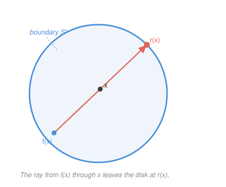

# Topology · Lesson 6.5: Fixed points and applications

> ⏱ ~15 min · Module 6: A first taste of algebraic topology · Builds on: [6.3](06-03-fundamental-group-of-circle.md), [6.4](06-04-induced-homomorphisms-invariance.md) · Unlocks: course capstone — feeds `grad-game-theory` (Nash existence) and `complex-analysis` (the Fundamental Theorem of Algebra)

## Why this matters

This is the payoff for the whole course. For twenty-odd lessons we built a machine — open sets, continuity, connectedness, compactness, then the fundamental group — and computed exactly one nontrivial value: $\pi_1(S^1)=\mathbb{Z}$ ([6.3](06-03-fundamental-group-of-circle.md)). Now we spend it. Three theorems that geometry cannot touch directly — *you can't flatten a disk onto its rim, every stirring of a coffee cup fixes a point, every polynomial has a root* — all fall out of a single piece of algebra: the identity map on $\mathbb{Z}$ cannot factor through the trivial group $0$. That's it. The hard analytic content was front-loaded into $\pi_1(S^1)=\mathbb{Z}$ and functoriality; here it becomes one-line arithmetic.

## The idea

Recall the one fact that makes $\pi_1$ *useful* rather than merely definable — functoriality, from [6.4](06-04-induced-homomorphisms-invariance.md). A continuous map $f:X\to Y$ induces a group homomorphism $f_*:\pi_1(X)\to\pi_1(Y)$, composition is respected ($(g\circ f)_*=g_*\circ f_*$), and the identity map induces the identity homomorphism. So a diagram of *spaces and continuous maps* pushes forward to a diagram of *groups and homomorphisms*, and any impossibility in the group world is an impossibility in the space world.

Here is the whole trick in miniature. The disk $D^2$ is contractible, so $\pi_1(D^2)=0$ (the trivial one-element group). The circle has $\pi_1(S^1)=\mathbb{Z}$. Suppose some continuous construction forced a composite of maps $S^1\to D^2\to S^1$ to be the *identity* on $S^1$. Apply $\pi_1$: we'd get a composite of homomorphisms

$$\mathbb{Z}\ \longrightarrow\ 0\ \longrightarrow\ \mathbb{Z}$$

that equals $\mathrm{id}_{\mathbb{Z}}$. But anything routed through the trivial group $0$ is the **zero map** — it sends every integer to $0$ — and the zero map on $\mathbb{Z}$ is *not* the identity ($1\mapsto 0\neq 1$). Contradiction. Every theorem below is this one paragraph, dressed differently.

## The formal version

**No-retraction theorem.** *There is no continuous retraction $r:D^2\to S^1$*, where a **retraction** is a continuous map with $r(x)=x$ for every $x\in S^1$ — i.e. $r$ restricted to the boundary is the identity.

> In words: you cannot continuously squash the whole disk onto its boundary circle while leaving the boundary pinned in place. (Physically: you can't press a drum skin flat onto its rim without tearing it.)

*Proof.* Let $i:S^1\hookrightarrow D^2$ be the inclusion of the boundary. Saying $r$ is a retraction means exactly $r\circ i=\mathrm{id}_{S^1}$ (start on the circle, include into the disk, retract back — you're home). Apply the functor $\pi_1$ and use functoriality ([6.4](06-04-induced-homomorphisms-invariance.md)):

$$r_*\circ i_* = (r\circ i)_* = (\mathrm{id}_{S^1})_* = \mathrm{id}_{\pi_1(S^1)} = \mathrm{id}_{\mathbb{Z}}.$$

But $i_*:\pi_1(S^1)\to\pi_1(D^2)$ is a homomorphism $\mathbb{Z}\to 0$, since $D^2$ is contractible so $\pi_1(D^2)=0$. And $r_*:0\to\mathbb{Z}$. Their composite $r_*\circ i_*$ therefore factors through $0$: every element of $\mathbb{Z}$ is sent to the identity of $0$, then out to $0\in\mathbb{Z}$. So $r_*\circ i_*$ is the zero map. We've forced $\mathrm{id}_{\mathbb{Z}}=$ zero map, which fails at $1$ (indeed at every nonzero integer). Contradiction — no such $r$ exists. $\blacksquare$

**Brouwer fixed-point theorem (2-D).** *Every continuous map $f:D^2\to D^2$ has a fixed point* — a point $x$ with $f(x)=x$.

> In words: stir a cup of coffee, however wildly, and at least one speck ends exactly where it began. There is no continuous way to move *every* point of the disk.

*Proof (by contraposition — build a forbidden retraction).* Suppose $f$ had **no** fixed point: $f(x)\neq x$ for all $x\in D^2$. Then for each $x$ the two points $f(x)$ and $x$ are distinct, so they determine a unique ray that *starts at $f(x)$ and passes through $x$*. Follow that ray onward from $x$ until it exits the disk; call the exit point $r(x)\in S^1$ (see the Picture). This defines a map $r:D^2\to S^1$.

Two things to check. **It's continuous:** $r(x)$ is given by an explicit formula in $x$ and $f(x)$ (solve $|f(x)+t(x-f(x))|=1$ for the positive root $t$ — a quotient of continuous functions with nonvanishing denominator because $x\neq f(x)$), and $f$ is continuous, so $r$ is. **It's a retraction:** if $x$ is *already* on the boundary, the ray from $f(x)$ through $x$ leaves the disk right at $x$ itself, so $r(x)=x$. Thus $r$ is a continuous retraction $D^2\to S^1$ — which the no-retraction theorem just forbade. Contradiction. So $f$ must have a fixed point. $\blacksquare$

**Fundamental Theorem of Algebra (topological proof).** *Every non-constant polynomial $p(z)=z^n+a_{n-1}z^{n-1}+\cdots+a_0$ with complex coefficients ($n\ge 1$) has a root in $\mathbb{C}$.*

*Proof sketch (winding numbers).* Suppose $p$ never vanishes, so $p:\mathbb{C}\to\mathbb{C}\setminus\{0\}$. For each radius $R\ge 0$ consider the loop
$$\gamma_R(t) = p\!\left(Re^{2\pi i t}\right), \qquad t\in[0,1],$$
a loop in $\mathbb{C}\setminus\{0\}$ (it misses $0$ by assumption). Its class in $\pi_1(\mathbb{C}\setminus\{0\})\cong\pi_1(S^1)=\mathbb{Z}$ is its **winding number** around the origin — the integer counting net signed turns, exactly the isomorphism of [6.3](06-03-fundamental-group-of-circle.md).

- At $R=0$: $\gamma_0(t)=p(0)=a_0$ is a *constant* loop, winding number $0$.
- For $R$ **large**: the leading term $z^n$ dominates, so $\gamma_R$ tracks $R^n e^{2\pi i n t}$, which circles the origin $n$ times — winding number $n$. (Precisely: for $R>1+|a_{n-1}|+\cdots+|a_0|$ the lower-order terms are too small to reach the origin, so $\gamma_R$ is homotopic in $\mathbb{C}\setminus\{0\}$ to $t\mapsto R^n e^{2\pi i nt}$.)

Now let $R$ vary continuously from $0$ upward. Because $p$ never hits $0$, the family $\{\gamma_R\}$ is a *homotopy of loops inside $\mathbb{C}\setminus\{0\}$* — so all $\gamma_R$ are homotopic and must share **one** winding number. But we just computed winding number $0$ at $R=0$ and winding number $n\ge 1$ for large $R$. Since $0\neq n$, that's a contradiction. Hence $p$ must vanish somewhere. $\blacksquare$

> In words: shrinking the input circle to a point drags the output loop's winding number down to $0$, but the top-degree term forces it to be $n$ far out — and a winding number can't be two integers at once *unless the loop was allowed to cross the origin*, i.e. unless $p$ has a root.

## Picture

## Worked examples

**Example 1 (mechanical — Brouwer in 1-D, by hand).** The same theorem in dimension 1 needs no $\pi_1$, and it's worth seeing the bare mechanism. Let $f:[-1,1]\to[-1,1]$ be continuous. Define $g(x)=f(x)-x$, also continuous. At the ends, $g(-1)=f(-1)-(-1)=f(-1)+1\ge 0$ (since $f(-1)\ge -1$) and $g(1)=f(1)-1\le 0$ (since $f(1)\le 1$). A continuous $g$ with $g(-1)\ge 0\ge g(1)$ hits $0$ by the Intermediate Value Theorem (Module 3), so $g(x_0)=0$, i.e. $f(x_0)=x_0$. The 1-D disk $D^1=[-1,1]$ has boundary two points $\{-1,1\}=S^0$, and the "no retraction $D^1\to S^0$" is just: a connected interval can't map continuously onto a two-point discrete set fixing both ends — a **connectedness** obstruction. In dimension 2 connectedness is too weak and $\pi_1$ takes over; that's the whole reason Module 6 exists.

**Example 2 (why you'd care — equilibria exist).** Brouwer is the engine behind **existence** theorems across economics and game theory. A simple case: let $S=\{(x,y):x,y\ge 0,\ x+y=1\}$ be the strategy simplex (a segment, homeomorphic to a disk in higher dimensions), and let $f:S\to S$ be a continuous "best-response adjustment." Brouwer guarantees a fixed point $s^*=f(s^*)$ — a state that maps to itself, i.e. nobody wants to move: an **equilibrium**. This is precisely how John Nash proved every finite game has a mixed-strategy equilibrium — apply a fixed-point theorem to a continuous best-response map on the product of players' simplices. `grad-game-theory` runs this argument in full (with **Kakutani**'s set-valued upgrade of Brouwer, needed because best responses can be sets, not points). The lesson to carry: *a fixed point is an equilibrium, and topology is what promises it exists.*

## Watch out

- **This is the 2-D Brouwer only.** Every continuous $f:D^n\to D^n$ has a fixed point for *all* $n$, but the proof above is dimension-2 specific: it rests on $\pi_1(S^1)=\mathbb{Z}\neq 0$. For $D^n$ with $n\ge 3$ you need $\pi_1(S^{n-1})=0$ to fail its job, so the argument moves up to **higher homotopy groups** $\pi_{n-1}$ or (more standard) **homology** $H_{n-1}(S^{n-1})=\mathbb{Z}$ — machinery beyond this first course. The *shape* of the proof (no-retraction ⟹ fixed point) is identical; only the invariant changes.
- **The no-retraction proof is pure functoriality, nothing more.** No estimates, no explicit maps. The entire content is "$\mathbb{Z}\to 0\to\mathbb{Z}$ can't be $\mathrm{id}_\mathbb{Z}$." If you find yourself computing anything, you've overcomplicated it — the analysis was already spent proving $\pi_1(S^1)=\mathbb{Z}$.
- **The FTA argument lives or dies on the winding jump.** You might think "the loops obviously deform, so what?" The point is that the winding number is *forced* to be $n$ for large $R$ and *forced* to be $0$ at $R=0$; the deformation is only legal **inside $\mathbb{C}\setminus\{0\}$**, and that legality is exactly the false hypothesis "$p$ has no root." Drop the non-vanishing and the loops are free to cross the origin, the winding number can jump, and there's no contradiction — which is the truthful case.
- **A fixed point is existence, not a recipe.** Brouwer says *some* $x$ with $f(x)=x$ exists; it does not locate it, does not count them, and gives no formula. (There can be many, or exactly one, depending on $f$.) Existence proofs and constructive algorithms are different sports.

## One-liner

> With $\pi_1(S^1)=\mathbb{Z}$ and functoriality in hand, three impossibilities — no retraction of a disk to its rim, no fixed-point-free self-map of a disk, no rootless polynomial — are all the single algebraic fact that $\mathbb{Z}\to 0\to\mathbb{Z}$ cannot be the identity.

## Problems

**P1 (🟢)** Use the no-retraction theorem as a black box to prove the 2-D Brouwer theorem *in your own words* — state the contrapositive setup, describe the ray construction, and name the exact contradiction. (This is the argument you must be able to reproduce cold.)

**P2 (🟡)** Let $f:D^2\to D^2$ be continuous with $f(D^2)\subseteq \partial D^2 = S^1$ (every output lands on the boundary circle). Show directly that $f$ still has a fixed point, and locate where it must lie. (Hint: what does Brouwer already give you, and where is that point?)

**P3 (🔴, optional)** Winding-number bookkeeping for the FTA. For $p(z)=z^2 - 1$ (roots at $\pm 1$), compute the winding number of $\gamma_R(t)=p(Re^{2\pi i t})$ around $0$ for (a) $R=\tfrac12$ and (b) $R=2$, and explain what happens as $R$ crosses $1$. Connect the jump to the presence of a root.

Solutions

**P1** *Claim:* every continuous $f:D^2\to D^2$ has a fixed point. *Contrapositive:* assume $f(x)\neq x$ for all $x\in D^2$, and derive a contradiction. Since $f(x)$ and $x$ are always distinct, at each $x$ draw the ray starting at $f(x)$ and passing through $x$; extend it past $x$ to where it meets the boundary, and call that boundary point $r(x)$. This $r:D^2\to S^1$ is continuous (it's an explicit continuous formula in $x$ and $f(x)$, whose denominator never vanishes precisely because $x\neq f(x)$). And if $x\in S^1$ already, the ray exits the disk at $x$ itself, so $r(x)=x$ — meaning $r$ is a **retraction** of $D^2$ onto $S^1$. But the no-retraction theorem says no such continuous retraction exists. Contradiction; so $f$ has a fixed point. The single load-bearing fact is that a fixed-point-free self-map *manufactures* the impossible retraction.

**P2** Brouwer applies to $f:D^2\to D^2$ regardless of where the image lands, so $f$ has a fixed point $x_0$ with $f(x_0)=x_0$. But every output of $f$ lies in $S^1$, so in particular $x_0=f(x_0)\in S^1$. Hence the fixed point exists **and must lie on the boundary circle** — it cannot be in the open interior, since interior points are not in the image at all. (Sanity check: such maps do exist, e.g. the constant map $f\equiv p$ for any fixed $p\in S^1$, whose only fixed point is $p$, indeed a boundary point.)

**P3** Write $\gamma_R(t)=R^2 e^{4\pi i t}-1$.

*(a) $R=\tfrac12$:* the term $R^2 e^{4\pi it}=\tfrac14 e^{4\pi it}$ traces a circle of radius $\tfrac14$ centered at the origin; subtracting $1$ shifts its center to $-1$. So $\gamma_{1/2}$ is a small circle of radius $\tfrac14$ around the point $-1$ — it stays in the left half-plane, well away from $0$, and does **not** enclose the origin. Winding number $=0$.

*(b) $R=2$:* now $R^2 e^{4\pi it}=4e^{4\pi it}$ is a circle of radius $4$ about the origin, traversed **twice** as $t$ goes $0\to 1$ (the exponent is $4\pi i t$, two full turns). Shifting center to $-1$ leaves the origin comfortably enclosed (radius $4$ vs. center-offset $1$). The origin is wound around **twice**: winding number $=2=\deg p$.

*As $R$ crosses $1$:* the roots of $p$ sit at $z=\pm 1$, i.e. $|z|=1$. When $R<1$ the input circle $|z|=R$ encloses neither root and the output loop avoids $0$ (winding $0$); when $R>1$ it encloses both roots and the output winds around $0$ twice (winding $2$). At $R=1$ the input circle passes *through* the roots, so $\gamma_1$ **hits the origin** — the loop is momentarily allowed to cross $0$, which is exactly the event that permits the winding number to jump from $0$ to $2$. The jump is not a bug: it is the fingerprint of the roots. In the FTA proof we *assumed no root*, which would have banned this crossing and frozen the winding number — impossible once the two ends disagree.

## Flashback

**From Lesson 6.4 (Induced homomorphisms and invariance):** Use functoriality of $\pi_1$ to prove that the circle $S^1$ and the disk $D^2$ are **not homotopy equivalent**, and hence not homeomorphic. (Recall from [6.4](06-04-induced-homomorphisms-invariance.md) that a homotopy equivalence induces an *isomorphism* on $\pi_1$.)

Solution

Homotopy invariance ([6.4](06-04-induced-homomorphisms-invariance.md)): if $X$ and $Y$ are homotopy equivalent, then $\pi_1(X)\cong\pi_1(Y)$ as groups. Contrapositive — non-isomorphic fundamental groups ⟹ not homotopy equivalent. Here
$$\pi_1(S^1)=\mathbb{Z}, \qquad \pi_1(D^2)=0,$$
the first from [6.3](06-03-fundamental-group-of-circle.md), the second because $D^2$ is contractible (it deformation-retracts to its center). And $\mathbb{Z}\not\cong 0$: one is infinite, the other has a single element — no bijection, let alone an isomorphism. Therefore $S^1$ and $D^2$ are **not homotopy equivalent**. Since homeomorphic spaces are in particular homotopy equivalent, they are also **not homeomorphic**. (This is the same invariant that powers the whole lesson: the gap between $\mathbb{Z}$ and $0$ is what makes the retraction impossible — the Flashback and the no-retraction theorem are two readings of one inequality $\mathbb{Z}\neq 0$.) $\blacksquare$

## Connections

- **Backward — closing the course arc.** This lesson cashes in everything. We began with **open sets** as the primitive of nearness (Module 1), defined **continuity** as "preimage of open is open" (Module 2) — the exact notion every map here relies on. **Connectedness** (Module 3) *is* the 1-D Brouwer (Example 1). **Compactness** (Module 4) is what makes $D^2$ and $S^1$ well-behaved enough to carry these arguments, and the Extreme Value Theorem it gave us underlies the FTA's "leading term dominates" estimate. **Separation and metrization** (Module 5) guaranteed the spaces are Hausdorff and metric, so limits and paths behave. Then **homotopy and $\pi_1$** (Module 6, through [6.4](06-04-induced-homomorphisms-invariance.md)) attached the algebraic fingerprint, and [6.3](06-03-fundamental-group-of-circle.md)'s $\pi_1(S^1)=\mathbb{Z}$ supplied the one number that does all the work. Point-set topology built the stage; algebraic topology delivered the theorems.
- **Forward — where the fixed points go.** `grad-game-theory` proves **Nash equilibrium existence** by applying Brouwer (via Kakutani's set-valued version) to best-response maps — Example 2 is the seed. `complex-analysis` proves the **Fundamental Theorem of Algebra** two *other* ways — Liouville's theorem (a bounded entire function is constant) and the argument principle (contour-integrate $p'/p$ to count zeros) — but both share this lesson's **winding-number heart**: the argument principle *is* the winding number of $p$ made analytic. Three proofs, one topological idea.
- **Sideways — geometry and physics.** The fundamental group is the first rung of algebraic topology; higher homotopy and homology (needed for Brouwer in all dimensions, flagged in *Watch out*) live downstream, as does the classification of surfaces and manifolds. In physics, $\pi_1$ reappears as the bookkeeping of **topological defects and winding** — vortices, magnetic monopoles, the Aharonov–Bohm phase — and the non-simply-connected structure of spacetime and gauge groups surfaces in `relativity` and gauge theory. The doughnut and the coffee cup were never the point; *which loops can't be undone* is.
