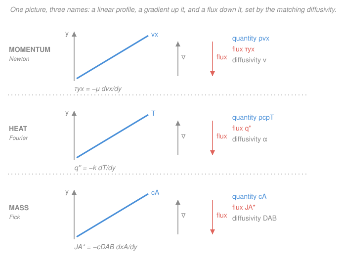

# Transport Phenomena · Lesson 1.1: One flux law, three transports

> ⏱ ~15 min · Module 1: The grand analogy and molecular transport · Builds on: [`heat-transfer` 1.1 (three modes, Fourier's law)](../../heat-transfer/lessons/01-01-three-modes-fouriers-law.md), [`fluid-dynamics` 1.6 (Navier–Stokes)](../../fluid-dynamics/lessons/01-06-navier-stokes.md) · Unlocks: [1.2 (Newton's law of viscosity)](01-02-momentum-transport-newton-viscosity.md), and the whole course

## Why this matters

You already know three "flux equals gradient" laws from three different courses: Newton's law of viscosity in fluids, Fourier's law of conduction in heat transfer, and Fick's law of diffusion in mass transfer. This course's one big secret is that these are **not three laws — they are one law wearing three uniforms**. Momentum, heat, and dissolved species all leak *down* their own gradients by the very same molecular mechanism (random molecular motion smearing out differences), so they obey the same equation, get solved by the same shell balance, and collapse onto the same dimensionless groups. Learn the pattern once and you get all of transport phenomena for the price of one. This first lesson installs that pattern; every later lesson is a variation on it.

## The idea

Picture a crowd of molecules jiggling randomly. Wherever some property is *piled up on one side* — fast-moving molecules on top, hot molecules on the left, salty water at the bottom — random motion carries molecules from the crowded side to the empty side more often than the reverse, simply because there are more of them to send. The pile spreads out. That spreading is **diffusion**, and it always runs *downhill*: from where there's a lot of the stuff to where there's little.

Three different "stuffs" can pile up and spread this way:

- **Momentum.** A fast sheet of fluid sliding over a slow one drags it along — fast molecules stray into the slow layer and speed it up. Momentum bleeds from fast to slow. We *feel* that momentum flux as a **shear stress** (friction).
- **Heat.** Hot molecules jostle their cooler neighbors, handing over kinetic energy. Thermal energy bleeds from hot to cold. We call that flux **heat conduction**.
- **Mass.** A drop of dye in still water wanders outward as its molecules random-walk into empty regions. That species bleeds from concentrated to dilute — **molecular diffusion**.

Same mechanism (random molecular motion), same direction (down the gradient), same mathematical shape. In each case:

$$\text{flux} \;=\; -(\text{diffusivity}) \times (\text{gradient of how much of the stuff is packed per unit volume}).$$

The minus sign says "downhill." The **diffusivity** — a single number with units of $\mathrm{m^2/s}$ — says how fast the smearing happens. That's the whole skeleton of the course.

## The formal version

Let $y$ (meters, m) be a coordinate across which the property varies. Write each flux as a diffusivity times the gradient of the property's **concentration** — its amount per unit volume.

**Momentum (Newton's law of viscosity).** The transported "stuff" is $x$-momentum, and its concentration per unit volume is $\rho v_x$ (density $\rho$ in $\mathrm{kg/m^3}$ times velocity $v_x$ in $\mathrm{m/s}$, so $\rho v_x$ is momentum per volume, $\mathrm{kg\,m^{-2}s^{-1}}$). For constant $\rho$,

$$\tau_{yx} = -\mu\,\frac{dv_x}{dy} = -\nu\,\frac{d(\rho v_x)}{dy}, \qquad \nu \equiv \frac{\mu}{\rho}.$$

*In words: the shear stress $\tau_{yx}$ — the flux of $x$-momentum in the $y$-direction, in $\mathrm{Pa}=\mathrm{N/m^2}$ — equals minus the kinematic viscosity $\nu$ ($\mathrm{m^2/s}$) times the gradient of momentum-per-volume.* Here $\mu$ is the dynamic viscosity ($\mathrm{Pa\,s}$) and $\nu = \mu/\rho$ is the **momentum diffusivity**. (Momentum is a vector, so its flux is really a tensor — that subtlety is [1.2](01-02-momentum-transport-newton-viscosity.md)'s job. Read $\tau_{yx}$ here as "friction.")

**Heat (Fourier's law).** The stuff is thermal energy; its concentration per volume is $\rho c_p T$ (heat capacity $c_p$ in $\mathrm{J\,kg^{-1}K^{-1}}$ times $\rho T$ gives $\mathrm{J/m^3}$). For constant $\rho c_p$,

$$q_y'' = -k\,\frac{dT}{dy} = -\alpha\,\frac{d(\rho c_p T)}{dy}, \qquad \alpha \equiv \frac{k}{\rho c_p}.$$

*In words: the heat flux $q_y''$ ($\mathrm{W/m^2}$) equals minus the thermal diffusivity $\alpha$ ($\mathrm{m^2/s}$) times the gradient of thermal-energy-per-volume.* Here $k$ is the thermal conductivity ($\mathrm{W\,m^{-1}K^{-1}}$) and $\alpha = k/(\rho c_p)$ is the **thermal diffusivity** — the same $\alpha$ from [`heat-transfer` 1.2](../../heat-transfer/lessons/01-02-heat-equation.md).

**Mass (Fick's law).** The stuff is molecules of species $A$; its concentration is literally $c_A$ (moles per volume, $\mathrm{mol/m^3}$). In a dilute mixture of total concentration $c$ with mole fraction $x_A = c_A/c$,

$$J_A^* = -c\,D_{AB}\,\frac{dx_A}{dy} = -D_{AB}\,\frac{dc_A}{dy}\ \text{(dilute, constant }c).$$

*In words: the molar diffusion flux $J_A^*$ ($\mathrm{mol\,m^{-2}s^{-1}}$) equals minus the diffusivity $D_{AB}$ ($\mathrm{m^2/s}$) times the gradient of concentration.* $D_{AB}$ is the **mass diffusivity** of $A$ through $B$ — already Fick's first law from [`materials-science` 2.4](../../materials-science/lessons/02-04-diffusion-i-ficks-first-law.md). The star on $J_A^*$ flags that this flux is measured relative to the mixture's motion (the frames of [4.1](04-01-diffusion-binary-mixtures-fluxes-frames.md)); for now, no bulk flow, so it's just "the diffusion flux."

**The correspondence table** — the spine of the whole course. Read every future lesson by asking "which column am I in?"

| | Momentum | Heat | Mass |
|---|---|---|---|
| Conserved "stuff" | $x$-momentum | thermal energy | moles of $A$ |
| Concentration (per volume) | $\rho v_x$ | $\rho c_p T$ | $c_A$ |
| Flux | shear stress $\tau_{yx}$ | heat flux $q_y''$ | molar flux $J_A^*$ |
| Diffusivity ($\mathrm{m^2/s}$) | $\nu=\mu/\rho$ | $\alpha=k/(\rho c_p)$ | $D_{AB}$ |
| Flux law | Newton | Fourier | Fick |
| Named after | $\tau_{yx}=-\mu\,dv_x/dy$ | $q_y''=-k\,dT/dy$ | $J_A^*=-cD_{AB}\,dx_A/dy$ |

Every diffusivity is an $\mathrm{m^2/s}$. That is not a coincidence — it's the fingerprint of the shared mechanism, and in gases the three are even numerically close (Lesson [1.5](01-05-three-diffusivities-pr-sc-le.md), the $Pr$, $Sc$, $Le$ story).

**Molecular vs. convective transport.** Diffusion is only *half* of how the stuff moves. There are two mechanisms:

- **Molecular (diffusive) transport** — the down-gradient leak above. It happens even in perfectly still fluid, driven purely by random molecular motion. This is what the flux laws describe.
- **Convective transport** — the stuff is simply *carried along* by bulk flow, like a leaf on a river. If fluid with concentration (per volume) $\psi$ moves at velocity $v_y$, the convective flux across a surface is $\psi\,v_y$ — no gradient required, no diffusivity involved.

Total flux $=$ molecular $+$ convective. In a heated pipe, conduction (molecular) *and* the flowing water carrying warm fluid downstream (convective) both move heat; that sum is exactly what "convection" means in [`heat-transfer` 3.1](../../heat-transfer/lessons/03-01-convection-coefficient-boundary-layers.md). Keeping these two contributions straight is the bookkeeping behind every equation of change in Module 2.

## Picture

The same diagram, drawn three times: a straight profile of the concentration, a gradient pointing *up* it, and the flux pointing *down* it, governed by that transport's diffusivity.

## Worked examples

**Example 1 (name the pieces — a heated, moving wall).** A wide flat plate sits at the bottom of a thin liquid layer of thickness $b$. The plate is dragged sideways at speed $V$ and held hot at temperature $T_0$; the free surface above is stationary and cooler at $T_b$. The liquid also carries a trace of dissolved species $A$, kept at concentration $c_{A0}$ at the plate and $c_{Ab}$ at the top. In steady state each profile is *linear* across the gap (constant-flux, no sources — the simplest case). Identify all three transports.

- **Momentum.** The moving wall drags the fluid, so $v_x$ falls linearly from $V$ at the plate to $0$ at the top: $dv_x/dy = -V/b$. Momentum flux (the drag the fluid exerts, i.e. the shear stress):
$$\tau_{yx} = -\mu\,\frac{dv_x}{dy} = -\mu\left(\frac{-V}{b}\right) = \frac{\mu V}{b}.$$
Governing diffusivity: $\nu = \mu/\rho$. (This linear profile is plane **Couette flow** — see [`fluid-dynamics` 3.2](../../fluid-dynamics/lessons/03-02-couette-poiseuille.md).)

- **Heat.** Temperature falls linearly from $T_0$ to $T_b$: $dT/dy=(T_b-T_0)/b$. Heat flux:
$$q_y'' = -k\,\frac{dT}{dy} = -k\,\frac{T_b-T_0}{b} = \frac{k(T_0-T_b)}{b}.$$
Governing diffusivity: $\alpha = k/(\rho c_p)$. Positive $q_y''$ (with $T_0>T_b$) means heat flows *up*, away from the hot wall — correct.

- **Mass.** Concentration falls linearly from $c_{A0}$ to $c_{Ab}$: 
$$J_A^* = -D_{AB}\,\frac{dc_A}{dy} = \frac{D_{AB}(c_{A0}-c_{Ab})}{b}.$$
Governing diffusivity: $D_{AB}$.

Three fluxes, three diffusivities, one template — read straight off the correspondence table. *Sanity check:* each flux is "(diffusivity-group) $\times$ (driving difference) $/$ (gap)," and each is positive in the direction from high concentration to low, exactly as diffusion should be.

**Example 2 (dimensional check — the pattern is unit-consistent).** Show that flux $=-(\text{diffusivity})\times(\text{gradient of concentration})$ balances units in all three columns. A diffusivity is always $\mathrm{m^2/s}$; a gradient of concentration is $(\text{concentration})/\mathrm{m}$. So the product is

$$[\text{diffusivity}]\times[\text{gradient of concentration}] = \frac{\mathrm{m^2}}{\mathrm{s}}\cdot\frac{[\text{concentration}]}{\mathrm{m}} = \frac{\mathrm{m}}{\mathrm{s}}\cdot[\text{concentration}] = [\text{concentration}]\cdot\frac{\mathrm{m}}{\mathrm{s}},$$

which is exactly "how much stuff crosses a unit area per unit time" — a flux. Check each:

- **Momentum:** $\nu\,\dfrac{d(\rho v_x)}{dy}\to \dfrac{\mathrm{m^2}}{\mathrm{s}}\cdot\dfrac{\mathrm{kg\,m^{-2}s^{-1}}}{\mathrm{m}} = \mathrm{kg\,m^{-1}s^{-2}} = \dfrac{\mathrm{N}}{\mathrm{m^2}}=\mathrm{Pa}.$ ✓ (a stress)
- **Heat:** $\alpha\,\dfrac{d(\rho c_p T)}{dy}\to \dfrac{\mathrm{m^2}}{\mathrm{s}}\cdot\dfrac{\mathrm{J/m^3}}{\mathrm{m}} = \dfrac{\mathrm{J}}{\mathrm{m^2\,s}} = \dfrac{\mathrm{W}}{\mathrm{m^2}}.$ ✓ (a heat flux)
- **Mass:** $D_{AB}\,\dfrac{dc_A}{dy}\to \dfrac{\mathrm{m^2}}{\mathrm{s}}\cdot\dfrac{\mathrm{mol/m^3}}{\mathrm{m}} = \dfrac{\mathrm{mol}}{\mathrm{m^2\,s}}.$ ✓ (a molar flux)

*Sanity check:* every result is "[the stuff] per $\mathrm{m^2}$ per $\mathrm{s}$" — the definition of a flux of that stuff. The units line up *because* the shared skeleton is real, not a mnemonic.

## Watch out

- **You might think these are three separate laws to memorize.** Actually they're one template with three fillings. Don't memorize Newton, Fourier, and Fick as unrelated facts — memorize "flux $=-$ diffusivity $\times$ gradient of concentration" and the correspondence table, then fill in the column you need.
- **You might think the gradient is of the raw field ($v_x$, $T$, $c_A$).** For the unified statement it's the gradient of the **concentration per volume** ($\rho v_x$, $\rho c_p T$, $c_A$). It only *looks* like $dv_x/dy$ or $dT/dy$ because $\rho$, $c_p$ are pulled out as constants — that's precisely what converts $\mu\to\nu$ and $k\to\alpha$. When properties vary with position, the concentration form is the honest one.
- **You might think the flux law is the whole story of how stuff moves.** It's only the *molecular* (diffusive) half. Bulk flow *convects* stuff with no gradient at all. Total transport is molecular $+$ convective, and forgetting the convective term is the classic error when you first write an equation of change (Module 2).
- **You might drop the minus sign.** It encodes the Second Law: stuff spontaneously flows from high to low concentration, never the reverse. A flux law with a $+$ would have heat pooling into the hot spot — physically impossible.

## One-liner

> Momentum, heat, and mass are one phenomenon in three costumes: each flux is minus a diffusivity (always $\mathrm{m^2/s}$) times the gradient of that quantity's concentration — Newton, Fourier, and Fick are the same sentence.

## Problems

**P1 (🟢)** Fill in the flux, the concentration-per-volume, and the diffusivity (with SI units) for each column of the correspondence table from memory, then state in one sentence what the minus sign means physically.

**P2 (🟡)** Air at $300\ \mathrm{K}$ flows over a flat plate. Right at the wall the measured gradients are $dv_x/dy = 500\ \mathrm{s^{-1}}$, $dT/dy = -2000\ \mathrm{K/m}$ (temperature drops moving away from the hot wall), and for a trace vapor $dc_A/dy = -0.8\ \mathrm{mol\,m^{-4}}$. Using $\mu = 1.85\times10^{-5}\ \mathrm{Pa\,s}$, $k = 0.026\ \mathrm{W\,m^{-1}K^{-1}}$, $D_{AB}=2.5\times10^{-5}\ \mathrm{m^2/s}$, compute the wall shear stress $\tau_{yx}$, the wall heat flux $q_y''$, and the wall molar flux $J_A^*$. State the direction of each flux relative to the wall.

**P3 (🔴)** The kinematic viscosity, thermal diffusivity, and mass diffusivity are all $\mathrm{m^2/s}$. (a) Using dimensional analysis alone, argue that a diffusivity $\mathcal{D}$, a length $L$, and a time $t$ must be related by a dimensionless combination of the form $\mathcal{D}\,t/L^2$. (b) A dye blob spreads a distance $L\sim 1\ \mathrm{cm}$ in water ($D_{AB}\approx10^{-9}\ \mathrm{m^2/s}$). Estimate the time by setting $\mathcal{D}\,t/L^2 \sim 1$. Does the answer explain why you stir your coffee instead of waiting?

Solutions

**P1** From the table:

| | Momentum | Heat | Mass |
|---|---|---|---|
| Flux | $\tau_{yx}$ ($\mathrm{Pa}$) | $q_y''$ ($\mathrm{W/m^2}$) | $J_A^*$ ($\mathrm{mol\,m^{-2}s^{-1}}$) |
| Concentration/vol | $\rho v_x$ ($\mathrm{kg\,m^{-2}s^{-1}}$) | $\rho c_p T$ ($\mathrm{J/m^3}$) | $c_A$ ($\mathrm{mol/m^3}$) |
| Diffusivity | $\nu$ ($\mathrm{m^2/s}$) | $\alpha$ ($\mathrm{m^2/s}$) | $D_{AB}$ ($\mathrm{m^2/s}$) |

The minus sign means the flux points *down* the gradient — stuff flows from high concentration to low, the direction of spontaneous, entropy-increasing spreading.

**P2** Apply each flux law directly.

Momentum: $\tau_{yx} = -\mu\,\dfrac{dv_x}{dy} = -(1.85\times10^{-5})(500) = -9.25\times10^{-3}\ \mathrm{Pa}.$ The sign: $v_x$ increases away from the wall, so momentum diffuses *toward* the wall (the fluid drags on the plate) — flux in the $-y$ direction.

Heat: $q_y'' = -k\,\dfrac{dT}{dy} = -(0.026)(-2000) = +52\ \mathrm{W/m^2}.$ Positive: heat flows in $+y$, *away* from the hot wall into the air. ✓

Mass: $J_A^* = -D_{AB}\,\dfrac{dc_A}{dy} = -(2.5\times10^{-5})(-0.8) = +2.0\times10^{-5}\ \mathrm{mol\,m^{-2}s^{-1}}.$ Positive: species $A$ diffuses in $+y$, away from the wall, since $c_A$ is highest at the wall.

*Check.* Units: $\mathrm{Pa\,s}\cdot\mathrm{s^{-1}}=\mathrm{Pa}$ ✓; $\mathrm{W\,m^{-1}K^{-1}}\cdot\mathrm{K\,m^{-1}}=\mathrm{W/m^2}$ ✓; $\mathrm{m^2\,s^{-1}}\cdot\mathrm{mol\,m^{-4}}=\mathrm{mol\,m^{-2}s^{-1}}$ ✓. All three fluxes point down their own gradients, as diffusion must.

**P3** (a) The only dimensions in play are length $L$ ($\mathrm{m}$) and time $t$ ($\mathrm{s}$); a diffusivity is $[\mathcal{D}]=\mathrm{m^2/s}$. Seek a dimensionless group $\mathcal{D}^a L^b t^c$: dimensions $(\mathrm{m^2 s^{-1}})^a\,\mathrm{m}^b\,\mathrm{s}^c = \mathrm{m}^{2a+b}\,\mathrm{s}^{-a+c}$. Dimensionless requires $2a+b=0$ and $-a+c=0$, so $b=-2a$, $c=a$. Taking $a=1$ gives the group $\mathcal{D}\,t/L^2$ — the only dimensionless combination. (This is the seed of the **Fourier number** $Fo$; it recurs for heat and mass in [4.4](04-04-transient-multidimensional-diffusion.md).)

(b) Setting $\dfrac{D_{AB}\,t}{L^2}\sim 1$ gives $t \sim \dfrac{L^2}{D_{AB}} = \dfrac{(10^{-2}\ \mathrm{m})^2}{10^{-9}\ \mathrm{m^2/s}} = \dfrac{10^{-4}}{10^{-9}}\ \mathrm{s} = 10^{5}\ \mathrm{s} \approx 28\ \mathrm{hours}.$

*Check.* Units: $\mathrm{m^2}/(\mathrm{m^2/s})=\mathrm{s}$ ✓. Pure molecular diffusion would take *over a day* to mix dye across a coffee cup — so you stir, adding **convective** transport, which does the job in seconds. That contrast (slow molecular diffusion, fast convection) is exactly the two-mechanism split from "The idea," and it motivates every convection lesson in Module 3. The $t\propto L^2$ scaling is why diffusion is quick over microns but hopeless over centimeters.

## Connections

- **Backward:** this unifies three laws you met separately — Newton's viscosity underneath [`fluid-dynamics` 1.6 (Navier–Stokes)](../../fluid-dynamics/lessons/01-06-navier-stokes.md), [`heat-transfer` 1.1 (Fourier)](../../heat-transfer/lessons/01-01-three-modes-fouriers-law.md), and Fick's law from [`materials-science` 2.4](../../materials-science/lessons/02-04-diffusion-i-ficks-first-law.md). If any felt like an isolated formula before, the correspondence table is the reason they always rhymed.
- **Forward:** [1.2](01-02-momentum-transport-newton-viscosity.md) unpacks the momentum column (why shear stress is *really* a momentum flux, and a tensor); [1.3](01-03-heat-mass-fluxes-fourier-fick.md) does heat and mass side by side; [1.5](01-05-three-diffusivities-pr-sc-le.md) compares the three diffusivities via $Pr$, $Sc$, $Le$. The molecular-vs-convective split set up here becomes the four equations of change in Module 2, where "total flux $=$ molecular $+$ convective" is written out term by term.
- **Sideways:** the same "flux $=-$ diffusivity $\times$ gradient" template governs electrical conduction (Ohm's law, current $=-\sigma\,\nabla V$) and Darcy flow in porous media — transport thinking reaches well beyond these three columns. And the lone dimensionless group $\mathcal{D}t/L^2$ from P3 is the **Fourier number**, the star of every transient-diffusion chart in [`heat-transfer` 2.3](../../heat-transfer/lessons/02-03-finite-bodies-heisler.md), reused for mass with $\alpha\to D_{AB}$.
