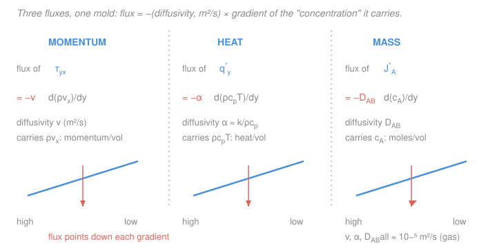

# Transport Phenomena · Lesson 1.3: Heat and mass fluxes — Fourier and Fick in the same mold

> ⏱ ~15 min · Module 1: The molecular origin of transport · Builds on: [1.2 Momentum transport and Newton's law](01-02-momentum-transport-newton-viscosity.md), [`heat-transfer` 1.1 (Fourier's law)](../../heat-transfer/lessons/01-01-three-modes-fouriers-law.md), [`materials-science` 2.4 (Fick's first law)](../../materials-science/lessons/02-04-diffusion-i-ficks-first-law.md) · Unlocks: [1.4 Transport properties from kinetic theory](01-04-transport-properties-kinetic-theory.md), [1.5 The three diffusivities](01-05-three-diffusivities-pr-sc-le.md), Module 4

## Why this matters

In [1.2](01-02-momentum-transport-newton-viscosity.md) you saw momentum obey a startlingly simple rule: flux equals a diffusivity times a gradient. That was one leg of a tripod. This lesson snaps the other two legs — **heat** (Fourier's law) and **mass** (Fick's law) — into the *exact same shape*. You have met both before, in [`heat-transfer` 1.1](../../heat-transfer/lessons/01-01-three-modes-fouriers-law.md) and [`materials-science` 2.4](../../materials-science/lessons/02-04-diffusion-i-ficks-first-law.md), but there each stood alone as "the law for its subject." The payoff of transport phenomena is seeing that all three are *one equation wearing three costumes* — so a temperature profile you solved in heat transfer is, letter for letter, a concentration profile you never have to solve again. Learn the mold once; pour anything into it.

## The idea

Diffusive transport always needs the same two ingredients: **something that piles up unevenly**, and **random molecular motion that erases the unevenness**. The random jostling is blind — it doesn't "want" to move anything anywhere — but wherever a quantity is more crowded on one side, more molecules happen to carry it *out* of the crowd than back in. The net drift is always from crowded to sparse, at a rate set by how steep the crowding is.

The only thing that changes between the three transports is *what* is crowded:

- **Momentum:** fast-moving fluid layers sit next to slow ones. Molecules crossing between them carry their $x$-momentum along, dragging the fast layer down and the slow layer up. The "stuff" that diffuses is momentum-per-volume, $\rho v_x$.
- **Heat:** hot regions sit next to cold. Molecules carry their thermal energy across, warming the cold side. The stuff that diffuses is thermal-energy-per-volume, $\rho c_p T$.
- **Mass:** one species is concentrated on one side. Molecules random-walk across, evening it out. The stuff that diffuses is the species' concentration, $c_A$.

Same mechanism, same math. Each obeys **flux = −(diffusivity) × (gradient of what's crowded)**, and — the punchline that makes this a *course* and not three unrelated laws — all three diffusivities carry the identical units, $\mathrm{m^2/s}$.

## The formal version

**Fourier's law (heat).** The heat flux in the $y$-direction is

$$q_y'' = -k\,\frac{dT}{dy}.$$

*In words: heat flows toward cold, at a rate equal to conductivity times the temperature slope.* Here $q_y''$ is the heat flux ($\mathrm{W/m^2}$, energy per area per time), $k$ is the **thermal conductivity** ($\mathrm{W/(m\cdot K)}$), and $dT/dy$ is the temperature gradient ($\mathrm{K/m}$). Now divide and multiply the right side by $\rho c_p$ (density $\rho$ in $\mathrm{kg/m^3}$, specific heat $c_p$ in $\mathrm{J/(kg\cdot K)}$), both taken constant:

$$q_y'' = -\underbrace{\frac{k}{\rho c_p}}_{\alpha}\,\frac{d(\rho c_p T)}{dy}, \qquad \boxed{\ \alpha \equiv \frac{k}{\rho c_p}\ }\ \ (\mathrm{m^2/s}).$$

*In words: heat flux is a diffusivity $\alpha$ times the gradient of $\rho c_p T$ — the "concentration of thermal energy," in $\mathrm{J/m^3}$.* $\alpha$ is the **thermal diffusivity**: not how *much* heat a material holds or conducts, but how fast a temperature disturbance *spreads*. (This is the same $\alpha$ that governs the transient heat equation in [`heat-transfer` 1.2](../../heat-transfer/lessons/01-02-heat-equation.md) — now revealed as one of three siblings.)

**Fick's first law (mass).** For species $A$ diffusing through a binary mixture with species $B$, the **molar** diffusive flux (relative to the molar-average velocity of the mixture — the frame that moves *with* the flowing mixture) is

$$J_A^{*} = -c\,D_{AB}\,\frac{dx_A}{dy},$$

where $c$ is the total molar concentration of the mixture ($\mathrm{mol/m^3}$), $x_A$ is the mole fraction of $A$ (dimensionless), and $D_{AB}$ is the **binary diffusivity** ($\mathrm{m^2/s}$). If $c$ is constant, $c\,dx_A = dc_A$ (with $c_A = c x_A$ the molar concentration of $A$), so this collapses to the clean form

$$\boxed{\ J_A^{*} = -D_{AB}\,\frac{dc_A}{dy}\ }.$$

*In words: species $A$ drifts down its own concentration gradient, at a rate $D_{AB}$ times the slope of $c_A$.* On a **mass** basis the twin law reads $j_A = -\rho D_{AB}\,d\omega_A/dy$, with mass density $\rho$ and mass fraction $\omega_A$. The molar-vs-mass bookkeeping (and the "relative to which velocity?" fine print) is a real subtlety we handle fully in [4.1](04-01-diffusion-binary-mixtures-fluxes-frames.md) — for now just note **there are two bases, and the diffusivity $D_{AB}$ is the same in both.**

**Lining up the trio.** Rewrite momentum's law from [1.2](01-02-momentum-transport-newton-viscosity.md), $\tau_{yx} = -\mu\,dv_x/dy$, the same way — divide and multiply by $\rho$ using the **kinematic viscosity** $\nu \equiv \mu/\rho$:

$$
\tau_{yx} = -\nu\,\frac{d(\rho v_x)}{dy}, \qquad
q_y'' = -\alpha\,\frac{d(\rho c_p T)}{dy}, \qquad
J_A^{*} = -D_{AB}\,\frac{dc_A}{dy}.
$$

*In words: three fluxes, each equal to a diffusivity ($\nu$, $\alpha$, or $D_{AB}$ — all $\mathrm{m^2/s}$) times the gradient of a "concentration of the conserved quantity."* This is not an analogy by decoration; it is the **same equation**. Whenever you solve one — a velocity profile, a temperature profile, a concentration profile — the algebra transfers to the other two by swapping which diffusivity and which "concentration" you write down. That single fact is the engine of the whole course.

| Transport | Flux | Diffusivity ($\mathrm{m^2/s}$) | "Concentration" that diffuses | Its units |
|---|---|---|---|---|
| Momentum | $\tau_{yx}$ | $\nu = \mu/\rho$ | $\rho v_x$ (momentum/volume) | $\mathrm{kg/(m^2\,s)}$ |
| Heat | $q_y''$ | $\alpha = k/\rho c_p$ | $\rho c_p T$ (energy/volume) | $\mathrm{J/m^3}$ |
| Mass | $J_A^{*}$ | $D_{AB}$ | $c_A$ (moles/volume) | $\mathrm{mol/m^3}$ |

## Picture

## Worked examples

**Example 1 (one arithmetic template, two subjects).** Watch the *same three keystrokes* — property × drop ÷ thickness — solve a heat problem and a mass problem back to back.

*Heat (Fourier).* A single glass pane, $k = 0.8\ \mathrm{W/(m\cdot K)}$, thickness $L = 5\ \mathrm{mm} = 0.005\ \mathrm{m}$, holds a temperature drop of $\Delta T = 20\ \mathrm{K}$ across it. At steady state the profile is linear, so $dT/dy = -\Delta T/L$ and

$$q_y'' = k\,\frac{\Delta T}{L} = 0.8 \times \frac{20}{0.005} = 3200\ \mathrm{W/m^2}.$$

*Mass (Fick).* $\mathrm{CO_2}$ diffuses across a stagnant air gap of the same thickness $L = 5\ \mathrm{mm}$, with binary diffusivity $D_{AB} = 1.6\times10^{-5}\ \mathrm{m^2/s}$. The mole fraction of $\mathrm{CO_2}$ drops from $x_{A1} = 0.05$ to $x_{A2} = 0.01$; with total concentration $c = 40.6\ \mathrm{mol/m^3}$ (air at 1 atm, 300 K, from $c = P/RT$), the molar concentrations are $c_{A1} = c x_{A1} = 2.03$ and $c_{A2} = 0.41\ \mathrm{mol/m^3}$, a drop of $\Delta c_A = 1.62\ \mathrm{mol/m^3}$. Then

$$J_A^{*} = D_{AB}\,\frac{\Delta c_A}{L} = 1.6\times10^{-5} \times \frac{1.62}{0.005} = 5.2\times10^{-3}\ \mathrm{mol/(m^2\,s)}.$$

Notice the two computations are **the same sentence**: (diffusivity or conductivity) × (drop) ÷ (thickness). Only the labels on the quantities changed.

*Check.* Fourier units: $\mathrm{\tfrac{W}{m\cdot K}\cdot\tfrac{K}{m}} = \mathrm{W/m^2}$ ✓. Fick units: $\mathrm{\tfrac{m^2}{s}\cdot\tfrac{mol/m^3}{m}} = \mathrm{mol/(m^2\,s)}$ ✓. Both fluxes point from the high side to the low side, as the minus signs guarantee. ✓

**Example 2 (why the diffusivities are cousins — compute $\alpha$ and $D_{AB}$ for air).** For air near 300 K: $k = 0.0263\ \mathrm{W/(m\cdot K)}$, $\rho = 1.18\ \mathrm{kg/m^3}$, $c_p = 1007\ \mathrm{J/(kg\cdot K)}$. The thermal diffusivity is

$$\alpha = \frac{k}{\rho c_p} = \frac{0.0263}{1.18 \times 1007} = 2.2\times10^{-5}\ \mathrm{m^2/s}.$$

The binary diffusivity of $\mathrm{CO_2}$ in air (Example 1) is $D_{AB} = 1.6\times10^{-5}\ \mathrm{m^2/s}$. And the kinematic viscosity of air is $\nu = \mu/\rho = 1.85\times10^{-5}/1.18 = 1.6\times10^{-5}\ \mathrm{m^2/s}$. **All three land within a factor of ~1.5 of $10^{-5}\ \mathrm{m^2/s}$.** That is not a coincidence: in a gas the *same* molecules, moving at the *same* thermal speed over the *same* mean free path, carry momentum, energy, and mass alike (the kinetic-theory story of [1.4](01-04-transport-properties-kinetic-theory.md)). Their ratios are therefore all $\approx 1$ — e.g. the Lewis number $Le = \alpha/D_{AB} = 2.2/1.6 \approx 1.4$ — which is exactly the setup for [1.5](01-05-three-diffusivities-pr-sc-le.md), where $Pr$, $Sc$, and $Le$ get their own lesson.

*Check.* $\alpha$ units: $\mathrm{\tfrac{W/(m\cdot K)}{(kg/m^3)(J/(kg\cdot K))}} = \mathrm{\tfrac{J/(s\cdot m\cdot K)}{J/(m^3\cdot K)}} = \mathrm{m^2/s}$ ✓. All three diffusivities share units $\mathrm{m^2/s}$, which is *why* it's even meaningful to compare their sizes. ✓

## Watch out

- **You might think Fourier's "concentration" $\rho c_p T$ is contrived.** It isn't — it is genuinely the thermal energy stored per unit volume ($\mathrm{J/m^3}$), just as $c_A$ is moles per unit volume and $\rho v_x$ is momentum per unit volume. Writing $q_y'' = -\alpha\,d(\rho c_p T)/dy$ instead of $-k\,dT/dy$ is legitimate *only when $\rho c_p$ is constant* so it can slide inside the derivative; if properties vary strongly with position, keep the $-k\,dT/dy$ form and let $k$ carry the variation.
- **You might mix up the molar and mass bases of Fick's law.** $J_A^{*}$ (molar) and $j_A$ (mass) are different quantities in different frames; the diffusivity $D_{AB}$ is common, but the "concentration" ($c_A$ vs $\rho\omega_A$) and the reference velocity differ. Don't equate them casually — that reconciliation is the whole job of [4.1](04-01-diffusion-binary-mixtures-fluxes-frames.md).
- **You might read a big $k$ as a big $\alpha$.** They answer different questions. $k$ (or $\mu$, or $D_{AB}$) sets *how much* flux a given gradient drives; the diffusivity ($\alpha$, $\nu$, $D_{AB}$) sets *how fast a disturbance spreads*. Copper conducts far better than wood, but a material can conduct well yet spread temperature slowly if it also stores a lot of heat (large $\rho c_p$ shrinks $\alpha$).

## One-liner

> Momentum, heat, and mass all obey flux $= -(\text{diffusivity})\times\dfrac{d(\text{concentration})}{dy}$ with $\nu$, $\alpha$, $D_{AB}$ all in $\mathrm{m^2/s}$ — one equation, three costumes, so one solution serves all three.

## Problems

**P1 (🟢)** A brick wall, $k = 0.72\ \mathrm{W/(m\cdot K)}$, is $0.12\ \mathrm{m}$ thick with faces at $22^\circ\mathrm{C}$ and $2^\circ\mathrm{C}$. (a) Find the heat flux. (b) Given $\rho = 1920\ \mathrm{kg/m^3}$ and $c_p = 835\ \mathrm{J/(kg\cdot K)}$, find the thermal diffusivity $\alpha$.

**P2 (🟡)** Water vapor ($A$) diffuses through a $3\ \mathrm{mm}$ stagnant-air film, $D_{AB} = 2.6\times10^{-5}\ \mathrm{m^2/s}$. The molar concentration of vapor is $c_{A1} = 0.90\ \mathrm{mol/m^3}$ at the wet surface and $c_{A2} = 0.30\ \mathrm{mol/m^3}$ at the outer edge. Find the molar diffusive flux $J_A^{*}$. Then state, without re-deriving, which heat-transfer quantity plays the role of $c_A$ and which plays the role of $D_{AB}$ in the matching Fourier calculation.

**P3 (🔴)** Two slabs of equal thickness are welded face to face. Slab 1: $k_1 = 400$, $\rho_1 c_{p,1} = 3.4\times10^{6}\ \mathrm{J/(m^3\cdot K)}$ (copper). Slab 2: $k_2 = 0.15$, $\rho_2 c_{p,2} = 1.9\times10^{6}\ \mathrm{J/(m^3\cdot K)}$ (rubber). Which slab has the larger $\alpha$, and by roughly what factor? Interpret: if you suddenly heat one face, in which slab does the temperature signal race to the far side first?

Solutions

**P1** (a) $\Delta T = 22 - 2 = 20\ \mathrm{K}$ (a temperature *difference* is identical in $^\circ\mathrm{C}$ and K), thickness $L = 0.12\ \mathrm{m}$:

$$q_y'' = k\,\frac{\Delta T}{L} = 0.72 \times \frac{20}{0.12} = 120\ \mathrm{W/m^2}.$$

(b) $\displaystyle \alpha = \frac{k}{\rho c_p} = \frac{0.72}{1920 \times 835} = \frac{0.72}{1.60\times10^{6}} = 4.5\times10^{-7}\ \mathrm{m^2/s}.$

*Check.* Flux units $\mathrm{\tfrac{W}{m\cdot K}\tfrac{K}{m}} = \mathrm{W/m^2}$ ✓. Brick's $\alpha \sim 10^{-7}$ is ~50× smaller than a gas's $\sim 10^{-5}$ — solids store a lot of heat per volume, so temperature spreads sluggishly. ✓

**P2** Linear profile across the film, $\Delta c_A = 0.90 - 0.30 = 0.60\ \mathrm{mol/m^3}$, $L = 3\ \mathrm{mm} = 0.003\ \mathrm{m}$:

$$J_A^{*} = D_{AB}\,\frac{\Delta c_A}{L} = 2.6\times10^{-5} \times \frac{0.60}{0.003} = 5.2\times10^{-3}\ \mathrm{mol/(m^2\,s)}.$$

Mapping to Fourier: the species concentration $c_A$ plays the role of the *thermal-energy concentration* $\rho c_p T$, and the binary diffusivity $D_{AB}$ plays the role of the *thermal diffusivity* $\alpha$ (both $\mathrm{m^2/s}$). Equivalently, if you prefer the "$k$-form," $D_{AB}$ maps to $k$ and $c_A$ maps to $T$.

*Check.* Units $\mathrm{\tfrac{m^2}{s}\tfrac{mol/m^3}{m}} = \mathrm{mol/(m^2\,s)}$ ✓. Flux runs from the wet surface (high $c_A$) outward (low $c_A$), matching a drying surface losing vapor. ✓

**P3** Compute each diffusivity:

$$\alpha_1 = \frac{400}{3.4\times10^{6}} = 1.18\times10^{-4}\ \mathrm{m^2/s}, \qquad \alpha_2 = \frac{0.15}{1.9\times10^{6}} = 7.9\times10^{-8}\ \mathrm{m^2/s}.$$

$$\frac{\alpha_1}{\alpha_2} = \frac{1.18\times10^{-4}}{7.9\times10^{-8}} \approx 1.5\times10^{3}.$$

Copper's thermal diffusivity is about **1500× larger**, so a temperature signal reaches the far face of the copper slab first — dramatically sooner. The lesson: what governs how fast a thermal disturbance *propagates* is $\alpha = k/\rho c_p$, not $k$ alone. Copper wins on both counts here (huge $k$, and its $\rho c_p$ isn't much bigger than rubber's), but the diffusivity is the honest measure of speed.

*Check.* Both $\alpha$ in $\mathrm{m^2/s}$ ✓. Copper $\alpha \sim 10^{-4}$ is the largest common-solid value; rubber $\sim 10^{-7}$ is insulator-typical — the 3-order spread is why one feels cold (whisks heat from your hand) and the other feels warm. ✓

## Flashback

**From Lesson 1.2 (Momentum transport and Newton's law of viscosity):** A flat plate is dragged at $V = 0.30\ \mathrm{m/s}$ across a $b = 2\ \mathrm{mm}$ film of oil ($\mu = 0.10\ \mathrm{Pa\cdot s}$, $\rho = 900\ \mathrm{kg/m^3}$) covering a stationary surface (planar Couette flow). Find the momentum flux $\tau_{yx}$ transferred through the oil, and the kinematic viscosity $\nu$. Then name, in the Fourier/Fick language of this lesson, what "concentration" is being transported.

Solution

In steady Couette flow the velocity varies linearly, $v_x(y) = Vy/b$, so the gradient is constant, $dv_x/dy = V/b$. Newton's law gives

$$\tau_{yx} = \mu\,\frac{V}{b} = 0.10 \times \frac{0.30}{0.002} = 15\ \mathrm{Pa}.$$

The kinematic viscosity — the *momentum* diffusivity — is

$$\nu = \frac{\mu}{\rho} = \frac{0.10}{900} = 1.1\times10^{-4}\ \mathrm{m^2/s}.$$

In this lesson's mold, $\tau_{yx} = -\nu\,d(\rho v_x)/dy$: the quantity being transported is the **$x$-momentum per unit volume**, $\rho v_x$ ($\mathrm{kg/(m^2\,s)}$). Fast fluid near the moving plate is "crowded" with momentum; molecular motion shuttles that momentum down to the slow fluid, exactly as it shuttles heat down a temperature gradient.

*Check.* $\tau$ units: $\mathrm{Pa\cdot s \cdot \tfrac{m/s}{m}} = \mathrm{Pa}$ ✓ (a stress, as a momentum flux must be). $\nu$ units: $\mathrm{\tfrac{Pa\cdot s}{kg/m^3}} = \mathrm{m^2/s}$ ✓ — same units as $\alpha$ and $D_{AB}$, the whole point of the trio. Note this oil's $\nu \sim 10^{-4}$ is ~7× larger than air's $\sim 10^{-5}$: momentum diffuses faster through viscous oil than through thin air. ✓

## Connections

- **Backward:** this completes the flux-law trio begun with momentum in [1.2](01-02-momentum-transport-newton-viscosity.md), and recasts the standalone laws of [`heat-transfer` 1.1](../../heat-transfer/lessons/01-01-three-modes-fouriers-law.md) and [`materials-science` 2.4](../../materials-science/lessons/02-04-diffusion-i-ficks-first-law.md) as two faces of one mold. The linear-profile shortcut used in both worked examples is the steady-state result from those lessons.
- **Forward:** [1.4](01-04-transport-properties-kinetic-theory.md) explains *why* $\nu$, $\alpha$, $D_{AB}$ are all $\sim 10^{-5}\ \mathrm{m^2/s}$ for gases (one molecular speed, one mean free path carries all three); [1.5](01-05-three-diffusivities-pr-sc-le.md) turns their ratios into the dimensionless numbers $Pr = \nu/\alpha$, $Sc = \nu/D_{AB}$, $Le = \alpha/D_{AB}$. The mass-flux frame subtleties flagged here open Module 4, starting with [4.1](04-01-diffusion-binary-mixtures-fluxes-frames.md).
- **Sideways:** because all three obey the identical PDE, the transient temperature charts of [`heat-transfer` 2.2](../../heat-transfer/lessons/02-02-semi-infinite-solid.md)–[2.3](../../heat-transfer/lessons/02-03-finite-bodies-heisler.md) become transient *diffusion* charts by the single swap $\alpha \to D_{AB}$ — a trick we cash in at [4.4](04-04-transient-multidimensional-diffusion.md).
