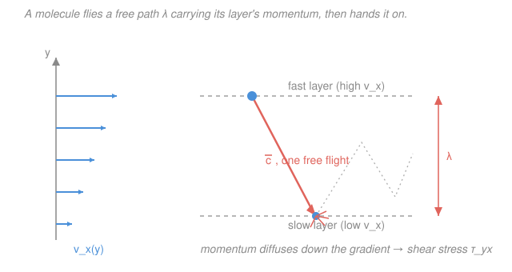

# Transport Phenomena · Lesson 1.4: Where transport properties come from

> ⏱ ~15 min · Module 1: The one flux law · Builds on: [1.3 The three flux laws (Fourier & Fick)](01-03-heat-mass-fluxes-fourier-fick.md), [1.2 Momentum transport & Newton's viscosity](01-02-momentum-transport-newton-viscosity.md) · Unlocks: [1.5 The three diffusivities (Pr, Sc, Le)](01-05-three-diffusivities-pr-sc-le.md), Boss problem 1

## Why this matters

So far $\mu$, $k$, and $D_{AB}$ have been numbers you look up in a table — the proportionality constants in Newton's, Fourier's, and Fick's laws. But *where do they come from*, and why does hot air get **more** viscous while hot honey gets **less**? Kinetic theory answers both in one stroke: it derives all three properties from a single mechanical picture — molecules flying, colliding, and handing off whatever they carry — and hands you their temperature and pressure scaling for free. The payoff is a physicist's superpower: predict how a transport coefficient shifts when you change $T$ or $P$ *without a single new measurement*. That is exactly what you'll need to size equipment at conditions no data table covers.

## The idea

Picture a gas as a swarm of tiny balls in constant flight, each traveling a short hop before it slams into a neighbor. Every ball carries three things with it during that hop: its **momentum** ($\rho v_x$), its **energy** (thermal $c_v T$), and its **identity** (which species it is). When it finally collides, it dumps whatever it was carrying into the new neighborhood and picks up the local value instead.

Now stand this swarm in a **gradient** — say the top is moving fast and the bottom slow (a shear flow). A molecule that last collided up top arrives at the bottom still carrying the *fast* momentum from where it came, and deposits it there, nudging the slow layer forward. Molecules crossing the other way carry slow momentum up. The net effect is that fast momentum leaks downward across the gradient — which is *exactly* what we call viscous shear stress. Swap "momentum" for "thermal energy" and you get heat conduction; swap it for "species label" and you get diffusion. **Same molecules, same flights, same collisions — three transport laws.**

Two numbers set the whole scale: how *far* a molecule flies between collisions (the **mean free path** $\lambda$) and how *fast* it flies (the **mean speed** $\bar c$). Bigger $\lambda$ means each molecule reaches deeper across the gradient before letting go, so it hauls its cargo farther — more transport. That single insight, $\text{property} \sim (\text{stuff carried}) \times \bar c \times \lambda$, is the engine of this whole lesson.

## The formal version

**Mean free path.** Treat molecules as hard spheres of diameter $d$ (m). A molecule sweeps out a collision cylinder of radius $d$; averaging over the relative speeds of all its (moving) targets throws in a $\sqrt2$. With number density $n$ (molecules per m³), the average straight-line distance between collisions is

$$\lambda = \frac{1}{\sqrt2\,\pi d^2 n}.$$

*In words: the more crowded (large $n$) or fatter (large $d$) the molecules, the shorter the free flight.* For air at room conditions $\lambda \approx 70$ nm — hundreds of molecular diameters, so free flight is a good picture.

**Mean speed.** From the Maxwell–Boltzmann distribution, the average molecular speed is

$$\bar c = \sqrt{\frac{8 k_B T}{\pi m}},$$

with Boltzmann's constant $k_B = 1.38\times10^{-23}\ \mathrm{J/K}$, temperature $T$ (K), and molecular mass $m$ (kg). *In words: hotter and lighter molecules move faster* — and the only $T$-dependence is the $\sqrt T$, which is about to drive everything.

**The three kinetic estimates.** A careful bookkeeping of how much cargo crosses a plane per unit time (each molecule carrying the value from one free path away) gives all three coefficients in the *same* form — one-third of "density of the stuff" times $\bar c$ times $\lambda$:

$$\boxed{\;\mu \approx \tfrac13\,\rho\,\bar c\,\lambda \qquad k \approx \tfrac13\,\rho\,c_v\,\bar c\,\lambda \qquad D_{AA} \approx \tfrac13\,\bar c\,\lambda\;}$$

where $\rho = nm$ is the mass density (kg/m³) and $c_v$ is the specific heat at constant volume (J/(kg·K)). *In words: viscosity carries momentum-per-volume $\rho$, conductivity carries energy-per-volume $\rho c_v$, and self-diffusion carries just "count" (density factors out) — but every one is a $\tfrac13(\cdot)\bar c\lambda$.* The $\tfrac13$ comes from averaging molecular directions over the three axes; it is the crude part the rigorous theory later polishes.

**The scaling — the memorable payoff.** For an ideal gas, $n = P/(k_B T)$, so $\rho \propto P/T$ and $\lambda = 1/(\sqrt2\pi d^2 n) \propto T/P$. Feed these in:

$$\mu \approx \tfrac13\rho\bar c\lambda \;\propto\; \underbrace{\frac{P}{T}}_{\rho}\cdot\underbrace{\sqrt T}_{\bar c}\cdot\underbrace{\frac{T}{P}}_{\lambda} \;=\; \sqrt T.$$

Two headlines fall out:

- **Gas viscosity rises as $\sqrt T$ and is independent of pressure.** The $P$ in $\rho$ and the $1/P$ in $\lambda$ cancel exactly — squeeze the gas and you pack in more carriers, but each carries its cargo a proportionally shorter distance. Genuinely surprising, and experimentally true down to quite low pressures.
- **Conductivity $k \propto \sqrt T$ too** (same cancellation; $c_v$ is roughly constant), while **diffusivity $D_{AA} = \tfrac13\bar c\lambda \propto \sqrt T \cdot (T/P) = T^{3/2}/P$** — diffusion *does* thin out with pressure, because it has no $\rho$ to cancel the $\lambda$.

**Liquids are the opposite.** In a liquid the molecules are packed shoulder-to-shoulder; there is no free flight. Momentum moves by molecules *shoving past* their cages, an activated hop over an energy barrier, so $\mu \propto e^{E_a/RT}$ — heating **lowers** viscosity (warm honey pours; that is why). Liquid diffusivity likewise **rises** with $T$ (the Stokes–Einstein $D \propto T/\mu$). Keep the gas and liquid stories separate: for gases hotter is stickier, for liquids hotter is runnier.

**Chapman–Enskog** is the rigorous refinement: solve the Boltzmann equation properly and the crude $\tfrac13$ prefactor is replaced by exact numbers (e.g. $\tfrac{5\pi}{32}\approx 0.49$ for $\mu$) plus a temperature-dependent **collision integral** $\Omega(T)$ that softens the pure $\sqrt T$ into roughly $T^{0.7}$ for real molecules. We won't derive it — but it's the equation behind the viscosity tables, and it inherits every scaling above.

## Picture

## Worked examples

**Example 1 (estimate air's viscosity from scratch).** Take air at $T = 300$ K, $P = 1\ \mathrm{atm} = 1.013\times10^5$ Pa, with $d \approx 3.7\times10^{-10}$ m and $m \approx 4.8\times10^{-26}$ kg. Build $\mu$ from the ground up.

*Number density.* $n = \dfrac{P}{k_B T} = \dfrac{1.013\times10^5}{(1.38\times10^{-23})(300)} = 2.45\times10^{25}\ \mathrm{m^{-3}}.$

*Mean free path.* $\lambda = \dfrac{1}{\sqrt2\,\pi d^2 n} = \dfrac{1}{(1.414)\pi(3.7\times10^{-10})^2(2.45\times10^{25})} = 6.7\times10^{-8}\ \mathrm{m}$ (67 nm).

*Mean speed.* $\bar c = \sqrt{\dfrac{8k_BT}{\pi m}} = \sqrt{\dfrac{8(1.38\times10^{-23})(300)}{\pi(4.8\times10^{-26})}} = \sqrt{2.20\times10^5} = 469\ \mathrm{m/s}$ (about Mach 1.4 — molecules are *fast*).

*Density.* $\rho = nm = (2.45\times10^{25})(4.8\times10^{-26}) = 1.18\ \mathrm{kg/m^3}$ ✓ (matches air).

*Viscosity.* $\mu \approx \tfrac13\rho\bar c\lambda = \tfrac13(1.18)(469)(6.7\times10^{-8}) = 1.2\times10^{-5}\ \mathrm{Pa\,s}.$

The measured value is $1.85\times10^{-5}$ Pa·s. Our back-of-envelope lands within a factor of $1.5$ — remarkable for a model this crude, and the gap is *entirely* the $\tfrac13$ prefactor: swap in Chapman–Enskog's $0.49$ and $1.2\times10^{-5}\times\tfrac{0.49}{0.33} \approx 1.8\times10^{-5}$ Pa·s, essentially exact.

*Units check.* $[\rho\bar c\lambda] = \tfrac{\mathrm{kg}}{\mathrm{m^3}}\cdot\tfrac{\mathrm{m}}{\mathrm{s}}\cdot\mathrm{m} = \tfrac{\mathrm{kg}}{\mathrm{m\,s}} = \mathrm{Pa\,s}$ ✓ (recall $\mathrm{Pa\,s} = \mathrm{kg/(m\,s)}$).

**Example 2 (the pressure-independence check, and the $\sqrt T$ prediction).** Two claims to verify.

*(a) Double the pressure at fixed $T$.* Then $\rho \to 2\rho$ (twice the molecules), but $\lambda \to \lambda/2$ (they collide twice as often), while $\bar c$ is untouched (it depends only on $T$). So

$$\mu \approx \tfrac13(2\rho)\,\bar c\,(\lambda/2) = \tfrac13\rho\bar c\lambda = \mu.$$

The factors of $2$ cancel — **viscosity does not change**. Compressing air makes it no stickier, which is why a viscometer reading is quoted at a temperature but rarely a pressure.

*(b) Raise the temperature $300 \to 600$ K at fixed $P$.* Only the scaling matters: $\mu \propto \sqrt T$, so

$$\mu(600) = \mu(300)\sqrt{\tfrac{600}{300}} = 1.85\times10^{-5}\times\sqrt2 = 2.6\times10^{-5}\ \mathrm{Pa\,s}.$$

The measured value is about $3.0\times10^{-5}$ Pa·s. The pure $\sqrt T$ under-predicts slightly because real molecules are "soft" — at higher speed they interpenetrate a little, so the effective $d$ shrinks and $\lambda$ grows faster than the hard-sphere law; Chapman–Enskog's collision integral captures this as the milder $\mu \propto T^{0.7}$.

*Sanity check.* Both results say heating a gas thickens it — counterintuitive next to liquids, but you can *hear* it: the pitch of a whistling kettle and the drag on high-altitude (cold, thin) aircraft both track gas viscosity's temperature rise, not a pressure effect.

## Watch out

- **You might think squeezing a gas makes it more viscous** (more molecules, surely more drag?). But actually the extra molecules each carry momentum a *shorter* distance, and the two effects cancel — $\mu$ is independent of $P$. This is one of kinetic theory's most famous and best-verified predictions.
- **You might carry the "hot = more viscous" rule over to liquids.** But actually liquids do the *opposite*: no free flight exists, transport is by activated hopping, so heating thins them ($\mu \propto e^{E_a/RT}$). The gas and liquid mechanisms are physically different — don't mix their scalings.
- **You might read $\tfrac13\rho\bar c\lambda$ as an exact law.** It isn't — it's an order-of-magnitude estimate with a crude prefactor. Trust it for *magnitudes and scalings*, not third digits; the tables you look up come from Chapman–Enskog, which fixes the constant but keeps every $T,P$ trend derived here.

## One-liner

> Every transport coefficient is "cargo density $\times$ mean speed $\times$ mean free path" over three — so for a gas $\mu$ and $k$ climb as $\sqrt T$ and ignore pressure, while $D \propto T^{3/2}/P$; liquids run the opposite way.

## Problems

**P1 (🟢)** Helium at $300$ K has $d \approx 2.2\times10^{-10}$ m and $m \approx 6.6\times10^{-27}$ kg. At $1$ atm, estimate its mean free path $\lambda$ and mean speed $\bar c$. (You may reuse $n = 2.45\times10^{25}\ \mathrm{m^{-3}}$ from Example 1 — number density at fixed $T,P$ is the same for any ideal gas.)

**P2 (🟡)** A gas has viscosity $\mu = 2.0\times10^{-5}$ Pa·s at $290$ K and $1$ bar. Using kinetic-theory scaling, estimate $\mu$ at (a) $580$ K, $1$ bar, and (b) $290$ K, $5$ bar. State the rule you use in each case.

**P3 (🔴)** For the *same* gas, its self-diffusivity is $D = 2.0\times10^{-5}\ \mathrm{m^2/s}$ at $290$ K, $1$ bar. Estimate $D$ at $580$ K, $5$ bar. Then explain in one sentence why $D$ responds to pressure but $\mu$ does not, pointing to the specific factor in each estimate.

Solutions

**P1** Mean free path (fatter/crowded shortens it; He is small so $\lambda$ is large):

$$\lambda = \frac{1}{\sqrt2\,\pi d^2 n} = \frac{1}{(1.414)\pi(2.2\times10^{-10})^2(2.45\times10^{25})} = 1.9\times10^{-7}\ \mathrm{m}\ (190\ \mathrm{nm}).$$

Mean speed (light $\Rightarrow$ fast):

$$\bar c = \sqrt{\frac{8k_BT}{\pi m}} = \sqrt{\frac{8(1.38\times10^{-23})(300)}{\pi(6.6\times10^{-27})}} = \sqrt{1.60\times10^6} = 1.26\times10^3\ \mathrm{m/s}.$$

*Check.* Both larger than air's ($\lambda = 67$ nm, $\bar c = 469$ m/s) — helium is smaller (bigger $\lambda$) and lighter (faster) — as it should be. Units: $[\lambda] = 1/(\mathrm{m^2\cdot m^{-3}}) = \mathrm{m}$ ✓; $[\bar c] = \sqrt{\mathrm{J/kg}} = \sqrt{\mathrm{m^2/s^2}} = \mathrm{m/s}$ ✓.

**P2** (a) At fixed $P$, $\mu \propto \sqrt T$:

$$\mu = 2.0\times10^{-5}\sqrt{\tfrac{580}{290}} = 2.0\times10^{-5}\times\sqrt2 = 2.8\times10^{-5}\ \mathrm{Pa\,s}.$$

(b) $\mu$ is **independent of pressure** for a gas, so changing $1 \to 5$ bar at fixed $T$ leaves it unchanged: $\mu = 2.0\times10^{-5}$ Pa·s.

*Check.* Temperature drives $\mu$ up; pressure does nothing — the two hallmark gas behaviors. ✓

**P3** $D \propto T^{3/2}/P$. Going $290\to580$ K ($\times 2^{3/2}$) and $1\to5$ bar ($\times \tfrac15$):

$$D = 2.0\times10^{-5}\cdot\frac{(580/290)^{3/2}}{5/1} = 2.0\times10^{-5}\cdot\frac{2^{1.5}}{5} = 2.0\times10^{-5}\cdot\frac{2.83}{5} = 1.1\times10^{-5}\ \mathrm{m^2/s}.$$

Why the difference: $\mu \approx \tfrac13\rho\bar c\lambda$ contains $\rho \propto P$, which cancels the $\lambda \propto 1/P$; but $D \approx \tfrac13\bar c\lambda$ carries **no density factor** ("count" needs no mass), so its lone $\lambda \propto 1/P$ survives and $D$ drops with pressure.

*Check.* The two effects here fight — heating raises $D$ ($\times 2.83$), pressurizing lowers it ($\times 0.2$) — netting a modest decrease. Units of $D$: $[\bar c\lambda] = (\mathrm{m/s})(\mathrm{m}) = \mathrm{m^2/s}$ ✓. ✓

## Flashback

**From Lesson 1.3 (The three flux laws):** A window pane is $4$ mm thick with glass conductivity $k = 0.8\ \mathrm{W/(m\,K)}$. Inside surface $20^\circ$C, outside surface $5^\circ$C. Find the conductive heat flux $q_y''$ through the glass, and state which way it points.

Solution

Fourier's law in one dimension, $q_y'' = -k\,\dfrac{dT}{dy}$. With a linear profile across the pane, $\dfrac{dT}{dy} = \dfrac{\Delta T}{\Delta y}$. Taking $y$ pointing from inside to outside, $T$ *drops* by $15^\circ$C over $4$ mm:

$$q_y'' = -k\frac{T_\text{out}-T_\text{in}}{\Delta y} = -0.8\cdot\frac{(5-20)}{4\times10^{-3}} = -0.8\cdot\frac{-15}{0.004} = +3000\ \mathrm{W/m^2}.$$

The positive sign means the flux points in the $+y$ direction — from inside to outside, i.e. **heat flows toward the cold side**, as the minus sign in Fourier's law guarantees.

*Check.* Units: $\mathrm{W/(m\,K)}\cdot\mathrm{K/m} = \mathrm{W/m^2}$ ✓. Magnitude: $3\ \mathrm{kW/m^2}$ across a single thin pane is why single glazing loses so much heat — and exactly the flux that motivates the transport properties this lesson explains. ✓

## Connections

- **Backward:** this lesson supplies the *why* behind [1.2](01-02-momentum-transport-newton-viscosity.md)'s $\mu$ and [1.3](01-03-heat-mass-fluxes-fourier-fick.md)'s $k$ and $D_{AB}$ — the coefficients you took as given are $\tfrac13(\cdot)\bar c\lambda$. The shared $\bar c\lambda$ is the mechanical root of the momentum–heat–mass analogy the whole course rides on.
- **Forward:** [1.5 The three diffusivities](01-05-three-diffusivities-pr-sc-le.md) divides these coefficients into $\nu = \mu/\rho$, $\alpha = k/\rho c_p$, $D_{AB}$ and forms their ratios $Pr, Sc, Le$ — and kinetic theory instantly predicts why all three are $\approx 1$ for gases: *one* molecular speed carries momentum, energy, and identity alike. It also feeds Boss problem 1.
- **Sideways:** the $T,P$ scalings here are what you extrapolate transport-coefficient tables with in [`heat-transfer` 3.2 (dimensionless groups)](../../heat-transfer/lessons/03-02-dimensionless-groups-re-pr-nu.md) and [`fluid-dynamics` 03-01 (Reynolds number)](../../fluid-dynamics/lessons/03-01-reynolds-number.md), where $\mu(T)$ sets $Re$ at operating conditions. The liquid-side activated-hopping picture reappears in the Stokes–Einstein $D \propto T/\mu$ used for liquid diffusion.
