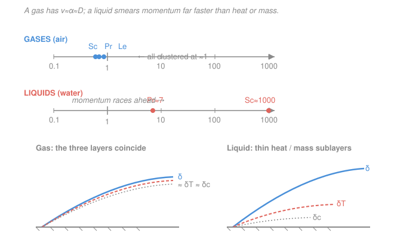

# Transport Phenomena · Lesson 1.5: The three diffusivities and their ratios

> ⏱ ~15 min · Module 1: The grand analogy and molecular transport · Builds on: [1.4 Where transport properties come from](01-04-transport-properties-kinetic-theory.md), [heat-transfer 3.2 Dimensionless groups Re, Pr, Nu](../../heat-transfer/lessons/03-02-dimensionless-groups-re-pr-nu.md) · Unlocks: Module 3 (boundary-layer thickness ratios), Boss problem 1

## Why this matters

We now have three flux laws in the same mold, each with a diffusivity that carries the same units, m²/s: momentum spreads with $\nu$, heat with $\alpha$, mass with $D_{AB}$. Because the units match, their *ratios* are pure numbers — and those numbers, $Pr$, $Sc$, $Le$, are the whole reason the momentum/heat/mass analogy is quantitative and not just a pretty table. They tell you which "front" — velocity, temperature, or concentration — advances fastest from a surface, and therefore how thick each boundary layer is relative to the others. Get these three numbers and you can predict, without solving a single PDE, whether the thermal layer sits inside the velocity layer (oil) or lies right on top of it (air). Every convection and mass-transfer correlation in Module 3 is $Nu=f(Re,Pr)$ or $Sh=f(Re,Sc)$ — the ratios *are* the inputs.

## The idea

Three things diffuse out from a wall: sideways momentum, heat, and dissolved molecules. Each has a diffusivity in m²/s — a "how fast does this smear out" rate. Since they share units, ask the only question that matters: **which one wins the race?**

- If momentum smears faster than heat, the velocity boundary layer is thicker than the thermal one. Their ratio is the **Prandtl** number.
- If momentum smears faster than mass, the velocity layer is thicker than the concentration one. That ratio is the **Schmidt** number.
- If heat smears faster than mass, the thermal front outruns the concentration front. That ratio is the **Lewis** number.

For a *gas*, there is only one messenger doing all three jobs. From [1.4](01-04-transport-properties-kinetic-theory.md): the same molecules, moving at the same mean speed $\bar c$ and flying the same mean free path $\lambda$ between collisions, carry momentum, energy, *and* their own identity across a gradient. One speed, one step size, one diffusivity — so $\nu\approx\alpha\approx D_{AB}$ and all three ratios sit near 1. In a *liquid* the messengers are different: momentum passes almost instantly through the crowded, jostling molecules (contact forces), heat lags, and a foreign molecule has to shoulder its way through the crowd very slowly. So $\nu\gg\alpha\gg D$, and the ratios blow up.

## The formal version

All three diffusivities have units m²/s. Recall from [1.2–1.3](01-03-heat-mass-fluxes-fourier-fick.md): $\nu=\mu/\rho$ (kinematic viscosity, momentum diffusivity), $\alpha=k/(\rho c_p)$ (thermal diffusivity), $D_{AB}$ (mass diffusivity of $A$ through $B$). Here $\mu$ = dynamic viscosity (Pa·s), $\rho$ = density (kg/m³), $k$ = thermal conductivity (W/m·K), $c_p$ = specific heat (J/kg·K).

**Prandtl number** — momentum diffusivity over thermal diffusivity:
$$Pr=\frac{\nu}{\alpha}=\frac{\mu/\rho}{k/\rho c_p}=\frac{c_p\mu}{k}.$$
*In words: how fast momentum spreads compared to heat.* A property of the fluid alone (no velocity, no size). Sets $\dfrac{\delta}{\delta_T}\approx Pr^{1/3}$.

**Schmidt number** — momentum diffusivity over mass diffusivity:
$$Sc=\frac{\nu}{D_{AB}}=\frac{\mu}{\rho D_{AB}}.$$
*In words: how fast momentum spreads compared to a dissolved species.* Sets $\dfrac{\delta}{\delta_c}\approx Sc^{1/3}$.

**Lewis number** — thermal diffusivity over mass diffusivity:
$$Le=\frac{\alpha}{D_{AB}}=\frac{Sc}{Pr}.$$
*In words: how fast heat spreads compared to mass — the thermal front vs the concentration front.* Governs any process where heat and mass move together (drying, condensation, the wet-bulb thermometer of 5.3). Note the identity $Le=Sc/Pr$ falls straight out of $\alpha/D=(\nu/D)/(\nu/\alpha)$ — memorize the chain $\nu,\alpha,D$ and the three ratios are just adjacent pairs.

Here $\delta$, $\delta_T$, $\delta_c$ are the momentum, thermal, and concentration boundary-layer thicknesses (m) — the exponents $1/3$ come in [3.3](03-03-thermal-concentration-boundary-layers.md); for now just read the sign: a bigger ratio means a thinner second layer.

| Ratio | Definition | Compares | Sets |
|---|---|---|---|
| $Pr$ | $\nu/\alpha=c_p\mu/k$ | momentum vs heat | $\delta/\delta_T\approx Pr^{1/3}$ |
| $Sc$ | $\nu/D_{AB}$ | momentum vs mass | $\delta/\delta_c\approx Sc^{1/3}$ |
| $Le$ | $\alpha/D_{AB}=Sc/Pr$ | heat vs mass | $\delta_T/\delta_c\approx Le^{1/3}$ |

## Picture

For air all three markers pile up near 1, so the three boundary layers on a wing or a hot plate lie essentially on top of each other. For water, $Sc$ is out near 1000: the concentration layer is a razor-thin film buried deep inside a much thicker velocity layer, with the thermal layer in between.

## Worked examples

**Example 1 — Boss problem 1, parts (b) and (c): the kinetic-theory estimate.**

From the crude hard-sphere estimates of [1.4](01-04-transport-properties-kinetic-theory.md), the *same* $\bar c$ and $\lambda$ appear in every coefficient:
$$\mu\approx\tfrac13\rho\bar c\lambda,\qquad k\approx\tfrac13\rho c_v\bar c\lambda,\qquad D_{AA}\approx\tfrac13\bar c\lambda,$$
where $c_v$ = specific heat at constant volume (J/kg·K) and $D_{AA}$ = self-diffusivity (m²/s).

*Prandtl.* Divide $\mu$ by $k$ and the whole kinetic machinery ($\tfrac13\rho\bar c\lambda$) cancels:
$$Pr=\frac{c_p\mu}{k}=c_p\cdot\frac{\tfrac13\rho\bar c\lambda}{\tfrac13\rho c_v\bar c\lambda}=\frac{c_p}{c_v}=\gamma.$$
For a monatomic gas $\gamma=5/3$, so the crude estimate is $Pr\approx1.67$ — order unity. The real value is $Pr\approx0.67$; the refinement (Eucken/Chapman–Enskog) notices that the *faster* molecules carry disproportionately more kinetic energy than momentum, boosting $k$ relative to $\mu$ and pulling $Pr$ down to $\gamma/2.5=0.67$. Either way, $Pr=O(1)$, and 1.67 vs 0.67 is the whole spread — no factor of 100 in sight.

*Schmidt.* Divide $\mu$ by $\rho D_{AA}$ and everything cancels again:
$$Sc=\frac{\mu}{\rho D_{AA}}=\frac{\tfrac13\rho\bar c\lambda}{\rho\cdot\tfrac13\bar c\lambda}=1.$$
Crude $Sc=1$; real gases land at $Sc\approx0.6$–$2$. Order unity, exactly as the one-messenger picture demands.

*Part (c) — why the layers coincide in a gas, and what breaks it.* The boundary-layer ratios are $\delta/\delta_T\approx Pr^{1/3}$ and $\delta/\delta_c\approx Sc^{1/3}$. With $Pr\approx Sc\approx1$, both cube roots are $\approx1$, so $\delta\approx\delta_T\approx\delta_c$: the velocity, temperature, and concentration profiles on a body in a gas stream rise over the *same* distance from the wall and nearly overlap. Physically, one population of molecules with one $\bar c$ and one $\lambda$ ferries momentum, energy, and identity at the same rate — they cannot help but diffuse together.

A *liquid* breaks the coincidence because the three transports stop sharing a mechanism. Momentum is transmitted almost instantly through the densely packed molecules (they are always in contact, so a shove propagates fast → large $\nu$), while heat conducts more slowly and a foreign molecule must random-walk through the crowd at a crawl (tiny $D$). So $\nu\gg\alpha\gg D$, giving $Pr\gg1$ and $Sc\gg1$: the thermal layer shrinks to a sublayer inside the velocity layer, and the concentration layer to a razor film inside that. The analogy still holds in *form* (same $Nu=f(Re,Pr)$, $Sh=f(Re,Sc)$ machinery) — only the layers no longer overlap.

*Sanity check:* every quantity divided out was dimensionless to begin with ($Pr,Sc$ are ratios of m²/s over m²/s), and the crude numbers 1.67 and 1 bracket the real 0.67 and 0.6 within a factor of ~2. Consistent.

**Example 2 — Lewis number for air.**

Take air near 300 K, 1 atm, with water vapor as the diffusing species (the wet-bulb setup of [5.3](05-03-simultaneous-heat-mass-transfer.md)). Property values (m²/s):
$$\nu\approx1.6\times10^{-5},\quad \alpha\approx2.2\times10^{-5},\quad D_{\text{H}_2\text{O–air}}\approx2.6\times10^{-5}.$$
Then
$$Pr=\frac{\nu}{\alpha}=\frac{1.6}{2.2}\approx0.71,\qquad Sc=\frac{\nu}{D_{AB}}=\frac{1.6}{2.6}\approx0.60,$$
$$Le=\frac{\alpha}{D_{AB}}=\frac{2.2}{2.6}\approx0.85\;=\;\frac{Sc}{Pr}=\frac{0.60}{0.71}\approx0.85.\;\checkmark$$
*Interpretation:* $Le\approx1$ means the thermal front and the concentration front penetrate at nearly the same rate, so $\delta_T\approx\delta_c$. This is exactly why wet-bulb psychrometry is so clean for the air–water system: with $Le\approx1$, the heat and mass transfer coefficients scale together ($h/(k_c\rho c_p)=Le^{2/3}\approx0.90$), and the wet-bulb depression becomes nearly independent of air speed — the reading gives you humidity directly.

*Sanity check:* $Le=Sc/Pr$ computed two ways agrees to the stated digits, and all three groups sit within a factor of ~1.4 of unity, as expected for a gas.

## Watch out

- **You might think** a big diffusivity means a thick boundary layer, **but** it's the reverse for the *other* layer. Large $\alpha$ (heat spreads easily) makes the thermal layer *thicker*, so $Pr=\nu/\alpha$ is *smaller* — small $Pr$ = thick thermal layer relative to velocity. Read $\delta/\delta_T\approx Pr^{1/3}$: bigger $Pr$ → thinner $\delta_T$.
- **You might think** $Pr$, $Sc$, $Le$ depend on the flow, **but** they are pure *fluid properties* — no velocity, no length scale (unlike $Re=\rho VL/\mu$, which does). Change the wind speed and $Re$ changes; $Pr$ doesn't budge.
- **You might think** liquid metals behave like other liquids, **but** their electrons conduct heat superbly, so $\alpha$ is huge and $Pr\ll1$ (mercury $\approx0.02$) — the thermal layer is *thicker* than the velocity layer, the opposite of oil. "Liquid" alone doesn't set the sign; the mechanism does.

## One-liner

> A gas moves momentum, heat, and mass with one set of molecules, so $\nu\approx\alpha\approx D$ and $Pr\approx Sc\approx Le\approx1$; in a liquid the three mechanisms split, the ratios explode, and the boundary layers peel apart.

## Problems

**P1 (🟢)** Engine oil at 40°C has $\nu\approx2.4\times10^{-4}\ \text{m}^2/\text{s}$ and $\alpha\approx7.9\times10^{-8}\ \text{m}^2/\text{s}$. Compute $Pr$ and state, in one sentence, how the thermal boundary layer compares to the velocity boundary layer.

**P2 (🟡)** For a dissolved solute in water, $\nu\approx1.0\times10^{-6}\ \text{m}^2/\text{s}$, $\alpha\approx1.4\times10^{-7}\ \text{m}^2/\text{s}$, $D_{AB}\approx1.0\times10^{-9}\ \text{m}^2/\text{s}$. Find $Pr$, $Sc$, and $Le$. Which boundary layer is thinnest, and by roughly what factor is $\delta_c$ smaller than $\delta$ (use $\delta/\delta_c\approx Sc^{1/3}$)?

**P3 (🔴)** A diatomic gas has $\gamma=c_p/c_v=7/5$. Using the crude kinetic result $Pr=\gamma$, predict $Pr$, then compare to the real value for air, $Pr\approx0.71$. Explain in one sentence why the real value is lower than $\gamma$, referencing what the refinement corrects.

Solutions

**P1** $Pr=\nu/\alpha=(2.4\times10^{-4})/(7.9\times10^{-8})\approx3.0\times10^{3}$. Momentum diffuses about 3000× faster than heat, so the thermal boundary layer is far thinner than the velocity layer: $\delta/\delta_T\approx Pr^{1/3}\approx(3000)^{1/3}\approx14$, i.e. $\delta_T$ is a thin sliver ($\sim$1/14) buried deep inside the velocity layer. *Check:* $Pr\gg1$ for oil, as expected.

**P2** $Pr=\nu/\alpha=(1.0\times10^{-6})/(1.4\times10^{-7})\approx7.1$. $Sc=\nu/D_{AB}=(1.0\times10^{-6})/(1.0\times10^{-9})=1.0\times10^{3}$. $Le=\alpha/D_{AB}=(1.4\times10^{-7})/(1.0\times10^{-9})=140$ — and as a check $Sc/Pr=1000/7.1\approx141.$ ✓ The concentration layer is thinnest (largest ratio, $Sc=1000$). $\delta/\delta_c\approx Sc^{1/3}=(1000)^{1/3}=10$, so $\delta_c$ is about **10× thinner** than the velocity layer. *Check:* ordering $\nu>\alpha>D$ gives $Pr>1$, $Le>1$, $Sc\gg1$ — the classic dense-liquid pattern.

**P3** Crude estimate $Pr=\gamma=7/5=1.40$. Real air is $Pr\approx0.71$, about half. The crude estimate assumes the same molecules carry momentum and energy identically; the refinement (Eucken / Chapman–Enskog) accounts for the fact that faster-than-average molecules carry disproportionately more kinetic energy across the gradient than momentum, so conductivity $k$ is enhanced relative to viscosity $\mu$, pushing $Pr=c_p\mu/k$ below $\gamma$. *Check:* both $O(1)$, refinement lowers $Pr$ as it did for the monatomic case (1.67 → 0.67).

## Flashback

**From Lesson 1.4 (Where transport properties come from):** A gas is heated from 300 K to 1200 K at fixed pressure. Using the kinetic-theory scaling $\mu\propto\sqrt{T}$ (and $\mu$ independent of $P$), by what factor does the viscosity change? If instead the pressure were doubled at fixed temperature, what happens to $\mu$?

Solution

Fixed $P$: $\mu\propto\sqrt{T}$, so $\mu_2/\mu_1=\sqrt{T_2/T_1}=\sqrt{1200/300}=\sqrt{4}=2$. Viscosity **doubles**. (Contrast a liquid, whose viscosity *drops* sharply with $T$ — the opposite sign, because liquid transport is barrier-hopping, not free flight.) Doubling $P$ at fixed $T$: gas viscosity is **independent of pressure** (the kinetic result $\mu\approx\tfrac13\rho\bar c\lambda$ has $\rho\propto P$ but $\lambda\propto1/P$, and they cancel), so $\mu$ is **unchanged**. *Check:* the $\sqrt{T}$, $P$-independent signature is exactly what makes gas $\nu=\mu/\rho$ rise steeply with $T$ (since $\rho$ also falls), driving the temperature dependence of $Pr$ and $Sc$.

## Connections

- **Backward:** these ratios are just the kinetic-theory diffusivities of [1.4](01-04-transport-properties-kinetic-theory.md) divided pairwise — the "one messenger" argument there is *why* the gas ratios are all $\approx1$ here. The flux laws and the definitions of $\nu,\alpha,D$ come from [1.3](01-03-heat-mass-fluxes-fourier-fick.md).
- **Forward:** [3.3](03-03-thermal-concentration-boundary-layers.md) turns $Pr$ and $Sc$ into boundary-layer thickness ratios ($\delta/\delta_T\approx Pr^{1/3}$, $\delta/\delta_c\approx Sc^{1/3}$) and thence into $Nu_x=0.332\,Re_x^{1/2}Pr^{1/3}$ and its mass twin $Sh_x=0.332\,Re_x^{1/2}Sc^{1/3}$; [3.1](03-01-nondimensionalizing-equations-of-change.md) shows $Pr$ and $Sc$ dropping out of the scaled equations of change as coefficients. This lesson completes **Boss problem 1**.
- **Sideways:** $Pr$ is the same number you met in [heat-transfer 3.2](../../heat-transfer/lessons/03-02-dimensionless-groups-re-pr-nu.md); $Sc$ and $Le$ are its mass-transfer siblings. The Lewis number is the linchpin of simultaneous heat-and-mass transfer — the wet-bulb thermometer and evaporative cooling in [5.3](05-03-simultaneous-heat-mass-transfer.md), where $Le\approx1$ for air–water is exactly what makes the wet-bulb temperature a clean humidity readout. The mass-diffusivity $D_{AB}$ itself is the same coefficient as Fick's law in [materials-science 2.4](../../materials-science/lessons/02-04-diffusion-i-ficks-first-law.md).
