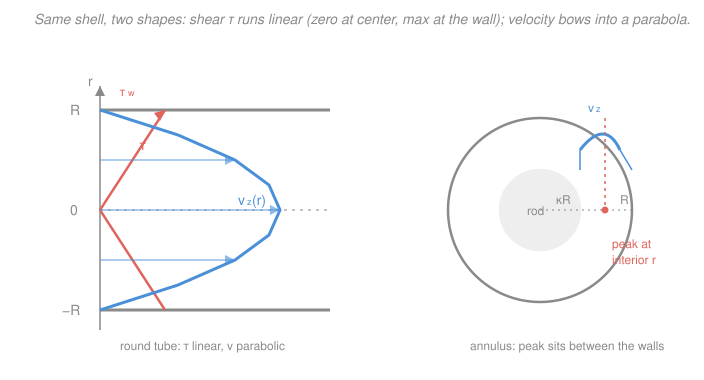

# Transport Phenomena · Lesson 2.2: More shell balances — tube and annulus

> ⏱ ~15 min · Module 2: Shell balances and the equations of change · Builds on: [2.1 The shell-balance recipe (falling film)](02-01-shell-momentum-balance-falling-film.md), [fluid-dynamics 3.2 Couette & Poiseuille](../../fluid-dynamics/lessons/03-02-couette-poiseuille.md) · Unlocks: [2.4 The equation of motion (Navier–Stokes)](02-04-equation-of-motion-navier-stokes.md)

## Why this matters

Every pipe, capillary, IV line, blood vessel, and heat-exchanger tube runs on the result of this lesson. The **Hagen–Poiseuille law** says the flow through a round tube scales as the *fourth power* of its radius — which is why a slightly narrowed artery is a medical emergency, why a hair-thin capillary meters a trickle, and why plumbers care about pipe diameter far more than pipe length. And once you can do a tube, the **annulus** (flow in the gap between two pipes — a double-pipe heat exchanger, an oil well) costs you almost nothing new. The lesson underneath the algebra: the shell recipe from 2.1 is a *machine*, and the only real skill is picking the right shell and the right boundary conditions.

## The idea

In 2.1 we sliced a falling film into thin flat sheets and did momentum bookkeeping on one sheet. A round tube is the same story with a curved knife: slice it into thin **cylindrical shells** — nested tubes of radius $r$, thickness $\Delta r$, length $L$, like the rings of a tree trunk. Momentum flows *radially* from fast fluid on the axis outward to the stationary wall, so each shell hands momentum to the shell just outside it.

Two forces stand off, exactly as before. The **pressure drop** $\Delta P$ across the ends shoves the fluid down the tube; **viscous drag** from the wall holds it back. In steady, fully-developed flow nothing accelerates, so at every radius the push and the drag balance. Integrate that balance once and you learn the shear stress; integrate again and you learn the velocity.

The punchline shapes (see the figure): the **shear stress is linear in $r$** — exactly zero on the axis (no neighbor pulling on the centerline) and largest at the wall (where all the drag is collected) — while the **velocity is a parabola**, fastest on the axis and pinned to zero at the wall by no-slip. The annulus keeps the same balance but moves the goalposts: with a solid rod down the middle, the fastest streamline is no longer the axis (there isn't one in the fluid) but some radius *between* the two walls.

## The formal version

**Set-up.** Steady, incompressible, fully-developed flow of a Newtonian fluid down a horizontal tube of radius $R$ and length $L$, driven by a pressure drop $\Delta P = P_0 - P_L > 0$. Velocity points only along the axis and depends only on radius: $\mathbf v = (0,0,v_z(r))$. Symbols: $r$ = radial distance from the axis (m), $\tau_{rz}$ = shear stress = radial flux of $z$-momentum (Pa), $\mu$ = viscosity (Pa·s), $Q$ = volumetric flow rate (m³/s).

**Momentum balance on the shell** ($r \to r+\Delta r$). Rate of $z$-momentum in by viscous flux at $r$, out at $r+\Delta r$, plus the pressure force on the two end faces; divide by the shell volume and let $\Delta r \to 0$:

$$\boxed{\;\frac{1}{r}\frac{d}{dr}\big(r\,\tau_{rz}\big) = \frac{\Delta P}{L}\;}$$

*In words: the way the shear per unit area spreads out radially is fixed by the pressure push per unit length — that's the whole physics; everything below is just calculus.*

**Integrate once.** Multiply by $r$ and integrate:

$$r\,\tau_{rz} = \frac{\Delta P}{2L}r^2 + C_1 \quad\Longrightarrow\quad \tau_{rz} = \frac{\Delta P}{2L}\,r + \frac{C_1}{r}.$$

For a **full tube** the stress must stay finite on the axis, so $C_1 = 0$:

$$\tau_{rz}(r) = \frac{\Delta P}{2L}\,r.$$

*In words: shear grows straight-line from zero at the center to its biggest value at the wall.* The **wall shear stress** is therefore

$$\tau_w = \tau_{rz}(R) = \frac{\Delta P\,R}{2L}.$$

**Integrate again.** Insert Newton's law $\tau_{rz} = -\mu\,\dfrac{dv_z}{dr}$ (momentum flows down the velocity gradient — Lesson [1.2](01-02-momentum-transport-newton-viscosity.md)):

$$-\mu\frac{dv_z}{dr} = \frac{\Delta P}{2L}\,r \quad\Longrightarrow\quad v_z(r) = -\frac{\Delta P}{4\mu L}r^2 + C_2.$$

No-slip at the wall, $v_z(R)=0$, fixes $C_2 = \dfrac{\Delta P R^2}{4\mu L}$:

$$\boxed{\;v_z(r) = \frac{\Delta P\,R^2}{4\mu L}\left[\,1 - \left(\frac{r}{R}\right)^2\,\right]\;}$$

*In words: the velocity is a paraboloid — a smooth dome, maximum on the axis, zero at the wall.* This is **Hagen–Poiseuille flow**. Reading off the numbers:

- **Centerline max:** $v_{\max} = v_z(0) = \dfrac{\Delta P R^2}{4\mu L}$.
- **Flow rate** (sum the profile over annular rings $2\pi r\,dr$):

$$Q = \int_0^R v_z(r)\,2\pi r\,dr = \frac{2\pi \Delta P}{4\mu L}\int_0^R\!\Big(r - \frac{r^3}{R^2}\Big)dr = \boxed{\;\frac{\pi\,\Delta P\,R^4}{8\mu L}\;}$$

- **Mean speed:** $\langle v\rangle = \dfrac{Q}{\pi R^2} = \dfrac{\Delta P R^2}{8\mu L} = \tfrac12\,v_{\max}$ — for a tube the average is exactly *half* the peak. (Contrast the falling film's $\tfrac23$; the geometry changes the fraction.)

The $R^4$ is the headline: flow rate is savagely sensitive to radius. This is the same $a^4$ law you derived from Navier–Stokes in [fluid-dynamics 3.2](../../fluid-dynamics/lessons/03-02-couette-poiseuille.md) — here we got it from bookkeeping on a shell, no PDE required. In Lesson 2.4 we'll show the shell balance *is* Navier–Stokes in cylindrical coordinates, term for term.

## Picture

Left: on the same radial axis, the coral line is $\tau_{rz}(r)$ — linear, zero at the center, maximal ($\tau_w$) at each wall — and the blue curve is $v_z(r)$ — parabolic, maximal at the center. Right: the annulus. With a rod filling $r<\kappa R$, the velocity climbs from zero at the inner wall, peaks at an *interior* radius, and falls to zero at the outer wall.

## Worked examples

**Example 1 — Hagen–Poiseuille through a capillary (the $R^4$ bite).**
Water ($\mu = 1.0\times10^{-3}\ \mathrm{Pa\cdot s}$, $\rho = 1000\ \mathrm{kg/m^3}$) is pushed through a glass capillary of radius $R = 0.25\ \mathrm{mm}$ and length $L = 5.0\ \mathrm{cm}$ by a pressure drop $\Delta P = 2000\ \mathrm{Pa}$. Find $Q$, and say what happens to $Q$ if the radius is halved.

Plug into Hagen–Poiseuille, $R = 2.5\times10^{-4}\ \mathrm{m}$ so $R^4 = 3.91\times10^{-15}\ \mathrm{m^4}$:

$$Q = \frac{\pi\,\Delta P\,R^4}{8\mu L} = \frac{\pi\,(2000)(3.91\times10^{-15})}{8\,(1.0\times10^{-3})(0.050)} = \frac{2.45\times10^{-11}}{4.0\times10^{-4}} \approx 6.1\times10^{-8}\ \mathrm{m^3/s}.$$

That's $0.061\ \mathrm{mL/s}\approx 3.7\ \mathrm{mL/min}$ — a believable capillary trickle. **Halving the radius** multiplies $Q$ by $(\tfrac12)^4 = \tfrac1{16}$: the same push now delivers $3.8\times10^{-9}\ \mathrm{m^3/s}$, sixteen times less. A 50% narrower pipe carries 6% of the flow.

*Sanity check.* Mean speed $\langle v\rangle = Q/(\pi R^2) = 6.1\times10^{-8}/(1.96\times10^{-7}) = 0.31\ \mathrm{m/s}$, so $v_{\max}=0.62\ \mathrm{m/s}$ — modest. Reynolds number $Re = \rho\langle v\rangle(2R)/\mu = (1000)(0.31)(5\times10^{-4})/10^{-3}\approx 156 \ll 2100$, safely laminar, so Poiseuille applies. Units: $\dfrac{\mathrm{Pa\cdot m^4}}{\mathrm{Pa\cdot s\cdot m}} = \dfrac{\mathrm{m^3}}{\mathrm{s}}$ ✓.

**Example 2 — the annulus: setting up the shell and locating the peak.**
Fluid flows down the gap between an inner rod of radius $\kappa R$ and an outer tube of radius $R$ (with $0<\kappa<1$), driven by $\Delta P$ over length $L$. Write the balance and boundary conditions, and say where the velocity is fastest.

The shell balance is *identical* — same cylindrical bookkeeping, so

$$\frac{1}{r}\frac{d}{dr}\big(r\,\tau_{rz}\big) = \frac{\Delta P}{L},\qquad \tau_{rz} = \frac{\Delta P}{2L}r + \frac{C_1}{r}.$$

Here is the one change: the fluid never reaches $r=0$ (the rod is in the way), so the "keep it finite on the axis" argument is gone and **$C_1 \ne 0$**. Integrating $\tau_{rz} = -\mu\,dv_z/dr$ gives a solution of the form

$$v_z(r) = \frac{\Delta P\,R^2}{4\mu L}\left[\,1 - \left(\frac{r}{R}\right)^2 + 2\lambda^2\ln\!\frac{r}{R}\,\right],$$

with **two** no-slip boundary conditions to pin down the two constants:

$$v_z(\kappa R) = 0 \quad\text{(inner wall)},\qquad v_z(R) = 0 \quad\text{(outer wall)}.$$

The outer condition is satisfied automatically ($\ln 1 = 0$); the inner one fixes the peak location $\lambda R$, where $\tau_{rz}=0$:

$$\lambda^2 = \frac{1-\kappa^2}{2\ln(1/\kappa)}.$$

Because $\kappa < \lambda < 1$, the velocity maximum sits at $r=\lambda R$ — an **interior radius, strictly between the two walls**, not at either surface and not on the (absent) axis. For $\kappa = 0.5$, $\lambda \approx 0.74$: the fastest streamline is about three-quarters of the way out. Qualitatively: shear must vanish where velocity peaks, and that zero-shear radius is squeezed toward the *middle* of the gap, biased slightly outward because there's more room out there.

*Sanity check.* Let $\kappa\to0$ (rod shrinks to nothing): $\lambda^2 = (1-0)/(2\ln\infty)\to 0$, the peak slides back to the axis, and the log term's coefficient vanishes — we recover the plain tube parabola. ✓ The recipe is the same; only the boundary conditions moved.

## Watch out

- **You might think the shear stress is largest where the velocity is largest.** Backwards. Shear tracks the *slope* $dv_z/dr$, not the height: it's **zero where the velocity peaks** (flat top of the parabola) and **maximal at the wall** (steepest slope). Velocity-max and shear-max live at opposite ends.
- **You might think you can drop the $C_1/r$ term in the annulus like you did for the tube.** No — that term is only killed by the *axis-finiteness* argument, which requires the fluid to include $r=0$. The annulus has a hole in the middle, so $C_1$ survives and *is* what shifts the peak off-axis. Same equation, different domain, different answer.
- **You might think doubling the pressure and doubling the radius are interchangeable levers on $Q$.** Not close. $Q\propto \Delta P$ (linear) but $Q\propto R^4$ (quartic). Widening the pipe 19% ($1.19^4\approx2$) doubles the flow as surely as doubling the pressure — and costs no extra pumping energy per unit delivered.

## One-liner

> Slice the tube into cylindrical shells: the pressure push makes shear rise linearly to the wall and velocity bow into a parabola — and $Q\propto R^4$, the most unforgiving exponent in plumbing.

## Problems

**P1 (🟢)** Glycerin ($\mu = 1.0\ \mathrm{Pa\cdot s}$) flows through a tube of radius $R = 2.0\ \mathrm{mm}$ and length $L = 1.0\ \mathrm{m}$ under $\Delta P = 4.0\times10^4\ \mathrm{Pa}$. Find (a) the wall shear stress $\tau_w$, (b) the centerline velocity $v_{\max}$, and (c) the flow rate $Q$.

**P2 (🟡)** A pipeline delivers a fixed flow rate $Q$. Corrosion narrows the effective radius by 10% (to $0.9R$). By what factor must the pump raise $\Delta P$ to keep $Q$ unchanged, everything else fixed?

**P3 (🔴, optional)** For the same tube, what fraction of the flow rate $Q$ is carried by the inner core $r \le R/2$? (Integrate the profile out to $R/2$ and divide by the total.) Is it more or less than a quarter, and why?

Solutions

**P1.**
(a) $\tau_w = \dfrac{\Delta P\,R}{2L} = \dfrac{(4.0\times10^4)(2.0\times10^{-3})}{2(1.0)} = 40\ \mathrm{Pa}$.
(b) $v_{\max} = \dfrac{\Delta P\,R^2}{4\mu L} = \dfrac{(4.0\times10^4)(2.0\times10^{-3})^2}{4(1.0)(1.0)} = \dfrac{(4.0\times10^4)(4.0\times10^{-6})}{4.0} = 0.040\ \mathrm{m/s}$.
(c) $Q = \dfrac{\pi\,\Delta P\,R^4}{8\mu L} = \dfrac{\pi(4.0\times10^4)(2.0\times10^{-3})^4}{8(1.0)(1.0)}$. With $R^4 = 1.6\times10^{-11}\ \mathrm{m^4}$: $Q = \dfrac{\pi(4.0\times10^4)(1.6\times10^{-11})}{8} = \dfrac{\pi(6.4\times10^{-7})}{8} \approx 2.5\times10^{-7}\ \mathrm{m^3/s}$.
Check: $Q = \langle v\rangle\pi R^2 = (0.020)\pi(2.0\times10^{-3})^2 = 0.020\times1.257\times10^{-5} = 2.5\times10^{-7}$ ✓ (using $\langle v\rangle=\tfrac12 v_{\max}=0.020$).

**P2.** $Q = \dfrac{\pi R^4\Delta P}{8\mu L}$, so at fixed $Q$, $\Delta P \propto R^{-4}$. Shrinking $R$ to $0.9R$ multiplies $\Delta P$ by $(0.9)^{-4} = 1/0.6561 \approx \mathbf{1.52}$. A mere 10% narrowing forces a **52% higher pressure** to hold the flow — the $R^4$ law again, now as a pumping-cost penalty.

**P3.** Total $Q = \dfrac{\pi\Delta P R^4}{8\mu L}$. Partial flow through $r\le R/2$:
$$Q_{\text{core}} = \int_0^{R/2}\!\frac{\Delta P R^2}{4\mu L}\Big[1-\tfrac{r^2}{R^2}\Big]2\pi r\,dr = \frac{\pi\Delta P}{2\mu L}\int_0^{R/2}\!\Big(r-\frac{r^3}{R^2}\Big)dr = \frac{\pi\Delta P}{2\mu L}\Big[\frac{r^2}{2}-\frac{r^4}{4R^2}\Big]_0^{R/2}.$$
At $r=R/2$: $\dfrac{(R/2)^2}{2} - \dfrac{(R/2)^4}{4R^2} = \dfrac{R^2}{8} - \dfrac{R^2}{64} = \dfrac{7R^2}{64}$. So $Q_{\text{core}} = \dfrac{\pi\Delta P}{2\mu L}\cdot\dfrac{7R^2}{64} = \dfrac{7\pi\Delta P R^2}{128\mu L}$.
Ratio $\dfrac{Q_{\text{core}}}{Q} = \dfrac{7\pi\Delta P R^2/128\mu L}{\pi\Delta P R^4/8\mu L}\cdot\dfrac{1}{1}$... careful — put both over the same $R$: $Q = \dfrac{\pi\Delta P R^4}{8\mu L}$ has an $R^4$, but $Q_{\text{core}}$ above carries $R^2$ because I already substituted $r=R/2$. Redo cleanly by factoring $R^4$: with $u=r/R$, $Q = \dfrac{\pi\Delta P R^4}{2\mu L}\int_0^1(u-u^3)du = \dfrac{\pi\Delta P R^4}{2\mu L}\cdot\tfrac14$, and $Q_{\text{core}} = \dfrac{\pi\Delta P R^4}{2\mu L}\int_0^{1/2}(u-u^3)du = \dfrac{\pi\Delta P R^4}{2\mu L}\big[\tfrac{u^2}{2}-\tfrac{u^4}{4}\big]_0^{1/2} = \dfrac{\pi\Delta P R^4}{2\mu L}\cdot\tfrac{7}{64}$.
$$\frac{Q_{\text{core}}}{Q} = \frac{7/64}{1/4} = \frac{7}{16} \approx 0.44.$$
The inner half-radius carries **44%** of the flow — far **more** than a quarter. The core is where the fluid is fast *and* the profile is flat, so its per-area contribution is heavily weighted; the sluggish near-wall annulus, despite its large area, carries little.

## Flashback

**From Lesson 2.1 (falling film):** A film of water ($\rho = 1000\ \mathrm{kg/m^3}$, $\mu = 1.0\times10^{-3}\ \mathrm{Pa\cdot s}$) of thickness $\delta = 0.10\ \mathrm{mm}$ runs steadily down a wall inclined at $\beta = 30^\circ$ from vertical, under gravity $g = 9.81\ \mathrm{m/s^2}$. Find the volumetric flow rate per unit width, $Q/W$.

Solution

From 2.1, $\dfrac{Q}{W} = \dfrac{\rho g\cos\beta\,\delta^3}{3\mu}$. With $\delta = 1.0\times10^{-4}\ \mathrm{m}$, $\delta^3 = 1.0\times10^{-12}\ \mathrm{m^3}$, and $\cos30^\circ = 0.866$:

$$\frac{Q}{W} = \frac{(1000)(9.81)(0.866)(1.0\times10^{-12})}{3(1.0\times10^{-3})} = \frac{8.50\times10^{-9}}{3.0\times10^{-3}} \approx 2.8\times10^{-6}\ \mathrm{m^2/s}.$$

*Check via $\langle v\rangle$:* $\langle v\rangle = \tfrac23 v_{\max} = \tfrac23\cdot\dfrac{\rho g\cos\beta\,\delta^2}{2\mu} = \dfrac{\rho g\cos\beta\,\delta^2}{3\mu} = \dfrac{(1000)(9.81)(0.866)(10^{-8})}{3\times10^{-3}} = 0.028\ \mathrm{m/s}$, and $Q/W = \langle v\rangle\,\delta = (0.028)(10^{-4}) = 2.8\times10^{-6}\ \mathrm{m^2/s}$ ✓. Units: $\dfrac{(\mathrm{kg/m^3})(\mathrm{m/s^2})(\mathrm{m^3})}{\mathrm{Pa\cdot s}} = \mathrm{m^2/s}$ ✓ (flow per unit width). Note the film uses the $\tfrac23$ average, the tube the $\tfrac12$ — geometry sets the fraction.

## Connections

- **Backward:** this is the [shell recipe of 2.1](02-01-shell-momentum-balance-falling-film.md) with a curved shell — the *only* new move is the choice of coordinate and boundary conditions. Newton's law of viscosity ([1.2](01-02-momentum-transport-newton-viscosity.md)) turns the stress into a velocity, exactly as for the film.
- **Forward:** in [2.4](02-04-equation-of-motion-navier-stokes.md) we stop rebuilding a shell every problem and derive the general equation of motion (Navier–Stokes) once; the tube balance $\frac1r\frac{d}{dr}(r\tau_{rz}) = \Delta P/L$ will drop out of it as the fully-developed cylindrical special case. Wall shear $\tau_w$ resurfaces as the friction factor in pipe-flow correlations.
- **Sideways:** the same $R^4$ Hagen–Poiseuille law appears in [fluid-dynamics 3.2](../../fluid-dynamics/lessons/03-02-couette-poiseuille.md) (there derived by simplifying Navier–Stokes, here by shell bookkeeping — two roads, one law). The heat analogue is conduction down a radial temperature gradient in a pipe wall: swap $\tau_{rz}=-\mu\,dv_z/dr$ for $q_r''=-k\,dT/dr$ and the same $\frac1r\frac{d}{dr}(r\,\cdot)$ operator governs the profile.
