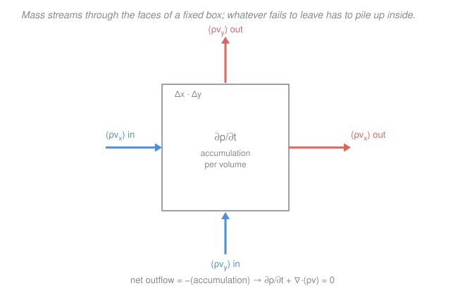

# Transport Phenomena · Lesson 2.3: The equation of continuity

> ⏱ ~15 min · Module 2: Shell balances and the equations of change · Builds on: [2.1 Shell momentum balances](02-01-shell-momentum-balance-falling-film.md), [`fluid-dynamics` 1.3 Continuity](../../fluid-dynamics/lessons/01-03-continuity-equation.md), [`fluid-dynamics` 1.2 Material derivative](../../fluid-dynamics/lessons/01-02-lagrangian-eulerian-material-derivative.md) · Unlocks: [2.4 Equation of motion](02-04-equation-of-motion-navier-stokes.md), [2.5 Energy equation](02-05-energy-equation-of-change.md), [2.6 Species continuity](02-06-species-continuity-equation.md)

## Why this matters

In 2.1–2.2 you balanced a quantity over *one* thin shell and got *one* ODE — good for a single flow direction, useless the moment the geometry turns 3-D or unsteady. This lesson does the balance once, over a differential box, in all directions at once, and the payoff is a partial differential equation that holds **at every point of every flow**: the **equation of continuity**. It is the first of the four *equations of change* (continuity, motion, energy, species) that carry the rest of the course, and it is the template for the other three. Master the bookkeeping here — accumulation equals in minus out — and 2.4–2.6 are the same argument with a source term bolted on.

## The idea

Draw a tiny box, fixed in space, and watch mass march through it. Mass has no source and no sink: it can only *flow* across the walls. So if more mass flows in than out, the extra has nowhere to go but *stay* — the density inside climbs. If more leaves than enters, the box thins out. That's the entire physical content: **rate of pile-up inside = rate mass flows in minus rate it flows out.**

The thing crossing a wall is the **mass flux** $\rho\mathbf v$ — density times velocity, kilograms per second through each square meter of wall. Tally that flux over all six faces and you have the net outflow. Shrink the box to a point and the tally becomes a derivative, $\nabla\!\cdot(\rho\mathbf v)$ — the *divergence*, which measures how much the mass flux is spreading apart at that point. Set net-spreading equal to minus-the-accumulation and you have the equation. No forces, no energy, no assumptions about the fluid — just "mass is conserved," turned into calculus.

## The formal version

Fix a control volume of size $\Delta x\,\Delta y\,\Delta z$, stationary in space. Let $\rho(\mathbf x,t)$ be the density ($\mathrm{kg/m^3}$) and $\mathbf v(\mathbf x,t)$ the mass-average velocity ($\mathrm{m/s}$), with components $v_x,v_y,v_z$. (We use $\mathbf v$ for velocity here, following Bird–Stewart–Lightfoot; [`fluid-dynamics`](../../fluid-dynamics/lessons/01-03-continuity-equation.md) wrote the same field $\mathbf u$.)

Mass enters the $x$-faces at rate $(\rho v_x)\big|_x\,\Delta y\,\Delta z$ and leaves at $(\rho v_x)\big|_{x+\Delta x}\,\Delta y\,\Delta z$; likewise for $y$ and $z$. The mass inside is $\rho\,\Delta x\,\Delta y\,\Delta z$. Conservation says accumulation = in $-$ out:

$$\frac{\partial \rho}{\partial t}\,\Delta x\Delta y\Delta z = \big[(\rho v_x)|_x-(\rho v_x)|_{x+\Delta x}\big]\Delta y\Delta z + (y\text{-pair}) + (z\text{-pair}).$$

Divide by $\Delta x\Delta y\Delta z$ and let the box shrink; each bracket becomes a derivative, e.g. $-\partial(\rho v_x)/\partial x$:

$$\boxed{\;\frac{\partial \rho}{\partial t}+\nabla\!\cdot(\rho\mathbf v)=0\;}\qquad \nabla\!\cdot(\rho\mathbf v)=\frac{\partial(\rho v_x)}{\partial x}+\frac{\partial(\rho v_y)}{\partial y}+\frac{\partial(\rho v_z)}{\partial z}.$$

*In words: the density at a point rises exactly as fast as mass flux converges onto it.* The term $\nabla\!\cdot(\rho\mathbf v)$ is the net mass flux out per unit volume — positive where flux fans out (so $\rho$ must be dropping), negative where it crowds in.

**Substantial-derivative form.** Expand the divergence with the product rule, $\nabla\!\cdot(\rho\mathbf v)=\mathbf v\!\cdot\!\nabla\rho+\rho\,\nabla\!\cdot\mathbf v$, and collect the two terms that ride along with the fluid, $\partial\rho/\partial t+\mathbf v\!\cdot\!\nabla\rho$. That combination is the **substantial (material) derivative** — the rate of change *following a fluid particle* rather than at a fixed point:

$$\frac{D}{Dt}\equiv\frac{\partial}{\partial t}+\mathbf v\!\cdot\!\nabla,\qquad\text{so continuity becomes}\qquad \frac{D\rho}{Dt}=-\rho\,\nabla\!\cdot\mathbf v.$$

*In words: a fluid particle's density changes only because it is being compressed or expanded.* The two pieces of $D/Dt$ are the **local** rate $\partial_t$ (the field changing under a fixed observer) and the **convective** rate $\mathbf v\!\cdot\!\nabla$ (change you feel merely by being carried into a region where things are different) — the same split from [`fluid-dynamics` 1.2](../../fluid-dynamics/lessons/01-02-lagrangian-eulerian-material-derivative.md).

**Incompressible form.** If each particle keeps its density as it moves, $D\rho/Dt=0$, and — since $\rho\neq0$ — continuity collapses to the workhorse constraint

$$\nabla\!\cdot\mathbf v=0\qquad(\text{divergence-free / solenoidal velocity}).$$

*In words: for a constant-density fluid, whatever flows into a point must flow right back out — the velocity field can't pile up.* This is the single most-used assumption in the subject (liquids nearly always; gases below Mach $\approx0.3$), and it is what lets you drop density from the equation of motion in 2.4.

**Set the template.** Continuity is the "accumulation $=$ in $-$ out $+$ generation" ledger with **zero generation** — mass is never created. Every remaining equation of change is this same box balance with the generation slot filled: 2.4 adds momentum sources (pressure, viscosity, gravity), 2.5 adds heat sources (conduction, dissipation), 2.6 adds species sources (reaction).

## Picture

## Worked examples

**Example 1 (why incompressible means $\nabla\!\cdot\mathbf v=0$, and testing a field).** Start from the full equation and impose constant $\rho$. Expand the flux term:

$$\frac{\partial\rho}{\partial t}+\underbrace{\mathbf v\!\cdot\!\nabla\rho}_{=\,0}+\rho\,\nabla\!\cdot\mathbf v=0.$$

With $\rho$ constant, $\partial_t\rho=0$ and $\nabla\rho=0$, leaving $\rho\,\nabla\!\cdot\mathbf v=0$, i.e. $\nabla\!\cdot\mathbf v=0$. Now test the 2-D field $v_x=ax,\ v_y=-ay$ (a stagnation-point flow, with $a$ in $\mathrm{s^{-1}}$):

$$\nabla\!\cdot\mathbf v=\frac{\partial(ax)}{\partial x}+\frac{\partial(-ay)}{\partial y}=a-a=0.\ \checkmark$$

It's a legal incompressible flow: fluid rushing in along $y$ ($v_y=-ay$ points toward the origin) is exactly balanced by fluid squirting out along $x$. *Check.* Units: each derivative is $\mathrm{s^{-1}}$, and they cancel — a divergence must carry units of $\mathrm{s^{-1}}$ (velocity per length). ✓

**Example 2 (what $D/Dt$ buys you: a particle changing density in a steady field).** A flow is **steady** — nothing at any fixed point changes with time, $\partial_t\rho=0$ — but the density varies in space: $\rho$ climbs linearly from $1.0$ to $1.2\ \mathrm{kg/m^3}$ over $0.5\ \mathrm{m}$ downstream, so $\partial\rho/\partial x=(0.2)/(0.5)=0.4\ \mathrm{kg/m^4}$, and the fluid moves at $v_x=2\ \mathrm{m/s}$. Does a particle's density change?

$$\frac{D\rho}{Dt}=\underbrace{\frac{\partial\rho}{\partial t}}_{0}+v_x\frac{\partial\rho}{\partial x}=2\times0.4=0.8\ \mathrm{kg/(m^3\,s)}.$$

Yes — at $0.8\ \mathrm{kg\,m^{-3}\,s^{-1}}$, purely from the **convective** term: the particle is being carried into denser territory. "Steady" pins the field at each fixed point; it says nothing about what a *moving* particle experiences. Continuity then tells you the velocity can't be uniform here: $\nabla\!\cdot\mathbf v=-\tfrac1\rho\frac{D\rho}{Dt}\approx-0.8/1.1\approx-0.7\ \mathrm{s^{-1}}$ — the flow is converging (compressing), exactly what makes a particle denser. *Check.* Units: $(\mathrm{m/s})(\mathrm{kg/m^4})=\mathrm{kg/(m^3\,s)}$ ✓; sign: density rising along the path ⇒ $D\rho/Dt>0$ ⇒ $\nabla\!\cdot\mathbf v<0$ (squeeze), consistent. ✓

## Watch out

- **You might think $\nabla\!\cdot(\rho\mathbf v)=0$ *is* incompressibility.** It isn't. $\nabla\!\cdot(\rho\mathbf v)=0$ is the *steady* continuity equation ($\partial_t\rho=0$) and holds for compressible steady flow too. Incompressibility is the stronger, separate statement $\nabla\!\cdot\mathbf v=0$; the two agree only when $\rho$ is uniform. In a steady nozzle $\nabla\!\cdot(\rho\mathbf v)=0$ but $\nabla\!\cdot\mathbf v\neq0$.
- **You might think "steady flow" means each particle's properties are frozen.** No — steady kills the *local* term $\partial_t$, not the *convective* term $\mathbf v\!\cdot\!\nabla$. A particle can heat up, densify, or speed up in a perfectly steady field just by being swept somewhere new (Example 2). That convective term is the whole reason $D/Dt\neq\partial/\partial t$.
- **You might drop the minus sign in "accumulation $=-$net outflow."** The equation reads $\partial_t\rho=-\nabla\!\cdot(\rho\mathbf v)$: outflow *depletes* the point. Move it to the left and it's $+\nabla\!\cdot(\rho\mathbf v)$. Lose track of that sign and a compression reads as an expansion.

## One-liner

> Continuity is a box balance with no source: $\partial_t\rho+\nabla\!\cdot(\rho\mathbf v)=0$, or following a particle $D\rho/Dt=-\rho\,\nabla\!\cdot\mathbf v$ — and for constant density it's just $\nabla\!\cdot\mathbf v=0$.

## Problems

**P1 (🟢)** A 2-D velocity field is $v_x=a x^2,\ v_y=b\,x y$. For what value of $b$ (in terms of $a$) is the flow incompressible?

**P2 (🟡)** A steady 2-D temperature field is $T(x,y)=T_0+c\,x$ (with $c>0$, units $\mathrm{K/m}$), and the fluid moves with velocity $\mathbf v=(u,\,0)$, $u>0$ constant. Write $DT/Dt$ for a fluid particle. Is $\partial T/\partial t$ zero? Explain in one sentence how a particle's temperature can rise even though the field is steady. *(This is exactly the convective-heating term you'll meet again in the energy equation, [2.5](02-05-energy-equation-of-change.md).)*

**P3 (🔴)** A gas flows *steadily* in the $x$-direction only, $\mathbf v=(v_x(x),0,0)$, and its density rises downstream, $\rho(x)=\rho_0 e^{x/L}$ ($L>0$). Use the steady continuity equation to find $v_x(x)$ up to a constant, and state in words what happens to the flow speed as the gas densifies.

Solutions

**P1** Incompressible ⇔ $\nabla\!\cdot\mathbf v=0$:

$$\nabla\!\cdot\mathbf v=\frac{\partial(ax^2)}{\partial x}+\frac{\partial(bxy)}{\partial y}=2ax+bx=(2a+b)\,x.$$

This vanishes for *all* $x$ only if $2a+b=0$, i.e. $\boxed{b=-2a}$. *Check.* Units: $[a]=[b]=\mathrm{m^{-1}s^{-1}}$ so $v_x,v_y$ come out in $\mathrm{m/s}$, and each derivative is $\mathrm{s^{-1}}$ ✓. With $b=-2a$ the outflow in $x$ ($+2ax$) is cancelled by inflow in $y$ ($-2ax$), as incompressibility demands. ✓

**P2** With $\mathbf v=(u,0)$ and $T=T_0+cx$:

$$\frac{DT}{Dt}=\frac{\partial T}{\partial t}+u\frac{\partial T}{\partial x}+0\cdot\frac{\partial T}{\partial y}=0+u\,c+0=uc.$$

Yes, $\partial T/\partial t=0$ — the field is steady, so at any *fixed* point the temperature never changes. But a *particle* moving with speed $u$ into hotter regions (larger $x$) heats at rate $uc>0$: the change comes entirely from the convective term $u\,\partial_x T$, being carried somewhere hotter. *Check.* Units: $(\mathrm{m/s})(\mathrm{K/m})=\mathrm{K/s}$ ✓, a rate of temperature change. ✓

**P3** Steady, 1-D continuity: $\partial_t\rho=0$ leaves $\dfrac{d(\rho v_x)}{dx}=0$, so $\rho v_x=\text{const}\equiv G$ (the mass flux, $\mathrm{kg\,m^{-2}s^{-1}}$). Hence

$$v_x(x)=\frac{G}{\rho(x)}=\frac{G}{\rho_0}\,e^{-x/L}.$$

The speed *falls* exponentially as the gas densifies — mass flux $\rho v_x$ is conserved, so where the gas is denser it must move slower to carry the same $\mathrm{kg/s}$ through each square meter. *Check.* Units: $G/\rho=(\mathrm{kg\,m^{-2}s^{-1}})/(\mathrm{kg\,m^{-3}})=\mathrm{m/s}$ ✓. Note $\nabla\!\cdot\mathbf v=dv_x/dx=-(G/\rho_0 L)e^{-x/L}<0$: converging flow, consistent with $D\rho/Dt=v_x\,d\rho/dx>0$ (particle densifying). ✓

## Flashback

**From Lesson 2.2 (Shell balances: tube and annulus):** Glycerin (viscosity $\mu=1.0\ \mathrm{Pa\,s}$) is pushed through a horizontal tube of radius $R=2\ \mathrm{mm}$ and length $L=1\ \mathrm{m}$ by a pressure drop $\Delta P=8\times10^{4}\ \mathrm{Pa}$. Using the Hagen–Poiseuille result, find the volumetric flow rate $Q$ and the average velocity $\langle v\rangle$.

Solution

Hagen–Poiseuille (from the shell balance in 2.2): $Q=\dfrac{\pi\,\Delta P\,R^4}{8\mu L}$. Plug in $R^4=(2\times10^{-3})^4=1.6\times10^{-11}\ \mathrm{m^4}$:

$$Q=\frac{\pi(8\times10^{4})(1.6\times10^{-11})}{8(1.0)(1)}=\frac{\pi(1.28\times10^{-6})}{8}\approx5.0\times10^{-7}\ \mathrm{m^3/s}.$$

Average velocity is $Q$ over the cross-section $\pi R^2=\pi(2\times10^{-3})^2\approx1.26\times10^{-5}\ \mathrm{m^2}$:

$$\langle v\rangle=\frac{Q}{\pi R^2}\approx\frac{5.0\times10^{-7}}{1.26\times10^{-5}}\approx0.04\ \mathrm{m/s},$$

so $v_{\max}=2\langle v\rangle\approx0.08\ \mathrm{m/s}$ (the parabolic profile averages to half its peak). *Check.* Units: $Q=(\mathrm{Pa})(\mathrm{m^4})/[(\mathrm{Pa\,s})(\mathrm{m})]=\mathrm{m^3/s}$ ✓. The strong $R^4$ dependence is the takeaway: halving the radius would cut $Q$ by $2^4=16$. ✓

## Connections

- **Backward:** this is the [2.1](02-01-shell-momentum-balance-falling-film.md) shell-balance recipe run in all three directions at once and with *mass* as the conserved quantity — accumulation = in $-$ out, no generation. It reproduces [`fluid-dynamics` 1.3](../../fluid-dynamics/lessons/01-03-continuity-equation.md) exactly (their $\mathbf u$ is our $\mathbf v$), and the $D/Dt$ split is [`fluid-dynamics` 1.2](../../fluid-dynamics/lessons/01-02-lagrangian-eulerian-material-derivative.md).
- **Forward:** [2.4 (motion)](02-04-equation-of-motion-navier-stokes.md), [2.5 (energy)](02-05-energy-equation-of-change.md), and [2.6 (species)](02-06-species-continuity-equation.md) are the identical box balance with a generation term added — momentum, heat, and species sources respectively. The incompressible constraint $\nabla\!\cdot\mathbf v=0$ derived here is what simplifies Navier–Stokes in 2.4.
- **Sideways:** the substantial derivative $D/Dt$ is the universal "following the fluid" operator — every equation of change is written $\rho\,D(\text{stuff})/Dt=\text{(fluxes)}+\text{(sources)}$. It is also the mass member of the grand analogy: continuity is momentum/energy/species conservation with the source dialed to zero.
