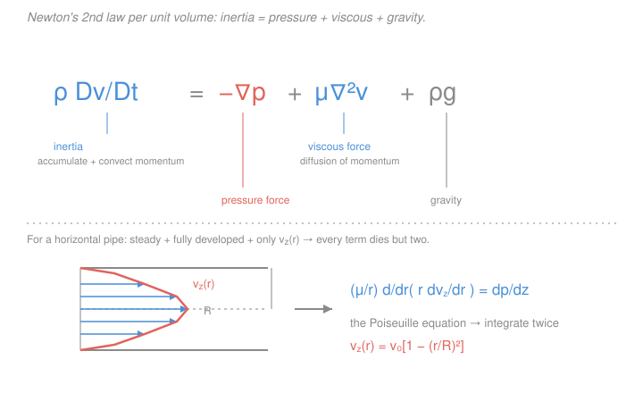

# Transport Phenomena · Lesson 2.4: The equation of motion (Navier–Stokes)

> ⏱ ~15 min · Module 2: The equations of change · Builds on: [2.1 Shell momentum balance](02-01-shell-momentum-balance-falling-film.md), [2.2 Tube & annulus](02-02-shell-balances-tube-annulus.md), [2.3 Equation of continuity](02-03-equation-of-continuity.md), [`fluid-dynamics` 1.6 Navier–Stokes](../../fluid-dynamics/lessons/01-06-navier-stokes.md) · Unlocks: [2.5 Energy equation](02-05-energy-equation-of-change.md), [3.1 Nondimensionalization](03-01-nondimensionalizing-equations-of-change.md), Boss Problem 2

## Why this matters

In [2.1](02-01-shell-momentum-balance-falling-film.md) and [2.2](02-02-shell-balances-tube-annulus.md) you drew a thin shell, balanced momentum in and out, and got an ODE — once for the falling film, again for the tube, again for the annulus. That works, but you re-derive it *from scratch* every time the geometry changes. There is a better way: do the momentum bookkeeping **once**, for a general point in the fluid, and get a single partial differential equation. That equation is **Navier–Stokes**. Every shell balance you will ever write is Navier–Stokes with the irrelevant terms crossed out. The skill this lesson teaches is not memorizing the PDE — it is the *crossing-out*: reading a geometry and killing terms until the vector PDE collapses to the one ODE that governs it.

## The idea

Navier–Stokes is just $F = ma$, written per unit volume of fluid, for every point at once. Picture a tiny blob of fluid. Newton says its mass times acceleration equals the sum of forces on it. Divide through by the blob's volume and you are talking about *densities*: $\rho$ (mass per volume) times acceleration equals force per volume. Three forces push on the blob:

- **Pressure** squeezes it — but only a *difference* in pressure across the blob gives a net push, so the force is $-\nabla p$ (fluid slides from high toward low pressure).
- **Viscosity** is neighbors dragging on neighbors — fast fluid tugging slow fluid up to speed. This is momentum *diffusing* sideways, exactly the way heat diffuses down a temperature gradient.
- **Gravity** pulls the blob down, $\rho\mathbf g$.

The one subtlety is "acceleration." A blob accelerates for two reasons: the flow speeds up in time (unsteady), *or* the blob drifts into a faster region (it was moving 1 m/s, it floats downstream to where the fluid moves 3 m/s — it accelerated without the field ever changing in time). That second, sneaky acceleration is **convection**, and the two together are the **substantial derivative** $D/Dt$ — the rate of change *following the fluid*, not sitting at a fixed point.

## The formal version

**The general equation of motion.** For *any* fluid,

$$\rho\,\frac{D\mathbf v}{Dt} = -\nabla p + \nabla\!\cdot\boldsymbol\tau + \rho\mathbf g,
\qquad \frac{D}{Dt} \equiv \frac{\partial}{\partial t} + \mathbf v\cdot\nabla.$$

*In words: (mass density)$\times$(acceleration following the fluid) $=$ pressure force $+$ viscous force $+$ gravity, all per unit volume.* Symbols, with units: $\rho$ = density ($\mathrm{kg/m^3}$); $\mathbf v$ = velocity ($\mathrm{m/s}$); $p$ = pressure ($\mathrm{Pa}=\mathrm{N/m^2}$); $\boldsymbol\tau$ = viscous stress tensor ($\mathrm{Pa}$); $\mathbf g$ = gravitational acceleration ($\mathrm{m/s^2}$). Unpacking the left side shows both accelerations:

$$\rho\,\frac{D\mathbf v}{Dt} = \underbrace{\rho\,\frac{\partial\mathbf v}{\partial t}}_{\text{accumulation}} + \underbrace{\rho\,(\mathbf v\cdot\nabla)\mathbf v}_{\text{convection}}.$$

**The Newtonian closure.** The stress tensor $\boldsymbol\tau$ says how the fluid resists deformation. For a **Newtonian** fluid — one whose stress is proportional to the rate of strain (the tensor version of $\tau_{yx}=-\mu\,dv_x/dy$ from [1.2](01-02-momentum-transport-newton-viscosity.md)) —

$$\boldsymbol\tau = \mu\big[\nabla\mathbf v + (\nabla\mathbf v)^{\mathsf T}\big].$$

*In words: viscous stress is the viscosity $\mu$ ($\mathrm{Pa\cdot s}$) times the symmetric part of the velocity-gradient tensor* — the fluid pushes back in proportion to how fast it is being sheared. Take the divergence of this, hold $\mu$ constant, and use incompressibility $\nabla\!\cdot\mathbf v = 0$ (that's [2.3](02-03-equation-of-continuity.md)): the transpose piece contributes $\nabla(\nabla\!\cdot\mathbf v)=0$, and what survives is $\nabla\!\cdot\boldsymbol\tau = \mu\nabla^2\mathbf v$. Substituting gives the star of the module:

$$\boxed{\;\rho\,\frac{D\mathbf v}{Dt} = -\nabla p + \mu\nabla^2\mathbf v + \rho\mathbf g\;}\qquad\text{(Navier–Stokes, constant }\rho,\mu).$$

**The transport theme, made explicit.** Divide by $\rho$: $\dfrac{D\mathbf v}{Dt} = -\dfrac1\rho\nabla p + \nu\nabla^2\mathbf v + \mathbf g$, with $\nu=\mu/\rho$ the **momentum diffusivity** ($\mathrm{m^2/s}$). That $\nu\nabla^2\mathbf v$ term is momentum spreading by diffusion — the same mathematical object as heat and mass spreading:

| Transported quantity | Diffusion term | Diffusivity | Equation of change |
|---|---|---|---|
| Momentum $\rho\mathbf v$ | $\nu\nabla^2\mathbf v$ | $\nu=\mu/\rho$ | Navier–Stokes (this lesson) |
| Heat $\rho c_p T$ | $\alpha\nabla^2 T$ | $\alpha=k/\rho c_p$ | [Energy, 2.5](02-05-energy-equation-of-change.md) / [heat eqn](../../heat-transfer/lessons/01-02-heat-equation.md) |
| Species $c_A$ | $D_{AB}\nabla^2 c_A$ | $D_{AB}$ | [Species, 2.6](02-06-species-continuity-equation.md) |

*Same PDE skeleton — accumulation + convection = diffusion + source — three times over.* The ratios of these diffusivities are exactly the $Pr=\nu/\alpha$ and $Sc=\nu/D_{AB}$ of [1.5](01-05-three-diffusivities-pr-sc-le.md).

## Picture

## Worked examples

**Example 1 — recover Hagen–Poiseuille from Navier–Stokes.** Steady flow in a horizontal tube of radius $R$, driven by a pressure drop. Assume what physics demands: **steady** ($\partial_t=0$), **axisymmetric** ($\partial_\theta=0$, no swirl so $v_\theta=v_r=0$), **fully developed** (profile no longer changes downstream, $\partial v_z/\partial z=0$), so the only unknown is $v_z(r)$. Write the $z$-component of Navier–Stokes in cylindrical coordinates and cross out the dead terms:

$$\rho\underbrace{\Big(\partial_t v_z + v_z\partial_z v_z\Big)}_{\text{steady, }\partial_z v_z=0\;\Rightarrow\;0}
= -\frac{dp}{dz} + \mu\Big[\underbrace{\tfrac1r\partial_r(r\,\partial_r v_z)}_{\text{survives}} + \underbrace{\tfrac1{r^2}\partial_\theta^2 v_z}_{=0} + \underbrace{\partial_z^2 v_z}_{=0}\Big] + \underbrace{\rho g_z}_{\text{horizontal}=0}.$$

Convection vanishes because a fluid particle sees the *same* profile everywhere downstream — it never speeds up. What is left is the shell-balance ODE of [2.2](02-02-shell-balances-tube-annulus.md), now derived without drawing a shell:

$$\frac{\mu}{r}\frac{d}{dr}\!\left(r\frac{dv_z}{dr}\right) = \frac{dp}{dz}.$$

The left side depends only on $r$, the right only on $z$, so both equal a constant: $dp/dz=-\Delta P/L$ ($\Delta P=P_0-P_L>0$ over length $L$). Integrate twice. First, $r\,dv_z/dr = \frac{1}{2\mu}\frac{dp}{dz}r^2 + C_1$; finiteness at the axis $r=0$ forces $C_1=0$. Again, $v_z = \frac{1}{4\mu}\frac{dp}{dz}r^2 + C_2$; no-slip $v_z(R)=0$ fixes $C_2$. Result:

$$v_z(r) = \frac{\Delta P\,R^2}{4\mu L}\left[1-\left(\frac rR\right)^2\right],$$

the same parabola as [2.2](02-02-shell-balances-tube-annulus.md), with $v_{\max}=\Delta P R^2/4\mu L$ at the center.

*Units/sanity check.* $\dfrac{\Delta P\,R^2}{\mu L}=\dfrac{\mathrm{Pa}\cdot\mathrm{m^2}}{\mathrm{Pa\cdot s}\cdot\mathrm{m}}=\mathrm{m/s}$ ✓. Zero at the wall, maximum on the axis, symmetric in $r$ — as a driven pipe flow must be. ✓

**Example 2 — planar Couette (Boss Problem 2a).** Two parallel plates a gap $b$ apart; the bottom is fixed, the top slides at speed $V$ in the $x$-direction. There is **no imposed pressure gradient** ($dp/dx=0$) — the top plate alone drags the fluid. Steady, fully developed, $x$ horizontal, so only $v_x(y)$ survives. The $x$-component of Navier–Stokes:

$$\rho\underbrace{\Big(\partial_t v_x + v_x\partial_x v_x\Big)}_{=0}
= -\underbrace{\partial_x p}_{=0} + \mu\Big[\underbrace{\partial_x^2 v_x}_{=0} + \partial_y^2 v_x + \underbrace{\partial_z^2 v_x}_{=0}\Big] + \underbrace{\rho g_x}_{=0}
\;\Longrightarrow\; \frac{d^2 v_x}{dy^2}=0.$$

Every term with a driver is gone; the profile obeys pure Laplace-type diffusion. Integrate: $v_x = C_1 y + C_2$. Apply the **no-slip boundary conditions** — fluid sticks to each plate:

$$v_x(0)=0\ \Rightarrow\ C_2=0, \qquad v_x(b)=V\ \Rightarrow\ C_1=\frac Vb.$$

$$\boxed{\,v_x(y) = \frac{V\,y}{b}\,}\qquad\text{a straight line from }0\text{ at the fixed plate to }V\text{ at the moving one.}$$

*Units/sanity check.* $(V/b)\,y = (\mathrm{m/s}/\mathrm{m})\cdot\mathrm{m}=\mathrm{m/s}$ ✓. The shear is uniform, $\tau_{yx}=\mu\,dv_x/dy=\mu V/b=$ const — a *constant* momentum flux, no accumulation, no source. That is the exact twin of **steady 1-D heat conduction** with no generation, $d^2T/dy^2=0$, whose solution is a linear temperature profile between two wall temperatures. Linear velocity here, linear temperature there — the same "diffusion, no source" equation wearing different clothes. ✓

## Watch out

- **You might think you must memorize which terms drop for each geometry.** You don't — you *derive* it. Write full Navier–Stokes, then cross out terms one physical assumption at a time (steady kills $\partial_t$; fully developed kills the streamwise derivative and with it convection; symmetry kills the angular/transverse Laplacian pieces; horizontal kills the gravity component along the flow). The surviving line *is* your shell-balance ODE.
- **You might think "fully developed" and "steady" are the same thing.** Steady means nothing changes *in time* at a fixed point ($\partial_t=0$). Fully developed means the profile stops changing *along the flow direction* ($\partial_z v_z=0$). A flow can be steady but still developing near an inlet. In Example 1 you need *both*, and it is fully-developed that annihilates the convection term.
- **You might trip on the sign of $\boldsymbol\tau$.** Here $\boldsymbol\tau=\mu[\nabla\mathbf v+(\nabla\mathbf v)^{\mathsf T}]$ is a *stress* (force per area, positive down-gradient in velocity). Bird–Stewart–Lightfoot sometimes write the *momentum-flux* tensor with the opposite sign — mirroring $\tau_{yx}=-\mu\,dv_x/dy$ from [1.2](01-02-momentum-transport-newton-viscosity.md), where momentum flows down the velocity gradient. The physics is identical; only whether you call it "flux" or "force" flips the sign. For constant-property incompressible flow both routes land on the same $+\mu\nabla^2\mathbf v$.

## One-liner

> Navier–Stokes is $F=ma$ per unit volume — inertia $=$ pressure $+$ viscous $+$ gravity — and every shell balance is that PDE with symmetry crossing out all but one term.

## Problems

**P1 (🟢)** A liquid runs down a vertical wall as a thin film of thickness $\delta$; let $x$ be measured outward from the wall, with flow in the vertical direction (call the velocity $v(x)$). The outer face is open air, so no pressure gradient drives the flow — gravity does. Starting from $\rho\,\frac{D\mathbf v}{Dt}=-\nabla p+\mu\nabla^2\mathbf v+\rho\mathbf g$, cross out the dead terms (steady, fully developed, $v=v(x)$ only) and show the film obeys $\mu\,\dfrac{d^2v}{dx^2}=-\rho g$. Name the assumption that kills each discarded term.

**P2 (🟡)** Integrate P1's ODE with **no-slip at the wall** $v(0)=0$ and **zero shear at the free surface** $\left.\dfrac{dv}{dx}\right|_{x=\delta}=0$ (air exerts negligible drag). Find $v(x)$, the surface (maximum) velocity, and show the average velocity is $\langle v\rangle=\tfrac23 v_{\max}$.

**P3 (🔴, optional)** The Couette result $d^2v_x/dy^2=0$ and steady sourceless conduction $d^2T/dy^2=0$ are the same equation. Divide incompressible Navier–Stokes by $\rho$ and the heat equation by $\rho c_p$; identify the diffusivity that plays $\mu$'s structural role in each, and state which dimensionless group is their ratio. Why does that ratio being $\approx 1$ for gases mean the velocity and temperature profiles in this gap would look nearly identical?

Solutions

**P1** Take gravity along the flow, so its component in the flow direction is $+\rho g$ (pointing downhill). The flow-direction component of Navier–Stokes:

$$\rho\underbrace{\big(\partial_t v + v\,\partial_{\text{flow}} v\big)}_{\text{steady}\Rightarrow\partial_t=0;\ \text{fully developed}\Rightarrow\partial_{\text{flow}}v=0}
= -\underbrace{\partial_{\text{flow}}\,p}_{\text{open surface}\Rightarrow0} + \mu\Big[\underbrace{\partial_{\text{flow}}^2 v}_{\text{f.d.}=0}+\partial_x^2 v\Big] + \rho g.$$

- $\partial_t v=0$: **steady**.
- convection $v\,\partial_{\text{flow}}v=0$ and $\partial_{\text{flow}}^2 v=0$: **fully developed** (nothing varies along the flow).
- $\partial_{\text{flow}}p=0$: **no imposed pressure gradient** (free surface open to constant atmospheric pressure).

What remains is $0=\mu\,d^2v/dx^2+\rho g$, i.e. $\mu\,\dfrac{d^2v}{dx^2}=-\rho g$. ✓ Gravity is the source; viscous diffusion balances it. This is the falling-film ODE of [2.1](02-01-shell-momentum-balance-falling-film.md).

**P2** Integrate once: $\dfrac{dv}{dx}=-\dfrac{\rho g}{\mu}x + C_1$. Free-surface BC $v'(\delta)=0\Rightarrow C_1=\dfrac{\rho g\delta}{\mu}$. Integrate again: $v=-\dfrac{\rho g}{2\mu}x^2+\dfrac{\rho g\delta}{\mu}x + C_2$; no-slip $v(0)=0\Rightarrow C_2=0$. So

$$v(x)=\frac{\rho g}{\mu}\left(\delta x-\frac{x^2}{2}\right)=\frac{\rho g\delta^2}{2\mu}\left[2\frac x\delta-\left(\frac x\delta\right)^2\right].$$

Maximum at the free surface $x=\delta$: $v_{\max}=\dfrac{\rho g\delta^2}{2\mu}$. Average:

$$\langle v\rangle=\frac1\delta\int_0^\delta v\,dx=\frac{\rho g}{\mu\delta}\left[\frac{\delta x^2}{2}-\frac{x^3}{6}\right]_0^\delta=\frac{\rho g}{\mu\delta}\cdot\frac{\delta^3}{3}=\frac{\rho g\delta^2}{3\mu}.$$

Then $\dfrac{\langle v\rangle}{v_{\max}}=\dfrac{\rho g\delta^2/3\mu}{\rho g\delta^2/2\mu}=\dfrac23$. ✓

*Units/sanity check.* $\dfrac{\rho g\delta^2}{\mu}=\dfrac{(\mathrm{kg/m^3})(\mathrm{m/s^2})(\mathrm{m^2})}{\mathrm{Pa\cdot s}}=\dfrac{\mathrm{kg/(m\cdot s^2)}}{\mathrm{kg/(m\cdot s)}}=\mathrm{m/s}$ ✓. Zero at the wall, max at the surface, $\tfrac23$ ratio — matching the pinned falling-film result with $\beta=0$. ✓

**P3** Dividing through: Navier–Stokes $\to \dfrac{D\mathbf v}{Dt}=-\dfrac1\rho\nabla p+\nu\nabla^2\mathbf v+\mathbf g$ with $\nu=\mu/\rho$; the heat equation $\to \dfrac{DT}{Dt}=\alpha\nabla^2 T+\text{(source)}$ with $\alpha=k/\rho c_p$. So **$\nu$ (momentum diffusivity) plays $\mu$'s structural role for velocity, and $\alpha$ (thermal diffusivity) plays it for temperature.** Their ratio is the **Prandtl number** $Pr=\nu/\alpha=c_p\mu/k$ (from [1.5](01-05-three-diffusivities-pr-sc-le.md)). When $Pr\approx1$ (typical of gases, where one molecular speed carries both momentum and energy), momentum and heat diffuse at the same rate, so the two sourceless linear profiles — velocity and temperature across the gap — have the *same shape*. This is the seed of the transport analogies in [Module 5](05-01-transport-analogies.md).

## Flashback

**From Lesson 2.3 (Equation of continuity):** A steady 2-D incompressible flow has $x$-velocity $v_x = a\,x$ (a uniform stretching, $a>0$ in $\mathrm{s^{-1}}$). Find $v_y(x,y)$ given that $v_y=0$ along the wall $y=0$. (This is precisely the incompressibility you leaned on above to turn $\nabla\!\cdot\boldsymbol\tau$ into $\mu\nabla^2\mathbf v$.)

Solution

Incompressible continuity in 2-D is $\nabla\!\cdot\mathbf v=\dfrac{\partial v_x}{\partial x}+\dfrac{\partial v_y}{\partial y}=0$. With $v_x=ax$, $\partial v_x/\partial x=a$, so

$$\frac{\partial v_y}{\partial y}=-a \;\Longrightarrow\; v_y=-a\,y+f(x).$$

The wall condition $v_y(x,0)=0$ gives $f(x)=0$, hence $v_y=-a\,y$.

*Units/sanity check.* $[a\,y]=\mathrm{s^{-1}}\cdot\mathrm{m}=\mathrm{m/s}$ ✓. Fluid stretched outward in $x$ ($v_x=ax>0$) must be squeezed inward toward the wall in $y$ ($v_y=-ay<0$) to conserve volume — the signature of an incompressible stagnation-type flow. ✓

## Connections

- **Backward:** this generalizes the shell balances of [2.1](02-01-shell-momentum-balance-falling-film.md)/[2.2](02-02-shell-balances-tube-annulus.md) — Example 1 reproduces the tube parabola and P1–P2 the falling film, both *without drawing a shell*. It uses [2.3](02-03-equation-of-continuity.md)'s incompressibility to collapse the stress divergence to $\mu\nabla^2\mathbf v$, and the Newtonian law from [1.2](01-02-momentum-transport-newton-viscosity.md) as its stress closure.
- **Forward:** [2.5 the energy equation](02-05-energy-equation-of-change.md) is this same accumulation-plus-convection-equals-diffusion-plus-source template for heat; [3.1](03-01-nondimensionalizing-equations-of-change.md) nondimensionalizes Navier–Stokes to birth the Reynolds number, and Boss Problem 2 continues from Example 2's Couette flow.
- **Sideways:** this is the same Navier–Stokes derived in [`fluid-dynamics` 1.6](../../fluid-dynamics/lessons/01-06-navier-stokes.md); the Couette and Poiseuille solutions are worked geometrically in [`fluid-dynamics` 3.2](../../fluid-dynamics/lessons/03-02-couette-poiseuille.md). The $d^2/dy^2=0$ profile of Example 2 is literally steady 1-D conduction from [`heat-transfer` 1.2](../../heat-transfer/lessons/01-02-heat-equation.md) with $\mu\leftrightarrow k$ — the momentum/heat analogy of [1.5](01-05-three-diffusivities-pr-sc-le.md), cashed out.
