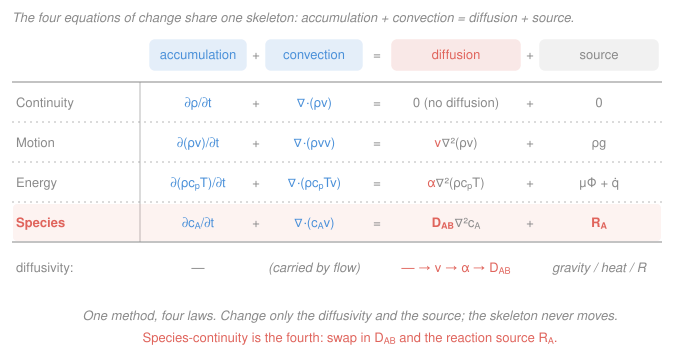

# Transport Phenomena · Lesson 2.6: The species-continuity equation

> ⏱ ~15 min · Module 2: The equations of change · Builds on: [2.3 Equation of continuity](02-03-equation-of-continuity.md), [2.5 Energy equation of change](02-05-energy-equation-of-change.md), [1.3 Fourier & Fick fluxes](01-03-heat-mass-fluxes-fourier-fick.md), [`materials-science` 2.5 (transient diffusion)](../../materials-science/lessons/02-05-diffusion-ii-transient-arrhenius.md) · Unlocks: all of Module 4 (mass transport) and Boss problem 4

## Why this matters

You've now built three of the four field equations of transport: continuity tracks *mass*, the Navier–Stokes equation tracks *momentum*, the energy equation tracks *heat*. One player is still on the bench — the amount of a **particular chemical species** A dissolved or mixed in the flow. Where does the CO$_2$ go after it dissolves? How deep does carbon diffuse into steel while it convects in the furnace gas? How much reactant survives to the center of a catalyst pellet? Every one of those questions is answered by the same object we're about to write down. And here's the payoff of the whole module: **it's the same equation as the other three**, with a different diffusivity and a different source. Learn the skeleton once; you already know all four.

## The idea

Put an imaginary box in the flow and count molecules of A crossing its walls. A can enter or leave a box **two ways**: it can be *carried in bodily by the bulk flow* (convection — the river sweeps the dye along), or it can *seep across on its own down a concentration gradient* (diffusion — Fick's law, the dye spreading even in still water). On top of that, A can be *created or destroyed inside the box* by chemical reaction. Bookkeeping over the box says:

$$\text{(rate A piles up inside)} = \text{(net A carried in by flow)} + \text{(net A diffusing in)} + \text{(A made by reaction)}.$$

That's the entire content of the equation. It is Fick's law (1.3) plugged into a conservation ledger, exactly the way the energy equation (2.5) is Fourier's law plugged into an energy ledger. Same structure, different cargo.

## The formal version

Take a fixed control volume. The **molar concentration** of A is $c_A$ (mol·m⁻³). The total **molar flux** of A past a stationary point has two pieces — convection with the mixture velocity $\mathbf v$ (m·s⁻¹) plus Fickian diffusion (from [1.3](01-03-heat-mass-fluxes-fourier-fick.md)):

$$\mathbf N_A = \underbrace{c_A\mathbf v}_{\text{convection}} \;-\; \underbrace{D_{AB}\nabla c_A}_{\text{diffusion}},$$

where $D_{AB}$ (m²·s⁻¹) is the **binary diffusivity** of A in B. Conservation of A over the box — accumulation equals net influx plus generation — is $\dfrac{\partial c_A}{\partial t} = -\nabla\!\cdot\mathbf N_A + R_A$, where $R_A$ (mol·m⁻³·s⁻¹) is the **homogeneous (volumetric) reaction rate**, positive if A is produced. Substituting $\mathbf N_A$ and taking $D_{AB}$ constant:

$$\boxed{\;\dfrac{\partial c_A}{\partial t}+\nabla\!\cdot(c_A\mathbf v)=D_{AB}\nabla^2 c_A+R_A\;}$$

*In words: (A accumulating) + (A convected out) = (A diffusing in) + (A made by reaction).* This is the **species-continuity equation** in its constant-property, dilute form. Every symbol: $c_A$ concentration of A, $\mathbf v$ mixture velocity, $D_{AB}$ diffusivity of A in B, $R_A$ reaction source, $\nabla^2$ the Laplacian.

Two limits worth pinning down now:

- **No reaction, incompressible flow.** Since $\nabla\!\cdot\mathbf v=0$ (continuity, [2.3](02-03-equation-of-continuity.md)), $\nabla\!\cdot(c_A\mathbf v)=\mathbf v\!\cdot\!\nabla c_A$, so the equation collapses to the substantial-derivative form $\dfrac{Dc_A}{Dt}=D_{AB}\nabla^2 c_A$ — "riding along with a fluid particle, A only changes by diffusing."
- **No flow at all** ($\mathbf v=0$), no reaction. Then

$$\dfrac{\partial c_A}{\partial t}=D_{AB}\nabla^2 c_A.$$

This is **Fick's second law**, and it is *identical* to the transient heat-conduction equation $\partial_t T=\alpha\nabla^2 T$ from [`heat-transfer` 1.2](../../heat-transfer/lessons/01-02-heat-equation.md) with the single swap $\alpha\to D_{AB}$. **That is the bridge:** every transient-conduction result — the semi-infinite $\operatorname{erfc}$ solution, the Heisler charts, the Fourier number — transfers to mass by replacing thermal diffusivity with mass diffusivity ($Fo_m=D_{AB}t/L^2$). We cash this in at [4.4](04-04-transient-multidimensional-diffusion.md).

**The family portrait.** All four equations of change are the *same sentence* — accumulation + convection = diffusion + source:

| Equation | Conserved quantity | Diffusivity | Source term |
|---|---|---|---|
| Continuity ([2.3](02-03-equation-of-continuity.md)) | mass $\rho$ | — (no diffusion) | none |
| Motion ([2.4](02-04-equation-of-motion-navier-stokes.md)) | momentum $\rho\mathbf v$ | $\nu=\mu/\rho$ | gravity $\rho\mathbf g$ |
| Energy ([2.5](02-05-energy-equation-of-change.md)) | heat $\rho c_p T$ | $\alpha=k/\rho c_p$ | dissipation $\mu\Phi_v+\dot q$ |
| **Species (this lesson)** | **moles A** $c_A$ | $D_{AB}$ | **reaction** $R_A$ |

Three molecular diffusivities — $\nu,\alpha,D_{AB}$, all m²·s⁻¹ — and their ratios are the Prandtl, Schmidt, and Lewis numbers from [1.5](01-05-three-diffusivities-pr-sc-le.md). One method, four laws.

**Boundary conditions for species** (the mass analogues of fixed-temperature / fixed-flux / convective walls):

1. **Fixed concentration** (Dirichlet): $c_A=c_{A,s}$ at a surface — e.g. a gas in equilibrium with a liquid sets the interface concentration by Henry's law, or a dissolving solid holds its saturation value.
2. **Fixed flux / impermeable** (Neumann): $N_A=-D_{AB}\,\partial c_A/\partial n$ prescribed; a sealed or symmetry wall gives **zero flux**, $\partial c_A/\partial n=0$.
3. **Reaction at a surface** (mixed/Robin): what diffuses up to the wall is consumed there. For a first-order surface reaction, $-D_{AB}\dfrac{\partial c_A}{\partial n}\Big|_s=k_s''\,c_{A,s}$; a very fast surface reaction drives $c_{A,s}\to 0$.

## Picture

## Worked examples

**Example 1 — steady diffusion through a membrane (the mass analogue of a wall conducting heat).** No flow, no reaction, steady state, 1-D across a film of thickness $L$. The equation guts itself down to

$$0=D_{AB}\frac{d^2 c_A}{dx^2}\quad\Longrightarrow\quad \frac{d^2 c_A}{dx^2}=0.$$

Integrate twice: $c_A(x)=C_1x+C_2$ — a **straight line**, just like the steady temperature profile in a plane wall. With $c_A(0)=c_{A0}$ and $c_A(L)=c_{AL}$,

$$c_A(x)=c_{A0}+(c_{AL}-c_{A0})\frac{x}{L}.$$

The flux is constant across the film (Fick, [1.3](01-03-heat-mass-fluxes-fourier-fick.md)):

$$N_A=-D_{AB}\frac{dc_A}{dx}=\frac{D_{AB}}{L}\,(c_{A0}-c_{AL}).$$

Numbers: a $L=1\ \mathrm{mm}=10^{-3}\ \mathrm{m}$ liquid film, $D_{AB}=1\times10^{-9}\ \mathrm{m^2\,s^{-1}}$, holding $c_{A0}=10\ \mathrm{mol\,m^{-3}}$ on one face and $c_{AL}=2\ \mathrm{mol\,m^{-3}}$ on the other:

$$N_A=\frac{10^{-9}}{10^{-3}}(10-2)=8\times10^{-6}\ \mathrm{mol\,m^{-2}\,s^{-1}}.$$

*Units check:* $\dfrac{\mathrm{m^2\,s^{-1}}}{\mathrm m}\cdot\mathrm{mol\,m^{-3}}=\mathrm{mol\,m^{-2}\,s^{-1}}$ ✓. This is exactly $q''=k\,\Delta T/L$ with $k\to D_{AB}$ and $\Delta T\to \Delta c_A$ — diffusion resistance $L/D_{AB}$ in series, the mass version of Ohm's law.

**Example 2 — add a homogeneous reaction (set up the profile Module 4 finishes).** Now A is consumed in the bulk by a first-order reaction, $R_A=-k_1 c_A$ with rate constant $k_1$ (s⁻¹). Still no flow, still steady, still 1-D in a slab. The equation keeps its diffusion term *and* the source:

$$0=D_{AB}\frac{d^2 c_A}{dx^2}-k_1 c_A\quad\Longrightarrow\quad \boxed{\;D_{AB}\frac{d^2 c_A}{dx^2}=k_1 c_A\;}$$

Write it as $\dfrac{d^2 c_A}{dx^2}=m^2 c_A$ with $m=\sqrt{k_1/D_{AB}}$ (units m⁻¹). This is the same second-order ODE that gives springs and RC lines, but with a **positive** coefficient, so the solutions are **hyperbolic**, not sinusoidal:

$$c_A(x)=A\cosh(mx)+B\sinh(mx).$$

Take a slab of thickness $L$ with its surface exposed, $c_A(0)=c_{A,s}$, and impermeable at the far face, $\dfrac{dc_A}{dx}\big|_{x=L}=0$ (BC types 1 and 2 above). Those constants fall out to give

$$c_A(x)=c_{A,s}\,\frac{\cosh\!\big(m(L-x)\big)}{\cosh(mL)},$$

the concentration sagging toward the sealed core because reaction eats A faster than diffusion can resupply it. The dimensionless group governing how much it sags is the **Thiele modulus** $\phi=mL=L\sqrt{k_1/D_{AB}}$ — the ratio of reaction rate to diffusion rate. We solve this fully, and define the catalyst effectiveness factor $\eta=\tanh\phi/\phi$, in [4.3 (diffusion with reaction)](04-03-diffusion-with-reaction-thiele.md). Notice we did nothing new here: we just kept the source term the energy equation also carries. *Sanity check:* if $k_1\to0$ then $m\to0$, $\cosh\to1$, and $c_A\to c_{A,s}$ everywhere — no reaction, flat profile, as it must be.

## Watch out

- **You might think convection and diffusion are alternatives — pick one.** Actually both act at once; $\mathbf N_A=c_A\mathbf v-D_{AB}\nabla c_A$ always has both terms. Which *dominates* is set by the Péclet number $Pe=VL/D_{AB}$ (big $Pe$ → convection wins). Dropping the convection term is a modeling choice you justify, not a law.
- **You might write the reaction source as $+k_1 c_A$ for a species being consumed.** The sign of $R_A$ is production-positive: A *disappearing* means $R_A=-k_1c_A$. Flip that sign and your slab would *manufacture* A and your $\cosh$ would become a $\cos$ — a completely different (and wrong) physics.
- **You might reach for a fresh solver for transient diffusion.** Don't — with $\mathbf v=0$ it's the heat equation you already solved in [`heat-transfer`](../../heat-transfer/lessons/02-02-semi-infinite-solid.md). Reuse the $\operatorname{erfc}$ solution and Heisler charts verbatim with $\alpha\to D_{AB}$; only the diffusivity's name changes.

## One-liner

> Species-continuity is the fourth equation of change — accumulation + convection = diffusion + reaction — and with no flow it's just the heat equation wearing a $D_{AB}$ nametag.

## Problems

**P1 (🟢)** Oxygen diffuses at steady state, with no reaction and no flow, across a stagnant water layer $L=2\ \mathrm{mm}$ thick. The concentration is $c_{A0}=0.25\ \mathrm{mol\,m^{-3}}$ at the top face and $c_{AL}=0.05\ \mathrm{mol\,m^{-3}}$ at the bottom; $D_{AB}=2.1\times10^{-9}\ \mathrm{m^2\,s^{-1}}$. Find the concentration profile $c_A(x)$ and the molar flux $N_A$.

**P2 (🟡)** Starting from the full species-continuity equation, list which term(s) you drop, and why, to reach each of these: (a) Fick's second law $\partial_t c_A=D_{AB}\nabla^2 c_A$; (b) steady diffusion–reaction $D_{AB}c_A''=k_1c_A$; (c) pure convective transport of a non-reacting tracer $\partial_t c_A+\mathbf v\!\cdot\!\nabla c_A=0$.

**P3 (🔴)** A first-order reaction $R_A=-k_1 c_A$ proceeds in a slab of *half*-thickness $L$ exposed on **both** faces to $c_{A,s}$, so the profile is symmetric about the center $x=0$. Set up the ODE and boundary conditions, and show the solution is $c_A(x)=c_{A,s}\dfrac{\cosh(mx)}{\cosh(mL)}$ with $m=\sqrt{k_1/D_{AB}}$. What is the concentration at the center relative to the surface?

Solutions

**P1** No flow, no reaction, steady, 1-D ⇒ $d^2c_A/dx^2=0$ ⇒ linear profile. With $x$ measured down from the top face,
$$c_A(x)=c_{A0}+(c_{AL}-c_{A0})\frac{x}{L}=0.25-0.20\,\frac{x}{0.002}=0.25-100\,x\ \ (\mathrm{mol\,m^{-3}},\ x\ \text{in m}).$$
Flux:
$$N_A=-D_{AB}\frac{dc_A}{dx}=\frac{D_{AB}}{L}(c_{A0}-c_{AL})=\frac{2.1\times10^{-9}}{0.002}(0.25-0.05)=2.1\times10^{-7}\ \mathrm{mol\,m^{-2}\,s^{-1}}.$$
*Units:* $(\mathrm{m^2\,s^{-1}}/\mathrm m)\,\mathrm{mol\,m^{-3}}=\mathrm{mol\,m^{-2}\,s^{-1}}$ ✓. Positive and downward — A flows from high to low concentration, as it should.

**P2** Start from $\partial_t c_A+\nabla\!\cdot(c_A\mathbf v)=D_{AB}\nabla^2c_A+R_A$.
(a) Set $\mathbf v=0$ (no flow) and $R_A=0$ (no reaction): the convection and source terms vanish, leaving $\partial_t c_A=D_{AB}\nabla^2c_A$.
(b) Drop $\partial_t c_A$ (steady) and $\mathbf v=0$ (no flow), keep $R_A=-k_1c_A$: $0=D_{AB}c_A''-k_1c_A$, i.e. $D_{AB}c_A''=k_1c_A$.
(c) Drop $R_A=0$ (inert tracer) and $D_{AB}\to0$ (or $Pe\to\infty$, diffusion negligible); using $\nabla\!\cdot\mathbf v=0$ for incompressible flow so $\nabla\!\cdot(c_A\mathbf v)=\mathbf v\!\cdot\!\nabla c_A$: $\partial_t c_A+\mathbf v\!\cdot\!\nabla c_A=0$. (The tracer just rides the flow — its substantial derivative is zero.)

**P3** Steady, no flow, 1-D with $R_A=-k_1c_A$: $D_{AB}c_A''-k_1c_A=0\Rightarrow c_A''=m^2c_A$, $m=\sqrt{k_1/D_{AB}}$. General solution $c_A=A\cosh(mx)+B\sinh(mx)$. Symmetry about $x=0$ means zero flux at the center, $c_A'(0)=0$; since $c_A'=Am\sinh(mx)+Bm\cosh(mx)$, at $x=0$ this gives $Bm=0\Rightarrow B=0$. Then $c_A=A\cosh(mx)$, and $c_A(L)=c_{A,s}\Rightarrow A=c_{A,s}/\cosh(mL)$. Hence
$$c_A(x)=c_{A,s}\frac{\cosh(mx)}{\cosh(mL)}.$$
Center value ($x=0$, $\cosh0=1$): $c_A(0)=c_{A,s}/\cosh(mL)=c_{A,s}/\cosh\phi$ with Thiele modulus $\phi=mL$. For large $\phi$ (fast reaction / slow diffusion), $\cosh\phi$ is huge and the center is starved of A ($c_A(0)\to0$); for small $\phi$, $\cosh\phi\to1$ and the slab is nearly uniform. This is exactly the profile [4.3](04-03-diffusion-with-reaction-thiele.md) builds the effectiveness factor from.

## Flashback

**From Lesson 2.3 (Equation of continuity):** A steady, incompressible, 2-D flow has velocity component $v_x=a\,(x^2-y^2)$, with $a$ a constant (s⁻¹·m⁻¹... check the units yourself). Given that $v_y=0$ along the wall $y=0$, find $v_y(x,y)$.

Solution

Incompressible continuity ([2.3](02-03-equation-of-continuity.md)) in 2-D: $\dfrac{\partial v_x}{\partial x}+\dfrac{\partial v_y}{\partial y}=0$. Compute $\dfrac{\partial v_x}{\partial x}=2ax$, so
$$\frac{\partial v_y}{\partial y}=-2ax\quad\Longrightarrow\quad v_y=-2axy+g(x).$$
Apply $v_y(x,0)=0$: the term $-2ax(0)=0$, so $g(x)=0$. Therefore $v_y=-2axy$. *Check:* $\nabla\!\cdot\mathbf v=2ax+(-2ax)=0$ ✓ — the field is genuinely divergence-free, so it conserves mass, and that same left-hand-side machinery is what carries species A around in this lesson's convection term $\nabla\!\cdot(c_A\mathbf v)$.

## Connections

- **Backward:** this is [2.3](02-03-equation-of-continuity.md)'s mass balance and [2.5](02-05-energy-equation-of-change.md)'s energy balance run a third time, with Fick's law ([1.3](01-03-heat-mass-fluxes-fourier-fick.md)) supplying the diffusion term and the three diffusivities $\nu,\alpha,D_{AB}$ ([1.5](01-05-three-diffusivities-pr-sc-le.md)) now standing complete.
- **Forward:** every lesson of Module 4 is a special case of this equation — steady diffusion in mixtures ([4.1](04-01-diffusion-binary-mixtures-fluxes-frames.md)), the Stefan stagnant film ([4.2](04-02-diffusion-stagnant-film-stefan.md)), diffusion with reaction and the Thiele modulus ([4.3](04-03-diffusion-with-reaction-thiele.md)), and transient diffusion via the heat-equation analogy ([4.4](04-04-transient-multidimensional-diffusion.md)). Boss problem 4 asks you to pick the right terms to keep.
- **Sideways:** the no-flow limit is *literally* the transient-conduction equation of [`heat-transfer` 1.2](../../heat-transfer/lessons/01-02-heat-equation.md) and the semi-infinite solid of [`heat-transfer` 2.2](../../heat-transfer/lessons/02-02-semi-infinite-solid.md) with $\alpha\to D_{AB}$; it is also the carburizing / doping law you met in [`materials-science` 2.5](../../materials-science/lessons/02-05-diffusion-ii-transient-arrhenius.md). The homogeneous-reaction source $R_A$ is where this course hands off to reaction engineering, which turns $\eta=\tanh\phi/\phi$ into reactor design.
