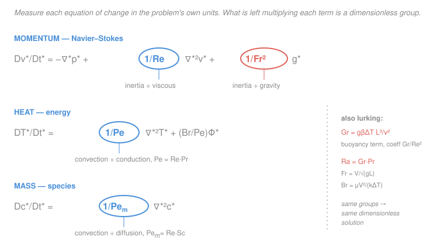

# Transport Phenomena · Lesson 3.1: Nondimensionalizing the equations of change

> ⏱ ~15 min · Module 3: Dimensional analysis, boundary layers, and convection · Builds on: [2.4 Navier–Stokes](02-04-equation-of-motion-navier-stokes.md), [2.5 energy equation](02-05-energy-equation-of-change.md), [2.6 species continuity](02-06-species-continuity-equation.md), [1.5 Pr, Sc, Le](01-05-three-diffusivities-pr-sc-le.md), [`heat-transfer` 3.2 Re–Pr–Nu](../../heat-transfer/lessons/03-02-dimensionless-groups-re-pr-nu.md), [`fluid-dynamics` 3.1 Reynolds number](../../fluid-dynamics/lessons/03-01-reynolds-number.md) · Unlocks: 3.2–3.5, Boss problem 3

## Why this matters

You have now built all four equations of change. They are correct but forbidding: every one is stuffed with $\rho$, $\mu$, $k$, $D_{AB}$, $g$, and a fistful of characteristic sizes. Two questions look impossible to answer as written. *Which term actually matters here* — is viscosity negligible or dominant? And *why does a lab model of a ship, a heat exchanger, or a chemical reactor predict the full-scale machine at all?*

Both answers come from one move: re-measure the equation in units natural to the problem. When you do, the equation becomes pure numbers, and whatever is left multiplying each term is a **dimensionless group** — $Re$, $Pe$, $Gr$, $Fr$. Those groups are not pulled from a Buckingham-$\pi$ table; they *fall out as coefficients*. And they are the reason every convection correlation you will ever use has the form $Nu=f(Re,Pr)$ and $Sh=f(Re,Sc)$ — not by convention, but by necessity.

## The idea

Suppose a pipe flow has diameter $L$ and mean speed $V$. Then it is silly to measure position in meters — measure it in *pipe diameters*. Set $x^* = x/L$, so $x^*$ runs from $0$ to $1$ across the pipe no matter how big the pipe is. Likewise measure every velocity in units of $V$ ($v^* = v/V$), every temperature drop in units of the imposed $\Delta T$, every time in units of the natural "flow-through" time $L/V$. Every starred variable is now a plain $O(1)$ number.

Feed these into the equation of change and something clean happens. The *shape* of the equation is unchanged, but each term now carries a numerical prefactor built from $\rho, \mu, V, L, \dots$ — and every prefactor is dimensionless. Divide through so the inertia term has coefficient $1$, and the surviving coefficients are ratios of physical effects. The coefficient sitting on the viscous term turns out to be exactly $1/Re$. **Large $Re$ means "the viscous term is tiny"** — inertia dominates. **Small $Re$ means "the viscous term is huge"** — creeping flow. The group *is* the term's importance, read straight off the equation.

And here is the payoff: if two flows have the same dimensionless equation *and* the same dimensionless boundary conditions, they have the **same dimensionless solution** $v^*(x^*)$. A tenth-scale model and the real thing are then literally the same math problem in different units. That is why model testing works.

## The formal version

**Characteristic scales.** Pick one representative value for each quantity: a length $L$ (m), a velocity $V$ (m/s), a temperature difference $\Delta T$ (K), a concentration difference $\Delta c$ (mol/m³), and a pressure scale. Define dimensionless variables

$$x^* = \frac{x}{L},\quad \mathbf v^* = \frac{\mathbf v}{V},\quad t^* = \frac{t}{L/V},\quad T^* = \frac{T-T_0}{\Delta T},\quad c_A^* = \frac{c_A-c_{A0}}{\Delta c},\quad p^* = \frac{p-p_0}{\rho V^2},$$

and the dimensionless operators $\nabla^* = L\nabla$, $\nabla^{*2}=L^2\nabla^2$, $\dfrac{D}{Dt^*}=\dfrac{L}{V}\dfrac{D}{Dt}$. *In words: strip the units out of every variable and every derivative by dividing by its characteristic size.*

**Momentum.** Start from incompressible Navier–Stokes (from [2.4](02-04-equation-of-motion-navier-stokes.md)), substitute, and divide through by the inertial prefactor $\rho V^2/L$:

$$\frac{D\mathbf v^*}{Dt^*} = -\nabla^* p^* + \underbrace{\frac{\mu}{\rho VL}}_{1/Re}\,\nabla^{*2}\mathbf v^* + \underbrace{\frac{gL}{V^2}}_{1/Fr^2}\,\hat{\mathbf g}.$$

*In words: measured in its own units, the whole flow depends on just two numbers.* The viscous coefficient is $\dfrac{\mu}{\rho VL}=\dfrac{1}{Re}$ with the **Reynolds number** $Re=\dfrac{\rho VL}{\mu}$ (inertia ÷ viscous); the gravity coefficient defines the **Froude number** $Fr=\dfrac{V}{\sqrt{gL}}$ (inertia ÷ gravity), which matters when a free surface is present.

**Energy.** Do the same to the energy equation ([2.5](02-05-energy-equation-of-change.md)), dividing by $\rho c_p V\Delta T/L$:

$$\frac{DT^*}{Dt^*} = \underbrace{\frac{\alpha}{VL}}_{1/Pe}\,\nabla^{*2}T^* + \frac{Br}{Pe}\,\Phi_v^*,\qquad Pe=\frac{VL}{\alpha}=Re\,Pr.$$

The conduction coefficient is $1/Pe$, the **Péclet number** $Pe=Re\,Pr$ (convection ÷ conduction) — and because $Pe$ factors into $Re\,Pr$, the temperature field can only depend on $Re$ and $Pr$. The dissipation term carries the **Brinkman number** $Br=\mu V^2/(k\,\Delta T)$ (Boss problem 2's group).

**Mass.** Identically, the species equation ([2.6](02-06-species-continuity-equation.md)) gives

$$\frac{Dc_A^*}{Dt^*} = \underbrace{\frac{D_{AB}}{VL}}_{1/Pe_m}\,\nabla^{*2}c_A^*,\qquad Pe_m=\frac{VL}{D_{AB}}=Re\,Sc.$$

*In words: same equation as heat, with $Pr$ swapped for $Sc$* — the grand analogy, now visible in the coefficients.

**The groups as coefficients.** Every group is one term's importance relative to inertia (or convection):

| Group | Definition | Coefficient of | Ratio it measures |
|---|---|---|---|
| $Re$ | $\rho VL/\mu$ | viscous term ($1/Re$) | inertia ÷ viscous |
| $Pe=Re\,Pr$ | $VL/\alpha$ | conduction term ($1/Pe$) | convection ÷ conduction (heat) |
| $Pe_m=Re\,Sc$ | $VL/D_{AB}$ | diffusion term ($1/Pe_m$) | convection ÷ diffusion (mass) |
| $Fr$ | $V/\sqrt{gL}$ | gravity term ($1/Fr^2$) | inertia ÷ gravity |
| $Gr$ | $g\beta\Delta T\,L^3/\nu^2$ | buoyancy term ($Gr/Re^2$) | buoyancy ÷ viscous |
| $Br$ | $\mu V^2/(k\,\Delta T)$ | dissipation term ($Br/Pe$) | viscous heating ÷ conduction |

When flow is *driven* by density changes rather than an imposed $V$ (natural convection, [3.5](03-05-free-natural-convection.md)), the buoyancy body force $\rho\mathbf g[1-\beta(T-T_0)]$ nondimensionalizes to the coefficient $Gr/Re^2$, defining the **Grashof number** $Gr=g\beta\Delta T\,L^3/\nu^2$; when $Gr/Re^2\gg1$ buoyancy wins. Its heat-transfer partner is the Rayleigh number $Ra=Gr\,Pr$.

**Dynamic similarity.** Two flows are *dynamically similar* if they share geometry and all the relevant dimensionless groups. Then they solve the *identical* dimensionless problem, so their dimensionless fields $\mathbf v^*, T^*, c_A^*$ are identical. Any dimensionless output built from those fields can therefore depend *only* on the input groups:

$$Nu = f(Re,\,Pr,\,\text{geometry}),\qquad Sh = f(Re,\,Sc,\,\text{geometry}),\qquad C_f = f(Re,\,\text{geometry}).$$

*In words: a correlation is not an empirical guess — it is the only form the answer is allowed to take.* This is exactly the claim made without proof in [`heat-transfer` 3.2](../../heat-transfer/lessons/03-02-dimensionless-groups-re-pr-nu.md); here it is *derived*.

## Picture

## Worked examples

**Example 1 (pipe flow — where does $1/Re$ come from, and what does it buy).** Take steady incompressible flow with scales $L$ (diameter) and $V$ (mean speed). Substituting $\mathbf v=V\mathbf v^*$, $\nabla=\nabla^*/L$, $p-p_0=\rho V^2 p^*$ into $\rho\,\dfrac{D\mathbf v}{Dt}=-\nabla p+\mu\nabla^2\mathbf v$:

$$\frac{\rho V^2}{L}\frac{D\mathbf v^*}{Dt^*} = -\frac{\rho V^2}{L}\nabla^*p^* + \frac{\mu V}{L^2}\nabla^{*2}\mathbf v^*.$$

Divide every term by $\rho V^2/L$:

$$\frac{D\mathbf v^*}{Dt^*} = -\nabla^*p^* + \frac{\mu V/L^2}{\rho V^2/L}\nabla^{*2}\mathbf v^* = -\nabla^*p^* + \frac{\mu}{\rho VL}\nabla^{*2}\mathbf v^* = -\nabla^*p^* + \frac{1}{Re}\nabla^{*2}\mathbf v^*.$$

The viscous prefactor is $\dfrac{\mu/L^2}{\rho V/L}=\dfrac{\mu}{\rho VL}=1/Re$. Now read the two limits:

- **Large $Re$** (say $Re=10^5$, water in a pipe): $1/Re\approx10^{-5}$, so the viscous term is negligible *in the bulk* — inertia and pressure run the show. Viscosity survives only in a thin wall layer where $\nabla^{*2}\mathbf v^*$ is huge (the boundary layer, [3.2](03-02-momentum-boundary-layer.md)).
- **Small $Re$** ($Re\ll1$, honey, or a swimming bacterium): $1/Re\gg1$, so the viscous term dominates and inertia $D\mathbf v^*/Dt^*$ drops out — **creeping (Stokes) flow**, $0=-\nabla p+\mu\nabla^2\mathbf v$.

*Sanity check.* $Re=\rho VL/\mu$ has units $\dfrac{(\mathrm{kg/m^3})(\mathrm{m/s})(\mathrm{m})}{\mathrm{Pa\,s}}=\dfrac{\mathrm{kg\,m^{-1}s^{-1}}}{\mathrm{kg\,m^{-1}s^{-1}}}$ — dimensionless. ✓ A coefficient must be dimensionless or the "divide through" step was wrong.

**Example 2 (scale-up — predict the full-scale coefficient from a lab test).** You will run water through a full-scale heated tube of diameter $D_p=5\ \mathrm{cm}$ at $V_p=0.40\ \mathrm{m/s}$ and need the heat-transfer coefficient $h_p$. You test a geometrically similar model tube, $D_m=1\ \mathrm{cm}$, same water. For **dynamic similarity** match the groups that govern $Nu$: $Re$ and $Pr$.

Same fluid at the same temperature fixes $Pr$ automatically. Match $Re$:

$$Re_m=Re_p\ \Rightarrow\ \frac{V_m D_m}{\nu}=\frac{V_p D_p}{\nu}\ \Rightarrow\ V_m = V_p\frac{D_p}{D_m}=0.40\times\frac{5}{1}=2.0\ \mathrm{m/s}.$$

Run the model at $2.0\ \mathrm{m/s}$ and measure, say, $Nu_m=40$. Because $Nu=f(Re,Pr)$ and *both* match, $Nu_p=Nu_m=40$ — the dimensionless answer is identical. Converting back with $Nu=hL/k$ and $k_{\text{water}}=0.60\ \mathrm{W/m\,K}$:

$$h_p=\frac{Nu_p\,k}{D_p}=\frac{40\times0.60}{0.05}=480\ \mathrm{W/m^2K},\qquad h_m=\frac{40\times0.60}{0.01}=2400\ \mathrm{W/m^2K}.$$

The *coefficient* is five times larger in the small tube even though $Nu$ is the same — because $h$ scales as $1/D$. That last twist is why you must convert through the dimensionless group, never quote $h$ directly.

*Sanity check.* Matching $Re$ needed the small tube to run *faster* ($V\propto1/D$ at fixed $Re$) — correct, a narrower tube needs more speed for the same inertia-to-viscous balance. Units of $h_p$: $\dfrac{\mathrm{W/m\,K}}{\mathrm m}=\mathrm{W/m^2K}$. ✓

## Watch out

- **You might think matching one group is enough.** For heat transfer you must match **both** $Re$ and $Pr$: $Re$ pins the velocity field, but the temperature field also depends on $Pr$. A model in air ($Pr\approx0.7$) at the right $Re$ will *not* reproduce the $Nu$ of a prototype in oil ($Pr\approx100$). Match every group that appears as a coefficient.
- **You might think the groups are chosen from a table.** They are *forced* on you as the leftover coefficients when you divide through. Buckingham-$\pi$ tells you *how many* groups exist; nondimensionalizing the actual equations tells you *which* ones and *what each measures* — far more information.
- **You might use the wrong pressure scale.** For inertia-dominated flow, scale pressure by $\rho V^2$ (as above). For **creeping flow** ($Re\ll1$) that scale makes $p^*$ blow up as $1/Re$; the right choice there is the *viscous* scale $p\sim\mu V/L$. Pick the scale that keeps the *retained* terms $O(1)$ — nondimensionalizing well is choosing scales so the surviving starred quantities are of order one.
- **You might mis-define $Fr$.** Some texts use $Fr=V^2/(gL)$ (no square root), so the gravity coefficient reads $1/Fr$ instead of $1/Fr^2$. The physics is identical; state your convention. Here $Fr=V/\sqrt{gL}$.

## One-liner

> Re-measure each equation of change in the problem's own units and the dimensionless groups drop out as the coefficients — same groups, same dimensionless solution, which is exactly why every convection correlation is forced to have the form $Nu=f(Re,Pr)$ and $Sh=f(Re,Sc)$.

## Problems

**P1 (🟢)** Air flows over a chip at $V=8\ \mathrm{m/s}$ with characteristic length $L=0.02\ \mathrm{m}$; for air $\nu=1.5\times10^{-5}\ \mathrm{m^2/s}$, $\alpha=2.1\times10^{-5}\ \mathrm{m^2/s}$. Compute $Re$ and the Péclet number $Pe$ for heat transport. Is the conduction term $(1/Pe)\nabla^{*2}T^*$ large or small in the bulk?

**P2 (🟡)** A prototype hydrofoil runs in seawater at $V_p=6\ \mathrm{m/s}$ with chord $L_p=2\ \mathrm{m}$. You test a $1{:}4$ scale model ($L_m=0.5\ \mathrm{m}$) in the same seawater. (a) What model speed matches $Re$? (b) The measured drag coefficient is defined so that $C_D=f(Re)$; if the model reads $C_D=0.012$, what is the prototype's $C_D$? Why?

**P3 (🔴)** In the dimensionless energy equation, buoyancy enters with coefficient $Gr/Re^2$. A vertical heated plate has $L=0.3\ \mathrm{m}$, $\Delta T=40\ \mathrm{K}$; for air $\beta=1/T\approx3.3\times10^{-3}\ \mathrm{K^{-1}}$, $\nu=1.6\times10^{-5}\ \mathrm{m^2/s}$, $g=9.8\ \mathrm{m/s^2}$. (a) Compute $Gr$. (b) A breeze gives forced flow at $V=0.5\ \mathrm{m/s}$; compute $Re$ and $Gr/Re^2$. Is this natural convection, forced convection, or mixed?

Solutions

**P1** Reynolds number:
$$Re=\frac{VL}{\nu}=\frac{8\times0.02}{1.5\times10^{-5}}=\frac{0.16}{1.5\times10^{-5}}\approx1.07\times10^{4}.$$
Péclet number for heat (use $Pe=VL/\alpha$, equivalently $Re\,Pr$):
$$Pe=\frac{VL}{\alpha}=\frac{0.16}{2.1\times10^{-5}}\approx7.6\times10^{3}.$$
Then $1/Pe\approx1.3\times10^{-4}$: the conduction term is **tiny** in the bulk — heat is carried overwhelmingly by convection, and conduction matters only in a thin thermal boundary layer near the surface. (Check $Pr=\nu/\alpha=1.5/2.1\approx0.71$, the expected value for air, and $Pe=Re\,Pr=1.07\times10^4\times0.71\approx7.6\times10^3$ ✓.)

*Sanity:* both groups dimensionless (m/s · m ÷ m²/s), both $\gg1$, consistent with a convection-dominated forced flow. ✓

**P2** (a) Same fluid ⇒ same $\nu$. Match $Re$:
$$\frac{V_m L_m}{\nu}=\frac{V_p L_p}{\nu}\ \Rightarrow\ V_m=V_p\frac{L_p}{L_m}=6\times\frac{2}{0.5}=6\times4=24\ \mathrm{m/s}.$$
(b) With $Re$ matched and geometry similar, the flows are dynamically similar, so the dimensionless output is identical: $C_{D,p}=C_{D,m}=\mathbf{0.012}$. The drag coefficient can depend *only* on $Re$ (and shape), and $Re$ is the same, so $C_D$ transfers unchanged. (The *dimensional* drag force differs — it scales with $\rho V^2 L^2$ — but the coefficient does not.)

*Sanity:* the smaller model must run faster ($\times4$) to hold $Re$, matching Example 1's rule $V\propto1/L$. ✓

**P3** (a) Grashof:
$$Gr=\frac{g\beta\,\Delta T\,L^3}{\nu^2}=\frac{9.8\times(3.3\times10^{-3})\times40\times(0.3)^3}{(1.6\times10^{-5})^2}.$$
Numerator: $9.8\times3.3\times10^{-3}=0.03234$; $\times40=1.294$; $\times0.027=0.03493$. Denominator: $(1.6\times10^{-5})^2=2.56\times10^{-10}$. So
$$Gr=\frac{0.03493}{2.56\times10^{-10}}\approx1.36\times10^{8}.$$
(b) Reynolds:
$$Re=\frac{VL}{\nu}=\frac{0.5\times0.3}{1.6\times10^{-5}}=\frac{0.15}{1.6\times10^{-5}}\approx9.4\times10^{3}.$$
Buoyancy-to-inertia ratio:
$$\frac{Gr}{Re^2}=\frac{1.36\times10^{8}}{(9.4\times10^{3})^2}=\frac{1.36\times10^{8}}{8.8\times10^{7}}\approx1.5.$$
Since $Gr/Re^2\approx1.5$ is of order one, buoyancy and forced inertia are *comparable* — this is **mixed convection**, and neither term may be dropped. (If the breeze were $5\ \mathrm{m/s}$, $Re\approx9.4\times10^4$, $Gr/Re^2\approx0.015\ll1$ ⇒ forced convection dominates.)

*Sanity:* $Gr/Re^2$ is dimensionless (both groups are), and its value near 1 correctly flags the awkward mixed regime where a single correlation won't do. ✓

## Flashback

**From Lesson 1.5 (The three diffusivities and their ratios):** A gas has $c_p=1040\ \mathrm{J/kg\,K}$, $\mu=2.0\times10^{-5}\ \mathrm{Pa\,s}$, and $k=0.026\ \mathrm{W/m\,K}$. Compute its Prandtl number. Using $\delta/\delta_T\approx Pr^{1/3}$, is the momentum boundary layer thicker or thinner than the thermal one?

Solution

$$Pr=\frac{c_p\mu}{k}=\frac{1040\times2.0\times10^{-5}}{0.026}=\frac{0.0208}{0.026}\approx0.80.$$
Since $Pr<1$, momentum diffuses *less* readily than heat, so $\delta/\delta_T\approx Pr^{1/3}=0.80^{1/3}\approx0.93<1$: the **momentum boundary layer is slightly thinner** than the thermal one. This is the near-unity behavior expected for a gas (one molecular speed carries both momentum and heat), and it previews [3.3](03-03-thermal-concentration-boundary-layers.md), where $Pr$ and $Sc$ set the relative thicknesses of the three boundary layers.

*Sanity:* $Pr=c_p\mu/k$ is dimensionless: $\dfrac{(\mathrm{J/kg\,K})(\mathrm{Pa\,s})}{\mathrm{W/m\,K}}=\dfrac{\mathrm{J\,Pa\,s\,m\,K}}{\mathrm{kg\,K\,W}}$, and $\mathrm{J=W\,s}$, $\mathrm{Pa=kg\,m^{-1}s^{-2}}$ collapse this to $1$. ✓ Value $\approx0.8$ matches real gases ($Pr\approx0.7$). ✓

## Connections

- **Backward:** this takes the four equations of change ([2.4](02-04-equation-of-motion-navier-stokes.md), [2.5](02-05-energy-equation-of-change.md), [2.6](02-06-species-continuity-equation.md)) and reads their coefficients; the property ratios $Pr,Sc$ from [1.5](01-05-three-diffusivities-pr-sc-le.md) reappear inside $Pe=Re\,Pr$ and $Pe_m=Re\,Sc$, and the Reynolds number is the same one built physically in [`fluid-dynamics` 3.1](../../fluid-dynamics/lessons/03-01-reynolds-number.md).
- **Forward:** the large-$Re$ limit (viscosity confined to a thin layer) *is* the boundary layer of [3.2](03-02-momentum-boundary-layer.md) and [3.3](03-03-thermal-concentration-boundary-layers.md); $Nu=f(Re,Pr)$ and $Sh=f(Re,Sc)$ become the working correlations of [3.4](03-04-forced-convection-transport-coefficients.md); $Gr/Re^2$ decides the free-vs-forced question of [3.5](03-05-free-natural-convection.md). All of Boss problem 3 rides on this scaling.
- **Sideways:** the "same dimensionless problem in different units" argument is model theory for the whole of engineering — wind tunnels, ship-model basins, and pilot chemical reactors all cash in dynamic similarity; and it is the rigorous version of the hand-wave in [`heat-transfer` 3.2](../../heat-transfer/lessons/03-02-dimensionless-groups-re-pr-nu.md) that $Nu$ "must" depend only on $Re$ and $Pr$.
