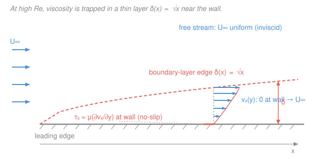

# Transport Phenomena · Lesson 3.2: The boundary-layer idea and the momentum boundary layer

> ⏱ ~15 min · Module 3: Dimensional analysis & boundary layers · Builds on: [3.1 nondimensionalizing the equations of change](03-01-nondimensionalizing-equations-of-change.md), [fluid-dynamics 3.4 boundary layers](../../fluid-dynamics/lessons/03-04-boundary-layers.md), [heat-transfer 3.1 convection & boundary layers](../../heat-transfer/lessons/03-01-convection-coefficient-boundary-layers.md) · Unlocks: [3.3 thermal & concentration boundary layers](03-03-thermal-concentration-boundary-layers.md), [3.4 forced-convection coefficients](03-04-forced-convection-transport-coefficients.md)

## Why this matters

In [3.1](03-01-nondimensionalizing-equations-of-change.md) you saw the viscous term in the dimensionless Navier–Stokes equation carry the coefficient $1/Re$. Fly at $Re = 10^6$ and that coefficient is one in a million — so why not just drop viscosity and be done? Because dropping it wrecks the one boundary condition that matters: **no-slip** at the wall. The fluid touching a surface has *zero* velocity, but the free stream rushes past at $U_\infty$. Something has to bridge that gap. Ludwig Prandtl's 1904 insight — arguably the single most useful idea in fluid mechanics — is that the bridging happens in a **thin layer** hugging the wall, and everywhere else you *can* ignore viscosity. This lesson is the momentum version; [3.3](03-03-thermal-concentration-boundary-layers.md) copies it verbatim for heat and mass.

## The idea

Two facts are in tension. (1) At high $Re$, inertia crushes viscosity — the $1/Re$ term is tiny, so the bulk flow behaves as if frictionless. (2) No-slip is non-negotiable: right at the wall the velocity must be zero. The resolution: viscosity can't be globally negligible *and* enforce no-slip unless its one term is somehow made big enough to matter — and the only way a term multiplied by $1/Re$ becomes important is if the velocity gradient it multiplies is **enormous**. A huge gradient means the velocity climbs from $0$ to $U_\infty$ over a *tiny* distance $\delta$.

So the flow splits into two regions:

- A **boundary layer** of thickness $\delta \ll L$ glued to the wall, where the velocity is throttled by no-slip and viscosity is king. All the shear, all the drag, all the "friction" lives here.
- An **outer flow** where the fluid never felt the wall, viscosity is negligible, and you may use frictionless (Euler / Bernoulli) reasoning.

The magic is that $\delta$ shrinks as $Re$ grows: the faster you go, the thinner the sticky film. This is the same $\delta$ your fluid-dynamics course drew in [3.4](../../fluid-dynamics/lessons/03-04-boundary-layers.md) and the same one heat transfer used to justify the convection coefficient in [3.1](../../heat-transfer/lessons/03-01-convection-coefficient-boundary-layers.md).

## The formal version

Consider steady flow at speed $U_\infty$ (units m/s) over a flat plate of length $L$ (m). Define the **local Reynolds number** at distance $x$ from the leading edge,

$$Re_x = \frac{U_\infty\, x}{\nu}, \qquad Re_L = \frac{U_\infty\, L}{\nu},$$

where $\nu = \mu/\rho$ is the kinematic viscosity (m²/s), $\mu$ the dynamic viscosity (Pa·s), $\rho$ the density (kg/m³). *In words: $Re_x$ is the inertia-to-viscous ratio built from how far the fluid has traveled along the plate.*

**Boundary-layer approximation.** When $Re_x \gg 1$, the flow near the wall obeys the reduced (Prandtl) equations: streamwise viscous diffusion is negligible compared with wall-normal diffusion, and the pressure imposed by the outer flow is simply *handed down* through the thin layer ($\partial p/\partial y \approx 0$). *In words: across a layer this thin, pressure doesn't vary — the outer flow dictates it, and the layer only has to resolve the velocity from $0$ to $U_\infty$.*

**Thickness scaling.** Balancing inertia against wall-normal viscous friction (derived in Example 2) gives

$$\boxed{\ \frac{\delta}{x} \sim Re_x^{-1/2}\ }$$

*In words: the sticky layer grows like $\sqrt{x}$ downstream and thins like $1/\sqrt{Re}$ as the flow speeds up.* The exact laminar solution — **Blasius**, from solving the reduced equations numerically — pins the constant:

$$\delta \approx \frac{5x}{\sqrt{Re_x}} \qquad (\text{laminar flat plate, } Re_x \lesssim 5\times 10^5).$$

**Wall shear and skin friction.** The wall shear stress is Newton's law of viscosity ([1.2](01-02-momentum-transport-newton-viscosity.md)) evaluated at the wall, $\tau_w = \mu\,(dv_x/dy)\big|_{y=0}$ (units Pa). Nondimensionalize it by the dynamic pressure $\tfrac12\rho U_\infty^2$ to get the **skin-friction coefficient**. Blasius gives

$$C_{f,x} = \frac{\tau_w}{\tfrac12 \rho U_\infty^2} = 0.664\, Re_x^{-1/2}, \qquad \overline{C_f} = \frac{1}{L}\!\int_0^L C_{f,x}\,dx = 1.328\, Re_L^{-1/2}.$$

*In words: local friction dies like $1/\sqrt{x}$ (steepest right at the leading edge, where the layer is thinnest and the gradient sharpest); the plate-average is exactly twice the trailing-edge local value.* The drag per unit width on one face is then $F_D/W = \overline{C_f}\cdot \tfrac12\rho U_\infty^2 \cdot L$.

**Separation.** On a flat plate the outer pressure is constant, so the layer just keeps growing. But over a curved body (an airfoil, a cylinder) the outer flow decelerates on the rear, creating an **adverse pressure gradient** ($dp/dx > 0$) that pushes *backward* on the already-sluggish near-wall fluid. When it overpowers the fluid's momentum, the flow near the wall reverses, the boundary layer lifts off the surface — **separation** — and a wide turbulent wake forms. That wake is the origin of pressure (form) drag, which dwarfs skin friction on bluff bodies; your fluid course develops this in [3.5](../../fluid-dynamics/lessons/03-05-separation-drag.md). Streamlining is the art of postponing separation.

## Picture

## Worked examples

**Example 1 (air over a plate — the whole pipeline).** Air at $20^\circ\mathrm{C}$ ($\rho = 1.2\ \mathrm{kg/m^3}$, $\nu = 1.5\times 10^{-5}\ \mathrm{m^2/s}$) flows at $U_\infty = 10\ \mathrm{m/s}$ over a flat plate of length $L = 0.3\ \mathrm{m}$. Find $Re_L$, the trailing-edge thickness $\delta(L)$, the average skin-friction coefficient, and the drag per unit width on one face.

Reynolds number:
$$Re_L = \frac{U_\infty L}{\nu} = \frac{10 \times 0.3}{1.5\times 10^{-5}} = 2.0\times 10^5.$$
This is below $5\times 10^5$, so the layer is **laminar** over the whole plate — Blasius applies. Then $\sqrt{Re_L} = \sqrt{2.0\times10^5} \approx 447$, so
$$\delta(L) = \frac{5L}{\sqrt{Re_L}} = \frac{5 \times 0.3}{447} = 3.35\times 10^{-3}\ \mathrm{m} \approx 3.4\ \mathrm{mm}.$$
Thin indeed — 3.4 mm of sticky film on a 300 mm plate, a ratio of about $1/90$, consistent with $\delta/L \sim Re_L^{-1/2} = 1/447$ up to the factor of 5. Skin friction:
$$\overline{C_f} = \frac{1.328}{\sqrt{Re_L}} = \frac{1.328}{447} = 2.97\times 10^{-3}.$$
Dynamic pressure $\tfrac12\rho U_\infty^2 = \tfrac12(1.2)(10)^2 = 60\ \mathrm{Pa}$, so drag per unit width:
$$\frac{F_D}{W} = \overline{C_f}\cdot \tfrac12\rho U_\infty^2 \cdot L = (2.97\times10^{-3})(60)(0.3) = 0.053\ \mathrm{N/m}.$$
*Units check:* $[\,\overline{C_f}\,]$ dimensionless $\times$ Pa $\times$ m $= (\mathrm{N/m^2})(\mathrm{m}) = \mathrm{N/m}$. *Sanity:* a fraction of a newton per metre of width — friction on a smooth plate in air is genuinely tiny, which is exactly why airplane skin friction is a battle of fractions of a percent.

**Example 2 (derive the scaling — don't quote Blasius).** Inside the boundary layer, steady momentum balance means inertia $\approx$ viscous friction, term by term. Estimate each per unit volume.

*Inertia* is the convective term $\rho\, v_x\,\partial v_x/\partial x$. A fluid parcel changes its streamwise velocity by an amount of order $U_\infty$ over the plate length $L$, so
$$\text{inertia} \sim \rho\,\frac{U_\infty^2}{L}.$$
*Viscous friction* is $\mu\,\partial^2 v_x/\partial y^2$. The velocity swings from $0$ to $U_\infty$ across the **thin** dimension $\delta$ (the whole point — the sharp gradient is wall-normal), so
$$\text{viscous} \sim \mu\,\frac{U_\infty}{\delta^2}.$$
For the boundary layer to exist at all, these must be comparable (viscosity is only strong enough to matter *because* $\delta$ is small). Set them equal:
$$\rho\,\frac{U_\infty^2}{L} \sim \mu\,\frac{U_\infty}{\delta^2} \ \Longrightarrow\ \delta^2 \sim \frac{\mu L}{\rho\,U_\infty} = \frac{\nu L}{U_\infty} \ \Longrightarrow\ \delta \sim \sqrt{\frac{\nu L}{U_\infty}}.$$
Divide by $L$:
$$\frac{\delta}{L} \sim \sqrt{\frac{\nu}{U_\infty L}} = \frac{1}{\sqrt{Re_L}} = Re_L^{-1/2}.$$
*Units check:* $\nu L/U_\infty$ has units $(\mathrm{m^2/s})(\mathrm{m})/(\mathrm{m/s}) = \mathrm{m^2}$, so $\delta \sim \sqrt{\cdot}$ is a length. *Sanity:* the $\tfrac12$-power and the $Re^{-1/2}$ dependence are exactly what Blasius delivers — dimensional balance got the *physics* for free; the numerical solution only supplied the "5" and the "0.664".

## Watch out

- **You might think high $Re$ means viscosity is irrelevant.** It's irrelevant *almost everywhere* — but never in the boundary layer, where the gradient it multiplies is huge. Skin-friction drag is a purely viscous effect that survives at every $Re$; you can't Bernoulli your way to it.
- **You might think the boundary layer is where the velocity is "slow."** It's where the velocity *changes* — the region of steep $dv_x/dy$. By convention $\delta$ marks $v_x = 0.99\,U_\infty$; the fluid at the top edge is moving nearly full speed. What defines the layer is the gradient, not the magnitude.
- **You might expect friction to be largest where the plate is longest.** Local wall shear is *largest at the leading edge* and falls like $1/\sqrt{x}$ — the layer is thinnest there, so the gradient (and $\tau_w$) is sharpest. The trailing edge contributes the least per unit area.

## One-liner

> At high $Re$ viscosity retreats into a thin wall layer of thickness $\delta/x \sim Re_x^{-1/2}$ (Blasius: $\delta = 5x/\sqrt{Re_x}$), which carries all the skin friction, $\overline{C_f} = 1.328\,Re_L^{-1/2}$ — and which peels away as separation the moment the pressure pushes back.

## Problems

**P1 (🟢)** Water ($\rho = 1000\ \mathrm{kg/m^3}$, $\nu = 1.0\times 10^{-6}\ \mathrm{m^2/s}$) flows at $U_\infty = 0.5\ \mathrm{m/s}$ over a plate. At $x = 0.2\ \mathrm{m}$ from the leading edge, find $Re_x$, confirm the layer is laminar, and compute $\delta(x)$.

**P2 (🟡)** For the flat-plate laminar layer, show that the trailing-edge local skin-friction coefficient $C_{f,L}$ is exactly half the plate-average $\overline{C_f}$. Then explain in one sentence, using the $1/\sqrt{x}$ shape, why the average exceeds the trailing-edge value.

**P3 (🔴, optional)** A car and a mosquito both fly through air. Using $\delta/L \sim Re_L^{-1/2}$, compare the *relative* boundary-layer thickness $\delta/L$ for a car ($U_\infty = 30\ \mathrm{m/s}$, $L = 4\ \mathrm{m}$) versus a mosquito ($U_\infty = 0.5\ \mathrm{m/s}$, $L = 3\ \mathrm{mm}$), $\nu_\text{air} = 1.5\times10^{-5}\ \mathrm{m^2/s}$. Who lives in a "thicker" boundary layer relative to its own size, and what does that say about which one feels the world as viscous?

Solutions

**P1** $Re_x = U_\infty x/\nu = (0.5)(0.2)/(1.0\times10^{-6}) = 1.0\times 10^5$. Below $5\times 10^5$, so **laminar**. Then $\sqrt{Re_x} = \sqrt{10^5} \approx 316$, and
$$\delta = \frac{5x}{\sqrt{Re_x}} = \frac{5(0.2)}{316} = 3.2\times 10^{-3}\ \mathrm{m} \approx 3.2\ \mathrm{mm}.$$
*Sanity:* millimetre-scale, thin relative to the 200 mm run, as required.

**P2** Local: $C_{f,x} = 0.664\,Re_x^{-1/2}$, so at $x = L$, $C_{f,L} = 0.664\,Re_L^{-1/2}$. Average: $\overline{C_f} = 1.328\,Re_L^{-1/2} = 2 \times 0.664\,Re_L^{-1/2} = 2\,C_{f,L}$. Hence $C_{f,L} = \tfrac12\overline{C_f}$. Indeed the averaging integral gives the factor of two directly: $\overline{C_f} = \frac1L\int_0^L 0.664\big(\tfrac{U_\infty x}{\nu}\big)^{-1/2}dx = \frac{0.664}{L}\big(\tfrac{\nu}{U_\infty}\big)^{1/2}\cdot 2\sqrt{L} = 1.328\,Re_L^{-1/2}$ (the $\int x^{-1/2}dx = 2\sqrt{x}$ supplies the 2). The average exceeds the trailing-edge value because $C_{f,x} \propto 1/\sqrt{x}$ is *largest near the leading edge* — averaging in the big early-plate contributions pulls the mean above the small trailing-edge value.

**P3** Car: $Re_L = (30)(4)/(1.5\times10^{-5}) = 8.0\times 10^6$, so $\delta/L \sim Re_L^{-1/2} = 1/\sqrt{8\times10^6} \approx 3.5\times10^{-4}$. Mosquito: $Re_L = (0.5)(0.003)/(1.5\times10^{-5}) = 100$, so $\delta/L \sim 1/\sqrt{100} = 0.1$. The mosquito's boundary layer is about $0.1/3.5\times10^{-4} \approx 300$ times thicker *relative to its own body*. At $Re \sim 100$ the sticky layer engulfs the whole insect — it lives in an essentially viscous world (think swimming in honey), whereas the car's layer is a razor-thin skin on a body dominated by inertia. Low $Re$ = viscosity-dominated existence; high $Re$ = inertia-dominated. Same physics, opposite regimes.

## Flashback

**From Lesson 3.1 (nondimensionalizing the equations of change):** When Navier–Stokes is made dimensionless, the viscous term picks up the coefficient $1/Re$. Water ($\nu = 1.0\times10^{-6}\ \mathrm{m^2/s}$) flows at $V = 2\ \mathrm{m/s}$ through a pipe of diameter $D = 0.05\ \mathrm{m}$. Compute $Re$, evaluate the viscous coefficient $1/Re$, and state which term governs the bulk of the flow — and where the neglected term nonetheless reasserts itself.

Solution

$$Re = \frac{VD}{\nu} = \frac{(2)(0.05)}{1.0\times10^{-6}} = 1.0\times 10^5, \qquad \frac{1}{Re} = 1.0\times 10^{-5}.$$
The viscous term carries a coefficient of $10^{-5}$ — five orders of magnitude smaller than the inertial (convective) term, which carries $\mathcal{O}(1)$. So **inertia governs the core** of the flow. But $1/Re$ being tiny does *not* let you delete viscosity: no-slip at the pipe wall forces a thin layer of steep velocity gradient (here, since $Re > 2300$, a turbulent wall layer) where the "$1/Re$" term multiplies a gradient large enough to matter — exactly the boundary-layer resolution of this lesson. *Sanity:* $Re = 10^5 \gg 1$, consistent with a thin near-wall layer and an inertia-dominated core.

## Connections

- **Backward:** this is the payoff of [3.1](03-01-nondimensionalizing-equations-of-change.md) — the dimensionless $1/Re$ coefficient told us *where* viscosity could be dropped, and the boundary layer is *where it can't*. The wall shear $\tau_w = \mu\,(dv_x/dy)|_0$ is Newton's law of viscosity from [1.2](01-02-momentum-transport-newton-viscosity.md), the momentum member of the one flux law from [1.1](01-01-one-flux-law-three-transports.md).
- **Forward:** [3.3](03-03-thermal-concentration-boundary-layers.md) reruns this identical argument for temperature and concentration, producing thermal ($\delta_T$) and concentration ($\delta_c$) layers with $\delta/\delta_T \approx Pr^{1/3}$ and $\delta/\delta_c \approx Sc^{1/3}$; [3.4](03-04-forced-convection-transport-coefficients.md) converts the wall gradient into $Nu$ and $Sh$.
- **Sideways:** the *same* $\delta \sim 5x/\sqrt{Re_x}$ underlies the convection coefficient in [heat-transfer 3.1](../../heat-transfer/lessons/03-01-convection-coefficient-boundary-layers.md) ($h \sim k/\delta_T$) and the external-flow correlations in [heat-transfer 3.3](../../heat-transfer/lessons/03-03-external-forced-convection.md). Separation (adverse $dp/dx$) is the hinge between skin-friction and form drag developed in [fluid-dynamics 3.5](../../fluid-dynamics/lessons/03-05-separation-drag.md) — momentum, heat, and mass all ride the same boundary layer.
