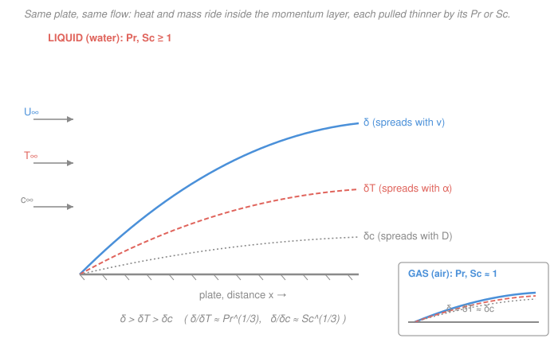

# Transport Phenomena · Lesson 3.3: Thermal and concentration boundary layers by analogy

> ⏱ ~15 min · Module 3: Dimensional analysis, boundary layers, and convection · Builds on: [3.2 The momentum boundary layer](03-02-momentum-boundary-layer.md), [1.5 The three diffusivities: Pr, Sc, Le](01-05-three-diffusivities-pr-sc-le.md), [`heat-transfer` 3.3 External forced convection](../../heat-transfer/lessons/03-03-external-forced-convection.md) · Unlocks: [3.4 Forced convection and transport coefficients](03-04-forced-convection-transport-coefficients.md), Boss problem 3

## Why this matters

In [3.2](03-02-momentum-boundary-layer.md) you scaled the region near a wall where velocity climbs from zero to the free stream — the **momentum boundary layer**, thickness $\delta \sim x/\sqrt{Re_x}$. But a heated plate also has a thin skin where *temperature* adjusts, and a dissolving plate a thin skin where *concentration* adjusts. Here is the payoff of the whole "one flux law, three transports" theme: you do **not** re-derive those two layers from scratch. They are the momentum layer's story retold with $\alpha$ (heat) or $D_{AB}$ (mass) in place of $\nu$ — and the swap is bookkept by a single number, $Pr$ or $Sc$, that you already met in [1.5](01-05-three-diffusivities-pr-sc-le.md). One boundary-layer solution, three answers. That is what lets you read a heat-transfer coefficient off a friction result, and a mass-transfer coefficient off the heat one.

## The idea

A boundary layer is how far a wall's influence has *diffused* into the passing fluid by the time the fluid reaches position $x$. Momentum diffuses outward with kinematic viscosity $\nu$; heat diffuses with thermal diffusivity $\alpha$; species diffuses with mass diffusivity $D_{AB}$ — all three carried downstream at the same speed by the same flow. So the three layers grow side by side, and **whichever quantity diffuses fastest reaches farthest** and owns the thickest layer.

That single sentence is the whole lesson. Compare diffusivities and you have ordered the layers:

- $Pr = \nu/\alpha$. If $Pr > 1$ (momentum diffuses faster than heat — oils, water), the momentum layer outruns the thermal one: $\delta > \delta_T$, a thin thermal skin buried inside a fat velocity layer. If $Pr < 1$ (liquid metals — heat races ahead), it flips: $\delta_T > \delta$.
- $Sc = \nu/D_{AB}$ does the identical job for the concentration layer $\delta_c$.
- For a **gas**, one molecular speed carries momentum, heat, and mass alike, so $Pr \approx Sc \approx 1$ and all three layers nearly coincide — exactly the coincidence [1.5](01-05-three-diffusivities-pr-sc-le.md) promised, now visible as overlapping curves on a plate.

The quantitative version turns out to need the **cube root**: $\delta/\delta_T \approx Pr^{1/3}$. Cube-root, not linear, because the layers grow together and interact — the velocity profile inside which heat diffuses is itself set by $\delta$ — but the shape of the argument is exactly what intuition ordered.

## The formal version

**Thermal boundary layer.** Define $\delta_T(x)$ (m) as the distance from the wall where the temperature excess has closed to 1% of $T_s - T_\infty$ (wall-to-free-stream). For laminar flow over a flat plate, matching the energy boundary-layer equation against the momentum one gives

$$\boxed{\;\frac{\delta}{\delta_T} \approx Pr^{1/3}, \qquad Pr = \frac{\nu}{\alpha} = \frac{c_p\mu}{k}\;}$$

*In words: the momentum layer is thicker than the thermal layer by the cube root of the Prandtl number.* Here $\nu$ (m²/s) is kinematic viscosity, $\alpha = k/(\rho c_p)$ (m²/s) thermal diffusivity, $k$ (W m⁻¹K⁻¹) conductivity, $c_p$ (J kg⁻¹K⁻¹) specific heat. $Pr > 1 \Rightarrow \delta > \delta_T$; $Pr < 1 \Rightarrow \delta < \delta_T$. (Valid roughly $Pr \gtrsim 0.5$; liquid metals need a separate correlation.)

**Concentration boundary layer.** Define $\delta_c(x)$ (m) as the distance where the concentration excess has closed to 1% of $c_{A,s} - c_{A,\infty}$. The species boundary-layer equation is the energy equation with $\alpha \to D_{AB}$, so by the *same* derivation, term for term,

$$\boxed{\;\frac{\delta}{\delta_c} \approx Sc^{1/3}, \qquad Sc = \frac{\nu}{D_{AB}}\;}$$

with $D_{AB}$ (m²/s) the mass diffusivity. *In words: swap $\alpha$ for $D_{AB}$ and $Pr$ for $Sc$, and every heat result becomes a mass result.* Dividing the two boxes,

$$\frac{\delta_T}{\delta_c} \approx \left(\frac{Sc}{Pr}\right)^{1/3} = Le^{1/3}, \qquad Le = \frac{\alpha}{D_{AB}} = \frac{Sc}{Pr}.$$

**From wall gradient to coefficient.** The wall *flux* is the molecular law evaluated at the surface — heat conducted out of the wall, then handed to the flow:

$$q_s'' = -k\left.\frac{\partial T}{\partial y}\right|_{y=0} \equiv h\,(T_s - T_\infty) \;\Longrightarrow\; h = \frac{-k\,\partial T/\partial y|_0}{T_s - T_\infty}.$$

*In words: the convection coefficient $h$ is just the wall temperature-gradient, made dimensionless by the driving difference.* A thinner thermal layer packs the same $T_s - T_\infty$ into less distance, so a steeper gradient, so a larger $h$ — high $Pr$ helps heat transfer. Carrying the flat-plate laminar profile through (the [`heat-transfer` 3.3](../../heat-transfer/lessons/03-03-external-forced-convection.md) result) gives the local and average Nusselt numbers

$$Nu_x = \frac{h_x x}{k} = 0.332\,Re_x^{1/2}Pr^{1/3}, \qquad \overline{Nu}_L = \frac{\bar h L}{k} = 0.664\,Re_L^{1/2}Pr^{1/3},$$

valid for laminar flow ($Re_x \lesssim 5\times10^5$), $Pr \gtrsim 0.6$. The average is exactly twice the local value at the trailing edge because $h_x \propto x^{-1/2}$ and $\int_0^L x^{-1/2}dx = 2L^{1/2}$.

Now run the **identical** derivation for mass, replacing $q_s'' \to N_A$, $k\,\partial T \to D_{AB}\,\partial c_A$, $h \to k_c$, $Pr \to Sc$. Nothing else changes, so

$$Sh_x = \frac{k_c\, x}{D_{AB}} = 0.332\,Re_x^{1/2}Sc^{1/3}, \qquad \overline{Sh}_L = \frac{\bar k_c L}{D_{AB}} = 0.664\,Re_L^{1/2}Sc^{1/3},$$

where $Sh$ (Sherwood number) is the mass-transfer twin of $Nu$ and $k_c$ (m/s) the mass-transfer coefficient from $N_A = k_c(c_{A,s} - c_{A,\infty})$. Dividing the two at matched $Re$, the $0.332\,Re_x^{1/2}$ cancels and leaves the **master analogy result**:

$$\boxed{\;\frac{Nu}{Sh} = \left(\frac{Pr}{Sc}\right)^{1/3} = Le^{-1/3}\;}$$

*In words: heat and mass transfer differ only by the cube root of the Lewis number — for a gas ($Le \approx 1$) they are nearly the same measurement.* Know $Nu$, and you get $Sh$ for free (this is the seed of the Chilton–Colburn analogy in [5.1](05-01-transport-analogies.md)).

## Picture

The three layers all start at the leading edge and thicken downstream as $\sqrt{x}$. In water (main panel) momentum reaches farthest ($\delta$, spreads with $\nu$), heat is buried inside ($\delta_T$, with $\alpha$), mass thinnest of all ($\delta_c$, with $D$). In air (inset) they overlap.

## Worked examples

**Example 1 (order and size the three layers — water).** Water at ~25°C has $Pr \approx 7$; a dissolved species (say benzoic acid) has $Sc \approx 600$. Order $\delta$, $\delta_T$, $\delta_c$ and give the ratios.

Momentum diffuses faster than heat, faster than mass ($\nu > \alpha > D_{AB}$), so

$$\delta > \delta_T > \delta_c.$$

Ratios from the boxes:

$$\frac{\delta}{\delta_T} \approx Pr^{1/3} = 7^{1/3} \approx 1.91 \;\Rightarrow\; \delta_T \approx 0.52\,\delta,$$
$$\frac{\delta}{\delta_c} \approx Sc^{1/3} = 600^{1/3} \approx 8.43 \;\Rightarrow\; \delta_c \approx 0.12\,\delta.$$

The thermal skin is about half the velocity layer; the concentration skin only an eighth. Cross-check with Lewis:

$$\frac{\delta_T}{\delta_c} \approx Le^{1/3} = \left(\frac{Sc}{Pr}\right)^{1/3} = \left(\frac{600}{7}\right)^{1/3} = 85.7^{1/3} \approx 4.41,$$

and directly $0.52\,\delta / 0.12\,\delta \approx 4.4$ ✓. *Sanity:* all ratios are dimensionless (each is a diffusivity ratio to the $1/3$), and every layer is thinner than $\delta$ because water diffuses momentum best. ✓

**Example 2 ($Nu$, $Sh$, and their ratio — flat plate).** The same water flows over a plate of length $L$ at $Re_L = 1.0\times10^5$ (laminar). With $Pr = 7$, $Sc = 600$, find $\overline{Nu}_L$, $\overline{Sh}_L$, and verify the analogy.

First $Re_L^{1/2} = \sqrt{1.0\times10^5} = 316$. Then

$$\overline{Nu}_L = 0.664\,Re_L^{1/2}Pr^{1/3} = 0.664(316)(1.91) \approx 402,$$
$$\overline{Sh}_L = 0.664\,Re_L^{1/2}Sc^{1/3} = 0.664(316)(8.43) \approx 1770.$$

Their ratio:

$$\frac{\overline{Nu}_L}{\overline{Sh}_L} = \frac{402}{1770} \approx 0.227,$$

and the predicted value

$$\left(\frac{Pr}{Sc}\right)^{1/3} = \left(\frac{7}{600}\right)^{1/3} = 0.0117^{1/3} \approx 0.227 \;\checkmark$$

— the $0.664\,Re_L^{1/2}$ cancelled exactly, as it must. *Sanity:* $Nu$ and $Sh$ are dimensionless; $Sh \gg Nu$ because $Sc \gg Pr$ (mass has the thinnest layer, hence the steepest wall gradient, hence the biggest dimensionless coefficient). To cash these into transport coefficients you'd multiply by $k/L$ and $D_{AB}/L$ respectively — that conversion is [3.4](03-04-forced-convection-transport-coefficients.md)'s job and the heart of Boss problem 3. ✓

## Watch out

- **You might think a bigger $Pr$ means a *thicker* thermal layer** — the symbol has "thermal" in its name. Backwards: $Pr = \nu/\alpha$ large means heat diffuses *slowly* relative to momentum, so the thermal layer is **thin** ($\delta_T = \delta/Pr^{1/3}$). Large $Pr$ or $Sc$ ⇒ thin heat/mass skin ⇒ *steep* wall gradient ⇒ *large* $Nu$ or $Sh$. The transport coefficient goes up even as the layer gets thinner.
- **You might expect a linear ratio $\delta/\delta_T \approx Pr$.** It's the *cube root*. The layers grow inside one another and interact, and the analysis (integral or similarity) delivers the $1/3$ power. Using $Pr$ instead of $Pr^{1/3}$ overstates the separation wildly — for water it would say $\delta_T = \delta/7$, not $\delta/1.9$.
- **You might apply $Nu_x = 0.332\,Re_x^{1/2}Pr^{1/3}$ to liquid metals.** The $Pr^{1/3}$ scaling and even the "$\delta_T$ inside $\delta$" picture assume $Pr \gtrsim 0.5$. For $Pr \ll 1$ (mercury, sodium) the thermal layer is *thicker* than the momentum layer and a different correlation (in $Pe = Re\,Pr$) applies.

## One-liner

> One boundary layer, three answers: swap $\nu \to \alpha \to D_{AB}$ and the layers reorder by $Pr^{1/3}$ and $Sc^{1/3}$, so $Nu/Sh = (Pr/Sc)^{1/3} = Le^{-1/3}$ — heat and mass transfer are the same measurement up to a Lewis cube root.

## Problems

**P1 (🟢)** Air at ~300 K has $Pr \approx 0.70$; a diffusing vapor in that air has $Sc \approx 0.60$. On a flat plate, is the thermal layer thicker or thinner than the momentum layer? Compute $\delta/\delta_T$ and $\delta/\delta_c$, and state in one phrase why all three are so close to 1.

**P2 (🟡)** Engine oil has $Pr \approx 100$. For laminar flow over a plate at $Re_L = 4\times10^4$, compute $\overline{Nu}_L$. Then, using only the analogy, write $\overline{Sh}_L$ for a species in that oil with $Sc = 10^4$ **without** recomputing the $Re$ factor — get it from $\overline{Nu}_L$ and the ratio $(Sc/Pr)^{1/3}$.

**P3 (🔴)** Show that for a flat plate the ratio $\overline{Nu}_L/\overline{Sh}_L$ is independent of $Re_L$ and equals $Le^{-1/3}$, and explain in one sentence why this independence is exactly what makes evaporative (wet-bulb) cooling insensitive to wind speed — the fact [5.3](05-03-simultaneous-heat-mass-transfer.md) will exploit.

Solutions

**P1** $Pr = 0.70 < 1$, so momentum diffuses *slower* than heat and the thermal layer is slightly **thicker**: $\delta/\delta_T \approx Pr^{1/3} = 0.70^{1/3} \approx 0.89$, i.e. $\delta_T \approx 1.12\,\delta$. For mass, $\delta/\delta_c \approx Sc^{1/3} = 0.60^{1/3} \approx 0.84$, so $\delta_c \approx 1.19\,\delta$. All three are within ~20% of each other because in a gas a single molecular speed and mean free path carry momentum, heat, and mass alike, so $\nu \approx \alpha \approx D_{AB}$ and $Pr \approx Sc \approx 1$. *Check:* ratios dimensionless; both $<1$ since both groups $<1$, correctly flipping the liquid ordering. ✓

**P2** $Re_L^{1/2} = \sqrt{4\times10^4} = 200$; $Pr^{1/3} = 100^{1/3} = 4.64$.

$$\overline{Nu}_L = 0.664(200)(4.64) \approx 616.$$

By the analogy $\overline{Sh}_L/\overline{Nu}_L = (Sc/Pr)^{1/3}$, so

$$\overline{Sh}_L = \overline{Nu}_L\left(\frac{Sc}{Pr}\right)^{1/3} = 616\left(\frac{10^4}{100}\right)^{1/3} = 616\,(100)^{1/3} = 616(4.64) \approx 2860.$$

*Check:* recomputing from scratch, $\overline{Sh}_L = 0.664(200)(10^4)^{1/3} = 0.664(200)(21.5) \approx 2860$ ✓ — the analogy shortcut and the direct formula agree, because the shared $0.664\,Re_L^{1/2}$ factor is exactly what the ratio cancels.

**P3** Divide the averaged correlations:

$$\frac{\overline{Nu}_L}{\overline{Sh}_L} = \frac{0.664\,Re_L^{1/2}Pr^{1/3}}{0.664\,Re_L^{1/2}Sc^{1/3}} = \frac{Pr^{1/3}}{Sc^{1/3}} = \left(\frac{Pr}{Sc}\right)^{1/3} = Le^{-1/3}.$$

The $0.664\,Re_L^{1/2}$ appears in both and cancels, so the ratio carries **no** $Re_L$ — it depends only on fluid properties through $Le$. Physically, $\bar h \propto Re_L^{1/2}$ and $\bar k_c \propto Re_L^{1/2}$ with the *same* velocity dependence, so raising the wind speed boosts heat removal and vapor removal in lockstep; their ratio (which sets the wet-bulb depression) stays fixed, making the equilibrium wet-bulb temperature nearly independent of air speed. *Check:* this matches the boxed master result $Nu/Sh = (Pr/Sc)^{1/3} = Le^{-1/3}$ (with $Le=\alpha/D_{AB}=Sc/Pr$), reproduced here with the averaged constants. ✓

## Flashback

**From Lesson 3.2 (The momentum boundary layer):** Air flows over a flat plate. At the station $x = 0.5$ m the local Reynolds number is $Re_x = 2.0\times10^5$ (still laminar). Using the Blasius results $\delta \approx 5x/\sqrt{Re_x}$ and the local skin-friction coefficient $C_{f,x} = 0.664\,Re_x^{-1/2}$, find $\delta$ (in mm) and $C_{f,x}$.

Solution

$\sqrt{Re_x} = \sqrt{2.0\times10^5} = 447$.

$$\delta = \frac{5x}{\sqrt{Re_x}} = \frac{5(0.5)}{447} = 5.59\times10^{-3}\ \mathrm{m} \approx 5.6\ \mathrm{mm}.$$

$$C_{f,x} = \frac{0.664}{\sqrt{Re_x}} = \frac{0.664}{447} \approx 1.49\times10^{-3}.$$

*Check:* $\delta/x = 5/\sqrt{Re_x} = 5/447 = 0.011 \ll 1$ ✓ — the layer is thin, as the boundary-layer approximation requires; and $C_{f,x}$ is a small dimensionless number, right order for laminar flow. Both scale as $Re_x^{-1/2}$, the signature of a diffusively-grown laminar layer — the very $\delta$ this lesson then splits into $\delta_T$ and $\delta_c$. ✓

## Connections

- **Backward:** this is [3.2](03-02-momentum-boundary-layer.md)'s momentum layer retold twice, and it cashes in the property ratios from [1.5](01-05-three-diffusivities-pr-sc-le.md) — $Pr$, $Sc$, $Le$ stop being definitions and become the numbers that order real layers. The energy and species boundary-layer equations behind the two boxes are the equations of change from [2.5](02-05-energy-equation-of-change.md) and [2.6](02-06-species-continuity-equation.md), stripped by the boundary-layer approximation.
- **Sideways (heat transfer):** the flat-plate $Nu_x = 0.332\,Re_x^{1/2}Pr^{1/3}$ is exactly the external-forced-convection result you met in [`heat-transfer` 3.3](../../heat-transfer/lessons/03-03-external-forced-convection.md); this course adds its mass-transfer twin $Sh_x$ and the bridge $Nu/Sh = Le^{-1/3}$ between them.
- **Forward:** [3.4](03-04-forced-convection-transport-coefficients.md) converts these $Nu$ and $Sh$ into working values of $\bar h$ and $\bar k_c$ for real geometries, and Boss problem 3 runs the full water-film-on-a-plate calculation. The $Nu/Sh = Le^{-1/3}$ result is the laminar seed of the general Chilton–Colburn analogy $j_H = j_D$ in [5.1](05-01-transport-analogies.md), and the wind-speed independence of P3 is the mechanism behind evaporative cooling in [5.3](05-03-simultaneous-heat-mass-transfer.md).
