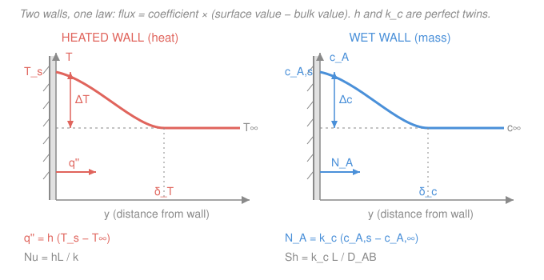

# Transport Phenomena · Lesson 3.4: Forced convection and interphase transport coefficients

> ⏱ ~15 min · Module 3: Boundary layers and convective transport · Builds on: [3.3 Thermal and concentration boundary layers](03-03-thermal-concentration-boundary-layers.md), [`heat-transfer` 3.4 Internal forced convection](../../heat-transfer/lessons/03-04-internal-forced-convection.md) · Unlocks: Module 4 (mass-transfer correlations), Boss problem 3

## Why this matters

The last lesson gave you boundary-layer *thicknesses* — elegant, but an engineer sizing a cooling tower or a drying oven can't measure a $\delta$. They want one number: how fast does heat (or a species) cross the wall per unit of driving force? That number is the **transport coefficient** — $h$ for heat, $k_c$ for mass — and it hides the entire boundary layer inside a single scalar you can look up in a chart. This lesson turns the profiles of 3.3 into those coefficients, and delivers the payoff of the whole "one flux law" story: **you almost never run a mass-transfer experiment.** Take the heat-transfer correlation for your geometry, swap $Pr \to Sc$ and $Nu \to Sh$, and out falls $k_c$. One measurement, two coefficients.

## The idea

A boundary layer is a resistance between a surface and the flowing bulk. Instead of tracking the whole profile, we lump that resistance into a coefficient defined so that **flux = coefficient × driving force**:

- Heat: the wall throws off $q''$ watts per square meter, and it's proportional to how much hotter the wall is than the free stream. Call the proportionality $h$.
- Mass: the wall releases $N_A$ moles per square meter per second of species $A$, proportional to how much more concentrated $A$ is at the surface than in the bulk. Call it $k_c$.

These are *defined into existence* — they're bookkeeping. All the physics (fluid speed, geometry, properties) lives inside the number. And because heat and mass ride the *same* boundary layer, driven by the *same* velocity field, the two coefficients are built from the same dimensionless recipe. That's why a single family of correlations serves both: change one Greek-letter ratio and you're done.

One subtlety for **internal** flow (a pipe): the "bulk" isn't a fixed far-field, it's the *mixing-cup average* that drifts as the fluid heats up or loads with vapor along the tube. The honest driving force is then a **log-mean** of the inlet and outlet differences — same idea as the LMTD you met in heat exchangers.

## The formal version

**Heat-transfer coefficient.** Define $h$ (units $\mathrm{W\,m^{-2}\,K^{-1}}$) by

$$q'' = h\,(T_s - T_\infty),$$

where $q''$ is the wall heat flux ($\mathrm{W\,m^{-2}}$), $T_s$ the surface temperature (K), and $T_\infty$ the free-stream (or bulk) temperature (K). *In words: $h$ is the heat flux you get per degree of surface-to-bulk temperature difference.* Its dimensionless form is the **Nusselt number**

$$Nu = \frac{hL}{k},$$

with $L$ a characteristic length (m) and $k$ the *fluid's* conductivity ($\mathrm{W\,m^{-1}\,K^{-1}}$). *In words: $Nu$ is the ratio of convective transport to what pure conduction across $L$ would give — how much the flow beats a stagnant film.*

**Mass-transfer coefficient — the twin.** Define $k_c$ (units $\mathrm{m\,s^{-1}}$) by

$$N_A = k_c\,(c_{A,s} - c_{A,\infty}),$$

where $N_A$ is the molar flux of $A$ at the wall ($\mathrm{mol\,m^{-2}\,s^{-1}}$) and $c_{A,s},\,c_{A,\infty}$ are the surface and bulk molar concentrations of $A$ ($\mathrm{mol\,m^{-3}}$). Its dimensionless form is the **Sherwood number**

$$Sh = \frac{k_c L}{D_{AB}},$$

with $D_{AB}$ the binary diffusivity ($\mathrm{m^2\,s^{-1}}$). *In words: $Sh$ is the Nusselt number of mass transfer — convective mass transport over pure-diffusion transport.* Line up the two columns and the analogy is exact:

| Role | Heat | Mass |
|---|---|---|
| Coefficient | $h$ | $k_c$ |
| Driving force | $T_s - T_\infty$ | $c_{A,s} - c_{A,\infty}$ |
| Flux | $q'' = h\,\Delta T$ | $N_A = k_c\,\Delta c$ |
| Molecular property | $k$ (or $\alpha$) | $D_{AB}$ |
| Dimensionless coeff. | $Nu = hL/k$ | $Sh = k_c L/D_{AB}$ |
| Fluid ratio | $Pr = \nu/\alpha$ | $Sc = \nu/D_{AB}$ |
| Correlation form | $Nu = f(Re,\,Pr)$ | $Sh = f(Re,\,Sc)$ |

**Film vs. bulk driving force.** For external flow $T_\infty$ and $c_{A,\infty}$ are genuine far-field constants. For flow *inside* a duct they are the flowing-mixing-cup averages, which change along the tube; the correct average flux over a length uses the **log-mean driving force**

$$\Delta T_{\mathrm{lm}} = \frac{\Delta T_\mathrm{in} - \Delta T_\mathrm{out}}{\ln(\Delta T_\mathrm{in}/\Delta T_\mathrm{out})},$$

with the identical formula for $\Delta c_{\mathrm{lm}}$ (swap $T \to c$). *In words: because the bulk drifts toward the wall value, the effective push is the log-mean of the entrance and exit gaps, not their arithmetic mean* — exactly the LMTD structure from [`heat-transfer` 4.4](../../heat-transfer/lessons/04-04-heat-exchangers-lmtd.md).

**The master correlations (each with a $Pr \to Sc$ twin).** For any geometry the heat correlation and its mass twin are the *same function*:

- **Flat plate, laminar** (from [3.3](03-03-thermal-concentration-boundary-layers.md)): local $Nu_x = 0.332\,Re_x^{1/2}Pr^{1/3}$, average $\overline{Nu}_L = 0.664\,Re_L^{1/2}Pr^{1/3}$; twin $\overline{Sh}_L = 0.664\,Re_L^{1/2}Sc^{1/3}$. Companion skin friction $\overline{C_f} = 1.328\,Re_L^{-1/2}$.
- **Cylinder / sphere in cross-flow** (Hilpert / Ranz–Marshall): e.g. sphere $Nu = 2 + 0.6\,Re^{1/2}Pr^{1/3}$; twin $Sh = 2 + 0.6\,Re^{1/2}Sc^{1/3}$. (The "2" is the pure-conduction/diffusion floor from a stagnant sphere.)
- **Internal turbulent — Dittus–Boelter:** $Nu = 0.023\,Re^{0.8}Pr^{0.4}$; twin $Sh = 0.023\,Re^{0.8}Sc^{1/3}$. *In words: same $0.023\,Re^{0.8}$ skeleton; only the property exponent switches.*

**Entry length.** All of these fully-developed forms assume the boundary layer (or thermal/concentration profile) has finished forming. Near an inlet the profiles are still thin, the coefficient is *higher*, and it decays toward the fully-developed value over a hydrodynamic entry length $x_{fd} \approx 0.05\,Re_D\,D$ (laminar). Short tubes and leading edges run "hot" — the average coefficient exceeds the fully-developed one.

The single takeaway: **swap $Pr \to Sc$ and $Nu \to Sh$.** The Reynolds skeleton and the numerical constant are set by geometry and the velocity field, which heat and mass share — so a mass-transfer coefficient is a heat-transfer correlation wearing a different property.

## Picture

Same picture twice: a surface value, a bulk value, the gap between them (the driving force), and a boundary layer of thickness $\delta$ across which the transport happens. The coefficient is just the slope of that story compressed into one number.

## Worked examples

**Example 1 (Boss problem 3, parts b–c: air over a wet flat plate).** Air at $U_\infty = 5\ \mathrm{m/s}$ flows along an $L = 0.5\ \mathrm{m}$ plate wetted with a thin water film. Air properties: $\nu = 1.57\times10^{-5}\ \mathrm{m^2/s}$, $k = 0.0263\ \mathrm{W\,m^{-1}\,K^{-1}}$, $Pr = 0.71$; for water vapor in air $D_{AB} = 2.6\times10^{-5}\ \mathrm{m^2/s}$, so $Sc = \nu/D_{AB} = 0.60$.

*Step 1 — Reynolds number, confirm laminar.*
$$Re_L = \frac{U_\infty L}{\nu} = \frac{5 \times 0.5}{1.57\times10^{-5}} = 1.59\times10^{5}.$$
Below the flat-plate transition $Re_{x,c}\approx 5\times10^5$, so laminar throughout. Note $Re_L^{1/2} = 399$.

*Step 2 — the three surface parameters.* Using the laminar averages:
$$\overline{C_f} = 1.328\,Re_L^{-1/2} = \frac{1.328}{399} = 3.33\times10^{-3},$$
$$\overline{Nu}_L = 0.664\,Re_L^{1/2}Pr^{1/3} = 0.664 \times 399 \times (0.71)^{1/3} = 0.664\times399\times0.892 = 236,$$
$$\overline{Sh}_L = 0.664\,Re_L^{1/2}Sc^{1/3} = 0.664 \times 399 \times (0.60)^{1/3} = 0.664\times399\times0.843 = 224.$$
Same $0.664\,Re_L^{1/2}$; only the property root differs — $\overline{Sh}$ came *free* from the heat calculation.

*Step 3 — the coefficients.*
$$\bar h = \frac{\overline{Nu}_L\,k}{L} = \frac{236 \times 0.0263}{0.5} = 12.4\ \mathrm{W\,m^{-2}\,K^{-1}},$$
$$\bar k_c = \frac{\overline{Sh}_L\,D_{AB}}{L} = \frac{224 \times 2.6\times10^{-5}}{0.5} = 1.16\times10^{-2}\ \mathrm{m/s}.$$

*Step 4 — part (c), the ratio.* Dividing the two correlations, the shared $0.664\,Re_L^{1/2}$ cancels exactly:
$$\frac{\overline{Nu}_L}{\overline{Sh}_L} = \frac{Pr^{1/3}}{Sc^{1/3}} = \left(\frac{Pr}{Sc}\right)^{1/3} = \left(\frac{0.71}{0.60}\right)^{1/3} = (1.18)^{1/3} = 1.06,$$
which matches $236/224 = 1.05$. Since the Lewis number $Le \equiv \alpha/D_{AB} = Sc/Pr = 0.85$, this ratio is $(Pr/Sc)^{1/3} = Le^{-1/3} \approx 1.05$ — a **five-percent** difference. *The physical fact:* in air the molecular diffusivities of momentum, heat, and mass are nearly equal ($Le \approx 1$), so $\bar h$ and $\bar k_c$ carry essentially the same information — knowing one fixes the other. That near-redundancy is exactly what makes wet-bulb thermometry work ([5.3](05-03-simultaneous-heat-mass-transfer.md)).

*Check.* $[\bar h] = Nu\cdot k/L = (\text{–})\cdot\mathrm{W\,m^{-1}K^{-1}}/\mathrm{m} = \mathrm{W\,m^{-2}\,K^{-1}}$ ✓. $[\bar k_c] = (\text{–})\cdot\mathrm{m^2 s^{-1}}/\mathrm{m} = \mathrm{m/s}$ ✓. Both coefficients are modest, as expected for gentle laminar airflow.

**Example 2 (get a mass coefficient from a heat correlation).** Air flows through a wetted-wall tube of diameter $D = 0.05\ \mathrm{m}$ at $Re_D = 2\times10^{4}$ (turbulent). We want $k_c$ for water vapor pickup ($Sc = 0.60$, $D_{AB} = 2.6\times10^{-5}\ \mathrm{m^2/s}$). Instead of hunting for a mass-transfer dataset, take Dittus–Boelter and swap $Pr \to Sc$, $Nu \to Sh$:

$$Sh = 0.023\,Re_D^{0.8}Sc^{1/3} = 0.023\,(2\times10^{4})^{0.8}(0.60)^{1/3}.$$

Now $(2\times10^4)^{0.8} = 2.76\times10^{3}$ and $(0.60)^{1/3} = 0.843$, so
$$Sh = 0.023 \times 2760 \times 0.843 = 53.5.$$
Invert the definition $Sh = k_c D/D_{AB}$:
$$k_c = \frac{Sh\,D_{AB}}{D} = \frac{53.5 \times 2.6\times10^{-5}}{0.05} = 2.8\times10^{-2}\ \mathrm{m/s}.$$
No mass-transfer experiment was ever run — the tube's velocity field, already captured by the heat correlation, did all the work.

*Check.* $[k_c] = (\text{–})\cdot\mathrm{m^2 s^{-1}}/\mathrm{m} = \mathrm{m/s}$ ✓. Turbulent $k_c$ (2.8 cm/s) exceeds the laminar plate value of Example 1 (1.2 cm/s), as it should — turbulence thins the film and boosts the coefficient.

## Watch out

- **You might think $k$ in $Nu = hL/k$ is the wall's conductivity.** It's the *fluid's* conductivity. $Nu$ compares convection to conduction *through the fluid film*, so a metal wall's high $k$ is irrelevant to $Nu$ — it's the sluggish gas or liquid film that sets the resistance.
- **You might reuse the same property exponent for both.** The flat-plate exponent is $\tfrac13$ for *both* $Pr$ and $Sc$ (so a clean swap), but Dittus–Boelter uses $Pr^{0.4}$ for heat and $Sc^{1/3}$ for mass. The twin rule swaps the *variable* and its role; always read the exponent off the specific correlation rather than assuming it transfers.
- **You might average the inlet and outlet driving forces arithmetically.** For internal flow the bulk drifts toward the wall value, so the correct effective push is the **log-mean**, not the arithmetic mean — using the arithmetic mean overstates the flux, especially when the fluid nearly reaches the wall condition by the exit.
- **You might trust a fully-developed correlation in a short tube.** Entry lengths run "hot": the developing region has a thinner layer and a larger local coefficient, so a short duct or a leading edge transfers *more* than the fully-developed value predicts.

## One-liner

> A transport coefficient is a boundary layer squeezed into one number (flux = coefficient × driving force); heat and mass share the velocity field, so $Sh$ is just $Nu$ with $Pr \to Sc$ — no separate mass-transfer experiment required.

## Problems

**P1 (🟢)** Water flows in a smooth tube at $Re_D = 3\times10^{4}$, $Pr = 5.0$, being heated. Use Dittus–Boelter to find $Nu_D$. Then, without any new data, write the Sherwood number for a dissolving species in the *same* tube flow at $Sc = 700$. (You need not evaluate $Sh$ numerically — just show the substitution and the setup.)

**P2 (🟡)** A sphere of naphthalene (diameter $D = 2\ \mathrm{cm}$) sublimes into an air stream giving $Sh = 60$. For naphthalene vapor in air $D_{AB} = 6.0\times10^{-6}\ \mathrm{m^2/s}$. Find $k_c$, and then the molar flux $N_A$ if the surface concentration is $c_{A,s} = 0.10\ \mathrm{mol/m^3}$ and the bulk air is naphthalene-free.

**P3 (🔴)** For the flat-plate laminar case, show from the definitions that $\bar h$ and $\bar k_c$ are related by $\dfrac{\bar h}{\bar k_c} = \rho c_p\,Le^{2/3}$, where $Le = \alpha/D_{AB}$ and $\rho c_p$ is the fluid's volumetric heat capacity. (This is the Chilton–Colburn / Lewis relation you'll formalize in [5.1](05-01-transport-analogies.md).)

Solutions

**P1** Dittus–Boelter, heated so $n = 0.4$:
$$Nu_D = 0.023\,Re_D^{0.8}Pr^{0.4} = 0.023\,(3\times10^{4})^{0.8}(5.0)^{0.4}.$$
$(3\times10^4)^{0.8} = 3.86\times10^{3}$ and $(5.0)^{0.4} = 1.90$, so $Nu_D = 0.023\times3860\times1.90 \approx 169$.

The mass twin keeps the identical $0.023\,Re^{0.8}$ skeleton and swaps $Pr \to Sc$ with the mass exponent $\tfrac13$:
$$Sh = 0.023\,Re_D^{0.8}Sc^{1/3} = 0.023\,(3\times10^{4})^{0.8}(700)^{1/3}.$$
That's the whole point: the flow (captured by $Re$) is shared, so no new experiment is needed — only the property group changes.

*Check.* $Re$ is well above $10^4$, so turbulent Dittus–Boelter applies ✓. The large $Sc = 700$ (a liquid-phase solute) will make $Sh \gg Nu$ — the concentration layer is far thinner than the thermal one, consistent with $\delta_c/\delta \sim Sc^{-1/3}$ from [3.3](03-03-thermal-concentration-boundary-layers.md). ✓

**P2** From $Sh = k_c D/D_{AB}$,
$$k_c = \frac{Sh\,D_{AB}}{D} = \frac{60 \times 6.0\times10^{-6}}{0.02} = 1.8\times10^{-2}\ \mathrm{m/s}.$$
Then the flux, with a naphthalene-free bulk ($c_{A,\infty}=0$):
$$N_A = k_c\,(c_{A,s}-c_{A,\infty}) = 1.8\times10^{-2} \times (0.10 - 0) = 1.8\times10^{-3}\ \mathrm{mol\,m^{-2}\,s^{-1}}.$$

*Check.* $[k_c] = \mathrm{m^2 s^{-1}}/\mathrm{m} = \mathrm{m/s}$ ✓; $[N_A] = \mathrm{(m/s)(mol/m^3)} = \mathrm{mol\,m^{-2}\,s^{-1}}$ ✓. The flux is positive (out of the surface), as sublimation requires. ✓

**P3** Start from the two flat-plate averages, which share the factor $F \equiv 0.664\,Re_L^{1/2}$:
$$\overline{Nu}_L = F\,Pr^{1/3} = \frac{\bar h L}{k}, \qquad \overline{Sh}_L = F\,Sc^{1/3} = \frac{\bar k_c L}{D_{AB}}.$$
Solve each for its coefficient:
$$\bar h = \frac{F\,Pr^{1/3}\,k}{L}, \qquad \bar k_c = \frac{F\,Sc^{1/3}\,D_{AB}}{L}.$$
Divide, cancelling $F/L$:
$$\frac{\bar h}{\bar k_c} = \frac{k}{D_{AB}}\left(\frac{Pr}{Sc}\right)^{1/3}.$$
Now write $k = \rho c_p\,\alpha$ (since $\alpha = k/\rho c_p$), and use $Pr/Sc = (\nu/\alpha)/(\nu/D_{AB}) = D_{AB}/\alpha = 1/Le$:
$$\frac{\bar h}{\bar k_c} = \frac{\rho c_p\,\alpha}{D_{AB}}\left(\frac{1}{Le}\right)^{1/3} = \rho c_p\,Le\cdot Le^{-1/3} = \rho c_p\,Le^{2/3}. \qquad\blacksquare$$

*Check.* $[\rho c_p] = \mathrm{J\,m^{-3}\,K^{-1}}$, and $\mathrm{J\,m^{-3}K^{-1}}\times\mathrm{(m/s)} = \mathrm{W\,m^{-2}\,K^{-1}} = [\bar h]$ ✓. For air $Le \approx 1$, so $\bar h/\bar k_c \approx \rho c_p$ — the coefficients scale together, which is the redundancy Example 1(c) exploited. ✓

## Flashback

**From Lesson 3.3 (Thermal and concentration boundary layers):** In air ($Pr = 0.71$, $Sc = 0.60$) over a flat plate, at a station where the momentum boundary layer is $\delta = 2.0\ \mathrm{mm}$, estimate the thermal thickness $\delta_T$ and the concentration thickness $\delta_c$. Which of the three layers is thickest, and why?

Solution

From 3.3, $\dfrac{\delta}{\delta_T} \approx Pr^{1/3}$ and $\dfrac{\delta}{\delta_c} \approx Sc^{1/3}$, so
$$\delta_T = \frac{\delta}{Pr^{1/3}} = \frac{2.0}{(0.71)^{1/3}} = \frac{2.0}{0.892} = 2.24\ \mathrm{mm}, \qquad \delta_c = \frac{\delta}{Sc^{1/3}} = \frac{2.0}{(0.60)^{1/3}} = \frac{2.0}{0.843} = 2.37\ \mathrm{mm}.$$
Ordering: $\delta_c > \delta_T > \delta$. Both $Pr$ and $Sc$ are below 1 for air, meaning heat and mass diffuse *faster* than momentum, so their layers spread wider than the velocity layer. The concentration layer is thickest because $Sc$ is smallest (water vapor diffuses most readily).

*Check.* All three are within about 20% of one another — the near-coincidence that follows from $Le \approx 1$, and the same fact that made $\bar h$ and $\bar k_c$ redundant in this lesson's Example 1. ✓

## Connections

- **Backward:** the thicknesses $\delta_T,\delta_c$ and the flat-plate $Nu_x,\,Sh_x$ from [3.3](03-03-thermal-concentration-boundary-layers.md) are exactly what got compressed into $h$ and $k_c$ here; the log-mean driving force reuses the LMTD from [`heat-transfer` 4.4](../../heat-transfer/lessons/04-04-heat-exchangers-lmtd.md), and the internal-flow correlations extend [`heat-transfer` 3.4](../../heat-transfer/lessons/03-04-internal-forced-convection.md).
- **Forward:** [4.5 Mass-transfer coefficients and correlations](04-05-mass-transfer-coefficients-correlations.md) builds the full catalog of $Sh = f(Re,Sc)$ twins and adds film-theory ($k_c = D_{AB}/\delta$) vs. penetration-theory ($k_c \propto D_{AB}^{1/2}$) scalings; Boss problem 3 is now fully in reach.
- **Sideways:** the ratio $\bar h/\bar k_c = \rho c_p\,Le^{2/3}$ (P3) is the seed of the **Chilton–Colburn analogy** ([5.1](05-01-transport-analogies.md), $j_H = j_D$) and the reason a **wet-bulb thermometer** reads a humidity-set temperature independent of air speed ([5.3](05-03-simultaneous-heat-mass-transfer.md)) — because $\bar h$ and $\bar k_c$ rise and fall together.
