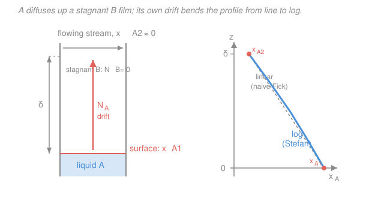

# Transport Phenomena · Lesson 4.2: Steady diffusion through a stagnant film

> ⏱ ~15 min · Module 4: Diffusive mass transport · Builds on: [4.1 Diffusion in binary mixtures — fluxes and frames](04-01-diffusion-binary-mixtures-fluxes-frames.md), [2.6 The species-continuity equation](02-06-species-continuity-equation.md) · Unlocks: 4.5 (film theory & mass-transfer coefficients), Module 5 (interphase transport)

## Why this matters

Leave a glass of water out and it slowly empties into the air. The water molecules don't get blown away — they *diffuse* up through a still layer of air sitting above the surface. But here's the twist that makes mass transfer richer than heat conduction: as A (water) diffuses up, it has to push through B (air) that has nowhere to go, so A's own migration sets up a gentle **bulk updraft** that *carries extra A along with it*. The diffusion drags a bulk flow, and that flow speeds up the diffusion.

This is the **Stefan / stagnant-film problem** — the workhorse model for evaporation, drying, absorption, and the coating on every mass-transfer coefficient you'll meet in [4.5](04-05-mass-transfer-coefficients-correlations.md). It's also the first place the momentum/heat/mass analogy *breaks a little*: pure conduction has no analogous self-induced drift, because heat doesn't carry a molar count the way a diffusing species does.

## The idea

Picture a tube: liquid A at the bottom, open at the top to a stream of gas B flowing past (Figure 1). Between them sits a **stagnant film** of B, thickness $\delta$ — the air is still because nothing stirs it. A evaporates at the surface, diffuses up through the film, and gets swept away by the stream at the top.

Now the key move. Species B is **stationary**: it isn't absorbed by the liquid and it isn't leaving anywhere, so its *net* flux is zero, $N_B = 0$. But B still has a diffusive tendency — near the liquid A is abundant, so B is *scarce* there, and Fick would have B diffuse *downward* toward its own scarcity. Something must cancel that, or B would pile up at the bottom. That something is a **bulk upward flow** (the whole mixture drifting up) whose upward sweep of B exactly offsets B's downward diffusion, holding $N_B = 0$.

That same bulk updraft also grabs A and carries it up *on top of* A's ordinary diffusion. So A arrives at the top faster than plain Fick's law predicts. We call the updraft **Stefan flow**, and the correction it produces is a "drift-flux" factor. When A is very dilute, there's barely any A to induce a flow, the factor is nearly 1, and we recover plain Fick.

## The formal version

Take the [species-continuity equation (2.6)](02-06-species-continuity-equation.md) at steady state, 1-D (height $z$, in m), no reaction: $\dfrac{dN_A}{dz} = 0$, so the molar flux $N_A$ (mol m$^{-2}$ s$^{-1}$) is **constant** through the film. The combined-flux definition from [4.1](04-01-diffusion-binary-mixtures-fluxes-frames.md) for A in a binary mixture is

$$N_A = \underbrace{-\,c\,D_{AB}\frac{dx_A}{dz}}_{\text{Fick diffusion}} + \underbrace{x_A\,(N_A + N_B)}_{\text{bulk convection}},$$

where $c$ is the total molar concentration (mol m$^{-3}$), $D_{AB}$ the diffusivity (m$^2$ s$^{-1}$), and $x_A$ the mole fraction of A. *In words: A's total flux = what diffusion carries + A's share of whatever the bulk mixture is doing.* Set $N_B = 0$ and solve for $N_A$:

$$N_A(1 - x_A) = -\,c\,D_{AB}\frac{dx_A}{dz} \qquad\Longrightarrow\qquad N_A = -\,\frac{c\,D_{AB}}{1 - x_A}\frac{dx_A}{dz}.$$

*In words: the factor $1/(1-x_A) = 1/x_B$ is the Stefan boost — the more A there is, the harder its own diffusion drives the updraft.* Because $N_A$ is constant, this separates. Integrate from the surface ($z=0$, $x_A = x_{A1}$) to the top ($z=\delta$, $x_A = x_{A2}$), using $\int \frac{dx_A}{1-x_A} = -\ln(1-x_A)$ and $x_B = 1 - x_A$:

$$\boxed{\,N_A = \frac{c\,D_{AB}}{\delta}\,\ln\!\frac{x_{B2}}{x_{B1}} = \frac{c\,D_{AB}}{\delta}\,\frac{x_{A1} - x_{A2}}{x_{B,\mathrm{lm}}}\,}, \qquad x_{B,\mathrm{lm}} \equiv \frac{x_{B2} - x_{B1}}{\ln(x_{B2}/x_{B1})}.$$

The two forms are identical because $x_{B2} - x_{B1} = (1-x_{A2}) - (1-x_{A1}) = x_{A1} - x_{A2}$. The quantity $x_{B,\mathrm{lm}}$ is the **log-mean** of B's mole fraction across the film. *In words: it's plain Fick, $\frac{cD_{AB}}{\delta}(x_{A1}-x_{A2})$, divided by the log-mean B fraction — a number less than 1, so dividing by it makes the flux bigger.* That division is the drift-flux correction.

**The concentration profile.** Integrating only to an interior height $z$ gives $\ln\!\frac{x_B(z)}{x_{B1}} = \frac{z}{\delta}\ln\!\frac{x_{B2}}{x_{B1}}$, i.e.

$$x_B(z) = x_{B1}\left(\frac{x_{B2}}{x_{B1}}\right)^{z/\delta}, \qquad x_A(z) = 1 - x_B(z).$$

*In words: $x_B$ climbs geometrically (exponentially in $z$), so $x_A$ falls along a curve — the profile is **logarithmic, not linear**.* The drift is what bends the straight Fick line into a curve.

## Picture

## Worked examples

**Example 1 — water evaporating up a warm tube (Stefan flow makes it bigger).**
Water (A) sits at the bottom of a tube at $70^\circ\mathrm{C}$, $P = 1\,\mathrm{atm}$; dry air (B) flows across the top. Take the film height $\delta = 0.10\,\mathrm{m}$, diffusivity $D_{AB} = 3.2\times10^{-5}\,\mathrm{m^2/s}$, and total concentration $c = P/RT = \frac{101{,}300}{8.314\times343} \approx 35.5\,\mathrm{mol/m^3}$. At $70^\circ\mathrm{C}$ the vapor pressure of water is $\approx 31.2\,\mathrm{kPa}$, so at the surface $x_{A1} = 31.2/101.3 = 0.30$; the stream is dry, $x_{A2} = 0$.

So $x_{B1} = 0.70$, $x_{B2} = 1.00$, and

$$x_{B,\mathrm{lm}} = \frac{1.00 - 0.70}{\ln(1.00/0.70)} = \frac{0.30}{0.3567} = 0.841.$$

$$N_A = \frac{c\,D_{AB}}{\delta}\,\frac{x_{A1}-x_{A2}}{x_{B,\mathrm{lm}}} = \frac{(35.5)(3.2\times10^{-5})}{0.10}\cdot\frac{0.30}{0.841} = (1.137\times10^{-2})(0.3567) \approx 4.05\times10^{-3}\ \mathrm{mol/(m^2\,s)}.$$

Now the **naive plain-Fick** answer, ignoring the drift (dropping the $1/x_{B,\mathrm{lm}}$):

$$N_A^{\text{Fick}} = \frac{c\,D_{AB}}{\delta}(x_{A1}-x_{A2}) = (1.137\times10^{-2})(0.30) \approx 3.41\times10^{-3}\ \mathrm{mol/(m^2\,s)}.$$

The true flux is larger by $1/x_{B,\mathrm{lm}} = 1/0.841 = 1.19$ — about **19% more** than plain Fick. That extra 19% is the Stefan updraft carrying water along with it. *Check.* Units: $\frac{(\mathrm{mol/m^3})(\mathrm{m^2/s})}{\mathrm{m}} = \mathrm{mol/(m^2\,s)}$ ✓; the correction factor is dimensionless and $>1$, as it must be when A is being swept the same way it diffuses. ✓

**Example 2 — the dilute limit recovers plain Fick.**
Repeat at room temperature: $25^\circ\mathrm{C}$, where water's vapor pressure is only $\approx 3.17\,\mathrm{kPa}$, so $x_{A1} = 3.17/101.3 = 0.031$, $x_{A2}=0$. Then $x_{B1}=0.969$, $x_{B2}=1$, and

$$x_{B,\mathrm{lm}} = \frac{1 - 0.969}{\ln(1/0.969)} = \frac{0.031}{0.0318} = 0.984 \approx 1.$$

The Stefan correction is now $1/0.984 = 1.016$ — a mere **1.6%**. Plain Fick is essentially exact. To see why in general, write $x_{B1} = 1-\varepsilon$, $x_{B2}=1$ with $\varepsilon = x_{A1}$ small:

$$x_{B,\mathrm{lm}} = \frac{\varepsilon}{-\ln(1-\varepsilon)} = \frac{\varepsilon}{\varepsilon + \tfrac12\varepsilon^2 + \cdots} = \frac{1}{1 + \tfrac12\varepsilon + \cdots} \xrightarrow{\ \varepsilon\to 0\ } 1.$$

*In words: when there's hardly any A, there's hardly any A to induce a bulk flow, so the drift vanishes and $N_A \to \frac{cD_{AB}}{\delta}(x_{A1}-x_{A2})$ — plain Fick.* *Check.* The factor $\tfrac12\varepsilon$ says the correction grows linearly with $x_{A1}$ for dilute A: at $x_{A1}=0.031$ predict $\approx 1.5\%$, matching the exact $1.6\%$. ✓

## Watch out

- **You might think $N_B = 0$ means B just sits there, motionless.** Not quite — B has *zero net flux*, but its diffusion (down, toward where it's scarce) and the bulk convection (up, the Stefan updraft) each are nonzero and exactly cancel. "Stationary" is a statement about the *sum*, not about either piece.
- **You might reach for the arithmetic mean $\tfrac12(x_{B1}+x_{B2})$.** Use the **log**-mean. They're close when $x_{B1}$ and $x_{B2}$ are close (dilute A), but they diverge as A gets concentrated — and the whole point of this problem is the concentrated regime where the correction bites.
- **You might expect a straight-line profile like steady heat conduction.** Steady 1-D conduction *is* linear ($q$ constant, $dT/dz$ constant). Here $N_A$ is constant but $dx_A/dz$ is **not**, because the $1/(1-x_A)$ factor rides along — so $x_A(z)$ curves. The bulk drift is exactly what conduction lacks.

## One-liner

> A diffusing species drags a bulk flow that carries more of itself along, so evaporation through a stagnant film beats plain Fick by the factor $1/x_{B,\mathrm{lm}}$ — vanishing only when the species is dilute.

## Problems

**P1 (🟢)** A volatile liquid A evaporates through a stagnant gas film into a stream. Given $c = 40\,\mathrm{mol/m^3}$, $D_{AB} = 1.0\times10^{-5}\,\mathrm{m^2/s}$, $\delta = 0.020\,\mathrm{m}$, $x_{A1} = 0.20$ at the surface and $x_{A2} = 0.05$ at the top, find $N_A$. By what factor does Stefan flow raise it above the plain-Fick estimate?

**P2 (🟡)** For the Example-1 conditions ($x_{A1}=0.30$, $x_{A2}=0$, film thickness $\delta$), find the mole fraction $x_A$ at the film's midpoint $z = \delta/2$. Compare to the value a straight-line interpolation would guess ($0.15$). Is the true profile above or below the line, and why does that match the picture?

**P3 (🔴, optional)** Mass-transfer coefficients (previewing [4.5](04-05-mass-transfer-coefficients-correlations.md)) are defined by $N_A = k_c\,(c_{A1} - c_{A2})$, where $c_A = c\,x_A$ is A's molar concentration and $k_c$ (m/s) is the coefficient. Using the boxed Stefan result, show that $k_c = \dfrac{D_{AB}}{\delta\,x_{B,\mathrm{lm}}}$, and identify what it becomes when A is dilute. What does this say about how $k_c$ depends on $D_{AB}$?

Solutions

**P1** Here $x_{B1} = 0.80$, $x_{B2} = 0.95$. Log-mean:

$$x_{B,\mathrm{lm}} = \frac{0.95 - 0.80}{\ln(0.95/0.80)} = \frac{0.15}{\ln(1.1875)} = \frac{0.15}{0.17185} = 0.873.$$

Prefactor $\frac{cD_{AB}}{\delta} = \frac{(40)(1.0\times10^{-5})}{0.020} = 0.020\,\mathrm{mol/(m^2\,s)}$. Then

$$N_A = 0.020\cdot\frac{0.20 - 0.05}{0.873} = 0.020\cdot\frac{0.15}{0.873} = 0.020\times0.1719 \approx 3.44\times10^{-3}\ \mathrm{mol/(m^2\,s)}.$$

Plain Fick: $0.020\times0.15 = 3.00\times10^{-3}$. Enhancement $= 1/x_{B,\mathrm{lm}} = 1/0.873 = 1.15$, i.e. **15% larger**. *Check.* Units mol/(m$^2$s) ✓; factor $>1$ and modest because A is only moderately concentrated. ✓

**P2** Use $x_B(z) = x_{B1}(x_{B2}/x_{B1})^{z/\delta}$ with $x_{B1}=0.70$, $x_{B2}=1.0$, $z/\delta = 0.5$:

$$x_B(\delta/2) = 0.70\,(1/0.70)^{0.5} = 0.70\times\sqrt{1.4286} = 0.70\times1.1952 = 0.8367,$$
$$x_A(\delta/2) = 1 - 0.8367 = 0.163.$$

The true value $0.163$ is **above** the straight-line guess $0.15$. *In words: the drift sweeps A upward, holding its concentration higher across the middle of the film than a linear fall would* — exactly the blue curve bowing above the grey dashed line in Figure 1. *Check.* It lies between $x_{A1}=0.30$ and $x_{A2}=0$, and above the midpoint average, consistent with a convex (concave-from-above) log profile. ✓

**P3** Start from the boxed result and write the driving force in concentrations. Since $c_{A1}-c_{A2} = c(x_{A1}-x_{A2})$,

$$N_A = \frac{c\,D_{AB}}{\delta}\,\frac{x_{A1}-x_{A2}}{x_{B,\mathrm{lm}}} = \frac{D_{AB}}{\delta\,x_{B,\mathrm{lm}}}\,\underbrace{c(x_{A1}-x_{A2})}_{c_{A1}-c_{A2}} \;\Longrightarrow\; k_c = \frac{D_{AB}}{\delta\,x_{B,\mathrm{lm}}}.$$

For dilute A, $x_{B,\mathrm{lm}}\to1$ and $k_c \to D_{AB}/\delta$ — the **film-theory** result of [4.5](04-05-mass-transfer-coefficients-correlations.md). *Interpretation:* $k_c \propto D_{AB}^{1}$ (first power). That's the signature of the stagnant-film picture; the competing penetration/surface-renewal models give $k_c \propto D_{AB}^{1/2}$, and comparing the two is a real diagnostic for which mechanism controls. *Check.* Units: $D_{AB}/\delta = (\mathrm{m^2/s})/\mathrm{m} = \mathrm{m/s}$ ✓, correct for $k_c$. ✓

## Flashback

**From Lesson 4.1 (fluxes and frames — equimolar counterdiffusion):** In a distillation film, A and B counterdiffuse with *equal and opposite* fluxes, $N_B = -N_A$ (each mole of A up trades for a mole of B down). Total concentration $c = 35\,\mathrm{mol/m^3}$, $D_{AB} = 2.0\times10^{-5}\,\mathrm{m^2/s}$, film thickness $\delta = 3.0\,\mathrm{mm}$, with $x_{A1}=0.60$ and $x_{A2}=0.20$. Find $N_A$. Does a log-mean factor appear? Is the profile curved or straight?

Solution

With $N_B = -N_A$, the bulk-convection term in $N_A = -cD_{AB}\frac{dx_A}{dz} + x_A(N_A + N_B)$ has $N_A + N_B = 0$ and **vanishes**. So it's pure Fick with $N_A$ constant:

$$N_A = -c\,D_{AB}\frac{dx_A}{dz} = \text{const} \;\Longrightarrow\; N_A = \frac{c\,D_{AB}}{\delta}(x_{A1}-x_{A2}).$$

$$N_A = \frac{(35)(2.0\times10^{-5})}{3.0\times10^{-3}}(0.60-0.20) = (0.2333)(0.40) \approx 0.093\ \mathrm{mol/(m^2\,s)}.$$

**No log-mean** — with the drift cancelled there's nothing to correct, so $x_{B,\mathrm{lm}}$ never enters. And since $dx_A/dz$ is constant, the profile is a **straight line**, not the logarithmic curve of the stagnant-film case. *In words: equimolar counterdiffusion is the clean "no bulk flow" limit; the stagnant film is its drift-loaded cousin.* *Check.* Units mol/(m$^2$s) ✓; contrast this straight profile with today's curved one — same geometry, different bulk-flow bookkeeping. ✓

## Connections

- **Backward:** this is the [species-continuity equation (2.6)](02-06-species-continuity-equation.md) solved in its simplest steady 1-D geometry, using the combined-flux split from [4.1](04-01-diffusion-binary-mixtures-fluxes-frames.md). The $\frac{cD_{AB}}{\delta}(x_{A1}-x_{A2})$ core is Fick's first law — the same mold as the [thermal boundary layer (3.3)](03-03-thermal-concentration-boundary-layers.md) and Fourier conduction ([`heat-transfer` 1.1](../../heat-transfer/lessons/01-01-three-modes-fouriers-law.md)); the *new* ingredient is the drift factor, which heat conduction has no analog for.
- **Forward:** P3 hands you $k_c = D_{AB}/(\delta\,x_{B,\mathrm{lm}})$, the seed of **film theory** in [4.5](04-05-mass-transfer-coefficients-correlations.md) and the $k_c \propto D_{AB}$ scaling that distinguishes it from penetration theory. The stagnant-film idea is also the geometry underlying the gas-side resistance in [two-film interphase transport (5.2)](05-02-two-film-theory-interphase.md).
- **Sideways:** the same Fick's-law core, in a *transient* solid, is the diffusion couple you met in [`materials-science` 2.4](../../materials-science/lessons/02-04-diffusion-i-ficks-first-law.md) — there the medium is a crystal and the driving force a composition gradient, but $-D\,\nabla c$ is identical. The wrinkle unique to gases here is that the diffusing species can *convect itself*.
