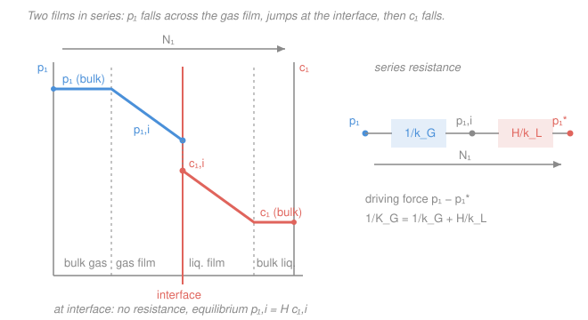

# Transport Phenomena · Lesson 5.2: Interphase mass transfer — two-film theory

> ⏱ ~15 min · Module 5: Analogies and interphase transport · Builds on: [4.5 Mass-transfer coefficients and correlations](04-05-mass-transfer-coefficients-correlations.md), [`heat-transfer` 4.4 Heat exchangers and the overall $U$](../../heat-transfer/lessons/04-04-heat-exchangers-lmtd.md) · Unlocks: [5.3 Simultaneous heat and mass transfer](05-03-simultaneous-heat-mass-transfer.md)

## Why this matters

Every separation that moves a species from one phase into another — scrubbing $\mathrm{CO_2}$ out of a flue gas, stripping ammonia from wastewater, aerating a fermenter, extracting caffeine into a solvent — is governed by transfer **across an interface**, not within a single phase. Lesson 4.5 gave you the single-phase coefficient $k_c$: how fast a species crosses *one* boundary layer. But a gas bubble in water has *two* boundary layers back to back, a gas-side film and a liquid-side film, and you can't measure what happens at the sliver of interface between them. The two-film model is the trick that lets you skip the interface entirely and write the flux in terms of the two bulk compositions you *can* measure. It is the exact mass-transfer twin of the **overall heat-transfer coefficient $U$** you built for heat exchangers.

## The idea

Picture a gas bubble rising through water while its solute (say $\mathrm{NH_3}$) dissolves. Whitman's **two-film picture**: all the resistance lives in two thin stagnant films, one on each side of the interface, and the well-mixed bulk phases have no gradient. To cross, a molecule must diffuse through the gas film, hop across the interface, then diffuse through the liquid film. Two hurdles in a row.

Two ideas make this tractable:

1. **The interface itself has no resistance.** It is so thin that gas and liquid sitting right at it are in **equilibrium** — related by Henry's law, not by any transport rate. All the "difficulty" is in the two films.
2. **The flux is the same through both films** (steady state, nothing accumulates at the interface). One current, two resistors in series.

That is the entire heat-exchanger story retold: hot fluid → wall → cold fluid becomes bulk gas → interface → bulk liquid, and "add the resistances, invert for the overall coefficient" carries over unchanged.

## The formal version

Let $N_A$ be the molar flux of species $A$ (units $\mathrm{mol\,m^{-2}\,s^{-1}}$), positive from gas into liquid. Write each film's rate with its own coefficient and driving force:

$$N_A = k_G\,(p_A - p_{A,i}) = k_L\,(c_{A,i} - c_A).$$

- $p_A$ = partial pressure of $A$ in the **bulk gas** ($\mathrm{kPa}$); $p_{A,i}$ = its value **at the interface**.
- $c_A$ = concentration of $A$ in the **bulk liquid** ($\mathrm{mol\,m^{-3}}$); $c_{A,i}$ = its value at the interface.
- $k_G$ = gas-film coefficient ($\mathrm{mol\,m^{-2}\,s^{-1}\,kPa^{-1}}$); $k_L$ = liquid-film coefficient ($\mathrm{m\,s^{-1}}$).

*In words: the flux equals each film's coefficient times the composition drop across that film — and the two drops describe the same flux.*

**Interface equilibrium (Henry's law).** No resistance at the interface means the two interfacial values are tied:

$$p_{A,i} = H\,c_{A,i},\qquad H = \text{Henry constant }(\mathrm{kPa\,m^{3}\,mol^{-1}}).$$

*In words: at the interface the gas and liquid are as intimate as they can be — a fixed partial-pressure-to-concentration ratio, set by thermodynamics, not by flow.* Large $H$ = the species prefers the gas (sparingly soluble, e.g. $\mathrm{O_2}$); small $H$ = it dives into the liquid (highly soluble, e.g. $\mathrm{NH_3}$).

**Overall coefficient.** The interface state $(p_{A,i}, c_{A,i})$ is real but unmeasurable. Eliminate it. Define a **hypothetical** bulk-gas partial pressure that *would* be in equilibrium with the actual bulk liquid, $p_A^{*} \equiv H c_A$. Then algebra on the three equations above (add the two drops after converting the liquid drop to pressure units via $H$) gives

$$\boxed{\,N_A = K_G\,(p_A - p_A^{*}),\qquad \frac{1}{K_G} = \frac{1}{k_G} + \frac{H}{k_L}.\,}$$

*In words: total resistance = gas-film resistance + liquid-film resistance, and the driving force is the whole gap between the actual bulk gas and the gas that would be in equilibrium with the actual bulk liquid.* There is a mirror-image liquid-side version with $c_A^{*} \equiv p_A/H$:

$$N_A = K_L\,(c_A^{*} - c_A),\qquad \frac{1}{K_L} = \frac{1}{H k_G} + \frac{1}{k_L},\qquad K_L = H K_G.$$

**Controlling resistance.** Whichever term in $1/K_G$ dominates *is* the process:

- **Highly soluble gas (small $H$):** $H/k_L \to 0$, so $1/K_G \approx 1/k_G$ — the **gas film controls**. Speeding up the liquid does nothing.
- **Sparingly soluble gas (large $H$):** $H/k_L$ dominates, so $1/K_G \approx H/k_L$ — the **liquid film controls**. Stir the liquid harder; the gas side is irrelevant.

This is precisely the overall-$U$ logic from [`heat-transfer` 4.4](../../heat-transfer/lessons/04-04-heat-exchangers-lmtd.md): $\tfrac1U = \tfrac{1}{h_i} + \tfrac{t}{k} + \tfrac{1}{h_o}$, dominated by the smallest coefficient. Here $H$ is the extra twist — it *weights* the liquid resistance because the two phases measure concentration on different scales.

## Picture

The partial pressure slides down across the gas film to $p_{A,i}$; at the interface Henry's law sets the tie between $p_{A,i}$ and $c_{A,i}$; then concentration slides down across the liquid film to the bulk $c_A$. On the right: the same story as two resistors, $1/k_G$ and $H/k_L$, carrying one current $N_A$ under the overall driving force $p_A - p_A^{*}$.

## Worked examples

### Example 1 — Overall coefficient and who's in charge

Same films for both gases: $k_G = 1.0\times10^{-3}\ \mathrm{mol\,m^{-2}\,s^{-1}\,kPa^{-1}}$, $k_L = 1.0\times10^{-4}\ \mathrm{m\,s^{-1}}$. Compare a highly soluble gas ($\mathrm{NH_3}$, $H = 0.01\ \mathrm{kPa\,m^{3}\,mol^{-1}}$) with a sparingly soluble one ($\mathrm{O_2}$, $H = 100\ \mathrm{kPa\,m^{3}\,mol^{-1}}$). (Values illustrative but the right orders of magnitude.)

The gas-film resistance is the same for both: $\dfrac{1}{k_G} = 1000\ \mathrm{m^2\,s\,kPa\,mol^{-1}}$.

**Ammonia:** $\dfrac{H}{k_L} = \dfrac{0.01}{1.0\times10^{-4}} = 100$. So $\dfrac{1}{K_G} = 1000 + 100 = 1100$, and

$$K_G = 9.1\times10^{-4}\ \mathrm{mol\,m^{-2}\,s^{-1}\,kPa^{-1}}.$$

Gas-film fraction $= 1000/1100 = 91\%$ → **gas-film controlled.**

**Oxygen:** $\dfrac{H}{k_L} = \dfrac{100}{1.0\times10^{-4}} = 1.0\times10^{6}$. So $\dfrac{1}{K_G} = 1000 + 1.0\times10^{6} \approx 1.0\times10^{6}$, and

$$K_G \approx 1.0\times10^{-6}\ \mathrm{mol\,m^{-2}\,s^{-1}\,kPa^{-1}}.$$

Liquid-film fraction $= 10^{6}/1.001\times10^{6} = 99.9\%$ → **liquid-film controlled.**

**Sanity check.** Same two films, yet $K_G$ differs by a factor of $\sim900$ purely because of solubility. Ammonia scrubbers are designed around gas-side turbulence; oxygen aerators are designed around liquid-side turbulence (fine bubbles, agitation). Units of every resistance term are $\mathrm{m^2\,s\,kPa\,mol^{-1}}$, so $K_G$ comes out in $\mathrm{mol\,m^{-2}\,s^{-1}\,kPa^{-1}}$ — flux per unit pressure driving force. ✓

### Example 2 — Flux and the interface state by intersecting the equilibrium line

A moderately soluble gas: $k_G = 1.0\times10^{-3}\ \mathrm{mol\,m^{-2}\,s^{-1}\,kPa^{-1}}$, $k_L = 1.0\times10^{-4}\ \mathrm{m\,s^{-1}}$, $H = 0.05\ \mathrm{kPa\,m^{3}\,mol^{-1}}$. Bulk gas $p_A = 2.0\ \mathrm{kPa}$; bulk liquid $c_A = 5.0\ \mathrm{mol\,m^{-3}}$. Find $N_A$ and the interface $(c_{A,i}, p_{A,i})$.

**Flux via the overall coefficient.** Equilibrium partial pressure of the bulk liquid: $p_A^{*} = H c_A = 0.05\times5.0 = 0.25\ \mathrm{kPa}$. Driving force $p_A - p_A^{*} = 1.75\ \mathrm{kPa}$.

$$\frac{1}{K_G} = 1000 + \frac{0.05}{1.0\times10^{-4}} = 1000 + 500 = 1500 \;\Rightarrow\; K_G = 6.67\times10^{-4}.$$
$$N_A = K_G\,(p_A - p_A^{*}) = 6.67\times10^{-4}\times1.75 = 1.17\times10^{-3}\ \mathrm{mol\,m^{-2}\,s^{-1}}.$$

**Interface state.** Back out each film's drop from the shared flux:

$$p_{A,i} = p_A - \frac{N_A}{k_G} = 2.0 - \frac{1.17\times10^{-3}}{1.0\times10^{-3}} = 2.0 - 1.17 = 0.833\ \mathrm{kPa}.$$
$$c_{A,i} = c_A + \frac{N_A}{k_L} = 5.0 + \frac{1.17\times10^{-3}}{1.0\times10^{-4}} = 5.0 + 11.7 = 16.7\ \mathrm{mol\,m^{-3}}.$$

**The graphical picture.** Plot the operating point $(c_A, p_A) = (5.0,\,2.0)$ and draw a **tie line** of slope $-k_L/k_G = -0.1$ (in $p$-vs-$c$ axes). Where it hits the **equilibrium line** $p = Hc = 0.05\,c$ is the interface. Their intersection is exactly $(16.7,\,0.833)$ — the interface is wherever the flux-ratio line meets the Henry line.

**Sanity check.** Does the interface obey Henry's law? $H c_{A,i} = 0.05\times16.7 = 0.833\ \mathrm{kPa} = p_{A,i}$. ✓ And the tie-line slope: $\Delta p/\Delta c = (0.833-2.0)/(16.7-5.0) = -1.17/11.7 = -0.1 = -k_L/k_G$. ✓ Flux is positive ($p_A > p_A^{*}$), so $A$ moves gas → liquid: absorption, as expected. ✓

## Watch out

- **You might think** the interface concentrations $c_{A,i}$ and $p_{A,i}$ are the same "amount" so their difference drives nothing — **but actually** they live on different scales (pressure vs. concentration); Henry's constant $H$ is the exchange rate between them, which is why it appears *inside* the resistance sum as $H/k_L$, not as a bare $1/k_L$.
- **You might think** "highly soluble" means the liquid controls (it soaks the gas up eagerly) — **but actually** it's the reverse: a soluble gas ($H$ small) offers almost no liquid-side resistance, so the **gas** film is the bottleneck. Solubility and controlling resistance point in opposite directions.
- **You might think** $p_A^{*}$ is a real partial pressure somewhere in the system — **but actually** it's a bookkeeping fiction: the partial pressure that *would* be in equilibrium with the bulk liquid. It exists only to write the whole two-film resistance as one gas-side expression, exactly as $\Delta T_{\text{lm}}$ packages a whole exchanger.

## One-liner

> Two films in series across an equilibrium interface: add the resistances ($1/K_G = 1/k_G + H/k_L$), and solubility decides which film is the bottleneck — the mass-transfer twin of the overall $U$.

## Problems

**P1 (🟢)** A sparingly soluble gas has $k_G = 2.0\times10^{-3}\ \mathrm{mol\,m^{-2}\,s^{-1}\,kPa^{-1}}$, $k_L = 5.0\times10^{-5}\ \mathrm{m\,s^{-1}}$, $H = 50\ \mathrm{kPa\,m^{3}\,mol^{-1}}$. Compute $K_G$ and state the percentage of the total resistance that lies in the liquid film.

**P2 (🟡)** For the gas in P1, the bulk gas is $p_A = 4.0\ \mathrm{kPa}$ and the bulk liquid is essentially solute-free ($c_A \approx 0$). Find the flux $N_A$ and the interfacial partial pressure $p_{A,i}$. Comment on how close $p_{A,i}$ is to $p_A$, and what that says about the gas film.

**P3 (🔴, optional)** Show algebraically that $\dfrac{1}{K_G} = \dfrac{1}{k_G} + \dfrac{H}{k_L}$ follows from the three governing equations $N_A = k_G(p_A - p_{A,i}) = k_L(c_{A,i}-c_A)$ and $p_{A,i} = Hc_{A,i}$, with $p_A^{*} \equiv Hc_A$. (Hint: add the gas-film drop to $H$ times the liquid-film drop.)

Solutions

**P1** $\dfrac{1}{k_G} = 500$; $\dfrac{H}{k_L} = \dfrac{50}{5.0\times10^{-5}} = 1.0\times10^{6}$. Total $\dfrac{1}{K_G} = 500 + 1.0\times10^{6} \approx 1.0\times10^{6}$, so $K_G \approx 1.0\times10^{-6}\ \mathrm{mol\,m^{-2}\,s^{-1}\,kPa^{-1}}$. Liquid fraction $= \dfrac{1.0\times10^{6}}{1.0005\times10^{6}} = 99.95\%$ — overwhelmingly **liquid-film controlled** (as expected for a large-$H$ gas). *Units check: resistances in $\mathrm{m^2\,s\,kPa\,mol^{-1}}$ → $K_G$ in $\mathrm{mol\,m^{-2}\,s^{-1}\,kPa^{-1}}$.* ✓

**P2** $p_A^{*} = Hc_A = 0$, so the driving force is the full $p_A = 4.0\ \mathrm{kPa}$.
$N_A = K_G p_A = 1.0\times10^{-6}\times4.0 = 4.0\times10^{-6}\ \mathrm{mol\,m^{-2}\,s^{-1}}.$
Interfacial pressure: $p_{A,i} = p_A - \dfrac{N_A}{k_G} = 4.0 - \dfrac{4.0\times10^{-6}}{2.0\times10^{-3}} = 4.0 - 0.002 = 3.998\ \mathrm{kPa}.$
$p_{A,i}$ is essentially equal to $p_A$: almost no partial-pressure drop across the gas film, confirming the gas film carries a negligible share of the resistance. Virtually the entire concentration drop is in the liquid. *Sanity: $c_{A,i} = p_{A,i}/H = 3.998/50 = 0.080\ \mathrm{mol\,m^{-3}}$, and $k_L(c_{A,i}-c_A) = 5.0\times10^{-5}\times0.080 = 4.0\times10^{-6} = N_A$.* ✓

**P3** From the gas film: $p_A - p_{A,i} = N_A/k_G$. From the liquid film: $c_{A,i} - c_A = N_A/k_L$, so $H(c_{A,i}-c_A) = HN_A/k_L$, i.e. $Hc_{A,i} - Hc_A = HN_A/k_L$. Use interface equilibrium $Hc_{A,i}=p_{A,i}$ and the definition $p_A^{*}=Hc_A$: this becomes $p_{A,i} - p_A^{*} = HN_A/k_L$. Add the gas-film relation:
$$(p_A - p_{A,i}) + (p_{A,i} - p_A^{*}) = \frac{N_A}{k_G} + \frac{HN_A}{k_L} \;\Rightarrow\; p_A - p_A^{*} = N_A\!\left(\frac1{k_G} + \frac{H}{k_L}\right).$$
Since $N_A = K_G(p_A - p_A^{*})$ by definition, $\dfrac{1}{K_G} = \dfrac{1}{k_G} + \dfrac{H}{k_L}$. The interface state $p_{A,i}$ telescopes out — that's the whole point. ✓

## Flashback

**From Lesson 4.5 (Mass-transfer coefficients and correlations):** Water evaporates from the wetted inner wall of a tube into dry air flowing at $Re = 1.5\times10^{4}$; the air–water-vapor Schmidt number is $Sc = 0.60$ and $D_{AB} = 2.6\times10^{-5}\ \mathrm{m^2\,s^{-1}}$, tube diameter $D = 0.025\ \mathrm{m}$. Using the Dittus–Boelter twin $Sh = 0.023\,Re^{0.8}Sc^{1/3}$, estimate the gas-side mass-transfer coefficient $k_c$.

Solution

$Re^{0.8} = (1.5\times10^{4})^{0.8}$. $\ln(1.5\times10^{4}) = 9.616$; $\times0.8 = 7.693$; $e^{7.693} \approx 2.19\times10^{3}$.
$Sc^{1/3} = 0.60^{1/3} = 0.843$.
$Sh = 0.023\times2.19\times10^{3}\times0.843 = 42.5$.
$k_c = \dfrac{Sh\,D_{AB}}{D} = \dfrac{42.5\times2.6\times10^{-5}}{0.025} = 4.4\times10^{-2}\ \mathrm{m\,s^{-1}}.$
*Units: $[\,\mathrm{m^2\,s^{-1}}]/[\mathrm{m}] = \mathrm{m\,s^{-1}}$ — a velocity, as a $k_c$ should be.* ✓ This is exactly the kind of single-phase coefficient that becomes the gas-film $k_G$ (after converting to a pressure driving force) in this lesson's two-film sum.

## Connections

- **Backward:** the single-phase coefficient $k_c$ from [4.5](04-05-mass-transfer-coefficients-correlations.md) is what a *film* coefficient ($k_G$ or $k_L$) actually is; this lesson wires two of them in series. The add-the-resistances / overall-coefficient move is the mass-transfer copy of the overall $U$ from [`heat-transfer` 4.4](../../heat-transfer/lessons/04-04-heat-exchangers-lmtd.md).
- **Forward:** [5.3 Simultaneous heat and mass transfer](05-03-simultaneous-heat-mass-transfer.md) puts a two-film mass flux and a convective heat flux at the *same* interface (evaporative cooling, the wet-bulb thermometer). Column design (absorbers, strippers) integrates $N_A = K_G(p_A - p_A^{*})$ up a packed tower — the direct application in a downstream separations course.
- **Sideways:** the tie-line-meets-equilibrium-curve construction of Example 2 is the germ of the **McCabe–Thiele / operating-line** diagrams used across distillation, absorption, and extraction — the same "operating point + equilibrium relation → interface (or stage) composition" geometry, just repeated up a column.
