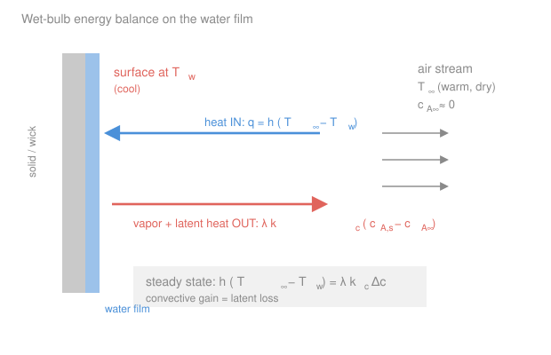

# Transport Phenomena · Lesson 5.3: Simultaneous heat and mass transfer

> ⏱ ~15 min · Module 5: Analogies and coupled transport · Builds on: [5.1 Transport analogies](05-01-transport-analogies.md), [1.5 The three diffusivities](01-05-three-diffusivities-pr-sc-le.md), [3.5 Free (natural) convection](03-05-free-natural-convection.md) · Unlocks: Boss problem 5

## Why this matters

This is the payoff of the whole course. Everything so far treated momentum, heat, and mass one at a time. But the moment a liquid **evaporates** into a gas, heat and mass transfer stop being separate problems: the vapor leaving carries away latent heat, which cools the surface, which changes how much vapor can leave — they are locked together through one number, the **surface temperature**. Solve that coupling and you get the **wet-bulb temperature**: why a thermometer wrapped in a wet sock reads colder than the air, why sweating cools you, why a swamp cooler works in Phoenix but not in Houston. And the tool that cracks it is the same Chilton–Colburn analogy from [5.1](05-01-transport-analogies.md) — heat and mass transfer are *the same story*, so their coefficients cancel and leave a clean answer that depends on the air's humidity but, remarkably, **not on how fast the air blows**.

## The idea

Picture a drop of water sitting in warm, dry air. Two things happen at its surface at once:

1. **Heat flows in.** The air is warmer than the water, so convection delivers heat *to* the surface — the usual $h\,\Delta T$ story.
2. **Molecules fly out.** The air is drier than the saturated layer right at the water, so water evaporates — the usual $k_c\,\Delta c$ story from [4.5](04-05-mass-transfer-coefficients-correlations.md).

Here is the coupling: **evaporation costs energy**. Every molecule that leaves must be handed its latent heat of vaporization, and that heat comes out of the liquid — it *cools the surface*. So the surface drops below the air temperature. It keeps dropping until things balance: the surface gets exactly as cold as it needs to be so that **the heat arriving by convection is exactly the heat leaving as latent heat of vapor**. That steady balance temperature is the **wet-bulb temperature** $T_w$.

Why does it stop dropping? Feedback. A colder surface has a lower saturation vapor pressure, so it evaporates *less*, so it needs *less* latent heat, while at the same time a colder surface pulls *more* heat from the air. The two effects meet at one temperature. No wick, no external cooling — just physics balancing a checkbook in energy.

The beautiful part, which we prove below: because $h$ and $k_c$ come from the *same* boundary layer (5.1), their ratio is a fixed property of the fluids, not of the flow. Blow the air twice as fast and you double *both* the heat delivery and the evaporation — the balance point doesn't move. $T_w$ is set by the air's temperature and humidity alone.

## The formal version

**The coupled surface balance.** Take a thin liquid film at temperature $T_w$ (K) in a gas stream at $T_\infty$ (K) with bulk vapor concentration $c_{A,\infty}$. Per unit area, at steady state:

$$\underbrace{h\,(T_\infty - T_w)}_{\text{convective heat in }[\mathrm{W/m^2}]} \;=\; \underbrace{k_c\,\lambda\,\big(c_{A,s}(T_w) - c_{A,\infty}\big)}_{\text{latent heat carried out by vapor }[\mathrm{W/m^2}]}.$$

*In words: the heat convection brings to the surface is spent entirely on boiling off the vapor that mass transfer carries away.* Symbol by symbol:

- $h$ — convective heat-transfer coefficient, $\mathrm{W/(m^2\,K)}$.
- $k_c$ — convective mass-transfer coefficient, $\mathrm{m/s}$, from $N_A = k_c(c_{A,s}-c_{A,\infty})$ ([4.5](04-05-mass-transfer-coefficients-correlations.md)).
- $\lambda$ — latent heat of vaporization, $\mathrm{J/kg}$ (if $c_A$ is a mass concentration, $\mathrm{kg/m^3}$) or $\mathrm{J/mol}$ (if $c_A$ is molar, $\mathrm{mol/m^3}$). Keep the pairing consistent.
- $c_{A,s}(T_w)$ — **saturation** vapor concentration evaluated *at the surface temperature* $T_w$. This is the crux: the surface air is saturated, and saturation depends on $T_w$.
- $c_{A,\infty}$ — vapor concentration far away (the humidity of the incoming air).

Notice $T_w$ appears on **both** sides — linearly on the left, and buried nonlinearly inside $c_{A,s}(T_w)$ on the right. That is exactly the coupling; it's why we iterate rather than solve in closed form.

**Eliminating the coefficients with Chilton–Colburn.** We don't want $h$ and $k_c$ separately — we want their ratio. The Chilton–Colburn analogy from [5.1](05-01-transport-analogies.md), $j_H = j_D$, says

$$\frac{h}{\rho c_p}\,Pr^{2/3} = k_c\,Sc^{2/3} \qquad\Longrightarrow\qquad \frac{h}{k_c\,\rho c_p} = \left(\frac{Sc}{Pr}\right)^{2/3} = Le^{2/3},$$

using $Le = \alpha/D_{AB} = Sc/Pr$ from [1.5](01-05-three-diffusivities-pr-sc-le.md), with $\rho$ the gas density ($\mathrm{kg/m^3}$) and $c_p$ its specific heat ($\mathrm{J/(kg\,K)}$). *In words: because one boundary layer carries both heat and mass, the ratio $h/k_c$ is not a flow property — it's the fixed group $\rho c_p\,Le^{2/3}$.* This relation, $h/(k_c\rho c_p) = Le^{2/3}$, is the **Lewis relation**. Divide the surface balance by $k_c$ and substitute:

$$\boxed{\,T_\infty - T_w = \frac{\lambda\,\big(c_{A,s}(T_w) - c_{A,\infty}\big)}{\rho\,c_p\,Le^{2/3}}\,}$$

*In words: the wet-bulb depression is the latent heat of the humidity deficit, divided by the air's heat capacity per volume and a mild Lewis-number correction.* Every $h$ and $k_c$ is gone — the flow speed vanished with them.

**Psychrometrics: why the sling psychrometer works.** For the air–water system $Le \approx 0.85$, so $Le^{2/3} \approx 0.9 \approx 1$. With $Le^{2/3} \to 1$ the formula collapses to the **adiabatic-saturation** relation — the temperature air would reach if you saturated it with water using only its own heat. That near-coincidence (a happy accident special to water in air) is why a **sling psychrometer** — two thermometers, one dry, one in a wet wick, whirled through the air — reads humidity directly off the wet-bulb depression $T_\infty - T_w$. For other liquids ($Le \ne 1$) the wet-bulb and adiabatic-saturation temperatures split apart.

## Picture

## Worked examples

**Example 1 — Boss problem 5: the wet thermometer in dry air.** A small wet bulb hangs in a fast, dry air stream at $T_\infty$; at steady state its film sits at $T_w$. Derive $T_w$ and estimate it for $T_\infty = 40\,^\circ\mathrm{C}$.

**(a) The coupled balances.** Two conservation statements on the film, per unit area:

- Energy (steady, so storage $=0$): heat in by convection $=$ energy leaving with the vapor,
$$h\,(T_\infty - T_w) = \lambda\,N_A.$$
- Mass: the evaporative flux is convective mass transfer into the dry stream,
$$N_A = k_c\big(c_{A,s}(T_w) - c_{A,\infty}\big).$$

Combine (substitute $N_A$):

$$h\,(T_\infty - T_w) = k_c\,\lambda\,\big(c_{A,s}(T_w) - c_{A,\infty}\big).$$

That's one equation for the one unknown $T_w$ — the coupling is that $c_{A,s}$ must be read at $T_w$.

**(b) Kill $h/k_c$ with Chilton–Colburn.** Divide by $k_c$ and use $h/k_c = \rho c_p\,Le^{2/3}$:

$$T_\infty - T_w = \frac{\lambda\,\big(c_{A,s}(T_w) - c_{A,\infty}\big)}{\rho\,c_p\,Le^{2/3}}.$$

Reading off every factor: $\lambda$ = latent heat (the "price" of each unit of vapor); $c_{A,s}(T_w)-c_{A,\infty}$ = the humidity *deficit* (how much drier the far air is than the saturated surface — the driving force for evaporation); $\rho c_p$ = the air's heat capacity per unit volume (how much cooling one unit of heat buys); $Le^{2/3}$ = the mild correction for heat and mass diffusing at slightly different rates. For dry air, $c_{A,\infty}\approx 0$, so the deficit is just $c_{A,s}(T_w)$.

**(c) The one-variable iteration.** The equation is implicit because $c_{A,s}(T_w)$ is the nonlinear saturation curve. Solve by simple iteration:

> **guess** $T_w$ → look up $c_{A,s}(T_w)$ on the saturation curve → compute the right-hand side → get a new $T_\infty - T_w$, hence a new $T_w$ → repeat until it stops moving.

**Numbers** for $T_\infty = 40\,^\circ\mathrm{C}$, $c_{A,\infty}\approx 0$ (very dry). Use mass concentrations. Air: $\rho \approx 1.14\ \mathrm{kg/m^3}$, $c_p \approx 1006\ \mathrm{J/(kg\,K)}$, so $\rho c_p \approx 1150\ \mathrm{J/(m^3\,K)}$; water $\lambda \approx 2.45\times10^6\ \mathrm{J/kg}$; $Le \approx 0.85$ so $Le^{2/3}\approx 0.90$. Saturation vapor density $c_{A,s}(T)$: $\approx 10.7\ \mathrm{g/m^3}$ at $12\,^\circ\mathrm{C}$, $11.4$ at $13\,^\circ\mathrm{C}$, $12.1$ at $14\,^\circ\mathrm{C}$.

Guess $T_w = 14\,^\circ\mathrm{C}$: RHS $= \dfrac{(2.45\times10^6)(0.0121)}{(1150)(0.90)} \approx 28.6\ \mathrm{K}$, giving $T_w = 40 - 28.6 = 11.4\,^\circ\mathrm{C}$ — too low, our guess was high. Guess $T_w = 12\,^\circ\mathrm{C}$: RHS $= \dfrac{(2.45\times10^6)(0.0107)}{1035} \approx 25.3\ \mathrm{K}$, giving $T_w = 14.7\,^\circ\mathrm{C}$ — now too high. The root sits between; try $T_w = 13\,^\circ\mathrm{C}$: RHS $= \dfrac{(2.45\times10^6)(0.0114)}{1035} \approx 27.0\ \mathrm{K}$, giving $T_w = 40 - 27.0 = 13.0\,^\circ\mathrm{C}$. **Converged: $T_w \approx 13\,^\circ\mathrm{C}$** — a psychrometric chart reads $\approx 14\,^\circ\mathrm{C}$ for 40 °C dry air, so the estimate is right on. A 27-degree depression from bone-dry air: evaporation is a powerful coolant.

**Why humidity matters but air speed doesn't.** Humidity enters directly through $c_{A,\infty}$ — more humid air shrinks the deficit $c_{A,s}-c_{A,\infty}$, raising $T_w$ toward $T_\infty$ (in saturated air, $c_{A,\infty}=c_{A,s}$, the deficit is zero, and $T_w = T_\infty$: no evaporative cooling — which is why humid heat is unbearable). Air speed, on the other hand, sits *only* inside $h$ and $k_c$, and Chilton–Colburn tied those together as $h/k_c = \rho c_p\,Le^{2/3}$, a **property group** with no velocity in it. Faster air evaporates more *and* heats more, in lockstep — the balance point $T_w$ never budges. It sets the *rate* the bulb reaches $T_w$, not the value of $T_w$.

*Units/sanity check.* RHS: $\dfrac{[\mathrm{J/kg}][\mathrm{kg/m^3}]}{[\mathrm{J/(m^3\,K)}]} = \dfrac{\mathrm{J/m^3}}{\mathrm{J/(m^3\,K)}} = \mathrm{K}$ ✓. Dry-limit sense: bigger $\lambda$ or drier air ⇒ larger depression ✓; more humid air ⇒ smaller depression, $T_w\to T_\infty$ ✓.

**Example 2 — the sweat/swamp-cooler estimate.** Skin at rest loses heat partly by evaporating sweat. If sweat evaporates into air with a humidity deficit $c_{A,s}(T_w)-c_{A,\infty} = 15\ \mathrm{g/m^3}$ and the mass-transfer coefficient is $k_c = 0.012\ \mathrm{m/s}$, what evaporative heat flux does that carry, and what convective coefficient $h$ balances it at a 5-degree skin-to-air difference?

Evaporative flux: $q_{\text{evap}} = \lambda k_c\,\Delta c = (2.45\times10^6)(0.012)(0.015) \approx 441\ \mathrm{W/m^2}$. To balance with $h(T_\infty - T_w)=q_{\text{evap}}$ across $\Delta T = 5\ \mathrm{K}$ would need $h = 441/5 \approx 88\ \mathrm{W/(m^2\,K)}$ — far above a still-air $h\approx 5$–$10$. The lesson: **evaporation dumps heat that bare convection can't match**, which is exactly why sweating (and swamp coolers, and misting fans) work when a plain fan fails — and why they *stop* working as $c_{A,\infty}$ climbs toward saturation. *Check:* $\lambda k_c \Delta c = [\mathrm{J/kg}][\mathrm{m/s}][\mathrm{kg/m^3}] = \mathrm{W/m^2}$ ✓.

## Watch out

- **You might think faster air gives a lower wet-bulb reading.** It doesn't. Wind changes *how quickly* the bulb settles to $T_w$, not the value — $h/k_c$ is a property group with no velocity in it. (This is exactly why a sling psychrometer's reading is insensitive to how fast you whirl it, as long as it's fast enough to be convection-limited.)
- **You might evaluate the saturation concentration at the air temperature $T_\infty$.** Use $T_w$, not $T_\infty$: the vapor is in equilibrium with the *cold surface*, which holds far less water. Evaluating $c_{A,s}$ at $T_\infty$ badly overestimates evaporation and the depression.
- **You might set $Le^{2/3}=1$ and call it exact.** For air–water it's an excellent ($\approx 0.9$) approximation — which is *why* wet-bulb ≈ adiabatic-saturation temperature and psychrometry is simple. For other vapor–gas pairs $Le$ can be well off 1, the two temperatures diverge, and you must keep the $Le^{2/3}$ factor.
- **You might drop $\lambda$ thinking it's "just heat."** Latent heat is the entire coupling. Set $\lambda = 0$ and the surface just sits at $T_\infty$ — no evaporative cooling. The whole effect lives in that one factor.

## One-liner

> Evaporation cools a surface until convective heat in equals latent heat out; Chilton–Colburn turns that balance into $T_\infty - T_w = \lambda\,\Delta c/(\rho c_p\,Le^{2/3})$ — a wet-bulb depression set by humidity, not by wind.

## Problems

**P1 (🟢)** Air at $30\,^\circ\mathrm{C}$ blows over a wet surface. A measurement gives the wet-bulb temperature $T_w = 20\,^\circ\mathrm{C}$, at which the saturation vapor density is $c_{A,s} = 17.3\ \mathrm{g/m^3}$. Taking $\rho c_p = 1180\ \mathrm{J/(m^3\,K)}$, $\lambda = 2.45\times10^6\ \mathrm{J/kg}$, and $Le^{2/3} = 0.9$, back out the actual humidity $c_{A,\infty}$ of the incoming air from the Lewis-relation formula.

**P2 (🟡)** Two identical wet bulbs sit in the same $35\,^\circ\mathrm{C}$ air, one in a gentle breeze and one in a gale. (a) Which reads a lower temperature at steady state, and by how much? (b) Which reaches its steady reading first? Explain each answer in one sentence using the structure of the wet-bulb equation.

**P3 (🔴)** Show that as the incoming air approaches saturation, $c_{A,\infty}\to c_{A,s}(T_\infty)$, the wet-bulb depression $T_\infty - T_w \to 0$. (Hint: argue that $T_w$ must lie between $T_\infty$ and the incoming dew point, then let the deficit close.) What does this say about the maximum cooling a swamp cooler can deliver on a humid day?

Solutions

**P1** Rearrange the boxed formula for $c_{A,\infty}$:

$$T_\infty - T_w = \frac{\lambda(c_{A,s}-c_{A,\infty})}{\rho c_p\,Le^{2/3}} \;\Longrightarrow\; c_{A,\infty} = c_{A,s} - \frac{\rho c_p\,Le^{2/3}\,(T_\infty - T_w)}{\lambda}.$$

Plug in ($T_\infty - T_w = 10\ \mathrm{K}$):

$$c_{A,\infty} = 0.0173 - \frac{(1180)(0.9)(10)}{2.45\times10^6} = 0.0173 - 0.00433 = 0.0130\ \mathrm{kg/m^3} = 13.0\ \mathrm{g/m^3}.$$

So the incoming air holds about $13.0\ \mathrm{g/m^3}$ against a saturation of $17.3\ \mathrm{g/m^3}$ at $20\,^\circ\mathrm{C}$ — but relative humidity is referenced to $30\,^\circ\mathrm{C}$ saturation ($\approx 30.4\ \mathrm{g/m^3}$), giving RH $\approx 13.0/30.4 \approx 43\%$. *Check:* units of the second term, $\dfrac{[\mathrm{J/(m^3 K)}][\mathrm{K}]}{[\mathrm{J/kg}]} = \mathrm{kg/m^3}$ ✓; and $c_{A,\infty} < c_{A,s}$ as required for evaporation to run ✓.

**P2** (a) **Neither reads lower — they read the same.** $T_w$ depends only on $T_\infty$, humidity, and fluid properties through $T_\infty - T_w = \lambda\Delta c/(\rho c_p Le^{2/3})$; air speed enters only via $h$ and $k_c$, which Chilton–Colburn locks into the velocity-free ratio $h/k_c = \rho c_p Le^{2/3}$. Same air, same humidity ⇒ same $T_w$, depression $=0$ between them. (b) **The gale-bulb settles first.** Faster air means larger $h$ and $k_c$ (higher $Re$, hence higher $Nu$, $Sh$), so heat and vapor move faster and the film reaches its balance temperature sooner — the *rate* of approach scales with the coefficients even though the *destination* $T_w$ does not.

**P3** $T_w$ is bounded: convective heat only flows in while $T_w < T_\infty$, and evaporation only runs while $c_{A,s}(T_w) > c_{A,\infty}$, i.e. while $T_w$ exceeds the dew point of the incoming air. So the dew point $\le T_w \le T_\infty$. As the air approaches saturation, its dew point rises toward $T_\infty$, squeezing $T_w$ from below against $T_\infty$ from above; the sandwich closes and $T_w \to T_\infty$, so $T_\infty - T_w \to 0$. Directly: the deficit $c_{A,s}(T_w) - c_{A,\infty} \to c_{A,s}(T_\infty) - c_{A,s}(T_\infty) = 0$, so the right-hand side vanishes and $T_w = T_\infty$. **Physically: a swamp cooler delivers zero cooling in saturated air** — there's no humidity deficit to evaporate into, which is why evaporative coolers are useless in muggy climates and excellent in the desert. *Check:* limiting behavior is monotone and bounded, and the two arguments (bounding and direct) agree ✓.

## Flashback

**From Lesson 5.1 (Transport analogies):** A gas flows through a tube. Heat-transfer measurements give a convective coefficient $h = 45\ \mathrm{W/(m^2\,K)}$. For the same flow you need the mass-transfer coefficient $k_c$ for a trace species evaporating from the wall. Given air $\rho c_p = 1180\ \mathrm{J/(m^3\,K)}$, $Pr = 0.70$, $Sc = 0.60$, use the Chilton–Colburn analogy to estimate $k_c$. (Fresh variant — pull $k_c$ out of $h$.)

Solution

Chilton–Colburn ($j_H = j_D$) gives $\dfrac{h}{k_c\,\rho c_p} = Le^{2/3} = \left(\dfrac{Sc}{Pr}\right)^{2/3}$, so

$$k_c = \frac{h}{\rho c_p}\left(\frac{Pr}{Sc}\right)^{2/3} = \frac{45}{1180}\left(\frac{0.70}{0.60}\right)^{2/3}.$$

Compute: $\dfrac{45}{1180} = 0.0381\ \mathrm{m/s}$; $\left(\dfrac{0.70}{0.60}\right)^{2/3} = (1.167)^{2/3} \approx 1.109$. Thus

$$k_c \approx 0.0381 \times 1.109 \approx 0.0423\ \mathrm{m/s}.$$

*Check:* units $\dfrac{[\mathrm{W/(m^2 K)}]}{[\mathrm{J/(m^3 K)}]} = \dfrac{\mathrm{W/m^2}}{\mathrm{J/m^3}} = \dfrac{\mathrm{J/(s\,m^2)}}{\mathrm{J/m^3}} = \mathrm{m/s}$ ✓. Since $Sc < Pr$ here, mass diffuses a touch more easily than heat, so $k_c$ is nudged slightly above the bare $h/\rho c_p$ — consistent with $Le<1$. ✓

## Connections

- **Backward:** this is the [5.1](05-01-transport-analogies.md) Chilton–Colburn analogy doing real work — $j_H = j_D$ is what lets $h/k_c$ collapse to $\rho c_p\,Le^{2/3}$, with $Le = Sc/Pr$ straight from [1.5](01-05-three-diffusivities-pr-sc-le.md). The mass-transfer coefficient $k_c$ and the driving force $\Delta c$ are from [4.5](04-05-mass-transfer-coefficients-correlations.md); the surface energy balance is the [3.5](03-05-free-natural-convection.md)/convection $h\,\Delta T$ story with a latent-heat sink bolted on. It also completes the [5.2](05-02-two-film-theory-interphase.md) picture of coupled interphase transport — there two mass resistances in series, here heat and mass in parallel at one surface.
- **Forward:** evaporative and cooling-tower design, spray drying, and humidification all live on this balance; the wet-bulb temperature is the anchor of every psychrometric chart. In the unbuilt reaction-engineering course, the same coupled heat-and-mass balance on a catalyst pellet (an exothermic reaction heating the pellet while reactant diffuses in) sets the *non-isothermal* effectiveness factor — a direct sequel to Boss problem 4.
- **Sideways (thermodynamics / everyday life):** the wet-bulb depression is why sweating cools you, why misters chill a patio in Arizona but not in Florida, and why the "wet-bulb 35 °C" limit is a hard ceiling on human heat tolerance — at that wet-bulb, evaporation can no longer shed metabolic heat because the humidity deficit has closed (P3). Same equation, from a thermometer to a heat wave.
