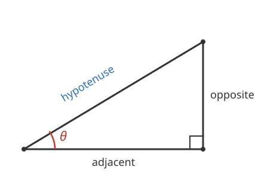

# Trigonometry · Lesson 1.1: The three ratios

> ⏱ ~15 min · Module 1: Right-triangle trigonometry · Builds on: nothing (course start) · Unlocks: 1.2 (finding angles & applications)

## Why this matters

You can't measure the height of a tree with a ruler, but you *can* stand back, measure how far you are and the angle you tilt your head — and the tree's height falls out. That trade, **one angle plus one length for every other length**, is the whole engine of surveying, navigation, and (later) the sine waves that model every oscillation in physics. It starts with a single observation about right triangles that you can carry the rest of the course.

## The idea

Fix an acute angle — say $30^\circ$ — and draw *any* right triangle that contains it. Now shrink it, blow it up, tilt it: as long as that $30^\circ$ angle is there and one corner is a right angle, **the ratios of the sides never change**. A triangle twice as big has sides twice as long, so side-over-side stays put. The angle alone pins down the shape, and the shape *is* the ratios.

So each angle owns three fixed numbers — three ratios of its sides. We name them **sine**, **cosine**, and **tangent**. Once you know the angle you know the ratios (from a calculator or the special-angle table), and one ratio plus one known side hands you a missing side by simple multiplication.

To even talk about "which side," you stand at the angle and look around. The **hypotenuse** is always the long side across from the right angle. The **opposite** side is the one across the triangle from *your* angle. The **adjacent** side is the remaining leg, the one you're leaning against (not the hypotenuse). Change which angle you stand at and "opposite"/"adjacent" swap — hypotenuse never moves.

## The formal version

For an acute angle $\theta$ in a right triangle, with sides named relative to $\theta$:

$$\sin\theta = \frac{\text{opposite}}{\text{hypotenuse}}, \qquad \cos\theta = \frac{\text{adjacent}}{\text{hypotenuse}}, \qquad \tan\theta = \frac{\text{opposite}}{\text{adjacent}}.$$

In words: sine is how much of the hypotenuse points *across* from the angle, cosine how much points *alongside* it, and tangent is the ratio of those two (a measure of steepness). The mnemonic packs all three:

$$\textbf{SOH · CAH · TOA} \;=\; \underbrace{\tfrac{O}{H}}_{\sin}\;\;\underbrace{\tfrac{A}{H}}_{\cos}\;\;\underbrace{\tfrac{O}{A}}_{\tan}.$$

Because dividing opposite-over-hypotenuse by adjacent-over-hypotenuse cancels the hypotenuse, $\tan\theta = \dfrac{\sin\theta}{\cos\theta}$ — tangent is not independent, it's the other two in disguise.

That these three numbers depend on $\theta$ *only* — not on the size of the triangle — is a **similar-triangles** fact from [`geometry`](../../geometry/syllabus.md): same angles ⇒ proportional sides ⇒ identical ratios. Trig is that theorem turned into a lookup table.

## Picture

Standing at $\theta$ (bottom-left): the far leg is **opposite**, the leg you rest on is **adjacent**, and the slanted side across from the right angle is the **hypotenuse**.

## Worked examples

**Example 1 (mechanical).** A right triangle has legs $3$ and $4$ and hypotenuse $5$. Let $\theta$ be the angle sitting between the side of length $4$ and the hypotenuse. Then, relative to $\theta$, the opposite side is $3$, the adjacent side is $4$, the hypotenuse is $5$:

$$\sin\theta = \tfrac{3}{5} = 0.6, \qquad \cos\theta = \tfrac{4}{5} = 0.8, \qquad \tan\theta = \tfrac{3}{4} = 0.75.$$

Check: $\tan\theta = \dfrac{\sin\theta}{\cos\theta} = \dfrac{0.6}{0.8} = 0.75$. ✓ Notice we never needed the *value* of $\theta$ in degrees — the sides gave the ratios directly.

**Example 2 (why you'd care).** You stand $50$ m from the base of a tower and measure the angle of elevation to its top as $32^\circ$. How tall is the tower?

Draw the right triangle: you at one corner, the tower's base and top forming the vertical leg. Relative to the $32^\circ$ angle, the tower's height is the **opposite** side and your $50$ m distance is the **adjacent** side. Opposite and adjacent ⇒ that's **tangent** (the T-O-A slot):

$$\tan 32^\circ = \frac{\text{height}}{50} \;\Longrightarrow\; \text{height} = 50\,\tan 32^\circ \approx 50 \times 0.6249 \approx 31.2 \text{ m}.$$

The recipe never changes: name the sides relative to your angle, pick the ratio that uses the two you care about, then solve. A ruler on the ground plus one angle just measured a tower you can't reach.

## Watch out

- You might think "opposite" and "adjacent" are fixed labels on the triangle — but they're **relative to the chosen angle**. Stand at the *other* acute angle and they swap; only the hypotenuse (across from the right angle) stays put.
- You might think sine and cosine can be any size — but for an acute angle a leg is always shorter than the hypotenuse, so $\sin\theta$ and $\cos\theta$ are always **between $0$ and $1$**. Tangent, being leg-over-leg, has no such ceiling and grows without bound as $\theta \to 90^\circ$. A "sine" of $1.4$ means you set up the ratio upside-down.
- You might think you can just add sides when a triangle scales — but ratios come from **division**. Doubling every side leaves $\sin\theta$ unchanged; that invariance is the entire point. Don't hunt for the "real" size; the angle already told you the ratio.

## One-liner

> An angle in a right triangle owns three fixed side-ratios — SOH-CAH-TOA — so one angle and one side unlock all the rest.

## Problems

**P1 (🟢)** In a right triangle the angle $\theta$ has opposite side $5$ and hypotenuse $13$ (so the adjacent side is $12$). Write $\sin\theta$, $\cos\theta$, and $\tan\theta$, and verify $\tan\theta = \sin\theta/\cos\theta$.

**P2 (🟡)** A ramp rises at $15^\circ$ from the ground and its sloped surface (the hypotenuse) is $6$ m long. How high off the ground is the top of the ramp, and how far horizontally does it reach? (Use $\sin 15^\circ \approx 0.2588$, $\cos 15^\circ \approx 0.9659$.)

**P3 (🔴, optional)** From the *same* right triangle, let $\alpha$ and $\beta$ be its two acute angles. Explain why $\sin\alpha = \cos\beta$, and state the relationship between $\alpha$ and $\beta$ that makes it true. (This is the "co" in cosine.)

Solutions

**P1** Relative to $\theta$: opposite $=5$, adjacent $=12$, hypotenuse $=13$.
$$\sin\theta = \tfrac{5}{13} \approx 0.385, \quad \cos\theta = \tfrac{12}{13} \approx 0.923, \quad \tan\theta = \tfrac{5}{12} \approx 0.417.$$
Check: $\dfrac{\sin\theta}{\cos\theta} = \dfrac{5/13}{12/13} = \dfrac{5}{12} = \tan\theta$. ✓ (The $13$s cancel — the hypotenuse always divides out of the quotient.)

**P2** The height is the **opposite** side to the $15^\circ$ angle, the horizontal reach is the **adjacent** side, and the $6$ m ramp is the **hypotenuse**.
$$\text{height} = 6\sin 15^\circ \approx 6 \times 0.2588 \approx 1.55 \text{ m},$$
$$\text{horizontal reach} = 6\cos 15^\circ \approx 6 \times 0.9659 \approx 5.80 \text{ m}.$$
Sanity check: $1.55^2 + 5.80^2 \approx 2.4 + 33.6 = 36 = 6^2$. ✓ The legs and hypotenuse close up.

**P3** In any triangle the angles sum to $180^\circ$; one of them is the right angle ($90^\circ$), so the two acute angles satisfy $\alpha + \beta = 90^\circ$ — they are **complementary**. Now stand at $\alpha$: the side *opposite* $\alpha$ is the very same side that is *adjacent* to $\beta$ (it's the leg between $\beta$ and the right angle). Dividing that shared side by the shared hypotenuse gives
$$\sin\alpha = \frac{\text{opp to }\alpha}{\text{hyp}} = \frac{\text{adj to }\beta}{\text{hyp}} = \cos\beta.$$
So $\sin\alpha = \cos(90^\circ - \alpha)$: cosine is literally the sine of the *complementary* angle — that's what "co-" means.

## Flashback

*(None — course start.)*

## Connections

- **Backward (geometry):** the whole setup rests on **similar triangles** from [`geometry`](../../geometry/syllabus.md) — equal angles force proportional sides, which is why a ratio can depend on the angle alone.
- **Forward (this course):** [Lesson 1.2](01-02-finding-angles-and-applications.md) runs the machine backward — given the *ratio*, the inverse functions ($\arcsin$, $\arccos$, $\arctan$) recover the **angle** — and applies it to elevation/depression problems. Then [Lesson 2.2](../lessons/02-02-the-unit-circle.md) frees sine and cosine from right triangles entirely, redefining them as coordinates on the unit circle so they work for *any* angle, not just acute ones.
- **Sideways (calculus):** let the angle run and $\sin\theta$ traces a wave — the sinusoids that become the working examples of periodic behavior in [`calc-refresher`](../../calc-refresher/syllabus.md).
