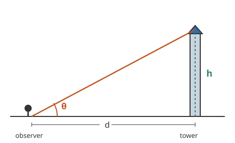

# Trigonometry · Lesson 1.2: Finding angles & applications

> ⏱ ~15 min · Module 1: Right-triangle trigonometry · Builds on: 1.1 (the three ratios) · Unlocks: 2.1 (radian measure)

## Why this matters

Lesson 1.1 ran the machine forward: *angle in, side out.* Real problems usually run it backward. A surveyor measures two lengths and wants the slope. A physicist knows a projectile's up-speed and across-speed and needs the launch angle. You stand on the ground, sight the top of a tower, and want its height. All of these are "I can measure the sides — now tell me the angle," and the tool that inverts the ratios is the same one your calculator labels $\sin^{-1}, \cos^{-1}, \tan^{-1}$.

## The idea

The three ratios are functions: feed in an angle, get out a number between $-1$ and $1$ (for sine/cosine) or any real number (for tangent). To go the other way, you *undo* them. If $\tan\theta = 0.5$, then $\theta = \arctan(0.5)$ — "the angle whose tangent is $0.5$." That's all $\arctan$ means: it answers "which angle produces this ratio?"

So the recipe for a missing angle is a mirror image of the recipe for a missing side. Pick the ratio built from the two sides you actually know, set it equal to that number, and hit the inverse:

$$\underbrace{\sin\theta = \tfrac{\text{opp}}{\text{hyp}}}_{\text{know two sides}} \;\Longrightarrow\; \theta = \arcsin\!\Big(\tfrac{\text{opp}}{\text{hyp}}\Big).$$

The one new twist in applications is naming the angle. When you look up at something, the **angle of elevation** is measured from the horizontal up to your line of sight. When you look down from a height, the **angle of depression** is measured from the horizontal down. That's it — every tower, cliff, and airplane problem is a right triangle wearing a story.

## The formal version

For a right triangle with acute angle $\theta$, the three inverse relations are

$$\theta = \arcsin\!\Big(\tfrac{\text{opp}}{\text{hyp}}\Big),\qquad \theta = \arccos\!\Big(\tfrac{\text{adj}}{\text{hyp}}\Big),\qquad \theta = \arctan\!\Big(\tfrac{\text{opp}}{\text{adj}}\Big).$$

In words: divide the two sides you know, then apply the matching inverse function to recover the angle. Notation: $\arcsin \equiv \sin^{-1}$, and likewise for the others — the "$-1$" is a *name*, not a reciprocal (so $\sin^{-1}x \ne 1/\sin x$).

**Angle of elevation / depression.** Let a horizontal reference line run through the observer's eye. The angle of elevation $\theta$ up to a point of height $h$ at horizontal distance $d$ satisfies

$$\tan\theta = \frac{h}{d}.$$

In words: the tangent of the look-up angle is (how high) over (how far). Because the observer's horizontal and the object's horizontal are parallel, the angle of depression *down* to a lower object equals the angle of elevation *up* from that object back to you — alternate interior angles are equal.

**Two observations, one height.** If you sight an object at elevation $\alpha$, walk a distance $d$ straight toward it, and sight it again at the larger elevation $\beta$, the height follows from two triangles sharing $h$:

$$h(\cot\alpha - \cot\beta) = d \quad\Longrightarrow\quad h = \frac{d}{\cot\alpha - \cot\beta}.$$

In words: the far angle and the near angle, plus the distance you walked, pin down a height you never stood under — no tape measure required.

## Picture

The dashed horizontal is the observer's eye level; the angle $\theta$ opens up to the line of sight; $h$ is the height and $d$ the horizontal distance, with $\tan\theta = h/d$.

## Worked examples

**Example 1 (mechanical).** A right triangle has legs $\text{opp} = 5$ and $\text{adj} = 12$ relative to angle $\theta$. Find $\theta$.

You know the two legs, so use tangent:

$$\tan\theta = \frac{5}{12} = 0.4167 \;\Longrightarrow\; \theta = \arctan(0.4167) \approx 22.6^\circ.$$

Check with a different pair: the hypotenuse is $\sqrt{5^2+12^2}=13$, so $\arcsin(5/13)=\arcsin(0.3846)\approx 22.6^\circ$ — same angle, as it must be.

**Example 2 (why you'd care — the two-observation trick).** You want the height of a tree across a river you can't cross. Standing at $A$, the angle of elevation to the top is $32^\circ$. You back up... no — you walk $40$ m straight *toward* the tree to point $B$, where the elevation is now $48^\circ$. How tall is the tree?

Let $h$ be the height and let $x$ be the horizontal distance from the near point $B$ to the base. From the two right triangles:

$$\tan 48^\circ = \frac{h}{x}, \qquad \tan 32^\circ = \frac{h}{x + 40}.$$

Solve each for the horizontal distance and use that walking $40$ m closed the gap:

$$\frac{h}{\tan 32^\circ} - \frac{h}{\tan 48^\circ} = 40 \;\Longrightarrow\; h(\cot 32^\circ - \cot 48^\circ) = 40.$$

Numerically $\cot 32^\circ = 1.600$ and $\cot 48^\circ = 0.900$, so

$$h = \frac{40}{1.600 - 0.900} = \frac{40}{0.700} \approx 57.2\ \text{m}.$$

You measured only two angles and one walking distance, yet recovered a height you could never reach. This is the skeleton of the balloon boss problem — and of real surveying.

## Watch out

- You might think $\sin^{-1}x$ means $1/\sin x$. It doesn't — it's the *inverse function* $\arcsin$. If you ever want the reciprocal, that's $\csc x$, a different animal entirely.
- You might think you can feed any number into $\arcsin$ or $\arccos$. Their inputs are trapped in $[-1, 1]$ (a sine or cosine can never exceed $1$). If your ratio comes out as $1.3$, you set up the triangle wrong — likely divided by the wrong side. Arctan, by contrast, accepts any real number.
- You might think the angle of depression is measured from the vertical, or that it differs from the elevation angle back up. It's measured from the **horizontal**, and by parallel lines it equals the elevation angle from the lower point — so you can always redraw a depression problem as an elevation one.
- Calculator trap: make sure it's in **degree mode** for these problems. A stray radian setting turns $\arctan(0.4167)$ into $0.395$ (radians) instead of $22.6^\circ$, and every answer downstream is silently wrong.

## One-liner

> To find an angle, divide the two sides you know and undo the ratio with arcsin/arccos/arctan — and every elevation problem is just $\tan(\text{look-up angle}) = \text{rise}/\text{run}$.

## Problems

**P1 (🟢)** A right triangle has the side opposite $\theta$ equal to $7$ and hypotenuse equal to $10$. Find $\theta$, then find the third angle of the triangle.

**P2 (🟡)** From the top of an $80$ m coastal cliff, the angle of depression to a small boat is $25^\circ$. How far is the boat from the base of the cliff (measured horizontally)?

**P3 (🔴, optional)** From point $A$ the angle of elevation to the top of a monument is $20^\circ$. You walk $50$ m straight toward it to point $B$, where the elevation is $35^\circ$. Find the monument's height.

Solutions

**P1** You know opposite and hypotenuse, so use sine: $\sin\theta = 7/10 = 0.7$, giving $\theta = \arcsin(0.7) \approx 44.4^\circ$. The three angles sum to $180^\circ$ and one is the right angle, so the third acute angle is $90^\circ - 44.4^\circ = 45.6^\circ$.

**P2** The angle of depression from the top equals the angle of elevation from the boat back up to you, so the boat, the cliff base, and the cliff top form a right triangle with the $80$ m as the side opposite the $25^\circ$ angle and the horizontal distance $d$ adjacent. Thus $\tan 25^\circ = 80/d$, so
$$d = \frac{80}{\tan 25^\circ} = \frac{80}{0.4663} \approx 171.6\ \text{m}.$$

**P3** Let $h$ be the height and $x$ the horizontal distance from $B$ to the base. Then $\tan 35^\circ = h/x$ and $\tan 20^\circ = h/(x+50)$, so
$$h(\cot 20^\circ - \cot 35^\circ) = 50.$$
With $\cot 20^\circ = 2.7475$ and $\cot 35^\circ = 1.4281$:
$$h = \frac{50}{2.7475 - 1.4281} = \frac{50}{1.3194} \approx 37.9\ \text{m}.$$

## Flashback

*(None — course start; flashbacks begin at Lesson 2.1.)*

## Connections

- **Backward:** this inverts the three ratios from [Lesson 1.1](01-01-the-three-ratios.md) — same triangle, same SOHCAHTOA, run in reverse to get the angle instead of the side.
- **Forward:** the two-observation setup is a right-triangle special case of the *law of sines* and *law of cosines* in [Lesson 4.1](04-01-law-of-sines.md) and [Lesson 4.2](04-02-law-of-cosines-and-capstone.md), which drop the right angle and solve *any* triangle — the natural home of surveying and navigation.
- **Sideways (physics):** a projectile launched with horizontal speed $v_x$ and vertical speed $v_y$ leaves at angle $\theta = \arctan(v_y/v_x)$ above the horizontal — the same inverse-tangent move, applied to a velocity triangle. In [`calc-refresher`](../../calc-refresher/syllabus.md) that launch angle becomes the input to the range and trajectory formulas you'll differentiate.
