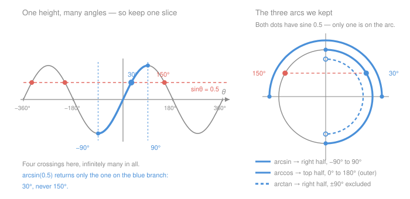

# Trigonometry · Lesson 1.3: Inverse trig & restricted ranges

> ⏱ ~15 min · Module 1: Right-triangle trigonometry · Builds on: [1.2 Finding angles & applications](01-02-finding-angles-and-applications.md) · Unlocks: 2.2 (the unit circle), 4.1 (law of sines)

## Why this matters

In [Lesson 1.2](01-02-finding-angles-and-applications.md) you pressed the inverse button and took whatever came out. That was safe only because every angle in a right triangle is acute. Cut the right angle loose — a surveyor's crooked triangle, a velocity pointing up and to the *left*, a pendulum swinging back — and the button starts lying to you. It never returns a wrong number; it returns *one* number when there were many, and it has a fixed, unbargainable policy about which one. Learn the policy and the ambiguous case of the [law of sines](04-01-law-of-sines.md) stops being a mystery and becomes a consequence.

## The idea

Sine is a machine that forgets. Feed it $30^\circ$ and it says $0.5$. Feed it $150^\circ$ and it says $0.5$ again. Feed it $390^\circ$, $510^\circ$, $-210^\circ$ — still $0.5$. Infinitely many angles collapse onto the same output, because a sine is a *height*, and a circle has two points at every height, forever repeating each turn.

Now try to build the undo machine. You hand it $0.5$ and it has to hand back an angle. **Which one?** There's no honest answer, because a function is only allowed one output per input. So the undo machine does not exist — not until we make it exist by force.

The fix is blunt and it is a **choice**, not a discovery: throw away most of sine's inputs. Keep one slice of angles on which sine hits every value in $[-1,1]$ exactly once, delete the rest, and *that* stub is invertible. The price is permanent: $\arcsin$ can only ever answer with an angle from the slice we kept. If the angle you actually wanted lives outside it, the function will not tell you — you have to know, and reconstruct it yourself.

Everything below is the answer to two questions: which slice did we keep, and how do you get back the angle you wanted.

## The formal version

For each function we pick a **principal range**: an interval on which the function is one-to-one (never repeats a value) and still sweeps its full set of outputs. Formally, $\arcsin x$ is defined as *the unique* $\theta$ in that interval with $\sin\theta = x$.

| Function | Accepts (domain) | Returns (principal range) | Why this slice |
|---|---|---|---|
| $\arcsin x$ | $-1 \le x \le 1$ | $-90^\circ \le \theta \le 90^\circ$, i.e. $[-\tfrac{\pi}{2},\tfrac{\pi}{2}]$ | sine climbs steadily from $-1$ to $1$ across it, hitting each value once — the shortest such run around $0$, and it contains all the acute angles |
| $\arccos x$ | $-1 \le x \le 1$ | $0^\circ \le \theta \le 180^\circ$, i.e. $[0,\pi]$ | cosine is *even*, $\cos(-\theta) = \cos\theta$, so $[-90^\circ,90^\circ]$ would double-count; the nearest run where cosine falls steadily from $1$ to $-1$ starts at $0^\circ$ |
| $\arctan x$ | any real $x$ | $-90^\circ < \theta < 90^\circ$, i.e. $(-\tfrac{\pi}{2},\tfrac{\pi}{2})$ | tangent races from $-\infty$ to $+\infty$ once across this branch; the ends are **open** because $\tan(\pm 90^\circ)$ doesn't exist |

In words: each inverse is a promise about *where its answer lives*, not just what its answer is. (Radian measure arrives in [Lesson 2.1](02-01-radian-measure.md); the bracket forms are here so this matches your [reference card](../reference.md#inverse-trig-domains-and-principal-ranges) and every calculus book you'll open later.)

The single most consequential line in that table: **$\arccos$ is the only one that can return an obtuse angle.** $\arcsin$ and $\arctan$ live entirely between $-90^\circ$ and $90^\circ$.

### Getting back the angle you wanted

The principal value is not useless when it's wrong — it hands you the **reference angle**, the acute angle to the horizontal, and the reference angle is the part that's genuinely determined by the number. What's *not* determined is the quadrant, and that has to come from the problem.

Two facts do all the work (both fall straight out of the circle's symmetry in [Lesson 2.2](02-02-the-unit-circle.md); the graph in the Picture below shows them):

$$\sin(180^\circ - \theta) = \sin\theta, \qquad \cos(-\theta) = \cos\theta, \qquad \tan(\theta + 180^\circ) = \tan\theta.$$

In words: sine can't tell an angle from its supplement, cosine can't tell an angle from its negative, and tangent can't tell an angle from its half-turn partner. So the complete solution sets are

$$\sin\theta = x \;\Rightarrow\; \theta = \theta_p \text{ or } 180^\circ - \theta_p \ (\pm\, 360^\circ k), \qquad \cos\theta = x \;\Rightarrow\; \theta = \pm\theta_p \ (\pm\, 360^\circ k), \qquad \tan\theta = x \;\Rightarrow\; \theta = \theta_p + 180^\circ k,$$

where $\theta_p$ is the principal value and $k$ is any whole number. **The recipe:** compute $\theta_p$, take its reference angle $\theta' = \lvert\theta_p\rvert$ (or $180^\circ - \theta_p$ if $\theta_p$ is obtuse), decide the quadrant *from the picture, not the algebra*, then rebuild: $\theta'$ in Q1, $180^\circ - \theta'$ in Q2, $180^\circ + \theta'$ in Q3, $360^\circ - \theta'$ in Q4.

### The two-argument arctangent

Direction problems hit this constantly, so there's a standard patch. To find the direction of a vector with components $(x, y)$ you'd write $\theta = \arctan(y/x)$ — but the *division destroys the evidence*: $\tfrac{4}{-3}$ and $\tfrac{-4}{3}$ are the same number, so Q2 and Q4 arrive indistinguishable. The two-argument version $\operatorname{atan2}(y, x)$ keeps the two signs separate and returns the true direction in $(-180^\circ, 180^\circ]$:

$$\operatorname{atan2}(y,x) = \arctan\!\Big(\frac{y}{x}\Big) + \begin{cases} 0 & x > 0\\ 180^\circ & x < 0,\ y \ge 0\\ -180^\circ & x < 0,\ y < 0\end{cases}$$

In words: run ordinary arctan, then add a half turn if you're actually pointing left. Every graphics library, robotics stack, and physics code you will ever touch uses `atan2` and not `atan` for exactly this reason.

## Picture

On the left, the horizontal line $\sin\theta = 0.5$ slices the curve in infinitely many places; the thick branch is the piece we kept, and it contains exactly one of them. On the right, the same three choices as arcs: $\arcsin$ owns the right half of the circle, $\arccos$ the top half, $\arctan$ the right half minus its two endpoints. Notice $\arccos$'s arc reaches into the second quadrant — obtuse territory — and $\arcsin$'s never does.

## Worked examples

**Example 1 (mechanical).** Evaluate $\arcsin(-\tfrac12)$, $\arccos(-\tfrac12)$, and $\arctan(-\sqrt3)$ exactly.

All three inputs point at the same reference angle, since $\sin 30^\circ = \tfrac12$, $\cos 60^\circ = \tfrac12$, and $\tan 60^\circ = \sqrt3$. The ranges then decide the answers:

- $\arcsin(-\tfrac12)$: must land in $[-90^\circ, 90^\circ]$, and sine is negative there only for negative angles, so $\theta = -30^\circ = -\tfrac{\pi}{6}$.
- $\arccos(-\tfrac12)$: must land in $[0^\circ, 180^\circ]$, and cosine is negative there only past $90^\circ$, so $\theta = 180^\circ - 60^\circ = 120^\circ = \tfrac{2\pi}{3}$.
- $\arctan(-\sqrt3)$: must land in $(-90^\circ, 90^\circ)$, so $\theta = -60^\circ = -\tfrac{\pi}{3}$.

Same "$-$" sign in all three inputs, three different destinations: $\arcsin$ and $\arctan$ go *below* the axis, $\arccos$ goes *past* $90^\circ$. That is the whole personality difference.

**Example 2 (why you'd care — the same triangle angle, found two ways).** A triangle has sides $a = 5$, $b = 6$, $c = 9$. Find angle $C$ (opposite the longest side, $c$).

*Route 1 — via $\arccos$.* The [law of cosines](../reference.md#law-of-cosines) rearranges to $\cos C = \dfrac{a^2 + b^2 - c^2}{2ab}$:

$$\cos C = \frac{25 + 36 - 81}{2(5)(6)} = \frac{-20}{60} = -0.3333 \;\Longrightarrow\; C = \arccos(-0.3333) = 109.5^\circ.$$

*Route 2 — via $\arcsin$.* First get $A$ the same way: $\cos A = \dfrac{36 + 81 - 25}{2(6)(9)} = \dfrac{92}{108} = 0.8519$, so $A = 31.6^\circ$ and $\sin A = 0.5239$. Now the law of sines, $\dfrac{c}{\sin C} = \dfrac{a}{\sin A}$:

$$\sin C = \frac{c\sin A}{a} = \frac{9(0.5239)}{5} = 0.9431 \;\Longrightarrow\; \arcsin(0.9431) = 70.5^\circ.$$

But $70.5^\circ$ **cannot** be right: $C$ sits opposite the longest side, so it must be the largest angle, and $70.5^\circ + 31.6^\circ$ leaves $77.9^\circ$ for $B$ — bigger than $C$. The arithmetic is flawless; the *range* is the problem. $\arcsin$ was structurally incapable of saying $109.5^\circ$, so it returned the supplement, $180^\circ - 109.5^\circ = 70.5^\circ$, which has the identical sine.

That is the entire content of two later lessons in one line: [4.2](04-02-law-of-cosines-and-capstone.md) tells you to hunt big angles with the law of cosines *because* $\arccos$ can report obtuse, and [4.1](04-01-law-of-sines.md)'s ambiguous SSA case exists *because* $\arcsin$ can't.

## Watch out

- **You might think $\arcsin(\sin\theta) = \theta$ always.** It doesn't: $\arcsin(\sin 150^\circ) = \arcsin(0.5) = 30^\circ$. The round trip returns $\theta$ **only when $\theta$ already lives in the principal range** — otherwise it returns the range's stand-in for $\theta$. The other order is always safe: $\sin(\arcsin x) = x$ for every legal $x$, because you start inside the range. Same story for $\arccos(\cos(-60^\circ)) = 60^\circ$ and $\arctan(\tan 200^\circ) = 20^\circ$.
- **You might think a negative output means you made a mistake.** $\arcsin(-0.4) = -23.6^\circ$ is a perfectly good angle — it just points below the horizontal. But *inside a triangle* it is a red flag, since triangle angles run from $0^\circ$ to $180^\circ$: a negative principal value there means you fed in a wrongly-signed ratio.
- **You might think $\arctan(y/x)$ gives a vector's direction.** It gives the direction *or its opposite*, because dividing throws away which of $x$ and $y$ carried the minus sign. Check the quadrant yourself, or use $\operatorname{atan2}(y,x)$.
- **The calculator isn't wrong, it's under-informed.** It sees a ratio and nothing else. The quadrant lives in your diagram, never in the number.

## One-liner

> A periodic function can't be undone, so we amputate it down to one branch — and the principal range is the receipt: $\arcsin$ and $\arctan$ promise an answer between $\pm 90^\circ$, $\arccos$ promises one between $0^\circ$ and $180^\circ$, and any other angle you needed is yours to rebuild from the quadrant.

## Problems

**P1 (🟢)** Evaluate exactly, in degrees and radians, without a calculator:
(a) $\arccos\!\big(-\tfrac{\sqrt3}{2}\big)$ (b) $\arcsin\!\big(-\tfrac{\sqrt2}{2}\big)$ (c) $\arctan(\sqrt3)$ (d) $\arcsin(\sin 140^\circ)$.

**P2 (🟡)** A particle's velocity has components $v_x = -6$ m/s and $v_y = 8$ m/s. Compute $\arctan(v_y/v_x)$, explain why it can't be the direction of motion, and give the true direction measured counterclockwise from the positive $x$-axis.

**P3 (🔴, optional)** Prove that $\arcsin x + \arccos x = 90^\circ$ for every $x$ in $[-1,1]$, and say which step of your proof would break if $\arccos$ had been given the range $[-90^\circ, 90^\circ]$ instead.

Solutions

**P1**

(a) $\cos 30^\circ = \tfrac{\sqrt3}{2}$, so the reference angle is $30^\circ$. The output must lie in $[0^\circ,180^\circ]$ and the input is negative, so we need the second-quadrant partner: $180^\circ - 30^\circ = \mathbf{150^\circ} = \tfrac{5\pi}{6}$.

(b) $\sin 45^\circ = \tfrac{\sqrt2}{2}$, reference angle $45^\circ$. The output must lie in $[-90^\circ,90^\circ]$ and the input is negative, so $\mathbf{-45^\circ} = -\tfrac{\pi}{4}$.

(c) $\tan 60^\circ = \sqrt3$, and $60^\circ$ is already inside $(-90^\circ,90^\circ)$, so $\mathbf{60^\circ} = \tfrac{\pi}{3}$.

(d) Don't compute the sine numerically — use the supplement rule: $\sin 140^\circ = \sin(180^\circ - 140^\circ) = \sin 40^\circ$. Now $\arcsin(\sin 40^\circ) = \mathbf{40^\circ} = \tfrac{2\pi}{9}$, because $40^\circ$ *is* in the principal range and $140^\circ$ isn't. The round trip moved the angle.

**P2** The ratio is $\dfrac{v_y}{v_x} = \dfrac{8}{-6} = -1.3333$, so
$$\arctan(-1.3333) = -53.1^\circ.$$
That can't be the direction: $-53.1^\circ$ points down and to the right (fourth quadrant), but the particle has $v_x < 0$ and $v_y > 0$ — up and to the **left**, the second quadrant. Arctan's range $(-90^\circ, 90^\circ)$ covers only the right half of the plane, so it could never have produced a second-quadrant answer.

Rebuild it: the reference angle is $\lvert -53.1^\circ\rvert = 53.1^\circ$, and in Q2 the angle is $180^\circ - 53.1^\circ = \mathbf{126.9^\circ}$. (Check: $10\cos 126.9^\circ = -6.0$ and $10\sin 126.9^\circ = 8.0$, with speed $\sqrt{6^2+8^2} = 10$ m/s. ✓) Equivalently, $\operatorname{atan2}(8, -6) = -53.1^\circ + 180^\circ = 126.9^\circ$.

**P3** Let $\theta = \arcsin x$, so $\sin\theta = x$ and $-90^\circ \le \theta \le 90^\circ$. By the cofunction identity, $\cos(90^\circ - \theta) = \sin\theta = x$. So $90^\circ - \theta$ is *an* angle whose cosine is $x$ — but to conclude it is **the** one $\arccos$ returns, it must lie in $\arccos$'s range. Check: subtracting the inequality $-90^\circ \le \theta \le 90^\circ$ from $90^\circ$ flips it to
$$0^\circ \le 90^\circ - \theta \le 180^\circ,$$
which is exactly $[0^\circ, 180^\circ]$. Therefore $\arccos x = 90^\circ - \theta = 90^\circ - \arcsin x$, i.e. $\arcsin x + \arccos x = 90^\circ$. ∎

The step that breaks: with a range of $[-90^\circ, 90^\circ]$ for $\arccos$, the containment check fails — for $x = -\tfrac12$ we'd get $\theta = -30^\circ$ and $90^\circ - \theta = 120^\circ$, which is outside the supposed range, so it wouldn't be the returned value. (It fails for a deeper reason too: cosine isn't one-to-one on $[-90^\circ,90^\circ]$, so that "$\arccos$" isn't a function at all. The ranges aren't arbitrary — they're the ones that make the identity, and everything downstream, come out clean.)

## Flashback

**From Lesson 1.2 (Finding angles & applications):** From a lighthouse window $24$ m above sea level, the angle of depression to a buoy is $12^\circ$. How far is the buoy from the base of the lighthouse, measured horizontally?

Solution

The angle of depression down to the buoy equals the angle of elevation from the buoy back up to the window (alternate interior angles across the two parallel horizontals). So in the right triangle with the $24$ m height opposite the $12^\circ$ angle and the horizontal distance $d$ adjacent:

$$\tan 12^\circ = \frac{24}{d} \;\Longrightarrow\; d = \frac{24}{\tan 12^\circ} = \frac{24}{0.2126} \approx 112.9\ \text{m}.$$

Sanity check: a shallow $12^\circ$ sight line should reach far out, and $113$ m is about $4.7$ times the height — right for a shallow angle.

## Connections

- **Backward:** this is the fine print on [Lesson 1.2](01-02-finding-angles-and-applications.md). There, every angle was acute and the principal value was always the one you wanted — which is precisely why the restriction was invisible.
- **Forward:** [Lesson 2.2](02-02-the-unit-circle.md) proves the symmetries quoted here ($\sin(180^\circ-\theta) = \sin\theta$ and friends) from the circle, and [Lesson 3.1](03-01-graphing-sinusoids.md) draws the full periodic graphs that make the many-to-one problem visible at a glance. Then [4.1](04-01-law-of-sines.md) and [4.2](04-02-law-of-cosines-and-capstone.md) cash it in: the SSA ambiguous case *is* $\arcsin$'s range, and "find the big angle with the law of cosines" *is* $\arccos$'s.
- **Sideways (functions):** restricting a domain to manufacture an inverse is a general move, not a trig quirk — the same surgery makes $\sqrt{x}$ the inverse of $x^2$. It's set up properly in [precalculus 1.2](../../precalculus/lessons/01-02-composition-and-inverses.md).
- **Sideways (physics & code):** phase angles, vector directions, and bearings are all "recover the angle from a ratio" problems, and every one of them is an `atan2` in disguise. A projectile launched with $v_x < 0$ has launch angle $\operatorname{atan2}(v_y, v_x)$, not $\arctan(v_y/v_x)$ — the same trap, with a sign error in your trajectory as the prize.
