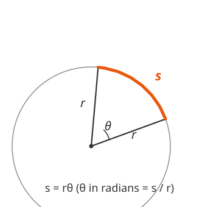

# Trigonometry · Lesson 2.1: Radian measure

> ⏱ ~15 min · Module 2: Angles & the unit circle · Builds on: 1.1 (the three ratios) · Unlocks: 2.2 (the unit circle)

## Why this matters

Degrees are a human convention — 360 is an accident of Babylonian astronomy, not anything the circle itself knows about. The moment you leave triangles and start letting angles *spin* — a wheel rolling, a planet orbiting, a sine wave running in time — you need an angle unit tied to the geometry itself. That unit is the radian, and it's what makes arc length, rotational speed, and (later) the derivatives of $\sin$ and $\cos$ come out clean instead of littered with conversion factors. Every formula in the rest of this course, and in mechanics and calculus after it, assumes radians.

## The idea

Wrap the radius around the rim of its own circle. The angle you sweep out doing that — one radius-length of arc — is **one radian**. So a radian is just an *odometer reading in units of radii*: "how many radius-lengths of arc have I traced?"

That makes an angle in radians a pure number — arc divided by radius, a length over a length, no units left. A full trip around is a circumference, $2\pi r$, which is $2\pi$ radius-lengths, so a full circle is $2\pi$ radians. Half a circle is $\pi$. This is why $\pi$ shows up everywhere the instant you go radian: it's literally counting how many radii fit around a semicircle.

The payoff: because the angle *is* the arc-to-radius ratio, "how long is the arc?" stops being a proportion problem and becomes one multiplication.

## The formal version

For a central angle in a circle of radius $r$ that subtends (cuts off) an arc of length $s$:

$$\theta = \frac{s}{r} \quad\text{(radians)}, \qquad\text{equivalently}\qquad s = r\theta.$$

In words: the angle in radians is the arc length measured in radii; multiply back by $r$ to recover the arc. Here $s$ and $r$ carry the same length unit, so $\theta$ is dimensionless.

**Conversion.** A straight angle is half a turn, so

$$180^\circ = \pi \text{ rad}.$$

In words: to go from degrees to radians multiply by $\dfrac{\pi}{180^\circ}$; to go back multiply by $\dfrac{180^\circ}{\pi}$. (Both are just "$\times 1$" written as $\frac{\pi}{180^\circ}$ or its reciprocal.)

**Sector area.** A sector is the pie-slice fraction $\dfrac{\theta}{2\pi}$ of the whole disk $\pi r^2$:

$$A = \frac{\theta}{2\pi}\,\pi r^2 = \tfrac12 r^2\theta \quad(\theta\text{ in radians}).$$

In words: area of a slice is half radius-squared times the angle.

**Angular vs. linear speed.** If the angle grows at rate $\omega = \dfrac{\theta}{t}$ (radians per second — the **angular speed**), then a point at radius $r$ traces arc at rate

$$v = \frac{s}{t} = \frac{r\theta}{t} = r\omega.$$

In words: spin rate times radius gives the actual speed of the rim. Same $\omega$, bigger $r$, faster the point flies — which is why the outer edge of a merry-go-round moves faster than the middle.

## Picture

The angle $\theta$ opens between two radii; the orange arc $s$ is what it cuts from the rim. Stretch $\theta$ until the orange arc is exactly as long as one radius — that opening is one radian ($\approx 57.3^\circ$).

## Worked examples

**Example 1 (mechanical — convert both directions).**

Degrees → radians: $135^\circ = 135 \cdot \dfrac{\pi}{180} = \dfrac{135}{180}\pi = \dfrac{3\pi}{4}$ rad.

Radians → degrees: $\dfrac{7\pi}{6}\text{ rad} = \dfrac{7\pi}{6}\cdot\dfrac{180^\circ}{\pi} = \dfrac{7\cdot 180^\circ}{6} = 210^\circ.$

Notice the $\pi$ cancels going back to degrees — a good sign you multiplied by the right factor. If a "radian" answer still has a lone $\pi$ floating in it, you're in radians; degree answers are plain numbers.

**Example 2 (why you'd care — a rolling wheel).**

A wheel of radius $0.30$ m rolls without slipping and turns through $150^\circ$. How far does it travel?

Rolling without slipping means the ground distance *equals* the arc that unrolls, so the answer is just $s = r\theta$ — but only if $\theta$ is in radians. Convert first:

$$\theta = 150^\circ \cdot \frac{\pi}{180} = \frac{5\pi}{6}\text{ rad}\approx 2.618.$$

$$s = r\theta = 0.30 \cdot \frac{5\pi}{6} = \frac{\pi}{4} \approx 0.785\ \text{m}.$$

Had you plugged in $150$ (degrees) you'd have gotten $45$ m — off by a factor of $57$. The formula $s = r\theta$ is *defined* in radians; that's the whole reason radians earn their keep.

## Watch out

- You might think you can drop $150^\circ$ straight into $s = r\theta$. **You can't** — $s = r\theta$ and $A = \tfrac12 r^2\theta$ are radian-only formulas. Convert to radians *before* touching them, every time.
- You might think a radian is some exotic unit like a degree. It's really **no unit at all** — a ratio of two lengths. That's why "rad" quietly appears and disappears: $v = r\omega$ turns rad/s into m/s because the "radian" was never a real dimension.
- You might read "rev," "rpm," or "Hz" as ready to use. They're **turns**, not radians: one revolution $= 2\pi$ rad. Multiply revolutions by $2\pi$ before any $s=r\theta$ or $v=r\omega$ step.

## One-liner

> A radian counts arc length in radius-lengths, so $\theta = s/r$ — which turns "how long is the arc?" and "how fast is the rim moving?" into a single multiplication.

## Problems

**P1 (🟢)** Convert $225^\circ$ to radians, and convert $\dfrac{5\pi}{9}$ rad to degrees.

**P2 (🟡)** A circular sector has radius $8$ cm and central angle $40^\circ$. Find its arc length and its area.

**P3 (🔴)** A bicycle wheel of radius $0.34$ m spins at $120$ revolutions per minute. Find its angular speed $\omega$ in rad/s, and the bike's forward (linear) speed in m/s. *(This is the same $v = r\omega$ that governs rotational motion in `mechanics-refresher`.)*

Solutions

**P1** Degrees → radians: $225^\circ \cdot \dfrac{\pi}{180} = \dfrac{225}{180}\pi = \dfrac{5\pi}{4}$ rad.
Radians → degrees: $\dfrac{5\pi}{9}\cdot\dfrac{180^\circ}{\pi} = \dfrac{5\cdot 180^\circ}{9} = 100^\circ.$

**P2** First convert: $\theta = 40^\circ\cdot\dfrac{\pi}{180} = \dfrac{2\pi}{9}\text{ rad}\approx 0.6981.$
Arc length: $s = r\theta = 8\cdot\dfrac{2\pi}{9} = \dfrac{16\pi}{9}\approx 5.59\ \text{cm}.$
Area: $A = \tfrac12 r^2\theta = \tfrac12\cdot 64\cdot\dfrac{2\pi}{9} = \dfrac{64\pi}{9}\approx 22.3\ \text{cm}^2.$

**P3** Convert the spin rate to rad/s. $120$ rev/min $= \dfrac{120}{60} = 2$ rev/s, and each revolution is $2\pi$ rad, so
$$\omega = 2 \cdot 2\pi = 4\pi \approx 12.6\ \text{rad/s}.$$
Linear (rim, and since it rolls without slipping, ground) speed:
$$v = r\omega = 0.34 \cdot 4\pi = 1.36\pi \approx 4.27\ \text{m/s}.$$
The "rad" vanishes from rad/s $\times$ m to leave m/s — because a radian was never a genuine unit.

## Flashback

**From Lesson 1.1 (The three ratios):** In a right triangle, one acute angle measures $28^\circ$ and the side *adjacent* to it has length $15$. Find the hypotenuse.

Solution

The adjacent side and hypotenuse are the "A" and "H" of SOH-**CAH**-TOA, so use cosine:
$$\cos 28^\circ = \frac{\text{adjacent}}{\text{hypotenuse}} = \frac{15}{h} \;\Rightarrow\; h = \frac{15}{\cos 28^\circ} = \frac{15}{0.8829} \approx 17.0.$$

## Connections

- **Backward:** Lesson 1.1's ratios were about a triangle's *shape*; radians are about an angle's *size as arc*. They meet in 2.2, where the angle is a rotation and the ratios become coordinates.
- **Forward:** Lesson 2.2 (the unit circle) sets $r = 1$, so $s = r\theta$ collapses to $s = \theta$ — the arc length *is* the angle, which is exactly why the unit circle is built in radians.
- **Sideways (calculus):** In `calc-refresher`, $\frac{d}{dx}\sin x = \cos x$ holds *only* in radians (in degrees an ugly factor of $\pi/180$ tags along). The clean small-angle fact $\sin\theta \approx \theta$ is radian-only too — it's just $s \approx$ straight-line chord for tiny arcs.
- **Sideways (physics):** $\omega$ and $v = r\omega$ here are the same angular and linear speeds that drive rotational motion in `mechanics-refresher`; P3's rolling wheel is your first taste.
