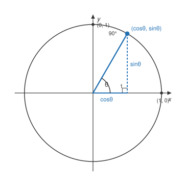

# Trigonometry · Lesson 2.2: The unit circle

> ⏱ ~15 min · Module 2: Angles & the unit circle · Builds on: 2.1 (radian measure) · Unlocks: 3.1 (graphing sinusoids)

## Why this matters

Right-triangle trig can only talk about angles between $0^\circ$ and $90^\circ$ — there's no such thing as a $210^\circ$ triangle. But physics is full of rotations that keep going: a wheel at $720^\circ$, a pendulum swinging to $-30^\circ$, an AC voltage cycling forever. The unit circle rebuilds sine and cosine so they accept *any* angle — positive, negative, or many turns round — and that single move is what lets trig become the language of waves in Lesson 3.1 and the complex exponential later on.

## The idea

Draw a circle of radius $1$ centered at the origin. Start at the point $(1,0)$ on the right and walk counterclockwise around the rim by an angle $\theta$. Wherever you land, that point has an $x$-coordinate and a $y$-coordinate — and **those two coordinates *are* the cosine and sine of $\theta$**:

$$\cos\theta = x\text{-coordinate}, \qquad \sin\theta = y\text{-coordinate}.$$

That's the whole definition. No triangle required. For angles in the first quadrant this agrees exactly with SOHCAHTOA (the radius is the hypotenuse of length $1$, so "adjacent over hypotenuse" is just the horizontal coordinate). But now nothing stops $\theta$ from being $150^\circ$, or $-40^\circ$, or $400^\circ$ — you just keep walking, and every landing spot still has coordinates. Sine and cosine are now defined everywhere.

Two immediate payoffs. First, **periodicity**: going one full lap ($360^\circ$) lands you back where you started, so $\cos(\theta + 360^\circ) = \cos\theta$ and likewise for sine — the functions repeat. Second, **you never need new numbers**: any angle's coordinates match those of a nearby first-quadrant angle up to a sign, so the five values you memorize cover all of them.

## The formal version

For a real angle $\theta$, let $P = (x, y)$ be the point reached by rotating the point $(1,0)$ counterclockwise through $\theta$ on the unit circle $x^2 + y^2 = 1$. Then

$$\cos\theta = x, \quad \sin\theta = y, \quad \tan\theta = \frac{y}{x}\ (x \neq 0),$$

with the reciprocals $\sec\theta = \tfrac{1}{x}$, $\csc\theta = \tfrac{1}{y}$, $\cot\theta = \tfrac{x}{y}$.

**In words:** the six trig functions are just the coordinates of a point on the circle and their ratios and reciprocals.

Three tools make evaluation mechanical:

- **Reference angle** $\theta'$: the *acute* angle between the terminal side and the $x$-axis. Its trig values are the special-angle values you know; the actual angle only differs by a sign. Compute it by measuring to the nearest horizontal direction: $\theta' = 180^\circ - \theta$ in Q2, $\theta - 180^\circ$ in Q3, $360^\circ - \theta$ in Q4.
- **Quadrant signs (ASTC):** which functions are positive depends only on the signs of $x$ and $y$. Reading counterclockwise from Q1: **A**ll positive, then **S**ine (Q2), **T**angent (Q3), **C**osine (Q4). Mnemonic: *All Students Take Calculus.*
- **The special-angle table** (memorize the first two rows; everything else is signs and reciprocals):

| $\theta$ | $0^\circ$ | $30^\circ$ | $45^\circ$ | $60^\circ$ | $90^\circ$ |
|---|---|---|---|---|---|
| rad | $0$ | $\tfrac{\pi}{6}$ | $\tfrac{\pi}{4}$ | $\tfrac{\pi}{3}$ | $\tfrac{\pi}{2}$ |
| $\sin$ | $0$ | $\tfrac12$ | $\tfrac{\sqrt2}{2}$ | $\tfrac{\sqrt3}{2}$ | $1$ |
| $\cos$ | $1$ | $\tfrac{\sqrt3}{2}$ | $\tfrac{\sqrt2}{2}$ | $\tfrac12$ | $0$ |
| $\tan$ | $0$ | $\tfrac{1}{\sqrt3}$ | $1$ | $\sqrt3$ | undef. |
| $\csc$ | undef. | $2$ | $\sqrt2$ | $\tfrac{2}{\sqrt3}$ | $1$ |
| $\sec$ | $1$ | $\tfrac{2}{\sqrt3}$ | $\sqrt2$ | $2$ | undef. |
| $\cot$ | undef. | $\sqrt3$ | $1$ | $\tfrac{1}{\sqrt3}$ | $0$ |

Notice the sine row runs $\tfrac{\sqrt0}{2}, \tfrac{\sqrt1}{2}, \tfrac{\sqrt2}{2}, \tfrac{\sqrt3}{2}, \tfrac{\sqrt4}{2}$ — a $\sqrt{0,1,2,3,4}$ ladder — and cosine is the same ladder reversed. That's the only pattern you truly need to store.

## Picture

The blue radius is the hypotenuse of length $1$. Drop a perpendicular from the point to the $x$-axis and you get a right triangle whose horizontal leg is $\cos\theta$ and vertical leg is $\sin\theta$. Because that triangle lives inside the circle $x^2+y^2=1$, its legs satisfy $\cos^2\theta + \sin^2\theta = 1$ — the Pythagorean theorem in disguise.

## Worked examples

**Example 1 (mechanical).** Evaluate $\sin 210^\circ$ and $\cos 210^\circ$.

$210^\circ$ is $30^\circ$ past $180^\circ$, so it lands in **Quadrant 3**. The reference angle is $\theta' = 210^\circ - 180^\circ = 30^\circ$, giving base values $\sin 30^\circ = \tfrac12$ and $\cos 30^\circ = \tfrac{\sqrt3}{2}$. In Q3 only tangent is positive (ASTC: **T**), so both sine and cosine are negative:

$$\sin 210^\circ = -\tfrac12, \qquad \cos 210^\circ = -\tfrac{\sqrt3}{2}.$$

The point on the circle is $\left(-\tfrac{\sqrt3}{2}, -\tfrac12\right)$ — both coordinates negative, exactly as a Q3 point should be.

**Example 2 (why you'd care).** A point on a spinning disk starts at angle $60^\circ$ and the disk rotates a further $-450^\circ$ (i.e. $450^\circ$ clockwise). Where does it end up, and what is its height ($y$-coordinate)?

Add the rotations: $60^\circ + (-450^\circ) = -390^\circ$. Now use periodicity to land in $[0^\circ, 360^\circ)$ by adding $360^\circ$: $-390^\circ + 360^\circ = -30^\circ$, and once more $-30^\circ + 360^\circ = 330^\circ$. So the final position is the same as $330^\circ$, in **Quadrant 4**, reference angle $360^\circ - 330^\circ = 30^\circ$. In Q4 cosine is positive, sine negative:

$$\text{height} = \sin 330^\circ = -\sin 30^\circ = -\tfrac12.$$

The takeaway: *any* pile of rotations — clockwise, multiple turns — collapses to one of your five reference values plus a sign. This is precisely the "reduce mod $360^\circ$" reflex that makes waves tractable next module.

## Watch out

- **You might think a reference angle is measured from the nearest axis of any kind — but it's always measured to the *horizontal* ($x$) axis.** For $120^\circ$ the reference angle is $180^\circ - 120^\circ = 60^\circ$, not $30^\circ$. Measuring to the wrong axis silently swaps sine and cosine.
- **You might think the sign comes from the reference angle — it comes from the quadrant.** Always evaluate the base value first (always positive, from the table), then attach the sign ASTC demands. Two separate steps.
- **You might think $\sin$ and $\cos$ can exceed $1$ — they can't.** They're coordinates on a radius-$1$ circle, so $-1 \le \sin\theta \le 1$ and likewise for cosine. If an answer gives $\sin\theta = 1.4$, something is wrong. (Tangent and secant, being ratios/reciprocals, *are* unbounded.)

## One-liner

> Sine and cosine are just the $y$- and $x$-coordinates of a point walked around a circle of radius one — so every angle, however large or negative, reduces to a reference angle and a quadrant sign.

## Problems

**P1 (🟢)** Evaluate exactly, using reference angles and ASTC: (a) $\cos 135^\circ$, (b) $\sin 300^\circ$, (c) $\tan 225^\circ$.

**P2 (🟡)** Find all angles $\theta$ in $[0^\circ, 360^\circ)$ with $\sin\theta = -\tfrac{\sqrt3}{2}$. Then give the exact $(\cos\theta, \sin\theta)$ coordinates of each.

**P3 (🔴, optional)** The point $\left(-\tfrac{3}{5}, y\right)$ lies on the unit circle in Quadrant 3 and is the terminal point for some angle $\theta$. Find $y$, then $\tan\theta$ and $\sec\theta$. (No special-angle table needed — use $x^2+y^2=1$ and the definitions directly.)

Solutions

**P1**
(a) $135^\circ$ is in Q2, reference angle $180^\circ - 135^\circ = 45^\circ$; base $\cos 45^\circ = \tfrac{\sqrt2}{2}$; in Q2 cosine is negative (**S** only positive), so $\cos 135^\circ = -\tfrac{\sqrt2}{2}$.
(b) $300^\circ$ is in Q4, reference angle $360^\circ - 300^\circ = 60^\circ$; base $\sin 60^\circ = \tfrac{\sqrt3}{2}$; in Q4 sine is negative, so $\sin 300^\circ = -\tfrac{\sqrt3}{2}$.
(c) $225^\circ$ is in Q3, reference angle $225^\circ - 180^\circ = 45^\circ$; base $\tan 45^\circ = 1$; in Q3 tangent is positive (**T**), so $\tan 225^\circ = 1$.

**P2** $\sin\theta = -\tfrac{\sqrt3}{2}$ has base value $\tfrac{\sqrt3}{2}$ (reference angle $60^\circ$) and is negative, so $\theta$ lies where sine is negative: **Q3 and Q4**.
Q3: $\theta = 180^\circ + 60^\circ = 240^\circ$. Q4: $\theta = 360^\circ - 60^\circ = 300^\circ$.
Coordinates: at $240^\circ$ (Q3, both negative) $\left(-\tfrac12, -\tfrac{\sqrt3}{2}\right)$; at $300^\circ$ (Q4, $\cos>0$) $\left(\tfrac12, -\tfrac{\sqrt3}{2}\right)$.

**P3** On the unit circle $x^2 + y^2 = 1$, so $y^2 = 1 - \left(-\tfrac35\right)^2 = 1 - \tfrac{9}{25} = \tfrac{16}{25}$, giving $y = \pm\tfrac45$. In Q3 the $y$-coordinate is negative, so $y = -\tfrac45$.
Then $\cos\theta = -\tfrac35$ and $\sin\theta = -\tfrac45$, so
$$\tan\theta = \frac{\sin\theta}{\cos\theta} = \frac{-4/5}{-3/5} = \frac43, \qquad \sec\theta = \frac{1}{\cos\theta} = -\frac53.$$
Tangent is positive (Q3 ✓) and secant negative (cosine negative ✓).

## Flashback

**From Lesson 2.1 (Radian measure):** A carousel of radius $4$ m completes one full rotation every $8$ seconds. (a) What is its angular speed $\omega$ in radians per second? (b) How far (arc length) does a rider on the rim travel in $3$ seconds? (c) What is the rider's linear speed?

Solution

(a) One rotation is $2\pi$ radians in $8$ s, so $\omega = \dfrac{2\pi}{8} = \dfrac{\pi}{4}$ rad/s $\approx 0.785$ rad/s.
(b) In $3$ s the carousel sweeps $\theta = \omega t = \tfrac{\pi}{4}\cdot 3 = \tfrac{3\pi}{4}$ rad. Arc length $s = r\theta = 4 \cdot \tfrac{3\pi}{4} = 3\pi \approx 9.42$ m.
(c) Linear speed $v = r\omega = 4 \cdot \tfrac{\pi}{4} = \pi \approx 3.14$ m/s. (Check: $s = vt = \pi \cdot 3 = 3\pi$ m ✓.)

## Connections

- **Backward:** the reference right triangle in the Picture is exactly the SOHCAHTOA triangle from Lesson 1.1 — hypotenuse $1$ turns "opposite/hypotenuse" into "just the $y$-coordinate." And $\cos^2\theta + \sin^2\theta = 1$ is the Pythagorean theorem from `geometry` read off the circle equation $x^2+y^2=1$; it becomes the master identity in Lesson 3.2.
- **Forward:** Lesson 3.1 unwraps this circle — let $\theta$ increase steadily and plot the height $\sin\theta$ against $\theta$, and the point's up-and-down bobbing traces the sine wave. Periodicity here becomes the wave's repeating period there.
- **Sideways (later):** in `calc-refresher` and `complex-analysis`, Euler's formula $e^{i\theta} = \cos\theta + i\sin\theta$ says this same unit-circle point is what complex exponentials draw — rotation and oscillation turn out to be one idea.
