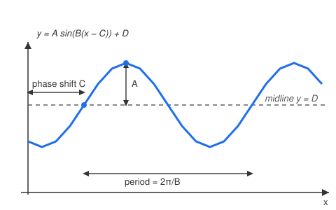

# Trigonometry · Lesson 3.1: Graphing sinusoids

> ⏱ ~15 min · Module 3: Graphs, waves & identities · Builds on: 2.2 (the unit circle) · Unlocks: 3.2 (fundamental identities)

## Why this matters

Almost everything that repeats — a tide, a swinging pendulum, an AC voltage, the hours of daylight across a year, the pressure wave that is a musical note — is a sinusoid or a sum of them. Once you can read a wave's four numbers (how tall, how often, where it starts, what it centers on) straight off a graph, and write the equation backwards, you can model any oscillation and predict it. This is also the shape you'll spend `calc-refresher` differentiating, so getting fluent now pays compound interest.

## The idea

Take the unit circle from Lesson 2.2 and imagine a point marching around it counterclockwise. Its **height** above the center is $\sin\theta$; its **horizontal position** is $\cos\theta$. Now, instead of watching the point go in circles, *unroll* its angle onto a horizontal axis and plot that height. One full lap ($2\pi$) traces one full hump-and-dip: the sine wave. Cosine is the same wave, just started a quarter-lap earlier (at the top instead of the middle).

A raw sine wave oscillates between $-1$ and $1$, repeating every $2\pi$, crossing zero on the way up at $x=0$. Real oscillations aren't that tidy — a tide swings between 1 and 5 meters, every 12 hours, peaking at 3 p.m. So we take the plain wave and stretch, squeeze, slide, and lift it with four knobs. Learn what each knob does and you can shape the wave to fit any oscillation, or read the knobs off a graph someone hands you.

## The formal version

Every sinusoid can be written

$$y = A\,\sin\!\big(B(x - C)\big) + D.$$

The four knobs:

- **Amplitude $|A|$** — half the distance from peak to trough; how tall the swing is. *In words: how far the wave reaches above and below its center.* (If $A<0$ the wave flips upside down, but the amplitude — a distance — is still $|A|$.)
- **Period $\dfrac{2\pi}{B}$** — the horizontal length of one full cycle. *In words: how far along $x$ before the pattern repeats.* Note $B$ is **not** the period; it's the number of cycles packed into $2\pi$. Bigger $B$ = more cycles = shorter period.
- **Phase shift $C$** — how far the whole wave slides right (left if $C<0$). *In words: where the "start of the cycle" has been moved to.* The factored form $B(x-C)$ is what makes $C$ read directly as the shift.
- **Midline / vertical shift $D$** — the horizontal line $y=D$ the wave is centered on. *In words: the resting level the oscillation swings around.* So $\text{max} = D + |A|$ and $\text{min} = D - |A|$.

To sketch from these: draw the midline $y=D$, mark peaks at $D+|A|$ and troughs at $D-|A|$, set one cycle to span the period starting at $x=C$, then subdivide that cycle into quarters (up-crossing → peak → down-crossing → trough). To go **backwards from a graph**: read $D$ as the midline (average of max and min), $|A|$ as half the peak-to-trough distance, the period as one full cycle's width (then $B = 2\pi/\text{period}$), and $C$ as a convenient landmark — an up-crossing for sine, a peak for cosine.

**A note on tangent.** The graph of $y=\tan x = \sin x / \cos x$ is a different animal: it has no amplitude (it runs off to $\pm\infty$), repeats every $\pi$ (not $2\pi$), and blows up into **vertical asymptotes** wherever $\cos x = 0$ — at $x = \tfrac{\pi}{2} + k\pi$ — because you're dividing by zero. Between consecutive asymptotes it climbs monotonically from $-\infty$ to $+\infty$, passing through zero where $\sin x = 0$.

## Picture

## Worked examples

**Example 1 (mechanical — read the knobs).** Analyze $y = 4\sin\!\big(\tfrac{\pi}{6}(x - 2)\big) + 10$ and find its first maximum for $x \ge 0$.

- Amplitude: $|A| = 4$. Midline: $D = 10$, so it swings between $\text{max}=14$ and $\text{min}=6$.
- Period: $\dfrac{2\pi}{B} = \dfrac{2\pi}{\pi/6} = 12$. One full cycle every 12 units.
- Phase shift: $C = 2$, so the "$x=0$ start" of a plain sine now sits at $x=2$.
- First maximum: sine peaks when its argument equals $\tfrac{\pi}{2}$. Set $\tfrac{\pi}{6}(x-2) = \tfrac{\pi}{2} \Rightarrow x - 2 = 3 \Rightarrow x = 5$, giving $y = 14$.

**Example 2 (why you'd care — simple harmonic motion).** A mass on a spring sits at position $y(t) = 3\cos\!\big(\tfrac{\pi}{2}\,t\big)$ centimeters, with $t$ in seconds, measured from equilibrium.

- Amplitude $3$ cm: it stretches 3 cm one way and compresses 3 cm the other. Midline $D=0$: equilibrium.
- Period $\dfrac{2\pi}{\pi/2} = 4$ s: one full bounce every 4 seconds.
- At $t=0$: $\cos 0 = 1$, so $y=3$ — released from full stretch, exactly what "cosine" encodes (starts at its peak). At $t=1$: $\tfrac{\pi}{2}(1)=\tfrac{\pi}{2}$, $\cos = 0$, so $y=0$ — back at equilibrium, moving fastest. This $y(t)$ *is* the displacement of every ideal spring and small-swing pendulum in `mechanics-refresher`; the number $B$ there carries the physics (stiffness over mass).

## Watch out

- **Phase shift lives in the factored form.** You might think $y=\sin(2x - \pi)$ is shifted right by $\pi$, but you must factor out $B$ first: $\sin\!\big(2(x - \tfrac{\pi}{2})\big)$, so the shift is $\tfrac{\pi}{2}$, not $\pi$. Never read $C$ off the unfactored expression.
- **Period is $2\pi/B$, not $B$.** You might think a big $B$ means a long, slow wave — it's the opposite. $B$ counts cycles crammed into $2\pi$; larger $B$ squeezes them tighter, so the period *shrinks*.
- **Max/min are $D \pm |A|$, not $\pm A$.** The amplitude measures the swing *from the midline*, not from zero. A tide with amplitude 2 m centered on 3.2 m tops out at 5.2 m, not 2 m. Forgetting $D$ is the most common modeling error.

## One-liner

> A sinusoid is the unit circle's height unrolled, then reshaped by four knobs — amplitude $|A|$ (how tall), period $2\pi/B$ (how often), phase shift $C$ (where it starts), midline $D$ (what it centers on).

## Problems

**P1 (🟢)** For $y = 3\sin\!\big(2(x - \tfrac{\pi}{4})\big) + 5$, state the amplitude, period, phase shift, midline, maximum, and minimum.

**P2 (🟡)** On a summer day the temperature is highest at $78^\circ$F at 3 p.m. ($t=15$, hours after midnight) and lowest at $54^\circ$F at 3 a.m. ($t=3$). Model the temperature $T(t)$ as a cosine over a 24-hour period, then predict the temperature at 9 a.m. ($t=9$).

**P3 (🔴, optional)** A sinusoid has a maximum value of $7$ at $x=1$, and its very next minimum, $-1$, at $x=5$. Write an equation for it (a) as a cosine and (b) as a sine.

Solutions

**P1** Read the knobs directly: $A=3 \Rightarrow$ amplitude $|A| = 3$. $B=2 \Rightarrow$ period $= \tfrac{2\pi}{2} = \pi$. Factored form already has $C=\tfrac{\pi}{4} \Rightarrow$ phase shift $\tfrac{\pi}{4}$ to the right. $D=5 \Rightarrow$ midline $y=5$. Maximum $= D+|A| = 8$; minimum $= D-|A| = 2$.

**P2** Midline is the average of the extremes: $D = \tfrac{78+54}{2} = 66$. Amplitude is half their difference: $|A| = \tfrac{78-54}{2} = 12$. A daily cycle has period $24 \Rightarrow B = \tfrac{2\pi}{24} = \tfrac{\pi}{12}$. Cosine peaks where its argument is $0$, and the max occurs at $t=15$, so shift by $C=15$:
$$T(t) = 66 + 12\cos\!\Big(\tfrac{\pi}{12}(t - 15)\Big).$$
At $t=9$: $\tfrac{\pi}{12}(9-15) = \tfrac{\pi}{12}(-6) = -\tfrac{\pi}{2}$, and $\cos(-\tfrac{\pi}{2}) = 0$, so $T(9) = 66^\circ$F. (Sanity check: 9 a.m. is a quarter-cycle after the 3 a.m. low, so the temperature should be crossing its midline on the way up — exactly $66^\circ$.)

**P3** Extremes $7$ and $-1$ give midline $D = \tfrac{7+(-1)}{2} = 3$ and amplitude $|A| = \tfrac{7-(-1)}{2} = 4$. Max→next min is half a period: $5 - 1 = 4$, so the period is $8$ and $B = \tfrac{2\pi}{8} = \tfrac{\pi}{4}$.

(a) **Cosine** peaks at the maximum, which is at $x=1$, so $C=1$:
$$y = 3 + 4\cos\!\Big(\tfrac{\pi}{4}(x-1)\Big).$$
Check: $x=1 \Rightarrow \cos 0 = 1 \Rightarrow y=7$ ✓; $x=5 \Rightarrow \cos\pi = -1 \Rightarrow y=-1$ ✓.

(b) **Sine** hits its max when its argument equals $\tfrac{\pi}{2}$. Set $\tfrac{\pi}{4}(1 - C) = \tfrac{\pi}{2} \Rightarrow 1 - C = 2 \Rightarrow C = -1$:
$$y = 3 + 4\sin\!\Big(\tfrac{\pi}{4}(x+1)\Big).$$
Check: $x=1 \Rightarrow \tfrac{\pi}{4}(2) = \tfrac{\pi}{2}$, $\sin = 1 \Rightarrow y=7$ ✓; $x=5 \Rightarrow \tfrac{\pi}{4}(6) = \tfrac{3\pi}{2}$, $\sin = -1 \Rightarrow y=-1$ ✓.

## Flashback

**From Lesson 2.2 (The unit circle):** Evaluate $\tan\!\left(\dfrac{4\pi}{3}\right)$ exactly, without a calculator, using a reference angle and the quadrant sign.

Solution

$\tfrac{4\pi}{3} = 240^\circ$ lies in **Quadrant III** (between $\pi$ and $\tfrac{3\pi}{2}$). Its reference angle is $\tfrac{4\pi}{3} - \pi = \tfrac{\pi}{3}$ ($60^\circ$). In Quadrant III both sine and cosine are negative, so their ratio $\tan$ is **positive**. Therefore $\tan\!\left(\tfrac{4\pi}{3}\right) = +\tan\tfrac{\pi}{3} = \sqrt{3}$.

## Connections

- **Backward:** the wave is literally the unit circle of [Lesson 2.2](./02-02-the-unit-circle.md) unrolled — height becomes $\sin$, and periodicity ($\theta$ and $\theta + 2\pi$ land on the same point) becomes the repeating cycle.
- **Forward:** [Lesson 3.2](./03-02-fundamental-identities.md) uses identities to rewrite these waves — e.g. proving a $\sin$ model and a $\cos$ model are the same wave, as the tide boss problem needs. And in [`calc-refresher`](../../calc-refresher/syllabus.md), these sinusoids are the functions you'll differentiate: the slope of $\sin$ is $\cos$, which is just the same wave phase-shifted — a fact this picture makes almost obvious.
- **Sideways (physics):** the spring in Example 2 is **simple harmonic motion** in [`mechanics-refresher`](../../mechanics-refresher/syllabus.md); $A$, period, and phase are its physical amplitude, period, and starting configuration.
- **Sideways (engineering):** every signal and waveform — audio, AC power, radio — is built from sinusoids; amplitude is loudness/voltage, $B$ is frequency, and Fourier's big idea downstream is that *any* periodic signal is a sum of these.
