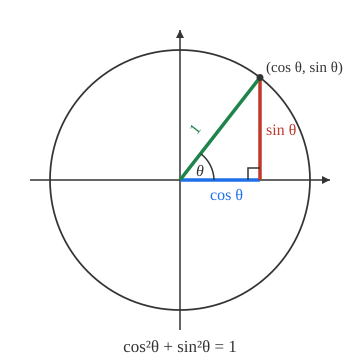

# Trigonometry · Lesson 3.2: Fundamental identities

> ⏱ ~15 min · Module 3: Graphs, waves & identities · Builds on: 2.2 (the unit circle) · Unlocks: 4.1 (law of sines)

## Why this matters

Trig expressions multiply like rabbits: the same quantity shows up as $\sin^2\theta$, as $1-\cos^2\theta$, as $\tan\theta\cos\theta$, and you need to recognize them as one thing. The identities are the algebra that collapses that mess. Downstream this is not optional bookkeeping — in `calc-refresher` you literally cannot integrate $\cos^2\theta$ until you rewrite it, and in `complex-analysis` every identity below drops out of a single line, $e^{i\theta}=\cos\theta+i\sin\theta$. The goal here is not to memorize a wall of formulas; it's to **derive them on demand** from two pictures you already own: the unit circle and a right triangle.

## The idea

Everything starts from one fact you can *see*. On the unit circle, a point at angle $\theta$ has coordinates $(\cos\theta,\sin\theta)$, and it sits at distance $1$ from the center. Distance $1$ means its legs and the radius form a right triangle with hypotenuse $1$ — so Pythagoras says the two legs squared add to $1$:
$$\cos^2\theta+\sin^2\theta=1.$$
That is the master identity. Every other one in this lesson is either a **rename** (writing $\tan,\sec,\csc,\cot$ in terms of $\sin$ and $\cos$) or a **combination law** (how $\sin$ and $\cos$ of $\alpha+\beta$ relate to those of $\alpha$ and $\beta$). Once you internalize "the circle gives Pythagoras, the definitions give the rest," you stop memorizing and start reconstructing.

## The formal version

**Pythagorean identity** (and its two children, made by dividing through):
$$\sin^2\theta+\cos^2\theta=1,\qquad \tan^2\theta+1=\sec^2\theta,\qquad 1+\cot^2\theta=\csc^2\theta.$$
*In words:* the second comes from dividing the first by $\cos^2\theta$, the third by $\sin^2\theta$ — so you never store them separately; you regenerate them.

**Reciprocal identities** (just names for flips):
$$\csc\theta=\frac{1}{\sin\theta},\qquad \sec\theta=\frac{1}{\cos\theta},\qquad \cot\theta=\frac{1}{\tan\theta}.$$
*In words:* cosecant pairs with sine, secant with cosine — the mismatch of names is a historical prank; watch it.

**Quotient identities:**
$$\tan\theta=\frac{\sin\theta}{\cos\theta},\qquad \cot\theta=\frac{\cos\theta}{\sin\theta}.$$
*In words:* on the unit circle $\tan\theta$ is the rise $\sin\theta$ over the run $\cos\theta$ — the slope of the radius.

**Angle-sum formulas** (the combination law — the one pair worth memorizing, everything else follows):
$$\sin(\alpha+\beta)=\sin\alpha\cos\beta+\cos\alpha\sin\beta,$$
$$\cos(\alpha+\beta)=\cos\alpha\cos\beta-\sin\alpha\sin\beta.$$
*In words:* sine is "mixed" (a sin-cos plus a cos-sin); cosine is "matched with a minus" (cos-cos **minus** sin-sin). Replace $\beta$ by $-\beta$ (using $\cos(-\beta)=\cos\beta$, $\sin(-\beta)=-\sin\beta$) to get the difference versions for free.

**Double-angle formulas** — just the sum formulas with $\beta=\alpha$:
$$\sin 2\theta=2\sin\theta\cos\theta,\qquad \cos 2\theta=\cos^2\theta-\sin^2\theta.$$
*In words:* set both angles equal and collect. Feeding $\cos^2\theta+\sin^2\theta=1$ into the cosine version gives its two everyday disguises, $\cos 2\theta=1-2\sin^2\theta=2\cos^2\theta-1$.

## Picture

The horizontal leg is $\cos\theta$, the vertical leg is $\sin\theta$, the hypotenuse is the radius $1$. Pythagoras on this one triangle *is* the master identity — nothing to memorize, just read it off.

## Worked examples

**Example 1 (mechanical — simplify).** Simplify $\dfrac{1-\cos^2\theta}{\cos\theta}\cdot\csc\theta$.

Rename and reduce, step by step:
$$1-\cos^2\theta=\sin^2\theta \quad\text{(Pythagorean, solved for }\sin^2\theta\text{)}.$$
$$\frac{\sin^2\theta}{\cos\theta}\cdot\frac{1}{\sin\theta}=\frac{\sin\theta}{\cos\theta}=\tan\theta.$$
Three unrecognizable symbols collapsed to one. The habit: **push everything toward $\sin$ and $\cos$**, then cancel.

**Example 2 (why you'd care — power reduction).** In calculus you'll need $\cos^2\theta$ in a form you can integrate. Start from the double-angle cosine and solve for the square. From $\cos 2\theta=2\cos^2\theta-1$:
$$\cos^2\theta=\frac{1+\cos 2\theta}{2}.$$
The right side is a *constant plus a plain cosine wave* — each piece integrates in one step, whereas $\cos^2\theta$ head-on does not. This single rearrangement is exactly how `calc-refresher` handles $\int\cos^2\theta\,d\theta$, and it's the move behind Boss problem 3's tide model, where $2\sin^2(\pi t/12.4)$ gets swapped for $1-\cos(2\pi t/12.4)$.

## Watch out

- You might think proving an identity means doing the same operation to both sides like an equation — but you don't yet *know* it's true, so operating on both sides can smuggle in false steps. **Start on one side and transform it into the other**, one identity at a time.
- You might read $\sin^2\theta$ as $\sin(\theta^2)$. It means $(\sin\theta)^2$ — the exponent lands on the *output*, not the angle. $\sin(\theta^2)$ is a completely different function.
- You might expand $\cos(\alpha+\beta)$ as $\cos\alpha+\cos\beta$. It is **not** linear: $\cos(90^\circ+0^\circ)=0$, but $\cos 90^\circ+\cos 0^\circ=1$. The angle-sum formula exists precisely because the naive distribution fails.

## One-liner

> The circle gives you $\sin^2+\cos^2=1$; the definitions rename $\tan,\sec,\csc,\cot$; the sum formulas combine angles — every other identity is one of these three in disguise.

## Problems

**P1 (🟢)** Prove $\tan\theta\,\cos\theta=\sin\theta$.

**P2 (🟡)** Prove $\sec\theta-\sin\theta\,\tan\theta=\cos\theta$. (Work the left side down to the right.)

**P3 (🔴, optional)** Using the angle-sum and double-angle formulas, prove the triple-angle identity $\sin 3\theta=3\sin\theta-4\sin^3\theta$.

Solutions

**P1** Start from the left and apply the quotient identity, then cancel:
$$\tan\theta\,\cos\theta=\frac{\sin\theta}{\cos\theta}\cdot\cos\theta=\sin\theta.\ \blacksquare$$

**P2** Push everything to $\sin$ and $\cos$, combine over the common denominator $\cos\theta$, then use the Pythagorean identity:
$$\sec\theta-\sin\theta\,\tan\theta=\frac{1}{\cos\theta}-\sin\theta\cdot\frac{\sin\theta}{\cos\theta}=\frac{1-\sin^2\theta}{\cos\theta}=\frac{\cos^2\theta}{\cos\theta}=\cos\theta.\ \blacksquare$$

**P3** Write $3\theta=2\theta+\theta$ and apply the sine angle-sum formula:
$$\sin 3\theta=\sin(2\theta+\theta)=\sin 2\theta\cos\theta+\cos 2\theta\sin\theta.$$
Substitute the double-angle forms $\sin 2\theta=2\sin\theta\cos\theta$ and $\cos 2\theta=1-2\sin^2\theta$:
$$=2\sin\theta\cos\theta\cdot\cos\theta+(1-2\sin^2\theta)\sin\theta=2\sin\theta\cos^2\theta+\sin\theta-2\sin^3\theta.$$
Now kill the leftover $\cos^2\theta$ with $\cos^2\theta=1-\sin^2\theta$ so everything is in $\sin\theta$:
$$=2\sin\theta(1-\sin^2\theta)+\sin\theta-2\sin^3\theta=2\sin\theta-2\sin^3\theta+\sin\theta-2\sin^3\theta=3\sin\theta-4\sin^3\theta.\ \blacksquare$$

## Flashback

**From Lesson 2.1 (Radian measure):** Convert $210^\circ$ to radians, then find the length of the arc it subtends on a circle of radius $6$ cm.

Solution

Degrees to radians: multiply by $\pi/180^\circ$:
$$210^\circ\cdot\frac{\pi}{180^\circ}=\frac{210\pi}{180}=\frac{7\pi}{6}\text{ rad}.$$
Arc length with $s=r\theta$ ($\theta$ in radians):
$$s=6\cdot\frac{7\pi}{6}=7\pi\approx 21.99\text{ cm}.$$
(The radius cancels the $6$ cleanly — a good sign you used radians, not degrees, in $s=r\theta$.)

## Connections

- **Backward:** the master identity is nothing but Pythagoras from Lesson 2.2's unit circle — the reference triangle with hypotenuse $1$. Every identity here is downstream of that one picture.
- **Forward:** in `calc-refresher`, identities are how you *tame* trig integrals — Example 2's $\cos^2\theta=\tfrac{1+\cos 2\theta}{2}$ is the standard power-reduction step, and the same rewrite closes Boss problem 3.
- **Sideways (complex analysis):** all of these fall out of $e^{i\theta}=\cos\theta+i\sin\theta$. Multiplying $e^{i\alpha}e^{i\beta}=e^{i(\alpha+\beta)}$ and matching real/imaginary parts *is* the angle-sum pair — one line replaces the whole table.
- **Sideways (physics):** adding two sinusoids of the same frequency (wave superposition, interference) is an angle-sum computation; the double-angle identity is why a wave's *energy*, going as amplitude squared, oscillates at twice the wave's frequency.
