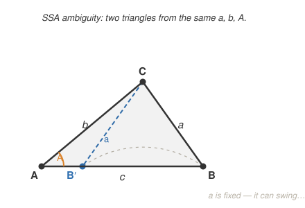

# Trigonometry · Lesson 4.1: Law of sines

> ⏱ ~15 min · Module 4: General triangles & applications · Builds on: 2.2 (the unit circle) · Unlocks: 4.2 (law of cosines & capstone)

## Why this matters

Everything you've done so far needed a right angle to grab onto — SOHCAHTOA only speaks to triangles with a $90^\circ$ corner. But surveyors, navigators, and astronomers almost never get one for free: they measure two angles and a distance, or a distance and two lengths, on a triangle that's plain crooked. The law of sines is the first tool that solves *any* triangle, and it's the one you reach for whenever a side and its opposite angle are both in play.

## The idea

In any triangle, the biggest angle stares across at the longest side, and the smallest angle at the shortest — angle and opposite side rise and fall together. The law of sines says they don't just move together, they move in **exact proportion**: divide each side by the sine of the angle facing it and you get the same number every time, for all three corners.

Why the sine? Drop a perpendicular (an altitude) from one vertex and you split the crooked triangle into two right triangles that share that height $h$. In one, $h = b\sin A$; in the other, $h = a\sin B$. Same $h$, so $b\sin A = a\sin B$, which rearranges to $\dfrac{a}{\sin A} = \dfrac{b}{\sin B}$. Do it from a different vertex and the third ratio joins in.

## The formal version

For a triangle with vertices $A, B, C$ and the sides $a, b, c$ opposite them,

$$\frac{a}{\sin A} = \frac{b}{\sin B} = \frac{c}{\sin C}.$$

In words: **each side is proportional to the sine of the angle across from it.** ($a$ is the side opposite angle $A$, and so on — the pairing is the whole point.)

To *use* it you need one complete ratio — a side together with its opposite angle — plus one more measurement. That happens in exactly these cases:

- **AAS / ASA** (two angles and any side): find the third angle by $A+B+C = 180^\circ$, then solve each unknown side. Always exactly one triangle.
- **SSA** (two sides and an angle opposite one of them): the **ambiguous case** — it may give zero, one, or two triangles.

If instead you're handed **SAS** or **SSS**, you have *no* side-with-its-opposite-angle pair to start from — those wait for the law of cosines in [4.2](04-02-law-of-cosines-and-capstone.md).

## Picture

Fix angle $A$ and side $b$ (up to $C$), then swing the fixed-length side $a$ down toward the base. If $a$ is long enough to reach twice, you get two legitimate triangles — that's SSA.

## Worked examples

**Example 1 (mechanical, AAS).** A triangle has $A = 40^\circ$, $B = 75^\circ$, and side $a = 12$ (opposite $A$). Find side $b$.

Line up the two complete ratios and solve:

$$\frac{b}{\sin B} = \frac{a}{\sin A} \;\Longrightarrow\; b = a\,\frac{\sin B}{\sin A} = 12\cdot\frac{\sin 75^\circ}{\sin 40^\circ} = 12\cdot\frac{0.9659}{0.6428} \approx 18.0.$$

Want $c$ too? The third angle is $C = 180^\circ - 40^\circ - 75^\circ = 65^\circ$, so $c = 12\cdot\dfrac{\sin 65^\circ}{\sin 40^\circ} \approx 16.9$. Sanity check: $B$ is the largest angle and $b$ came out largest — the ordering holds.

**Example 2 (why you'd care — SSA, two triangles).** A surveyor knows two distances to a landmark, $a = 7$ and $b = 9$ (in hundreds of meters), and the angle $A = 35^\circ$ opposite the shorter one. How many triangles fit, and what's the third side $c$?

Start from the ratio that's complete, $\dfrac{a}{\sin A} = \dfrac{b}{\sin B}$:

$$\sin B = \frac{b\sin A}{a} = \frac{9\sin 35^\circ}{7} = \frac{9(0.5736)}{7} \approx 0.7375.$$

Now the trap: $\arcsin(0.7375) = 47.5^\circ$, but $\sin$ is also positive for the obtuse supplement $180^\circ - 47.5^\circ = 132.5^\circ$. Test both against the angle sum:

- $B = 47.5^\circ$: then $C = 97.5^\circ$, and $c = a\dfrac{\sin C}{\sin A} = 7\cdot\dfrac{\sin 97.5^\circ}{\sin 35^\circ} \approx 12.1$.
- $B = 132.5^\circ$: then $C = 180^\circ - 35^\circ - 132.5^\circ = 12.5^\circ$ (still positive, so it's real), and $c = 7\cdot\dfrac{\sin 12.5^\circ}{\sin 35^\circ} \approx 2.6$.

Both survive — **two genuine triangles**. The surveyor needs one more observation to know which landmark configuration is real. That "check the supplement" habit is the entire skill of the ambiguous case.

## Watch out

- **You might think $\arcsin$ hands you *the* angle** — it only ever returns the acute one ($0^\circ$–$90^\circ$). In an SSA problem, always ask whether the obtuse partner $180^\circ - B$ *also* keeps the angle sum under $180^\circ$; if it does, there's a second triangle.
- **You might think the law of sines can start any triangle.** It can't touch SAS or SSS — no side is paired with its opposite angle, so every ratio has two unknowns. Recognize those on sight and go to the law of cosines instead.
- **You might force a solution when none exists.** If $\sin B = \dfrac{b\sin A}{a}$ comes out **greater than 1**, stop: side $a$ is too short to close the triangle, and there are *zero* solutions. A sine can't exceed 1, and the algebra is telling you the geometry is impossible.

## One-liner

> In any triangle, side-over-sine-of-its-opposite-angle is the same for all three corners — and when you're given SSA, always check the obtuse twin before you trust one answer.

## Problems

**P1 (🟢)** A triangle has $A = 50^\circ$, $C = 60^\circ$, and the side between them $b = 10$. Find side $a$.

**P2 (🟡)** Given $a = 6$, $b = 8$, and $A = 40^\circ$ (SSA). Decide how many triangles are possible, and solve for angle $B$ in each.

**P3 (🔴, optional)** For a triangle with $A = 30^\circ$ and $b = 10$ fixed, find all values of the opposite side $a$ that produce *exactly two* triangles. (Hint: compare $a$ to the altitude $h = b\sin A$.)

Solutions

**P1** This is ASA, so first get the missing angle: $B = 180^\circ - 50^\circ - 60^\circ = 70^\circ$, which is opposite the known side $b = 10$. Then

$$a = b\,\frac{\sin A}{\sin B} = 10\cdot\frac{\sin 50^\circ}{\sin 70^\circ} = 10\cdot\frac{0.7660}{0.9397} \approx 8.15.$$

(Check: $a$ faces the smallest angle, so it should be the shortest side — it is.)

**P2** Compute the sine of the opposite-side angle:

$$\sin B = \frac{b\sin A}{a} = \frac{8\sin 40^\circ}{6} = \frac{8(0.6428)}{6} \approx 0.8571 \;<\; 1,$$

so at least one triangle exists. $\arcsin(0.8571) = 59.0^\circ$; the supplement is $121.0^\circ$. Test each: $40^\circ + 59.0^\circ = 99.0^\circ < 180^\circ$ ✓, and $40^\circ + 121.0^\circ = 161.0^\circ < 180^\circ$ ✓. Both leave room for a positive third angle, so there are **two triangles**, with $B \approx 59.0^\circ$ or $B \approx 121.0^\circ$. (This matches the picture: $a = 6$ sits between the altitude $h = 8\sin 40^\circ \approx 5.14$ and $b = 8$, the two-solution band.)

**P3** The altitude from the far vertex to the base has length $h = b\sin A = 10\sin 30^\circ = 5$. Reading the swing picture: if $a < h$ the side can't reach the base (zero triangles); if $a = h$ it just touches (one right triangle); if $a \ge b$ it reaches on only one side (one triangle). Two triangles occur precisely in the band between:

$$h < a < b \;\Longrightarrow\; \boxed{5 < a < 10}.$$

## Flashback

**From Lesson 1.2 (Finding angles & applications):** From a small boat, the angle of elevation to the top of a vertical sea cliff is $22^\circ$. The cliff is $45$ m tall (measured from the waterline). How far is the boat from the base of the cliff?

Solution

The height is *opposite* the $22^\circ$ angle and the distance $d$ is *adjacent*, so use tangent:

$$\tan 22^\circ = \frac{45}{d} \;\Longrightarrow\; d = \frac{45}{\tan 22^\circ} = \frac{45}{0.4040} \approx 111\text{ m}.$$

## Connections

- **Backward:** this generalizes the right-triangle ratios of Module 1 and the `geometry` course — a right triangle is just the special case where one angle is $90^\circ$ and $\sin 90^\circ = 1$, so $c/\sin C$ becomes the hypotenuse itself.
- **Forward:** [Lesson 4.2](04-02-law-of-cosines-and-capstone.md) supplies the law of cosines for exactly the cases the law of sines can't open — SAS and SSS — plus triangle area and the bearings/navigation capstone.
- **Sideways (applications):** surveying and navigation run on this — any time you fix two sightlines and a baseline (AAS/ASA) or two ranges and a heading (SSA), the law of sines turns the readings into positions.
