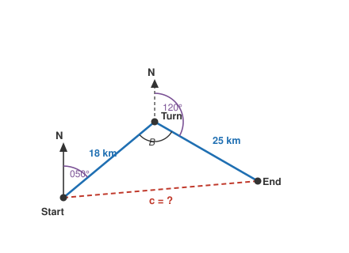

# Trigonometry · Lesson 4.2: Law of cosines & capstone

> ⏱ ~15 min · Module 4: General triangles & applications · Builds on: 4.1 (law of sines) · Unlocks: precalculus (next course)

## Why this matters

The law of sines from last lesson has a blind spot: it needs a known angle *paired with its opposite side*. Give it two sides and the angle *between* them (SAS), or all three sides and no angles (SSS), and it stalls — there's no complete side-angle pair to start from. The law of cosines fills exactly that gap, and those two cases are the ones surveying, navigation, and physics hand you most often: two lengths and the angle where they meet. Master it and you can solve *any* triangle, full stop. This is the last lesson of the course, so it's also where the whole toolkit gets pointed at real bearings problems.

## The idea

Pythagoras, $c^2 = a^2 + b^2$, only works when the angle between $a$ and $b$ is a right angle. But most triangles aren't right triangles — so what's the penalty for a "wrong" angle?

That's all the law of cosines is: **Pythagoras plus a correction term that measures how far the included angle is from $90^\circ$.** Open the angle wider than a right angle and the opposite side stretches (the correction adds length); close it tighter and the side shrinks. The knob controlling the correction is $\cos C$ — which is exactly $0$ at $90^\circ$, so at a right angle the correction vanishes and you're back to plain Pythagoras.

## The formal version

For any triangle with sides $a, b, c$ opposite angles $A, B, C$:

$$c^2 = a^2 + b^2 - 2ab\cos C$$

In words: the square of a side equals the sum of the squares of the other two, minus a correction $2ab\cos C$ set by the angle *between* them. Note $C$ is the angle **opposite** $c$ and **between** $a$ and $b$ — that pairing is the whole rule. (By symmetry: $a^2 = b^2 + c^2 - 2bc\cos A$, and likewise for $b$.) When $C = 90^\circ$, $\cos C = 0$ and this collapses to $c^2 = a^2 + b^2$.

Two jobs, run in two directions:

- **SAS → find the third side.** Know $a$, $b$, and the included angle $C$? Plug in directly.
- **SSS → find an angle.** Know all three sides? Solve for the cosine:
$$\cos C = \frac{a^2 + b^2 - c^2}{2ab}$$
Then $C = \cos^{-1}(\cdot)$. Unlike the law of sines, this never has an ambiguous case — $\cos^{-1}$ returns a unique angle in $[0^\circ, 180^\circ]$, so an obtuse angle comes out obtuse (its cosine is negative) with no second-triangle trap.

**Area, two ways.** Once you can find sides and angles, area follows:

$$\text{Area} = \tfrac{1}{2}\,ab\sin C \qquad\text{(two sides and their included angle)}$$

In words: half the product of two sides times the sine of the angle between them — a right-triangle "$\tfrac12 \text{base}\times\text{height}$" with $b\sin C$ playing the height. If instead you know all three sides, use **Heron's formula** with the semiperimeter $s = \tfrac{a+b+c}{2}$:

$$\text{Area} = \sqrt{s(s-a)(s-b)(s-c)}$$

## Picture

A ship leaves *Start*, sails one leg, turns, sails another. The two legs and the direct line home form an oblique triangle. You know both leg lengths and — after converting the compass bearings into the interior turn angle $B$ — the angle between them. That's SAS: the law of cosines gives the direct distance $c$ in one shot.

## Worked examples

**Example 1 (mechanical — SAS, then SSS).** A triangle has $a = 8$, $b = 5$, and included angle $C = 60^\circ$. Find side $c$, then find angle $A$.

Third side (SAS):
$$c^2 = 8^2 + 5^2 - 2(8)(5)\cos 60^\circ = 64 + 25 - 80(0.5) = 89 - 40 = 49 \;\Rightarrow\; c = 7.$$

Now use SSS to recover angle $A$ (opposite $a = 8$):
$$\cos A = \frac{b^2 + c^2 - a^2}{2bc} = \frac{25 + 49 - 64}{2(5)(7)} = \frac{10}{70} = 0.1429 \;\Rightarrow\; A = \cos^{-1}(0.1429) \approx 81.8^\circ.$$

Sanity check: $a = 8$ is the longest side, so $A$ should be the largest angle — and $81.8^\circ$ beats $C = 60^\circ$. Good. (Finish the triangle if you like: $B = 180^\circ - 81.8^\circ - 60^\circ = 38.2^\circ$.)

**Example 2 (why you'd care — bearings & navigation).** A ship sails $12$ km on bearing $040^\circ$, then turns and sails $20$ km on bearing $110^\circ$. (a) How far is it from where it started? (b) On what bearing must it sail to head straight home?

*Bearings → interior angle.* A bearing is measured clockwise from north. At the turning point, the ship was heading $040^\circ$ and swings to $110^\circ$ — a $70^\circ$ turn to the right. The **interior** angle of the triangle at the turn is the supplement of that turn:
$$B = 180^\circ - (110^\circ - 40^\circ) = 110^\circ.$$

*(a) Direct distance (SAS)* with the two legs $12$ and $20$ around $B = 110^\circ$:
$$c^2 = 12^2 + 20^2 - 2(12)(20)\cos 110^\circ = 144 + 400 - 480(-0.3420) = 544 + 164.2 = 708.2,$$
so $c \approx 26.6$ km. (The correction is *added* because $\cos 110^\circ < 0$ — an obtuse turn pushes the endpoints farther apart than Pythagoras would.)

*(b) Return bearing (law of sines).* Find the start angle $A$, opposite the $20$ km leg:
$$\frac{\sin A}{20} = \frac{\sin 110^\circ}{26.6} \;\Rightarrow\; \sin A = \frac{20(0.9397)}{26.6} = 0.7063 \;\Rightarrow\; A \approx 45.0^\circ.$$
From the start, the first leg pointed at $040^\circ$ and home lies $A \approx 45^\circ$ further clockwise (the ship turned right), so the direct line *out to the endpoint* has bearing $040^\circ + 45^\circ = 085^\circ$. To sail **home** you reverse it: $085^\circ + 180^\circ = \boxed{265^\circ}$.

That's the full pipeline — bearings to interior angle, law of cosines for the distance, law of sines for the heading, reverse for the return.

## Watch out

- **You might think the angle can be any of the three — but $C$ must be the one *between* $a$ and $b$.** The law of cosines only pairs a side with its *opposite* (and therefore included) angle. Mismatch them and every number is wrong. Label the triangle before you plug in.
- **You might trust the law of sines to find a big angle after the law of cosines — but $\sin^{-1}$ can't tell obtuse from acute.** Since $\sin\theta = \sin(180^\circ - \theta)$, it always returns the acute option. To be safe, use the law of sines only for the *smaller* remaining angles (the largest angle sits opposite the largest side; find *it* with the law of cosines, whose $\cos^{-1}$ reports obtuse correctly).
- **You might forget a bearing is measured from *north*, clockwise — not from the previous course, and not counterclockwise like a standard angle.** Turning from bearing $040^\circ$ to $110^\circ$ is a $70^\circ$ turn, but the triangle's interior angle is its supplement, $110^\circ$. Always draw the north arrow first and read the interior angle off the picture.

## One-liner

> The law of cosines is Pythagoras with a conscience: $c^2 = a^2 + b^2 - 2ab\cos C$ pays a correction for every degree the included angle strays from $90^\circ$.

## Problems

**P1 (🟢)** A triangle has sides $7$, $8$, and $9$. Find its largest angle.

**P2 (🟡)** Two sides of a triangle are $6$ and $10$ with an included angle of $120^\circ$. Find the third side and the area — then confirm the area with Heron's formula.

**P3 (🔴, optional)** A plane flies $30$ km on bearing $025^\circ$, then $40$ km on bearing $100^\circ$. Find its distance from the start and the bearing it must fly to return directly to base.

Solutions

**P1** The largest angle sits opposite the longest side ($9$). With $a = 7$, $b = 8$, $c = 9$:
$$\cos C = \frac{7^2 + 8^2 - 9^2}{2(7)(8)} = \frac{49 + 64 - 81}{112} = \frac{32}{112} = 0.2857 \;\Rightarrow\; C = \cos^{-1}(0.2857) \approx 73.4^\circ.$$
(It's acute — a $7$-$8$-$9$ triangle is not far from equilateral, so no angle is very large.)

**P2** Third side (SAS), included angle $C = 120^\circ$, sides $a = 6$, $b = 10$:
$$c^2 = 6^2 + 10^2 - 2(6)(10)\cos 120^\circ = 36 + 100 - 120(-0.5) = 136 + 60 = 196 \;\Rightarrow\; c = 14.$$
Area via $\tfrac12 ab\sin C$:
$$\text{Area} = \tfrac{1}{2}(6)(10)\sin 120^\circ = 30(0.8660) \approx 25.98.$$
Heron check, $s = \tfrac{6 + 10 + 14}{2} = 15$:
$$\text{Area} = \sqrt{15(15-6)(15-10)(15-14)} = \sqrt{15 \cdot 9 \cdot 5 \cdot 1} = \sqrt{675} \approx 25.98. \;\checkmark$$

**P3** *Interior angle at the turn:* heading swings from $025^\circ$ to $100^\circ$, a $75^\circ$ right turn, so $B = 180^\circ - 75^\circ = 105^\circ$.

*Distance (SAS)*, legs $30$ and $40$:
$$c^2 = 30^2 + 40^2 - 2(30)(40)\cos 105^\circ = 900 + 1600 - 2400(-0.2588) = 2500 + 621.2 = 3121.2,$$
so $c \approx 55.9$ km.

*Return bearing.* Start angle $A$, opposite the $40$ km leg:
$$\sin A = \frac{40\sin 105^\circ}{55.9} = \frac{40(0.9659)}{55.9} = 0.6913 \;\Rightarrow\; A \approx 43.8^\circ.$$
The direct line out to the endpoint bears $025^\circ + 43.8^\circ = 068.8^\circ$; the return bearing is $068.8^\circ + 180^\circ \approx \boxed{248.8^\circ}$.

## Flashback

**From Lesson 4.1 (Law of sines):** In a triangle, angle $A = 35^\circ$, angle $C = 80^\circ$, and the side $c$ opposite $C$ is $15$. Find the side $a$ opposite $A$.

Solution

This is AAS — a complete side-angle pair ($c$ with $C$) plus another angle, so the law of sines applies directly:
$$\frac{a}{\sin A} = \frac{c}{\sin C} \;\Rightarrow\; a = \frac{c\sin A}{\sin C} = \frac{15\sin 35^\circ}{\sin 80^\circ} = \frac{15(0.5736)}{0.9848} \approx 8.74.$$
(Smaller angle, shorter side — $A = 35^\circ < C = 80^\circ$, and $8.74 < 15$. The third angle is $B = 180^\circ - 35^\circ - 80^\circ = 65^\circ$ if you want the whole triangle.)

## Connections

- **Backward:** this completes the pair started in [Lesson 4.1](04-01-law-of-sines.md). Rule of thumb — a complete side-angle pair? Reach for the law of *sines*. No pair (SAS or SSS)? Reach for the law of *cosines* to manufacture one, then the law of sines finishes the triangle.
- **Forward:** [`precalculus`](../../precalculus/syllabus.md) and [`calc-refresher`](../../calc-refresher/syllabus.md) take the sinusoids and small-angle ideas from this course as raw material — the direct next step after Module 3's waves. This module's triangle-solving is the geometry you'll lean on whenever a physics or optimization problem hands you an oblique triangle.
- **Sideways (linear algebra):** the law of cosines *is* the dot-product angle formula in disguise. Writing side $c$ as the vector $\vec{a} - \vec{b}$ and expanding $|\vec{a} - \vec{b}|^2 = |\vec{a}|^2 + |\vec{b}|^2 - 2\,\vec{a}\cdot\vec{b}$ gives exactly $c^2 = a^2 + b^2 - 2ab\cos C$, since $\vec{a}\cdot\vec{b} = ab\cos C$. You'll meet it again from that angle in [`linalg-refresher`](../../linalg-refresher/syllabus.md).
- **Sideways (physics):** adding two forces or velocities tip-to-tail makes exactly this oblique triangle — the magnitude of a resultant of two vectors $|\vec{F}_1 + \vec{F}_2|$ comes straight from the law of cosines, and its direction from the law of sines. Example 2's ship is a vector-addition problem wearing a compass.
