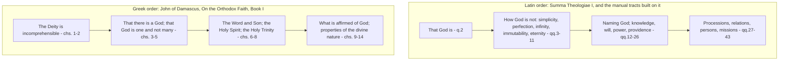

# The Triune God · Lesson 1.1: The treatise and its order

> ⏱ ~15 min · Module 1: De Deo Uno - the one God the Church confesses · Builds on: [`thomistic-synthesis` 1.1](../../thomistic-synthesis/lessons/01-01-the-plan-of-the-summa.md), [`fundamental-theology` 4.4](../../fundamental-theology/lessons/04-04-the-ladder-of-doctrinal-authority.md) · Unlocks: [1.2](01-02-the-one-true-god-and-what-reason-can-reach.md), [1.3](01-03-simplicity-as-doctrine.md)

## Why this matters

Open a seminary manual from around 1900 and the treatise on God comes in two tracts, [*De Deo Uno* and *De Deo Trino*](../reference.md#de-deo-uno-et-trino), sometimes in different volumes. The first reads like philosophy: one God, simple, eternal, omnipotent. The second reads like a puzzle set for experts. In 1967 Karl Rahner complained that the arrangement had produced Christians who recite the creed correctly and live as practical monotheists. Whether he was right is [6.3](06-03-rahners-rule-and-the-immanent-trinity.md)'s. You need the map first: what the treatise contains, why it is built that way, how to cite inside it, and the habit that makes every later lesson easier — telling a defined truth from the explanation of one.

## The idea

Two orders are available, and they do not disagree about facts.

**[The order of being](../reference.md#the-order-of-knowledge-and-the-order-of-being)** starts where the reality starts: the Father, who begets the Son and breathes forth the Spirit. God is not first "the divine essence" and then three; the one God *is* Father, Son and Holy Spirit. You meet the persons first, and the attributes describe the life they share.

**The order of knowledge** starts where we start. We come at God as the cause of a world we can see, and reason gets that far ([1.2](01-02-the-one-true-god-and-what-reason-can-reach.md)). The Trinity is not on that road; it arrives because God said so. A treatise following the road of knowledge therefore does the one God first, then what only revelation adds.

Underneath both runs a distinction the Fathers made and the Catechism repeats (CCC 236): [*theologia*, God's own inner life, and *oikonomia*, the works by which he reveals himself](../reference.md#theologia-and-oikonomia). Through the economy the theology is revealed; the theology lights up the economy. Both orders travel between those ends and differ about which you hold first.

## Source

*Summa Theologiae* I q.27, prologue, English Dominican Province translation (public domain):

> Having considered what belongs to the unity of the divine essence, it remains to treat of what belongs to the Trinity of the persons in God. And because the divine Persons are distinguished from each other according to the relations of origin, the order of the doctrine leads us to consider firstly, the question of origin or procession; secondly, the relations of origin; thirdly, the persons.

Three phrases decide it.

**"It remains to treat"** — a hinge inside one continuous sequence, not the opening of a second book. Part I runs essence (qq.2-26), persons (qq.27-43), creatures (qq.44-119) without a break; that plan is [`thomistic-synthesis` 1.1](../../thomistic-synthesis/lessons/01-01-the-plan-of-the-summa.md)'s. The manuals' *two tracts* are a later packaging of this one order — and the packaging is what Rahner attacked.

**"The order of the doctrine"** (*secundum ordinem doctrinae*) — what follows is announced as an order of *teaching*, not a claim that the persons are later than the essence.

**"Distinguished according to the relations of origin"** — the Latin tradition's *explanation*, given as the reason for the syllabus of qq.27-43. It is not a definition of the Church. Keep the two apart from the start; this course grades the confusion strictly in both directions.

## The argument

The case for the order of knowledge, in premises:

1. **Sacred doctrine leads learners from ground they already stand on.** *In words:* teaching starts at the student's feet.
2. **Reason unaided can reach that there is one God, and something of what he is like** — the Church teaches this ([`fundamental-theology` 1.2](../../fundamental-theology/lessons/01-02-natural-knowledge-of-god.md)). *In words:* part of the material is common ground with anyone who will argue.
3. **The Trinity is a mystery in the strict sense**, hidden in God and unknowable unless revealed (CCC 237). *In words:* the rest of the material has exactly one source, God's word.
4. **Putting 2 before 3 moves from what is more knowable to us toward what is less, and never pretends to prove the Trinity.** *In words:* the split fences off a bad argument.
5. **Therefore the one God first, the three second — as an order of teaching, not a claim about priority in God.**

Premise 5 is where the argument is won or lost, because it is the italics nobody hears. Rahner's complaint (*The Trinity*, 1967, paraphrased, as this course paraphrases all modern authors) is that a tract on the one God, run largely on philosophical grounds and finished before the Trinity is mentioned, delivers a God already completely described. The three then arrive as an appendix — true, confessed and idle. Prayer, preaching and the ordinary Christian's working picture of God stay unitarian in shape while the creed is recited perfectly.

The counter-case concedes the danger and denies the diagnosis. A fence is not a wall: Module 1 names the persons throughout, and its attributes are stated of the God who is Father, Son and Spirit. What the order buys is a guard against the field's worst error — arguing your way to the Trinity and calling the result a proof. Rahner's own repair, that the Trinity of the economy is the immanent Trinity and the reverse, is a rule about content, not a demand to reverse the sequence ([6.3](06-03-rahners-rule-and-the-immanent-trinity.md)).

### Citing the tradition

You settle a question like this only by reading texts, so this course points at them one fixed way. Authority levels come from [`fundamental-theology` 4.4](../../fundamental-theology/lessons/04-04-the-ladder-of-doctrinal-authority.md); every weight-bearing claim carries one.

| Kind of text | [How this course cites it](../reference.md#citing-the-tradition) | Example |
|---|---|---|
| Creed | council and year, then the clause | the creed of 381, on the Spirit |
| Conciliar definition | council and document name; a section number only when verified | Lateran IV's *Firmiter* |
| Catechism | paragraph, paraphrased not quoted at length | CCC 236 |
| *Summa* | part, question, article, reply | ST I q.27 a.1 ad 2 |
| Fathers | work, book, chapter, public-domain translation | *De Trinitate* V, ch. 5 |
| Scripture | book, chapter, verse, Douay-Rheims | John 15:26 |
| Modern theologians | paraphrase, cited by work and year | Rahner, *The Trinity* (1967) |

And one refusal. **This course uses no Denzinger numbers unless the number itself has been checked.** A DH number points into one edition of one handbook, and editions renumber; a wrong one looks authoritative and cannot be caught by anyone who trusts you. Names do not rot: *Firmiter* is *Firmiter* in every edition.

## The two orders

Two dogmatic summae side by side. The Greek one is John of Damascus, *On the Orthodox Faith*, Book I (eighth century), in the *Nicene and Post-Nicene Fathers* translation.

Read what the picture shows, not what you expect. **Both** establish that God is and that God is one before saying anything about three. The difference is where the *attributes* sit: for the Damascene after the Trinity, describing the God already confessed as three; in the Latin order before. A real difference of pedagogy — but not the one the famous slogan advertises.

### The de Regnon paradigm

The slogan comes from Théodore de Régnon (*Études de théologie positive sur la Sainte Trinité*, 1892-98) — or from what textbooks made of him: [Greek theology begins from the persons and moves to the nature; Latin theology from the nature to the persons](../reference.md#the-de-regnon-paradigm). This lesson states the paradigm as it circulates; it does not quote de Régnon, whose French text it has not checked. Twentieth-century theology used it as a master key — for the filioque, for Augustine, for Western piety.

Michel René Barnes ("De Régnon Reconsidered", 1995) and Lewis Ayres (*Nicaea and Its Legacy*, 2004) took it apart; both are paraphrased. Their charge: a nineteenth-century schema, built for de Régnon's own purposes, circulated as a slogan detached from his argument and read back into the fourth century as though the Fathers had sorted themselves into camps. The texts do not cooperate — Augustine and the Cappadocians share far more method than the paradigm allows, and Greek writers argue from the divine nature freely. Most patristic scholarship now treats it as, at best, a loose heuristic about later medieval habits.

This course does not settle it. State the paradigm, state the critique, and notice when an argument leans on it as established fact.

## Worked examples

**Example 1 (clean): "the Holy Spirit is God," under each order.**

Under the Latin order you reach q.27 already holding that God is altogether simple, with no accidents or parts ([`thomistic-synthesis` 3.4](../../thomistic-synthesis/lessons/03-04-divine-simplicity-and-the-attributes.md)). The Spirit's divinity then arrives as a conclusion about *what he must be* if he proceeds within God at all: whatever is in God is God, so a real procession in God terminates in someone who is God, not a creature. The confession of 381 is read in that light ([3.3](03-03-constantinople-i-and-the-divinity-of-the-spirit.md)).

Under the Damascene's order the Spirit is confessed as God at chapter 7, before a word about the divine properties, from an analogy of word and breath and from the Psalms and Job: the Spirit subsists in his own right, proceeding from the Father and resting in the Word, not a breath that dissolves. Chapters 9-14 then predicate the properties of the God so confessed. Basil's argument from baptism and the doxology is a second Greek route in ([`patristics` 3.2](../../patristics/lessons/03-02-basil-the-great.md)).

Same doctrine, same level — defined. Different roads in, breeding different instincts: the first that the Spirit's divinity follows from what God is, the second that what God is must be stated to fit the Spirit already confessed.

**Example 2 (hard): where the order strains.**

Take simplicity. In the Latin order it is settled at q.3, argued from the first cause, long before anyone mentions three. Sixty questions later the treatise must show that this altogether simple God is three really distinct persons, and Module 4's apparatus exists to show that the distinction costs the simplicity nothing. The harder job comes second, the earlier result fixed.

That is a strength and a risk. The strength: simplicity cannot be quietly softened to make room for the persons, as several modern proposals do. The risk is Rahner's, sharpened: if the tract on the one God argues entirely from creatures, its subject looks like *the God of the philosophers*, and the second tract must establish that this is the same subject as the God of Abraham who sends his Son. Under the Greek order that identity is never in question.

Neither way did anyone change a doctrine. The strain is about what a learner ends up believing when the sequence is done — which is why this is open among Catholic theologians and not a matter of faith.

## Watch out

- **"*De Deo Uno* is about the essence, *De Deo Trino* about the persons" is a fine table of contents and a terrible picture.** Hear "the essence" as a thing that then *has* three persons in it and you have four items, a quaternity — tritheism with an extra member. The one essence is not a fourth alongside the three; [3.4](03-04-the-latin-rules-of-speech.md) reads the texts that forbid it.
- **Preferring one order is not a doctrinal position.** Nobody is more orthodox for starting from the Father; the dogma is *that* God is one and three, not the sequence of chapters.
- **Two claims that get upgraded and should not be.** Rahner charged the manuals with producing bad practical religion, not with teaching modalism. And the de Régnon paradigm is history, not faith: using it to settle a doctrinal question ("the Latin view of the Spirit follows from Latin essentialism") smuggles a contested historiographical thesis in as a premise. [5.2](05-02-the-greek-doctrine-and-the-addition.md) does that argument from the texts.

## One-liner

> The Church defines *that* God is one and three; the order you learn it in is a choice about teaching — and the choice is not innocent.

## Problems

**P1 (🟢) *(Exegetical.)*** The chapter titles of John of Damascus, *On the Orthodox Faith*, Book I, in the public-domain *Nicene and Post-Nicene Fathers* translation:

> **Ch. 1.** That the Deity is incomprehensible… **Ch. 3.** Proof that there is a God. **Ch. 4.** Concerning the nature of Deity: that it is incomprehensible. **Ch. 5.** Proof that God is one and not many. **Ch. 6.** Concerning the Word and the Son of God: a reasoned proof. **Ch. 7.** Concerning the Holy Spirit, a reasoned proof. **Ch. 8.** Concerning the Holy Trinity. **Ch. 9.** Concerning what is affirmed about God… **Ch. 14.** The properties of the divine nature.

(a) Name the one feature of this sequence that supports the de Régnon paradigm and the one that tells against it. (b) A reader concludes: "So the Greek tradition refuses to treat the one God first." Name the single chapter title that refutes him. 100 words or fewer in total.

**P2 (🟡) *(Exegetical.)*** Four sentences from a draft study guide. For each, give the citation form this course requires. Then name the **one** sentence whose stated level of authority is wrong, and say what act would have had to occur for it to be right. Two sentences per item at most.

1. "That a divine person is a subsistent relation is a dogma of the Church."
2. "Denzinger 800 defines that God is one principle of all things."
3. "The Holy Spirit proceeds from the Father and the Son."
4. "The Trinity is the central mystery of Christian faith and life."

**P3 (🔴) *(Exegetical (a) · Evaluative (b))*** An invented paragraph from a parish adult-formation handout, attributed to no one:

> "First we learn who God is: one, all-powerful, all-knowing, everywhere, unchanging. That is the God reason can find, and every religion is reaching for him. Then faith adds something reason could never find — this one God has three persons inside him, like three roles he plays in our salvation: Creator, Redeemer, Sanctifier."

(a) Name two distinct errors, and for each say what true thing it is reaching for. (b) Does the manual order of *De Deo Uno* then *De Deo Trino* invite this paragraph, or is it simply bad teaching that any order would permit? Any verdict; 120 words for (b).

Solutions

**P1** *(Exegetical.)*

**Must hit, strict (a):** *Supports* — the Trinity is treated at chs. 6-8, **before** the divine names and the properties of the divine nature at chs. 9-14, so the attributes are predicated of a God already confessed as Father, Son and Spirit. *Tells against* — chs. 3-5 prove that God exists and that God is one and not many before any mention of Son or Spirit, which is exactly the move the paradigm assigns to the Latins.

**Must hit, strict (b):** chapter 5, "Proof that God is one and not many."

**Wrong turns:** taking chs. 1 and 4 ("incomprehensible") as the Greek starting point — that is a claim about the limits of our knowledge, not about the order of persons and essence, and the Latin tradition says it too. Treating the list as evidence about Augustine or the Cappadocians: it is an eighth-century summa and shows only what it shows. Concluding that the paradigm is simply false — the placement of chs. 9-14 is a real datum in its favour.

**Model answer:** Supporting it: the Trinity comes at chs. 6-8 and the divine names and properties only at chs. 9-14, so the attributes describe a God already confessed as three. Telling against it: chs. 3-5 argue that God exists and that God is one and not many first, with no persons in view — the very order the paradigm calls Latin. The chapter that refutes the reader is 5, "Proof that God is one and not many."

---

**P2** *(Exegetical.)*

**Must hit, strict (citation forms):**
1. ST I q.29 a.4, the article asking whether "person" signifies relation — cited to Aquinas, as the Latin tradition's explanation, with qq.27-28 behind it.
2. The claim belongs to Lateran IV's *Firmiter*: cite it by council and document name, and drop the number, which this course has not checked.
3. The creed of 381 as the Latin Church recites it, plus Lyons II and Florence, cited by council and document name ([5.1](05-01-the-latin-doctrine.md)); level, defined dogma.
4. CCC 234 (restated at CCC 261), cited by paragraph and paraphrased.

**Must hit, strict (the error):** sentence 1. That a divine person *is* a subsistent relation is the Latin tradition's explanation of the dogma, carried by Aquinas and by the common teaching of the schools; it has never been proposed as revealed by a solemn definition or by the infallible ordinary universal magisterium, which is the act that would be needed to make "dogma" correct (rung 1 of the ladder, [`fundamental-theology` 4.4](../../fundamental-theology/lessons/04-04-the-ladder-of-doctrinal-authority.md)). What **is** defined is that there are three persons in one divine nature.

**Wrong turns:** picking sentence 3 on the grounds that the Greeks dispute it — the Latin Church has defined it, and a dispute between traditions is not the same as an undefined doctrine. Picking sentence 4 because the Catechism is "only" a catechism — CCC 234 states a truth of faith, and the sentence claims no level beyond that. Answering sentence 2 by supplying a different DH number from memory: the whole point is that an unchecked number does not get used, not that this one is wrong.

---

**P3** *(Exegetical (a) · Evaluative (b))*

**Must hit, strict (a):** any two of the following three, each paired with the true thing it reaches for.

- **Modalism, by way of roles.** "Three roles he plays in our salvation" reduces the persons to modes of God's dealings with us; on that reading there is no Trinity when nobody is being saved. *Reaching for:* that the economy really does reveal the immanent life — through the *oikonomia* the *theologia* is made known (CCC 236) — which is true, and is [6.1](06-01-the-missions-of-the-son-and-the-spirit.md)'s subject.
- **Quaternity, by way of the container image.** "This one God has three persons inside him" makes the one God a subject who then contains three, so there are four. *Reaching for:* that God really is one and altogether simple ([1.3](01-03-simplicity-as-doctrine.md)) — true, and destroyed rather than secured by the container picture.
- **Appropriation preached as property.** "Each doing his own job" assigns creation to the Father and sanctification to the Spirit as their own proper work, but the outward works of the Trinity are undivided. (The Son's case is why the slogan is dangerous rather than simply false: only the Son assumed a human nature, so *that* really is proper to him.) *Reaching for:* that these attributions are genuine and scriptural appropriations, which is [4.5](04-05-common-proper-appropriated.md)'s distinction.

**Must hit, any verdict (b):** state the mechanism you are claiming, not just the conclusion. For "the order invites it": the handout reproduces the manual sequence exactly — a complete God described first from reason, then the three added — which is the shape of Rahner's complaint, and the "then faith adds" hinge is the order's own hinge. For "any order would permit it": identify what actually generates each error, and show that none of them is generated by the sequence — modalism-by-roles is a mistake about the missions, the container image is a failure to hold simplicity, and Creator-Redeemer-Sanctifier is an appropriation error that a Greek-order handout could make on the same page. Either way, note that the paragraph's first sentence is not itself an error: that reason can reach the one God is taught by the Church ([1.2](01-02-the-one-true-god-and-what-reason-can-reach.md)).

**Wrong turns:** calling the paragraph subordinationist — nothing in it ranks the three. Objecting to "the God reason can find," which is Catholic doctrine, not a slip. Treating (b) as settled by (a): showing the errors are real says nothing yet about what caused them.

**Model answer (b), one of several:** The order invites it, though it does not entail it. The handout's hinge — "then faith adds something" — is the manual hinge, and it is doing the damage: a God who has already been fully described cannot receive three persons except as an addition, so the writer reaches for roles and for a container, the two devices nearest to hand for adding three to a finished one. A Greek-order handout would have had the persons in hand before any attribute was named, and the sentence that broke this one could not have been written. That said, the appropriation error is independent; it comes from the liturgy's own shorthand and would survive any reordering.

## Connections

- **Backward:** the *Summa*'s overall plan, the meaning of the reference *ST* I q.27 a.1 ad 2, and the order of subject matter are [`thomistic-synthesis` 1.1](../../thomistic-synthesis/lessons/01-01-the-plan-of-the-summa.md); the ladder of authority levels used in every lesson here is [`fundamental-theology` 4.4](../../fundamental-theology/lessons/04-04-the-ladder-of-doctrinal-authority.md); the councils as events, with their politics, are [`church-history` 2.1](../../church-history/lessons/02-01-nicaea-and-the-imperial-church.md).
- **Forward:** [1.2](01-02-the-one-true-god-and-what-reason-can-reach.md) begins the order of knowledge properly, with what *Dei Filius* and Lateran IV actually define about the one God. [3.4](03-04-the-latin-rules-of-speech.md) supplies the rules of speech that make the container error impossible to write. [6.3](06-03-rahners-rule-and-the-immanent-trinity.md) takes up Rahner's complaint and his rule as doctrine rather than as a grievance about textbooks.
- **Sideways:** the question of which order teaches better is a question about *ordo doctrinae* of the same kind that [`thomistic-synthesis` 1.1](../../thomistic-synthesis/lessons/01-01-the-plan-of-the-summa.md) raises for the *Summa* as a whole, and the [syllabus](../syllabus.md) lists it among the questions this course leaves open. The de Régnon dispute is a live case for the reconstruction discipline of [`philosophical-method`](../../philosophical-method/syllabus.md) 1.3: write the framing out as a suppressed premise and ask whether anyone has ever argued for it.
