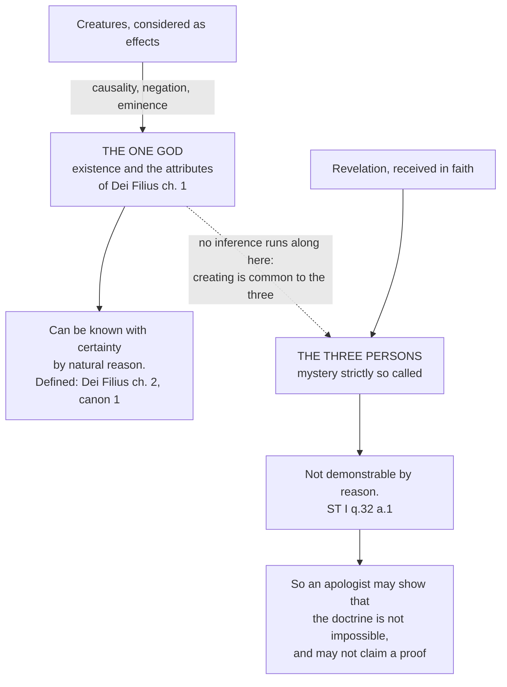

# The Triune God · Lesson 1.2: The one true God, and what reason can reach

> ⏱ ~15 min · Module 1: De Deo Uno - the one God the Church confesses · Builds on: [1.1](01-01-the-treatise-and-its-order.md) · Unlocks: [1.3](01-03-simplicity-as-doctrine.md), [1.4](01-04-immutability-eternity-immensity.md)

## Why this matters

[1.1](01-01-the-treatise-and-its-order.md) settled the order of the treatise: the one God first, then the three. This lesson supplies the content of that first half from the two texts that define it — Lateran IV's opening confession (1215) and the First Vatican Council's *Dei Filius*, chapter 1 (1870) — and then draws the line the rest of the course lives inside. Two claims about knowing God sit here, pointing opposite ways. That the one true God can be known with certainty by natural reason is **defined**. That the trinity of persons can be known that way is **denied by the tradition outright**. Get the pair straight now and you will never mistake a pious argument for a proof, or a mystery for an absurdity.

## The idea

Take the two halves separately.

**The one God comes with a job description, and it is on the record.** When you say "God" in this course you do not mean whatever a reader supplies, but a being with a listed set of attributes, confessed in two conciliar texts, and the list is short enough to memorise. Two of its items — *altogether simple*, *unchangeable* — are the whole business of [1.3](01-03-simplicity-as-doctrine.md) and [1.4](01-04-immutability-eternity-immensity.md). One of them, *infinite in intelligence and will*, is the premise Module 4's two processions run on: a God with no intellect and no will has nothing in him for a word or a love to proceed from ([4.3](04-03-the-two-processions.md)).

**Reason gets to the door and no further.** What is known from created things is the one God, not the three persons. An effect shows you its cause only under the description by which it caused; creating is the work of the whole Trinity undividedly, so creatures point back to the one creative power and not to the distinction of persons. That makes the Trinity a **[mystery strictly so called](../reference.md#mystery-strictly-so-called)**: a truth reason will never reach on its own and, once it has been given, will never refute either.

The word to get right is *[incomprehensible](../reference.md#incomprehensibility)*. It does not mean *unknowable*. It means that no created mind ever takes the measure of God — grasps him in the way he is graspable — even the blessed in heaven, seeing him.

## Source

*Dei Filius*, the dogmatic constitution on the Catholic faith of the First Vatican Council, chapter 1, "Of God, the Creator of all Things", opening confession (Schaff, *Creeds of Christendom*, vol. II):

> The holy Catholic Apostolic Roman Church believes and confesses that there is one true and living God, Creator and Lord of heaven and earth, almighty, eternal, immense, incomprehensible, infinite in intelligence, in will, and in all perfection, who, as being one, sole, absolutely simple and immutable spiritual substance, is to be declared as really and essentially distinct from the world, of supreme beatitude in and from himself, and ineffably exalted above all things which exist, or are conceivable, except himself.

One sentence; every clause load-bearing.

## The argument

### The chain, clause by clause

| The council's words | What the clause does |
|---|---|
| one true and living God | rules out many gods, and a merely postulated first principle — *vivum*, living |
| Creator and Lord of heaven and earth | he made all that is, and governs it; not a craftsman shaping found material |
| almighty, eternal, immense, incomprehensible | power without limit; no beginning or succession; no measure ([1.4](01-04-immutability-eternity-immensity.md)); never grasped by a created mind |
| infinite in intelligence, in will, and in all perfection | God knows and wills, and neither is bounded — the datum Module 4 builds on |
| one, sole, absolutely simple and immutable spiritual substance | [1.3](01-03-simplicity-as-doctrine.md) and [1.4](01-04-immutability-eternity-immensity.md) own these two |
| really and essentially distinct from the world | not the world's soul, not its substance, not its unfolding |
| of supreme beatitude in and from himself | God is not completed, enriched or fulfilled by creating |
| ineffably exalted above all things which exist, or are conceivable | no concept of ours contains him |

*In words:* one living God, unlimited in every way, who is not the world and does not need it.

Two clauses repay a second look. **["Really and essentially distinct"](../reference.md#really-and-essentially-distinct-from-the-world)** is aimed at pantheism, and the chapter's own canons say so: an anathema falls on anyone saying that God and all things have one and the same substance or essence, or that finite things emanated from the divine substance, or that the divine essence becomes all things by its own unfolding. **"Of supreme beatitude in and from himself"** closes the back door. A God who created in order to have someone to love, or to become fully himself, would have his beatitude partly *from* the world. The council says *in se et ex se*; the reason it then gives for creation is not need but generosity — to manifest his perfection through the goods he gives.

### Lateran IV: the same God, with the three named

[*Firmiter*](../reference.md#firmiter), the first constitution of the Fourth Lateran Council (1215), opens the Church's other great confession of the one God — and it does what *Dei Filius* does not, naming the three at once (the lesson's own translation of the Latin):

> *tres quidem personae, sed una essentia, substantia seu natura simplex omnino* — three persons indeed, but one essence, substance or nature, altogether simple.

Two words decide the reading. *Quidem … sed* — "indeed … but" — concedes the three and immediately denies that they multiply anything; and *seu*, "or", flattens *essence*, *substance* and *nature* into one thing, so no one can shelve the persons under one and the unity under another. The same paragraph confesses one God *aeternus, immensus et incommutabilis, incomprehensibilis, omnipotens et ineffabilis* — the list Vatican I repeats almost word for word six and a half centuries later — and calls the three together *unum universorum principium*, one principle of all things: creation comes from the Trinity as from one source, not from the Father through subordinate agents.

*In words:* Lateran IV gets the whole Trinitarian problem into one clause — three, and yet not three of anything. [3.4](03-04-the-latin-rules-of-speech.md) reads the rest of it as a rule of speech.

### What reason reaches, and what it does not

**Reason reaches the one God.** That the one true God, our Creator and Lord, can be certainly known by the natural light of human reason through created things is defined, with an anathema, in *Dei Filius* chapter 2 and its first canon — a dogma about a capacity, not a performance, with no argument canonised, owned by [`fundamental-theology` 1.2](../../fundamental-theology/lessons/01-02-natural-knowledge-of-god.md) and not re-taught here. The route reason takes belongs to [`thomistic-synthesis` 4.2](../../thomistic-synthesis/lessons/04-02-knowing-god-from-creatures-the-three-ways.md).

**Reason does not reach the three.** ST I q.32 a.1 argues in two steps. By natural reason we know God only from creatures, as effects show a cause; but the creative power is common to the whole Trinity, belonging to the unity of the essence and not to the distinction of persons. *In words:* the evidence reason has is the wrong kind — it carries information about what the three have in common, and about nothing else. Then the practical half, which is the hinge of Module 2: an apologist who brings forward non-cogent arguments exposes the faith to the ridicule of unbelievers, who conclude that this is what our belief rests on.

**Level.** Both texts are solemn acts of ecumenical councils professing the Catholic faith, so the attributes they confess are held as divinely revealed — **rung 1** on the ladder of [`fundamental-theology` 4.4](../../fundamental-theology/lessons/04-04-the-ladder-of-doctrinal-authority.md). Five claims of [*Dei Filius* chapter 1](../reference.md#dei-filius-chapter-1) additionally carry canons with anathemas: one true God, creator and lord of things visible and invisible; that matter is not all there is; that God's substance is not the world's; that finite things did not emanate from the divine substance; and that the world was created from nothing, freely, for God's glory. Where a canon bites, no reading of the chapter can soften it. That the Trinity is not demonstrable is not a definition of that kind but the tradition's constant teaching, and the same constitution teaches that there are mysteries hidden in God which cannot be known unless revealed.

## The rule

The dotted edge is the lesson. Everything above it is reachable; nothing crosses it.

## Worked examples

**Example 1 — the machinery on a clean case: *immense*.** A reader meets "immense" in the Source and hears *enormous*. Run the clause instead. The Latin *immensus* is *in-mensus*, unmeasured: what has no measure, since measure implies a limit set from outside. The council pairs it with *incomprehensible* and *infinite in all perfection*, which fixes the sense — a denial, not a superlative. And the denial can be checked: something merely enormous is still on a scale with what is smaller, whereas the same sentence puts God *ineffably exalted above all things which exist, or are conceivable*, off every scale. So "immense" does not say God is very large; it says nothing bounds him, space included — which is why [1.4](01-04-immutability-eternity-immensity.md) gets God's presence to every creature out of the word rather than his size.

**Example 2 — where it strains: the apologist with an argument from love.** Richard of St Victor argued in the twelfth century that perfect charity cannot be solitary: love requires another to be loved, and supreme love a third to be loved in common, so the highest good must be plural. Does q.32 a.1 forbid this? No, and the distinction is exact. What is forbidden is claiming these arguments are **cogent demonstrations of a truth of faith**. Aquinas himself makes word and love the framework of his whole Trinitarian treatise ([4.3](04-03-the-two-processions.md)) while denying that it proves anything to someone who does not already hold the faith; for such a reader, he says, it suffices to show that what faith teaches is not impossible. The same argument can thus be offered in two ways, one licit and one not, and the difference lies entirely in what the speaker claims for it. Hence the course's discipline: the psychological analogy is the tradition's explanation of the dogma, never the dogma, and never a proof of it.

## Watch out

- **You might think "really and essentially distinct from the world" puts God at a distance.** It denies that God is the world's substance, not that he is present to it — the same tradition holds God more intimately present to each thing than it is to itself ([1.4](01-04-immutability-eternity-immensity.md)). Read the clause as spatial withdrawal and you have traded pantheism for deism.
- **You might think a strong argument for the Trinity is a good apologetic.** Offered as a proof, q.32 a.1 says it damages the faith twice over. Offered as a display of the doctrine's coherence, it is the recommended move.
- **The opposite error is fideism**: treating "not demonstrable" as "not rationally defensible", or as licence for silence when the doctrine is called incoherent. The Church condemns that too — [`fundamental-theology` 2.3](../../fundamental-theology/lessons/02-03-fideism-and-rationalism.md).
- **Watch the phrase "God is one substance who shows himself as three."** That is **modalism**: it makes the three modes of appearance to us rather than really distinct in God. *Firmiter*'s *tres quidem personae* is precisely what blocks it, and the persons' real distinction is [4.4](04-04-four-relations-three-persons.md).
- **Do not promote the explanation.** That the Son proceeds by way of intellect and the Spirit by way of will is the Latin tradition's account, carried by the common doctor and fixed by no conciliar act — **rung 5**, freely disputed. Calling it dogma is graded as strictly as denying one.

## One-liner

> Reason can get you to the one God, unmeasured and unneedy, and no further — the three are given, not deduced, and an argument that claims otherwise wounds the faith it means to serve.

## Problems

**P1 (🟢) *(Exegetical.)*** From the *respondeo* of ST I q.32 a.1 (English Dominican Province translation):

> Whoever, then, tries to prove the trinity of persons by natural reason, derogates from faith in two ways. Firstly, as regards the dignity of faith itself, which consists in its being concerned with invisible things, that exceed human reason. … Secondly, as regards the utility of drawing others to the faith. For when anyone in the endeavor to prove the faith brings forward reasons which are not cogent, he falls under the ridicule of the unbelievers: since they suppose that we stand upon such reasons, and that we believe on such grounds. Therefore, we must not attempt to prove what is of faith, except by authority alone, to those who receive the authority; while as regards others it suffices to prove that what faith teaches is not impossible.

For each sentence below, say whether the passage permits it, forbids it, or says something else — and name the words that decide. **One sentence each.**

(a) "Reason alone shows that perfect love needs three, so the Trinity is demonstrated."
(b) "No argument shows the Trinity to be impossible, and I can answer each one that claims to."
(c) "Since the Trinity cannot be proved, there is nothing to say to someone who does not accept the Church's authority."

**P2 (🟡) *(Exegetical.)*** An invented paragraph from a parish catechetical handout:

> The Church teaches that God is one substance who meets us in three ways: as Father above us, as Son beside us, as Spirit within us. Reason can reach all of this on its own — once you see that love needs a lover, a beloved and the bond between them, the three persons follow necessarily. Vatican I taught as much when it called God infinite in intellect and will.

Each sentence contains a distinct error. Name all three, and for each cite the text that corrects it. **150 words or fewer.**

**P3 (🔴) *(Exegetical.)*** Assign a level on the ladder to each claim, and **name the act that fixes it** — or say that no act does. **One sentence each.**

(a) God is really and essentially distinct from the world.
(b) The Son proceeds from the Father by way of intellect, as a word from a mind.

Solutions

**P1** *(Exegetical.)*

**Must hit, strict:** (a) forbidden, by "tries to prove … derogates from faith"; the vice is the claim of demonstration, not the use of the love analogy. (b) permitted, and named as the right move: "as regards others it suffices to prove that what faith teaches is not impossible" — defending is not proving. (c) says something else: the passage directs argument *from authority* to those who accept the authority and the not-impossible defence to everyone else, so it prescribes what to say rather than silence.

**Wrong turns:** reading (b) as forbidden too, on the ground that it is still arguing about a mystery — the text explicitly licenses it. Reading (a) as permitted because Aquinas elsewhere uses the analogy of word and love; he does, as an exposition of a doctrine already held, which is a different speech act.

**Model answer:** (a) Forbidden — "tries to prove the trinity of persons by natural reason, derogates from faith" names exactly this claim. (b) Permitted, indeed recommended: "it suffices to prove that what faith teaches is not impossible." (c) Neither; the passage assigns two different arguments to two audiences ("by authority alone, to those who receive the authority; while as regards others …"), so it tells you what to say, not to stop talking.

**P2** *(Exegetical.)*

**Must hit, strict:** all three, in order.
1. **Modalism.** "One substance who meets us in three ways" makes the three ways of appearing to us rather than really distinct in God; the giveaway is that each person is described by a relation to *us* (above, beside, within). Corrected by *Firmiter*: *tres quidem personae, sed una essentia* — three persons indeed, conceded before the unity is asserted.
2. **Claiming a demonstration of the Trinity.** Corrected by ST I q.32 a.1: natural reason works from creatures, and the creative power is common to the three, so it reaches the unity of the essence only. The love argument may be offered as showing the doctrine is not impossible; "follow necessarily" is what the article forbids.
3. **Misusing a council, and promoting an explanation to dogma.** *Dei Filius* ch. 1 predicates "infinite in intelligence, in will, and in all perfection" of the **one God** and says nothing about the persons; treating the Latin account of procession by intellect and will as conciliar teaching is the course's second standing error.

**Wrong turns:** calling sentence 1 tritheism — the error runs the other way, since the paragraph is *too* unitary. Saying the love argument is condemned; what is faulted is the claim made for it. Reading sentence 3 as merely a sloppy citation, and missing the level error underneath it.

**Model answer:** Sentence 1 is modalist: three ways of meeting us are not three persons really distinct in God, which is what *Firmiter*'s *tres quidem personae, sed una essentia* insists on. Sentence 2 claims a demonstration of the Trinity from reason, which ST I q.32 a.1 denies is possible — creatures are effects of a power common to the three — and warns that claiming one damages the faith; the argument from love is licit only as a display of coherence. Sentence 3 misreads *Dei Filius* ch. 1, which calls the **one God** infinite in intellect and will and defines nothing about how the persons proceed, and in doing so promotes the Latin explanation of the dogma to the level of a conciliar definition.

**P3** *(Exegetical.)*

**Must hit, strict:** (a) **rung 1**, proposed as divinely revealed; the act is the First Vatican Council's dogmatic constitution *Dei Filius*, whose chapter 1 confesses it and whose canons on God the creator attach an anathema to the claim that God and all things have one and the same substance or essence. Credit for adding Lateran IV's *Firmiter* as the earlier conciliar confession of the same God. (b) **rung 5** — freely disputed; **no magisterial act fixes it.** It is the common teaching of the Latin theological tradition, carried by Aquinas; what is defined is that the Son is eternally begotten of the Father, not the account of *how*.

**Wrong turns:** calling (b) rung 3 because it appears in catechetical material — rung 3 requires an authentic magisterial act teaching it, and repetition by theologians is not one. Calling (a) rung 2 on the ground that "God is not the world" is a philosophical corollary rather than revealed; the canon proposes it as belonging to the faith, and canon 749 §3's discipline about defaulting down applies to ambiguity, not to an explicit anathema.

**Model answer:** (a) Rung 1, fixed by *Dei Filius* (Vatican I, 1870): chapter 1 confesses God as really and essentially distinct from the world, and the chapter's canons anathematize anyone saying God's substance or essence is one and the same as that of all things. (b) Rung 5: no council or pope has taught it; it is the Latin tradition's explanation of the eternal generation, which is itself defined, and treating the explanation as dogma is an error.

## Connections

- **Backward:** [1.1](01-01-the-treatise-and-its-order.md) argued that the treatise begins with the one God because that is the road of knowledge; this lesson is why the claim is more than a preference — reason really does reach that far and no further. The route it takes is [`thomistic-synthesis` 4.2](../../thomistic-synthesis/lessons/04-02-knowing-god-from-creatures-the-three-ways.md), and the dogma about the route is [`fundamental-theology` 1.2](../../fundamental-theology/lessons/01-02-natural-knowledge-of-god.md).
- **Forward:** [1.3](01-03-simplicity-as-doctrine.md) and [1.4](01-04-immutability-eternity-immensity.md) take *altogether simple*, *unchangeable* and *immense* out of the Source and ask what each commits a Catholic to; [1.5](01-05-impassibility-and-the-god-who-suffers.md) tests the whole list against the modern case for a suffering God. "Infinite in intelligence and in will" is the clause [4.3](04-03-the-two-processions.md) needs before it can say there are exactly two processions. [2.1](02-01-the-one-god-of-israel.md) opens the other half of the story: where the one God of this confession was first confessed.
- **Sideways:** whether these attributes are *coherent* — omnipotence against freedom, timeless eternity, the property objection to simplicity — belongs to [`philosophy-of-religion`](../../philosophy-of-religion/syllabus.md), which never asks what the Church defines; incomprehensibility carried through to the beatific vision, where the blessed see God without comprehending him, belongs to [`creation-grace-last-things`](../../creation-grace-last-things/syllabus.md). The arguments an apologist may actually make once a proof is off the table are [`apologetics-catholic-claims`](../../apologetics-catholic-claims/syllabus.md); the story of the two councils as events is [`church-history`](../../church-history/syllabus.md).
