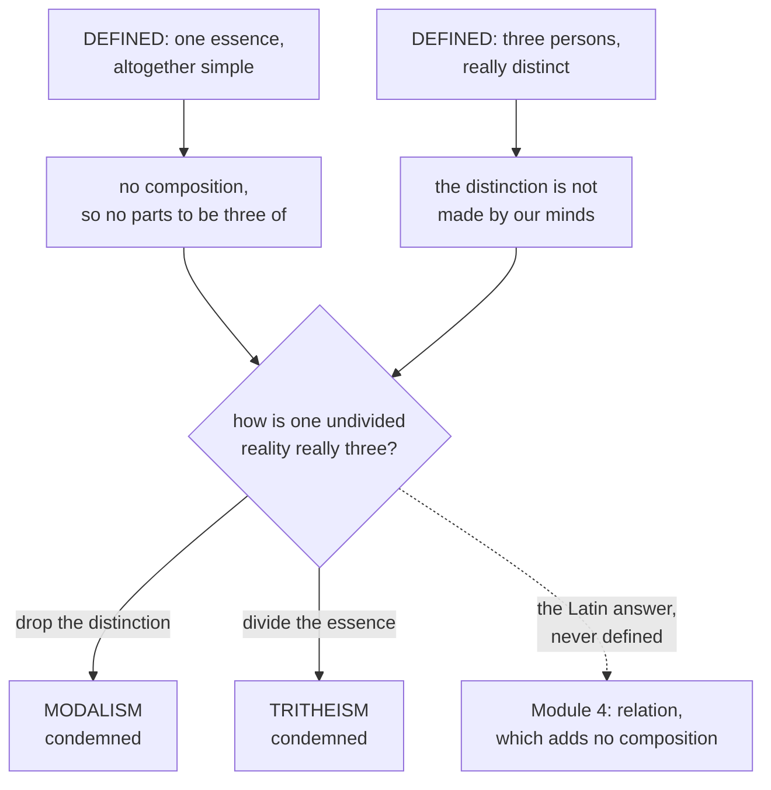

# The Triune God · Lesson 1.3: Simplicity as doctrine

> ⏱ ~15 min · Module 1: De Deo Uno - the one God the Church confesses · Builds on: [1.2](01-02-the-one-true-god-and-what-reason-can-reach.md), [`thomistic-synthesis` 3.4](../../thomistic-synthesis/lessons/03-04-divine-simplicity-and-the-attributes.md) · Unlocks: [1.4](01-04-immutability-eternity-immensity.md), [3.4](03-04-the-latin-rules-of-speech.md), [4.4](04-04-four-relations-three-persons.md)

## Why this matters

Most of Module 1 tells you what the Church defines about God. This lesson tells you the one thing that will make the rest of the course hard. Divine simplicity is not a decorative superlative; it is a denial, and what it denies is any composition in God at all — including any composition of three persons with one essence. The council that says "three persons" says, in the same sentence, "one essence, substance or nature altogether simple." Module 4 spends five lessons on the problem that sentence creates.

## The idea

[Simplicity](../reference.md#altogether-simple) is a negation, and reading it as a positive description is the first mistake. "God is simple" does not mean God is easy, or thin, or a bare minimum. It means: there is nothing in God that is not God. No parts, no ingredients, no subject underneath the attributes holding them the way a wall holds its paint.

Why a first being can have no composition, and how the derivation of *Summa Theologiae* I qq.4-11 runs off that, you have from [`thomistic-synthesis` 3.4](../../thomistic-synthesis/lessons/03-04-divine-simplicity-and-the-attributes.md), which ends by handing this course what it keeps: **simplicity as Church teaching**. So three questions here, none of them metaphysical.

1. What is a Catholic actually committed to?
2. What is left to the schools?
3. What does the commitment cost, once you must also say that God is three?

The third is why this lesson sits in Module 1 and not in a course on the attributes. A God with parts could be triune cheaply: one part Father, one part Son, one part Spirit, nothing left to explain. Simplicity closes that road before it opens. Everything Module 4 does — processions that are not productions, relations that are not accidents, persons that are not parts — is work inside a space this doctrine has already made very narrow.

## Source

The Fourth Lateran Council (1215), the opening constitution, known from its first word as *Firmiter*. The Latin is the conciliar text, punctuated; the English is the lesson's own, since no public-domain English exists.

> Firmiter credimus et simpliciter confitemur quod unus solus est verus deus aeternus et immensus omnipotens incommutabilis incomprehensibilis et ineffabilis, pater et filius et spiritus sanctus: tres quidem personae, sed una essentia, substantia seu natura simplex omnino.
>
> We firmly believe and straightforwardly confess that there is one only true God, eternal and immense, almighty, unchangeable, incomprehensible and ineffable, Father and Son and Holy Spirit: three persons indeed, but one essence, substance or nature altogether simple.

Three things to notice.

**The attributes belong to the one God, and the persons are named inside that predication.** The sentence does not describe a divine nature and then add three persons to it: *pater et filius et spiritus sanctus* stands in apposition to *unus solus verus deus*, so the one true God *is* Father and Son and Holy Spirit. [1.1](01-01-the-treatise-and-its-order.md) asked whether it is wise to treat the one God before the three; *Firmiter* declines to treat them apart at all.

**The adversative is doing the defining.** *Tres quidem personae, sed una essentia* — three persons indeed, *but* one essence. The council sees "three persons, therefore three somethings" coming and blocks it in the same breath.

**Omnino.** Not "simple in a manner of speaking", not "simple as regards bodily parts". Altogether. Vatican I repeats the word seven centuries later: *Dei Filius* ch. 1 confesses one God who, "as being one, sole, absolutely simple and immutable spiritual substance, is to be declared as really and essentially distinct from the world" — Schaff's public-domain rendering of *una singularis, simplex omnino et incommutabilis substantia spiritualis*.

## The argument

### What a Catholic is committed to

Three denials follow from that one word, and all three govern how we speak.

**1. [The attributes are not parts](../reference.md#the-attributes-are-not-parts).** God's mercy and God's justice are not two constituents that between them make up God, as bricks and mortar make a wall. *In words:* God is no assembly, however grand the pieces.

**2. They are not really distinct from the essence, or from each other.** There is no seam inside God with justice on one side and mercy on the other; whatever is in God is the divine essence. *In words:* "God is just" and "God is merciful" name one reality twice, under two concepts we cannot merge.

**3. They are not accidents.** Nothing in God is had rather than been. *In words:* God does not possess goodness; God is goodness.

Levels, on the ladder of [`fundamental-theology` 4.4](../../fundamental-theology/lessons/04-04-the-ladder-of-doctrinal-authority.md). That God is altogether simple is proposed as the Catholic faith by the solemn confession of an ecumenical council, twice over — **rung 1**, believed with theological faith. The three denials are not further doctrines stacked on top; they are what *omnino* excludes.

### Where the schools begin

What is left open is how to analyse it. This is the cleanest level case in the course.

The Thomist account identifies the divine essence with the act of existing, and treats the difference between wisdom and goodness in God as a distinction of reason with a foundation in the thing: our concepts are many because drawn from many creaturely perfections, each an inadequate grasp of one undivided reality. Scotus objects that this makes the difference our doing, and holds instead a [formal distinction](../reference.md#the-formal-distinction) — wisdom and goodness are distinct *formalities* on the side of the thing, prior to any act of our minds, in a reality nonetheless wholly indivisible. Thomists answer that no such middle distinction exists; it collapses into a real distinction or into a distinction of reason. Scotists answer that this assumes the two-way division it needs to prove.

Both positions lie below the seam of the ladder, freely disputed among Catholics, and **both affirm *Firmiter***. Calling the formal distinction a denial of simplicity promotes a school's analysis to a council's level; calling simplicity "the Thomist view of God" demotes a council's definition to a school's analysis. The Authority discipline in the [syllabus](../syllabus.md) grades both strictly — they are one error facing opposite ways.

### The rule that governs the words

The same council's second constitution rejects Joachim of Fiore's account of how the divine persons are one, and closes with a sentence that has governed Catholic God-talk ever since:

> quia inter creatorem et creaturam non potest tanta similitudo notari, quin inter eos maior sit dissimilitudo notanda
>
> because between creator and creature no likeness can be noted so great that a greater unlikeness is not to be noted between them (the lesson's translation)

*In words:* every true thing you say about God on the strength of a creature is outrun by what the comparison gets wrong. [The greater-dissimilarity rule](../reference.md#the-greater-dissimilarity-rule) is not scepticism — the council has just spent a page arguing about the divine substance, so it plainly holds that true things can be said. It is a ranking: the likeness is real; the unlikeness is greater. What keeps that from paralysing speech is analogy, which belongs to [`thomistic-synthesis` 4.4](../../thomistic-synthesis/lessons/04-04-analogy.md). Note where the council states the rule: inside a Trinitarian argument. It is a rule for this subject first.

### What this course does not ask

A simple God identical with his own attributes draws two standard objections: the **property objection**, that God cannot be a property since properties neither cause nor know anything, and **modal collapse**, that if God is his own act of will and God is necessary, everything he wills is necessary. Both are serious, and both belong to [`philosophy-of-religion`](../../philosophy-of-religion/syllabus.md) 1.4. The refusal is principled, not evasive: they ask whether the doctrine is philosophically defensible, while this course asks only what the Church teaches, in which text, at what level. Letting a philosophical verdict settle a doctrinal question is the confusion this course exists to prevent.

## The squeeze

Two solid boxes at the top, both rung 1. Two exits, both condemned. One dashed edge, which is theology and not dogma, and which Module 4 spends five lessons earning. [The squeeze](../reference.md#the-trinitarian-squeeze) is why *De Deo Uno* is taught before *De Deo Trino*.

## Worked examples

**Example 1 — the clean case.** A homilist wants to say that at the cross God's justice and his mercy meet. Simplicity does not forbid the sentence; it fixes what makes it true. There are not two dispositions in God to be reconciled, one holding out for payment and one for pardon. "Just" and "merciful" are two of our concepts, taken from two creaturely perfections, naming one undivided reality — denial 2. The greater-dissimilarity rule sets the terms: a just judge and a merciful friend are real likenesses, and the unlikeness is greater, since in neither creature are the two the same thing. What the homilist may not say is that God "balances" mercy against justice, or that one "wins": that puts parts in God and sets them competing. What he is reaching for, simplicity underwrites rather than threatens.

**Example 2 — where it strains.** Run denial 2 on the persons. Whatever is in God is the divine essence; the Father is in God, so the Father is the divine essence; the Son likewise; and two things identical with a third are identical with each other. So the Father is the Son — denied by *Firmiter* in the same sentence that calls the essence altogether simple.

Nothing in Module 1 gets you out of that. Lateran IV's second constitution shows the pressure applied rather than relieved: the Father cannot have given the Son a part of his substance and kept a part, "since the Father's substance is indivisible, being altogether simple" — *utpote simplex omnino*. Simplicity there is a premise in a Trinitarian argument — the shape of everything that follows. What the doctrine supplies is only the form of an answer: whatever distinguishes the persons must add no composition to what it is in. The Latin tradition's candidate is relation, and the case that relation alone does this, that there are four of them and three persons, is [4.3](04-03-the-two-processions.md) and [4.4](04-04-four-relations-three-persons.md). Keep two things apart meanwhile. That the persons are really distinct in an altogether simple God is defined. That they are distinct *as subsistent relations* is the common doctor's explanation, never defined as such.

## Watch out

- **Modalism is the near occasion here.** The quickest way to honour simplicity is to say the three are three ways the one God turns toward us. That is Sabellianism, condemned in the third century, and it denies the first half of the sentence that defines the second — [`patristics` 2.3](../../patristics/lessons/02-03-tertullian.md) has Tertullian against Praxeas. Any formula in which we supply the distinction of persons has already gone over.
- **Tritheism is the other exit.** "Three persons share the divine nature as three men share humanity" — the comparison Gregory of Nyssa handles with great care in *To Ablabius*, [`patristics` 3.3](../../patristics/lessons/03-03-the-two-gregories.md) — turns the nature into a kind and the persons into its instances. A kind is not *una essentia, substantia seu natura simplex omnino*.
- **You might think "not really distinct" means "merely verbal".** It does not. On the Thomist account the distinction between wisdom and goodness has a foundation in the thing: God really is what each concept imperfectly grasps. Reducing the attributes to our vocabulary is a different error from dividing him, and both are ruled out.
- **You might think the greater-dissimilarity rule licenses silence.** It ranks two true things; it does not cancel the first. Lateran IV states it at the end of an argument, not in place of one.
- **Do not promote the analysis.** "Divine simplicity means God's essence is his act of existing" states a Thomist thesis as though it were the definition. The definition is the word *omnino*; the thesis is one school's account of it, and Scotus's is another.

## One-liner

> Simplicity is the Church's most expensive doctrine: it buys a God with nothing in him that is not God, and the bill falls due the moment you have to say that this God is three.

## Problems

**P1 (🟢) *(Exegetical.)*** From Lateran IV's second constitution, against Joachim of Fiore, on the Father's begetting of the Son. The lesson's own translation of the Latin:

> "...nor can it be said that he gave him a part of his substance and kept a part for himself, since the Father's substance is indivisible, being altogether simple. Nor again can it be said that in begetting, the Father transferred his substance into the Son, as though he gave it to the Son in such a way as not to keep it himself — otherwise he would have ceased to be a substance. It is plain, therefore, that without any diminution the Son in being born received the substance of the Father, and so the Father and the Son have the same substance, and thus the Father and the Son are the same reality, and so too the Holy Spirit proceeding from both."

(a) The passage rules out two ways of construing the begetting. Name each, and give the words that rule it out. **One sentence each.** (b) One premise of the argument is the doctrine this lesson is about. Name it, quote the phrase that carries it, and say what the argument loses if it is dropped. **Two sentences.**

**P2 (🟡) *(Exegetical.)*** An invented paragraph from a parish study guide:

> "Think of God as a perfect diamond. The Father is the stone's strength and its law; the Son is its warmth and its mercy; the Spirit is its light and its love. Turn the diamond and a different face catches the sun, but it is one stone, and each face is simply God shown to us at a different angle. That is why the Old Testament feels severe and the Gospels feel tender: the same God, a different face."

(a) Name the two errors, and for each give the clause of *Firmiter* it contradicts. (b) Say what true thing the paragraph is reaching for. **80 words or fewer in total.**

**P3 (🔴, optional) *(Exegetical.)*** A reader who has just met both halves of *Firmiter* offers two ways to make them fit:

> (i) "The three are not distinct in God himself. They are three relations God stands in toward us — creator, redeemer, sanctifier — so the distinction is in the economy, not in the essence."
>
> (ii) "The divine essence is one nature that the three persons each instantiate perfectly and without remainder, the way three correct answers instantiate one right answer."

(a) For each proposal, name the clause of *Firmiter* it saves, the clause it loses, and the heresy it lands in. **One sentence each.** (b) Without using the word "relation", state the constraint any acceptable account must satisfy. **One sentence.** (c) Assign a level to the claim that a divine person is a subsistent relation, and name the act that fixes it. **One sentence.**

Solutions

**P1** *(Exegetical — strict.)*

**Must hit, strict (a):**
- **Partition** — that the Father gave the Son a portion of his substance and retained the rest. Ruled out by "the Father's substance is indivisible, being altogether simple": a part presupposes a divisible whole, and *omnino* has excluded one.
- **Transfer** — that the Father handed his substance over in begetting so as no longer to have it. Ruled out by "otherwise he would have ceased to be a substance," which is absurd of God, and is why the conclusion insists the Son received it "without any diminution."

**Must hit, strict (b):** **divine simplicity**, carried by "since the Father's substance is indivisible, being altogether simple" — the phrase is the reason indivisibility is available as a premise at all. Drop it and the partition reading revives: begetting could hand over a portion of the divine substance, and the Son would have less than the whole of it, which is the subordinationist result; the conclusion would also weaken from "the Father and the Son are the same reality" to "the Father and the Son are of the same kind," which is the tritheist result.

**Wrong turns:** reading "the Father and the Son are the same reality" as erasing the distinction of persons — this is a constitution defending the persons against Joachim, and the council's own first constitution says *tres quidem personae*; naming immutability as the premise, which the passage never invokes; treating "without any diminution" as a premise when the text presents it as the conclusion the two exclusions force.

**Model answer:** (a) Partition is excluded because the Father's substance is "indivisible, being altogether simple," so there are no portions to give; transfer is excluded because a Father who did not retain his substance "would have ceased to be a substance." (b) The premise is simplicity, in the clause "indivisible, being altogether simple." Without it the argument cannot exclude a partial giving, so the Son could receive less than the whole divine substance, and "the same substance" would collapse into sameness of kind rather than the identity of reality the passage concludes to.

---

**P2** *(Exegetical — strict.)*

**Must hit, strict (a):** two errors, each tied to a clause.
1. **Modalism.** "Each face is simply God shown to us at a different angle," and "the same God, a different face," make the threeness a matter of how the one God appears to the viewer. That contradicts *tres quidem personae*: the persons are really three in God, not three aspects under which one thing is seen.
2. **Composition, with the attributes distributed among the persons.** Strength and law, warmth and mercy, light and love are handed out one set per person, and facets are parts of a stone. That contradicts *una essentia, substantia seu natura simplex omnino* — the attributes are not parts and are not really distinct from the essence, so none of them can be one person's share. (Mercy and power are in fact *appropriated* to persons in Catholic usage, which is a way of speaking and not a division of property; that is [4.5](04-05-common-proper-appropriated.md).)

**Must hit, strict (b):** that the whole God, not a third of him, is met in each person — and that the God of the Old Testament and the God of the Gospels are one and the same.

**Wrong turns:** objecting that God should not be compared to a diamond at all — the greater-dissimilarity rule allows creaturely images and ranks them, so the fault lies in what this image asserts, not in its being an image; naming the severe-versus-tender contrast as the error, which is a symptom of the modalism rather than the error itself; calling the paragraph tritheist, which is the opposite mistake to the one it makes.

**Model answer:** (a) Modalism — "each face is simply God shown to us at a different angle" makes the three a matter of appearance, against *tres quidem personae*. And composition — the attributes are dealt out to the persons as facets of one stone, against *una essentia ... simplex omnino*. (b) It is reaching for the truth that the whole God is met in each person, and that the same God speaks in both testaments.

---

**P3** *(Exegetical — strict.)*

**Must hit, strict (a):**
- **(i)** Saves the unity and simplicity of the essence; loses *tres quidem personae*, since the distinction is relocated into God's dealings with us; lands in **modalism**. Credit for noticing that "creator, redeemer, sanctifier" is a list of works and not of persons.
- **(ii)** Saves the real distinction of the three; loses *una essentia ... simplex omnino*, because a nature that several things instantiate is a kind, and its instances are three beings; lands in **tritheism**.

**Must hit, strict (b):** whatever distinguishes the three must be such that it puts no composition into the one it is in — it can neither be a part of the essence, nor an addition to it, nor something we supply. Any wording that says this passes; a wording that merely restates the two defined clauses does not.

**Must hit, strict (c):** **no magisterial act proposes it**, so the claim sits below the seam of the ladder as a theological note, not as dogma. Either "theologically certain or common teaching" or "freely disputed" is acceptable provided the reason given is the absence of an act, together with the observation that what *is* defined is only that the three persons are really distinct in one simple essence. Calling it a defined dogma is the error this course grades most strictly.

**Wrong turns:** answering (b) with "they are subsistent relations," which the instruction forbids and which anticipates [4.4](04-04-four-relations-three-persons.md) rather than stating the constraint that lesson has to meet; assigning (c) a level from the authority of Aquinas rather than from the act, since a doctor's authority is not a magisterial act; swapping the two heresies in (a).

**Model answer:** (a) Proposal (i) keeps the simple essence but dissolves the three into ways God acts toward us, which denies *tres quidem personae* and is modalism; proposal (ii) keeps the real distinction but turns the essence into a kind with three instances, which denies *una essentia ... simplex omnino* and is tritheism. (b) Whatever makes the three to be three must add nothing to the one it is in and must not be our doing. (c) No council or papal act proposes it, so it sits below the seam as the common teaching of the Latin school, carried by the common doctor — a theological note, not a rung of magisterial teaching.

## Flashback

**From Lesson [1.1](01-01-the-treatise-and-its-order.md) (The treatise and its order):** *(Exegetical.)* A parish plans a six-evening course on God: (1) "Can we know that God exists?"; (2) "What the one God is like: simple, unchanging, everywhere"; (3) "The Father who sends"; (4) "The Son who is sent"; (5) "The Spirit poured out"; (6) "Three persons, one God." A catechist objects that the plan is "the Western mistake" and that a Catholic course has to begin with the Father. (a) Which of the two orders does the plan follow, and which feature of the list decides it? (b) State what is right in the catechist's worry and what is wrong in the way he has put it. **Two sentences per part.**

Solution

**Must hit, strict (a):** the **order of knowledge** — what the *Summa* announces as an order of teaching and what the manuals hardened into *De Deo Uno* followed by *De Deo Trino*. The deciding feature: evenings 1-2 settle that God is and what the one God is like before any person is named, and the three arrive only at 3-6. The order of being would have begun from the Father who begets the Son and breathes forth the Spirit.

**Must hit, strict (b):** *Right* — the danger is real and is the one Rahner named: a God completely described before the three are mentioned leaves them arriving as an appendix, confessed and idle, and whether the arrangement actually does that damage is open among Catholic theologians. *Wrong* — he has turned a choice about teaching into a doctrinal position: what is defined is that God is one and three, not the sequence of chapters, and the order he objects to is also what fences off the field's worst error, arguing one's way to the Trinity and calling the result a proof.

**Wrong turns:** calling the plan heterodox, or the alternative more Catholic, which is exactly the upgrade (b) is testing; leaning on a Greek-versus-Latin divide as established fact, which is de Régnon's schema used as a premise rather than as the loose heuristic most patristic scholarship now allows it to be; answering (a) with "the order of being" because the course culminates in the three — the order of being is fixed by where it *starts*, not where it ends.

**Model answer:** (a) The order of knowledge: it begins where we begin, with that God is and what the one God is like, and names no person until evening 3 — the sequence the *Summa* presents as an order of teaching and the manuals split into two tracts. (b) Right: a God fully described before the persons appear invites Rahner's complaint precisely, and a parish course is where that happens most easily. Wrong: he has made a pedagogical preference into a test of orthodoxy — nobody is more orthodox for starting from the Father, and the order he attacks is also the guard against treating the Trinity as something argued to rather than given.

## Connections

- **Backward:** [`thomistic-synthesis` 3.4](../../thomistic-synthesis/lessons/03-04-divine-simplicity-and-the-attributes.md) supplied the metaphysics of everything asserted here and the derivation of the attributes from pure act; this lesson takes only the doctrine and its level. [1.2](01-02-the-one-true-god-and-what-reason-can-reach.md) has the rest of *Dei Filius* ch. 1 and of *Firmiter*, and the incomprehensibility clause that the greater-dissimilarity rule makes operational.
- **Forward:** [1.4](01-04-immutability-eternity-immensity.md) reads immutability and eternity as the same denial continued; [1.5](01-05-impassibility-and-the-god-who-suffers.md) is where the cost of that denial is argued in public. [3.4](03-04-the-latin-rules-of-speech.md) meets *Firmiter* again as one of three sources of a rule of speech, alongside the Athanasian Creed and Florence. Module 4 is the squeeze answered: [4.3](04-03-the-two-processions.md) on procession without change, [4.4](04-04-four-relations-three-persons.md) on relation as the one thing that distinguishes without composing.
- **Sideways:** [`ancient-medieval-philosophy` 8.2](../../ancient-medieval-philosophy/lessons/08-02-scotus-the-univocity-of-being.md) has Scotus's univocity, the thesis next door to the formal distinction met here; [`thomistic-synthesis` 4.4](../../thomistic-synthesis/lessons/04-04-analogy.md) has the analogy that keeps the greater-dissimilarity rule from silencing theology; [`philosophy-of-religion`](../../philosophy-of-religion/syllabus.md) 1.4 owns the property and modal-collapse objections. Levels throughout come from [`fundamental-theology` 4.4](../../fundamental-theology/lessons/04-04-the-ladder-of-doctrinal-authority.md).
