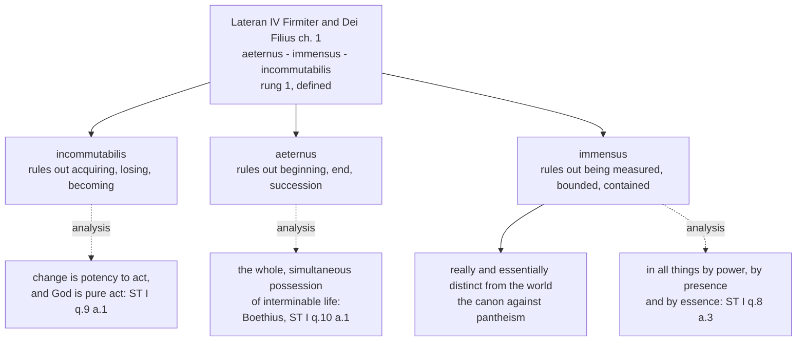

# The Triune God · Lesson 1.4: Immutability, eternity, immensity

> ⏱ ~15 min · Module 1: De Deo Uno - the one God the Church confesses · Builds on: [1.2](01-02-the-one-true-god-and-what-reason-can-reach.md), [1.3](01-03-simplicity-as-doctrine.md) · Unlocks: [1.5](01-05-impassibility-and-the-god-who-suffers.md), [6.1](06-01-the-missions-of-the-son-and-the-spirit.md)

## Why this matters

Three words stand side by side in the Church's two fullest confessions of the one God: *aeternus*, *immensus*, *incommutabilis* — eternal, immense, unchangeable. They read like superlatives: very old, very large, very reliable. They are not. Each denies a limit found in everything else that exists.

Getting them right keeps the Trinity, in Module 4, from turning into a story with a plot — a God who is Father first, then Son, then Spirit. It is also where the treatise first pushes back on something you actually do: if God cannot change, what is asking him for anything?

## The idea

**Unchangeable does not mean inert.** [Change](../reference.md#immutability) in the tradition's sense is the passage from being able to be so to being so — potency to act, the machinery of [`thomistic-synthesis` 2.1](../../thomistic-synthesis/lessons/02-01-act-and-potency-extended.md). A being with no unrealized potency has nothing to acquire and nothing to lose — a claim about *fullness*, not about coldness.

**Eternal does not mean lasting a very long time.** A world with no beginning and no end would still live one moment at a time, losing yesterday and waiting for tomorrow. [Eternity](../reference.md#eternity) is having the whole of one's life at once.

**Immense does not mean enormous.** *Immensus* is *un-measured*: not bounded, not contained, not sized. Its positive consequence matters pastorally: nothing that exists can hold God at a distance, because there is no container he is outside of.

Each is a denial with a positive residue, and in each case the Church defines the denial and leaves the *analysis* to the schools. That gap is the lesson.

## Source

*Dei Filius*, Vatican I, chapter 1, "Of God, the Creator of all things" (Latin from the conciliar acts; English from Manning's translation in Schaff's *Creeds of Christendom*):

> *unum esse Deum verum et vivum ... omnipotentem, aeternum, immensum, incomprehensibilem, intellectu ac voluntate omnique perfectione infinitum; qui cum sit una singularis, simplex omnino et incommutabilis substantia spiritualis, praedicandus est re et essentia a mundo distinctus.*
>
> "there is one true and living God ... almighty, eternal, immense, incomprehensible, infinite in intelligence, in will, and in all perfection, who, as being one, sole, absolutely simple and immutable spiritual substance, is to be declared as really and essentially distinct from the world."

Three things to take from it.

**The list is predicated of the one God, before any mention of three.** Lateran IV's *Firmiter* puts the same words in front of the persons: *unus solus est verus deus aeternus et immensus omnipotens incommutabilis* — "there is one only true God, eternal and immense, almighty, unchangeable" — and only then "three persons indeed, but one essence, substance or nature altogether simple" (the lesson's own translation of the Latin). So these attributes belong to the three together: Module 4 must produce three persons without giving any of them a property the others lack, and this sentence is why.

**One clause is a guardrail, not an attribute.** *Really and essentially distinct from the world* is what stops omnipresence collapsing into pantheism; the council backed it with a canon anathematizing anyone who says the substance and essence of God and of all things are one and the same.

**Nothing here tells you what the words mean.** The text uses *aeternus*; it does not analyse eternity.

## The argument

**1. Unchangeable.** *Incommutabilis*, in the opening confession of Lateran IV and again in *Dei Filius* chapter 1. *In words:* nothing in God passes from possible to actual, and nothing he has can be lost.

Why the tradition holds it: ST I q.9 a.1 gives three arguments — change requires potency and God is pure act; change leaves something composite and God is altogether simple; whatever is moved acquires what it lacked, and infinite perfection has nothing to acquire. That derivation is the Thomist explanation, not the definition ([`thomistic-synthesis` 3.4](../../thomistic-synthesis/lessons/03-04-divine-simplicity-and-the-attributes.md) runs it in full).

What it does not rule out: that God knows, wills and loves creatures. Creating changes the creature, not God — the relation is real on the creature's side and a relation of reason on God's (ST I q.13 a.7, [`thomistic-synthesis` 4.3](../../thomistic-synthesis/lessons/04-03-the-names-of-god.md)).

**2. Eternal.** *Aeternus*, in the same two texts. The Latin tradition's account of what the word means is Boethius's, quoted by Aquinas at ST I q.10 a.1 and treated there as the definition to be defended:

> "Eternity is the simultaneously-whole and perfect possession of interminable life."

*In words:* two denials and a possession. *Interminable* — no beginning, no end. *Simultaneously whole* — no succession. *Possession of life* — not empty duration but a life had entire. Boethius's own contrast, read in its own terms at [`ancient-medieval-philosophy` 5.3](../../ancient-medieval-philosophy/lessons/05-03-time-eternity-and-foreknowledge.md), is with *perpetuity*: endless duration lived piecemeal.

**Now the level judgement, and say it plainly: whether God's eternity is timeless or everlasting is a theological dispute, not a defined point.** That God is eternal and that God is unchangeable are confessed by two ecumenical councils in solemn professions of faith — **rung 1** on the ladder of [`fundamental-theology` 4.4](../../fundamental-theology/lessons/04-04-the-ladder-of-doctrinal-authority.md). That *aeternus* means timelessness in Boethius's sense, rather than duration without beginning or end, is the common teaching of the Latin tradition and has never been defined as such. No conciliar act runs the inference from *eternal* to *simultaneously whole*; the councils use the word and the schools analyse it. Call the analysis **rung 4**, theologically certain, and no higher.

Which does not make the dispute cheap. Anyone arguing for an everlasting God still owes *incommutabilis*, which is defined: a God who acquires new states as the years pass has not qualified the Boethian analysis but denied the attribute it was built to explain. Whether timeless eternity is *coherent*, and whether it rescues foreknowledge, is [`philosophy-of-religion`](../../philosophy-of-religion/syllabus.md)'s question.

**3. Immense.** *Immensus*, in both texts. *In words:* God is not measured or bounded, and so not contained anywhere — from which omnipresence follows, not as a second attribute but as the same one seen from the creature's side.

ST I q.8 a.1 gives the argument. God is in all things not as part of their essence nor as an accident, but as an agent is present to what it acts on. Created being is God's proper effect, and he causes it not only when a thing begins but as long as it is kept in being. Since being is innermost in each thing, God is in all things, and innermostly. *In words:* God is present wherever anything exists, because existing is what he is doing there ([`thomistic-synthesis` 5.1](../../thomistic-synthesis/lessons/05-01-creation-and-conservation.md) takes this into conservation).

Article 3 then sorts the presence into [three modes](../reference.md#immensity-and-omnipresence), and the sorting is polemical — each mode answers a particular denial. God is in all things **by power**, inasmuch as all things are subject to him (against the Manichees, who gave visible things to a rival principle); **by presence**, inasmuch as all things are bare and open to his eyes (against those who exempted lower bodies from providence); **by essence**, inasmuch as he is present to all as the cause of their being (against those who had God create only the first creatures, which created the rest).

"By essence" misfires in English. The reply to the first objection settles it: God is in things by *his own* essence, not by theirs — the same job *Dei Filius* does with "really and essentially distinct from the world", four centuries later.

## The rule

Solid arrows are what the councils define. Dashed arrows are the tradition's analysis of it, at rung 4 — indispensable, and not defined.

Read a dashed edge as the claim the school makes and the council did not. Deny a solid edge and you have denied the faith; deny a dashed one and you have taken a side.

## Worked examples

**Example 1 — the machinery on a clean case. Is God more present in a church than in a warehouse?** Run the three modes of q.8 a.3. By power, equally: both are subject to him. By presence, equally: both lie open to his sight. By essence, equally: he causes the being of each. So in the common modes, no.

But a.3 names a further mode: God is in the rational creature that knows and loves him, and in the saints by grace — the known in the knower, the loved in the lover, which is not the common mode at all. What a church has is not a denser deposit of common presence but people in whom the special mode is at work, and signs ordered to it. (The Real Presence is a third question, ceded to [`sacraments-and-liturgy`](../../sacraments-and-liturgy/syllabus.md), as the indwelling by grace is to `creation-grace-last-things`.) Distinguishing the modes stops omnipresence from flattening into "God is equally everywhere, so nowhere is special."

**Example 2 — where it strains. You pray for your father's recovery, and he recovers.** The dilemma writes itself: either the prayer changed something in God, and God is not *incommutabilis*, or it changed nothing and was theatre.

ST II-II q.83 a.2 takes the second horn first. Providence disposes not only *what* effects shall come about but *from what causes and in what order*, and human acts are among those causes. A prayer is therefore not a lever on God's will from outside it, but one of the causes through which that will produces the effect it disposed to produce. Aquinas's sentence: "we pray not that we may change the Divine disposition, but that we may impetrate that which God has disposed to be fulfilled by our prayers."

*In words:* God's one eternal act includes both your asking and your father's recovery, the second *through* the first. This is where eternity earns its keep: if God's willing were an event in time, "did he decide before or after the prayer?" would be a real and unanswerable question. There is no before or after in God for the prayer to fall on either side of.

Two consequences. **Prayer is not pointless** — remove a cause and you remove the effect it was ordained to produce. And **God is not a vending machine** — the same article says we pray to be reminded of our need of God's help, so a real change does happen, in us. Which of the two you drop decides which error you fall into.

## Watch out

- **You might think these are remote technical words with no doctrinal bite.** They already exclude a heresy. "God was the Father in Israel, the Son in the gospels, and is the Spirit in the Church" narrates God as a succession of stages — **modalism** — and *aeternus* and *incommutabilis* rule it out before the Trinity is introduced: there are no stages in a life possessed whole and at once. [4.4](04-04-four-relations-three-persons.md) reaches the same result from the other end.
- **You might think immense means infinitely extended.** Then God has parts where he is spread, and [1.3](01-03-simplicity-as-doctrine.md)'s simplicity is gone; push it and you reach **pantheism**, anathematized in the third canon of *Dei Filius* on God the Creator. God is not the biggest thing in the world — not in the world in that sense at all, while present to every part of it.
- **You might think "prayer doesn't change God, it only changes us."** Half right; the dropped half is Aquinas's — the effect is given *because* it was asked for, which reducing prayer to self-formation denies.
- **Do not trade one overstatement for the other.** Calling timeless eternity "just Boethius's theory" demotes a settled common teaching to a free opinion; calling it dogma promotes a school's analysis to a council's level. Both are exegetical errors, graded strictly.

## One-liner

> The councils say what God is not — not acquiring, not successive, not contained — and the schools say what that comes to; keep the two apart, and God stops being a character with a plot.

## Problems

**P1 (🟢) *(Exegetical.)*** Assign a level on the ladder of [`fundamental-theology` 4.4](../../fundamental-theology/lessons/04-04-the-ladder-of-doctrinal-authority.md) to each claim, and **name the act that fixes it** (or say that no magisterial act reaches it). One sentence each.

(a) God is immense.
(b) God's eternity is timeless rather than everlasting.
(c) God is in all things by essence, by presence and by power.

**P2 (🟡) *(Exegetical.)*** From the *respondeo* of ST I q.8 a.3 (English Dominican Province), with the reply to its first objection:

> "Therefore, God is in all things by His power, inasmuch as all things are subject to His power; He is by His presence in all things, as all things are bare and open to His eyes; He is in all things by His essence, inasmuch as He is present to all as the cause of their being. ... God is said to be in all things by essence, not indeed by the essence of the things themselves, as if He were of their essence; but by His own essence; because His substance is present to all things as the cause of their being."

(a) A reader takes "in all things by His essence" to mean that God's essence is part of what each thing is. Which words refute him, and what does the passage put in place of his reading? (b) Which one of the three modes, if it were dropped, would leave the doctrine unable to exclude a God who made only the first creatures and let those make the rest? **Two sentences per part.**

**P3 (🔴, optional) *(Exegetical.)*** An invented parish catechetical handout, under the heading "Does prayer work?":

> "It is important to understand that prayer never changes God. God is unchangeable, so nothing we say can move him. What prayer changes is us: it forms our hearts, aligns our desires with his, and teaches us to accept what he has already decided. When we pray for a sick relative, we should not imagine that our asking makes any difference to the outcome. The fruit of prayer is interior."

(a) Which sentence contradicts ST II-II q.83 a.2? Quote the words that decide it, and say why the handout's opening claim that prayer never changes God is nevertheless true as the tradition holds it. (b) State what the handout has confused: which of the two things a petition does has been dropped, and what the article puts in its place. **150 words or fewer in total.**

Solutions

**P1** *(Exegetical — strict. Overstating a level is an error; so is demoting a defined attribute.)*

**Must hit, strict:**
- (a) **Rung 1.** The act: solemn conciliar professions of faith — Lateran IV's *Firmiter* (*immensus*) and Vatican I's *Dei Filius* chapter 1 (*immensum*), both proposing the doctrine as the Catholic faith. Credit for naming either council; full credit names the constitution or the opening confession rather than "the Church teaches it."
- (b) **No magisterial act reaches the timeless reading as such.** The councils define that God is *aeternus* (rung 1); Boethius's analysis of eternity as the simultaneously-whole possession of interminable life is the common teaching of the Latin tradition — **rung 4**, theologically certain, owed the respect due a strong consensus and no more. The correct answer separates the two claims before assigning anything.
- (c) **Rung 4, and no magisterial act reaches it.** The threefold division is older than Aquinas — the *sed contra* of ST I q.8 a.3 quotes a gloss attributed to Gregory for it — and it is the tradition's common teaching, so what is owed is the respect due a long-received theological schema, not magisterial assent. The answer must add that what the division *analyses* — that God is present to all things and is really distinct from them — is defined (*immensus*; "really and essentially distinct from the world").

**Wrong turns:** giving (b) rung 1 because immutability is defined and timelessness "follows" — the inference is exactly what no council performs, and a rung tracks the act, not the strength of the argument; giving (b) rung 5 as though the timeless reading were a free option like Thomist versus Molinist grace, when it is the tradition's settled common teaching; giving (c) rung 1 or 2 because it appears in the *Summa* and sounds doctrinal — Aquinas is not a magisterial act, and the question is which act proposed it; answering (a) with "rung 1, because it is in the Creed," which it is not.

**Model answer:** (a) Rung 1 — professed in Lateran IV's opening confession and in *Dei Filius* ch. 1, which a Catholic holds with the assent of faith. (b) Two claims: that God is eternal is rung 1 by the same two acts, while the timeless reading of that word is the Latin tradition's analysis, fixed by no act at all and best placed at rung 4. (c) Rung 4 — a common teaching older than the *Summa*, proposed by no magisterial act, though the presence and the real distinction it analyses are themselves defined.

---

**P2** *(Exegetical — strict.)*

**Must hit, strict (a):** the refuting words are **"not indeed by the essence of the things themselves, as if He were of their essence; but by His own essence."** What the passage substitutes is **causal** presence: God's *substance* is present to all things **"as the cause of their being"** — he is present to a thing in the way an agent is present to what it is acting on, not in the way a component is present in a whole. Credit for noting that the phrase is a claim about *whose* essence is doing the work, not about what creatures are made of.

**Must hit, strict (b):** **by essence.** Power and presence would both survive a God who created the first creatures and let those produce the rest — such a God would still have everything subject to his power and open to his sight. Only "in all things by His essence, inasmuch as He is present to all as the cause of their being" reaches each thing as the immediate cause of its existing, which is the position the article was framed against.

**Wrong turns:** answering (b) with "by power," reading the emanationist as denying God's control rather than his immediate causing of each being; treating the three modes as three intensities of one presence and so as interchangeable, when the passage attaches a distinct claim to each; in (a), conceding the reader's reading and then blaming the translation, when the reply states the distinction outright.

**Model answer:** (a) The reply's "not ... by the essence of the things themselves, as if He were of their essence; but by His own essence" refutes him; in its place the passage puts God's substance present to each thing as the cause of its being — presence as an agent to what it acts on, not as a component in a compound. (b) By essence: power and presence are compatible with a God who created only the first creatures, and only the causal-of-being mode makes him the immediate cause of each thing's existing.

---

**P3** *(Exegetical — strict.)*

**Must hit, strict (a):** the sentence that **contradicts** q.83 a.2 is **"we should not imagine that our asking makes any difference to the outcome"** — against the article's "that we may impetrate that which God has disposed to be fulfilled by our prayers," and against its reason: providence disposes not only what effects shall be but from what causes and in what order, and human acts are among those causes. The opening claim stands, because it is the article's own premise: Aquinas frames the whole answer so as not "to imply changeableness on the part of the Divine disposition," and ad 1 grants that one real effect of prayer is in us, reminding us of our need of God's help.

**Must hit, strict (b):** the handout keeps the *interior* effect of petition and drops the *impetratory* one — the effect really given because it was asked for. What the article puts in its place is the causal picture: the prayer is one of the causes through which the one unchanging disposition produces the effect it ordained, so the outcome depends on the asking without the asking changing God. Credit for noting that the handout's error is the mirror image of the one it is trying to avoid.

**Wrong turns:** calling "prayer never changes God" the false sentence, which reverses the article; defending impetration by saying God changes his mind for persistent pray-ers, which denies *incommutabilis* — the point is that no change in God is needed for the asking to make a difference; treating the handout as merely incomplete in tone when it makes a flat denial about the outcome.

**Model answer:** (a) The false sentence is "we should not imagine that our asking makes any difference to the outcome," against "that we may impetrate that which God has disposed to be fulfilled by our prayers." "Prayer never changes God" is true, and is q.83 a.2's own premise: the article is built so as not to imply changeableness in the Divine disposition, and ad 1 grants the interior effect. (b) It drops impetration and keeps only formation. Providence disposes effects together with their causes, and petition is one of those causes: the recovery is given *because* it was asked, with no change in God required.

## Flashback

**From Lesson [1.2](01-02-the-one-true-god-and-what-reason-can-reach.md) (The one true God, and what reason can reach):** *(Exegetical.)* *Dei Filius* chapter 1 confesses one true and living God, "Creator and Lord of heaven and earth, almighty, eternal, immense, incomprehensible", "of supreme beatitude in and from himself", and "really and essentially distinct from the world" (Schaff's public-domain translation). Two sentences are proposed for a parish bulletin on creation:

> (i) "God made the world because a love as great as his needed someone to love."
>
> (ii) "God is so utterly other than the world that he stands outside it and leaves it to run on its own."

For each, name the clause it gets wrong — by contradicting it or by misreading it — and say what true thing it is reaching for. **Two sentences each.**

Solution

**Must hit, strict (i):** it contradicts **"of supreme beatitude in and from himself"** — a God who created because his love needed an object would have his beatitude partly *from* what he made. What it reaches for is true: creation is an act of love, and the council gives the motive itself — not need but generosity, the manifestation of his perfection through the goods he bestows.

**Must hit, strict (ii):** it **misreads "really and essentially distinct from the world"** as spatial withdrawal, and so contradicts "Creator and Lord of heaven and earth" (he governs what he made) and **"immense"** — *immensus*, unmeasured, hence contained by nothing and outside no container. The result is deism, and what the sentence reaches for is the true thing the clause asserts: God is not the world's substance, soul or unfolding, which the chapter's canon against saying that God and all things have one and the same substance or essence puts under an anathema.

**Wrong turns:** treating (i) as merely sentimental — it makes a claim about why God created, and the confession denies it; calling (ii) pantheism, which is the opposite error, the one the clause was written against; answering (ii) with "but God is present to everything" without naming *immense*, since in this course the presence is drawn out of the unmeasured-ness rather than added as a further attribute.

**Model answer:** (i) It denies "of supreme beatitude in and from himself": a love that needed an object would leave God completed by his creature, and the same chapter says his beatitude is in and from himself. It is reaching for the truth that creation is loved into being — which the council secures better, by making generosity rather than need the motive. (ii) It misreads "really and essentially distinct from the world" as distance, and so trips over "Creator and Lord of heaven and earth" and over "immense", which denies that God is bounded or contained at all; read that way the clause has traded pantheism for deism. What it is reaching for is the clause's real content, that God is not the world's substance or soul, guarded by the chapter's canon against a single substance shared by God and all things.

## Connections

- **Backward:** [1.3](01-03-simplicity-as-doctrine.md) supplied the attribute these three lean on — a God with no parts has nothing to acquire, nothing to lose and no extension to be measured. [1.2](01-02-the-one-true-god-and-what-reason-can-reach.md) read the same two texts for the one God and what reason can reach; this lesson takes three words out of that list and asks what each rules out. The metaphysics behind all of it is [`thomistic-synthesis` 2.1](../../thomistic-synthesis/lessons/02-01-act-and-potency-extended.md) and [3.4](../../thomistic-synthesis/lessons/03-04-divine-simplicity-and-the-attributes.md), assumed and not redone.
- **Forward:** [1.5](01-05-impassibility-and-the-god-who-suffers.md) is this lesson under pressure — impassibility is what the manuals derive from immutability, and the modern objection is that the derivation costs too much. [4.4](04-04-four-relations-three-persons.md) needs eternity to state the processions without a "before"; [6.1](06-01-the-missions-of-the-son-and-the-spirit.md) needs immensity to say what a mission adds when God is already present everywhere.
- **Sideways:** Boethius's definition is read in its own terms at [`ancient-medieval-philosophy` 5.3](../../ancient-medieval-philosophy/lessons/05-03-time-eternity-and-foreknowledge.md); whether timeless eternity is coherent, and whether it saves foreknowledge and freedom, is [`philosophy-of-religion`](../../philosophy-of-religion/syllabus.md). Levels throughout come from [`fundamental-theology` 4.4](../../fundamental-theology/lessons/04-04-the-ladder-of-doctrinal-authority.md); the indwelling by grace named in Example 1 belongs to `creation-grace-last-things`.
